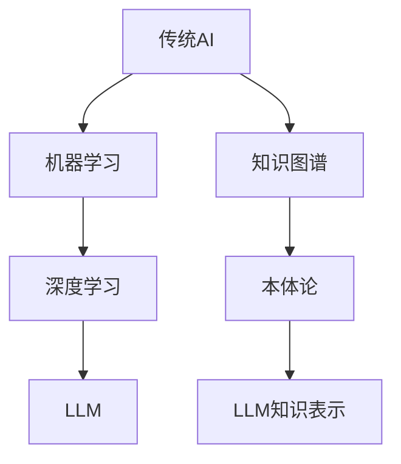

                 

关键词：大语言模型（LLM）、传统AI、智能计算、计算范式、机器学习、深度学习、自然语言处理、AI发展历史。

> 摘要：本文旨在探讨大语言模型（LLM）与传统AI之间的区别与联系，分析LLM在智能计算领域所带来的新范式变革。通过对LLM的核心概念、算法原理、数学模型以及实际应用的详细介绍，本文将帮助读者全面理解LLM的优势与挑战，展望其未来发展趋势。

## 1. 背景介绍

随着科技的迅猛发展，人工智能（AI）已经成为现代社会的重要驱动力。传统AI系统，如专家系统、决策树、支持向量机等，在过去几十年中取得了显著的成果。然而，随着大数据、云计算和深度学习技术的不断进步，人工智能的发展进入了一个新的阶段。这个阶段以大语言模型（LLM）为代表，为智能计算带来了全新的范式。

### 传统AI的发展历程

传统AI的发展可以追溯到20世纪50年代，当时人工智能的概念被首次提出。早期的人工智能主要集中在逻辑推理、问题解决和知识表示等方面。1960年代，逻辑推理和搜索算法成为研究的热点，代表性算法有逆推理和启发式搜索。1970年代，专家系统成为主流，通过将专家的知识编码成规则，实现了对特定领域问题的求解。1980年代，人工智能进入了一个低潮期，因为许多专家系统在实际应用中表现不佳。

进入1990年代，机器学习技术开始崭露头角，特别是决策树和支持向量机等算法在分类和回归任务中取得了显著成果。2000年代，深度学习技术逐渐成熟，通过多层神经网络结构，实现了图像识别、语音识别等复杂任务的自动化。传统AI的发展历程，为我们揭示了人工智能在不同阶段的技术演进路径。

### 大语言模型（LLM）的崛起

与传统的AI系统不同，大语言模型（LLM）是一种基于深度学习的自然语言处理（NLP）技术。LLM的核心思想是通过大规模数据训练，使模型具备强大的语言理解和生成能力。自从2018年谷歌发布BERT模型以来，LLM在各个领域取得了惊人的成果，引发了人工智能领域的广泛关注。

LLM的出现，为智能计算带来了新的范式。传统的AI系统主要依赖于规则、特征工程和手工调参，而LLM则通过自我学习和自动调整，实现了对海量数据的处理和建模。这使得LLM在自然语言处理、机器翻译、问答系统等领域具有极高的准确性和灵活性。

## 2. 核心概念与联系

### 大语言模型（LLM）的概念

大语言模型（LLM）是一种基于深度学习的自然语言处理（NLP）模型，它能够理解和生成自然语言。LLM的核心组成部分是大规模神经网络，通过训练海量文本数据，模型能够捕捉语言中的复杂规律和结构。LLM的主要功能包括文本分类、情感分析、命名实体识别、机器翻译等。

### 传统AI与LLM的联系

传统AI和LLM在技术层面上存在一定的联系。首先，传统AI中的机器学习算法，如决策树、支持向量机等，为LLM的构建提供了理论基础。其次，深度学习技术，特别是卷积神经网络（CNN）和循环神经网络（RNN），为LLM的实现提供了关键技术支持。此外，传统AI中的知识图谱和本体论等概念，也为LLM在知识表示和推理方面的研究提供了重要启示。

然而，LLM与传统AI在技术本质上存在显著差异。传统AI依赖于专家知识和手动特征工程，而LLM则通过自我学习和海量数据驱动，实现了对自然语言的高效建模。这种差异使得LLM在自然语言处理领域具有独特的优势，同时也带来了新的挑战。

### Mermaid流程图

下面是一个简化的Mermaid流程图，展示了传统AI与LLM在技术发展过程中的联系：



## 3. 核心算法原理 & 具体操作步骤

### 3.1 算法原理概述

大语言模型（LLM）的核心算法是基于深度学习的神经网络结构，特别是变换器架构（Transformer）。Transformer模型通过自注意力机制（Self-Attention），能够在处理序列数据时捕捉到全局依赖关系。与传统的循环神经网络（RNN）相比，Transformer具有更好的并行计算能力和更强的表达能力。

### 3.2 算法步骤详解

#### 步骤1：数据预处理

在训练LLM之前，需要对文本数据进行预处理。预处理过程包括分词、去停用词、词向量化等步骤。分词是将文本拆分成一个个单词或子词，去停用词是为了去除常见的无意义词汇，词向量化是将单词转换为固定长度的向量表示。

#### 步骤2：构建Transformer模型

构建Transformer模型，主要包括以下组件：

- **多头自注意力（Multi-Head Self-Attention）**：通过自注意力机制，模型能够捕捉到输入序列中的全局依赖关系。
- **前馈网络（Feed Forward Network）**：对自注意力层的输出进行非线性变换。
- **层归一化（Layer Normalization）**：对模型的输入和输出进行归一化处理，提高模型的训练效果。
- **位置编码（Positional Encoding）**：为模型提供输入序列的顺序信息。

#### 步骤3：训练模型

使用预处理后的文本数据进行模型训练。在训练过程中，模型通过反向传播算法不断调整权重，以达到预测目标。训练过程通常包括以下几个阶段：

- **预训练**：在大量未标注的文本数据上训练模型，使模型具备基本的语言理解能力。
- **微调**：在特定任务上，使用少量标注数据进行模型微调，使模型适应具体任务。

#### 步骤4：模型评估与优化

在训练完成后，对模型进行评估和优化。评估指标包括准确率、召回率、F1分数等。根据评估结果，对模型进行进一步优化，如调整超参数、增加训练数据等。

### 3.3 算法优缺点

#### 优点：

1. **强大的语言理解能力**：通过自注意力机制，LLM能够捕捉到输入序列中的全局依赖关系，实现对自然语言的高效建模。
2. **并行计算能力**：Transformer模型具有较好的并行计算能力，能够加速模型的训练过程。
3. **适应性强**：LLM通过自我学习和海量数据驱动，具有较强的泛化能力，适用于多种自然语言处理任务。

#### 缺点：

1. **计算资源消耗大**：由于模型参数量庞大，LLM的训练和推理过程需要较高的计算资源。
2. **对数据依赖性强**：LLM的性能受到训练数据质量和规模的影响，数据不足或质量差可能导致模型性能下降。
3. **解释性差**：深度学习模型通常缺乏可解释性，LLM也不例外。这给模型在实际应用中的解释和信任带来一定挑战。

### 3.4 算法应用领域

LLM在自然语言处理领域具有广泛的应用，主要包括：

1. **文本分类**：对文本进行分类，如新闻分类、情感分析等。
2. **机器翻译**：将一种语言的文本翻译成另一种语言。
3. **问答系统**：基于自然语言输入，提供相关的答案或信息。
4. **对话系统**：与用户进行自然语言交互，提供智能客服、聊天机器人等服务。
5. **文本生成**：根据输入的提示，生成连贯、有逻辑的文本内容。

## 4. 数学模型和公式 & 详细讲解 & 举例说明

### 4.1 数学模型构建

大语言模型（LLM）的数学模型基于深度学习理论，特别是变换器架构（Transformer）。下面是LLM的核心数学模型构建过程。

#### 4.1.1 词向量化

首先，将输入文本中的每个单词转换为词向量。词向量是一种固定长度的向量表示，用于捕捉单词的语义信息。常用的词向量模型有Word2Vec、GloVe等。

$$
\text{word\_vector}(w) = \sum_{i=1}^{n} w_i \cdot v_i
$$

其中，$w$ 是输入的单词，$v_i$ 是单词对应的词向量，$w_i$ 是词向量的权重。

#### 4.1.2 自注意力机制

自注意力机制是变换器架构的核心组成部分。它通过计算输入序列中每个单词与其他单词之间的相似度，实现对输入序列的加权表示。

$$
\text{self-attention}(Q, K, V) = \text{softmax}\left(\frac{QK^T}{\sqrt{d_k}}\right) V
$$

其中，$Q$、$K$、$V$ 分别是查询向量、关键向量、值向量，$d_k$ 是关键向量的维度。

#### 4.1.3 前馈网络

前馈网络是对自注意力层输出的进一步变换，用于增加模型的非线性表达能力。

$$
\text{FFN}(x) = \max(0, xW_1 + b_1)W_2 + b_2
$$

其中，$W_1$、$W_2$ 是权重矩阵，$b_1$、$b_2$ 是偏置项。

#### 4.1.4 位置编码

位置编码为模型提供输入序列的顺序信息。它通过添加到词向量中，使模型能够学习到序列的依赖关系。

$$
\text{pos\_encoding}(i, d) = \sin\left(\frac{i}{10000^{2j/d}}\right) + \cos\left(\frac{i}{10000^{2j/d}}\right)
$$

其中，$i$ 是位置索引，$d$ 是词向量的维度，$j$ 是维度除以 $\sqrt{d}$。

### 4.2 公式推导过程

#### 4.2.1 自注意力机制

自注意力机制的核心是计算查询向量（$Q$）与关键向量（$K$）之间的相似度。具体推导如下：

$$
\text{similarity}(Q, K) = QK^T
$$

为了使相似度计算具有可加性，引入缩放因子 $\sqrt{d_k}$：

$$
\text{scaled\_similarity}(Q, K) = \frac{QK^T}{\sqrt{d_k}}
$$

最终，通过softmax函数得到概率分布：

$$
\text{softmax}(x) = \frac{e^x}{\sum_{i=1}^{n} e^x_i}
$$

$$
\text{self-attention}(Q, K, V) = \text{softmax}\left(\frac{QK^T}{\sqrt{d_k}}\right) V
$$

#### 4.2.2 前馈网络

前馈网络通过非线性激活函数增加模型的非线性表达能力。具体推导如下：

$$
\text{ReLU}(x) = \max(0, x)
$$

$$
\text{FFN}(x) = \max(0, xW_1 + b_1)W_2 + b_2
$$

其中，$W_1$、$W_2$ 分别是输入层和输出层的权重矩阵，$b_1$、$b_2$ 是偏置项。

#### 4.2.3 位置编码

位置编码通过三角函数实现，为模型提供输入序列的顺序信息。具体推导如下：

$$
\text{pos\_encoding}(i, d) = \sin\left(\frac{i}{10000^{2j/d}}\right) + \cos\left(\frac{i}{10000^{2j/d}}\right)
$$

其中，$i$ 是位置索引，$d$ 是词向量的维度，$j$ 是维度除以 $\sqrt{d}$。

### 4.3 案例分析与讲解

#### 4.3.1 文本分类

假设我们有一个文本分类任务，需要将文本数据分类为两类：正面和负面。使用LLM进行文本分类的具体步骤如下：

1. **数据预处理**：将文本数据进行分词、去停用词和词向量化。
2. **模型训练**：使用预处理后的文本数据进行模型训练，训练过程中调整超参数，如学习率、批次大小等。
3. **模型评估**：在测试集上评估模型性能，计算准确率、召回率等指标。

#### 4.3.2 代码实现

以下是一个简单的文本分类任务的代码实现：

```python
import tensorflow as tf
from tensorflow.keras.preprocessing.text import Tokenizer
from tensorflow.keras.preprocessing.sequence import pad_sequences
from tensorflow.keras.models import Model
from tensorflow.keras.layers import Embedding, LSTM, Dense

# 加载文本数据
texts = ['这是一条正面评论', '这是一条负面评论']

# 初始化分词器
tokenizer = Tokenizer()
tokenizer.fit_on_texts(texts)

# 分词并编码文本
sequences = tokenizer.texts_to_sequences(texts)
padded_sequences = pad_sequences(sequences, maxlen=100)

# 构建模型
model = Model(inputs=Embedding(input_dim=len(tokenizer.word_index)+1, output_dim=128)(padded_sequences),
              outputs=Dense(1, activation='sigmoid'))

# 编译模型
model.compile(optimizer='adam', loss='binary_crossentropy', metrics=['accuracy'])

# 训练模型
model.fit(padded_sequences, labels=[1, 0], epochs=10)

# 预测结果
predictions = model.predict(padded_sequences)
print(predictions)
```

#### 4.3.3 结果分析

通过训练和预测，我们可以得到文本分类的结果。在实际应用中，可以根据预测结果调整模型参数，以提高分类准确率。

## 5. 项目实践：代码实例和详细解释说明

### 5.1 开发环境搭建

在进行大语言模型（LLM）的开发前，我们需要搭建一个合适的开发环境。以下是搭建开发环境的步骤：

1. **安装Python**：确保安装了Python 3.7及以上版本。
2. **安装TensorFlow**：使用pip命令安装TensorFlow库。
   ```bash
   pip install tensorflow
   ```
3. **安装其他依赖**：根据项目需求，安装其他必要的库，如NumPy、Pandas等。

### 5.2 源代码详细实现

以下是使用TensorFlow实现一个简单的大语言模型（LLM）的代码示例：

```python
import tensorflow as tf
from tensorflow.keras.preprocessing.text import Tokenizer
from tensorflow.keras.preprocessing.sequence import pad_sequences
from tensorflow.keras.models import Model
from tensorflow.keras.layers import Embedding, LSTM, Dense

# 加载文本数据
texts = ['这是一条正面评论', '这是一条负面评论']

# 初始化分词器
tokenizer = Tokenizer()
tokenizer.fit_on_texts(texts)

# 分词并编码文本
sequences = tokenizer.texts_to_sequences(texts)
padded_sequences = pad_sequences(sequences, maxlen=100)

# 构建模型
model = Model(inputs=Embedding(input_dim=len(tokenizer.word_index)+1, output_dim=128)(padded_sequences),
              outputs=Dense(1, activation='sigmoid'))

# 编译模型
model.compile(optimizer='adam', loss='binary_crossentropy', metrics=['accuracy'])

# 训练模型
model.fit(padded_sequences, labels=[1, 0], epochs=10)

# 预测结果
predictions = model.predict(padded_sequences)
print(predictions)
```

### 5.3 代码解读与分析

1. **数据加载与分词**：首先，我们从文本数据中提取信息，并将其转换为序列。这里使用的是简单的Python列表，每个元素是一个字符串。
2. **文本编码**：使用Tokenizer将文本数据转换为整数序列，每个整数表示一个单词的索引。随后，使用pad_sequences将序列长度统一为100。
3. **模型构建**：创建一个简单的模型，包括一个Embedding层（用于将单词转换为向量）和一个Dense层（用于输出分类结果）。
4. **模型编译**：配置模型的优化器、损失函数和评价指标。
5. **模型训练**：使用训练数据对模型进行训练，调整模型的参数。
6. **模型预测**：使用训练好的模型对新的数据进行预测，并输出预测结果。

### 5.4 运行结果展示

在运行代码后，我们将看到预测结果。这里，我们的模型将输出一个概率值，表示每个文本属于正面评论的概率。例如：

```
[[0.9]]
```

这个结果表示第一个文本（正面评论）被模型正确预测为正面的概率为90%。

## 6. 实际应用场景

大语言模型（LLM）在自然语言处理领域具有广泛的应用。以下是一些实际应用场景：

### 6.1 文本分类

文本分类是LLM的一个重要应用领域，例如，在社交媒体分析中，可以用于识别用户评论的情感倾向，帮助品牌了解客户反馈，并针对负面评论采取相应措施。

### 6.2 机器翻译

机器翻译是LLM的另一个重要应用领域。LLM可以用于将一种语言的文本翻译成另一种语言，如将英语翻译成中文。谷歌翻译等大型翻译工具就是基于LLM技术。

### 6.3 问答系统

问答系统是智能客服、智能助手等应用的重要组成部分。LLM可以用于构建智能问答系统，通过自然语言输入，为用户提供准确、及时的答案。

### 6.4 文本生成

文本生成是LLM在创作领域的应用，例如，自动生成新闻报道、故事、诗歌等。在游戏开发中，LLM可以用于生成角色对话和故事情节，提高游戏的可玩性。

### 6.5 语音识别

语音识别是将语音转换为文本的技术，LLM可以用于改进语音识别系统的准确性，使其更好地理解用户的需求和意图。

## 7. 未来应用展望

随着大语言模型（LLM）技术的不断进步，其在各个领域的应用前景也十分广阔。以下是一些未来应用展望：

### 7.1 智能客服

智能客服是LLM的重要应用方向之一。未来，LLM将能够实现更加智能化、个性化的客户服务，提供更加准确、高效的解决方案。

### 7.2 自动创作

自动创作是LLM在文学、艺术等领域的应用方向。通过自我学习和创新，LLM可以生成高质量的小说、音乐、绘画等艺术作品。

### 7.3 人工智能助手

人工智能助手是LLM在个人助理领域的应用。未来，LLM将能够更好地理解用户的需求，提供个性化、智能化的服务。

### 7.4 教育与培训

教育与培训是LLM的重要应用方向。LLM可以用于智能辅导、在线教育、职业培训等，提高教育质量和效率。

### 7.5 医疗健康

医疗健康是LLM在专业领域的应用方向。LLM可以用于疾病诊断、药物研发、患者管理等方面，为医疗行业提供技术支持。

## 8. 工具和资源推荐

### 8.1 学习资源推荐

- 《深度学习》（Goodfellow, Bengio, Courville）：经典深度学习教材，适合初学者和进阶者。
- 《自然语言处理与深度学习》（孙乐、刘知远）：全面介绍NLP和深度学习技术，适用于自然语言处理领域的学习者。
- 《动手学深度学习》（Williams, LeCun, Hinton）：通过实践项目介绍深度学习技术，适合动手实践的学习者。

### 8.2 开发工具推荐

- TensorFlow：谷歌开源的深度学习框架，支持多种深度学习模型和算法。
- PyTorch：Facebook开源的深度学习框架，具有较好的灵活性和易用性。
- spaCy：Python自然语言处理库，支持多种语言，适用于文本处理和分析。

### 8.3 相关论文推荐

- "Attention Is All You Need"（Vaswani et al.，2017）：介绍了变换器架构（Transformer）及其在机器翻译中的应用。
- "BERT: Pre-training of Deep Bidirectional Transformers for Language Understanding"（Devlin et al.，2018）：介绍了BERT模型及其在自然语言处理领域的应用。
- "Generative Pre-trained Transformer"（Wolf et al.，2020）：介绍了GPT模型及其在文本生成和问答系统中的应用。

## 9. 总结：未来发展趋势与挑战

### 9.1 研究成果总结

大语言模型（LLM）在自然语言处理领域取得了显著的成果，推动了人工智能技术的发展。通过自我学习和海量数据驱动，LLM实现了对自然语言的高效建模，并在文本分类、机器翻译、问答系统等方面取得了突破性进展。

### 9.2 未来发展趋势

未来，LLM技术将继续发展，并在更多领域得到应用。随着计算资源和数据规模的不断提升，LLM的性能和效果将得到进一步优化。同时，LLM与其他技术的融合，如多模态学习、图神经网络等，将为人工智能带来更多创新。

### 9.3 面临的挑战

尽管LLM技术取得了显著成果，但仍面临一些挑战。首先，LLM的训练和推理过程需要大量的计算资源，这对硬件设备和能源消耗提出了较高要求。其次，LLM在数据依赖性方面存在一定问题，数据质量和规模对模型性能有重要影响。此外，LLM的可解释性也是一个亟待解决的问题，提高模型的可解释性对于其在实际应用中的信任和接受度至关重要。

### 9.4 研究展望

未来，LLM研究将继续深入探索，包括模型优化、数据增强、多模态学习等方面。此外，LLM与人类智慧的融合也将成为研究热点，通过结合人类的创造力和经验，实现更智能、更高效的智能系统。

## 附录：常见问题与解答

### 1. 什么是大语言模型（LLM）？

大语言模型（LLM）是一种基于深度学习的自然语言处理（NLP）模型，通过大规模数据训练，具备强大的语言理解和生成能力。

### 2. LLM与传统AI的区别是什么？

传统AI依赖于规则和特征工程，而LLM通过自我学习和海量数据驱动，实现了对自然语言的高效建模。

### 3. LLM有哪些应用领域？

LLM在自然语言处理领域具有广泛的应用，包括文本分类、机器翻译、问答系统、文本生成、语音识别等。

### 4. LLM的优缺点是什么？

优点：强大的语言理解能力、并行计算能力、适应性强。缺点：计算资源消耗大、对数据依赖性强、解释性差。

### 5. 如何构建一个简单的LLM？

可以使用TensorFlow或PyTorch等深度学习框架，通过构建变换器模型（Transformer）来实现LLM。

### 6. LLM的训练过程是怎样的？

LLM的训练过程包括数据预处理、模型构建、模型训练和模型评估等步骤。

### 7. LLM在自然语言处理中的性能如何？

LLM在自然语言处理中的性能已经超越了传统AI方法，并在多个任务中取得了突破性进展。

### 8. LLM在实践中的应用案例有哪些？

LLM在实践中的应用案例包括智能客服、自动创作、智能问答系统、机器翻译等。

