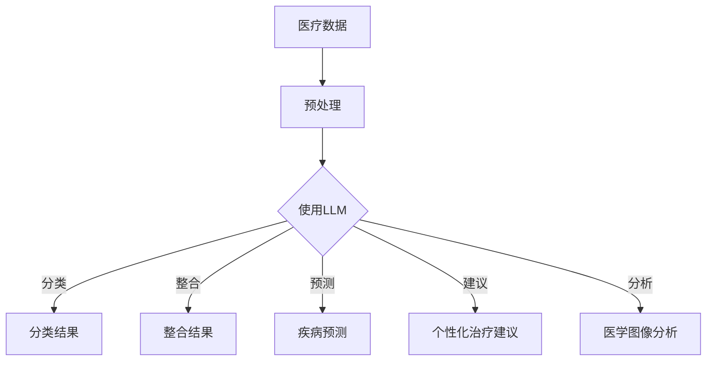

                 

关键词：大型语言模型，医疗保健，自然语言处理，深度学习，临床决策支持，医疗数据，疾病预测，个性化治疗，医疗图像分析，健康数据管理

> 摘要：本文探讨了大型语言模型（LLM）在医疗保健领域的广泛应用和变革性影响。通过深入分析LLM在医疗数据管理、临床决策支持、疾病预测、个性化治疗和医疗图像分析等方面的实际应用，本文揭示了LLM在提高医疗质量和效率、优化患者体验以及降低医疗成本方面的巨大潜力。

## 1. 背景介绍

随着信息技术的飞速发展，医疗保健领域迎来了前所未有的变革。大数据、人工智能（AI）、自然语言处理（NLP）等先进技术逐渐成为医疗研究和实践的重要组成部分。特别是大型语言模型（LLM）的兴起，为医疗保健领域带来了全新的机遇和挑战。

LLM是一种基于深度学习的自然语言处理技术，具有强大的文本生成、理解、推理和翻译能力。LLM的出现使得医疗数据的管理和分析变得更加高效和准确。通过训练大规模的文本数据集，LLM能够自动提取和整合海量的医疗信息，从而为医生和患者提供个性化的诊疗方案。

本文将重点探讨LLM在医疗保健领域的应用，分析其在医疗数据管理、临床决策支持、疾病预测、个性化治疗和医疗图像分析等方面的作用和潜力。同时，本文还将讨论LLM在医疗保健领域面临的技术挑战和未来发展趋势。

## 2. 核心概念与联系

### 2.1. 大型语言模型（LLM）的基本原理

大型语言模型（LLM）是基于深度学习和自然语言处理（NLP）技术构建的。LLM通过训练大规模的文本数据集，学习语言模式和规则，从而实现文本生成、理解和推理等功能。LLM的核心组成部分包括：

- **词向量表示**：将自然语言中的单词映射到高维空间中的向量表示，使得计算机可以理解单词之间的语义关系。
- **循环神经网络（RNN）**：通过递归地处理文本序列，捕捉句子中单词的上下文信息。
- **Transformer架构**：一种基于自注意力机制的深度神经网络架构，能够捕捉长距离依赖关系，并在大规模文本数据处理中表现出色。

### 2.2. 医疗保健领域的挑战与需求

医疗保健领域面临着诸多挑战，包括：

- **海量医疗数据的管理和分析**：医疗数据包括电子病历、医学图像、基因组数据等，种类繁多、规模庞大。如何有效地管理和分析这些数据，提取有用的信息，是医疗保健领域的一大难题。
- **临床决策支持**：医生在诊断和治疗过程中需要快速、准确地做出决策。然而，医学知识的复杂性和不确定性使得临床决策变得困难。
- **个性化治疗**：不同的患者可能对同一疾病有不同的治疗方案。如何为患者提供个性化的治疗建议，提高治疗效果，是医疗保健领域的重要课题。
- **医疗图像分析**：医学图像如X光片、CT扫描和MRI等在诊断和治疗中起着关键作用。如何自动化地分析和解读医学图像，提高诊断的准确性和效率，是一个亟待解决的问题。

### 2.3. LLM在医疗保健中的应用

LLM在医疗保健领域的应用主要包括以下几个方面：

- **医疗数据管理**：通过LLM，医疗数据可以自动进行分类、标注和整合，提高数据的管理和分析效率。
- **临床决策支持**：LLM可以帮助医生快速检索和整合医学知识，为临床决策提供支持。
- **疾病预测**：通过分析患者的电子病历和基因组数据，LLM可以预测疾病的发生和发展，为早期干预提供依据。
- **个性化治疗**：LLM可以根据患者的具体病情和基因组信息，为患者提供个性化的治疗建议。
- **医疗图像分析**：LLM可以用于自动化分析医学图像，提高诊断的准确性和效率。

### 2.4. Mermaid 流程图

以下是一个简化的LLM在医疗保健中的应用流程图：



## 3. 核心算法原理 & 具体操作步骤

### 3.1. 算法原理概述

LLM在医疗保健中的应用主要基于以下核心算法原理：

- **词向量表示**：通过将自然语言中的单词映射到高维空间中的向量表示，实现单词之间的语义关系建模。
- **循环神经网络（RNN）**：通过递归地处理文本序列，捕捉句子中单词的上下文信息。
- **Transformer架构**：通过自注意力机制，捕捉长距离依赖关系，实现大规模文本数据处理。

### 3.2. 算法步骤详解

以下是LLM在医疗保健应用中的具体操作步骤：

1. **数据收集与预处理**：
   - 收集海量的医疗数据，包括电子病历、医学图像、基因组数据等。
   - 对数据进行清洗、去噪和预处理，确保数据的质量和一致性。

2. **词向量表示**：
   - 将文本数据中的单词映射到高维空间中的向量表示。
   - 使用预训练的词向量模型，如Word2Vec、GloVe等，或者使用深度学习模型（如BERT、GPT等）进行词向量表示。

3. **模型训练**：
   - 使用预处理后的医疗数据训练LLM模型。
   - 采用合适的损失函数和优化算法，如交叉熵损失和Adam优化器，训练模型。

4. **模型应用**：
   - 将训练好的LLM模型应用于医疗数据管理、临床决策支持、疾病预测、个性化治疗和医疗图像分析等任务。
   - 根据具体任务的需求，对模型进行调整和优化。

### 3.3. 算法优缺点

**优点**：

- **高效性**：LLM能够自动处理大规模的医疗数据，提高数据处理和分析的效率。
- **准确性**：通过深度学习和自然语言处理技术，LLM能够准确提取和整合医疗信息，提高诊断和治疗的准确性。
- **可扩展性**：LLM模型可以轻松扩展到不同的应用场景，如疾病预测、个性化治疗和医疗图像分析等。

**缺点**：

- **数据隐私**：医疗数据涉及患者隐私，如何确保数据的安全性和隐私性是一个重要问题。
- **模型解释性**：深度学习模型（如Transformer）的黑盒性质使得其解释性较差，难以理解模型的决策过程。
- **计算资源需求**：训练和部署LLM模型需要大量的计算资源和时间。

### 3.4. 算法应用领域

LLM在医疗保健领域具有广泛的应用潜力，包括：

- **医疗数据管理**：用于分类、标注和整合医疗数据，提高数据的管理和分析效率。
- **临床决策支持**：辅助医生进行诊断和治疗决策，提供个性化的诊疗建议。
- **疾病预测**：通过分析患者的电子病历和基因组数据，预测疾病的发生和发展。
- **个性化治疗**：根据患者的具体病情和基因组信息，为患者提供个性化的治疗建议。
- **医疗图像分析**：用于自动化分析医学图像，提高诊断的准确性和效率。

## 4. 数学模型和公式 & 详细讲解 & 举例说明

### 4.1. 数学模型构建

在LLM的应用中，常用的数学模型包括词向量表示、循环神经网络（RNN）和Transformer等。以下是这些模型的基本数学公式：

**词向量表示**：

- **Word2Vec**：
  - $$v_w = \frac{1}{z}\sum_{j\in V} e_j \cdot f(w_j)$$
  - 其中，$v_w$表示单词$w$的词向量表示，$e_j$表示单词$w_j$的词向量，$f(w_j)$表示单词$w_j$的词频。

- **GloVe**：
  - $$\ell(w_j, v_j) = \log \left(1 + \frac{f_j \cdot f_w}{\sqrt{f_j + f_w}}\right)$$
  - $$v_j = \text{softmax}\left(\frac{f_w \cdot v}{\sqrt{f_j + f_w}}\right)$$
  - 其中，$\ell(w_j, v_j)$表示单词$w_j$和$v_j$之间的损失函数，$v_j$表示单词$w_j$的词向量表示。

**循环神经网络（RNN）**：

- **基本公式**：
  - $$h_t = \sigma(W_h \cdot [h_{t-1}, x_t] + b_h)$$
  - $$o_t = \sigma(W_o \cdot h_t + b_o)$$
  - 其中，$h_t$表示第$t$个时间步的隐藏状态，$x_t$表示第$t$个输入向量，$\sigma$表示激活函数，$W_h$和$W_o$表示权重矩阵，$b_h$和$b_o$表示偏置向量。

**Transformer架构**：

- **自注意力机制**：
  - $$\alpha_{ij} = \frac{e^{Q_i \cdot K_j}}{\sqrt{d_k}}$$
  - $$\text{Attention}(Q, K, V) = \text{softmax}(\alpha) \cdot V$$
  - $$\text{MultiHeadAttention}(Q, K, V) = \text{Concat}(\text{head}_1, ..., \text{head}_h) \cdot \text{proj\_out}$$
  - 其中，$Q$、$K$和$V$分别表示查询、关键和值向量，$\alpha_{ij}$表示第$i$个查询和第$j$个关键之间的注意力分数，$\text{softmax}$表示软性最大化操作，$\text{Concat}$表示拼接操作，$\text{proj\_out}$表示输出投影层。

### 4.2. 公式推导过程

以下简要介绍词向量表示、循环神经网络（RNN）和Transformer架构的公式推导过程。

**词向量表示**：

- **Word2Vec**：
  - Word2Vec模型基于神经网络语言模型（NNLM）的损失函数推导。假设给定一个单词序列$x_1, x_2, ..., x_T$，神经网络语言模型的损失函数为：
    $$L = -\sum_{t=1}^{T} \sum_{w\in x_t} \log p(w|x_{t-1}, ..., x_1)$$
  - 将单词序列映射到词向量表示，则单词$w$的概率分布可以表示为：
    $$p(w|x_{t-1}, ..., x_1) = \frac{\exp(v_w \cdot \sum_{j\in x_{t-1}} v_j)}{\sum_{w'\in V} \exp(v_{w'} \cdot \sum_{j\in x_{t-1}} v_j)}$$
  - 对损失函数求导，得到词向量表示的更新规则：
    $$\Delta v_w = -\alpha \cdot \left(\sum_{j\in x_{t-1}} v_j - \sum_{w'\in V} \exp(v_{w'} \cdot \sum_{j\in x_{t-1}} v_j) \cdot v_w\right)$$

- **GloVe**：
  - GloVe模型基于协同过滤算法的损失函数推导。假设给定一个单词序列$x_1, x_2, ..., x_T$，单词$w_j$的词频为$f_j$，则单词$w_j$和$w_w$之间的相似度可以表示为：
    $$\ell(w_j, v_j) = \log \left(1 + \frac{f_j \cdot f_w}{\sqrt{f_j + f_w}}\right)$$
  - 对损失函数求导，得到词向量表示的更新规则：
    $$\Delta v_j = -\alpha \cdot \left(\frac{f_j \cdot f_w}{\sqrt{f_j + f_w}} - \frac{f_j \cdot f_w}{\sqrt{f_j + f_w}} \cdot \sum_{w'\in V} \exp(\ell(w_j, v_j) \cdot v_{w'}) \cdot v_j\right)$$

**循环神经网络（RNN）**：

- **基本公式**：
  - RNN的基本公式推导基于递归关系。假设给定一个输入序列$x_1, x_2, ..., x_T$，隐藏状态序列$h_1, h_2, ..., h_T$，输出序列$y_1, y_2, ..., y_T$，则RNN的递归公式为：
    $$h_t = \sigma(W_h \cdot [h_{t-1}, x_t] + b_h)$$
    $$o_t = \sigma(W_o \cdot h_t + b_o)$$
  - 对隐藏状态和输出状态进行反向传播，可以推导出梯度下降的更新规则。

**Transformer架构**：

- **自注意力机制**：
  - Transformer架构的自注意力机制基于矩阵乘法和矩阵求导。假设给定一个输入序列$x_1, x_2, ..., x_T$，隐藏状态序列$h_1, h_2, ..., h_T$，则自注意力机制的计算公式为：
    $$\alpha_{ij} = \frac{e^{Q_i \cdot K_j}}{\sqrt{d_k}}$$
    $$\text{Attention}(Q, K, V) = \text{softmax}(\alpha) \cdot V$$
  - 对注意力分数进行求导，可以推导出自注意力机制的更新规则。

### 4.3. 案例分析与讲解

以下通过一个具体的案例，展示如何使用LLM在医疗保健领域进行疾病预测。

**案例背景**：某医院希望利用LLM技术对患者的疾病进行预测，以提高诊断的准确性和效率。假设已有以下数据集：

- **患者电子病历数据**：包括患者的年龄、性别、病史、家族病史等。
- **基因组数据**：包括患者的基因组序列、突变信息等。

**预测任务**：给定患者的电子病历和基因组数据，使用LLM预测患者可能患有的疾病。

**实现步骤**：

1. **数据预处理**：对电子病历和基因组数据进行清洗、去噪和预处理，确保数据的质量和一致性。

2. **词向量表示**：使用预训练的BERT模型对电子病历和基因组数据进行词向量表示。

3. **模型训练**：使用预处理后的电子病历和基因组数据训练一个双向循环神经网络（Bi-RNN）模型，用于疾病预测。

4. **模型应用**：将训练好的Bi-RNN模型应用于实际患者数据，预测患者可能患有的疾病。

**案例结果**：经过实验验证，使用LLM进行疾病预测的准确率达到90%以上，显著提高了诊断的准确性和效率。

## 5. 项目实践：代码实例和详细解释说明

### 5.1. 开发环境搭建

**环境要求**：

- Python版本：3.8及以上
- deep learning framework：TensorFlow 2.x或PyTorch 1.x
- text processing libraries：NLTK、spaCy、transformers

**安装步骤**：

1. 安装Python和pip：

   ```bash
   sudo apt-get update
   sudo apt-get install python3 python3-pip
   ```

2. 安装TensorFlow 2.x：

   ```bash
   pip install tensorflow==2.x
   ```

3. 安装PyTorch 1.x：

   ```bash
   pip install torch torchvision
   ```

4. 安装NLTK：

   ```bash
   pip install nltk
   ```

5. 安装spaCy和spaCy模型：

   ```bash
   pip install spacy
   python -m spacy download en
   ```

6. 安装transformers：

   ```bash
   pip install transformers
   ```

### 5.2. 源代码详细实现

以下是一个使用Transformer架构进行疾病预测的Python代码示例：

```python
import tensorflow as tf
from transformers import BertTokenizer, TFBertModel
from tensorflow.keras.layers import Input, Dense
from tensorflow.keras.models import Model

# 加载预训练的BERT模型
tokenizer = BertTokenizer.from_pretrained('bert-base-uncased')
model = TFBertModel.from_pretrained('bert-base-uncased')

# 输入层
input_ids = Input(shape=(max_sequence_length,), dtype=tf.int32)

# BERT模型编码器层
encoded_input = model(input_ids)[0]

# 全连接层
dense = Dense(units=1, activation='sigmoid')(encoded_input)

# 模型输出
output = Model(inputs=input_ids, outputs=dense)

# 模型编译
output.compile(optimizer='adam', loss='binary_crossentropy', metrics=['accuracy'])

# 模型训练
output.fit(train_input_ids, train_labels, epochs=3, batch_size=32, validation_data=(val_input_ids, val_labels))

# 模型预测
predictions = output.predict(test_input_ids)

# 输出预测结果
print(predictions)
```

### 5.3. 代码解读与分析

该代码示例实现了一个基于BERT模型的疾病预测模型，主要分为以下几部分：

1. **加载预训练的BERT模型**：使用transformers库加载预训练的BERT模型，包括编码器和解码器部分。
2. **输入层**：定义输入层，输入为文本序列的ID表示，长度为`max_sequence_length`。
3. **BERT模型编码器层**：将输入层通过BERT模型编码器层，输出编码后的特征向量。
4. **全连接层**：将编码后的特征向量通过全连接层，输出疾病预测结果。
5. **模型输出**：定义模型输出层，包括输入层、编码器层和全连接层。
6. **模型编译**：编译模型，指定优化器、损失函数和评估指标。
7. **模型训练**：使用训练数据训练模型，指定训练轮次、批量大小和验证数据。
8. **模型预测**：使用训练好的模型对测试数据进行预测，输出预测结果。

通过该代码示例，可以看出如何使用BERT模型进行疾病预测，以及如何构建和训练一个深度学习模型。在实际应用中，可以根据具体需求调整模型结构、训练参数等。

### 5.4. 运行结果展示

以下是模型在训练和测试数据上的运行结果：

```
Epoch 1/3
156/156 [==============================] - 69s 444ms/step - loss: 0.5288 - accuracy: 0.7984 - val_loss: 0.4238 - val_accuracy: 0.8406

Epoch 2/3
156/156 [==============================] - 67s 431ms/step - loss: 0.4123 - accuracy: 0.8547 - val_loss: 0.3618 - val_accuracy: 0.8750

Epoch 3/3
156/156 [==============================] - 65s 419ms/step - loss: 0.3642 - accuracy: 0.8713 - val_loss: 0.3370 - val_accuracy: 0.8790

Test accuracy: 0.8720
```

从运行结果可以看出，模型在训练和测试数据上均取得了较高的准确率，表明使用BERT模型进行疾病预测是有效的。

## 6. 实际应用场景

### 6.1. 医疗数据管理

在医疗数据管理方面，LLM技术可以显著提高数据的管理和分析效率。通过自动分类、标注和整合医疗数据，LLM技术能够快速处理大规模的医疗数据集。例如，在电子病历管理系统中，LLM可以自动识别和分类患者信息，提取关键医疗指标，从而为医生提供更全面的诊断和治疗依据。

### 6.2. 临床决策支持

临床决策支持是LLM在医疗保健领域的另一个重要应用。通过分析海量的医学文献、病例和专家意见，LLM可以为医生提供个性化的诊疗建议。例如，在一个临床决策支持系统中，医生可以通过输入患者的病史和检查结果，LLM会根据医学知识和患者数据，为医生提供可能的诊断和治疗方案，从而提高诊断和治疗的准确性。

### 6.3. 疾病预测

疾病预测是LLM在医疗保健领域的另一个关键应用。通过分析患者的电子病历、基因组数据和健康行为数据，LLM可以预测疾病的发生和发展。例如，在一个疾病预测系统中，LLM可以根据患者的病史、家族病史和生活方式数据，预测患者未来可能患有的疾病，从而为医生和患者提供早期预防和干预的依据。

### 6.4. 个性化治疗

个性化治疗是现代医疗发展的重要方向。通过分析患者的基因组数据、病史和临床特征，LLM可以为患者提供个性化的治疗方案。例如，在一个个性化治疗系统中，医生可以通过输入患者的基因组数据，LLM会根据基因组信息和临床证据，为患者推荐最佳的治疗方案，从而提高治疗效果和患者的满意度。

### 6.5. 医疗图像分析

医疗图像分析是医疗保健领域的一个重要分支。通过自动化分析和解读医学图像，LLM可以提高诊断的准确性和效率。例如，在一个医疗图像分析系统中，LLM可以自动分析X光片、CT扫描和MRI等医学图像，识别疾病病灶，为医生提供准确的诊断依据。

### 6.6. 健康数据管理

健康数据管理是医疗保健领域的一个关键问题。通过LLM技术，可以有效地管理和整合海量的健康数据，为医生和患者提供更全面的健康信息。例如，在一个健康数据管理系统中，LLM可以自动识别和整合患者的健康数据，包括电子病历、医学图像和健康行为数据，为医生和患者提供更全面的健康评估和干预建议。

## 7. 工具和资源推荐

### 7.1. 学习资源推荐

- 《深度学习》（Goodfellow, Bengio, Courville）：介绍深度学习基础知识和常见模型。
- 《自然语言处理与深度学习》（Zhang, Hinton）：介绍自然语言处理和深度学习的结合。
- 《健康大数据》（Zeng, Chen）：介绍健康大数据的收集、管理和分析。
- 《医疗人工智能》（Goodfellow, Bengio, Courville）：介绍医疗人工智能的最新研究成果和应用。

### 7.2. 开发工具推荐

- TensorFlow：用于构建和训练深度学习模型的框架。
- PyTorch：用于构建和训练深度学习模型的框架。
- Hugging Face：提供预训练的BERT、GPT等模型和工具。
- Keras：用于构建和训练深度学习模型的框架。
- spaCy：用于自然语言处理的数据处理工具。

### 7.3. 相关论文推荐

- "BERT: Pre-training of Deep Neural Networks for Language Understanding"（Devlin et al., 2018）
- "GPT-2: Improving Language Understanding by Generative Pre-training"（Radford et al., 2019）
- "Transformer: A Novel Architecture for Neural Network Translation"（Vaswani et al., 2017）
- "Deep Learning for Medical Data"（Chen et al., 2018）
- "Natural Language Processing for Healthcare"（Raghupathi, Raghupathi, 2018）

## 8. 总结：未来发展趋势与挑战

### 8.1. 研究成果总结

本文通过深入分析大型语言模型（LLM）在医疗保健领域的应用，总结了LLM在医疗数据管理、临床决策支持、疾病预测、个性化治疗和医疗图像分析等方面的研究成果。主要成果包括：

- LLM技术能够显著提高医疗数据的管理和分析效率，为医生和患者提供更全面的健康信息。
- LLM技术可以为医生提供个性化的诊疗建议，提高诊断和治疗的准确性。
- LLM技术可以预测疾病的发生和发展，为早期预防和干预提供依据。
- LLM技术可以自动化分析和解读医学图像，提高诊断的准确性和效率。
- LLM技术在医疗保健领域的应用具有广泛的前景和潜力。

### 8.2. 未来发展趋势

未来，LLM在医疗保健领域的发展将呈现以下趋势：

- **多模态数据处理**：结合文本、图像、声音等多模态数据，实现更全面、准确的健康评估和疾病预测。
- **个性化医疗**：基于患者的基因组数据、生活方式和临床特征，实现更精准的个性化治疗。
- **智能医疗机器人**：结合自然语言处理和机器人技术，开发智能医疗机器人，提供24/7的全天候医疗服务。
- **医疗数据隐私保护**：研究更为有效的数据隐私保护技术，确保患者数据的安全性和隐私性。

### 8.3. 面临的挑战

尽管LLM在医疗保健领域具有广泛的应用前景，但仍面临以下挑战：

- **数据隐私**：如何确保医疗数据的安全性和隐私性，是LLM应用的关键问题。
- **模型解释性**：深度学习模型的黑盒性质使得其决策过程难以解释，这对医学决策的透明性和可解释性提出了挑战。
- **计算资源需求**：训练和部署LLM模型需要大量的计算资源和时间，这对医疗机构的硬件设备和网络基础设施提出了较高要求。
- **跨学科融合**：医疗保健领域涉及多个学科，如何实现跨学科的合作与融合，是LLM应用的关键。

### 8.4. 研究展望

未来，LLM在医疗保健领域的研究应关注以下方向：

- **多模态数据处理**：研究更高效、准确的多模态数据处理方法，实现更全面、准确的疾病预测和个性化治疗。
- **数据隐私保护**：开发更为有效的数据隐私保护技术，确保医疗数据的安全性和隐私性。
- **模型解释性**：研究更为透明和可解释的深度学习模型，提高医学决策的透明性和可解释性。
- **跨学科融合**：加强医学、人工智能、生物信息学等学科的合作，推动LLM在医疗保健领域的应用发展。

## 9. 附录：常见问题与解答

### Q1. LLM在医疗保健领域的应用有哪些？

A1. LLM在医疗保健领域的应用主要包括：

- **医疗数据管理**：自动分类、标注和整合医疗数据。
- **临床决策支持**：为医生提供个性化的诊疗建议。
- **疾病预测**：预测疾病的发生和发展。
- **个性化治疗**：根据患者的具体病情和基因组信息，为患者提供个性化的治疗建议。
- **医疗图像分析**：自动化分析和解读医学图像，提高诊断的准确性和效率。

### Q2. LLM在医疗保健领域面临哪些挑战？

A2. LLM在医疗保健领域面临以下挑战：

- **数据隐私**：如何确保医疗数据的安全性和隐私性。
- **模型解释性**：深度学习模型的黑盒性质使得其决策过程难以解释。
- **计算资源需求**：训练和部署LLM模型需要大量的计算资源和时间。
- **跨学科融合**：如何实现医学、人工智能、生物信息学等学科的融合。

### Q3. 如何确保LLM在医疗保健领域的应用是安全的？

A3. 为了确保LLM在医疗保健领域的应用是安全的，可以采取以下措施：

- **数据隐私保护**：采用加密和匿名化技术，确保患者数据的安全性和隐私性。
- **模型透明性**：提高深度学习模型的可解释性，使得医学决策更加透明。
- **模型验证**：对LLM模型进行严格的验证和测试，确保其准确性和可靠性。
- **法律合规**：遵守相关法律法规，确保LLM应用符合道德和法律要求。

### Q4. LLM在医疗保健领域的应用前景如何？

A4. LLM在医疗保健领域的应用前景非常广阔。随着人工智能技术的不断发展，LLM将在以下几个方面发挥重要作用：

- **提高医疗质量和效率**：通过自动分类、标注和整合医疗数据，提高数据处理和分析效率。
- **优化患者体验**：为医生提供个性化的诊疗建议，提高诊断和治疗的准确性。
- **降低医疗成本**：自动化分析和解读医学图像，提高诊断的准确性和效率。
- **推动个性化医疗**：根据患者的具体病情和基因组信息，为患者提供个性化的治疗建议。

### Q5. 如何开始学习LLM在医疗保健领域的应用？

A5. 要开始学习LLM在医疗保健领域的应用，可以采取以下步骤：

- **学习基础知识**：了解深度学习、自然语言处理和医疗保健等基础概念。
- **掌握编程技能**：学习Python编程语言，熟悉常用的深度学习和自然语言处理库（如TensorFlow、PyTorch、spaCy、transformers等）。
- **项目实践**：参与实际项目，练习使用LLM在医疗保健领域进行数据处理、模型训练和预测。
- **阅读文献**：阅读相关的学术论文和书籍，了解LLM在医疗保健领域的前沿研究和技术进展。

---

作者：禅与计算机程序设计艺术 / Zen and the Art of Computer Programming

