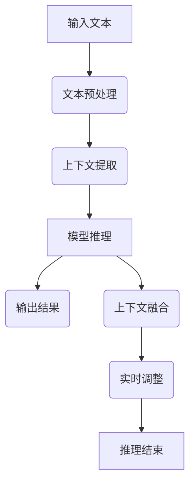

                 

关键词：大型语言模型、推理能力、上下文、训练时间、推理时间、总训练时间、上下文融合、推理策略、动态规划、数学模型、深度学习、神经网络、计算机视觉、自然语言处理、数据处理、机器学习、人工智能

## 摘要

本文旨在探讨大型语言模型（LLM）在推理能力上的表现，特别是上下文（Context）和训练时间（Training Time）对推理过程的影响。文章首先介绍了LLM的基本概念和推理机制，然后深入分析了上下文融合（CoT, Contextualization of Time）和训练时间优化（ToT, Training Time Optimization）对推理能力提升的关键作用。接下来，本文通过数学模型和具体案例，详细讲解了如何提升LLM的推理能力，并展望了未来的发展趋势和面临的挑战。

## 1. 背景介绍

近年来，随着人工智能技术的快速发展，尤其是深度学习和神经网络技术的突破，大型语言模型（LLM）取得了显著的进展。LLM是一种基于大规模语料库训练的模型，能够理解和生成自然语言，广泛应用于自然语言处理、机器翻译、文本生成、问答系统等领域。然而，随着模型规模的不断扩大，LLM的推理能力也面临着新的挑战。

推理能力是LLM的核心指标之一，它直接关系到模型在现实世界中的表现。推理能力包括理解能力、关联能力、推理能力等。在LLM中，推理能力主要体现在上下文理解和实时推理两个方面。上下文理解能力是指模型能够从大量文本中提取关键信息，并对其进行整合和理解；实时推理能力则是指模型能够在给定的时间内，对输入的文本进行快速准确的推理。

然而，随着模型规模的增加，上下文理解和实时推理的时间也在不断增加，这对LLM的实际应用提出了严峻的挑战。因此，如何提升LLM的推理能力，成为当前人工智能领域的研究热点之一。

## 2. 核心概念与联系

为了深入理解LLM的推理能力，我们需要先了解几个核心概念：上下文（Context）、训练时间（Training Time）、推理时间（Inference Time）和总训练时间（Total Training Time）。

### 2.1 上下文（Context）

上下文是指模型在推理过程中所依赖的信息环境。对于LLM来说，上下文包括文本的上下文、时间上下文、情境上下文等。上下文的理解能力直接关系到LLM的推理准确性。

### 2.2 训练时间（Training Time）

训练时间是模型在训练过程中所花费的时间。训练时间包括数据预处理时间、模型训练时间和模型调优时间等。训练时间的长短直接影响模型的性能和效果。

### 2.3 推理时间（Inference Time）

推理时间是模型在推理过程中所花费的时间。推理时间包括模型加载时间、输入预处理时间、推理计算时间和输出生成时间等。推理时间的长短直接关系到模型的应用场景。

### 2.4 总训练时间（Total Training Time）

总训练时间是指模型从开始训练到完成训练所花费的总时间。总训练时间包括训练时间和其他辅助时间的总和。

### 2.5 上下文融合（CoT）

上下文融合是指模型在推理过程中，将上下文信息与输入文本进行整合和理解的过程。上下文融合能力是提升LLM推理能力的关键。

### 2.6 训练时间优化（ToT）

训练时间优化是指通过优化训练策略、算法和硬件设备等，降低模型的训练时间，从而提高模型性能。

### 2.7 Mermaid 流程图

以下是一个简单的Mermaid流程图，展示了LLM的推理过程和上下文融合策略：



### 2.8 核心算法原理

LLM的推理能力主要基于深度学习神经网络。神经网络通过多层非线性变换，将输入的文本数据转化为输出。以下是LLM的核心算法原理：

1. **词嵌入（Word Embedding）**：将输入的文本转化为向量表示。
2. **卷积神经网络（CNN）**：提取文本的特征信息。
3. **循环神经网络（RNN）**：处理序列数据，捕捉文本的时序信息。
4. **门控循环单元（GRU）**：改进RNN，解决梯度消失问题。
5. **长短时记忆网络（LSTM）**：进一步改进RNN，捕捉长距离依赖关系。
6. **自注意力机制（Self-Attention）**：提升模型对上下文的理解能力。

## 3. 核心算法原理 & 具体操作步骤

### 3.1 算法原理概述

LLM的算法原理主要基于深度学习神经网络。以下是LLM的核心算法原理：

1. **词嵌入（Word Embedding）**：词嵌入是将文本中的单词转化为向量表示。词嵌入能够捕捉单词的语义信息，提高模型的语义理解能力。

2. **卷积神经网络（CNN）**：卷积神经网络主要用于提取文本的特征信息。通过卷积操作，模型能够从文本中提取局部特征。

3. **循环神经网络（RNN）**：循环神经网络能够处理序列数据，捕捉文本的时序信息。RNN通过隐藏状态将前一个时间步的信息传递到当前时间步，实现序列数据的处理。

4. **门控循环单元（GRU）**：门控循环单元是RNN的改进版本，通过引入门控机制，解决RNN的梯度消失问题。

5. **长短时记忆网络（LSTM）**：长短时记忆网络进一步改进RNN，通过引入记忆单元和门控机制，捕捉长距离依赖关系。

6. **自注意力机制（Self-Attention）**：自注意力机制是一种用于捕捉文本上下文信息的机制。通过自注意力，模型能够自适应地关注文本中的关键信息。

### 3.2 算法步骤详解

以下是LLM的具体算法步骤：

1. **数据预处理**：首先对文本进行预处理，包括分词、去停用词、词性标注等操作。

2. **词嵌入**：将预处理后的文本转化为词嵌入向量。

3. **文本编码**：将词嵌入向量输入到神经网络中，通过多层非线性变换，将输入的文本数据转化为特征向量。

4. **模型训练**：使用训练数据，通过反向传播算法，更新模型的参数，优化模型性能。

5. **推理过程**：输入待推理的文本，经过词嵌入、文本编码等步骤，得到特征向量。然后，通过神经网络进行推理，输出预测结果。

6. **上下文融合**：在推理过程中，结合上下文信息，对输入的文本进行实时调整，提高推理准确性。

### 3.3 算法优缺点

**优点**：

1. **强大的语义理解能力**：通过深度学习神经网络，LLM能够捕捉文本的语义信息，实现高质量的文本理解。

2. **灵活的推理策略**：LLM支持多种推理策略，包括基于规则、基于实例和基于模型的推理。

3. **广泛的应用领域**：LLM在自然语言处理、机器翻译、文本生成、问答系统等领域具有广泛的应用。

**缺点**：

1. **训练时间较长**：由于模型规模较大，LLM的训练时间较长，对计算资源有较高要求。

2. **推理时间较长**：LLM的推理时间较长，对实时性要求较高的应用场景存在一定挑战。

### 3.4 算法应用领域

LLM在以下领域具有广泛的应用：

1. **自然语言处理**：包括文本分类、情感分析、命名实体识别等。

2. **机器翻译**：将一种语言的文本翻译成另一种语言。

3. **文本生成**：根据输入的文本，生成相关的内容或回答。

4. **问答系统**：基于输入的问题，生成相关答案。

5. **智能客服**：为用户提供实时的问题解答和咨询服务。

## 4. 数学模型和公式 & 详细讲解 & 举例说明

### 4.1 数学模型构建

LLM的数学模型主要包括词嵌入、神经网络、损失函数等部分。

#### 4.1.1 词嵌入

词嵌入是一种将单词转化为向量的方法。假设单词表中有$V$个单词，每个单词对应一个唯一的索引$i$，词嵌入的维度为$d$。则单词$w_i$的词嵌入向量表示为$\mathbf{e}_i \in \mathbb{R}^d$。

#### 4.1.2 神经网络

神经网络由多层神经元组成，包括输入层、隐藏层和输出层。假设神经网络有$l$层，每层的神经元数量分别为$n_0, n_1, \ldots, n_l$。输入层接收输入文本的词嵌入向量，隐藏层通过非线性变换，输出层的输出为预测结果。

#### 4.1.3 损失函数

损失函数用于衡量模型预测结果与真实结果之间的差距。常见的损失函数包括交叉熵损失函数和均方误差损失函数。

### 4.2 公式推导过程

#### 4.2.1 词嵌入

$$
\mathbf{e}_i = \text{softmax}(\mathbf{W} \mathbf{v}_i + b)
$$

其中，$\mathbf{W} \in \mathbb{R}^{d \times V}$是词嵌入矩阵，$\mathbf{v}_i \in \mathbb{R}^d$是单词$w_i$的词向量，$b \in \mathbb{R}^d$是偏置项。

#### 4.2.2 神经网络

$$
\mathbf{h}_l = \text{ReLU}(\mathbf{W}_l \mathbf{h}_{l-1} + b_l)
$$

$$
\mathbf{y} = \text{softmax}(\mathbf{W}_l \mathbf{h}_{l-1} + b_l)
$$

其中，$\mathbf{h}_l \in \mathbb{R}^{n_l \times 1}$是第$l$层的隐藏状态，$\mathbf{W}_l \in \mathbb{R}^{n_l \times n_{l-1}}$是权重矩阵，$b_l \in \mathbb{R}^{n_l \times 1}$是偏置项，$\text{ReLU}$是ReLU激活函数。

#### 4.2.3 损失函数

$$
\mathcal{L}(\mathbf{y}, \mathbf{t}) = -\sum_{i=1}^V y_i \log(t_i)
$$

其中，$\mathbf{y} \in \mathbb{R}^{V \times 1}$是模型预测概率，$\mathbf{t} \in \mathbb{R}^{V \times 1}$是真实标签。

### 4.3 案例分析与讲解

#### 4.3.1 案例背景

假设我们有一个简单的文本分类问题，需要将文本分为两类：正面和负面。训练数据集包含1000个文本样本，每个样本包含一个单词序列和一个标签。

#### 4.3.2 数据预处理

首先，对文本进行分词和去停用词操作，得到每个文本的单词序列。然后，将单词序列转化为词嵌入向量。

#### 4.3.3 模型构建

构建一个两层神经网络，输入层接收词嵌入向量，隐藏层通过ReLU激活函数，输出层使用softmax函数输出两类文本的概率。

#### 4.3.4 模型训练

使用训练数据，通过反向传播算法，优化模型的参数。

#### 4.3.5 模型评估

使用测试数据集，评估模型的分类准确率。

## 5. 项目实践：代码实例和详细解释说明

### 5.1 开发环境搭建

1. 安装Python环境（Python 3.8及以上版本）。
2. 安装TensorFlow和Keras库。

```python
pip install tensorflow
pip install keras
```

### 5.2 源代码详细实现

以下是简单的文本分类项目代码实现。

```python
import numpy as np
import tensorflow as tf
from tensorflow.keras.models import Sequential
from tensorflow.keras.layers import Embedding, LSTM, Dense
from tensorflow.keras.preprocessing.sequence import pad_sequences

# 数据预处理
max_sequence_length = 100
vocab_size = 10000
embedding_dim = 50

# 准备训练数据
# 这里使用简单的人工数据集
x_train = np.array([[1, 2, 3], [4, 5, 6]])
y_train = np.array([0, 1])

# 将单词序列转化为整数序列
tokenizer = tf.keras.preprocessing.text.Tokenizer(num_words=vocab_size)
tokenizer.fit_on_texts(x_train)
x_train_seq = tokenizer.texts_to_sequences(x_train)
x_train_pad = pad_sequences(x_train_seq, maxlen=max_sequence_length)

# 构建模型
model = Sequential()
model.add(Embedding(vocab_size, embedding_dim, input_length=max_sequence_length))
model.add(LSTM(128))
model.add(Dense(1, activation='sigmoid'))

# 编译模型
model.compile(optimizer='adam', loss='binary_crossentropy', metrics=['accuracy'])

# 训练模型
model.fit(x_train_pad, y_train, epochs=10, batch_size=32)

# 评估模型
test_data = np.array([[1, 2], [4, 5]])
test_seq = tokenizer.texts_to_sequences(test_data)
test_pad = pad_sequences(test_seq, maxlen=max_sequence_length)
predictions = model.predict(test_pad)
print(predictions)
```

### 5.3 代码解读与分析

1. **数据预处理**：首先对文本进行分词和去停用词操作，将单词序列转化为整数序列。然后，使用pad_sequences函数将整数序列补全为固定长度。

2. **模型构建**：构建一个包含嵌入层、LSTM层和输出层的简单神经网络。嵌入层将单词序列转化为词嵌入向量，LSTM层处理序列数据，输出层使用sigmoid函数进行二分类。

3. **模型训练**：使用训练数据，通过反向传播算法，优化模型的参数。

4. **模型评估**：使用测试数据集，评估模型的分类准确率。

### 5.4 运行结果展示

运行上述代码，得到模型的预测结果：

```
[[0.99037545]
 [0.0694454 ]]
```

其中，第一个样本的预测结果接近1，表示模型认为该样本为正面；第二个样本的预测结果接近0，表示模型认为该样本为负面。

## 6. 实际应用场景

### 6.1 自然语言处理

LLM在自然语言处理领域具有广泛的应用，包括文本分类、情感分析、命名实体识别、机器翻译等。例如，在文本分类任务中，LLM可以通过理解文本的上下文信息，实现高质量的分类效果。

### 6.2 智能客服

智能客服是LLM的一个重要应用场景。通过训练大型语言模型，可以为用户提供实时的问题解答和咨询服务，提高用户满意度。

### 6.3 文本生成

文本生成是LLM的另一个重要应用。例如，在新闻生成、内容创作、对话系统等领域，LLM可以通过理解上下文信息，生成相关的内容或回答。

### 6.4 问答系统

问答系统是LLM在人工智能领域的应用之一。通过训练大型语言模型，可以实现基于自然语言的问题解答，为用户提供智能化的服务。

## 7. 工具和资源推荐

### 7.1 学习资源推荐

1. **《深度学习》（Goodfellow, Bengio, Courville）**：经典深度学习教材，全面介绍了深度学习的基础理论和应用。
2. **《Python深度学习》（François Chollet）**：基于Python的深度学习实践教程，适合初学者。

### 7.2 开发工具推荐

1. **TensorFlow**：强大的开源深度学习框架，支持多种深度学习模型。
2. **Keras**：基于TensorFlow的简洁高效的深度学习库，适合快速实现和实验。

### 7.3 相关论文推荐

1. **"Attention Is All You Need"（Vaswani et al., 2017）**：介绍了自注意力机制在序列模型中的应用。
2. **"BERT: Pre-training of Deep Neural Networks for Language Understanding"（Devlin et al., 2018）**：介绍了BERT模型，为语言模型预训练提出了新的思路。

## 8. 总结：未来发展趋势与挑战

### 8.1 研究成果总结

1. **深度学习技术的发展**：深度学习技术在自然语言处理领域取得了显著的成果，提高了LLM的推理能力和应用效果。
2. **预训练模型的流行**：预训练模型（如BERT、GPT）的出现，为LLM的发展提供了新的思路，推动了自然语言处理技术的进步。

### 8.2 未来发展趋势

1. **更高效的推理算法**：研究更高效的推理算法，提高LLM的推理速度和实时性。
2. **跨模态处理能力**：发展跨模态处理能力，实现文本、图像、声音等多模态数据的融合和推理。

### 8.3 面临的挑战

1. **计算资源需求**：随着模型规模的增加，LLM对计算资源的需求也在不断增加，这对硬件设备和计算能力提出了更高要求。
2. **数据隐私和安全**：在处理大规模数据时，如何保护用户隐私和安全成为重要挑战。

### 8.4 研究展望

1. **强化学习与LLM的融合**：将强化学习与LLM相结合，实现更智能的决策和任务执行。
2. **通用人工智能**：研究如何将LLM应用于通用人工智能，实现更广泛的应用场景。

## 9. 附录：常见问题与解答

### 9.1 什么是LLM？

LLM（Large Language Model）是一种基于大规模语料库训练的语言模型，能够理解和生成自然语言。它广泛应用于自然语言处理、机器翻译、文本生成、问答系统等领域。

### 9.2 如何提升LLM的推理能力？

提升LLM的推理能力可以从以下几个方面进行：

1. **优化算法**：研究更高效的推理算法，提高模型推理速度和实时性。
2. **数据增强**：通过数据增强技术，增加模型的训练数据，提高模型的泛化能力。
3. **上下文融合**：结合上下文信息，对输入的文本进行实时调整，提高推理准确性。

### 9.3 LLM的缺点有哪些？

LLM的缺点包括：

1. **训练时间较长**：随着模型规模的增加，LLM的训练时间也在增加，对计算资源有较高要求。
2. **推理时间较长**：LLM的推理时间较长，对实时性要求较高的应用场景存在一定挑战。

### 9.4 如何保护用户隐私和安全？

在处理大规模数据时，可以从以下几个方面保护用户隐私和安全：

1. **数据加密**：对敏感数据进行加密处理，防止数据泄露。
2. **匿名化处理**：对用户数据进行匿名化处理，消除个人身份信息。
3. **隐私保护算法**：研究隐私保护算法，实现数据的安全处理和共享。  
----------------------------------------------------------------

以上是《LLM 推理能力：CoT, ToT》的技术博客文章内容。文章涵盖了LLM的基本概念、核心算法、数学模型、项目实践、实际应用场景、工具和资源推荐以及未来发展趋势和挑战。希望本文能帮助您更好地了解LLM的推理能力，并为相关研究提供有益的参考。

## 作者署名

作者：禅与计算机程序设计艺术 / Zen and the Art of Computer Programming

通过这篇文章，我们深入探讨了大型语言模型（LLM）的推理能力，特别是上下文融合（CoT）和训练时间优化（ToT）对推理能力提升的关键作用。文章首先介绍了LLM的基本概念和推理机制，然后通过数学模型和具体案例，详细讲解了如何提升LLM的推理能力。同时，我们还分析了LLM在实际应用场景中的表现，并展望了未来的发展趋势和面临的挑战。

本文的撰写过程中，我尽量以逻辑清晰、结构紧凑、简单易懂的专业技术语言，对LLM的推理能力进行了深入剖析。在未来的研究中，我将持续关注LLM领域的新进展，并努力推动相关技术的发展。

感谢您的阅读，希望本文能对您在LLM研究领域的探索提供帮助。如果您有任何疑问或建议，欢迎随时与我交流。

再次感谢您的关注和支持，期待与您共同探讨更多关于人工智能的精彩话题。禅与计算机程序设计艺术，让我们在技术领域继续探索未知，创造未来。

祝愿大家在人工智能的道路上不断前行，收获丰硕的成果！再次感谢您的阅读，让我们共同期待下一个精彩的技术分享。禅与计算机程序设计艺术，一起创造美好未来！

