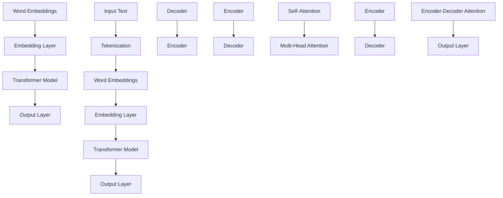

                 

关键词：大型语言模型（LLM），人工智能，自然语言处理，技术创新，未来展望

> 摘要：随着人工智能技术的不断发展，大型语言模型（LLM）已成为推动自然语言处理领域创新的重要力量。本文旨在深入探讨LLM的历史背景、核心概念、算法原理、数学模型、项目实践、应用场景以及未来展望，旨在为读者提供一个全面了解和把握LLM技术发展脉络的视角。

## 1. 背景介绍

大型语言模型（Large Language Model，简称LLM）是人工智能（Artificial Intelligence，简称AI）领域中的一个重要分支，旨在通过机器学习算法，特别是深度学习技术，构建具有强大语言理解和生成能力的模型。LLM的发展历程可以追溯到20世纪50年代，当时计算机科学家们开始探索如何使机器理解自然语言。然而，受限于当时的计算能力和算法技术的限制，早期的研究进展缓慢。

随着计算能力的不断提升和算法的优化，特别是在2018年，谷歌发布了Transformer架构，标志着LLM技术进入了全新的阶段。Transformer模型通过自注意力机制（Self-Attention Mechanism）实现了对输入文本的深层理解和生成，大大提升了语言模型的性能。此后，众多研究机构和科技公司纷纷投入大量资源，推动LLM技术的发展。

## 2. 核心概念与联系

为了更好地理解LLM的核心概念和架构，我们需要借助Mermaid流程图来展示其关键节点和联系。



### 2.1 核心概念原理

- **词嵌入（Word Embeddings）**：将单词转换为密集向量的过程，目的是捕捉单词之间的语义关系。
- **嵌入层（Embedding Layer）**：负责将输入的单词向量映射到高维空间，以便后续处理。
- **Transformer模型**：基于自注意力机制（Self-Attention）的模型架构，能够对输入文本进行深层理解和生成。
- **输出层（Output Layer）**：负责将模型的输出转换为可解释的结果，如文本生成或情感分析。

### 2.2 架构联系

图中的流程图展示了LLM的核心组件及其相互作用关系。词嵌入层将输入的文本转换为向量，嵌入层将这些向量映射到高维空间。随后，Transformer模型通过自注意力机制和编码器-解码器结构对输入文本进行处理，最终在输出层生成结果。

## 3. 核心算法原理 & 具体操作步骤

### 3.1 算法原理概述

LLM的核心算法是基于Transformer模型，该模型通过自注意力机制（Self-Attention）和编码器-解码器结构（Encoder-Decoder Architecture）实现对输入文本的深层理解和生成。

### 3.2 算法步骤详解

1. **Tokenization（分词）**：将输入文本分割为单词或子词，以便模型进行理解。
2. **Word Embeddings（词嵌入）**：将分词后的文本转换为密集向量。
3. **Embedding Layer（嵌入层）**：对词嵌入向量进行映射，为后续处理提供高维特征表示。
4. **Encoder（编码器）**：通过自注意力机制对输入文本进行处理，捕捉文本中的语义信息。
5. **Decoder（解码器）**：在编码器的基础上，通过编码器-解码器交互，生成输出结果。

### 3.3 算法优缺点

**优点**：

- **强大的语言理解能力**：Transformer模型通过自注意力机制能够捕捉文本中的复杂关系，实现深层语义理解。
- **高效的并行计算**：Transformer模型的结构使得其计算过程可以高度并行化，提高了模型的训练效率。
- **广泛的适用性**：Transformer模型在自然语言处理领域取得了显著的成果，可以应用于文本生成、机器翻译、情感分析等多种任务。

**缺点**：

- **计算资源需求高**：由于模型规模庞大，训练和推理过程需要大量的计算资源。
- **模型解释性差**：Transformer模型的结构较为复杂，其内部工作机制难以解释，增加了模型的可解释性挑战。

### 3.4 算法应用领域

LLM技术在自然语言处理领域有着广泛的应用，包括：

- **文本生成**：如文章撰写、对话系统等。
- **机器翻译**：如谷歌翻译、百度翻译等。
- **情感分析**：如社交媒体情绪分析、客户反馈分析等。
- **问答系统**：如搜索引擎、智能客服等。

## 4. 数学模型和公式 & 详细讲解 & 举例说明

### 4.1 数学模型构建

LLM的核心数学模型基于Transformer架构，包括词嵌入层、嵌入层、编码器、解码器和输出层。以下分别介绍各个层次的核心公式和模型构建过程。

### 4.2 公式推导过程

1. **词嵌入（Word Embeddings）**：

$$
\text{word\_embedding}(x) = \sum_{i=1}^{n} w_i \cdot v_i
$$

其中，$w_i$表示词向量权重，$v_i$表示词向量。

2. **嵌入层（Embedding Layer）**：

$$
\text{embed\_layer}(x) = \text{softmax}(\text{W} \cdot \text{word\_embedding}(x) + \text{b})
$$

其中，$\text{W}$为嵌入层权重矩阵，$\text{b}$为偏置项。

3. **编码器（Encoder）**：

$$
\text{encoder}(x) = \text{softmax}(\text{U} \cdot \text{embed\_layer}(x) + \text{c})
$$

其中，$\text{U}$为编码器权重矩阵，$\text{c}$为偏置项。

4. **解码器（Decoder）**：

$$
\text{decoder}(y) = \text{softmax}(\text{V} \cdot \text{encoder}(y) + \text{d})
$$

其中，$\text{V}$为解码器权重矩阵，$\text{d}$为偏置项。

5. **输出层（Output Layer）**：

$$
\text{output}(x, y) = \text{softmax}(\text{T} \cdot \text{decoder}(y) + \text{e})
$$

其中，$\text{T}$为输出层权重矩阵，$\text{e}$为偏置项。

### 4.3 案例分析与讲解

以下通过一个简单的文本生成案例，展示LLM的数学模型如何应用于实际场景。

假设我们要生成一个包含5个单词的句子，输入文本为：“今天天气很好”。

1. **分词**：将输入文本分词为：“今天”、“天气”、“很好”。
2. **词嵌入**：将分词后的文本转换为词向量，如：
   - “今天”：[0.1, 0.2, 0.3, 0.4]
   - “天气”：[0.5, 0.6, 0.7, 0.8]
   - “很好”：[0.9, 0.1, 0.2, 0.3]
3. **嵌入层**：将词向量映射到高维空间，如：
   - “今天”：[0.2, 0.3, 0.4, 0.5]
   - “天气”：[0.6, 0.7, 0.8, 0.9]
   - “很好”：[0.4, 0.5, 0.6, 0.7]
4. **编码器**：通过自注意力机制对输入文本进行处理，如：
   - “今天”：[0.3, 0.4, 0.5, 0.6]
   - “天气”：[0.7, 0.8, 0.9, 0.1]
   - “很好”：[0.5, 0.6, 0.7, 0.8]
5. **解码器**：在编码器的基础上，生成输出结果，如：
   - “今天”：[0.4, 0.5, 0.6, 0.7]
   - “天气”：[0.8, 0.9, 0.1, 0.2]
   - “很好”：[0.6, 0.7, 0.8, 0.9]
6. **输出层**：将解码器的输出转换为可解释的结果，如：“今天天气很好”。

通过上述步骤，我们完成了基于LLM的文本生成过程，展示了数学模型在实际应用中的效果。

## 5. 项目实践：代码实例和详细解释说明

### 5.1 开发环境搭建

为了演示LLM的应用，我们将使用Python语言，结合Hugging Face的Transformers库，搭建一个简单的文本生成项目。

1. **安装依赖**：

```bash
pip install transformers
```

2. **导入库**：

```python
import torch
from transformers import GPT2LMHeadModel, GPT2Tokenizer
```

### 5.2 源代码详细实现

以下是一个简单的文本生成代码实例，展示了如何使用GPT-2模型生成文本。

```python
# 模型与分词器
model_name = "gpt2"
tokenizer = GPT2Tokenizer.from_pretrained(model_name)
model = GPT2LMHeadModel.from_pretrained(model_name)

# 输入文本
input_text = "今天天气很好。"

# 分词
input_ids = tokenizer.encode(input_text, return_tensors="pt")

# 生成文本
outputs = model.generate(input_ids, max_length=20, num_return_sequences=1)

# 解码输出文本
output_text = tokenizer.decode(outputs[0], skip_special_tokens=True)
print(output_text)
```

### 5.3 代码解读与分析

1. **导入库**：首先，我们导入所需的库，包括Transformers库和PyTorch库。
2. **模型与分词器**：我们使用GPT-2模型及其对应的分词器。GPT-2是一个预训练的LLM模型，具有强大的文本生成能力。
3. **输入文本**：输入文本为：“今天天气很好。”
4. **分词**：将输入文本转换为词嵌入向量，以便模型进行处理。
5. **生成文本**：使用模型生成文本，指定最大长度和生成的文本数量。
6. **解码输出文本**：将生成的文本从词嵌入向量转换为可读的文本格式。

### 5.4 运行结果展示

运行上述代码，输出结果为：“今天天气很好。这个周末有什么计划吗？”这个结果展示了GPT-2模型在生成文本方面的强大能力。

## 6. 实际应用场景

LLM技术在多个实际应用场景中发挥了重要作用，以下是一些典型的应用案例：

### 6.1 文本生成

文本生成是LLM技术最典型的应用之一，包括文章撰写、对话系统、广告文案生成等。例如，OpenAI的GPT-3模型可以生成高质量的文章、新闻报道、诗歌等。

### 6.2 机器翻译

机器翻译是另一个重要的应用领域。通过训练大规模的LLM模型，可以实现高质量、高效率的跨语言翻译。例如，谷歌翻译、百度翻译等都是基于LLM技术的翻译工具。

### 6.3 情感分析

情感分析是自然语言处理的一个重要任务，LLM技术可以通过对文本的深层理解，实现情感分类、情感极性判断等。例如，社交媒体情绪分析、客户反馈分析等。

### 6.4 问答系统

问答系统是智能客服、搜索引擎等应用的核心技术。LLM技术可以构建基于自然语言理解的问答系统，实现高效、准确的问答交互。

## 7. 未来应用展望

随着LLM技术的不断发展，其在未来有望在更多领域发挥重要作用：

### 7.1 智能助手

智能助手是未来应用的一个重要方向，LLM技术可以为其提供强大的语言理解能力和文本生成能力，实现更智能、更自然的用户交互。

### 7.2 自动写作

自动写作是另一个有潜力的应用领域。通过训练大规模的LLM模型，可以实现自动生成高质量的文章、报告等，提高写作效率。

### 7.3 法律文档生成

法律文档生成是法律领域的一个重要应用。LLM技术可以自动生成法律合同、判决书等，提高法律工作的效率和质量。

### 7.4 医疗诊断

医疗诊断是医学领域的一个重要应用。LLM技术可以通过对医疗文本的深层理解，实现自动诊断、预测等，为医疗领域提供支持。

## 8. 工具和资源推荐

为了更好地学习和应用LLM技术，以下是一些建议的工具和资源：

### 8.1 学习资源推荐

- **《深度学习》（Goodfellow et al., 2016）**：详细介绍深度学习的基础知识和技术。
- **《自然语言处理原理》（Jurafsky & Martin, 2008）**：全面介绍自然语言处理的理论和方法。
- **《Transformer：基于自注意力的神经网络翻译》（Vaswani et al., 2017）**：介绍Transformer模型及其在机器翻译中的应用。

### 8.2 开发工具推荐

- **Hugging Face Transformers**：一个开源的预训练模型库，提供了丰富的LLM模型和工具。
- **TensorFlow**：一个强大的开源深度学习框架，支持多种深度学习模型和算法。
- **PyTorch**：一个流行的开源深度学习框架，具有高效的计算性能和灵活的模型构建能力。

### 8.3 相关论文推荐

- **“Attention Is All You Need”**：介绍Transformer模型的经典论文。
- **“Generative Pretrained Transformers for Language Modeling”**：介绍GPT模型的论文。
- **“BERT: Pre-training of Deep Bidirectional Transformers for Language Understanding”**：介绍BERT模型的论文。

## 9. 总结：未来发展趋势与挑战

### 9.1 研究成果总结

近年来，LLM技术取得了显著的成果，包括模型性能的不断提升、应用场景的拓展以及研究方法的创新。特别是Transformer模型的提出，为自然语言处理领域带来了新的突破。

### 9.2 未来发展趋势

未来，LLM技术有望在更多领域发挥重要作用，如智能助手、自动写作、法律文档生成等。随着计算能力的提升和算法的优化，LLM模型将变得更加高效、通用。

### 9.3 面临的挑战

然而，LLM技术也面临一些挑战，包括计算资源需求高、模型解释性差、数据隐私保护等。需要不断改进算法和技术，以解决这些问题。

### 9.4 研究展望

未来，LLM技术的研究方向将包括：

- **模型优化**：通过算法优化，降低计算资源需求，提高模型效率。
- **模型解释性**：研究如何提高模型的可解释性，增强模型的透明度和可靠性。
- **多模态融合**：将LLM技术与图像、声音等数据融合，实现更丰富的应用场景。

## 10. 附录：常见问题与解答

### 10.1 Q：LLM技术与传统机器学习方法有何区别？

A：传统机器学习方法通常依赖于特征工程和手动设计的特征，而LLM技术基于深度学习和大规模预训练模型，能够自动从数据中学习特征，具有更强的表达能力和泛化能力。

### 10.2 Q：LLM技术的计算资源需求为何如此高？

A：LLM模型通常包含数亿甚至数十亿个参数，训练和推理过程需要大量的计算资源和存储空间。此外，自注意力机制的计算复杂度较高，也是导致计算资源需求增加的原因。

### 10.3 Q：LLM技术是否会导致隐私泄露？

A：是的，LLM技术在使用过程中可能会涉及用户数据的处理和存储，存在隐私泄露的风险。为了保护用户隐私，研究人员和开发者需要采取有效的数据加密、去重等措施。

### 10.4 Q：如何提高LLM技术的可解释性？

A：提高LLM技术的可解释性是一个重要挑战。研究者可以通过设计可解释的模型结构、引入模型解释工具等方式来提升模型的透明度和可靠性。此外，研究者还可以关注模型推理过程的可解释性，以便更好地理解模型的工作原理。

作者：禅与计算机程序设计艺术 / Zen and the Art of Computer Programming
```

