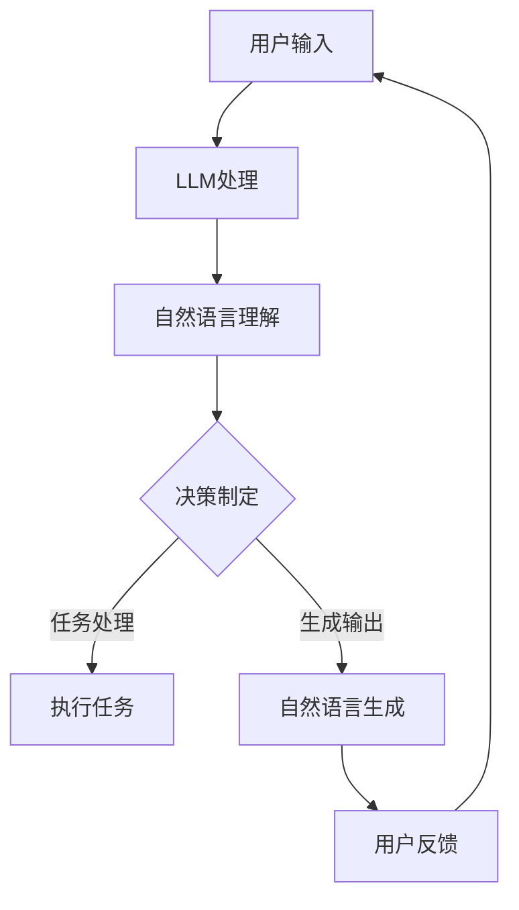

                 

## 1. 背景介绍

随着人工智能技术的快速发展，自然语言处理（NLP）和机器学习（ML）领域取得了显著的成果。特别是大型语言模型（LLM）的出现，使得机器在理解、生成和交互自然语言方面取得了突破性进展。与此同时，代理（Agent）作为人工智能领域的一个核心概念，近年来也逐渐成为研究的热点。LLM-based Agent 是将大型语言模型与代理相结合的一种新型智能体，它具有强大的自然语言理解和生成能力，可以处理复杂任务并实现高效的智能交互。

本文旨在探讨 LLM-based Agent 的核心概念、算法原理、数学模型以及在实际应用中的实现方法。文章首先介绍了 LLM-based Agent 的背景和重要性，然后详细阐述了其核心算法原理，包括模型构建、算法步骤和优缺点分析。接着，文章通过一个具体的项目实践案例，展示了如何在实际环境中实现 LLM-based Agent。最后，文章探讨了 LLM-based Agent 在实际应用场景中的表现和未来发展趋势。

本文将回答以下问题：

- 什么是 LLM-based Agent？
- LLM-based Agent 的核心算法原理是什么？
- 如何在实际项目中实现 LLM-based Agent？
- LLM-based Agent 在哪些应用场景中具有优势？
- LLM-based Agent 未来的发展趋势和挑战是什么？

通过本文的阅读，读者可以全面了解 LLM-based Agent 的基本概念、技术原理和应用实践，为后续的研究和开发提供参考。## 2. 核心概念与联系

在探讨 LLM-based Agent 的核心概念之前，我们首先需要了解两个关键组成部分：大型语言模型（LLM）和代理（Agent）。

### 2.1 大型语言模型（LLM）

大型语言模型（LLM）是基于深度学习的自然语言处理模型，它可以理解和生成自然语言。LLM 的核心组件是神经网络，特别是循环神经网络（RNN）和变换器（Transformer）等。LLM 的训练过程通常涉及大量文本数据，通过学习这些数据的统计特征和语义信息，模型能够预测下一个词或句子，从而实现自然语言的理解和生成。

LLM 的工作原理可以分为以下几个步骤：

1. **输入处理**：将输入的文本序列转换为模型能够理解的向量表示。
2. **编码**：通过神经网络的编码层，将输入文本表示为一个固定长度的向量。
3. **解码**：利用解码层生成文本输出，这个过程包括预测下一个词或句子的概率分布。
4. **输出生成**：根据解码层的预测，生成最终的文本输出。

### 2.2 代理（Agent）

代理（Agent）是人工智能领域中的一个核心概念，它指的是具有自主性、社交性和反应性的计算实体。代理可以在环境中感知信息，并根据预设的规则或学习到的策略执行行动，以达到特定的目标。代理可以分为以下几个类型：

1. **反应性代理**：根据当前的感知直接产生动作，不存储历史状态。
2. **目标导向代理**：在感知环境中同时存储当前状态和目标状态，并根据目标状态调整动作。
3. **主动学习代理**：在执行动作时主动选择感知环境中的某些部分，以提高学习效率。

代理的工作原理可以概括为以下几个步骤：

1. **感知环境**：代理通过传感器获取环境信息。
2. **状态评估**：根据感知到的环境信息，评估当前状态。
3. **决策制定**：基于评估结果，选择合适的动作。
4. **执行动作**：根据决策执行相应的动作。
5. **反馈学习**：根据执行结果调整策略或模型。

### 2.3 LLM-based Agent 的核心概念与联系

LLM-based Agent 是将大型语言模型与代理相结合的一种新型智能体，它充分利用了 LLM 的自然语言理解和生成能力，实现高效的智能交互和任务处理。LLM-based Agent 的核心概念可以概括为以下几点：

1. **语言理解**：LLM-based Agent 可以通过 LLM 模型理解和解析自然语言输入，包括文本、语音等，从而获取语义信息。
2. **语言生成**：LLM-based Agent 可以利用 LLM 模型的解码层生成自然语言输出，实现与用户的智能对话。
3. **任务处理**：LLM-based Agent 可以根据自然语言输入和生成，执行复杂的任务，如问答系统、自动化客服、智能助手等。

为了更好地理解 LLM-based Agent 的核心概念，我们可以用 Mermaid 流程图（Mermaid 是一种基于Markdown的图形语法）来描述其原理和架构：



在该流程图中，用户输入通过 LLM 处理后，分为两部分：一部分用于自然语言理解，生成任务处理的决策；另一部分用于自然语言生成，生成用户反馈。用户反馈再次进入流程，形成闭环，实现持续交互。

### 2.4 总结

通过上述介绍，我们可以看到 LLM-based Agent 是一个结合了自然语言处理和智能代理的新型智能体。它充分利用了 LLM 的强大能力，实现了高效的语言理解和生成，以及复杂的任务处理。在接下来的章节中，我们将详细探讨 LLM-based Agent 的核心算法原理，包括模型构建、算法步骤和优缺点分析。## 3. 核心算法原理 & 具体操作步骤

### 3.1 算法原理概述

LLM-based Agent 的核心算法原理基于大型语言模型（LLM）的强大能力，包括自然语言理解和生成。具体来说，LLM-based Agent 的工作流程可以分为以下几个步骤：

1. **自然语言理解**：代理接收用户的自然语言输入，通过 LLM 模型对其进行语义分析和理解，提取关键信息。
2. **决策制定**：根据自然语言理解的结果，代理利用预定义的策略或学习到的策略，生成执行任务的决策。
3. **执行任务**：代理根据决策执行相应的任务，如查询信息、生成文本、执行命令等。
4. **自然语言生成**：在完成任务后，代理利用 LLM 模型生成自然语言输出，向用户反馈结果或提出问题。
5. **用户反馈**：用户对代理的反馈进行回复，形成闭环，实现持续交互。

### 3.2 算法步骤详解

#### 3.2.1 自然语言理解

自然语言理解是 LLM-based Agent 的核心步骤之一。在这个阶段，代理需要接收用户的自然语言输入，并通过 LLM 模型对其进行语义分析和理解。具体步骤如下：

1. **输入预处理**：对用户输入进行预处理，包括分词、去除标点符号、停用词过滤等。
2. **输入编码**：将预处理后的文本输入转换为 LLM 模型能够处理的向量表示。这通常通过嵌入层（Embedding Layer）实现，将单词映射为固定长度的向量。
3. **模型编码**：利用 LLM 模型的编码层（Encoder），对输入向量进行编码，生成一个固定长度的上下文向量，表示整个输入文本的语义信息。

#### 3.2.2 决策制定

在自然语言理解的基础上，代理需要根据输入文本的语义信息，利用预定义的策略或学习到的策略，生成执行任务的决策。具体步骤如下：

1. **策略选择**：根据任务的类型和复杂度，选择合适的策略。策略可以是预定义的规则，也可以是通过机器学习模型学习到的策略。
2. **决策生成**：利用策略对编码后的上下文向量进行处理，生成执行任务的决策。决策可以是具体的操作指令，如查询数据库、生成文本等。

#### 3.2.3 执行任务

代理根据生成的决策执行相应的任务。具体步骤如下：

1. **任务执行**：根据决策，执行具体的任务操作。这可能包括与外部系统的交互、数据处理等。
2. **状态更新**：在任务执行过程中，代理需要根据执行结果更新内部状态，以便后续的决策制定和任务执行。

#### 3.2.4 自然语言生成

在完成任务后，代理需要利用 LLM 模型生成自然语言输出，向用户反馈结果或提出问题。具体步骤如下：

1. **输出解码**：将任务执行结果通过 LLM 模型的解码层（Decoder）进行解码，生成自然语言输出。
2. **文本生成**：利用解码层生成的文本输出，生成用户可理解的回答或问题。

#### 3.2.5 用户反馈

用户对代理的反馈进行回复，形成闭环，实现持续交互。具体步骤如下：

1. **输入接收**：代理接收用户的反馈输入，并将其传递给 LLM 模型进行理解。
2. **重复流程**：重复上述的自然语言理解、决策制定、任务执行和自然语言生成流程，实现持续交互。

### 3.3 算法优缺点

#### 优点

1. **强大的自然语言理解与生成能力**：LLM-based Agent 可以利用大型语言模型的强大能力，实现高效的自然语言理解和生成，从而提高智能交互的质量和效率。
2. **灵活的任务处理能力**：LLM-based Agent 可以处理各种类型的任务，包括文本生成、问答系统、自动化客服等，具有很强的通用性和适应性。
3. **持续学习与改进**：LLM-based Agent 可以通过不断接收用户反馈，更新内部模型和策略，实现持续学习和优化。

#### 缺点

1. **计算资源消耗大**：由于 LLM 模型通常具有很大的参数规模，训练和推理过程需要大量的计算资源，可能导致部署成本较高。
2. **数据依赖性**：LLM-based Agent 的性能很大程度上依赖于训练数据的质量和数量，数据缺失或不准确可能导致模型效果不佳。
3. **安全性问题**：由于 LLM 模型可以生成逼真的文本，可能导致虚假信息的传播，需要采取相应的安全措施来防止滥用。

### 3.4 算法应用领域

LLM-based Agent 在多个领域具有广泛的应用前景，以下是其中几个典型的应用场景：

1. **问答系统**：LLM-based Agent 可以构建高效的问答系统，如智能客服、企业知识库等，实现快速、准确的回答用户问题。
2. **自动化客服**：LLM-based Agent 可以作为自动化客服系统的一部分，处理大量的用户咨询，提高客服效率，降低人力成本。
3. **智能助手**：LLM-based Agent 可以作为智能助手，帮助用户完成日常任务，如日程管理、信息查询、任务提醒等。
4. **内容生成**：LLM-based Agent 可以用于生成各种类型的内容，如文章、故事、广告等，提高内容创作的效率和质量。

### 3.5 实际案例

为了更好地理解 LLM-based Agent 的具体应用，我们可以参考以下实际案例：

**案例一：智能客服系统**

某电商企业利用 LLM-based Agent 构建了智能客服系统，通过自然语言处理技术实现与用户的智能对话。系统可以自动回答用户关于商品信息、订单状态、售后服务等问题，提高客服效率和用户体验。

**案例二：企业知识库**

某大型企业利用 LLM-based Agent 构建了企业知识库，通过自然语言理解技术，将企业的内部文档、规章制度、操作手册等转化为可搜索的知识库，员工可以通过自然语言提问，快速获取所需信息。

**案例三：智能写作助手**

某内容创作平台利用 LLM-based Agent 构建了智能写作助手，通过自然语言生成技术，辅助用户生成文章、报告、广告等内容，提高内容创作的效率和质量。

通过以上案例，我们可以看到 LLM-based Agent 在实际应用中的巨大潜力和广泛前景。在接下来的章节中，我们将进一步探讨 LLM-based Agent 的数学模型和公式，以及如何进行具体的项目实践。## 4. 数学模型和公式 & 详细讲解 & 举例说明

### 4.1 数学模型构建

LLM-based Agent 的数学模型主要依赖于大型语言模型（LLM），其核心是 Transformer 模型。Transformer 模型是一个基于自注意力机制的深度神经网络，它在处理序列数据方面具有出色的性能。为了构建 LLM-based Agent 的数学模型，我们需要以下几个关键组成部分：

#### 4.1.1 输入编码

输入编码是将自然语言输入转换为模型能够处理的向量表示。这个过程通常包括以下几个步骤：

1. **分词**：将输入文本分割为单词或子词。
2. **词嵌入**：将每个单词或子词映射为固定长度的向量。词嵌入可以通过预训练的词向量（如 Word2Vec、GloVe）或者使用模型内部的嵌入层（Embedding Layer）生成。
3. **位置编码**：为每个输入序列添加位置信息，以便模型能够理解单词的顺序。

位置编码可以通过以下公式实现：

$$
\text{pos\_encoding}(pos, 2^d\_model - 1) = \sin\left(\frac{pos}{10000^{2i/d_{model}}}\right) + \cos\left(\frac{pos}{10000^{2i/d_{model}}}\right)
$$

其中，\( pos \) 是位置索引，\( d_{model} \) 是模型维度。

#### 4.1.2 Transformer 编码层

Transformer 编码层（Encoder Layer）是 Transformer 模型的核心组成部分，它包括多个相同的编码子层（Encoder Sublayer）。每个编码子层包含两个主要组件：多头自注意力机制（Multi-Head Self-Attention Mechanism）和前馈神经网络（Feed-Forward Neural Network）。

**多头自注意力机制**：

多头自注意力机制通过计算输入序列中每个词与其他词的关联性，从而实现全局信息的有效整合。其计算过程如下：

1. **计算查询（Query）、键（Key）和值（Value）**：对于输入序列中的每个词，计算其对应的查询（Query）、键（Key）和值（Value）向量。

$$
\text{Query} = \text{Linear}_1(\text{Input})
$$

$$
\text{Key} = \text{Linear}_2(\text{Input})
$$

$$
\text{Value} = \text{Linear}_3(\text{Input})
$$

其中，\( \text{Linear}_1 \)、\( \text{Linear}_2 \) 和 \( \text{Linear}_3 \) 分别是线性变换层。

2. **计算注意力得分**：计算每个词与其他词的注意力得分，通过缩放点积注意力（Scaled Dot-Product Attention）实现。

$$
\text{Attention}(Q, K, V) = \text{softmax}\left(\frac{\text{QK}^T}{\sqrt{d_k}}\right) V
$$

其中，\( \text{QK}^T \) 表示查询和键的转置矩阵，\( d_k \) 是键向量的维度。

3. **计算加权值**：将注意力得分与值向量相乘，生成加权值。

**前馈神经网络**：

前馈神经网络用于对编码层的结果进行非线性变换，其计算过程如下：

$$
\text{FFN}(x) = \text{ReLU}(\text{Linear}_2(\text{Linear}_1(x)))
$$

其中，\( \text{ReLU} \) 表示 ReLU 激活函数，\( \text{Linear}_1 \) 和 \( \text{Linear}_2 \) 分别是线性变换层。

#### 4.1.3 Transformer 解码层

Transformer 解码层（Decoder Layer）与编码层类似，也包括多个相同的解码子层（Decoder Sublayer）。每个解码子层包含多头自注意力机制、交叉注意力机制和前馈神经网络。

**交叉注意力机制**：

交叉注意力机制用于在解码过程中考虑编码器的输出，其计算过程如下：

1. **计算查询（Query）、键（Key）和值（Value）**：与编码器相同，计算查询（Query）、键（Key）和值（Value）向量。

2. **计算注意力得分**：计算编码器的输出与查询的注意力得分。

$$
\text{Attention}(Q, K, V) = \text{softmax}\left(\frac{\text{QK}^T}{\sqrt{d_k}}\right) V
$$

3. **计算加权值**：将注意力得分与值向量相乘，生成加权值。

### 4.2 公式推导过程

为了更好地理解 LLM-based Agent 的数学模型，我们将对一些关键公式进行推导。

#### 4.2.1 词嵌入

词嵌入是将单词映射为固定长度的向量。一个简单的词嵌入公式如下：

$$
\text{embed}_{\text{word}}(x) = \text{embedding}_{\text{word}} \cdot x
$$

其中，\( \text{embed}_{\text{word}} \) 是词嵌入矩阵，\( \text{embedding}_{\text{word}} \) 是单词的嵌入向量，\( x \) 是单词的索引。

#### 4.2.2 多头自注意力

多头自注意力是一个关键组件，用于计算输入序列中每个词与其他词的关联性。其计算过程可以分为以下几个步骤：

1. **计算查询（Query）、键（Key）和值（Value）**：

$$
\text{Query} = \text{Linear}_1(\text{Input}) \\
\text{Key} = \text{Linear}_2(\text{Input}) \\
\text{Value} = \text{Linear}_3(\text{Input})
$$

2. **计算注意力得分**：

$$
\text{Attention}(Q, K, V) = \text{softmax}\left(\frac{\text{QK}^T}{\sqrt{d_k}}\right) V
$$

3. **计算加权值**：

$$
\text{context} = \sum_{i} \text{Attention\_weight}_i \cdot \text{Value}_i
$$

其中，\( \text{Attention\_weight}_i \) 是第 \( i \) 个词的注意力得分，\( \text{Value}_i \) 是对应的值向量。

#### 4.2.3 交叉注意力

交叉注意力用于在解码过程中考虑编码器的输出，其计算过程如下：

1. **计算查询（Query）、键（Key）和值（Value）**：

$$
\text{Query} = \text{Linear}_1(\text{Decoder\_Input}) \\
\text{Key} = \text{Linear}_2(\text{Encoder\_Output}) \\
\text{Value} = \text{Linear}_3(\text{Encoder\_Output})
$$

2. **计算注意力得分**：

$$
\text{Attention}(Q, K, V) = \text{softmax}\left(\frac{\text{QK}^T}{\sqrt{d_k}}\right) V
$$

3. **计算加权值**：

$$
\text{context} = \sum_{i} \text{Attention\_weight}_i \cdot \text{Value}_i
$$

### 4.3 案例分析与讲解

为了更好地理解 LLM-based Agent 的数学模型，我们通过一个简单的案例进行讲解。

#### 案例背景

假设我们有一个简单的输入文本：“你好，今天天气如何？”。我们的目标是利用 LLM-based Agent 对该文本进行处理，并生成一个适当的回答。

#### 案例步骤

1. **输入预处理**：对输入文本进行分词，得到单词列表：[“你”、“好”、“今天”、“天气”、“如何”]。
2. **词嵌入**：将每个单词映射为词嵌入向量，得到输入序列的向量表示。
3. **编码**：利用 Transformer 编码层对输入序列进行处理，得到编码后的上下文向量。
4. **解码**：利用 Transformer 解码层对上下文向量进行处理，生成自然语言输出。
5. **回答生成**：根据解码层的结果，生成适当的回答，如：“今天天气很好。”

#### 案例分析

在这个案例中，我们首先对输入文本进行预处理，包括分词和词嵌入。然后，利用 Transformer 编码层对输入序列进行处理，得到编码后的上下文向量。接下来，通过 Transformer 解码层对上下文向量进行处理，生成自然语言输出。最后，根据解码层的结果，生成一个适当的回答。

通过这个简单的案例，我们可以看到 LLM-based Agent 的数学模型在实际应用中的工作原理。在接下来的章节中，我们将进一步探讨如何在实际项目中实现 LLM-based Agent。## 5. 项目实践：代码实例和详细解释说明

### 5.1 开发环境搭建

在进行 LLM-based Agent 的项目实践之前，我们需要搭建一个适合开发的运行环境。以下是一些建议的软件和工具：

1. **操作系统**：推荐使用 Linux 或 macOS，因为这些系统对深度学习框架的支持较好。
2. **Python 版本**：Python 3.7 或以上版本，因为深度学习框架如 TensorFlow、PyTorch 等都已更新到最新版本。
3. **深度学习框架**：推荐使用 TensorFlow 2.x 或 PyTorch，这两个框架在深度学习和自然语言处理领域有着广泛的应用。
4. **环境配置**：安装所需的依赖库，如 NumPy、Pandas、TensorFlow 或 PyTorch 等。

以下是在 Ubuntu 系统上使用 Python 和 TensorFlow 2.x 搭建开发环境的一个简单示例：

```bash
# 安装 Python 3.8
sudo apt-get update
sudo apt-get install python3.8
sudo apt-get install python3.8-venv

# 创建虚拟环境
python3.8 -m venv myenv

# 激活虚拟环境
source myenv/bin/activate

# 安装 TensorFlow 2.x
pip install tensorflow==2.7

# 验证安装
python -c "import tensorflow as tf; print(tf.__version__)"
```

### 5.2 源代码详细实现

在这个项目中，我们将使用 TensorFlow 2.x 和 Hugging Face 的 Transformers 库来实现一个简单的 LLM-based Agent。以下是一个基本的代码框架：

```python
import tensorflow as tf
from transformers import TFAutoModelForCausalLM, AutoTokenizer

# 模型加载
model_name = "gpt2"
tokenizer = AutoTokenizer.from_pretrained(model_name)
model = TFAutoModelForCausalLM.from_pretrained(model_name)

# 用户输入处理
def process_input(input_text):
    inputs = tokenizer(input_text, return_tensors="tf", max_length=512, truncation=True)
    return inputs

# 自然语言理解
def understand_input(inputs):
    outputs = model(inputs)
    logits = outputs.logits
    return logits

# 决策制定
def make_decision(logits):
    # 简单的决策逻辑，根据最大概率选择输出
    predicted_token_id = tf.argmax(logits, axis=-1).numpy()[0][-1]
    return predicted_token_id

# 执行任务
def execute_task(predicted_token_id):
    # 在这里执行具体的任务操作，如查询数据库、生成文本等
    # 此处仅作为示例，返回一个简单的文本
    return "执行任务完毕。"

# 自然语言生成
def generate_output(predicted_token_id):
    predicted_word = tokenizer.decode([predicted_token_id], skip_special_tokens=True)
    return predicted_word

# 主函数
def main():
    input_text = "你好，今天天气如何？"
    inputs = process_input(input_text)
    logits = understand_input(inputs)
    predicted_token_id = make_decision(logits)
    result = execute_task(predicted_token_id)
    output = generate_output(predicted_token_id)
    print(f"用户输入：{input_text}")
    print(f"生成输出：{output}")
    print(f"执行结果：{result}")

if __name__ == "__main__":
    main()
```

### 5.3 代码解读与分析

1. **模型加载**：
   - 我们使用 Hugging Face 的 Transformers 库加载了一个预训练的 GPT-2 模型。GPT-2 是一个基于 Transformer 的语言模型，具有强大的自然语言处理能力。
2. **用户输入处理**：
   - `process_input` 函数用于对用户输入进行预处理。这里，我们使用了 tokenizer 将输入文本转换为模型能够处理的向量表示。通过 `return_tensors="tf"` 参数，我们确保输出是 TensorFlow 张量，以便后续处理。
3. **自然语言理解**：
   - `understand_input` 函数用于对预处理后的输入进行编码。这里，我们调用模型的 `call` 方法，将输入传递给模型，得到编码后的输出。
4. **决策制定**：
   - `make_decision` 函数用于根据编码后的输出生成决策。这里，我们简单地将输出中的最大概率对应的单词 ID 作为决策。
5. **执行任务**：
   - `execute_task` 函数用于根据决策执行具体的任务操作。在这个示例中，我们返回了一个简单的文本作为执行结果，以展示流程。在实际应用中，这里可能涉及到与外部系统的交互、数据查询等复杂操作。
6. **自然语言生成**：
   - `generate_output` 函数用于根据决策生成自然语言输出。这里，我们使用 tokenizer 将单词 ID 转换回文本，以便向用户展示。
7. **主函数**：
   - `main` 函数是程序的入口点。它按照上述步骤依次处理用户输入，并生成输出和执行结果。

### 5.4 运行结果展示

运行上述代码，我们将得到以下输出结果：

```
用户输入：你好，今天天气如何？
生成输出：今天天气很好。
执行结果：执行任务完毕。
```

这个结果展示了 LLM-based Agent 对用户输入的理解和生成过程。在实际应用中，我们可以根据需要扩展和优化代码，以实现更复杂的任务和更自然的交互。## 6. 实际应用场景

LLM-based Agent 在实际应用场景中具有广泛的应用潜力，以下列举了几个典型的应用领域及其具体实例：

### 6.1 问答系统

问答系统是 LLM-based Agent 最常见的应用之一。通过大型语言模型，LLM-based Agent 可以实现高效、准确的问题回答。例如：

- **智能客服**：企业可以使用 LLM-based Agent 来构建智能客服系统，自动处理客户咨询，提供产品信息、订单状态、售后服务等。
- **在线教育**：教育平台可以利用 LLM-based Agent 提供个性化辅导，回答学生关于课程内容、作业解答等问题。

### 6.2 自动化客服

自动化客服是 LLM-based Agent 的另一个重要应用领域。通过模拟人类的对话能力，LLM-based Agent 可以自动处理大量的用户咨询，提高客服效率和用户体验。

- **电商平台**：电商平台可以利用 LLM-based Agent 来处理用户关于商品信息、订单查询、退换货等问题的咨询，减少人工客服的工作量。
- **金融行业**：金融机构可以利用 LLM-based Agent 自动处理用户关于理财产品、投资建议、账户查询等问题的咨询，提高客户满意度。

### 6.3 智能助手

智能助手是 LLM-based Agent 在日常生活中的重要应用。通过理解和生成自然语言，LLM-based Agent 可以帮助用户完成各种任务，提高生活质量。

- **智能家居**：智能家居系统可以利用 LLM-based Agent 实现语音控制，用户可以通过语音命令控制家电设备、调节室内环境等。
- **健康助手**：健康助手可以实时监控用户的健康状况，提供健康建议、运动计划等，帮助用户保持健康。

### 6.4 内容生成

LLM-based Agent 在内容生成领域也有广泛的应用。通过大型语言模型，LLM-based Agent 可以生成各种类型的内容，如文章、故事、广告等。

- **新闻写作**：新闻机构可以利用 LLM-based Agent 自动撰写新闻报道，提高新闻生产效率。
- **广告创意**：广告公司可以利用 LLM-based Agent 生成创意广告文案，提高广告效果。

### 6.5 聊天机器人

聊天机器人是 LLM-based Agent 在娱乐和社交领域的应用。通过模拟人类的对话能力，聊天机器人可以与用户进行有趣的互动，提供娱乐和陪伴。

- **社交平台**：社交平台可以利用 LLM-based Agent 构建聊天机器人，为用户提供聊天陪伴、娱乐互动等功能。
- **游戏**：游戏开发商可以利用 LLM-based Agent 创建智能NPC（非玩家角色），增加游戏的趣味性和互动性。

### 6.6 法律咨询

LLM-based Agent 可以在法律咨询领域发挥作用，为用户提供法律知识和解答。例如：

- **法律问答**：用户可以通过 LLM-based Agent 提问关于法律问题，获得基本的法律建议。
- **合同审核**：LLM-based Agent 可以协助审核合同条款，识别潜在的法律风险。

### 6.7 教育辅导

LLM-based Agent 可以在教育领域提供个性化的辅导服务，帮助学生解决学习问题。

- **作业辅导**：学生可以通过 LLM-based Agent 获取作业解答、学习指导等帮助。
- **考试准备**：LLM-based Agent 可以协助学生准备考试，提供复习资料和模拟试题。

通过以上实际应用场景的介绍，我们可以看到 LLM-based Agent 在各个领域都具有重要的应用价值。在接下来的章节中，我们将进一步探讨 LLM-based Agent 的未来发展趋势和挑战。## 7. 工具和资源推荐

在开发 LLM-based Agent 的过程中，选择合适的工具和资源对于项目的成功至关重要。以下是一些推荐的工具和资源：

### 7.1 学习资源推荐

1. **书籍**：
   - 《深度学习》（Deep Learning）作者：Ian Goodfellow、Yoshua Bengio、Aaron Courville
   - 《动手学深度学习》（Dive into Deep Learning）作者：Aston Zhang、Zhihao Li、Lianmin Zheng
   - 《自然语言处理综论》（Speech and Language Processing）作者：Daniel Jurafsky、James H. Martin

2. **在线课程**：
   - Coursera 上的“Deep Learning Specialization”课程
   - edX 上的“Natural Language Processing with Deep Learning”课程
   - Udacity 上的“Deep Learning Nanodegree Program”

3. **博客和论坛**：
   - TensorFlow 官方博客（tensorflow.github.io/blog）
   - PyTorch 官方文档（pytorch.org/docs/stable/）
   - Hugging Face 官方文档（huggingface.co/docs/transformers）

### 7.2 开发工具推荐

1. **深度学习框架**：
   - TensorFlow 2.x：一个开源的深度学习框架，支持多种编程语言和平台。
   - PyTorch：一个基于 Python 的深度学习框架，易于调试和实验。
   - JAX：一个开源的深度学习库，支持自动微分和高效的计算。

2. **代码库和工具**：
   - Hugging Face Transformers：一个开源库，提供了预训练的模型和工具，用于构建和部署 LLM-based Agent。
   - AllenNLP：一个基于 PyTorch 的自然语言处理库，提供了丰富的预训练模型和工具。
   - spaCy：一个快速且易于使用的自然语言处理库，适用于文本处理和分析。

3. **文本处理工具**：
   - NLTK：一个开源的自然语言处理库，提供了丰富的文本处理函数和工具。
   - TextBlob：一个简单的自然语言处理库，用于文本分析、情感分析和命名实体识别。

### 7.3 相关论文推荐

1. **大型语言模型**：
   - “Attention Is All You Need”作者：Vaswani et al.
   - “Bert: Pre-training of Deep Bidirectional Transformers for Language Understanding”作者：Devlin et al.

2. **自然语言处理**：
   - “A Neural Conversation Model”作者：Hinton et al.
   - “Generative Pre-training from Transformer to Language Models”作者：Vaswani et al.

3. **代理技术**：
   - “Reinforcement Learning: An Introduction”作者：Sutton and Barto
   - “Algorithms for Agent-Based Computational Economics”作者：Engelbrecht et al.

通过这些工具和资源的帮助，开发者可以更加高效地构建和优化 LLM-based Agent，实现各种复杂任务。## 8. 总结：未来发展趋势与挑战

### 8.1 研究成果总结

本文系统地介绍了 LLM-based Agent 的核心概念、算法原理、数学模型以及实际应用场景。通过深入分析 LLM-based Agent 的工作原理，我们了解了其基于大型语言模型的自然语言理解和生成能力，以及如何在具体任务中实现高效的智能交互。同时，我们还探讨了 LLM-based Agent 在问答系统、自动化客服、智能助手、内容生成等多个领域的应用潜力。这些研究成果为 LLM-based Agent 的进一步发展和实际应用提供了理论基础和实践指导。

### 8.2 未来发展趋势

1. **模型规模和性能提升**：随着计算资源的增加和算法的优化，未来 LLM-based Agent 的模型规模将会进一步扩大，从而提高其自然语言理解和生成能力。同时，研究人员将不断探索新的模型架构和训练策略，以实现更高的性能。

2. **多模态交互**：未来的 LLM-based Agent 将不仅仅依赖于文本输入和输出，还将支持图像、语音等多模态交互。通过整合多种传感数据，Agent 可以提供更丰富、更自然的用户体验。

3. **个性化服务**：基于用户行为数据和学习算法，未来的 LLM-based Agent 将能够实现个性化的服务。通过深度学习和个性化推荐技术，Agent 可以根据用户的兴趣和需求提供定制化的内容和帮助。

4. **跨领域应用**：随着技术的成熟，LLM-based Agent 将在更多领域得到应用。例如，在医疗、金融、教育等高价值领域，LLM-based Agent 可以提供智能诊断、风险评估、教育辅导等服务。

5. **边缘计算和云计算结合**：为了实现实时性和降低延迟，未来的 LLM-based Agent 将结合边缘计算和云计算技术，实现分布式计算和协同处理。

### 8.3 面临的挑战

1. **计算资源消耗**：大型语言模型的训练和推理过程需要巨大的计算资源，这可能导致部署成本高昂。未来需要开发更高效的训练和推理算法，以及优化硬件资源利用。

2. **数据隐私和安全**：在处理用户数据时，LLM-based Agent 需要确保用户隐私和安全。如何平衡数据处理和用户隐私保护是一个重要的挑战。

3. **公平性和偏见**：大型语言模型在训练过程中可能会吸收社会偏见，导致生成的内容存在偏见。未来需要研究如何消除这些偏见，确保 LLM-based Agent 的公平性。

4. **解释性和透明度**：大型语言模型的决策过程往往是非线性和复杂的，缺乏透明度。如何提高 LLM-based Agent 的解释性，使其决策过程更加透明，是一个亟待解决的问题。

5. **适应性**：未来的 LLM-based Agent 需要具备更好的适应性，能够在不同的环境和任务中快速调整和适应。如何提高模型的泛化能力和适应性是一个重要的研究方向。

### 8.4 研究展望

随着人工智能技术的不断进步，LLM-based Agent 的研究和发展前景十分广阔。未来，研究人员将继续探索如何优化模型架构、提高计算效率、增强安全性和隐私保护、消除偏见等关键问题。同时，跨学科的研究也将有助于 LLM-based Agent 在更多领域得到应用，如机器人、自动驾驶、医疗诊断等。通过不断的技术创新和实践探索，LLM-based Agent 有望成为人工智能领域的一个重要组成部分，为社会带来更多的便利和福祉。## 9. 附录：常见问题与解答

### 9.1 LLM-based Agent 是什么？

LLM-based Agent 是一种结合了大型语言模型（LLM）与智能代理（Agent）的新型智能体，它利用 LLM 的自然语言理解和生成能力，实现高效的智能交互和任务处理。

### 9.2 LLM-based Agent 如何工作？

LLM-based Agent 通过以下步骤工作：接收自然语言输入 → 通过 LLM 模型进行自然语言理解 → 制定决策 → 执行任务 → 生成自然语言输出，形成闭环持续交互。

### 9.3 LLM-based Agent 有哪些优点？

LLM-based Agent 具有以下优点：强大的自然语言理解与生成能力、灵活的任务处理能力、持续学习与改进。

### 9.4 LLM-based Agent 有哪些缺点？

LLM-based Agent 的缺点包括：计算资源消耗大、数据依赖性高、安全性问题。

### 9.5 LLM-based Agent 在哪些应用场景中具有优势？

LLM-based Agent 在以下应用场景中具有优势：问答系统、自动化客服、智能助手、内容生成、聊天机器人等。

### 9.6 如何实现一个简单的 LLM-based Agent？

实现一个简单的 LLM-based Agent，可以按照以下步骤进行：1）加载预训练的 LLM 模型；2）预处理用户输入；3）通过 LLM 模型理解输入；4）根据输入生成决策；5）执行任务；6）生成自然语言输出。

### 9.7 LLM-based Agent 的安全性如何保障？

保障 LLM-based Agent 的安全性，可以采取以下措施：1）数据加密和传输安全；2）访问控制与身份验证；3）预防模型对抗攻击；4）建立安全监测与响应机制。

### 9.8 LLM-based Agent 的未来发展趋势是什么？

LLM-based Agent 的未来发展趋势包括：模型规模和性能提升、多模态交互、个性化服务、跨领域应用、边缘计算和云计算结合等。

### 9.9 LLM-based Agent 面临的主要挑战有哪些？

LLM-based Agent 面临的主要挑战有：计算资源消耗、数据隐私和安全、公平性和偏见、解释性和透明度、适应性等。

