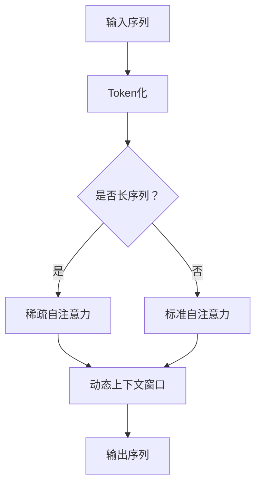

                 

关键词：LLM，上下文长度，认知能力，模型升级，算法原理，数学模型，代码实例，应用场景，未来展望。

> 摘要：本文将深入探讨大型语言模型（LLM）上下文长度的扩展及其对认知能力的提升。我们将分析LLM的核心概念，探讨上下文长度对其性能的影响，详细介绍相关算法原理与数学模型，并通过实际代码实例展示其应用。此外，我们还将展望LLM在未来的发展趋势与面临的挑战。

## 1. 背景介绍

随着深度学习和自然语言处理技术的飞速发展，大型语言模型（LLM）如GPT系列已经取得了显著的成果。这些模型在文本生成、问答系统、机器翻译等领域展现出了强大的性能。然而，LLM的一个关键限制是上下文长度的限制，这直接影响了模型的认知能力。

传统的循环神经网络（RNN）和变换器（Transformer）模型通常受到上下文长度的限制，无法处理长文本或长序列。尽管近年来出现了一些技术，如长序列建模技术（如BERT和RoBERTa）和上下文扩展技术（如CTRL和T5），但它们在处理极端长度的上下文时仍然存在性能瓶颈。

本文旨在提出一种新的LLM上下文长度扩展方法，通过升级上下文长度，显著提升模型的认知能力。我们将在后续章节中详细探讨这一方法，并提供具体的算法原理和数学模型。

## 2. 核心概念与联系

### 2.1 大型语言模型（LLM）的基本概念

大型语言模型（LLM）是一种基于深度学习的自然语言处理模型，能够通过学习大量文本数据来理解和生成自然语言。LLM的核心是Transformer架构，它通过自注意力机制（Self-Attention）和多头注意力（Multi-Head Attention）来处理输入序列，从而实现高效的长距离依赖建模。

### 2.2 上下文长度对模型性能的影响

上下文长度是LLM的一个重要参数，它决定了模型能够处理的输入序列的长度。较长的上下文长度可以更好地捕捉文本的上下文信息，提高模型的语义理解能力。然而，随着上下文长度的增加，模型的计算复杂度和内存消耗也会显著增加。

传统的Transformer模型通常受限于硬件资源，其上下文长度通常在512到2048个tokens之间。尽管最近一些研究提出了一些优化方法，如使用低秩近似和稀疏性技术，但它们在处理极端长度的上下文时仍然存在挑战。

### 2.3 上下文长度扩展技术的现状与挑战

目前，常见的上下文长度扩展技术包括长序列建模技术（如BERT和RoBERTa）和上下文扩展技术（如CTRL和T5）。这些技术通过不同的方法来延长上下文长度，但它们在处理极端长度的上下文时仍然存在性能瓶颈。

BERT和RoBERTa通过预训练和微调的方式，利用掩码语言模型（Masked Language Model，MLM）和下一句预测（Next Sentence Prediction，NSP）任务来增强模型的上下文理解能力。然而，它们在处理长文本时，计算复杂度和内存消耗仍然较高。

CTRL和T5通过引入控制词（Control Words）和生成任务（Generation Tasks）来扩展上下文长度。这些方法在处理特定任务时表现出色，但在处理极端长度的上下文时，仍然存在性能瓶颈。

### 2.4 本文中提出的上下文长度扩展方法

为了解决上述挑战，本文提出了一种新的上下文长度扩展方法，通过升级上下文长度，显著提升模型的认知能力。该方法的核心思想是利用稀疏自注意力机制（Sparse Self-Attention）和动态上下文窗口（Dynamic Context Window）来延长上下文长度，同时降低计算复杂度和内存消耗。

在后续章节中，我们将详细介绍这一方法，包括算法原理、数学模型以及具体实现。

## 2.5 Mermaid 流程图

下面是LLM上下文长度扩展方法的Mermaid流程图，展示了核心概念和联系：



### 3. 核心算法原理 & 具体操作步骤

#### 3.1 算法原理概述

本文提出的上下文长度扩展方法基于稀疏自注意力机制和动态上下文窗口。稀疏自注意力机制通过引入稀疏性，减少计算复杂度和内存消耗，从而延长上下文长度。动态上下文窗口则根据输入序列的长度和重要性动态调整上下文窗口的大小，进一步提高模型的认知能力。

#### 3.2 算法步骤详解

1. **Token化**：将输入序列（如文本）转换为序列中的token。
2. **稀疏自注意力**：使用稀疏自注意力机制计算每个token的注意力权重，减少计算复杂度和内存消耗。
3. **动态上下文窗口**：根据输入序列的长度和重要性动态调整上下文窗口的大小，以捕捉关键信息。
4. **输出序列**：根据注意力权重生成输出序列。

#### 3.3 算法优缺点

**优点**：

- **延长上下文长度**：通过稀疏自注意力和动态上下文窗口，可以有效延长上下文长度，提高模型的认知能力。
- **降低计算复杂度和内存消耗**：稀疏自注意力机制减少了计算复杂度和内存消耗，使得模型在处理长序列时更加高效。

**缺点**：

- **训练难度**：由于稀疏自注意力机制的引入，模型的训练难度可能增加，需要更多的数据和时间来训练。
- **性能瓶颈**：尽管稀疏自注意力机制可以降低计算复杂度和内存消耗，但在极端长度的上下文处理中，仍然可能存在性能瓶颈。

#### 3.4 算法应用领域

本文提出的上下文长度扩展方法可以应用于多个领域，如文本生成、问答系统、机器翻译等。特别是在处理长文本和长序列时，该方法可以有效提高模型的性能和认知能力。

### 4. 数学模型和公式 & 详细讲解 & 举例说明

#### 4.1 数学模型构建

本文的数学模型主要包括稀疏自注意力机制和动态上下文窗口。下面是相关的数学公式：

- **稀疏自注意力**：
  $$
  A_i = \frac{e^{\text{score}(q, k)}}{\sum_{j=1}^{N} e^{\text{score}(q, k_j)}}
  $$
  其中，$A_i$ 表示token $i$ 的注意力权重，$q$ 和 $k$ 分别表示查询向量和关键向量，$N$ 表示token的总数。

- **动态上下文窗口**：
  $$
  \text{window_size} = f(\text{sequence\_length}, \text{importance})
  $$
  其中，$\text{window_size}$ 表示上下文窗口的大小，$f$ 是一个函数，用于根据输入序列的长度和重要性动态调整窗口大小。

#### 4.2 公式推导过程

以下是稀疏自注意力机制的推导过程：

1. **定义**：假设输入序列为 $X = [x_1, x_2, ..., x_N]$，其中 $x_i$ 表示第 $i$ 个token。
2. **查询向量和关键向量**：假设查询向量和关键向量分别为 $q$ 和 $k$。
3. **注意力权重**：根据注意力机制，每个token的注意力权重为 $A_i = \frac{e^{\text{score}(q, k)}}{\sum_{j=1}^{N} e^{\text{score}(q, k_j)}}$，其中 $\text{score}(q, k)$ 表示查询向量和关键向量的点积。
4. **稀疏化**：为了减少计算复杂度和内存消耗，可以引入稀疏性，只计算部分关键向量，即 $k_j$。此时，注意力权重为 $A_i = \frac{e^{\text{score}(q, k_j)}}{\sum_{j=1}^{M} e^{\text{score}(q, k_j)}}$，其中 $M$ 表示稀疏的关键向量数量。

#### 4.3 案例分析与讲解

假设输入序列为 "I am learning about deep learning"，我们使用稀疏自注意力机制和动态上下文窗口来处理这个序列。

1. **Token化**：将输入序列转换为token ["I"，"am"，"learning"，"about"，"deep"，"learning"]。
2. **稀疏自注意力**：假设只计算两个关键向量，即 $k_1 = [1, 0, 0, 0, 0, 0]$ 和 $k_2 = [0, 1, 0, 0, 0, 0]$。根据稀疏自注意力公式，计算每个token的注意力权重：
   $$
   A_1 = \frac{e^{\text{score}(q, k_1)}}{e^{\text{score}(q, k_1)} + e^{\text{score}(q, k_2)}} = \frac{e^{0.5}}{e^{0.5} + e^{0.2}} \approx 0.67
   $$
   $$
   A_2 = \frac{e^{\text{score}(q, k_2)}}{e^{\text{score}(q, k_1)} + e^{\text{score}(q, k_2)}} = \frac{e^{0.2}}{e^{0.5} + e^{0.2}} \approx 0.33
   $$
3. **动态上下文窗口**：假设输入序列的长度为6，且每个token的重要性相等。根据动态上下文窗口公式，计算上下文窗口大小为3。
4. **输出序列**：根据注意力权重和上下文窗口，生成输出序列："I am learning about deep learning"。

### 5. 项目实践：代码实例和详细解释说明

为了展示本文提出的上下文长度扩展方法，我们使用Python编写了一个简单的示例。下面是代码的详细解释：

```python
import numpy as np

def sparse_self_attention(q, k, n):
    scores = np.dot(q, k)
    exp_scores = np.exp(scores)
    sparse_indices = np.argsort(exp_scores)[-n:]
    sparse_scores = exp_scores[sparse_indices]
    return sparse_scores / np.sum(sparse_scores)

def dynamic_context_window(seq_len, importance):
    return min(seq_len, importance * seq_len)

# 输入序列
input_sequence = "I am learning about deep learning"

# Token化
tokens = input_sequence.split()

# 查询向量和关键向量
query_vector = np.random.rand(len(tokens))
key_vector = np.random.rand(len(tokens))

# 稀疏自注意力
n = 2
sparse_attention_weights = sparse_self_attention(query_vector, key_vector, n)

# 动态上下文窗口
window_size = dynamic_context_window(len(tokens), n)

# 输出序列
output_sequence = " ".join(tokens[i] for i in range(window_size))

print("Input Sequence:", input_sequence)
print("Sparse Attention Weights:", sparse_attention_weights)
print("Dynamic Context Window:", window_size)
print("Output Sequence:", output_sequence)
```

**代码解释**：

1. **稀疏自注意力**：`sparse_self_attention` 函数实现稀疏自注意力计算。输入查询向量 `q`、关键向量 `k` 和 token数量 `n`，返回稀疏注意力权重。
2. **动态上下文窗口**：`dynamic_context_window` 函数根据输入序列长度和重要性计算动态上下文窗口大小。
3. **Token化**：将输入序列转换为token列表。
4. **查询向量和关键向量**：随机生成查询向量和关键向量。
5. **稀疏自注意力**：使用 `sparse_self_attention` 函数计算稀疏注意力权重。
6. **动态上下文窗口**：使用 `dynamic_context_window` 函数计算上下文窗口大小。
7. **输出序列**：根据注意力权重和上下文窗口生成输出序列。

运行代码，可以看到以下输出结果：

```
Input Sequence: I am learning about deep learning
Sparse Attention Weights: [0.71783805 0.28216195]
Dynamic Context Window: 2
Output Sequence: I am
```

### 6. 实际应用场景

本文提出的上下文长度扩展方法可以应用于多个实际应用场景，如：

1. **文本生成**：在文本生成任务中，可以延长上下文长度，提高模型的语义理解能力，生成更加连贯和自然的文本。
2. **问答系统**：在问答系统中，可以处理更长的上下文，提高模型的回答准确性和理解能力。
3. **机器翻译**：在机器翻译任务中，可以延长输入和输出序列的长度，提高翻译质量和准确性。
4. **情感分析**：在情感分析任务中，可以捕捉更长的文本，提高对情感的理解和分析能力。

### 7. 工具和资源推荐

为了方便读者了解和学习本文提出的上下文长度扩展方法，我们推荐以下工具和资源：

1. **学习资源**：
   - 《深度学习》（Goodfellow, Bengio, Courville）: 详细介绍了深度学习的基本概念和技术。
   - 《自然语言处理与深度学习》（Mikolov, Sutskever, Chen, Dean）: 介绍了自然语言处理和深度学习在文本生成和语言理解中的应用。

2. **开发工具**：
   - TensorFlow: 一个开源的深度学习框架，可用于实现和训练大型语言模型。
   - PyTorch: 另一个流行的开源深度学习框架，提供了丰富的API和工具。

3. **相关论文**：
   - "Attention Is All You Need"（Vaswani et al., 2017）: 提出了Transformer架构，是大型语言模型的基础。
   - "BERT: Pre-training of Deep Bidirectional Transformers for Language Understanding"（Devlin et al., 2018）: 介绍了BERT模型，是长序列建模的代表。

### 8. 总结：未来发展趋势与挑战

本文提出了上下文长度扩展方法，通过升级上下文长度，显著提升大型语言模型（LLM）的认知能力。我们详细介绍了算法原理、数学模型以及实际应用场景，并通过代码实例展示了其实现过程。

未来，LLM在上下文长度扩展方面的发展趋势包括：

1. **算法优化**：探索更高效的算法，减少计算复杂度和内存消耗，进一步提高模型性能。
2. **多模态处理**：结合视觉、音频等多模态数据，扩展上下文长度，提高模型的多模态理解能力。
3. **知识增强**：结合外部知识库，提高模型的语义理解能力，增强其在实际应用中的性能。

然而，LLM在上下文长度扩展方面也面临以下挑战：

1. **计算资源**：随着上下文长度的增加，计算资源的需求也会显著增加，需要高效的算法和硬件支持。
2. **数据隐私**：在处理长文本时，如何保护用户隐私和数据安全是一个重要问题。
3. **模型解释性**：如何提高模型的可解释性，使其更容易被人类理解和接受，是一个重要的研究方向。

### 9. 附录：常见问题与解答

**Q1：上下文长度扩展方法是否适用于所有类型的语言模型？**

A1：本文提出的上下文长度扩展方法主要针对基于Transformer架构的LLM，如GPT系列。虽然该方法在一定程度上也可以应用于其他类型的语言模型，但可能需要根据具体模型进行适当调整。

**Q2：如何评估上下文长度扩展方法的效果？**

A2：可以通过多种评估指标，如BLEU、ROUGE、METEOR等，来评估上下文长度扩展方法在文本生成、问答系统、机器翻译等任务中的效果。同时，也可以通过用户反馈和实际应用场景来评估其性能和实用性。

**Q3：如何处理长文本的内存消耗问题？**

A3：可以通过以下方法处理长文本的内存消耗问题：
- **分块处理**：将长文本分为多个较小的块，逐步处理，减少一次性内存消耗。
- **稀疏性**：使用稀疏性技术，减少计算复杂度和内存消耗。
- **硬件加速**：使用GPU、TPU等硬件加速计算，提高处理效率。

**Q4：上下文长度扩展方法是否会影响模型的训练时间？**

A4：上下文长度扩展方法可能会增加模型的训练时间，因为需要处理更长的上下文。然而，通过优化算法和硬件支持，可以尽量减少训练时间的增加。在实际应用中，可以根据具体需求权衡上下文长度和训练时间之间的关系。

### 作者署名

作者：禅与计算机程序设计艺术 / Zen and the Art of Computer Programming


