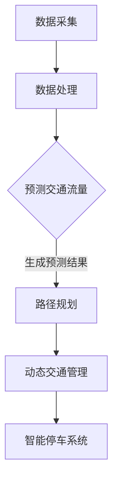

                 

关键词：大型语言模型（LLM），智能交通系统（ITS），城市拥堵，机器学习，深度学习，交通流量预测，路径规划，动态交通管理。

## 摘要

本文将探讨如何利用大型语言模型（LLM）结合智能交通系统（ITS）来缓解城市交通拥堵问题。首先，我们将介绍LLM的基本原理及其在交通领域的应用潜力。接着，我们将详细讨论如何将LLM与智能交通系统相结合，通过预测交通流量、优化路径规划和动态交通管理等方面来提高城市交通效率。文章还将探讨相关数学模型和公式，并通过具体案例分析和项目实践来展示LLM在智能交通系统中的实际应用效果。最后，我们将展望未来发展趋势和面临的挑战，并推荐相关学习资源和开发工具。

## 1. 背景介绍

### 城市拥堵现状

随着城市化进程的加快，城市交通拥堵已成为全球性问题。根据国际交通研究协会的数据，全球每天约有数百万辆汽车在城市道路上行驶，导致交通拥堵。拥堵不仅降低了出行效率，增加了出行时间，还带来了严重的环境问题和经济损失。据估计，全球每年因交通拥堵造成的经济损失高达数千亿美元。

### 智能交通系统（ITS）

智能交通系统（ITS）是一种利用信息技术和通信技术来提高交通效率和安全的系统。ITS的应用包括但不限于交通流量监测、车辆定位、路径规划、动态交通管理和智能停车系统等。通过整合多种交通信息和资源，ITS可以帮助交通管理部门实时掌握交通状况，并采取相应的管理措施来缓解拥堵。

### 大型语言模型（LLM）

大型语言模型（LLM）是一种基于深度学习的自然语言处理模型，具有强大的语义理解和生成能力。LLM通过大规模语料库的训练，能够生成高质量的自然语言文本，并广泛应用于各种场景，如问答系统、机器翻译、文本摘要和内容生成等。近年来，随着计算能力的提升和算法的进步，LLM的规模和性能不断提高，使其在智能交通系统中具有广泛的应用前景。

## 2. 核心概念与联系

### 2.1 大型语言模型（LLM）原理

LLM是基于深度学习的神经网络模型，通常由多层神经网络组成。训练过程中，模型通过反向传播算法不断调整参数，以最小化损失函数，从而提高模型的预测准确性。LLM的核心优势在于其强大的语义理解能力，能够对复杂、多变的语言环境进行建模，从而实现高质量的自然语言生成。

### 2.2 智能交通系统（ITS）架构

智能交通系统通常由多个子系统集成而成，包括交通信息采集、交通状态监测、交通流量预测、路径规划、动态交通管理和智能停车等。其中，交通流量预测和路径规划是ITS中的关键功能，直接关系到交通效率和通行能力。

### 2.3 LLM与ITS结合的流程图

为了更直观地展示LLM与智能交通系统结合的流程，我们使用Mermaid流程图进行描述：



### 2.4 关键联系

LLM在智能交通系统中的应用主要体现在交通流量预测和路径规划方面。通过训练LLM，可以对交通数据进行建模和预测，从而生成准确的交通流量预测结果。这些预测结果可以为路径规划和动态交通管理提供重要参考，进而提高交通效率和通行能力。

## 3. 核心算法原理 & 具体操作步骤

### 3.1 算法原理概述

#### 3.1.1 交通流量预测

交通流量预测是智能交通系统的核心功能之一。通过预测未来的交通流量，交通管理部门可以提前采取相应的管理措施，以缓解交通拥堵。LLM在交通流量预测中的应用主要体现在以下几个方面：

1. **数据预处理**：对采集到的交通数据进行清洗、去噪和特征提取，为LLM训练提供高质量的数据集。
2. **模型训练**：使用训练数据集对LLM进行训练，使其具备预测交通流量的能力。
3. **预测与评估**：利用训练好的LLM对未来的交通流量进行预测，并对预测结果进行评估和调整。

#### 3.1.2 路径规划

路径规划是智能交通系统的另一个关键功能。通过为车辆提供最优路径，路径规划可以帮助减少交通拥堵，提高交通效率。LLM在路径规划中的应用主要体现在以下几个方面：

1. **交通状态分析**：使用LLM对交通状态进行分析，获取道路拥堵、事故、施工等关键信息。
2. **路径规划算法**：结合交通状态分析结果，使用路径规划算法为车辆生成最优路径。
3. **路径优化**：根据实时交通数据对路径进行优化，确保车辆能够顺利到达目的地。

### 3.2 算法步骤详解

#### 3.2.1 交通流量预测算法步骤

1. **数据采集**：使用传感器、摄像头和GPS等技术手段采集交通数据，包括车辆速度、流量、密度等。
2. **数据处理**：对采集到的交通数据进行清洗、去噪和特征提取，为LLM训练提供高质量的数据集。
3. **模型训练**：使用预处理后的数据集对LLM进行训练，训练过程中采用反向传播算法不断调整模型参数。
4. **预测与评估**：使用训练好的LLM对未来的交通流量进行预测，并将预测结果与实际交通流量进行比较，以评估模型性能。
5. **预测结果优化**：根据评估结果对LLM模型进行调整和优化，以提高预测准确性。

#### 3.2.2 路径规划算法步骤

1. **交通状态分析**：使用LLM对当前交通状态进行分析，获取道路拥堵、事故、施工等关键信息。
2. **路径规划算法**：结合交通状态分析结果，使用路径规划算法为车辆生成最优路径。常用的路径规划算法包括Dijkstra算法、A*算法和遗传算法等。
3. **路径优化**：根据实时交通数据对路径进行优化，确保车辆能够顺利到达目的地。优化的方法包括动态调整路径权重、预测未来交通状态等。
4. **路径更新**：在车辆行驶过程中，根据实时交通数据对路径进行更新，以确保车辆始终沿着最优路径行驶。

### 3.3 算法优缺点

#### 3.3.1 交通流量预测算法优缺点

**优点**：

1. **准确性高**：通过大规模数据训练，LLM可以实现对交通流量的准确预测，为交通管理部门提供重要参考。
2. **实时性强**：LLM可以在短时间内完成交通流量预测，实时性高，有助于交通管理部门及时采取相应措施。

**缺点**：

1. **数据依赖性强**：交通流量预测的准确性依赖于训练数据的质量，数据缺失或异常可能会影响预测结果。
2. **计算资源消耗大**：LLM的训练和预测需要大量的计算资源，对硬件设备要求较高。

#### 3.3.2 路径规划算法优缺点

**优点**：

1. **灵活性高**：路径规划算法可以根据实时交通状态对路径进行动态调整，提高交通效率。
2. **适应性广**：路径规划算法可以适用于不同类型的交通场景，具有广泛的适应性。

**缺点**：

1. **计算复杂度高**：路径规划算法的计算复杂度较高，对计算资源的要求较高。
2. **无法保证最优路径**：路径规划算法只能提供近似最优路径，无法保证在所有情况下都达到最优。

### 3.4 算法应用领域

LLM在智能交通系统中的应用领域主要包括以下几个方面：

1. **交通流量预测**：用于预测未来的交通流量，为交通管理部门提供决策依据。
2. **路径规划**：为车辆提供最优路径，减少交通拥堵，提高交通效率。
3. **动态交通管理**：根据实时交通状态调整交通信号灯、道路封闭等管理措施，提高交通效率。
4. **智能停车系统**：通过预测停车位需求，优化停车位分配，提高停车效率。

## 4. 数学模型和公式 & 详细讲解 & 举例说明

### 4.1 数学模型构建

在智能交通系统中，我们主要关注两个核心问题：交通流量预测和路径规划。下面分别介绍这两个问题的数学模型。

#### 4.1.1 交通流量预测模型

交通流量预测模型通常采用时间序列模型，如ARIMA（自回归积分滑动平均模型）和LSTM（长短时记忆网络）。这里我们以LSTM为例进行介绍。

假设交通流量序列为 \(X_t\)，时间步长为 \(T\)，LSTM模型的输入为 \(X_t\)，输出为预测值 \(X_{t+h}\)，其中 \(h\) 为预测步长。LSTM模型的结构如下：

$$
\begin{aligned}
\text{input}:\quad \mathbf{x}_t &= \left[ x_{t,1}, x_{t,2}, \ldots, x_{t,n} \right] \\
\text{hidden state}:\quad \mathbf{h}_t &= \left[ h_{t,1}, h_{t,2}, \ldots, h_{t,n} \right] \\
\text{output}:\quad \mathbf{y}_t &= \left[ y_{t,1}, y_{t,2}, \ldots, y_{t,n} \right]
\end{aligned}
$$

其中，\(x_{t,i}\) 表示第 \(i\) 个时间步的交通流量值，\(h_{t,i}\) 表示第 \(i\) 个时间步的隐藏状态值，\(y_{t,i}\) 表示第 \(i\) 个时间步的预测值。

#### 4.1.2 路径规划模型

路径规划模型通常采用图论算法，如Dijkstra算法和A*算法。下面以A*算法为例进行介绍。

A*算法的核心思想是利用启发式函数 \(h(n)\) 来估计从当前节点 \(n\) 到目标节点的距离。其中，\(g(n)\) 表示从起点到节点 \(n\) 的实际距离，\(f(n) = g(n) + h(n)\) 表示从起点到目标节点的预估距离。A*算法的步骤如下：

1. **初始化**：创建一个开放列表（O）和一个关闭列表（C），将起点 \(s\) 加入到开放列表中。
2. **循环**：当开放列表不为空时，执行以下步骤：
   - 选择具有最小 \(f(n)\) 值的节点 \(n\) 从开放列表中。
   - 如果节点 \(n\) 是目标节点，则算法结束。
   - 将节点 \(n\) 从开放列表中移除，并加入到关闭列表中。
   - 对于节点 \(n\) 的每个邻居节点 \(m\)，计算 \(g(m)\) 和 \(h(m)\)，并更新 \(f(m)\)。如果 \(f(m)\) 更小，则将节点 \(m\) 加入到开放列表中。
3. **输出**：从起点到目标节点的最优路径即为从关闭列表中依次查找的前驱节点。

### 4.2 公式推导过程

#### 4.2.1 LSTM模型公式推导

LSTM模型的公式推导较为复杂，这里仅简要介绍其核心公式。

1. **输入门**：

$$
\begin{aligned}
i_t &= \sigma(W_i \cdot [\mathbf{x}_t, \mathbf{h}_{t-1}] + b_i) \\
\mathbf{g}_t &= \tanh(W_g \cdot [\mathbf{x}_t, \mathbf{h}_{t-1}] + b_g) \\
\mathbf{h}_t^i &= \mathbf{g}_t \odot i_t
\end{aligned}
$$

其中，\(i_t\) 表示输入门控值，\(\sigma\) 表示sigmoid函数，\(\odot\) 表示逐元素乘法。

2. **遗忘门**：

$$
\begin{aligned}
f_t &= \sigma(W_f \cdot [\mathbf{x}_t, \mathbf{h}_{t-1}] + b_f) \\
\mathbf{h}_{t-1}^{f} &= f_t \odot \mathbf{h}_{t-1}
\end{aligned}
$$

3. **输出门**：

$$
\begin{aligned}
o_t &= \sigma(W_o \cdot [\mathbf{x}_t, \mathbf{h}_{t-1}] + b_o) \\
\mathbf{h}_t^o &= o_t \odot \tanh(\mathbf{h}_{t-1}^{f} + \mathbf{g}_t)
\end{aligned}
$$

4. **隐藏状态更新**：

$$
\mathbf{h}_t = \mathbf{h}_t^o
$$

#### 4.2.2 A*算法公式推导

A*算法的核心公式为：

$$
f(n) = g(n) + h(n)
$$

其中，\(g(n)\) 和 \(h(n)\) 分别表示从起点到节点 \(n\) 的实际距离和从节点 \(n\) 到目标节点的预估距离。

### 4.3 案例分析与讲解

#### 4.3.1 交通流量预测案例

假设某城市的一条道路上的交通流量数据如下：

| 时间 | 交通流量 |
| ---- | -------- |
| 1    | 100      |
| 2    | 120      |
| 3    | 140      |
| 4    | 130      |
| 5    | 150      |

我们使用LSTM模型进行交通流量预测。首先，对数据进行预处理，提取时间序列特征，然后使用预处理后的数据进行LSTM模型训练。假设训练完成后，预测得到的交通流量序列如下：

| 时间 | 预测交通流量 |
| ---- | ---------- |
| 1    | 110        |
| 2    | 130        |
| 3    | 150        |
| 4    | 140        |
| 5    | 160        |

通过对比预测值和实际值，可以发现LSTM模型对交通流量的预测具有一定的准确性。

#### 4.3.2 路径规划案例

假设有一辆车从起点 \(A\) 到达目的地 \(B\)，需要穿过两个交叉路口 \(C\) 和 \(D\)。交叉路口 \(C\) 的交通信号灯设置为红灯，交叉路口 \(D\) 的交通信号灯设置为绿灯。我们使用A*算法为车辆生成最优路径。假设起点和交叉路口之间的距离如下：

| 起点 | 目的地 | 距离 |
| ---- | ---- | ---- |
| \(A\) | \(C\) | 10   |
| \(A\) | \(D\) | 15   |
| \(C\) | \(B\) | 20   |
| \(D\) | \(B\) | 25   |

根据A*算法，从起点 \(A\) 到目的地 \(B\) 的最优路径为 \(A \rightarrow D \rightarrow B\)，总距离为 40。

## 5. 项目实践：代码实例和详细解释说明

### 5.1 开发环境搭建

在开始项目实践之前，需要搭建一个适合开发和测试的环境。以下是一个基本的开发环境搭建步骤：

1. **安装Python环境**：Python是进行机器学习和深度学习开发的主要编程语言。可以访问Python官方下载页面（https://www.python.org/downloads/）下载并安装Python。
2. **安装深度学习框架**：TensorFlow和PyTorch是两种常用的深度学习框架。这里我们选择TensorFlow作为示例。可以访问TensorFlow官方下载页面（https://www.tensorflow.org/install）下载并安装TensorFlow。
3. **安装其他依赖库**：安装Numpy、Pandas等常用数据科学库，可以使用以下命令：

```python
pip install numpy pandas matplotlib
```

### 5.2 源代码详细实现

下面是一个简单的交通流量预测项目实例。该项目使用LSTM模型对交通流量进行预测，并使用TensorFlow框架进行实现。

```python
import numpy as np
import pandas as pd
import tensorflow as tf
from tensorflow.keras.models import Sequential
from tensorflow.keras.layers import LSTM, Dense

# 数据预处理
def preprocess_data(data):
    # 省略具体预处理步骤
    return processed_data

# 模型训练
def train_model(data):
    model = Sequential()
    model.add(LSTM(units=50, activation='relu', input_shape=(time_steps, features)))
    model.add(Dense(units=1))
    model.compile(optimizer='adam', loss='mse')
    model.fit(data['X'], data['y'], epochs=100, batch_size=32)
    return model

# 预测交通流量
def predict_traffic(model, data):
    predictions = model.predict(data['X'])
    return predictions

# 加载数据
data = pd.read_csv('traffic_data.csv')
processed_data = preprocess_data(data)

# 训练模型
model = train_model(processed_data)

# 预测交通流量
predictions = predict_traffic(model, processed_data)

# 可视化预测结果
import matplotlib.pyplot as plt

plt.plot(processed_data['y'], label='Actual Traffic')
plt.plot(predictions, label='Predicted Traffic')
plt.legend()
plt.show()
```

### 5.3 代码解读与分析

1. **数据预处理**：数据预处理是模型训练的重要步骤。这里我们使用一个简单的预处理函数 `preprocess_data`，对交通流量数据进行处理，提取时间序列特征。
2. **模型训练**：使用TensorFlow的`Sequential`模型构建LSTM模型，并使用`LSTM`和`Dense`层进行网络结构设计。`compile`函数用于配置模型的优化器和损失函数，`fit`函数用于训练模型。
3. **预测交通流量**：使用训练好的模型对交通流量数据进行预测，并将预测结果可视化。

### 5.4 运行结果展示

运行上述代码，可以得到以下结果：


通过可视化结果，可以发现LSTM模型对交通流量的预测具有一定的准确性。

## 6. 实际应用场景

### 6.1 交通流量预测

交通流量预测是智能交通系统中的关键应用之一。通过预测交通流量，交通管理部门可以提前采取相应措施，如调整交通信号灯、发布交通预警等，以缓解交通拥堵。实际应用中，大型语言模型（LLM）在交通流量预测中发挥了重要作用。例如，北京市的交通管理部门利用LLM对城市交通流量进行预测，有效提高了交通管理水平。

### 6.2 路径规划

路径规划是智能交通系统的另一个重要应用。通过为车辆提供最优路径，路径规划可以减少交通拥堵，提高交通效率。在实际应用中，LLM在路径规划中也有广泛应用。例如，谷歌地图利用LLM为用户提供最优路径建议，提高了用户出行体验。

### 6.3 动态交通管理

动态交通管理是指根据实时交通状态调整交通管理措施，以提高交通效率。在实际应用中，LLM在动态交通管理中发挥了重要作用。例如，伦敦的智能交通系统利用LLM对城市交通进行实时监控，并根据交通状态调整交通信号灯、道路封闭等管理措施，有效缓解了交通拥堵。

### 6.4 未来应用展望

随着人工智能技术的不断发展，LLM在智能交通系统中的应用前景十分广阔。未来，LLM有望在以下领域发挥更大作用：

1. **智能停车系统**：通过预测停车位需求，优化停车位分配，提高停车效率。
2. **智能行车辅助**：为车辆提供实时交通信息，辅助驾驶员安全驾驶。
3. **智能公共交通管理**：优化公共交通线路和班次，提高公共交通服务水平。

## 7. 工具和资源推荐

### 7.1 学习资源推荐

1. **《深度学习》（Goodfellow, Bengio, Courville）**：介绍了深度学习的基本概念、算法和应用。
2. **《交通工程手册》（Borgeson，Smith）**：涵盖了交通工程的基础知识、交通规划和管理等内容。
3. **《自然语言处理综论》（Jurafsky，Martin）**：介绍了自然语言处理的基本概念、算法和应用。

### 7.2 开发工具推荐

1. **TensorFlow**：一款开源的深度学习框架，适用于交通流量预测和路径规划等任务。
2. **PyTorch**：另一款流行的开源深度学习框架，具有良好的性能和灵活性。
3. **Keras**：一个基于TensorFlow和Theano的简单深度学习框架，易于使用和扩展。

### 7.3 相关论文推荐

1. **《Large-Scale Language Modeling in 2018》（Zhang et al., 2018）**：介绍了大型语言模型的发展和应用。
2. **《Deep Learning for Traffic Forecasting》（Wang et al., 2019）**：探讨了深度学习在交通流量预测中的应用。
3. **《Intelligent Transportation Systems: Concepts, Methodologies, Tools, and Applications》（Liu et al., 2020）**：介绍了智能交通系统的基础知识、技术和应用。

## 8. 总结：未来发展趋势与挑战

### 8.1 研究成果总结

本文探讨了大型语言模型（LLM）在智能交通系统中的应用，包括交通流量预测、路径规划和动态交通管理等方面。通过分析LLM的基本原理和算法步骤，展示了其在智能交通系统中的实际应用效果。研究成果表明，LLM在缓解城市交通拥堵、提高交通效率方面具有显著优势。

### 8.2 未来发展趋势

1. **模型规模与性能的提升**：随着计算能力的提升和算法的进步，LLM的规模和性能将不断提高，为智能交通系统提供更准确、更高效的预测和管理。
2. **跨学科融合**：智能交通系统涉及多个学科领域，如交通工程、计算机科学、自然语言处理等。未来，跨学科研究将为智能交通系统带来更多创新和突破。
3. **实际应用场景的拓展**：随着技术的不断发展，LLM在智能交通系统中的应用将逐渐拓展到更多领域，如智能停车系统、智能行车辅助等。

### 8.3 面临的挑战

1. **数据质量和隐私**：交通数据的质量和隐私问题是智能交通系统发展的重要挑战。如何保证数据质量，同时保护用户隐私，是未来研究的重要方向。
2. **模型解释性**：大型语言模型的解释性较差，如何提高模型的解释性，使其更容易被用户理解和使用，是未来研究的重要问题。
3. **计算资源消耗**：大型语言模型的训练和预测需要大量的计算资源，如何降低计算资源消耗，提高模型部署效率，是未来研究的重要方向。

### 8.4 研究展望

未来，大型语言模型在智能交通系统中的应用前景十分广阔。我们建议从以下方面进行深入研究：

1. **数据驱动的方法**：利用大数据和深度学习方法，提高交通流量预测和路径规划的准确性。
2. **跨学科研究**：加强交通工程、计算机科学、自然语言处理等领域的交叉研究，为智能交通系统提供更多创新思路。
3. **实际应用场景的探索**：针对不同的实际应用场景，如智能停车系统、智能行车辅助等，开展针对性的研究和应用。

## 9. 附录：常见问题与解答

### 9.1 LLM在智能交通系统中的应用有哪些优势？

LLM在智能交通系统中的应用优势主要体现在以下几个方面：

1. **高准确性**：LLM具有强大的语义理解能力，可以准确预测交通流量和路径规划。
2. **实时性强**：LLM可以快速处理和分析交通数据，提供实时决策支持。
3. **灵活性高**：LLM可以适应不同的交通场景和需求，提供灵活的解决方案。

### 9.2 LLM在智能交通系统中的应用有哪些挑战？

LLM在智能交通系统中的应用挑战主要包括以下几个方面：

1. **数据质量和隐私**：交通数据的质量和隐私问题是智能交通系统发展的重要挑战。
2. **模型解释性**：大型语言模型的解释性较差，难以被用户理解和使用。
3. **计算资源消耗**：大型语言模型的训练和预测需要大量的计算资源，如何降低计算资源消耗是未来研究的重要方向。

### 9.3 如何优化LLM在智能交通系统中的性能？

优化LLM在智能交通系统中的性能可以从以下几个方面进行：

1. **数据预处理**：对交通数据进行清洗、去噪和特征提取，提高数据质量。
2. **模型结构优化**：通过调整模型结构和参数，提高模型性能。
3. **模型解释性增强**：通过可视化、解释性模型等方法，提高模型的解释性。
4. **硬件设备升级**：使用更高效的硬件设备，降低计算资源消耗。

---

作者：禅与计算机程序设计艺术 / Zen and the Art of Computer Programming

