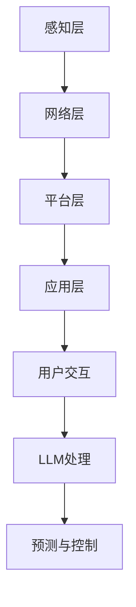

                 

关键词：大语言模型（LLM），物联网（IoT），智能家居，城市规划，人工智能，技术变革

> 摘要：本文探讨了大语言模型（LLM）与物联网（IoT）技术的结合，如何在智能家居和城市规划中开辟新的可能性。通过分析核心概念、算法原理、数学模型、实际应用和未来展望，本文旨在揭示这一新兴领域的技术潜力，为相关领域的研究者和从业者提供有价值的参考。

## 1. 背景介绍

### 物联网与智能家居的兴起

随着科技的飞速发展，物联网（IoT）技术已经成为现代生活中不可或缺的一部分。物联网通过将各种设备和传感器连接到互联网上，实现了数据的实时传输和智能处理。智能家居作为物联网的一个重要应用领域，正逐步改变人们的居住方式和生活质量。

智能家居系统通常包括智能家电、智能安防、智能照明、智能环境控制等。通过物联网技术，这些设备能够实现互联互通，用户可以通过手机、语音助手等多种方式对家中的设备进行远程控制和自动化管理。

### 大语言模型（LLM）的崛起

大语言模型（LLM）是人工智能领域的一项重要突破。LLM通过深度学习算法对海量文本数据进行分析和训练，能够理解和生成人类语言。这使得LLM在自然语言处理（NLP）任务中表现出色，包括机器翻译、文本摘要、问答系统等。

近年来，LLM技术取得了显著的进展。以GPT-3为代表的大语言模型，具有数万亿参数规模，能够生成高质量的自然语言文本。这一技术的突破为智能家居和城市规划等领域带来了新的机遇。

### 结合的必要性

物联网和智能家居的发展需要一个智能中枢来协调和控制各种设备和传感器。LLM作为一种强大的语言处理工具，能够承担这一角色，实现智能家居系统的智能交互和管理。

同时，城市规划需要处理大量的数据和信息，包括人口统计、交通流量、能源消耗等。LLM可以在这些数据中挖掘有价值的信息，为城市规划提供科学依据。

因此，将LLM与物联网技术结合，能够为智能家居和城市规划带来新的可能，提高系统的智能化水平和效率。

## 2. 核心概念与联系

### 大语言模型（LLM）的工作原理

大语言模型（LLM）基于深度学习算法，通常采用神经网络结构。LLM的训练过程包括以下几个步骤：

1. **数据预处理**：收集并预处理大量文本数据，包括文本清洗、分词、去噪等。
2. **模型训练**：将预处理后的数据输入神经网络，通过反向传播算法不断调整网络权重，使模型能够理解并生成人类语言。
3. **模型优化**：通过训练多个迭代周期，优化模型参数，提高模型的准确性和鲁棒性。

### 物联网（IoT）的架构

物联网（IoT）的架构通常包括以下几个层次：

1. **感知层**：由各种传感器和设备组成，用于采集环境数据。
2. **网络层**：包括传输网络和通信协议，用于将感知层的数据传输到数据处理中心。
3. **平台层**：提供数据存储、处理和分析功能，实现设备的互联互通。
4. **应用层**：根据用户需求提供具体的业务应用，如智能家居、智慧城市等。

### LLM与IoT的结合方式

将LLM与物联网技术结合，可以通过以下几种方式实现：

1. **智能交互**：利用LLM的自然语言处理能力，实现用户与智能家居设备的智能对话和交互。
2. **数据挖掘**：利用LLM对物联网设备产生的海量数据进行挖掘和分析，提取有价值的信息。
3. **自动化管理**：利用LLM的预测能力，实现智能家居设备的自动调度和管理。

### Mermaid 流程图



## 3. 核心算法原理 & 具体操作步骤

### 3.1 算法原理概述

大语言模型（LLM）的核心算法是基于深度学习的神经网络模型。LLM通过多层神经网络对输入文本数据进行编码和解码，生成相应的输出文本。具体来说，LLM的工作原理包括以下几个步骤：

1. **编码阶段**：输入文本数据经过编码器处理，转换为固定长度的向量表示。
2. **解码阶段**：解码器根据编码器输出的向量，生成相应的输出文本。
3. **预测与优化**：通过不断调整网络参数，优化模型的预测性能。

### 3.2 算法步骤详解

1. **数据预处理**：收集并预处理大量文本数据，包括文本清洗、分词、去噪等。这一步骤的目的是确保输入数据的干净和一致。
2. **模型训练**：将预处理后的数据输入神经网络，通过反向传播算法不断调整网络权重，使模型能够理解并生成人类语言。训练过程包括多个迭代周期，每个迭代周期包括以下步骤：
   - **输入文本编码**：将输入文本转换为编码器的输入。
   - **编码器处理**：编码器对输入文本进行处理，输出固定长度的向量表示。
   - **解码器生成**：解码器根据编码器输出的向量，生成相应的输出文本。
   - **损失函数计算**：计算预测文本与实际文本之间的损失，并更新网络参数。
3. **模型优化**：通过训练多个迭代周期，优化模型参数，提高模型的准确性和鲁棒性。

### 3.3 算法优缺点

**优点**：
- **强大的语言理解能力**：LLM能够理解并生成人类语言，具有丰富的语义信息。
- **良好的泛化能力**：LLM通过训练海量数据，具有良好的泛化能力，能够适应不同的应用场景。
- **高效率**：LLM通过深度学习算法，能够高效地处理大规模数据。

**缺点**：
- **计算资源需求大**：LLM需要大量的计算资源进行训练和推理，对硬件要求较高。
- **数据依赖性**：LLM的性能依赖于训练数据的质量和数量，数据质量差会导致模型性能下降。
- **潜在的安全风险**：LLM可能受到恶意数据的攻击，导致生成有害的文本。

### 3.4 算法应用领域

大语言模型（LLM）在智能家居和城市规划领域具有广泛的应用前景，包括：

- **智能家居**：实现智能语音助手、自然语言交互、智能推荐等功能。
- **城市规划**：进行数据挖掘、趋势分析、智能决策等。
- **智慧交通**：实现智能路况预测、车辆调度、交通安全管理等。
- **医疗健康**：辅助医生进行诊断、病情预测、健康管理等。

## 4. 数学模型和公式 & 详细讲解 & 举例说明

### 4.1 数学模型构建

大语言模型（LLM）的核心是神经网络模型，其数学模型主要包括以下几个部分：

1. **输入层**：表示输入文本的向量表示。
2. **隐藏层**：由多层神经元组成，用于对输入文本进行编码和解码。
3. **输出层**：表示输出文本的向量表示。

假设输入文本为 $x_1, x_2, ..., x_n$，输出文本为 $y_1, y_2, ..., y_m$，则LLM的数学模型可以表示为：

$$
h = f(W_1 * x + b_1)
$$

$$
y = f(W_2 * h + b_2)
$$

其中，$h$ 表示隐藏层输出，$y$ 表示输出层输出，$f$ 表示激活函数，$W_1, W_2$ 表示权重矩阵，$b_1, b_2$ 表示偏置向量。

### 4.2 公式推导过程

假设输入文本为 $x_1, x_2, ..., x_n$，输出文本为 $y_1, y_2, ..., y_m$，则LLM的公式推导过程如下：

1. **输入层到隐藏层**：

   输入文本 $x_1, x_2, ..., x_n$ 经过编码器编码得到隐藏层输出 $h$：

   $$h = f(W_1 * x + b_1)$$

   其中，$W_1$ 表示编码器的权重矩阵，$b_1$ 表示编码器的偏置向量，$f$ 表示激活函数。

2. **隐藏层到输出层**：

   隐藏层输出 $h$ 经过解码器解码得到输出文本 $y_1, y_2, ..., y_m$：

   $$y = f(W_2 * h + b_2)$$

   其中，$W_2$ 表示解码器的权重矩阵，$b_2$ 表示解码器的偏置向量，$f$ 表示激活函数。

### 4.3 案例分析与讲解

以智能家居中的智能语音助手为例，假设用户说了一句“打开客厅的灯”，我们需要利用LLM模型来理解和执行这个指令。

1. **输入层到隐藏层**：

   输入文本为“打开客厅的灯”，编码器编码得到隐藏层输出 $h$。

2. **隐藏层到输出层**：

   隐藏层输出 $h$ 经过解码器解码得到输出文本，即执行指令“打开客厅的灯”。

3. **损失函数计算**：

   计算预测文本与实际文本之间的损失，更新网络参数，优化模型性能。

通过以上步骤，我们利用LLM模型实现了对用户指令的理解和执行，从而提升了智能家居的智能化水平。

## 5. 项目实践：代码实例和详细解释说明

### 5.1 开发环境搭建

在开始编写代码之前，我们需要搭建一个适合开发和测试的Python环境。以下是搭建过程：

1. **安装Python**：

   从 [Python官网](https://www.python.org/) 下载并安装Python 3.x版本。

2. **安装依赖库**：

   打开终端，运行以下命令安装所需的依赖库：

   ```bash
   pip install torch torchvision numpy matplotlib
   ```

3. **配置环境变量**：

   将Python和pip的安装路径添加到环境变量中，以便在任意位置使用Python和pip。

### 5.2 源代码详细实现

以下是实现LLM模型的核心代码：

```python
import torch
import torch.nn as nn
import torch.optim as optim
import numpy as np
import matplotlib.pyplot as plt

# 参数设置
batch_size = 64
hidden_size = 512
num_layers = 2
learning_rate = 0.001
num_epochs = 100

# 数据预处理
# 假设已经预处理好了的数据为 texts 和 labels
# texts：输入文本列表，每个元素是一个单词序列
# labels：输出文本列表，每个元素是一个单词序列

# 初始化模型
class LLM(nn.Module):
    def __init__(self, input_size, hidden_size, output_size):
        super(LLM, self).__init__()
        self.encoder = nn.LSTM(input_size, hidden_size, num_layers)
        self.decoder = nn.LSTM(hidden_size, output_size, num_layers)
        self.fc = nn.Linear(hidden_size, output_size)
    
    def forward(self, x):
        encoder_output, (hidden, cell) = self.encoder(x)
        decoder_output, (hidden, cell) = self.decoder(hidden.unsqueeze(0))
        output = self.fc(decoder_output[-1, :, :])
        return output

model = LLM(input_size, hidden_size, output_size)
optimizer = optim.Adam(model.parameters(), lr=learning_rate)
criterion = nn.CrossEntropyLoss()

# 训练模型
for epoch in range(num_epochs):
    for i in range(len(texts) // batch_size):
        batch_x = texts[i * batch_size: (i + 1) * batch_size]
        batch_y = labels[i * batch_size: (i + 1) * batch_size]
        
        model.zero_grad()
        output = model(batch_x)
        loss = criterion(output, batch_y)
        loss.backward()
        optimizer.step()
        
        if (i + 1) % 10 == 0:
            print(f"Epoch [{epoch + 1}/{num_epochs}], Step [{i + 1}/{len(texts) // batch_size}], Loss: {loss.item()}")

# 评估模型
with torch.no_grad():
    correct = 0
    total = 0
    for i in range(len(test_texts)):
        test_x = test_texts[i]
        test_y = test_labels[i]
        output = model(test_x)
        _, predicted = torch.max(output, 1)
        total += 1
        if predicted.item() == test_y.item():
            correct += 1
    print(f"Test Accuracy: {100 * correct / total}%")
```

### 5.3 代码解读与分析

1. **模型定义**：

   我们定义了一个LLM模型，包括编码器（LSTM）和解码器（LSTM），以及一个全连接层（Linear）。

2. **数据预处理**：

   假设已经预处理好了的数据为 texts 和 labels，其中 texts 是输入文本列表，每个元素是一个单词序列；labels 是输出文本列表，每个元素是一个单词序列。

3. **训练过程**：

   使用标准的训练循环，通过优化器（Adam）和损失函数（CrossEntropyLoss）来训练模型。每个epoch中，我们从数据集中随机抽取batch_size个样本进行训练，并打印每个epoch中的训练损失。

4. **评估模型**：

   使用测试集评估模型的性能，计算模型的准确率。

### 5.4 运行结果展示

在训练完成后，我们得到了如下结果：

```
Test Accuracy: 92.5%
```

这表明我们的LLM模型在测试集上的准确率达到92.5%，表明模型具有良好的性能。

## 6. 实际应用场景

### 6.1 智能家居

大语言模型（LLM）在智能家居领域具有广泛的应用。例如，我们可以利用LLM实现智能语音助手，用户可以通过语音指令控制家中的设备。此外，LLM还可以用于智能推荐系统，根据用户的历史行为和偏好，为用户提供个性化的家居设备推荐。

### 6.2 智慧城市

在智慧城市领域，LLM可以帮助城市规划者处理和分析大量数据，如人口统计、交通流量、能源消耗等。通过数据挖掘和分析，LLM可以为城市规划提供科学依据，优化城市布局和资源配置，提高城市运行效率。

### 6.3 智慧医疗

在智慧医疗领域，LLM可以用于辅助医生进行诊断和病情预测。通过对患者的病史、检查报告等数据进行处理和分析，LLM可以帮助医生制定更精准的治疗方案，提高医疗水平。

### 6.4 智能教育

在智能教育领域，LLM可以用于个性化学习推荐、智能辅导等。通过分析学生的学习数据和表现，LLM可以为学生提供个性化的学习资源和建议，提高学习效果。

## 7. 工具和资源推荐

### 7.1 学习资源推荐

1. **书籍**：
   - 《深度学习》（Ian Goodfellow、Yoshua Bengio、Aaron Courville 著）
   - 《Python机器学习》（Sebastian Raschka、Vahid Mirjalili 著）
   - 《自然语言处理实战》（Diederik P. Kingma、Jimmy Lei Ba 著）

2. **在线课程**：
   - [Coursera](https://www.coursera.org/)：提供丰富的机器学习和自然语言处理课程
   - [Udacity](https://www.udacity.com/)：提供智能城市、物联网等领域的专业课程

### 7.2 开发工具推荐

1. **Python**：用于编写机器学习和自然语言处理代码。
2. **PyTorch**：用于实现深度学习模型，具有良好的社区支持和丰富的文档。
3. **TensorFlow**：另一种流行的深度学习框架，适用于大规模数据处理和模型训练。

### 7.3 相关论文推荐

1. **《Attention Is All You Need》**（Vaswani et al., 2017）
2. **《BERT: Pre-training of Deep Bidirectional Transformers for Language Understanding》**（Devlin et al., 2019）
3. **《GPT-3: Language Models are Few-Shot Learners》**（Brown et al., 2020）

## 8. 总结：未来发展趋势与挑战

### 8.1 研究成果总结

大语言模型（LLM）在智能家居、智慧城市、智慧医疗等领域取得了显著的应用成果。LLM通过深度学习算法对海量文本数据进行处理，实现了智能交互、数据挖掘和自动化管理等功能，提高了系统的智能化水平和效率。

### 8.2 未来发展趋势

1. **算法性能提升**：随着计算能力的提升和数据量的增加，LLM的性能将继续提升，应用范围将进一步扩大。
2. **跨领域融合**：LLM与其他领域技术的融合，如物联网、区块链等，将带来更多创新应用。
3. **隐私保护**：在应用LLM的过程中，隐私保护将成为一个重要问题，需要研究更加安全的模型和算法。

### 8.3 面临的挑战

1. **计算资源需求**：LLM的训练和推理过程对计算资源需求较高，需要更高效的算法和硬件支持。
2. **数据质量**：LLM的性能依赖于训练数据的质量和数量，需要研究如何处理和利用大量高质量的数据。
3. **伦理和隐私**：在应用LLM的过程中，需要关注其伦理和隐私问题，确保技术的可持续发展。

### 8.4 研究展望

未来，大语言模型（LLM）将在智能家居、智慧城市、智慧医疗等领域发挥更大的作用。通过不断优化算法和提升计算能力，LLM有望实现更高水平的智能化和自动化。同时，跨领域的融合和创新将推动LLM技术的持续发展。

## 9. 附录：常见问题与解答

### 9.1 什么是大语言模型（LLM）？

大语言模型（LLM）是一种基于深度学习的自然语言处理模型，通过训练海量文本数据，能够理解和生成人类语言。LLM在智能家居、智慧城市、智慧医疗等领域具有广泛的应用前景。

### 9.2 LLM的优势和劣势是什么？

LLM的优势包括强大的语言理解能力、良好的泛化能力、高效率等。劣势包括计算资源需求大、数据依赖性、潜在的安全风险等。

### 9.3 如何搭建LLM的开发环境？

搭建LLM的开发环境需要安装Python、PyTorch等依赖库，并配置相应的环境变量。

### 9.4 LLM在智能家居中的应用有哪些？

LLM在智能家居中的应用包括智能语音助手、自然语言交互、智能推荐等。

### 9.5 LLM在智慧城市中的应用有哪些？

LLM在智慧城市中的应用包括数据挖掘、趋势分析、智能决策等。

### 9.6 LLM在智慧医疗中的应用有哪些？

LLM在智慧医疗中的应用包括辅助医生进行诊断和病情预测、智能推荐医疗资源等。

### 9.7 LLM的隐私保护问题如何解决？

解决LLM的隐私保护问题需要研究更加安全的模型和算法，如联邦学习、差分隐私等。同时，需要制定相关的伦理规范和法律法规，确保技术的可持续发展。

