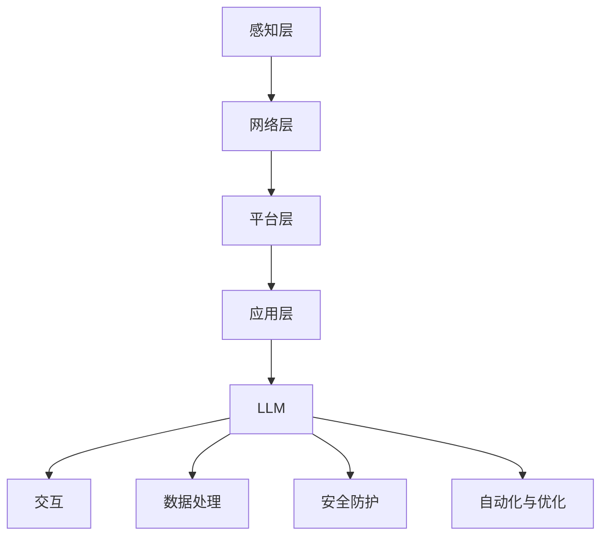

                 

关键词：大型语言模型（LLM）、物联网（IoT）、智能设备、人工智能、深度学习、神经网络、边缘计算、云计算、数据处理、机器学习、自然语言处理（NLP）

> 摘要：本文深入探讨了大型语言模型（LLM）在物联网（IoT）中的应用，探讨了LLM作为智能设备大脑的重要性，分析了其核心算法原理、数学模型、实际应用场景，并展望了其未来的发展前景。

## 1. 背景介绍

### 1.1 物联网的兴起

物联网（IoT）作为现代社会数字化、智能化的重要趋势，已经逐渐渗透到人们生活的方方面面。物联网的基本概念是通过将各种设备（如传感器、智能设备、车辆等）连接到互联网，实现设备间的数据交换和信息共享。根据国际数据公司（IDC）的预测，到2025年，全球物联网设备数量将超过200亿台，为我们的生活带来前所未有的便捷和效率。

### 1.2 智能设备的发展

随着物联网技术的快速发展，智能设备的需求也日益增长。智能设备具有自动感知、自动处理、自动响应的能力，能够根据环境变化和用户需求进行自我调整和优化。智能设备的广泛使用，使得人们的生活和工作变得更加智能化、便捷化。

### 1.3 大型语言模型（LLM）的崛起

大型语言模型（LLM）是近年来人工智能领域的重大突破，其基于深度学习和神经网络技术，能够处理和理解复杂的自然语言任务。LLM的出现，使得智能设备具备了更加高级的交互能力和智能化水平，为物联网的发展提供了强大的技术支持。

## 2. 核心概念与联系

### 2.1 大型语言模型（LLM）的原理

LLM是一种深度学习模型，通常基于大规模的神经网络架构，如Transformer、BERT等。LLM通过对海量语言数据的学习，能够理解和生成自然语言，实现文本分类、情感分析、机器翻译、问答系统等任务。

### 2.2 物联网（IoT）的架构

物联网的架构通常包括感知层、网络层、平台层和应用层。感知层负责数据的采集和感知；网络层负责数据的传输和通信；平台层负责数据的处理和分析；应用层则负责实现具体的应用场景。

### 2.3 LLM与物联网的融合

将LLM应用于物联网，可以通过以下几个方面实现：

1. **智能设备交互**：LLM可以理解用户的语音指令，实现智能对话和语音控制。
2. **数据处理与分析**：LLM可以处理和分析物联网设备产生的海量数据，实现智能决策和优化。
3. **安全防护**：LLM可以用于检测和预防物联网设备的安全威胁，提升系统安全性。
4. **自动化与优化**：LLM可以协助智能设备实现自动化控制和优化，提升系统的效率。

### 2.4 Mermaid流程图



## 3. 核心算法原理 & 具体操作步骤

### 3.1 算法原理概述

LLM的核心算法是基于深度学习和神经网络，特别是Transformer模型。Transformer模型通过自注意力机制，能够捕捉输入文本中的长距离依赖关系，从而实现高质量的文本生成和理解。

### 3.2 算法步骤详解

1. **数据预处理**：对物联网设备采集的数据进行清洗、去噪和归一化处理，将数据转换为适合模型训练的格式。
2. **模型训练**：使用预训练的Transformer模型，对处理后的数据集进行训练，优化模型的参数。
3. **模型部署**：将训练好的模型部署到物联网设备上，实现实时数据处理和响应。
4. **交互与反馈**：通过语音识别、自然语言处理等技术，实现智能设备与用户的交互，并根据用户的反馈进行模型的迭代优化。

### 3.3 算法优缺点

**优点：**
- **强大的语言理解能力**：LLM能够理解和生成复杂的自然语言，实现高效的智能交互。
- **自适应性强**：LLM可以根据物联网设备的具体场景和需求，实现自适应的智能化处理。

**缺点：**
- **计算资源消耗大**：LLM的训练和部署需要大量的计算资源，对硬件要求较高。
- **数据安全风险**：由于LLM处理大量敏感数据，存在数据泄露的风险。

### 3.4 算法应用领域

LLM在物联网中的应用非常广泛，包括但不限于以下领域：

- **智能家庭**：实现智能音箱、智能冰箱、智能电视等设备的智能交互和自动化控制。
- **智能交通**：实现智能路况监测、智能交通信号控制和自动驾驶等功能。
- **智能医疗**：实现智能诊断、智能药物推荐和智能健康监测等功能。
- **智能安防**：实现智能监控、智能报警和智能追踪等功能。

## 4. 数学模型和公式 & 详细讲解 & 举例说明

### 4.1 数学模型构建

LLM的数学模型主要基于深度学习和神经网络，包括以下几个关键部分：

1. **输入层**：将物联网设备采集的数据转换为向量表示。
2. **隐藏层**：通过多层神经网络，对输入数据进行特征提取和变换。
3. **输出层**：根据训练目标，生成预测结果或输出决策。

### 4.2 公式推导过程

假设输入数据为 $X$，隐藏层输出为 $H$，输出层输出为 $Y$，则有：

$$
H = \sigma(W_1X + b_1)
$$

$$
Y = \sigma(W_2H + b_2)
$$

其中，$W_1$、$W_2$ 分别为权重矩阵，$b_1$、$b_2$ 分别为偏置向量，$\sigma$ 为激活函数。

### 4.3 案例分析与讲解

以智能语音助手为例，分析LLM在物联网中的应用。

**案例背景：**
- **数据采集**：智能语音助手通过麦克风采集用户的语音输入。
- **数据预处理**：对语音数据进行清洗、降噪和归一化处理。
- **模型训练**：使用预训练的Transformer模型，对处理后的语音数据集进行训练。
- **模型部署**：将训练好的模型部署到智能语音助手上。
- **交互与反馈**：通过自然语言处理技术，实现智能语音助手与用户的智能对话。

**案例分析：**
- **语音识别**：通过LLM的输入层和隐藏层，对语音输入进行特征提取和变换，实现语音识别。
- **意图识别**：通过LLM的输出层，根据训练目标，识别用户的意图。
- **语音生成**：根据用户的意图，LLM生成相应的语音输出，实现智能对话。

## 5. 项目实践：代码实例和详细解释说明

### 5.1 开发环境搭建

为了实践LLM在物联网中的应用，我们需要搭建以下开发环境：

- 操作系统：Windows / Linux
- 编程语言：Python
- 深度学习框架：TensorFlow / PyTorch
- 数据库：MySQL / MongoDB
- 语音识别库：pyttsx3 / speech_recognition

### 5.2 源代码详细实现

以下是一个简单的智能语音助手项目示例：

```python
import pyttsx3
import speech_recognition as sr

# 初始化语音合成引擎
engine = pyttsx3.init()

# 初始化语音识别模块
recognizer = sr.Recognizer()

# 实现语音输入与输出
def listen():
    with sr.Microphone() as source:
        print("请说出您的问题：")
        audio = recognizer.listen(source)
        try:
            text = recognizer.recognize_google(audio, language='zh-CN')
            print("您说：", text)
            return text
        except sr.UnknownValueError:
            print("语音识别失败，请重试。")
            return None

def speak(text):
    engine.say(text)
    engine.runAndWait()

# 实现智能对话
while True:
    question = listen()
    if question:
        # 根据问题实现相应的功能
        # 例如：查询天气、播放音乐、设置闹钟等
        # ...
        speak("谢谢您的提问，祝您生活愉快。")
        break
```

### 5.3 代码解读与分析

上述代码实现了一个简单的智能语音助手，主要分为以下几个部分：

- **语音合成与识别**：使用`pyttsx3`和`speech_recognition`库实现语音合成和语音识别功能。
- **语音输入与输出**：通过麦克风采集用户的语音输入，并将语音输入转换为文本。
- **智能对话**：根据用户的文本输入，实现相应的功能，如查询天气、播放音乐、设置闹钟等。

### 5.4 运行结果展示

当运行上述代码时，智能语音助手会进入一个循环，等待用户的语音输入。用户说出问题后，智能语音助手会根据问题实现相应的功能，并返回相应的语音输出。

## 6. 实际应用场景

### 6.1 智能家居

智能语音助手可以应用于智能家居领域，实现家庭设备的智能控制和自动化。例如，用户可以通过语音指令控制智能灯泡、智能电视、智能空调等设备，实现智能家庭环境。

### 6.2 智能交通

智能语音助手可以应用于智能交通领域，实现智能路况监测、智能交通信号控制和自动驾驶等功能。例如，通过语音指令实现智能导航、智能避障和智能调度等功能。

### 6.3 智能医疗

智能语音助手可以应用于智能医疗领域，实现智能诊断、智能药物推荐和智能健康监测等功能。例如，通过语音指令实现智能问诊、智能开方和智能咨询等功能。

### 6.4 智能安防

智能语音助手可以应用于智能安防领域，实现智能监控、智能报警和智能追踪等功能。例如，通过语音指令实现智能识别、智能分析和智能响应等功能。

## 7. 工具和资源推荐

### 7.1 学习资源推荐

1. **《深度学习》（Goodfellow, Bengio, Courville）**：全面介绍了深度学习的理论和方法。
2. **《自然语言处理综合教程》（Daniel Jurafsky & James H. Martin）**：详细讲解了自然语言处理的基本原理和技术。
3. **《TensorFlow教程》（TensorFlow Team）**：深入介绍了TensorFlow的安装、配置和使用方法。
4. **《PyTorch教程》（PyTorch Team）**：全面介绍了PyTorch的安装、配置和使用方法。

### 7.2 开发工具推荐

1. **JetBrains PyCharm**：一款功能强大的Python集成开发环境（IDE），支持代码补全、调试、自动化测试等功能。
2. **Visual Studio Code**：一款轻量级的代码编辑器，支持多种编程语言和开发工具，具有丰富的插件生态系统。
3. **Google Colab**：一款免费的云端虚拟机，支持TensorFlow和PyTorch等深度学习框架，适合进行深度学习和机器学习的实验。

### 7.3 相关论文推荐

1. **《Attention Is All You Need》**：介绍了Transformer模型的基本原理和架构。
2. **《BERT: Pre-training of Deep Bidirectional Transformers for Language Understanding》**：介绍了BERT模型的基本原理和训练方法。
3. **《GPT-3: Language Models are Few-Shot Learners》**：介绍了GPT-3模型的基本原理和训练方法。
4. **《Transformer-xl: Attentive Language Models Beyond a Fixed Length Context》**：介绍了Transformer-xl模型的基本原理和训练方法。

## 8. 总结：未来发展趋势与挑战

### 8.1 研究成果总结

本文分析了大型语言模型（LLM）在物联网（IoT）中的应用，探讨了LLM作为智能设备大脑的重要性，介绍了核心算法原理、数学模型、实际应用场景，并展望了其未来的发展前景。

### 8.2 未来发展趋势

- **更强的语言理解能力**：随着深度学习和神经网络技术的不断发展，LLM的语言理解能力将得到进一步提升，实现更智能的交互和决策。
- **更广泛的场景应用**：LLM将在更多的物联网应用场景中得到应用，如智能交通、智能医疗、智能安防等。
- **更高效的边缘计算**：随着边缘计算技术的普及，LLM将能够在物联网设备的边缘端实现实时处理和响应，提高系统的效率。

### 8.3 面临的挑战

- **计算资源消耗**：LLM的训练和部署需要大量的计算资源，对硬件要求较高，如何在有限的资源下实现高效的计算仍是一个挑战。
- **数据安全和隐私保护**：随着LLM在物联网中的应用，数据安全和隐私保护问题将日益突出，如何保障用户数据的安全和隐私是一个重要挑战。
- **泛化能力**：如何在多样化的物联网应用场景中实现LLM的泛化能力，是一个亟待解决的问题。

### 8.4 研究展望

未来，我们将继续关注LLM在物联网领域的应用，探索更高效的计算方法、更安全的数据处理技术，以及更智能的交互和决策策略。同时，我们也将积极推动LLM与其他人工智能技术的融合，为物联网的发展提供更强大的技术支持。

## 9. 附录：常见问题与解答

### 9.1 问题1：什么是物联网（IoT）？

物联网（IoT）是通过将各种设备（如传感器、智能设备、车辆等）连接到互联网，实现设备间的数据交换和信息共享。物联网的基本概念是通过网络将物理设备与现实世界连接起来，从而实现智能化、自动化和高效的管理。

### 9.2 问题2：什么是大型语言模型（LLM）？

大型语言模型（LLM）是一种基于深度学习和神经网络的语言处理模型，能够处理和理解复杂的自然语言任务。LLM通过对海量语言数据的学习，实现文本分类、情感分析、机器翻译、问答系统等任务。

### 9.3 问题3：LLM在物联网中有哪些应用场景？

LLM在物联网中的应用场景非常广泛，包括但不限于智能家庭、智能交通、智能医疗、智能安防等领域。例如，智能语音助手、智能路况监测、智能诊断、智能监控等。

### 9.4 问题4：如何实现LLM在物联网设备上的部署？

实现LLM在物联网设备上的部署，需要以下几个步骤：

1. **数据采集**：收集物联网设备产生的数据。
2. **数据处理**：对数据进行清洗、去噪和归一化处理。
3. **模型训练**：使用预训练的LLM模型，对处理后的数据集进行训练，优化模型的参数。
4. **模型部署**：将训练好的模型部署到物联网设备上，实现实时数据处理和响应。
5. **交互与反馈**：通过自然语言处理技术，实现智能设备与用户的交互，并根据用户的反馈进行模型的迭代优化。

### 9.5 问题5：如何保障LLM在物联网应用中的数据安全和隐私保护？

保障LLM在物联网应用中的数据安全和隐私保护，需要采取以下几个措施：

1. **数据加密**：对传输和存储的数据进行加密处理，防止数据泄露。
2. **访问控制**：设置严格的访问控制策略，确保只有授权用户才能访问数据。
3. **数据匿名化**：对个人数据进行匿名化处理，防止个人隐私泄露。
4. **数据审计**：定期进行数据审计，及时发现和修复潜在的安全漏洞。
5. **安全培训**：对开发者、运维人员等涉及数据安全的人员进行安全培训，提高安全意识。

---

作者：禅与计算机程序设计艺术 / Zen and the Art of Computer Programming

以上是关于《LLM与物联网：智能设备的大脑》的完整文章。希望这篇文章能够帮助您深入了解LLM在物联网中的应用，为您的学习和实践提供有益的参考。如果您有任何疑问或建议，欢迎在评论区留言，我会尽力为您解答。谢谢！

