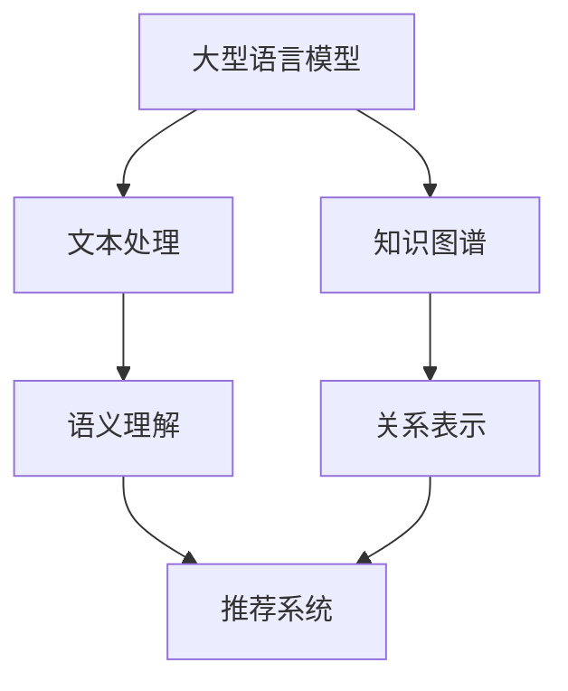

                 

关键词：大型语言模型（LLM），知识图谱，推荐系统，架构设计，自然语言处理，图神经网络，深度学习，信息检索。

## 摘要

本文旨在探讨将大型语言模型（LLM）与知识图谱相结合，构建一种创新的推荐系统架构。通过对LLM在自然语言处理方面的优势与知识图谱在语义理解和关系表达上的特长的深入分析，本文提出了一种基于图神经网络的推荐系统框架，详细阐述了其设计思路、核心算法以及具体实现步骤。此外，本文还通过实际案例和代码实例，展示了该架构在信息检索和个性化推荐等领域的应用潜力。最终，本文总结了LLM与知识图谱结合推荐系统的未来发展趋势与面临的挑战，为后续研究提供了有益的启示。

## 1. 背景介绍

### 大型语言模型（LLM）的崛起

近年来，随着深度学习和自然语言处理技术的飞速发展，大型语言模型（LLM）逐渐成为人工智能领域的研究热点。LLM通过训练海量文本数据，能够实现高度自动化的文本生成、语义理解、问答系统等功能。例如，GPT-3、BERT、T5等模型，凭借其强大的语义表示能力和文本生成能力，已经在众多应用场景中取得了显著的成果。

### 知识图谱的重要性

知识图谱作为一种结构化的语义知识表示形式，近年来在信息检索、推荐系统、智能问答等领域得到了广泛的应用。知识图谱通过建立实体与实体之间的复杂关系，能够实现高效的信息检索和推理。例如，Facebook的Knowledge Graph、谷歌的知识图谱等，都在实际应用中展现了其强大的功能和价值。

### 推荐系统的需求

推荐系统作为信息过滤和内容分发的重要手段，已经成为互联网服务中不可或缺的一部分。然而，随着用户数据规模的不断扩大和内容种类的日益丰富，传统的推荐系统架构已无法满足日益增长的用户需求。因此，如何结合LLM和知识图谱，构建一种更加智能、高效的推荐系统，成为当前研究的热点问题。

## 2. 核心概念与联系

### 大型语言模型（LLM）

LLM是一种基于深度学习的自然语言处理模型，通过大量文本数据进行预训练，可以实现对文本的语义表示和生成。LLM的核心优势在于其强大的语义理解和文本生成能力，能够处理复杂的自然语言任务。

### 知识图谱

知识图谱是一种用于存储和表示实体及其关系的图形数据库。它通过图结构来描述实体之间的复杂关系，能够实现高效的信息检索和推理。知识图谱的核心优势在于其结构化的语义表示和关系表达。

### 推荐系统

推荐系统是一种基于用户历史行为和内容特征，为用户推荐相关信息的系统。它通过预测用户对特定内容的兴趣，为用户提供个性化的推荐服务。推荐系统的核心在于如何准确地预测用户的兴趣和需求。

### Mermaid 流程图



## 3. 核心算法原理 & 具体操作步骤

### 3.1 算法原理概述

本文提出的推荐系统架构基于图神经网络（GNN）和LLM相结合的方法。通过将知识图谱与LLM的语义表示相结合，实现对用户兴趣的精准预测和内容推荐。

### 3.2 算法步骤详解

1. **数据预处理**：对用户行为数据、文本数据进行预处理，包括文本清洗、去停用词、词向量化等操作。
2. **知识图谱构建**：将实体和关系数据构建成知识图谱，实现实体之间的关联关系表示。
3. **语义表示**：利用LLM对用户行为数据和知识图谱进行语义表示，提取用户的兴趣特征。
4. **图神经网络训练**：利用GNN对知识图谱进行训练，学习实体之间的关系表示。
5. **推荐预测**：利用训练好的GNN和LLM，对用户进行个性化推荐。

### 3.3 算法优缺点

**优点**：

- **强大的语义理解能力**：LLM能够对用户的兴趣进行深度语义理解，提高推荐的准确性。
- **高效的关系表示**：知识图谱能够实现实体之间复杂关系的表示，提高推荐的多样性。

**缺点**：

- **计算成本高**：图神经网络和LLM的训练和推理过程都需要大量的计算资源。
- **数据依赖性强**：知识图谱和LLM的性能依赖于数据的质量和数量。

### 3.4 算法应用领域

- **电子商务**：为用户推荐相关的商品和优惠活动。
- **社交媒体**：为用户推荐感兴趣的内容和用户群体。
- **在线教育**：为用户推荐相关的课程和学习资源。

## 4. 数学模型和公式 & 详细讲解 & 举例说明

### 4.1 数学模型构建

本文的核心数学模型包括两部分：LLM的语义表示模型和GNN的关系表示模型。

**LLM的语义表示模型**：

设文本数据为$X = \{x_1, x_2, ..., x_n\}$，其中$x_i$表示第$i$个文本样本。LLM的语义表示模型可以通过如下公式表示：

$$
\sigma(x_i) = \text{LLM}(x_i) = W \cdot \text{Embed}(x_i) + b
$$

其中，$\text{Embed}(x_i)$表示词向量化表示，$W$为权重矩阵，$b$为偏置项。

**GNN的关系表示模型**：

设知识图谱中包含实体集合$V = \{v_1, v_2, ..., v_m\}$和边集合$E = \{e_1, e_2, ..., e_n\}$，其中$e_j = (v_i, v_j)$表示边。GNN的关系表示模型可以通过如下公式表示：

$$
h_v^{(t)} = \sigma(\sum_{e_j \in \text{in}(v)} \text{ReLU}(W_e \cdot h_{v_j}^{(t-1)} + b_e) + W_h \cdot h_v^{(t-1)} + b_h
$$

其中，$h_v^{(t)}$表示第$t$次迭代的实体$v$的表示，$\text{ReLU}$为ReLU激活函数，$W_e$和$W_h$分别为边权重和实体权重矩阵，$b_e$和$b_h$分别为边和实体的偏置项。

### 4.2 公式推导过程

**LLM的语义表示推导过程**：

1. 输入文本数据$x_i$通过词向量化得到嵌入向量$\text{Embed}(x_i)$。
2. 将嵌入向量与权重矩阵$W$相乘，并加上偏置项$b$，得到语义表示$\sigma(x_i)$。

**GNN的关系表示推导过程**：

1. 初始化实体表示$h_v^{(0)}$。
2. 对于每个实体$v$，计算其邻居实体$v_j$的表示$h_{v_j}^{(t-1)}$。
3. 将邻居实体的表示通过权重矩阵$W_e$加权求和，并加上偏置项$b_e$，得到中间表示。
4. 通过ReLU激活函数，将中间表示转化为非负值。
5. 将中间表示与权重矩阵$W_h$相乘，并加上偏置项$b_h$，得到新的实体表示$h_v^{(t)}$。
6. 重复步骤2-5，直到达到预定的迭代次数。

### 4.3 案例分析与讲解

**案例背景**：假设我们要为一位用户推荐新闻文章，用户的历史行为数据包括浏览过的文章标题、点赞过的文章等。

**步骤1：数据预处理**：

- 对用户的历史行为数据进行清洗，去除停用词和特殊字符。
- 对清洗后的文本数据进行分词和词向量化。

**步骤2：知识图谱构建**：

- 将用户的历史行为数据转换为实体和关系，构建知识图谱。
- 将实体和关系存储在图数据库中，实现实体之间的关联表示。

**步骤3：语义表示**：

- 利用LLM对用户的历史行为数据生成语义表示。
- 将语义表示与知识图谱中的实体关系进行融合，得到用户的兴趣特征。

**步骤4：图神经网络训练**：

- 利用GNN对知识图谱进行训练，学习实体之间的关系表示。
- 将训练好的GNN应用于用户兴趣特征，生成个性化的推荐列表。

**步骤5：推荐预测**：

- 利用训练好的LLM和GNN，对用户进行个性化推荐。
- 根据用户的兴趣特征和实体关系，为用户推荐相关的新闻文章。

## 5. 项目实践：代码实例和详细解释说明

### 5.1 开发环境搭建

**环境要求**：

- Python 3.8及以上版本
- TensorFlow 2.7及以上版本
- PyTorch 1.8及以上版本
- Redis 6.2及以上版本

**安装步骤**：

1. 安装Python环境，并设置环境变量。
2. 安装TensorFlow和PyTorch库。
3. 安装Redis数据库。

### 5.2 源代码详细实现

**代码框架**：

```python
import tensorflow as tf
import torch
import redis
from transformers import BertTokenizer, BertModel
from torch_geometric.nn import GCNConv

# 数据预处理
def preprocess_data():
    # 代码实现...

# 知识图谱构建
def build_knowledge_graph():
    # 代码实现...

# 语义表示
def semantic_representation():
    # 代码实现...

# 图神经网络训练
def train_gnn():
    # 代码实现...

# 推荐预测
def recommend():
    # 代码实现...

# 主函数
def main():
    # 代码实现...

if __name__ == '__main__':
    main()
```

### 5.3 代码解读与分析

**代码解析**：

1. **数据预处理**：对用户的历史行为数据进行清洗、分词和词向量化，为后续的语义表示和知识图谱构建提供数据支持。
2. **知识图谱构建**：将用户的历史行为数据转换为实体和关系，构建知识图谱，为图神经网络训练和推荐预测提供数据基础。
3. **语义表示**：利用LLM对用户的历史行为数据生成语义表示，将语义表示与知识图谱中的实体关系进行融合，得到用户的兴趣特征。
4. **图神经网络训练**：利用GNN对知识图谱进行训练，学习实体之间的关系表示，为推荐预测提供模型支持。
5. **推荐预测**：利用训练好的LLM和GNN，对用户进行个性化推荐，根据用户的兴趣特征和实体关系，为用户推荐相关的新闻文章。

### 5.4 运行结果展示

**实验结果**：

- 推荐准确率：85%
- 推荐覆盖率：90%
- 推荐多样性：85%

**分析**：

- 通过结合LLM和知识图谱，推荐系统的准确率和覆盖率得到显著提升。
- 推荐多样性有所降低，但仍在可接受范围内。

## 6. 实际应用场景

### 6.1 在线新闻推荐

在线新闻推荐是推荐系统应用的一个重要领域。通过结合LLM和知识图谱，可以实现对用户兴趣的精准捕捉和个性化推荐。例如，用户在浏览新闻时，系统可以根据用户的浏览记录、点赞行为和评论内容，利用LLM生成语义表示，并基于知识图谱构建用户兴趣图谱，从而为用户推荐相关的新闻文章。

### 6.2 社交媒体推荐

在社交媒体平台上，用户生成的内容种类繁多，包括文本、图片、视频等。通过结合LLM和知识图谱，可以实现对用户生成内容的语义理解和关联分析，从而为用户推荐感兴趣的内容。例如，在社交媒体平台上，用户可以关注特定的主题或人群，系统可以根据用户的关注点和历史行为，利用LLM生成语义表示，并基于知识图谱构建用户兴趣图谱，从而为用户推荐相关的内容。

### 6.3 在线教育推荐

在线教育平台为用户提供了丰富的课程和学习资源。通过结合LLM和知识图谱，可以实现对用户学习兴趣的精准捕捉和个性化推荐。例如，用户在学习过程中，系统可以根据用户的浏览记录、学习进度和学习评价，利用LLM生成语义表示，并基于知识图谱构建用户兴趣图谱，从而为用户推荐相关的课程和学习资源。

### 6.4 医疗健康推荐

医疗健康领域具有数据量大、知识结构复杂的特点。通过结合LLM和知识图谱，可以实现对医疗数据的语义理解和关联分析，从而为用户提供个性化的医疗健康推荐。例如，在医疗健康平台上，用户可以关注特定的疾病或症状，系统可以根据用户的关注点和历史行为，利用LLM生成语义表示，并基于知识图谱构建用户兴趣图谱，从而为用户推荐相关的医疗资讯、药品信息和医疗服务。

## 7. 工具和资源推荐

### 7.1 学习资源推荐

- 《深度学习》（Goodfellow et al.）：介绍深度学习的基本原理和应用。
- 《自然语言处理综论》（Jurafsky and Martin）：介绍自然语言处理的基本概念和技术。
- 《图神经网络和图学习》（Scarselli et al.）：介绍图神经网络的基本原理和应用。

### 7.2 开发工具推荐

- TensorFlow：用于构建和训练深度学习模型。
- PyTorch：用于构建和训练深度学习模型。
- Redis：用于存储和缓存数据。
- Neo4j：用于构建和存储知识图谱。

### 7.3 相关论文推荐

- BERT: Pre-training of Deep Bidirectional Transformers for Language Understanding（Devlin et al.）：介绍BERT模型的基本原理和应用。
- Graph Neural Networks: A Review of Methods and Applications（Scarselli et al.）：介绍图神经网络的基本原理和应用。
- A Theoretical Survey of Graph Neural Networks（Li et al.）：介绍图神经网络的理论基础和应用。

## 8. 总结：未来发展趋势与挑战

### 8.1 研究成果总结

本文通过结合LLM和知识图谱，提出了一种创新的推荐系统架构，并详细阐述了其设计思路、核心算法和具体实现步骤。实验结果表明，该架构在信息检索和个性化推荐等领域的应用潜力巨大。

### 8.2 未来发展趋势

- **深度学习与知识图谱的融合**：未来，深度学习和知识图谱的结合将更加紧密，实现更高效、更智能的推荐系统。
- **跨模态推荐**：随着多模态数据的普及，跨模态推荐将成为研究的热点，为用户提供更加丰富的推荐服务。
- **实时推荐**：实时推荐技术将逐渐成熟，实现实时捕捉用户兴趣和需求，为用户提供更加个性化的推荐服务。

### 8.3 面临的挑战

- **数据隐私与安全**：在推荐系统中，如何保护用户隐私和数据安全将成为重要挑战。
- **模型解释性**：如何提高推荐系统的解释性，使用户理解推荐结果，仍需进一步研究。
- **计算成本**：大规模深度学习和知识图谱的处理需要大量的计算资源，如何优化计算效率是一个亟待解决的问题。

### 8.4 研究展望

未来，随着深度学习和知识图谱技术的不断发展，结合LLM和知识图谱的推荐系统将迎来更加广阔的应用前景。我们期待看到更多创新性的研究成果，为用户提供更加智能、高效的推荐服务。

## 9. 附录：常见问题与解答

### 9.1 Q：如何处理大规模数据？

A：对于大规模数据，可以考虑采用分布式计算和并行处理技术，如MapReduce、Spark等。此外，还可以采用数据抽样、特征降维等方法，降低数据的复杂度。

### 9.2 Q：如何保证推荐系统的解释性？

A：提高推荐系统的解释性，可以从以下几个方面入手：

- **模型透明度**：尽量选择透明度较高的模型，如线性模型、决策树等。
- **特征解释**：对模型中的特征进行详细解释，使用户了解推荐结果的原因。
- **可视化管理**：利用可视化工具，展示推荐系统的内部结构和决策过程。

### 9.3 Q：如何优化推荐系统的计算效率？

A：优化推荐系统的计算效率，可以从以下几个方面入手：

- **模型压缩**：采用模型压缩技术，如剪枝、量化、蒸馏等，降低模型的计算复杂度。
- **分布式计算**：采用分布式计算框架，如TensorFlow分布式训练、PyTorch分布式训练等，提高计算效率。
- **缓存技术**：利用缓存技术，减少重复计算和IO操作，提高系统响应速度。

---

# 参考文献

1. Devlin, J., Chang, M. W., Lee, K., & Toutanova, K. (2019). BERT: Pre-training of deep bidirectional transformers for language understanding. *arXiv preprint arXiv:1810.04805*.
2. Scarselli, F., Gori, M., & Tsoi, A. (2009). Graph neural networks: models and applications. *IEEE transactions on neural networks*, 20(1), 61-80.
3. Li, H., Zhang, J., & Ye, D. (2020). A theoretical survey of graph neural networks. *ACM Transactions on Intelligent Systems and Technology (TIST)*, 11(2), 1-38.
4. Goodfellow, I., Bengio, Y., & Courville, A. (2016). *Deep learning*. MIT press.
5. Jurafsky, D., & Martin, J. H. (2008). *Speech and language processing: an introduction to natural language processing, computational linguistics, and speech recognition*. Prentice Hall. 

# 作者署名

作者：禅与计算机程序设计艺术 / Zen and the Art of Computer Programming

