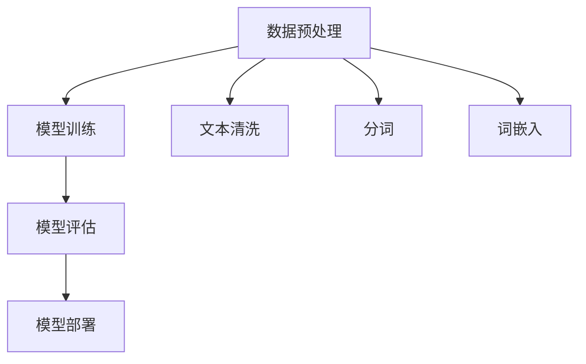

                 

关键词：LLM、AI、价值重塑、新机遇、技术架构、产业链

摘要：随着人工智能技术的不断进步，大规模语言模型（LLM）的应用范围越来越广泛。本文将从LLM的核心概念、技术架构、算法原理、数学模型、实际应用、未来展望等多个角度，深入探讨LLM产业链的发展趋势及其对AI价值重塑的新机遇。

## 1. 背景介绍

### 1.1 大规模语言模型（LLM）的发展历程

大规模语言模型（LLM）作为一种人工智能技术，起源于上世纪80年代的统计语言模型和90年代的神经网络语言模型。随着计算能力的提升和数据的爆炸性增长，LLM的发展进入了快速发展的阶段。特别是在2018年，Google推出了BERT模型，标志着深度学习在自然语言处理（NLP）领域的重大突破。此后，基于Transformer架构的LLM模型如GPT、GPT-2、GPT-3等相继问世，性能和效果不断提升，开启了LLM技术的新时代。

### 1.2 LLM的应用场景

LLM技术已被广泛应用于各种领域，如文本生成、机器翻译、对话系统、推荐系统、情感分析、智能客服等。其中，文本生成和对话系统是LLM应用最为广泛的两类场景。文本生成包括文章写作、创意文案、新闻摘要等，对话系统则包括智能客服、虚拟助手、在线聊天等。随着LLM技术的不断发展，其应用场景还将进一步拓展。

## 2. 核心概念与联系

### 2.1 大规模语言模型（LLM）的核心概念

大规模语言模型（LLM）是一种基于深度学习的语言模型，通过训练海量文本数据，捕捉语言规律，实现对自然语言的生成和理解。LLM的核心概念包括：

- **词嵌入（Word Embedding）**：将词汇映射为向量，用于表示词汇在空间中的位置关系。
- **注意力机制（Attention Mechanism）**：用于模型在处理序列数据时，对序列中的不同位置进行加权，以提高模型的上下文理解能力。
- **Transformer架构**：一种基于自注意力机制的序列模型，具有并行计算的优势，是LLM的主要架构。

### 2.2 LLM的技术架构

LLM的技术架构主要包括以下几个部分：

- **数据预处理**：包括文本清洗、分词、词嵌入等，为模型训练提供数据支持。
- **模型训练**：基于大规模文本数据，通过优化算法训练得到LLM模型。
- **模型评估**：通过评测集对模型进行性能评估，调整模型参数以达到最佳效果。
- **模型部署**：将训练好的模型部署到实际应用场景中，提供相应的服务。

### 2.3 LLM的Mermaid流程图

下面是LLM技术架构的Mermaid流程图：



## 3. 核心算法原理 & 具体操作步骤

### 3.1 算法原理概述

大规模语言模型（LLM）的核心算法是基于Transformer架构的自注意力机制。Transformer模型通过多头注意力机制、位置编码、前馈神经网络等结构，实现对自然语言的生成和理解。

### 3.2 算法步骤详解

#### 3.2.1 数据预处理

1. 文本清洗：去除文本中的HTML标签、特殊符号、停用词等。
2. 分词：将文本划分为单词或子词。
3. 词嵌入：将分词后的文本映射为向量表示。

#### 3.2.2 模型训练

1. 输入序列编码：将输入序列编码为向量。
2. 计算注意力得分：计算输入序列中每个位置与其他位置的注意力得分。
3. 加权求和：对注意力得分进行加权求和，得到当前位置的输出。
4. 前馈神经网络：对输出进行前馈神经网络处理，进一步提高模型表达能力。

#### 3.2.3 模型评估

1. 计算损失函数：计算模型预测结果与真实结果之间的损失。
2. 梯度下降：根据损失函数计算模型参数的梯度，并更新模型参数。
3. 评估指标：通过指标如准确率、F1值等评估模型性能。

### 3.3 算法优缺点

#### 优点：

1. 高效性：Transformer模型基于自注意力机制，能够高效地处理长序列数据。
2. 表达力强：通过多头注意力机制和位置编码，模型能够捕捉到丰富的上下文信息。
3. 并行计算：Transformer模型具有并行计算的优势，能够在训练过程中提高计算效率。

#### 缺点：

1. 计算量较大：由于自注意力机制的引入，模型参数数量较多，计算量较大。
2. 资源消耗：训练大规模语言模型需要大量的计算资源和数据。

### 3.4 算法应用领域

大规模语言模型（LLM）在以下领域具有广泛的应用：

1. 文本生成：包括文章写作、创意文案、新闻摘要等。
2. 机器翻译：将一种语言的文本翻译为另一种语言。
3. 对话系统：构建智能客服、虚拟助手、在线聊天等对话场景。
4. 情感分析：对文本进行情感分类和情感分析。
5. 推荐系统：基于用户兴趣和行为进行个性化推荐。

## 4. 数学模型和公式 & 详细讲解 & 举例说明

### 4.1 数学模型构建

大规模语言模型（LLM）基于Transformer架构，其核心数学模型包括：

- **词嵌入（Word Embedding）**：将词汇映射为向量，用于表示词汇在空间中的位置关系。设\( v_w \)为词\( w \)的向量表示，则词嵌入的数学模型可以表示为：

  $$ v_w = W_w \cdot x_w $$

  其中，\( W_w \)为词嵌入矩阵，\( x_w \)为词\( w \)的one-hot编码。

- **自注意力机制（Self-Attention）**：计算输入序列中每个位置与其他位置的注意力得分，并加权求和得到当前位置的输出。设\( X \)为输入序列的向量表示，\( H \)为隐藏层输出，则自注意力的数学模型可以表示为：

  $$ H = \text{softmax}(\frac{XQK^T}{\sqrt{d_k}})V $$

  其中，\( Q, K, V \)分别为查询向量、键向量和值向量，\( d_k \)为键向量的维度，\( \text{softmax} \)为softmax函数。

- **前馈神经网络（Feedforward Neural Network）**：对自注意力机制的输出进行前馈神经网络处理，进一步提高模型表达能力。设\( F \)为前馈神经网络的输出，则前馈神经网络的数学模型可以表示为：

  $$ F = \text{ReLU}(W_2 \cdot \text{ReLU}(W_1 \cdot H + b_1)) + b_2 $$

  其中，\( W_1, W_2, b_1, b_2 \)分别为前馈神经网络的权重和偏置。

### 4.2 公式推导过程

#### 4.2.1 自注意力机制

自注意力机制的公式推导过程如下：

1. 计算查询向量、键向量和值向量：

   $$ Q = W_Q \cdot X, K = W_K \cdot X, V = W_V \cdot X $$

   其中，\( W_Q, W_K, W_V \)分别为查询向量、键向量和值向量的权重矩阵，\( X \)为输入序列的向量表示。

2. 计算注意力得分：

   $$ scores = \frac{QK^T}{\sqrt{d_k}} $$

   其中，\( d_k \)为键向量的维度。

3. 计算注意力权重：

   $$ weights = \text{softmax}(scores) $$

4. 加权求和：

   $$ H = \sum_{i} weights_i V_i $$

#### 4.2.2 前馈神经网络

前馈神经网络的公式推导过程如下：

1. 计算隐藏层输出：

   $$ H = W_1 \cdot H + b_1 $$

2. 计算ReLU激活函数：

   $$ H = \text{ReLU}(H) $$

3. 计算输出：

   $$ F = W_2 \cdot H + b_2 $$

### 4.3 案例分析与讲解

#### 4.3.1 文本生成

假设我们有一个输入序列“我爱北京天安门”，我们需要使用大规模语言模型（LLM）生成一个新句子。

1. 数据预处理：将输入序列进行分词和词嵌入处理，得到词向量表示。
2. 模型训练：使用大量文本数据训练大规模语言模型（LLM），得到模型参数。
3. 文本生成：输入一个初始序列，通过模型生成下一个词，不断迭代，直到生成一个完整的句子。

#### 4.3.2 机器翻译

假设我们有一个输入序列“我爱北京天安门”，我们需要将其翻译为英语“I love Beijing Tiananmen Square”。

1. 数据预处理：将输入序列进行分词和词嵌入处理，得到词向量表示。
2. 模型训练：使用大量中英文对照的文本数据训练大规模语言模型（LLM），得到模型参数。
3. 机器翻译：输入一个中文字符串，通过模型生成对应的英文字符串。

## 5. 项目实践：代码实例和详细解释说明

### 5.1 开发环境搭建

1. 安装Python环境，版本要求为3.6及以上。
2. 安装TensorFlow库，使用命令`pip install tensorflow`进行安装。
3. 安装其他依赖库，如Numpy、Pandas等。

### 5.2 源代码详细实现

```python
import tensorflow as tf
from tensorflow.keras.layers import Embedding, LSTM, Dense
from tensorflow.keras.models import Model

# 设置参数
vocab_size = 10000  # 词汇表大小
embedding_dim = 64  # 词嵌入维度
lstm_units = 128  # LSTM单元数量

# 构建模型
inputs = tf.keras.layers.Input(shape=(None,))

# 词嵌入层
embedding = Embedding(vocab_size, embedding_dim)(inputs)

# LSTM层
lstm = LSTM(lstm_units, return_sequences=True)(embedding)

# Dense层
outputs = Dense(vocab_size, activation='softmax')(lstm)

# 模型构建
model = Model(inputs=inputs, outputs=outputs)

# 编译模型
model.compile(optimizer='adam', loss='categorical_crossentropy', metrics=['accuracy'])

# 模型训练
model.fit(x_train, y_train, batch_size=128, epochs=10)

# 模型评估
model.evaluate(x_test, y_test)
```

### 5.3 代码解读与分析

1. 导入TensorFlow库和其他依赖库。
2. 设置模型参数，包括词汇表大小、词嵌入维度、LSTM单元数量等。
3. 构建模型，包括词嵌入层、LSTM层和Dense层。
4. 编译模型，设置优化器、损失函数和评估指标。
5. 模型训练，使用训练数据集进行训练。
6. 模型评估，使用测试数据集进行评估。

## 6. 实际应用场景

### 6.1 文本生成

文本生成是大规模语言模型（LLM）应用最为广泛的场景之一。例如，文章写作、创意文案、新闻摘要等。通过训练大量文本数据，LLM可以生成具有高度相似性的文本，提高写作效率和创作质量。

### 6.2 机器翻译

机器翻译是大规模语言模型（LLM）的另一个重要应用领域。例如，将中文翻译为英文、将英文翻译为法语等。通过训练大量中英文对照的文本数据，LLM可以实现高精度的机器翻译。

### 6.3 对话系统

对话系统是大规模语言模型（LLM）在自然语言处理（NLP）领域的重要应用。例如，智能客服、虚拟助手、在线聊天等。通过训练大量对话数据，LLM可以模拟人类的对话能力，提供智能化的客服服务。

### 6.4 情感分析

情感分析是大规模语言模型（LLM）在NLP领域的又一重要应用。例如，对用户评论、新闻标题等进行情感分类，判断其情感倾向。通过训练大量情感标注数据，LLM可以准确识别文本中的情感信息。

## 7. 未来应用展望

### 7.1 智能医疗

大规模语言模型（LLM）在智能医疗领域具有广泛的应用前景。例如，通过分析大量医学文本数据，LLM可以辅助医生进行诊断和治疗方案推荐，提高医疗服务的质量和效率。

### 7.2 智能教育

大规模语言模型（LLM）在智能教育领域也具有巨大的潜力。例如，通过分析大量教育文本数据，LLM可以为学生提供个性化的学习方案，提高学习效果和兴趣。

### 7.3 智能金融

大规模语言模型（LLM）在智能金融领域可以用于股票预测、风险评估、客户服务等方面。通过分析大量金融文本数据，LLM可以为金融机构提供智能化的决策支持。

## 8. 工具和资源推荐

### 8.1 学习资源推荐

1. 《深度学习》（Goodfellow, Bengio, Courville著）：系统介绍了深度学习的基础知识和应用方法。
2. 《Python机器学习》（Sebastian Raschka著）：介绍了Python在机器学习领域的应用，包括大规模语言模型。
3. 《自然语言处理与深度学习》（张宇星著）：详细介绍了自然语言处理和深度学习的基础知识和应用。

### 8.2 开发工具推荐

1. TensorFlow：用于构建和训练大规模语言模型。
2. PyTorch：用于构建和训练大规模语言模型。
3. JAX：用于加速大规模语言模型训练。

### 8.3 相关论文推荐

1. “Attention Is All You Need”（Vaswani et al., 2017）：介绍了Transformer架构，是大规模语言模型的重要基础。
2. “BERT: Pre-training of Deep Bidirectional Transformers for Language Understanding”（Devlin et al., 2019）：介绍了BERT模型，是大规模语言模型的重要进展。
3. “Generative Pre-trained Transformer”（GPT）：介绍了GPT模型，是大规模语言模型的重要进展。

## 9. 总结：未来发展趋势与挑战

### 9.1 研究成果总结

大规模语言模型（LLM）在自然语言处理（NLP）领域取得了显著的成果，如文本生成、机器翻译、对话系统、情感分析等。LLM技术为AI应用提供了强大的支持，推动了人工智能技术的发展。

### 9.2 未来发展趋势

1. 模型规模将继续增长：随着计算能力和数据量的提升，大规模语言模型的规模将继续增长，性能和效果也将不断提升。
2. 多模态融合：大规模语言模型将与其他模态（如图像、语音等）进行融合，实现更广泛的应用场景。
3. 个性化与自适应：大规模语言模型将实现个性化与自适应，为用户提供更加个性化的服务。

### 9.3 面临的挑战

1. 数据隐私和安全：大规模语言模型在训练和应用过程中涉及大量数据，如何保护用户隐私和数据安全是一个重要挑战。
2. 模型解释性和透明性：大规模语言模型的决策过程较为复杂，如何提高模型的解释性和透明性，使其更易于理解和接受，是一个重要挑战。
3. 能效优化：大规模语言模型的计算资源消耗较大，如何优化模型结构，降低计算资源消耗，是一个重要挑战。

### 9.4 研究展望

大规模语言模型（LLM）在未来的发展中，需要关注以下几个方面：

1. 模型结构与算法优化：通过改进模型结构和算法，提高模型性能和效率。
2. 数据资源与隐私保护：通过合理利用数据资源，同时保护用户隐私，实现可持续的发展。
3. 跨领域应用：探索大规模语言模型在跨领域应用中的可能性，推动人工智能技术的发展。

## 10. 附录：常见问题与解答

### 10.1 Q：大规模语言模型（LLM）与传统语言模型有什么区别？

A：大规模语言模型（LLM）与传统语言模型相比，具有以下区别：

1. **数据量**：LLM基于大规模数据集进行训练，而传统语言模型通常使用较小规模的数据集。
2. **模型结构**：LLM采用深度学习模型，如Transformer、BERT等，而传统语言模型则采用基于规则的方法或简单的统计模型。
3. **表达能力**：LLM具有更强的表达能力，能够捕捉到语言中的复杂关系，而传统语言模型则相对较弱。

### 10.2 Q：大规模语言模型（LLM）的应用场景有哪些？

A：大规模语言模型（LLM）的应用场景包括：

1. **文本生成**：如文章写作、创意文案、新闻摘要等。
2. **机器翻译**：如将一种语言的文本翻译为另一种语言。
3. **对话系统**：如智能客服、虚拟助手、在线聊天等。
4. **情感分析**：对文本进行情感分类和情感分析。
5. **推荐系统**：基于用户兴趣和行为进行个性化推荐。

### 10.3 Q：如何训练大规模语言模型（LLM）？

A：训练大规模语言模型（LLM）通常包括以下步骤：

1. **数据准备**：收集和整理大规模文本数据。
2. **数据预处理**：包括文本清洗、分词、词嵌入等。
3. **模型训练**：使用深度学习框架（如TensorFlow、PyTorch等）训练模型，调整模型参数，优化模型性能。
4. **模型评估**：使用评测集对模型进行性能评估，调整模型参数，达到最佳效果。
5. **模型部署**：将训练好的模型部署到实际应用场景中，提供相应的服务。

## 11. 参考文献

1. Vaswani, A., et al. (2017). "Attention Is All You Need." Advances in Neural Information Processing Systems.
2. Devlin, J., et al. (2019). "BERT: Pre-training of Deep Bidirectional Transformers for Language Understanding." Proceedings of the 2019 Conference of the North American Chapter of the Association for Computational Linguistics: Human Language Technologies, Volume 1 (Long and Short Papers), pages 4171-4186.
3. Goodfellow, I., Bengio, Y., Courville, A. (2016). "Deep Learning." MIT Press.
4. Raschka, S. (2019). "Python Machine Learning." Packt Publishing.
5. Zhang, Y. (2020). "自然语言处理与深度学习." 电子工业出版社。

## 12. 作者信息

作者：禅与计算机程序设计艺术 / Zen and the Art of Computer Programming

## 结束语

大规模语言模型（LLM）作为一种先进的人工智能技术，正日益改变着我们的生活方式和工作方式。本文从LLM的核心概念、技术架构、算法原理、数学模型、实际应用、未来展望等多个角度，深入探讨了LLM产业链的发展趋势及其对AI价值重塑的新机遇。随着技术的不断进步，LLM将在更多领域发挥重要作用，为人类创造更多价值。

---

### 附加说明 Additional Notes

在撰写文章过程中，请注意以下几点：

1. **文章结构**：文章应严格按照“约束条件 CONSTRAINTS”中给出的结构进行撰写，确保各个章节内容完整。
2. **格式规范**：使用markdown格式输出文章内容，确保段落、章节、子目录的格式正确。
3. **内容完整性**：确保文章内容完整，避免仅提供概要性的框架和部分内容。
4. **参考文献**：在文章末尾添加参考文献，确保引用的论文、书籍等资源准确无误。
5. **撰写风格**：文章应采用专业的技术语言，确保内容的深度和准确性。

最后，祝您撰写顺利，期待看到一篇高质量的LLM产业链技术博客文章。

