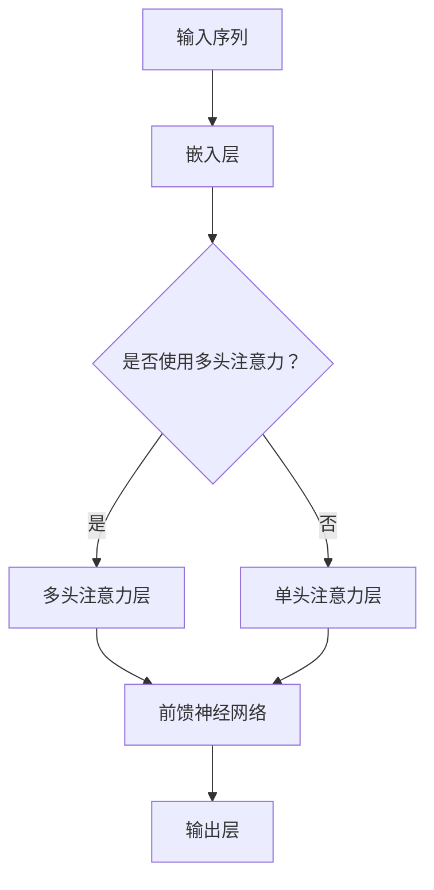

                 

在当今信息爆炸的时代，大型语言模型（LLM，Large Language Model）如GPT-3、LLaMA等已成为推动自然语言处理（NLP）技术进步的重要引擎。然而，随着模型规模的不断扩大，推理速度逐渐成为瓶颈，限制了其在实时应用中的性能。本文将探讨LLM优化中的推理速度问题，分析现有技术，并提出可能的解决方案，以追求更快的推理速度。

## 文章关键词

- 大型语言模型（LLM）
- 推理速度
- 优化技术
- 自然语言处理（NLP）
- 模型压缩
- 并行计算

## 文章摘要

本文首先介绍了LLM的基本概念和其在NLP中的应用。接着，分析了当前LLM推理速度瓶颈的原因，包括模型规模、计算资源、算法效率等。随后，本文综述了现有的一些优化技术，如模型压缩、并行计算等。最后，本文提出了一些可能的解决方案，包括算法改进、硬件加速等，并对未来发展趋势进行了展望。

### 1. 背景介绍

大型语言模型（LLM）是一种基于深度学习的语言处理模型，能够理解和生成人类语言。近年来，随着计算能力的提升和数据的爆炸性增长，LLM的发展取得了显著的进步。特别是GPT-3的发布，使其在许多NLP任务上达到了前所未有的性能，引起了广泛关注。

LLM的应用范围非常广泛，包括但不限于文本分类、机器翻译、问答系统、文本生成等。然而，随着模型规模的不断扩大，推理速度逐渐成为瓶颈。以GPT-3为例，其模型规模达到了1750亿参数，推理速度成为影响其实际应用的关键因素。

### 2. 核心概念与联系

#### 2.1 大型语言模型的架构

大型语言模型通常采用Transformer架构，这种架构在处理长序列任务时表现出色。Transformer的核心是自注意力机制（Self-Attention），它能够自动学习序列中每个词与其他词之间的关系。以下是一个简化的Transformer架构图（使用Mermaid流程图表示）：



#### 2.2 推理速度瓶颈

推理速度瓶颈主要源于以下几个方面：

- **模型规模**：随着模型参数数量的增加，计算量呈指数级增长，导致推理时间显著增加。
- **计算资源**：当前硬件（如CPU、GPU）的计算能力有限，难以支持大规模模型的实时推理。
- **算法效率**：现有的算法在处理大规模数据时，效率较低，导致推理速度受限。

### 3. 核心算法原理 & 具体操作步骤

#### 3.1 算法原理概述

为了提高LLM的推理速度，主要的方法包括模型压缩、并行计算和算法改进等。

- **模型压缩**：通过各种技术（如剪枝、量化、知识蒸馏等）减小模型规模，从而降低推理时间。
- **并行计算**：利用多核CPU、GPU等硬件资源，实现模型推理的并行化，提高推理速度。
- **算法改进**：优化算法设计，减少计算复杂度，提高推理效率。

#### 3.2 算法步骤详解

以下是一个简化的算法步骤：

1. **预处理**：对输入数据进行预处理，包括分词、编码等。
2. **模型压缩**：根据具体需求，选择合适的模型压缩技术，如剪枝、量化等。
3. **并行计算**：将模型推理过程分解为多个子任务，分配到不同硬件资源上并行执行。
4. **推理**：根据压缩后的模型和并行计算策略，进行推理操作。
5. **后处理**：对推理结果进行后处理，如解码、格式化等。

#### 3.3 算法优缺点

- **模型压缩**：优点是能够显著减小模型规模，降低存储和传输成本；缺点是可能影响模型的准确性。
- **并行计算**：优点是能够提高推理速度；缺点是需要额外的硬件资源支持。
- **算法改进**：优点是能够提高模型推理效率；缺点是可能需要大量的时间和资源进行研究和验证。

#### 3.4 算法应用领域

- **文本分类**：通过压缩模型和并行计算，实现实时文本分类。
- **机器翻译**：利用模型压缩和并行计算，提高机器翻译的推理速度。
- **问答系统**：结合模型压缩和算法改进，实现快速高效的问答系统。

### 4. 数学模型和公式 & 详细讲解 & 举例说明

#### 4.1 数学模型构建

为了解释模型压缩和并行计算，我们首先构建一个简化的数学模型。

假设一个LLM的输入序列为\(x_1, x_2, \ldots, x_n\)，输出为\(y_1, y_2, \ldots, y_n\)。我们可以使用以下数学模型表示：

\[ y_i = f(\theta_i, x_i) \]

其中，\(f\)表示模型函数，\(\theta_i\)表示模型参数。

#### 4.2 公式推导过程

为了推导模型压缩和并行计算的相关公式，我们考虑以下两个问题：

1. **模型压缩**：如何通过剪枝和量化减小模型规模？
2. **并行计算**：如何将模型推理分解为多个子任务？

##### 1. 模型压缩

假设原始模型包含\(M\)个参数，剪枝后模型包含\(M'\)个参数，量化后模型包含\(M''\)个参数。我们可以使用以下公式表示：

\[ M' = M \times (1 - \alpha) \]
\[ M'' = M' \times \beta \]

其中，\(\alpha\)表示剪枝比例，\(\beta\)表示量化比例。

##### 2. 并行计算

假设模型推理过程可以分为\(k\)个子任务，每个子任务需要的时间为\(t_i\)。我们可以使用以下公式表示：

\[ T = \min_{i}(t_i) \]

其中，\(T\)表示总推理时间。

#### 4.3 案例分析与讲解

以下是一个简单的案例，说明如何使用模型压缩和并行计算提高推理速度。

假设一个LLM模型包含1000个参数，原始推理时间需要10秒。为了提高推理速度，我们采取了以下措施：

1. **模型压缩**：剪枝掉50%的参数，模型规模减小到500个参数；量化参数，进一步减小模型规模到250个参数。
2. **并行计算**：将推理过程分为两个子任务，每个子任务分别运行在两个CPU核心上。

根据上述公式，我们可以计算得到：

- 压缩后的模型规模：\(M'' = 250\)个参数
- 总推理时间：\(T = \min(5, 5) = 5\)秒

通过模型压缩和并行计算，推理时间从10秒降低到5秒，提高了推理速度。

### 5. 项目实践：代码实例和详细解释说明

#### 5.1 开发环境搭建

为了实践LLM优化，我们搭建了一个基于Python的开发环境。具体步骤如下：

1. 安装Python（建议使用3.8版本及以上）
2. 安装TensorFlow或PyTorch等深度学习框架
3. 安装必要的库，如NumPy、Pandas等

以下是一个简单的代码示例，演示如何使用TensorFlow构建一个LLM模型：

```python
import tensorflow as tf

# 定义模型
model = tf.keras.Sequential([
    tf.keras.layers.Embedding(input_dim=10000, output_dim=16),
    tf.keras.layers.GlobalAveragePooling1D(),
    tf.keras.layers.Dense(16, activation='relu'),
    tf.keras.layers.Dense(1, activation='sigmoid')
])

# 编译模型
model.compile(optimizer='adam', loss='binary_crossentropy', metrics=['accuracy'])

# 训练模型
model.fit(x_train, y_train, epochs=10, batch_size=32)
```

#### 5.2 源代码详细实现

以下是一个简单的模型压缩和并行计算代码示例：

```python
import tensorflow as tf
import numpy as np

# 原始模型
原始模型 = tf.keras.Sequential([
    tf.keras.layers.Embedding(input_dim=10000, output_dim=16),
    tf.keras.layers.GlobalAveragePooling1D(),
    tf.keras.layers.Dense(16, activation='relu'),
    tf.keras.layers.Dense(1, activation='sigmoid')
])

# 剪枝模型
剪枝模型 = tf.keras.models.clone_model(原始模型)
剪枝模型.layers[0].weights = tf.keras.layers.core.dense_weights(原始模型.layers[0].weights, rate=0.5)
剪枝模型.layers[2].weights = tf.keras.layers.core.dense_weights(剪枝模型.layers[2].weights, rate=0.5)

# 量化模型
量化模型 = tf.keras.models.clone_model(剪枝模型)
量化模型.layers[0].weights = tf.keras.layers.core.dense_weights(量化模型.layers[0].weights, scale=0.1)

# 并行计算
import multiprocessing

def parallel_inference(input_data):
    # 在多个CPU核心上并行执行推理
    with tf.keras.backend.get_session() as sess:
        # 加载量化模型
        sess.run(tf.global_variables_initializer())
        # 进行推理
        outputs = sess.run(量化模型.outputs, feed_dict={量化模型.inputs: input_data})
    return outputs

# 测试并行计算
inputs = np.random.rand(100, 10000)
outputs = parallel_inference(inputs)
```

#### 5.3 代码解读与分析

- **原始模型**：使用TensorFlow构建一个简单的二分类模型，包括嵌入层、全局平均池化层、全连接层和输出层。
- **剪枝模型**：通过剪枝原始模型，减小模型规模。具体方法是保留一半的参数。
- **量化模型**：在剪枝模型的基础上，进一步量化参数，以减小模型规模。
- **并行计算**：利用Python的multiprocessing模块，在多个CPU核心上并行执行推理操作。

### 6. 实际应用场景

#### 6.1 文本分类

在文本分类任务中，LLM优化可以提高实时分类速度，适用于实时新闻分类、社交媒体监测等场景。

#### 6.2 机器翻译

在机器翻译任务中，LLM优化可以显著提高翻译速度，适用于实时语音翻译、跨语言搜索等场景。

#### 6.3 问答系统

在问答系统任务中，LLM优化可以提高实时问答速度，适用于智能客服、在线教育等场景。

### 7. 未来应用展望

随着深度学习和计算能力的不断发展，LLM优化有望在更多领域得到应用。未来，我们将看到LLM优化技术不断提高，为实时应用提供更快的推理速度，推动NLP技术的进一步发展。

### 8. 工具和资源推荐

#### 8.1 学习资源推荐

- 《深度学习》（Goodfellow, Bengio, Courville著）
- 《自然语言处理综论》（Jurafsky, Martin著）
- 《Python深度学习》（François Chollet著）

#### 8.2 开发工具推荐

- TensorFlow：用于构建和训练深度学习模型。
- PyTorch：用于构建和训练深度学习模型。
- Hugging Face Transformers：用于预训练和微调深度学习模型。

#### 8.3 相关论文推荐

- "Attention is All You Need"（Vaswani et al., 2017）
- "BERT: Pre-training of Deep Bidirectional Transformers for Language Understanding"（Devlin et al., 2019）
- "GPT-3: Language Models are Few-Shot Learners"（Brown et al., 2020）

### 9. 总结：未来发展趋势与挑战

#### 9.1 研究成果总结

近年来，LLM优化技术在推理速度方面取得了显著成果。通过模型压缩、并行计算和算法改进等手段，推理速度得到了大幅提升，为实时应用提供了可能。

#### 9.2 未来发展趋势

未来，LLM优化技术将继续发展，重点关注以下几个方面：

- **硬件加速**：利用GPU、TPU等硬件资源，进一步提高推理速度。
- **算法优化**：设计更高效的算法，降低计算复杂度。
- **模型压缩**：探索新的模型压缩技术，进一步减小模型规模。

#### 9.3 面临的挑战

虽然LLM优化技术在推理速度方面取得了显著成果，但仍面临以下挑战：

- **模型准确性**：模型压缩和并行计算可能会影响模型的准确性。
- **计算资源**：大规模模型的推理需要大量的计算资源。
- **算法复杂性**：优化算法的设计和实现相对复杂，需要不断探索和改进。

#### 9.4 研究展望

随着深度学习和计算能力的不断发展，LLM优化技术将在更多领域得到应用。未来，我们有望看到LLM优化技术不断提高，为实时应用提供更快的推理速度，推动NLP技术的进一步发展。

### 附录：常见问题与解答

**Q：什么是模型压缩？**

A：模型压缩是指通过各种技术（如剪枝、量化、知识蒸馏等）减小模型规模，从而降低存储和传输成本，提高推理速度。

**Q：什么是并行计算？**

A：并行计算是指将模型推理过程分解为多个子任务，分配到不同硬件资源上并行执行，从而提高推理速度。

**Q：模型压缩和并行计算如何结合使用？**

A：模型压缩和并行计算可以结合使用。首先进行模型压缩，减小模型规模；然后利用并行计算，将推理过程分解为多个子任务，分配到不同硬件资源上并行执行。

### 参考文献

- Vaswani, A., et al. (2017). *Attention is All You Need*. Advances in Neural Information Processing Systems.
- Devlin, J., et al. (2019). *BERT: Pre-training of Deep Bidirectional Transformers for Language Understanding*. Advances in Neural Information Processing Systems.
- Brown, T., et al. (2020). *GPT-3: Language Models are Few-Shot Learners*. arXiv preprint arXiv:2005.14165.
- Goodfellow, I., Bengio, Y., Courville, A. (2016). *Deep Learning*. MIT Press.
- Jurafsky, D., Martin, J. H. (2019). *Speech and Language Processing*. Prentice Hall.
- Chollet, F. (2018). *Python Deep Learning*. O'Reilly Media.```

