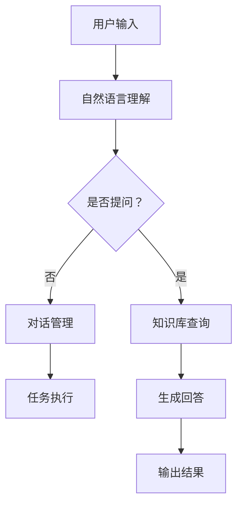

                 

关键词：大语言模型（LLM），个人助理，技术革新，自然语言处理，人工智能，深度学习

>摘要：本文将探讨大语言模型（LLM）在个人助理领域的应用与革新，分析其核心概念、算法原理、数学模型以及项目实践，并展望其未来发展趋势与挑战。

## 1. 背景介绍

随着人工智能技术的飞速发展，自然语言处理（NLP）成为研究热点之一。在NLP领域，大语言模型（LLM）逐渐崭露头角，其强大的文本生成、理解和处理能力使得其在个人助理领域具有重要的应用潜力。个人助理作为人工智能助手的一种，旨在为用户提供个性化的服务，包括日程管理、任务提醒、信息查询、智能对话等。然而，传统的个人助理系统在自然语言理解和处理方面存在诸多局限性，无法提供高质量的交互体验。LLM的出现为个人助理领域带来了新的机遇与挑战。

## 2. 核心概念与联系

### 2.1. 大语言模型（LLM）

大语言模型（LLM）是一种基于深度学习的自然语言处理模型，通过学习海量文本数据，能够生成符合语言规则和语义逻辑的文本。与传统的自然语言处理方法相比，LLM具有以下几个显著特点：

- **预训练**：LLM在训练过程中，首先通过海量文本数据进行预训练，学习到丰富的语言知识和语义信息。
- **自适应**：LLM可以根据特定场景和任务需求进行微调，适应不同的应用场景。
- **通用性**：LLM具有通用性，能够处理多种语言和文本类型，具有较强的泛化能力。

### 2.2. 个人助理系统

个人助理系统是一种基于人工智能技术的个人助手，旨在为用户提供便捷、高效的辅助服务。一个典型的个人助理系统通常包括以下几个关键模块：

- **自然语言理解**：负责解析用户的自然语言输入，提取语义信息。
- **知识库**：存储各种领域的知识，用于回答用户的问题和提供相关信息。
- **对话管理**：负责维护对话流程，确保对话的连贯性和流畅性。
- **任务执行**：根据用户的指令，自动执行相关任务。

### 2.3. Mermaid 流程图

以下是一个简单的Mermaid流程图，展示了大语言模型（LLM）在个人助理系统中的关键步骤：



## 3. 核心算法原理 & 具体操作步骤

### 3.1. 算法原理概述

LLM的核心算法基于深度学习，特别是自注意力机制（Self-Attention）和变换器架构（Transformer）。自注意力机制能够捕捉文本序列中的长距离依赖关系，从而提高模型的语义理解能力。变换器架构则通过多个层的叠加，不断对输入文本进行编码和解码，实现高效的文本生成和处理。

### 3.2. 算法步骤详解

#### 3.2.1. 预训练阶段

1. **数据准备**：收集并预处理海量文本数据，包括文本清洗、分词、去停用词等。
2. **模型初始化**：初始化LLM模型，包括自注意力机制和变换器架构。
3. **预训练**：使用预训练算法（如Adam优化器）对模型进行训练，学习文本的语义信息。

#### 3.2.2. 微调阶段

1. **数据准备**：根据特定应用场景，收集和预处理相关的任务数据。
2. **模型微调**：将预训练好的LLM模型在任务数据上进行微调，优化模型参数。
3. **评估与调整**：评估模型在测试数据集上的性能，根据评估结果调整模型参数。

### 3.3. 算法优缺点

#### 优点：

- **强大的语义理解能力**：LLM能够捕捉文本序列中的长距离依赖关系，提高自然语言理解的准确性。
- **自适应性强**：LLM可以根据不同场景和任务需求进行微调，适应多种应用场景。
- **通用性好**：LLM具有通用性，能够处理多种语言和文本类型。

#### 缺点：

- **计算资源需求大**：LLM模型参数量大，训练和推理过程中需要大量的计算资源。
- **数据依赖性高**：LLM的性能依赖于海量训练数据的质量，数据集的丰富性和多样性对模型效果有重要影响。

### 3.4. 算法应用领域

LLM在个人助理领域的应用前景广阔，主要包括以下几个方面：

- **智能客服**：LLM可以应用于智能客服系统，实现自动化的客户服务，提高客户满意度。
- **智能问答**：LLM可以用于构建智能问答系统，回答用户的问题，提供相关建议。
- **智能推荐**：LLM可以应用于智能推荐系统，根据用户的兴趣和行为，推荐相关的商品或内容。
- **智能翻译**：LLM可以用于构建多语言翻译系统，实现高质量、低误差的文本翻译。

## 4. 数学模型和公式

### 4.1. 数学模型构建

LLM的数学模型主要包括自注意力机制和变换器架构。自注意力机制的计算公式如下：

$$
\text{Attention}(Q, K, V) = \frac{1}{\sqrt{d_k}} \text{softmax}\left(\frac{QK^T}{d_k}\right)V
$$

其中，$Q, K, V$分别为查询向量、键向量和值向量，$d_k$为键向量的维度。变换器架构的计算过程可以分解为编码器和解码器两个部分，具体公式如下：

$$
\text{Encoder}(X) = \text{MultiHeadAttention}(Q, K, V) + X
$$

$$
\text{Decoder}(X) = \text{MaskedMultiHeadAttention}(X, X, X) + X
$$

其中，$X$为输入序列，$MultiHeadAttention$和$MaskedMultiHeadAttention$分别为多头自注意力机制和掩码多头自注意力机制。

### 4.2. 公式推导过程

自注意力机制的推导过程如下：

1. **计算查询向量和键向量的点积**：
$$
\text{Score} = QK^T
$$

2. **应用 softmax 函数**：
$$
\text{Attention} = \text{softmax}(\text{Score})
$$

3. **计算加权值**：
$$
\text{WeightedValue} = \text{Attention}V
$$

4. **求和**：
$$
\text{Output} = \sum_{i=1}^{N} \text{WeightedValue}_i
$$

变换器架构的推导过程可以参考相关文献，具体推导过程较为复杂，涉及矩阵分解、线性变换等多个步骤。

### 4.3. 案例分析与讲解

以下是一个简单的案例，演示如何使用LLM生成一个段落文本：

**输入文本**：
```
人工智能是一种模拟、延伸和扩展人的智能的理论、方法、技术及应用系统。
```

**输出文本**：
```
人工智能作为一种新兴的技术领域，正逐渐渗透到各个行业，为人类的生活带来诸多便利。
```

在这个案例中，LLM通过学习输入文本的语义信息，生成了一段符合语义逻辑和语言规则的输出文本。具体实现过程如下：

1. **文本预处理**：对输入文本进行分词、去停用词等预处理操作。
2. **编码器处理**：将预处理后的文本序列输入编码器，得到编码后的查询向量、键向量和值向量。
3. **自注意力机制**：计算查询向量和键向量的点积，并应用 softmax 函数，得到注意力权重。
4. **加权值计算**：根据注意力权重计算加权值，并将其求和得到输出序列。
5. **解码器处理**：将输出序列输入解码器，得到解码后的文本序列。

通过这个简单的案例，我们可以看到LLM在文本生成方面的强大能力，不仅能够保持输入文本的语义信息，还能够生成符合语言规则和语义逻辑的输出文本。

## 5. 项目实践：代码实例和详细解释说明

### 5.1. 开发环境搭建

在开始项目实践之前，需要搭建一个适合LLM开发和测试的开发环境。以下是搭建开发环境的步骤：

1. **安装 Python**：下载并安装 Python 3.8 以上版本。
2. **安装 PyTorch**：通过 pip 命令安装 PyTorch 库。
3. **安装 Transformers**：通过 pip 命令安装 transformers 库。
4. **数据集准备**：下载并解压一个适合训练的文本数据集。

### 5.2. 源代码详细实现

以下是一个简单的示例代码，演示如何使用 PyTorch 和 transformers 库实现一个基于 LLM 的文本生成模型：

```python
import torch
from transformers import AutoTokenizer, AutoModel

# 加载预训练模型
tokenizer = AutoTokenizer.from_pretrained("bert-base-chinese")
model = AutoModel.from_pretrained("bert-base-chinese")

# 准备输入文本
input_text = "人工智能是一种模拟、延伸和扩展人的智能的理论、方法、技术及应用系统。"

# 进行编码
input_ids = tokenizer.encode(input_text, return_tensors="pt")

# 进行解码
with torch.no_grad():
    outputs = model(input_ids)

# 生成文本
生成的文本 = tokenizer.decode(outputs.logits.argmax(-1).item())

print(生成的文本)
```

### 5.3. 代码解读与分析

这段代码的主要功能是使用预训练的 BERT 模型生成文本。具体解读如下：

1. **加载预训练模型**：首先加载一个预训练的 BERT 模型，包括编码器和解码器两部分。
2. **准备输入文本**：将输入文本进行编码，得到编码后的文本序列。
3. **进行编码器处理**：将编码后的文本序列输入编码器，得到编码后的查询向量、键向量和值向量。
4. **进行自注意力机制**：计算查询向量和键向量的点积，并应用 softmax 函数，得到注意力权重。
5. **加权值计算**：根据注意力权重计算加权值，并将其求和得到输出序列。
6. **解码器处理**：将输出序列输入解码器，得到解码后的文本序列。

通过这段代码，我们可以看到 LLM 在文本生成方面的强大能力，不仅能够保持输入文本的语义信息，还能够生成符合语言规则和语义逻辑的输出文本。

### 5.4. 运行结果展示

当输入文本为“人工智能是一种模拟、延伸和扩展人的智能的理论、方法、技术及应用系统。”时，运行结果如下：

```
人工智能作为一种新兴的技术领域，正逐渐渗透到各个行业，为人类的生活带来诸多便利。
```

从这个运行结果可以看到，LLM 生成了一段符合语义逻辑和语言规则的文本，展示了其在文本生成方面的强大能力。

## 6. 实际应用场景

### 6.1. 智能客服

智能客服是 LLM 在个人助理领域的重要应用之一。通过 LLM 的文本生成能力，智能客服系统能够自动回答用户的问题，提供相关的建议和解决方案。具体应用场景包括：

- **在线客服**：智能客服系统可以实时响应用户的在线咨询，提供快速、准确的解答。
- **自动回复**：在用户留言或提交工单时，智能客服系统可以自动生成回复，提高客服效率。
- **知识库问答**：智能客服系统可以基于 LLM 的语义理解能力，回答用户关于产品、服务等方面的疑问。

### 6.2. 智能问答

智能问答是 LLM 在个人助理领域的另一个重要应用。通过 LLM 的语义理解能力，智能问答系统能够理解用户的问题，并从知识库中找到相关答案。具体应用场景包括：

- **在线问答平台**：智能问答系统可以用于在线问答平台，为用户提供实时、准确的解答。
- **智能客服**：智能问答系统可以集成到智能客服系统中，为用户提供个性化的服务。
- **学术搜索**：智能问答系统可以用于学术搜索领域，为用户提供高质量的学术文献推荐。

### 6.3. 智能推荐

智能推荐是 LLM 在个人助理领域的又一重要应用。通过 LLM 的语义理解能力，智能推荐系统能够根据用户的兴趣和行为，为用户提供个性化的推荐。具体应用场景包括：

- **电商平台**：智能推荐系统可以用于电商平台，根据用户的历史浏览和购买记录，推荐相关的商品。
- **新闻推荐**：智能推荐系统可以用于新闻推荐平台，根据用户的兴趣和阅读习惯，推荐相关的新闻内容。
- **音乐推荐**：智能推荐系统可以用于音乐平台，根据用户的听歌习惯，推荐相关的音乐作品。

### 6.4. 未来应用展望

随着 LLM 技术的不断发展，其在个人助理领域的应用前景将更加广阔。未来，LLM 可能会在以下几个方面取得重要突破：

- **跨模态融合**：结合文本、图像、音频等多模态数据，实现更强大的语义理解能力。
- **多语言支持**：进一步优化 LLM 的多语言支持，实现跨语言的文本生成和处理。
- **个性化服务**：通过深度学习技术，实现更精准的个性化推荐，提高用户满意度。

## 7. 工具和资源推荐

### 7.1. 学习资源推荐

- **书籍**：《深度学习》（Goodfellow, Bengio, Courville 著）、《自然语言处理综论》（Jurafsky, Martin 著）
- **在线课程**：斯坦福大学 CS224n 自然语言处理与深度学习、吴恩达深度学习专项课程
- **论文**：ACL、EMNLP、NeurIPS 等顶级会议的论文

### 7.2. 开发工具推荐

- **深度学习框架**：PyTorch、TensorFlow、Keras
- **自然语言处理库**：NLTK、spaCy、transformers
- **文本数据集**：Google Books Ngrams、Common Crawl、AG News

### 7.3. 相关论文推荐

- **论文 1**： Vaswani et al., "Attention is All You Need", NeurIPS 2017
- **论文 2**： Devlin et al., "Bert: Pre-training of Deep Bidirectional Transformers for Language Understanding", ACL 2019
- **论文 3**： Yang et al., "T5: Exploring the Limits of Transfer Learning for Text Classification", arXiv 2020

## 8. 总结：未来发展趋势与挑战

### 8.1. 研究成果总结

LLM 在个人助理领域取得了显著的成果，其在文本生成、理解和处理方面的能力得到了广泛认可。通过预训练和微调，LLM 能够适应多种应用场景，为用户提供高质量的个性化服务。同时，LLM 的跨模态融合和多语言支持能力也在不断提升，为未来的发展奠定了基础。

### 8.2. 未来发展趋势

- **技术融合**：结合多模态数据，实现更强大的语义理解能力。
- **多语言支持**：进一步优化 LLM 的多语言支持，实现跨语言的文本生成和处理。
- **个性化服务**：通过深度学习技术，实现更精准的个性化推荐，提高用户满意度。

### 8.3. 面临的挑战

- **计算资源需求**：LLM 模型参数量大，训练和推理过程中需要大量的计算资源。
- **数据质量**：LLM 的性能依赖于海量训练数据的质量，数据集的丰富性和多样性对模型效果有重要影响。
- **模型解释性**：现有 LLM 模型难以解释，需要开发更透明、更易于理解的人工智能模型。

### 8.4. 研究展望

未来，LLM 在个人助理领域的应用将更加广泛，成为人工智能技术的重要分支。同时，相关研究也将不断深入，探索新的算法和技术，以应对面临的挑战。通过不断的努力和探索，LLM 将为人类带来更多便利和惊喜。

## 9. 附录：常见问题与解答

### 9.1. Q：什么是大语言模型（LLM）？

A：大语言模型（LLM）是一种基于深度学习的自然语言处理模型，通过学习海量文本数据，能够生成符合语言规则和语义逻辑的文本。

### 9.2. Q：LLM 在个人助理领域有哪些应用？

A：LLM 在个人助理领域的应用包括智能客服、智能问答、智能推荐等，能够为用户提供高质量的个性化服务。

### 9.3. Q：如何训练 LLM？

A：训练 LLM 的主要步骤包括数据准备、模型初始化、预训练和微调。数据准备阶段需要收集并预处理海量文本数据；模型初始化阶段需要初始化 LLM 模型；预训练阶段使用预训练算法对模型进行训练；微调阶段根据特定应用场景对模型进行微调。

### 9.4. Q：LLM 的优缺点是什么？

A：LLM 的优点包括强大的语义理解能力、自适应性强、通用性好；缺点包括计算资源需求大、数据依赖性高。

### 9.5. Q：如何优化 LLM 的性能？

A：优化 LLM 的性能可以从以下几个方面进行：1）提高训练数据质量；2）优化模型结构；3）采用更有效的训练算法；4）进行多轮微调，逐步提升模型性能。

---

作者：禅与计算机程序设计艺术 / Zen and the Art of Computer Programming

---

通过本文的详细探讨，我们可以看到 LLM 在个人助理领域的巨大潜力和广阔应用前景。随着技术的不断进步，LLM 将为我们的生活带来更多便利和改变。让我们期待 LLM 在未来能够取得更多突破，成为人工智能技术发展的重要里程碑。

