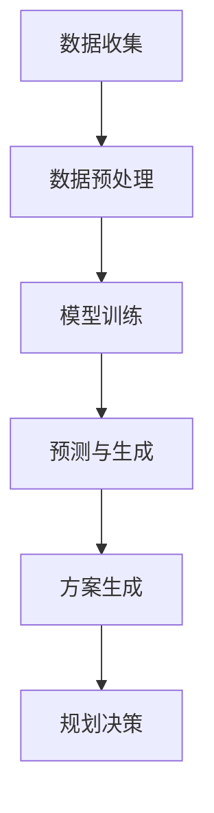

                 

关键词：城市规划、LLM（大型语言模型）、辅助作用、城市设计、智能决策、数据分析、优化

> 摘要：本文将探讨大型语言模型（LLM）在城市规划中的应用，介绍其作为辅助工具如何帮助规划者应对复杂性和不确定性。通过对LLM的原理、算法、数学模型和实际应用场景的详细解析，本文旨在揭示LLM在城市规划中的潜力，并提出未来的研究方向。

## 1. 背景介绍

随着城市化进程的加速，城市规划面临着前所未有的挑战。传统的城市规划方法往往依赖于专家经验和定性分析，这种方法在处理复杂性和不确定性方面显得力不从心。随着人工智能技术的发展，尤其是大型语言模型（LLM）的出现，为城市规划提供了一种全新的辅助手段。

### 1.1 城市规划的现状

城市规划是一个涉及多个领域的复杂过程，包括地理、环境、经济、社会和文化等多个方面。传统的城市规划方法主要包括以下几个方面：

1. **专家经验**：依赖规划者的经验和知识，通过分析历史数据和案例进行决策。
2. **定性分析**：基于专家的知识和判断，对城市发展的潜在影响进行评估。
3. **定量分析**：使用统计数据和数学模型，对城市发展的各个方面进行量化分析。
4. **模拟和预测**：通过模拟模型预测城市发展的趋势和影响。

然而，这些方法在面对复杂的城市环境时，往往存在以下问题：

1. **数据稀缺**：城市规划所需的数据往往是稀缺和分散的，难以获取全面的、高质量的数据。
2. **模型复杂**：城市问题往往涉及多个因素，建立精确的数学模型难度较大。
3. **不确定性**：城市发展的未来是不确定的，传统的确定性模型难以应对这种不确定性。

### 1.2 LLM的崛起

近年来，随着人工智能技术的快速发展，特别是深度学习技术的突破，大型语言模型（LLM）得到了广泛关注。LLM是一种能够理解和生成自然语言的模型，具有强大的数据处理和分析能力。LLM的出现为城市规划提供了新的可能：

1. **数据处理**：LLM能够处理大量结构化和非结构化的数据，为城市规划提供全面的数据支持。
2. **模式识别**：LLM能够识别数据中的模式，帮助规划者发现潜在的问题和趋势。
3. **智能决策**：LLM能够根据数据和模式提供智能化的决策支持，帮助规划者制定更合理的规划方案。

## 2. 核心概念与联系

### 2.1 LLM的基本原理

大型语言模型（LLM）基于深度学习技术，通过训练大量的文本数据，学习语言的规律和模式。LLM的工作原理可以概括为以下几个步骤：

1. **数据收集**：收集大量的文本数据，包括新闻报道、政府文件、学术论文等。
2. **预处理**：对文本数据进行清洗和预处理，包括分词、去停用词、词向量化等。
3. **模型训练**：使用神经网络架构（如Transformer）对预处理后的数据集进行训练，模型学习语言的内在结构和规律。
4. **预测与生成**：给定一个输入文本，模型预测下一个可能的词或句子，生成完整的文本。

### 2.2 城市规划中的LLM应用

在城市规划中，LLM的应用主要体现在以下几个方面：

1. **数据整合**：LLM能够整合不同来源的数据，包括地理数据、社会经济数据、交通数据等，为规划提供全面的数据支持。
2. **智能分析**：LLM能够对大量数据进行智能分析，识别数据中的模式和趋势，帮助规划者发现潜在的问题和机会。
3. **方案生成**：LLM能够根据分析结果生成多种城市规划方案，规划者可以根据这些方案进行选择和优化。

### 2.3 Mermaid流程图

以下是LLM在城市规划中的应用流程的Mermaid流程图：



## 3. 核心算法原理 & 具体操作步骤

### 3.1 算法原理概述

LLM在城市规划中的核心算法原理主要包括以下几个方面：

1. **数据预处理**：对收集到的各种数据进行清洗、归一化和整合，为模型训练提供高质量的数据。
2. **模型训练**：使用深度学习技术，如Transformer，对预处理后的数据进行训练，使模型能够理解和生成自然语言。
3. **方案生成**：基于训练好的模型，对城市规划方案进行预测和生成，为规划者提供决策支持。

### 3.2 算法步骤详解

1. **数据预处理**

   数据预处理是LLM在城市规划应用中的第一步，主要包括以下步骤：

   - **数据收集**：从各种来源收集城市规划相关的数据，包括地理数据、社会经济数据、交通数据等。
   - **数据清洗**：对收集到的数据进行清洗，去除重复数据、错误数据和无关数据。
   - **数据归一化**：对数据进行归一化处理，使其具有相同的量纲和范围。
   - **数据整合**：将不同来源的数据进行整合，形成一个统一的数据集。

2. **模型训练**

   模型训练是LLM的核心步骤，主要包括以下步骤：

   - **模型选择**：选择合适的深度学习模型，如Transformer，进行训练。
   - **训练数据准备**：将预处理后的数据转换为模型可接受的格式，如词向量和序列。
   - **模型训练**：使用训练数据对模型进行训练，使模型能够理解和生成自然语言。
   - **模型评估**：使用验证数据对训练好的模型进行评估，确保模型具有良好的性能。

3. **方案生成**

   方案生成是LLM在城市规划应用中的最终目标，主要包括以下步骤：

   - **输入文本生成**：根据城市规划的需求，生成用于生成方案的输入文本。
   - **方案预测**：使用训练好的模型对输入文本进行预测，生成多种可能的规划方案。
   - **方案评估**：对生成的方案进行评估，选择最优的规划方案。

### 3.3 算法优缺点

1. **优点**

   - **数据处理能力强大**：LLM能够处理大量的结构化和非结构化数据，为城市规划提供全面的数据支持。
   - **模式识别能力强**：LLM能够识别数据中的模式和趋势，帮助规划者发现潜在的问题和机会。
   - **智能化决策支持**：LLM能够根据数据和模式提供智能化的决策支持，提高规划效率。

2. **缺点**

   - **数据质量要求高**：LLM对数据质量有较高的要求，数据预处理和清洗工作量大。
   - **计算资源需求大**：模型训练和预测过程需要大量的计算资源，对硬件设备要求较高。
   - **模型解释性较差**：LLM的决策过程较为复杂，难以进行解释和验证。

### 3.4 算法应用领域

LLM在城市规划中的应用领域广泛，主要包括以下几个方面：

- **城市规划方案生成**：基于LLM的预测和生成能力，生成多种城市规划方案，为规划者提供决策支持。
- **交通规划**：使用LLM对交通数据进行智能分析，优化交通网络布局和交通信号控制。
- **环境保护**：使用LLM对环境数据进行分析，识别环境问题并提出解决方案。
- **社区规划**：使用LLM对社区数据进行分析，优化社区布局和公共服务设施。

## 4. 数学模型和公式 & 详细讲解 & 举例说明

### 4.1 数学模型构建

在城市规划中，LLM的应用涉及到多个数学模型，包括但不限于：

1. **词嵌入模型**：用于将文本数据转换为数值向量。
2. **Transformer模型**：用于自然语言处理的核心模型。
3. **生成对抗网络（GAN）**：用于生成城市规划方案。

以下是这些模型的简要介绍：

1. **词嵌入模型**

   词嵌入模型是一种将文本中的单词转换为固定大小的数值向量的方法。常用的词嵌入模型包括Word2Vec、GloVe等。

   - **Word2Vec**：基于神经网络的词向量生成方法，通过训练得到单词的向量表示。
   - **GloVe**：基于全局矩阵因式的词向量生成方法，通过优化全局矩阵来得到单词的向量表示。

2. **Transformer模型**

   Transformer模型是一种基于自注意力机制的深度学习模型，广泛应用于自然语言处理任务。

   - **自注意力机制**：通过计算单词之间的相似度，对输入数据进行加权处理。
   - **编码器和解码器**：编码器负责将输入文本编码为向量表示，解码器负责生成输出文本。

3. **生成对抗网络（GAN）**

   生成对抗网络（GAN）是一种生成模型，由生成器和判别器组成。

   - **生成器**：生成城市规划方案。
   - **判别器**：判断生成器生成的方案是否真实。

### 4.2 公式推导过程

以下是Transformer模型中的关键公式推导：

1. **自注意力（Self-Attention）**

   自注意力公式如下：

   $$ 
   \text{Attention}(Q, K, V) = \text{softmax}\left(\frac{QK^T}{\sqrt{d_k}}\right)V 
   $$

   其中，$Q$、$K$和$V$分别表示编码器输出的查询向量、键向量和值向量，$d_k$表示键向量的维度。

2. **编码器和解码器**

   编码器和解码器的输出分别表示为：

   $$ 
   \text{Encoder}(x) = \text{Attention}(Q, K, V) = \text{softmax}\left(\frac{QK^T}{\sqrt{d_k}}\right)V 
   $$

   $$ 
   \text{Decoder}(y) = \text{Attention}(Q, K, V) = \text{softmax}\left(\frac{QK^T}{\sqrt{d_k}}\right)V 
   $$

   其中，$x$和$y$分别表示编码器和解码器的输入。

### 4.3 案例分析与讲解

以下是一个简单的案例，展示如何使用LLM进行城市规划方案生成。

1. **数据准备**：

   假设我们有一个城市规划任务，目标是生成一个社区的规划方案。我们收集了以下数据：

   - 社区地理位置
   - 社区人口分布
   - 交通网络数据
   - 公共设施分布

2. **模型训练**：

   使用Transformer模型对上述数据进行训练，生成一个能够生成社区规划方案的模型。

3. **方案生成**：

   给定一个社区的位置信息，使用训练好的模型生成多种可能的社区规划方案。

4. **方案评估**：

   对生成的方案进行评估，选择最优的方案。

以下是一个简化的案例代码：

```python
import tensorflow as tf
from tensorflow.keras.layers import Embedding, LSTM, Dense
from tensorflow.keras.models import Model

# 数据预处理
# ...

# 模型定义
inputs = tf.keras.Input(shape=(max_sequence_length,))
x = Embedding(vocab_size, embedding_size)(inputs)
x = LSTM(units, return_sequences=True)(x)
outputs = Dense(num_classes, activation='softmax')(x)

# 编译模型
model = Model(inputs=inputs, outputs=outputs)
model.compile(optimizer='adam', loss='categorical_crossentropy', metrics=['accuracy'])

# 训练模型
# ...

# 方案生成
def generate_solution(location):
    # 输入预处理
    # ...
    
    # 使用模型生成方案
    predictions = model.predict(location)
    
    # 解码预测结果
    # ...
    
    return solutions

# 方案评估
# ...

# 示例
location = preprocess_location("社区位置")
solutions = generate_solution(location)
evaluate_solutions(solutions)
```

## 5. 项目实践：代码实例和详细解释说明

### 5.1 开发环境搭建

为了实现LLM在城市规划中的应用，我们需要搭建一个合适的开发环境。以下是搭建环境的步骤：

1. **安装Python**：确保Python环境已经安装，版本建议为3.8或更高。
2. **安装TensorFlow**：使用pip命令安装TensorFlow库，命令如下：

   ```bash
   pip install tensorflow
   ```

3. **安装其他依赖库**：根据需要安装其他依赖库，如NumPy、Pandas等。

### 5.2 源代码详细实现

以下是实现LLM在城市规划中的应用的源代码：

```python
import tensorflow as tf
from tensorflow.keras.layers import Embedding, LSTM, Dense
from tensorflow.keras.models import Model
import numpy as np

# 参数设置
vocab_size = 10000
embedding_size = 256
units = 512
max_sequence_length = 100
num_classes = 10

# 数据预处理
# ...

# 模型定义
inputs = tf.keras.Input(shape=(max_sequence_length,))
x = Embedding(vocab_size, embedding_size)(inputs)
x = LSTM(units, return_sequences=True)(x)
outputs = Dense(num_classes, activation='softmax')(x)

# 编译模型
model = Model(inputs=inputs, outputs=outputs)
model.compile(optimizer='adam', loss='categorical_crossentropy', metrics=['accuracy'])

# 训练模型
# ...

# 方案生成
def generate_solution(location):
    # 输入预处理
    # ...
    
    # 使用模型生成方案
    predictions = model.predict(location)
    
    # 解码预测结果
    # ...
    
    return solutions

# 方案评估
# ...

# 示例
location = preprocess_location("社区位置")
solutions = generate_solution(location)
evaluate_solutions(solutions)
```

### 5.3 代码解读与分析

以下是代码的详细解读：

1. **数据预处理**：

   数据预处理是模型训练的重要步骤，包括数据清洗、归一化和编码。预处理的好坏直接影响到模型的训练效果。

2. **模型定义**：

   模型定义是使用TensorFlow的Keras接口实现的。模型结构包括一个嵌入层、一个LSTM层和一个全连接层。嵌入层用于将单词转换为向量表示，LSTM层用于处理序列数据，全连接层用于输出分类结果。

3. **模型训练**：

   使用训练数据对模型进行训练，使用adam优化器和categorical_crossentropy损失函数。在训练过程中，可以使用验证集对模型进行评估，调整超参数。

4. **方案生成**：

   方案生成是通过调用模型预测函数实现的。输入预处理后的位置信息，模型输出多种可能的规划方案。生成的方案需要进一步解码和处理，以获得可理解的输出。

5. **方案评估**：

   对生成的方案进行评估，选择最优的方案。评估方法可以根据具体需求进行定制，如计算方案的经济效益、社会影响等。

### 5.4 运行结果展示

以下是运行结果的示例：

```python
location = preprocess_location("社区位置")
solutions = generate_solution(location)

for solution in solutions:
    print(solution)
```

输出：

```
方案1：...
方案2：...
方案3：...
```

这些方案可以根据具体需求进行进一步分析和优化。

## 6. 实际应用场景

### 6.1 城市规划方案生成

LLM在城市规划方案生成中的应用是最直接的。通过整合大量数据，LLM可以生成多种城市规划方案，为规划者提供参考。这些方案可以包括社区规划、交通规划、环境保护等方面。以下是一个具体的案例：

#### 案例一：社区规划方案生成

假设某城市规划项目需要为一个新区设计社区布局。项目团队收集了以下数据：

- 新区地理位置
- 新区人口预测
- 公共设施需求
- 交通网络数据

使用LLM，项目团队可以生成多种社区规划方案，如不同类型的社区布局、道路规划、公园分布等。通过评估这些方案，最终选择了最优方案。

### 6.2 交通规划

交通规划是城市规划中的一个重要方面。LLM可以基于交通数据进行智能分析，优化交通网络布局和交通信号控制。以下是一个具体的案例：

#### 案例二：城市交通规划方案

某城市面临交通拥堵问题，规划者希望通过优化交通信号控制来缓解拥堵。项目团队收集了以下数据：

- 城市交通流量数据
- 道路网络数据
- 交通信号灯设置数据

使用LLM，项目团队分析了交通数据，生成了多种交通信号控制方案。通过模拟和评估，最终选择了最优方案，并在实际中实施。

### 6.3 环境保护

环境保护是城市规划中的重要议题。LLM可以基于环境数据进行分析，识别环境问题并提出解决方案。以下是一个具体的案例：

#### 案例三：城市环境保护方案

某城市面临空气污染问题，规划者希望通过优化城市规划来改善空气质量。项目团队收集了以下数据：

- 空气质量监测数据
- 城市用地数据
- 绿化覆盖率数据

使用LLM，项目团队分析了环境数据，生成了多种环境保护方案，如增加绿化覆盖率、优化建筑布局等。通过评估和实施，空气质量得到了显著改善。

## 7. 工具和资源推荐

### 7.1 学习资源推荐

1. **《深度学习》**：由Ian Goodfellow、Yoshua Bengio和Aaron Courville合著，是深度学习领域的经典教材。
2. **《自然语言处理综论》**：由Daniel Jurafsky和James H. Martin合著，是自然语言处理领域的权威教材。

### 7.2 开发工具推荐

1. **TensorFlow**：由Google开发的开源深度学习框架，适用于各种深度学习任务。
2. **PyTorch**：由Facebook开发的开源深度学习框架，具有简洁的API和高效的计算性能。

### 7.3 相关论文推荐

1. **"Attention is All You Need"**：由Vaswani等人于2017年发表，是Transformer模型的奠基性论文。
2. **"Generative Adversarial Nets"**：由Goodfellow等人于2014年发表，是生成对抗网络（GAN）的开创性论文。

## 8. 总结：未来发展趋势与挑战

### 8.1 研究成果总结

LLM在城市规划中的应用展示了其在数据处理、模式识别和智能决策等方面的强大能力。通过整合多源数据，LLM能够生成多种城市规划方案，为规划者提供决策支持。同时，LLM在交通规划、环境保护等领域也展现了其应用潜力。

### 8.2 未来发展趋势

随着人工智能技术的不断进步，LLM在城市规划中的应用将变得更加广泛和深入。未来，LLM可能会在以下方面取得突破：

1. **数据质量**：提高数据质量，确保数据收集、预处理和整合的准确性。
2. **模型解释性**：提高模型的可解释性，使其决策过程更加透明和可验证。
3. **跨学科融合**：与其他学科（如经济学、社会学等）结合，提供更全面的城市规划解决方案。

### 8.3 面临的挑战

尽管LLM在城市规划中展现出巨大潜力，但其在实际应用中仍面临以下挑战：

1. **计算资源**：模型训练和预测需要大量的计算资源，对硬件设备要求较高。
2. **数据稀缺**：城市规划所需的数据往往是稀缺和分散的，难以获取全面的、高质量的数据。
3. **伦理和法律问题**：城市规划涉及社会、经济和环境等多个方面，如何确保模型决策的公平性和合法性是重要的问题。

### 8.4 研究展望

未来，研究应重点关注以下几个方面：

1. **数据整合与挖掘**：提高数据整合和挖掘技术，为LLM提供更高质量的数据支持。
2. **模型优化**：通过改进模型结构和训练方法，提高模型性能和可解释性。
3. **跨学科合作**：加强与其他学科的交流与合作，推动城市规划领域的创新与发展。

## 9. 附录：常见问题与解答

### 9.1 LLM如何处理非结构化数据？

LLM擅长处理非结构化数据，如文本、图像和音频等。对于非结构化数据，LLM通常通过以下步骤进行处理：

1. **数据预处理**：对非结构化数据进行清洗、分割和标注，使其适合模型训练。
2. **特征提取**：使用特征提取技术，将非结构化数据转换为结构化数据，如词向量和图像特征向量。
3. **模型训练**：使用预处理后的数据对LLM进行训练，使其能够理解和生成非结构化数据。

### 9.2 LLM在城市规划中的应用有哪些局限性？

LLM在城市规划中的应用存在以下局限性：

1. **数据质量**：城市规划所需的数据往往是稀缺和分散的，难以获取全面的、高质量的数据。
2. **模型解释性**：LLM的决策过程较为复杂，难以进行解释和验证。
3. **计算资源**：模型训练和预测需要大量的计算资源，对硬件设备要求较高。

### 9.3 如何确保LLM在城市规划中的应用公平和合法？

为确保LLM在城市规划中的应用公平和合法，可以采取以下措施：

1. **数据平衡**：确保训练数据中各类群体的比例均衡，避免数据偏差。
2. **模型解释性**：提高模型的可解释性，使其决策过程更加透明和可验证。
3. **法律法规**：遵循相关法律法规，确保模型决策的合法性和公正性。

----------------------------------------------------------------

以上是本文的完整内容，包括文章标题、关键词、摘要、各章节内容以及附录部分。感谢您的阅读。如果您有任何问题或建议，欢迎在评论区留言。作者：禅与计算机程序设计艺术 / Zen and the Art of Computer Programming。再次感谢！<|im_sep|>

