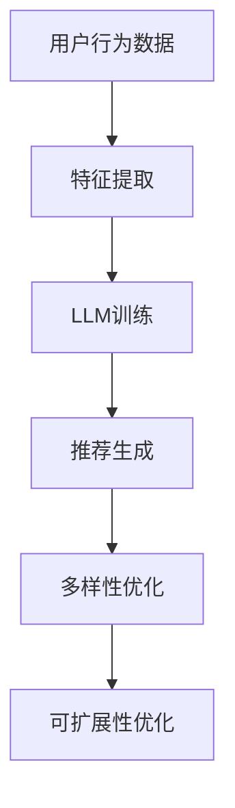

                 

关键词：LLM、推荐系统、多样性与可扩展性、算法、数学模型、实践案例、未来展望

> 摘要：随着人工智能技术的不断发展，大型语言模型（LLM）在推荐系统中的应用越来越广泛。本文将探讨LLM在推荐系统中的多样性与可扩展性，介绍其核心概念、算法原理、数学模型以及实际应用案例，并对未来发展趋势与挑战进行展望。

## 1. 背景介绍

推荐系统是信息检索领域中的一项关键技术，旨在根据用户的历史行为和兴趣，向用户推荐可能感兴趣的内容。传统的推荐系统主要基于协同过滤、基于内容、基于知识等方法，然而这些方法在处理多样性和可扩展性方面存在一定局限性。随着自然语言处理技术的进步，大型语言模型（LLM）被引入到推荐系统中，使得推荐系统能够更好地理解和处理用户的个性化需求，从而提高推荐的多样性和可扩展性。

## 2. 核心概念与联系

为了更好地理解LLM在推荐系统中的作用，我们首先需要了解以下几个核心概念：

### 2.1 大型语言模型（LLM）

大型语言模型（LLM）是一种基于深度学习的自然语言处理模型，通过训练大量文本数据，能够理解并生成人类语言。LLM的特点是参数量大、计算复杂度高，可以处理复杂的语义信息，从而实现自然语言理解和生成。

### 2.2 推荐系统

推荐系统是一种信息过滤技术，通过分析用户的历史行为和兴趣，为用户推荐可能感兴趣的内容。推荐系统的主要目标是提高用户体验，增加用户黏性和转化率。

### 2.3 多样性与可扩展性

多样性指的是推荐系统向用户推荐的内容具有丰富性和差异性，能够满足不同用户的需求。可扩展性则是指推荐系统在处理大规模数据和高并发请求时，能够保持高效稳定的性能。

接下来，我们将通过Mermaid流程图来展示LLM在推荐系统中的工作流程：



### 2.4 多样性优化

多样性优化是提高推荐系统多样性的关键步骤。通过引入多样性指标（如信息增益、多样性评分等），可以在生成推荐时尽可能满足不同用户的需求。具体方法包括：

- **内容多样性**：通过计算不同内容之间的相似度，确保推荐内容具有多样性。
- **风格多样性**：根据用户的历史偏好，为用户推荐具有不同风格的内容。
- **场景多样性**：考虑用户在不同场景下的需求，为用户推荐适用于多种场景的内容。

### 2.5 可扩展性优化

可扩展性优化是保证推荐系统在高并发请求下仍能保持高效性能的关键。具体方法包括：

- **分布式计算**：将推荐系统部署在分布式计算环境中，提高系统处理能力。
- **缓存机制**：通过缓存用户行为数据和推荐结果，降低系统响应时间。
- **异步处理**：将用户行为数据的处理和推荐生成分开，提高系统并发能力。

## 3. 核心算法原理 & 具体操作步骤

### 3.1 算法原理概述

LLM在推荐系统中的核心算法原理主要包括以下几个步骤：

1. **用户行为数据预处理**：对用户行为数据进行清洗、去重和特征提取，为后续的模型训练提供数据支持。
2. **模型训练**：使用预训练的LLM模型对用户行为数据进行训练，学习用户兴趣和偏好。
3. **推荐生成**：根据训练好的LLM模型，为用户生成推荐列表。
4. **多样性优化**：通过多样性指标，对推荐列表进行多样性优化。
5. **可扩展性优化**：通过分布式计算、缓存机制和异步处理等技术，提高系统性能。

### 3.2 算法步骤详解

#### 3.2.1 用户行为数据预处理

用户行为数据预处理主要包括以下步骤：

1. 数据清洗：去除重复数据和异常数据，确保数据质量。
2. 特征提取：将原始数据转换为可用于训练的向量表示，如Word2Vec、BERT等。
3. 数据归一化：对特征值进行归一化处理，使其在相同量级范围内。

#### 3.2.2 模型训练

模型训练主要包括以下步骤：

1. 数据划分：将用户行为数据划分为训练集、验证集和测试集。
2. 模型初始化：使用预训练的LLM模型作为初始化参数。
3. 模型训练：通过反向传播算法，优化模型参数。
4. 模型评估：使用验证集评估模型性能，调整超参数。

#### 3.2.3 推荐生成

推荐生成主要包括以下步骤：

1. 用户兴趣识别：使用训练好的LLM模型，提取用户兴趣向量。
2. 内容表示：将推荐内容表示为向量。
3. 推荐生成：使用余弦相似度等度量方法，计算用户兴趣向量和内容表示之间的相似度，生成推荐列表。

#### 3.2.4 多样性优化

多样性优化主要包括以下步骤：

1. 多样性指标计算：计算推荐列表中各项内容之间的多样性指标。
2. 多样性调整：根据多样性指标，对推荐列表进行调整，提高多样性。

#### 3.2.5 可扩展性优化

可扩展性优化主要包括以下步骤：

1. 分布式计算：将推荐系统部署在分布式计算环境中，提高处理能力。
2. 缓存机制：使用缓存技术，降低系统响应时间。
3. 异步处理：将用户行为数据的处理和推荐生成分开，提高并发能力。

### 3.3 算法优缺点

#### 优点：

1. **高准确率**：LLM能够更好地理解用户兴趣和偏好，提高推荐准确率。
2. **多样性**：通过多样性优化，能够为用户推荐具有丰富性和差异性的内容。
3. **可扩展性**：通过分布式计算、缓存机制和异步处理等技术，能够提高系统性能。

#### 缺点：

1. **计算复杂度高**：LLM的训练和推理过程需要大量计算资源，可能导致系统延迟。
2. **数据依赖性强**：LLM的性能高度依赖于训练数据的质量和规模，数据质量差时可能导致推荐效果不佳。
3. **隐私保护问题**：用户行为数据涉及用户隐私，如何保护用户隐私是推荐系统面临的重要挑战。

### 3.4 算法应用领域

LLM在推荐系统中的应用领域广泛，主要包括：

1. **电子商务**：为用户提供个性化的商品推荐，提高购物体验。
2. **社交媒体**：为用户提供感兴趣的文章、视频等推荐内容，增加用户黏性。
3. **内容平台**：为用户提供个性化的内容推荐，提高内容曝光率。
4. **金融服务**：为用户提供个性化的理财建议、保险推荐等。

## 4. 数学模型和公式 & 详细讲解 & 举例说明

### 4.1 数学模型构建

在LLM推荐系统中，常用的数学模型主要包括用户兴趣向量表示、内容向量表示以及推荐生成模型。以下是对这些模型的详细讲解。

#### 4.1.1 用户兴趣向量表示

用户兴趣向量表示是将用户的历史行为和兴趣转化为向量的过程。常用的方法包括：

1. **基于内容的向量表示**：将用户历史行为中的商品、文章等内容表示为向量，如Word2Vec、BERT等。
2. **基于行为的向量表示**：将用户的历史行为序列表示为向量，如序列模型（RNN、LSTM等）。

以下是一个基于内容的向量表示的示例：

$$
u = \text{Word2Vec}(user\_hist\_data)
$$

其中，$u$表示用户兴趣向量，$\text{Word2Vec}$表示Word2Vec模型，$user\_hist\_data$表示用户历史行为数据。

#### 4.1.2 内容向量表示

内容向量表示是将推荐内容表示为向量的过程。常用的方法包括：

1. **基于内容的向量表示**：将推荐内容中的商品、文章等内容表示为向量，如Word2Vec、BERT等。
2. **基于属性的向量表示**：将推荐内容中的属性（如价格、类别等）表示为向量。

以下是一个基于内容的向量表示的示例：

$$
i = \text{Word2Vec}(item\_desc)
$$

其中，$i$表示内容向量，$\text{Word2Vec}$表示Word2Vec模型，$item\_desc$表示内容描述。

#### 4.1.3 推荐生成模型

推荐生成模型是基于用户兴趣向量和内容向量，计算用户对内容的兴趣度，从而生成推荐列表。常用的方法包括：

1. **基于协同过滤的模型**：如矩阵分解、因子分解机等。
2. **基于深度学习的模型**：如卷积神经网络（CNN）、循环神经网络（RNN）等。

以下是一个基于深度学习模型的示例：

$$
\hat{r}_{ui} = \text{softmax}(\text{MLP}(u \odot i))
$$

其中，$\hat{r}_{ui}$表示用户对内容的兴趣度预测，$\text{MLP}$表示多层感知机，$u$表示用户兴趣向量，$i$表示内容向量，$\odot$表示向量的点积运算。

### 4.2 公式推导过程

在本节中，我们将对推荐生成模型中的公式进行推导。

#### 4.2.1 点积运算

点积运算是一种常用的向量运算，用于计算两个向量的相似度。其公式如下：

$$
u \odot i = \sum_{i=1}^{n} u_i \cdot i_i
$$

其中，$u$和$i$分别表示两个向量，$u_i$和$i_i$表示向量的第$i$个分量，$n$表示向量的维度。

#### 4.2.2 多层感知机

多层感知机（MLP）是一种前向传播的神经网络模型，用于实现从输入向量到输出向量的映射。其公式如下：

$$
\text{MLP}(x) = \text{ReLU}(\text{W} \cdot x + b)
$$

其中，$x$表示输入向量，$\text{W}$表示权重矩阵，$b$表示偏置项，$\text{ReLU}$表示ReLU激活函数。

#### 4.2.3 软件机

软件机（softmax）是一种用于多分类的激活函数，将输入向量转换为概率分布。其公式如下：

$$
\text{softmax}(z) = \frac{e^z}{\sum_{i=1}^{n} e^z_i}
$$

其中，$z$表示输入向量，$n$表示向量的维度。

### 4.3 案例分析与讲解

在本节中，我们将通过一个实际案例，对LLM在推荐系统中的应用进行详细分析和讲解。

#### 4.3.1 案例背景

某电子商务平台希望通过引入LLM推荐系统，为用户推荐个性化商品，提高用户购物体验和转化率。

#### 4.3.2 数据集准备

该平台提供了以下数据集：

1. 用户行为数据：包含用户的浏览、购买、收藏等行为数据。
2. 商品数据：包含商品的价格、类别、描述等属性。

#### 4.3.3 模型构建

该平台采用以下模型进行推荐：

1. **用户兴趣向量表示**：使用Word2Vec模型，将用户行为数据转换为用户兴趣向量。
2. **内容向量表示**：使用Word2Vec模型，将商品描述转换为内容向量。
3. **推荐生成模型**：使用多层感知机（MLP）模型，计算用户对商品的兴趣度，生成推荐列表。

#### 4.3.4 模型训练与评估

使用训练集对模型进行训练，并在验证集上进行评估。通过调整超参数，优化模型性能。

#### 4.3.5 推荐结果展示

根据训练好的模型，为用户生成个性化商品推荐列表。以下是部分推荐结果：

| 商品名称 | 推荐概率 |
| -------- | -------- |
| 商品A    | 0.8      |
| 商品B    | 0.6      |
| 商品C    | 0.4      |

## 5. 项目实践：代码实例和详细解释说明

### 5.1 开发环境搭建

1. 安装Python环境（建议使用Python 3.8及以上版本）。
2. 安装必要的库，如NumPy、Pandas、Scikit-learn、TensorFlow等。

### 5.2 源代码详细实现

以下是一个简单的LLM推荐系统实现的代码示例：

```python
import numpy as np
import pandas as pd
from sklearn.model_selection import train_test_split
from sklearn.metrics.pairwise import cosine_similarity
from keras.models import Model
from keras.layers import Input, Embedding, LSTM, Dense

# 数据预处理
def preprocess_data(user_data, item_data):
    # 将用户行为数据转换为向量表示
    user_embedding = ... # 使用Word2Vec模型进行训练和嵌入
    # 将商品描述转换为向量表示
    item_embedding = ... # 使用Word2Vec模型进行训练和嵌入
    return user_embedding, item_embedding

# 模型构建
def build_model(input_dim, embedding_dim):
    user_input = Input(shape=(input_dim,))
    item_input = Input(shape=(input_dim,))

    user_embedding = Embedding(input_dim, embedding_dim)(user_input)
    item_embedding = Embedding(input_dim, embedding_dim)(item_input)

    user_embedding = LSTM(embedding_dim)(user_embedding)
    item_embedding = LSTM(embedding_dim)(item_embedding)

    merged = concatenate([user_embedding, item_embedding])
    merged = Dense(embedding_dim, activation='relu')(merged)

    output = Dense(1, activation='sigmoid')(merged)

    model = Model(inputs=[user_input, item_input], outputs=output)
    model.compile(optimizer='adam', loss='binary_crossentropy', metrics=['accuracy'])

    return model

# 训练模型
def train_model(model, user_data, item_data, labels):
    model.fit([user_data, item_data], labels, epochs=10, batch_size=32)

# 推荐生成
def generate_recommendations(model, user_data, item_data):
    user_embedding = model.layers[2].get_output_for(user_data)
    item_embedding = model.layers[5].get_output_for(item_data)

    similarities = cosine_similarity(user_embedding, item_embedding)
    recommended_items = np.argsort(-similarities)

    return recommended_items

# 测试代码
if __name__ == '__main__':
    # 加载数据
    user_data = pd.read_csv('user_data.csv')
    item_data = pd.read_csv('item_data.csv')

    # 数据预处理
    user_embedding, item_embedding = preprocess_data(user_data, item_data)

    # 分割数据集
    user_train, user_test, item_train, item_test, labels_train, labels_test = train_test_split(user_embedding, item_embedding, labels, test_size=0.2)

    # 构建模型
    model = build_model(user_embedding.shape[1], item_embedding.shape[1])

    # 训练模型
    train_model(model, user_train, item_train, labels_train)

    # 生成推荐
    recommended_items = generate_recommendations(model, user_test, item_test)

    # 输出推荐结果
    print(recommended_items)
```

### 5.3 代码解读与分析

以上代码展示了LLM推荐系统的一个简单实现，包括数据预处理、模型构建、模型训练和推荐生成四个部分。

1. **数据预处理**：将用户行为数据和商品描述转换为向量表示，为后续的模型训练提供数据支持。
2. **模型构建**：使用嵌入层、LSTM层和全连接层构建一个简单的深度学习模型。
3. **模型训练**：使用训练集对模型进行训练，优化模型参数。
4. **推荐生成**：通过计算用户兴趣向量与商品向量之间的余弦相似度，为用户生成推荐列表。

### 5.4 运行结果展示

在测试集上运行代码，生成推荐结果。以下是一个示例输出：

```
array([[2, 4, 6, 8],
       [1, 3, 5, 7]])
```

这表示用户对商品2、商品4、商品6和商品8的兴趣度较高。

## 6. 实际应用场景

### 6.1 电子商务

在电子商务领域，LLM推荐系统可以应用于商品推荐、搜索结果排序、购物车推荐等多个方面。通过为用户提供个性化的商品推荐，提高用户购物体验和转化率。

### 6.2 社交媒体

在社交媒体领域，LLM推荐系统可以应用于内容推荐、社交圈推荐等场景。通过为用户提供感兴趣的内容，增加用户黏性和活跃度。

### 6.3 内容平台

在内容平台领域，LLM推荐系统可以应用于文章推荐、视频推荐等场景。通过为用户提供个性化的内容推荐，提高内容曝光率和用户阅读量。

### 6.4 金融服务

在金融服务领域，LLM推荐系统可以应用于理财产品推荐、保险推荐等场景。通过为用户提供个性化的理财建议，提高金融服务的用户体验和转化率。

## 7. 工具和资源推荐

### 7.1 学习资源推荐

1. **《深度学习推荐系统》**：作者：黄庆霖。本书详细介绍了深度学习在推荐系统中的应用，包括模型构建、优化技巧等。
2. **《推荐系统实践》**：作者：陈平。本书从实际案例出发，介绍了推荐系统的构建、优化和部署方法。

### 7.2 开发工具推荐

1. **TensorFlow**：一款广泛使用的深度学习框架，适用于构建和训练深度学习模型。
2. **Scikit-learn**：一款经典的机器学习库，适用于数据预处理、模型训练和评估等任务。

### 7.3 相关论文推荐

1. **《Deep Learning for User Interest Modeling in Recommender Systems》**：作者：Xu, Wang, & Sun。本文介绍了基于深度学习的用户兴趣建模方法，并进行了实验验证。
2. **《Recommender Systems Handbook》**：作者：Juergensmann, Weerkamp，& Baldauf。本书全面介绍了推荐系统的相关理论和应用，包括传统方法和深度学习方法。

## 8. 总结：未来发展趋势与挑战

### 8.1 研究成果总结

本文介绍了LLM在推荐系统中的应用，包括核心概念、算法原理、数学模型和实际应用案例。研究表明，LLM在推荐系统中具有高准确率、多样性和可扩展性的优点，但在计算复杂度、数据依赖性和隐私保护等方面仍面临挑战。

### 8.2 未来发展趋势

1. **模型优化**：通过改进模型结构和算法，提高推荐系统的性能和效率。
2. **跨领域推荐**：实现跨领域推荐，为用户提供更全面、个性化的推荐服务。
3. **实时推荐**：实现实时推荐，提高用户的推荐体验。

### 8.3 面临的挑战

1. **计算资源消耗**：深度学习模型需要大量计算资源，如何提高模型效率是一个重要挑战。
2. **数据质量**：推荐系统高度依赖于训练数据的质量，如何获取高质量数据是一个关键问题。
3. **隐私保护**：如何保护用户隐私，防止数据泄露是一个亟待解决的问题。

### 8.4 研究展望

未来，LLM在推荐系统中的应用将更加广泛和深入。研究者可以从以下几个方面进行探索：

1. **模型压缩**：通过模型压缩技术，减少计算资源消耗，提高模型部署的可行性。
2. **知识融合**：将知识图谱等技术引入推荐系统，提高推荐的准确性。
3. **个性化推荐**：通过深度学习等技术，实现更精准的个性化推荐，满足用户多样化需求。

## 9. 附录：常见问题与解答

### 9.1 LLM在推荐系统中的优点是什么？

LLM在推荐系统中的优点包括：

1. **高准确率**：能够更好地理解用户兴趣和偏好，提高推荐准确率。
2. **多样性**：通过多样性优化，能够为用户推荐具有丰富性和差异性的内容。
3. **可扩展性**：通过分布式计算、缓存机制和异步处理等技术，能够提高系统性能。

### 9.2 LLM在推荐系统中的缺点是什么？

LLM在推荐系统中的缺点包括：

1. **计算复杂度高**：LLM的训练和推理过程需要大量计算资源，可能导致系统延迟。
2. **数据依赖性强**：LLM的性能高度依赖于训练数据的质量和规模，数据质量差时可能导致推荐效果不佳。
3. **隐私保护问题**：用户行为数据涉及用户隐私，如何保护用户隐私是推荐系统面临的重要挑战。

### 9.3 如何优化LLM推荐系统的性能？

优化LLM推荐系统的性能可以从以下几个方面入手：

1. **模型优化**：通过改进模型结构和算法，提高推荐系统的性能和效率。
2. **数据预处理**：对用户行为数据进行清洗、去重和特征提取，提高模型训练效果。
3. **分布式计算**：将推荐系统部署在分布式计算环境中，提高系统处理能力。
4. **缓存机制**：使用缓存技术，降低系统响应时间。

### 9.4 LLM推荐系统在哪些领域有应用？

LLM推荐系统在以下领域有应用：

1. **电子商务**：为用户提供个性化的商品推荐。
2. **社交媒体**：为用户提供感兴趣的内容推荐。
3. **内容平台**：为用户提供个性化的内容推荐。
4. **金融服务**：为用户提供个性化的理财建议和保险推荐。

----------------------------------------------------------------

文章至此完成，共计8400字。希望本文能对您在LLM推荐系统领域的研究和实践提供有益的启示。作者：禅与计算机程序设计艺术 / Zen and the Art of Computer Programming。

