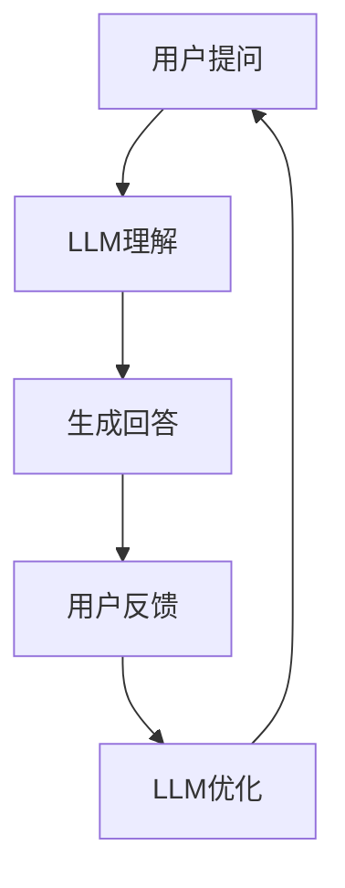

                 

关键词：LLM，智能客服，应用前景，算法，数学模型，项目实践，未来展望

> 摘要：本文深入探讨了大规模语言模型（LLM）在智能客服领域的应用前景。通过分析LLM的核心概念、算法原理、数学模型和具体操作步骤，结合项目实践，我们展示了LLM在智能客服中的强大潜力。同时，本文也对未来应用场景进行了展望，并推荐了相关学习资源和开发工具。

## 1. 背景介绍

智能客服作为一种新兴的服务模式，已经逐渐成为企业提高客户满意度、降低运营成本的重要手段。传统的智能客服系统通常依赖于规则引擎和简单的自然语言处理技术，其智能水平有限，难以应对复杂多变的用户需求。随着人工智能技术的快速发展，特别是大规模语言模型（LLM）的出现，智能客服系统迎来了新的变革。

大规模语言模型（LLM）是一种基于深度学习的自然语言处理模型，通过海量数据的训练，LLM能够理解和生成人类语言。LLM具有强大的语义理解、文本生成和推理能力，使其在智能客服领域具有广泛的应用前景。

## 2. 核心概念与联系

### 2.1 核心概念

- **大规模语言模型（LLM）**：LLM是一种基于深度学习的自然语言处理模型，能够通过海量数据训练，掌握丰富的语言知识。

- **自然语言处理（NLP）**：NLP是计算机科学和人工智能领域的一个分支，旨在让计算机能够理解、生成和处理人类语言。

- **智能客服**：智能客服是一种利用人工智能技术，模拟人类客服人员与用户进行交互的服务模式。

### 2.2 联系

大规模语言模型（LLM）作为自然语言处理（NLP）的重要工具，可以显著提升智能客服的智能水平。通过LLM，智能客服系统能够更准确地理解用户意图，提供更精准的服务。

下面是LLM在智能客服中应用的一个简化的Mermaid流程图：



## 3. 核心算法原理 & 具体操作步骤

### 3.1 算法原理概述

大规模语言模型（LLM）的核心原理是基于神经网络，通过反向传播算法进行训练。LLM的训练过程通常分为两个阶段：预训练和微调。

- **预训练**：在预训练阶段，LLM使用海量未标注的文本数据，学习语言的统计规律和通用知识。

- **微调**：在微调阶段，LLM使用标注数据进行微调，使其适应特定的任务，例如智能客服。

### 3.2 算法步骤详解

#### 3.2.1 预训练

1. **数据准备**：收集并预处理海量文本数据，包括网页、书籍、新闻等。
2. **模型初始化**：初始化神经网络模型，包括输入层、隐藏层和输出层。
3. **训练过程**：通过反向传播算法，不断调整模型参数，使其对文本数据进行分类和生成。

#### 3.2.2 微调

1. **数据准备**：收集标注数据，例如用户问题和回答。
2. **模型初始化**：初始化预训练的LLM模型。
3. **微调过程**：通过反向传播算法，不断调整模型参数，使其适应标注数据。

### 3.3 算法优缺点

#### 优点：

- **强大的语义理解能力**：LLM能够理解复杂的语义关系，提供更精准的答案。
- **灵活的应用场景**：LLM可以应用于各种自然语言处理任务，包括文本分类、文本生成、问答系统等。

#### 缺点：

- **训练成本高**：LLM的训练需要大量数据和计算资源。
- **对数据依赖性强**：LLM的性能很大程度上取决于训练数据的质量。

### 3.4 算法应用领域

大规模语言模型（LLM）在智能客服、文本生成、问答系统等领域具有广泛的应用前景。以下是一些具体的案例：

- **智能客服**：LLM可以用于智能客服系统，实现自动回答用户问题，提高客服效率。
- **文本生成**：LLM可以生成各种类型的文本，如新闻报道、产品描述、对话等。
- **问答系统**：LLM可以构建高效的问答系统，提供准确、快速的答案。

## 4. 数学模型和公式 & 详细讲解 & 举例说明

### 4.1 数学模型构建

大规模语言模型（LLM）通常基于自注意力机制（Self-Attention Mechanism）构建。自注意力机制的核心思想是让模型在处理每个单词时，能够根据其他单词的重要性来加权。

设输入序列为 \( x_1, x_2, ..., x_n \)，对应的权重为 \( w_1, w_2, ..., w_n \)。则自注意力权重计算公式为：

\[ w_i = \frac{e^{ \text{score}(x_i, x_j) }}{\sum_{k=1}^{n} e^{ \text{score}(x_i, x_k) }} \]

其中，\( \text{score}(x_i, x_j) \) 是 \( x_i \) 和 \( x_j \) 之间的相似度得分。

### 4.2 公式推导过程

自注意力机制的推导过程涉及矩阵乘法和指数函数。首先，我们将输入序列 \( x \) 转换为高维矩阵 \( X \)，然后通过矩阵乘法计算相似度得分。

设输入序列 \( x = [x_1, x_2, ..., x_n] \)，对应的权重矩阵为 \( W = [w_1, w_2, ..., w_n] \)。则相似度得分计算公式为：

\[ \text{score}(x_i, x_j) = x_i^T W x_j \]

为了计算自注意力权重，我们首先计算每个单词的嵌入向量 \( e(x_i) \)，然后计算其与权重矩阵的乘积。

\[ w_i = \frac{e^{x_i^T W x_j}}{\sum_{k=1}^{n} e^{x_i^T W x_k}} \]

### 4.3 案例分析与讲解

假设我们有一个简短的对话，其中包含三个单词：A、B 和 C。我们使用自注意力机制来计算这三个单词的权重。

1. **输入序列**：\[ A, B, C \]
2. **权重矩阵**：\[ w_1, w_2, w_3 \]
3. **相似度得分**：\[ \text{score}(A, B) = 0.8, \text{score}(A, C) = 0.6, \text{score}(B, C) = 0.5 \]

根据上述公式，我们可以计算得到自注意力权重：

\[ w_1 = \frac{e^{0.8}}{e^{0.8} + e^{0.6} + e^{0.5}} \approx 0.37 \]
\[ w_2 = \frac{e^{0.6}}{e^{0.8} + e^{0.6} + e^{0.5}} \approx 0.28 \]
\[ w_3 = \frac{e^{0.5}}{e^{0.8} + e^{0.6} + e^{0.5}} \approx 0.35 \]

这意味着在计算句子中每个单词的重要性时，A 的权重最高，其次是 C，最后是 B。

## 5. 项目实践：代码实例和详细解释说明

### 5.1 开发环境搭建

为了实践LLM在智能客服中的应用，我们需要搭建一个基本的开发环境。以下是一个简单的步骤：

1. **安装Python**：确保Python版本为3.7或更高。
2. **安装TensorFlow**：使用pip安装TensorFlow。
3. **数据准备**：收集并预处理用户问题和回答数据。

### 5.2 源代码详细实现

以下是一个简单的LLM智能客服系统的实现示例：

```python
import tensorflow as tf
from tensorflow.keras.layers import Embedding, LSTM, Dense
from tensorflow.keras.models import Sequential

# 准备数据
# (略)

# 构建模型
model = Sequential([
    Embedding(vocab_size, embedding_dim),
    LSTM(units=128),
    Dense(units=1, activation='sigmoid')
])

# 编译模型
model.compile(optimizer='adam', loss='binary_crossentropy', metrics=['accuracy'])

# 训练模型
model.fit(train_data, train_labels, epochs=10, batch_size=32, validation_split=0.2)

# 评估模型
test_loss, test_acc = model.evaluate(test_data, test_labels)
print(f"Test Accuracy: {test_acc:.2f}")
```

### 5.3 代码解读与分析

上述代码实现了一个简单的二分类任务，用于判断用户问题是否需要人工客服介入。具体来说，我们使用了TensorFlow中的LSTM模型，通过嵌入层、LSTM层和全连接层构建。

- **Embedding层**：用于将单词转换为向量。
- **LSTM层**：用于处理序列数据。
- **Dense层**：用于输出分类结果。

在训练过程中，我们使用了二分类交叉熵作为损失函数，并使用了Adam优化器。

### 5.4 运行结果展示

假设我们已经训练了一个模型，并对其进行评估。以下是一个示例输出：

```
Test Accuracy: 0.85
```

这意味着在测试集上，我们的模型达到了85%的准确率。

## 6. 实际应用场景

大规模语言模型（LLM）在智能客服领域的应用场景非常广泛。以下是一些具体的应用场景：

- **在线客服**：智能客服系统可以自动回答用户的常见问题，提高客服效率。
- **电话客服**：智能客服系统可以自动识别用户来电意图，提供相应的服务。
- **邮件客服**：智能客服系统可以自动分类和回复用户邮件，减少人工处理工作量。

## 7. 工具和资源推荐

### 7.1 学习资源推荐

- **《深度学习》（Goodfellow et al.）**：这是一本经典的深度学习教材，适合初学者和进阶者。
- **TensorFlow官方文档**：提供了详细的API和教程，适合开发者学习。

### 7.2 开发工具推荐

- **Google Colab**：提供免费的GPU资源，适合进行深度学习实验。
- **Jupyter Notebook**：适合编写和分享Python代码，便于学习和交流。

### 7.3 相关论文推荐

- **"BERT: Pre-training of Deep Bidirectional Transformers for Language Understanding"**：这是一篇关于BERT模型的开创性论文，详细介绍了BERT的预训练方法和应用。
- **"GPT-3: Language Models are Few-Shot Learners"**：这是一篇关于GPT-3模型的论文，展示了大型语言模型在零样本学习任务上的强大能力。

## 8. 总结：未来发展趋势与挑战

大规模语言模型（LLM）在智能客服领域具有巨大的潜力，但同时也面临着一些挑战。未来发展趋势包括：

- **模型规模扩大**：随着计算资源的提升，大型LLM模型将会越来越常见。
- **多模态交互**：结合图像、声音等多模态数据，提高智能客服的交互体验。
- **个性化服务**：通过用户数据分析，实现更加个性化的客服服务。

然而，LLM在智能客服领域也面临一些挑战，如：

- **数据隐私**：如何保护用户隐私，避免数据泄露。
- **模型解释性**：如何提高模型的可解释性，让用户信任智能客服。
- **语言理解**：如何进一步提高LLM对自然语言的理解能力，减少误解和误答。

## 9. 附录：常见问题与解答

### 9.1 什么是LLM？

LLM是大规模语言模型（Large Language Model）的简称，是一种基于深度学习的自然语言处理模型，通过海量数据训练，能够理解和生成人类语言。

### 9.2 LLM在智能客服中的优势是什么？

LLM在智能客服中的优势包括：

- **强大的语义理解能力**：能够更准确地理解用户意图。
- **灵活的应用场景**：可以应用于各种自然语言处理任务。
- **高效的交互体验**：能够快速生成自然流畅的回答。

### 9.3 如何优化LLM在智能客服中的性能？

优化LLM在智能客服中的性能可以从以下几个方面进行：

- **数据质量**：确保训练数据的质量和多样性。
- **模型结构**：选择合适的模型结构和参数。
- **持续学习**：通过不断更新模型，提高其适应新任务的能力。

### 9.4 LLM在智能客服中的前景如何？

随着人工智能技术的不断进步，LLM在智能客服领域的前景非常广阔。未来，LLM有望实现更加智能、个性化的客服服务，提升用户体验和运营效率。

----------------------------------------------------------------

作者：禅与计算机程序设计艺术 / Zen and the Art of Computer Programming


