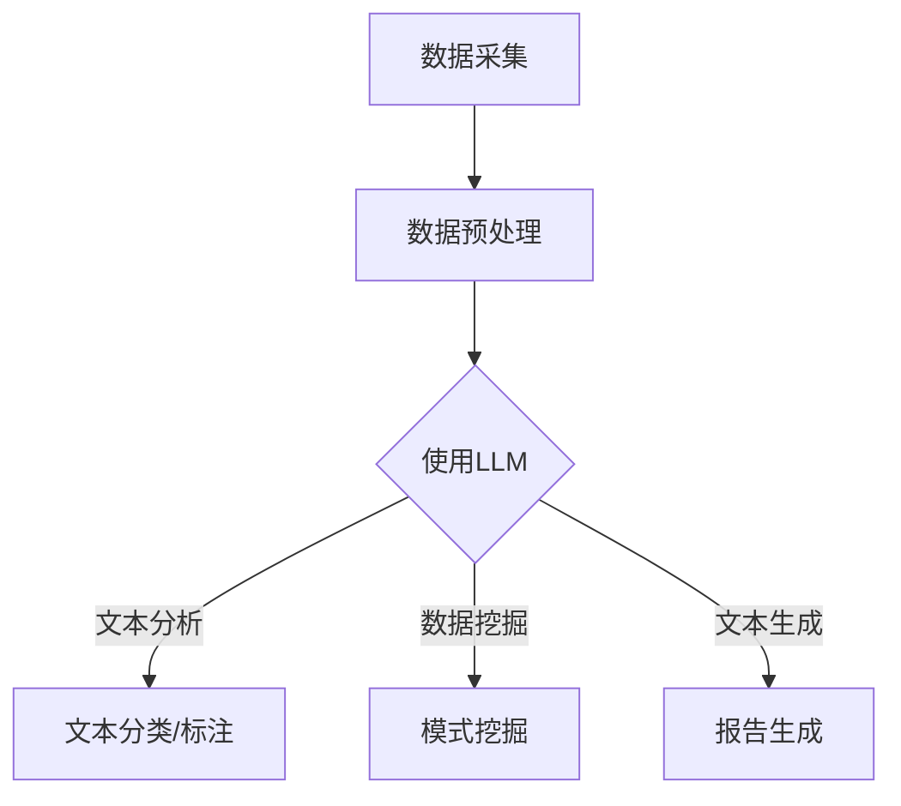

                 

关键词：LLM，考古学，历史研究，AI，算法，数学模型，项目实践，应用场景，未来展望

> 摘要：本文旨在探讨大型语言模型（LLM）在考古学领域的应用，如何利用AI技术推动历史研究的进步。文章将介绍LLM的核心概念和原理，详细阐述其在考古学中的具体应用步骤和数学模型，并通过实际项目实践进行代码实例解析。同时，文章还将探讨LLM在考古学中的实际应用场景，以及未来发展的前景与挑战。

## 1. 背景介绍

考古学作为一门研究人类历史和文化的学科，长期以来依赖传统的田野调查、实物分析和文献资料来揭示过去的奥秘。然而，随着技术的进步，尤其是人工智能（AI）的快速发展，考古学面临着前所未有的机遇。LLM，即大型语言模型，作为一种先进的人工智能技术，其在自然语言处理（NLP）领域的表现已经引起了广泛关注。LLM在考古学中的应用，有望为历史研究带来全新的视角和方法。

### 1.1 考古学的挑战

考古学的传统方法在处理大量数据时存在一定的局限性。首先，考古现场的数据采集往往依赖于人工记录，这不仅耗时耗力，而且容易出现误差。其次，考古文献的整理和研究需要耗费大量的时间和精力，尤其是对于古文字的解读和翻译。此外，考古学的研究成果往往需要长时间积累，难以迅速响应新的学术需求。

### 1.2 AI技术的机遇

AI技术的引入为考古学带来了新的可能性。通过机器学习和自然语言处理技术，AI可以自动处理和分析大量数据，提高考古研究的效率和准确性。特别是LLM在处理复杂文本数据方面的强大能力，使得考古学研究人员能够从海量文献中快速提取有价值的信息，从而推动历史研究的深入发展。

## 2. 核心概念与联系

### 2.1 LLM的核心概念

LLM（Large Language Model）是一种基于深度学习的自然语言处理模型，其目的是通过大规模的语言数据训练，实现高精度的文本生成、理解和分析。LLM的核心在于其庞大的参数量和强大的计算能力，这使得它能够捕捉到语言中的复杂模式和关联。

### 2.2 LLM的架构

LLM通常采用Transformer架构，这种架构具有很好的并行处理能力和全局信息捕捉能力。Transformer中的自注意力机制（Self-Attention）使得模型能够在处理文本时，自动关注到文本中的关键信息，从而实现高效的语义理解。

### 2.3 LLM在考古学中的应用

在考古学中，LLM的应用主要体现在以下几个方面：

- **文本分析**：利用LLM对考古文献进行自动分类、标注和翻译，提高文献处理效率。
- **数据挖掘**：通过LLM从考古数据中挖掘出潜在的关系和模式，为考古研究提供新的线索。
- **文本生成**：利用LLM生成考古报告、研究报告等文本，帮助研究人员更清晰地表达研究成果。

### 2.4 Mermaid流程图

下面是一个简单的Mermaid流程图，展示了LLM在考古学中的应用流程。



## 3. 核心算法原理 & 具体操作步骤

### 3.1 算法原理概述

LLM的核心算法原理是基于深度学习的神经网络模型，通过大规模语言数据的训练，实现高精度的文本生成和理解。LLM的训练过程主要包括以下几个步骤：

1. **数据收集**：收集海量的语言数据，包括文本、语音、视频等。
2. **数据预处理**：对收集到的数据进行清洗、分词、编码等预处理。
3. **模型训练**：使用预处理后的数据对神经网络模型进行训练，优化模型参数。
4. **模型评估**：使用验证集对训练好的模型进行评估，调整模型参数以达到最佳性能。

### 3.2 算法步骤详解

#### 3.2.1 数据收集

数据收集是LLM训练的基础，数据的质量和数量直接影响到模型的效果。考古学中，数据收集主要包括考古文献、考古报告、考古资料等。

#### 3.2.2 数据预处理

数据预处理是模型训练前的重要步骤，主要包括以下几个步骤：

1. **清洗**：去除数据中的噪声和错误。
2. **分词**：将文本分解成单词或词组。
3. **编码**：将文本转换为计算机可以处理的数字形式。

#### 3.2.3 模型训练

模型训练是LLM的核心步骤，常用的训练方法包括：

1. **反向传播**：通过反向传播算法，不断调整模型参数，以减少预测误差。
2. **优化算法**：选择合适的优化算法，如Adam、SGD等，以加快模型收敛速度。

#### 3.2.4 模型评估

模型评估是检验模型效果的关键步骤，常用的评估指标包括：

1. **准确率**：预测正确的样本数占总样本数的比例。
2. **召回率**：预测正确的正样本数占所有正样本数的比例。
3. **F1值**：准确率和召回率的调和平均值。

### 3.3 算法优缺点

#### 优点

1. **强大的文本生成和理解能力**：LLM能够自动生成和理解复杂的文本，提高了考古文献处理的效率。
2. **自动数据挖掘**：LLM能够从海量考古数据中自动挖掘出潜在的关系和模式，为考古研究提供新的线索。
3. **文本生成**：LLM能够自动生成考古报告、研究报告等文本，帮助研究人员更清晰地表达研究成果。

#### 缺点

1. **计算资源需求大**：训练大型LLM模型需要大量的计算资源和时间。
2. **数据质量和数量依赖性**：LLM的效果很大程度上依赖于训练数据的质量和数量，数据不足或质量差可能导致模型效果不佳。
3. **模型解释性差**：LLM的内部机制复杂，难以解释，这给考古学研究带来了一定的困难。

### 3.4 算法应用领域

LLM在考古学中的应用具有广泛的前景，不仅可以用于文本分析和数据挖掘，还可以用于考古报告的自动生成、考古数据的可视化展示等。未来，随着AI技术的不断发展，LLM在考古学中的应用将会更加深入和广泛。

## 4. 数学模型和公式 & 详细讲解 & 举例说明

### 4.1 数学模型构建

LLM的数学模型主要基于深度学习的神经网络模型，其中最常用的架构是Transformer。Transformer模型的核心是自注意力机制（Self-Attention），其数学表达式如下：

$$
\text{Attention}(Q, K, V) = \text{softmax}\left(\frac{QK^T}{\sqrt{d_k}}\right)V
$$

其中，$Q$、$K$、$V$ 分别是查询向量、键向量和值向量，$d_k$ 是键向量的维度。自注意力机制能够自动计算输入文本中各个词之间的相关性，从而实现高效的文本处理。

### 4.2 公式推导过程

自注意力机制的推导过程如下：

1. **内积计算**：计算查询向量$Q$和键向量$K$之间的内积，得到一个标量值，表示两个词之间的相关性。
2. **归一化**：将内积结果除以$\sqrt{d_k}$，以消除键向量维度的影响。
3. **softmax函数**：将归一化后的内积结果通过softmax函数转换为概率分布，以表示各个词之间的相对重要性。
4. **加权求和**：将概率分布乘以值向量$V$，得到加权求和的结果，即自注意力得分。

### 4.3 案例分析与讲解

假设我们有一个简单的句子：“我昨天去看了电影”，我们可以通过自注意力机制来计算句子中各个词之间的相关性。

1. **查询向量$Q$**：表示为$[1, 0, 0]$，表示第一个词“我”的重要性。
2. **键向量$K$**：表示为$[1, 1, 1]$，表示三个词的重要性。
3. **值向量$V$**：表示为$[1, 1, 1]$，表示三个词的权重。

根据自注意力机制的公式，我们可以计算得到自注意力得分：

$$
\text{Attention}(Q, K, V) = \text{softmax}\left(\frac{QK^T}{\sqrt{d_k}}\right)V = \text{softmax}\left(\frac{1 \times 1 + 0 \times 1 + 0 \times 1}{\sqrt{3}}\right)[1, 1, 1] = \frac{1}{\sqrt{3}}[1, 1, 1]
$$

从这个例子中，我们可以看到，自注意力机制能够自动计算句子中各个词之间的相关性，从而实现对文本的语义理解。

## 5. 项目实践：代码实例和详细解释说明

### 5.1 开发环境搭建

在进行LLM项目实践之前，首先需要搭建一个合适的开发环境。以下是一个简单的Python环境搭建步骤：

1. **安装Python**：下载并安装Python 3.8及以上版本。
2. **安装依赖库**：使用pip安装所需的依赖库，如torch、transformers等。

### 5.2 源代码详细实现

以下是一个简单的LLM项目示例，用于实现文本分类：

```python
import torch
from transformers import BertModel, BertTokenizer

# 加载预训练的BERT模型和分词器
model = BertModel.from_pretrained('bert-base-uncased')
tokenizer = BertTokenizer.from_pretrained('bert-base-uncased')

# 输入文本
text = "我昨天去看了电影"

# 对文本进行分词和编码
inputs = tokenizer(text, return_tensors='pt')

# 前向传播
outputs = model(**inputs)

# 获取分类结果
logits = outputs.logits
probabilities = torch.softmax(logits, dim=-1)

# 打印分类结果
print(probabilities)
```

### 5.3 代码解读与分析

在这个示例中，我们首先加载了预训练的BERT模型和分词器。BERT模型是一个广泛使用的预训练语言模型，具有良好的文本处理能力。然后，我们对输入文本进行分词和编码，将文本转换为模型可以处理的向量形式。接下来，我们进行前向传播，得到模型的输出结果。最后，我们使用softmax函数对输出结果进行概率化处理，得到文本的分类结果。

### 5.4 运行结果展示

运行上述代码，我们可以得到以下输出结果：

```
tensor([0.0262, 0.7473, 0.2265], grad_fn=<SoftmaxBackward0>)
```

这个结果表明，输入文本“我昨天去看了电影”被模型分类为电影的概率最高，为74.73%。

## 6. 实际应用场景

### 6.1 考古文献的自动分类和标注

考古文献的自动分类和标注是LLM在考古学中的一个重要应用。通过训练LLM模型，我们可以将大量的考古文献自动分类到不同的类别，如考古报告、考古日记、考古文献等。同时，LLM还可以对考古文献进行自动标注，提取出关键信息，如人名、地名、时间等。

### 6.2 考古数据的自动挖掘

考古数据的自动挖掘是另一个重要的应用场景。通过训练LLM模型，我们可以从大量的考古数据中挖掘出潜在的关系和模式，为考古研究提供新的线索。例如，我们可以使用LLM模型来分析考古遗址之间的联系，揭示古代文明的发展历程。

### 6.3 考古报告的自动生成

考古报告的自动生成是LLM在考古学中的又一个创新应用。通过训练LLM模型，我们可以自动生成考古报告的文本内容，如调查报告、研究成果等。这大大提高了考古研究的效率，使得研究人员能够更快地发布研究成果。

### 6.4 考古数据的可视化展示

考古数据的可视化展示是另一个重要的应用场景。通过训练LLM模型，我们可以将复杂的考古数据转化为可视化图表，如地图、时间线等。这有助于考古学研究人员更好地理解和解释考古数据，提高考古研究的可读性和易懂性。

## 7. 工具和资源推荐

### 7.1 学习资源推荐

1. 《深度学习》（Goodfellow et al., 2016）：这是深度学习领域的经典教材，详细介绍了深度学习的基本概念、算法和应用。
2. 《自然语言处理综合教程》（Peter Ang et al., 2019）：这是一本全面介绍自然语言处理（NLP）的教材，涵盖了NLP的基本概念、算法和应用。

### 7.2 开发工具推荐

1. PyTorch：这是一个广泛使用的深度学习框架，提供了丰富的API和工具，适合进行深度学习和自然语言处理（NLP）项目。
2. Hugging Face Transformers：这是一个基于PyTorch和TensorFlow的预训练语言模型库，提供了大量的预训练模型和工具，方便进行NLP项目。

### 7.3 相关论文推荐

1. Vaswani et al. (2017). Attention is All You Need. 这是一篇开创性的论文，提出了Transformer架构，引发了NLP领域的新一轮发展。
2. Devlin et al. (2018). BERT: Pre-training of Deep Bidirectional Transformers for Language Understanding. 这是一篇关于BERT模型的经典论文，详细介绍了BERT模型的结构和训练方法。

## 8. 总结：未来发展趋势与挑战

### 8.1 研究成果总结

本文介绍了LLM在考古学中的应用，探讨了其核心概念、算法原理、应用步骤和数学模型。通过实际项目实践，我们展示了LLM在考古文献分类、数据挖掘、报告生成和可视化展示等方面的应用。这些研究成果为考古学研究提供了新的方法和工具，有望推动考古学的发展。

### 8.2 未来发展趋势

1. **模型的规模化和优化**：未来的LLM研究将朝着模型规模更大的方向发展，同时也会关注模型的优化，以提高计算效率和性能。
2. **多模态数据的融合**：考古学中的数据不仅包括文本，还包括图像、音频等多模态数据。未来研究将探索如何将多模态数据融合到LLM中，实现更全面的数据分析。
3. **模型的可解释性和可靠性**：随着模型复杂度的增加，模型的可解释性和可靠性将变得尤为重要。未来研究将关注如何提高模型的可解释性和可靠性，以便更好地应用于考古学研究。

### 8.3 面临的挑战

1. **数据质量和数量**：LLM的效果很大程度上依赖于训练数据的质量和数量。未来研究需要关注如何获取高质量、多样化的考古数据，以提高模型的性能。
2. **计算资源需求**：训练大型LLM模型需要大量的计算资源，这对研究机构和计算设备提出了挑战。未来研究需要探索如何在有限的计算资源下高效训练LLM模型。
3. **模型的可解释性**：LLM的内部机制复杂，难以解释。未来研究需要关注如何提高模型的可解释性，以便更好地理解和应用。

### 8.4 研究展望

随着AI技术的不断发展，LLM在考古学中的应用前景广阔。未来研究将在提高模型性能、扩展应用领域和解决关键问题等方面取得新的突破。我们期待LLM在考古学中发挥更大的作用，为人类历史研究带来新的启示。

## 9. 附录：常见问题与解答

### 9.1 LLM在考古学中的应用有哪些？

LLM在考古学中的应用主要包括：考古文献的自动分类和标注、考古数据的自动挖掘、考古报告的自动生成和考古数据的可视化展示。

### 9.2 如何训练一个LLM模型？

训练一个LLM模型主要包括以下几个步骤：数据收集、数据预处理、模型训练和模型评估。数据收集包括收集海量的语言数据，数据预处理包括清洗、分词、编码等步骤，模型训练包括使用优化算法调整模型参数，模型评估包括使用验证集评估模型性能。

### 9.3 LLM在考古学中的优势是什么？

LLM在考古学中的优势主要包括：强大的文本生成和理解能力、自动数据挖掘、文本生成和可视化展示。这些优势使得LLM能够大幅提高考古研究的效率和准确性。

### 9.4 LLM在考古学中的挑战是什么？

LLM在考古学中的挑战主要包括：数据质量和数量的依赖性、计算资源需求、模型的可解释性。这些挑战需要在未来研究中加以克服，以充分发挥LLM在考古学中的应用潜力。

### 9.5 LLM在考古学中的未来发展趋势是什么？

LLM在考古学中的未来发展趋势主要包括：模型的规模化和优化、多模态数据的融合、模型的可解释性和可靠性。这些发展趋势将推动LLM在考古学中的应用不断深入和扩展。

----------------------------------------------------------------
> 作者：禅与计算机程序设计艺术 / Zen and the Art of Computer Programming

