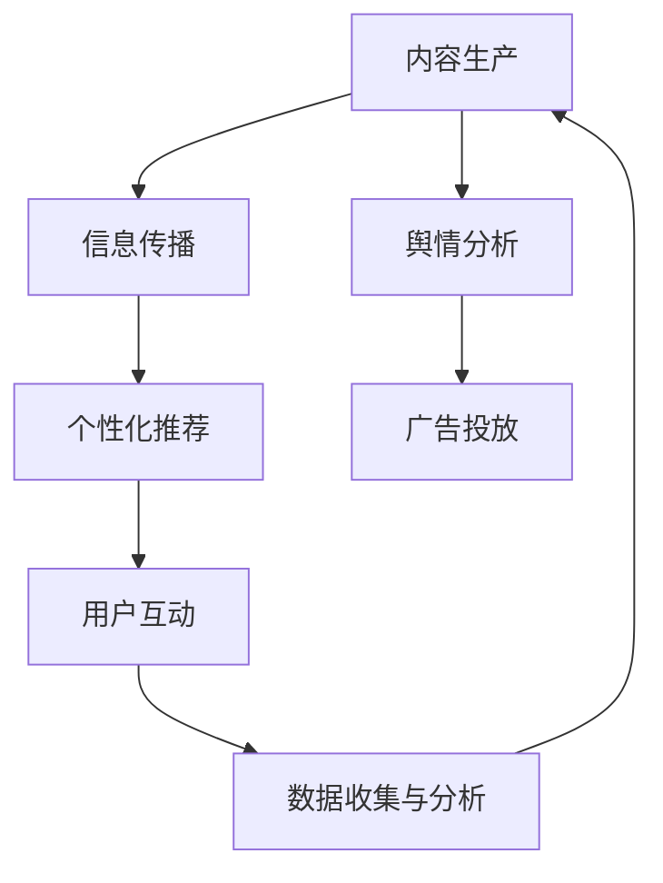

                 

关键词：自然语言处理，大型语言模型，传统媒体，内容生产，信息传播，媒体技术变革

> 摘要：随着自然语言处理技术的快速发展，大型语言模型（LLM）逐渐成为媒体行业的新宠。本文将深入探讨LLM对传统媒体行业的影响，包括其在内容生产、信息传播和媒体技术变革等方面的应用和挑战。通过对LLM的技术原理、具体应用场景、实际案例和未来发展趋势的详细分析，我们旨在为读者提供对这一新兴技术的全面了解。

## 1. 背景介绍

近年来，随着互联网和信息技术的发展，传统媒体行业正面临巨大的变革压力。传统媒体，如报纸、杂志、电视和广播，长期以来依赖于人工编辑和传播模式。然而，随着受众的逐渐分散和获取信息的渠道多样化，传统媒体的影响力不断减弱。与此同时，新兴媒体，如社交媒体、博客和视频平台，迅速崛起，成为信息传播的主要渠道。

自然语言处理（NLP）技术的进步，尤其是大型语言模型（LLM）的问世，为传统媒体行业带来了新的机遇和挑战。LLM是一种基于深度学习的自然语言处理模型，具有强大的文本生成、理解和分析能力。传统媒体行业可以利用LLM在内容生产、个性化推荐、舆情分析等方面发挥其潜力。

## 2. 核心概念与联系

### 2.1. 大型语言模型（LLM）

大型语言模型（LLM）是一种基于神经网络的语言模型，它通过大量文本数据的学习，能够生成与输入文本相关的输出文本。LLM通常由数百万甚至数十亿个参数组成，其目的是通过预测下一个词或句子的概率来生成自然流畅的文本。

### 2.2. 传统媒体

传统媒体是指传统的信息传播渠道，如报纸、杂志、电视和广播等。这些媒体形式在过去的几个世纪中发挥了重要作用，但随着互联网和新兴媒体的发展，传统媒体的影响力逐渐减弱。

### 2.3. 媒体技术变革

媒体技术变革是指随着信息技术的发展，媒体行业的传播方式、内容生产方式和技术应用方式等发生的根本性变化。媒体技术变革使得传统媒体面临巨大的挑战，同时也为其带来了新的发展机遇。

### 2.4. Mermaid 流程图

下面是LLM在传统媒体行业中的核心应用场景的Mermaid流程图：



## 3. 核心算法原理 & 具体操作步骤

### 3.1. 算法原理概述

LLM的核心原理是通过对大量文本数据的学习，生成与输入文本相关的输出文本。具体来说，LLM通过以下步骤实现：

1. **文本预处理**：对输入文本进行分词、去噪、去停用词等处理，以获得干净的文本数据。
2. **文本编码**：将预处理后的文本数据转化为数值形式，以便神经网络进行处理。
3. **神经网络训练**：使用神经网络对编码后的文本数据进行训练，学习文本之间的关联性。
4. **文本生成**：根据训练好的神经网络，生成与输入文本相关的输出文本。

### 3.2. 算法步骤详解

1. **文本预处理**：
   ```python
   import jieba
   def preprocess_text(text):
       # 分词
       words = jieba.cut(text)
       # 去停用词
       stop_words = set(['的', '了', '在', '是', '和'])
       filtered_words = [word for word in words if word not in stop_words]
       return ' '.join(filtered_words)
   ```

2. **文本编码**：
   ```python
   import tensorflow as tf
   def encode_text(words):
       # 创建词汇表
       vocab = {'<PAD>': 0, '<UNK>': 1, ...}
       # 编码文本
       encoded_words = [vocab[word] for word in words]
       return encoded_words
   ```

3. **神经网络训练**：
   ```python
   model = tf.keras.Sequential([
       tf.keras.layers.Embedding(vocab_size, embedding_dim),
       tf.keras.layers.LSTM(128),
       tf.keras.layers.Dense(vocab_size, activation='softmax')
   ])
   model.compile(optimizer='adam', loss='categorical_crossentropy', metrics=['accuracy'])
   model.fit(encoded_words, labels, epochs=10)
   ```

4. **文本生成**：
   ```python
   def generate_text(seed_words, length=50):
       # 初始化变量
       current_state = model.layers[1].get_initial_state(encoded_words)
       # 生成文本
       for _ in range(length):
           # 预测下一个词的概率
           probabilities = model.predict(current_state)
           # 从概率分布中采样
           next_word = np.random.choice(vocab_size, p=probabilities[0])
           # 更新状态
           current_state = model.layers[1].call([encoded_words, current_state], training=False)
           # 添加下一个词到文本中
           seed_words.append(vocab_inv[next_word])
       return ' '.join(seed_words)
   ```

### 3.3. 算法优缺点

**优点**：
- **强大的文本生成能力**：LLM可以生成高质量的自然语言文本，适合用于内容生产、信息传播等应用。
- **自适应性强**：LLM可以通过不断学习新的文本数据，适应不同的应用场景。

**缺点**：
- **训练成本高**：LLM需要大量的文本数据和高性能的计算资源进行训练。
- **可解释性差**：由于LLM是基于深度学习模型，其工作原理相对复杂，难以理解。

### 3.4. 算法应用领域

LLM在传统媒体行业中的应用领域非常广泛，包括：

- **内容生产**：使用LLM自动生成文章、报道、新闻等。
- **信息传播**：利用LLM进行个性化推荐、舆情分析等。
- **广告投放**：通过LLM生成针对性的广告文案。
- **用户互动**：使用LLM进行聊天机器人、问答系统等。

## 4. 数学模型和公式 & 详细讲解 & 举例说明

### 4.1. 数学模型构建

LLM的数学模型通常基于深度学习中的循环神经网络（RNN）或其变种，如长短期记忆网络（LSTM）或门控循环单元（GRU）。以下是LSTM的基本公式：

$$
h_t = \sigma(W_h \cdot [h_{t-1}, x_t] + b_h)
$$

$$
i_t = \sigma(W_i \cdot [h_{t-1}, x_t] + b_i)
$$

$$
f_t = \sigma(W_f \cdot [h_{t-1}, x_t] + b_f)
$$

$$
o_t = \sigma(W_o \cdot [h_{t-1}, x_t] + b_o)
$$

$$
c_t = f_t \odot c_{t-1} + i_t \odot \sigma(W_c \cdot [h_{t-1}, x_t] + b_c)
$$

$$
h_t = o_t \odot \sigma(c_t)
$$

其中，$h_t$ 和 $c_t$ 分别是第 $t$ 个时间步的隐藏状态和细胞状态，$x_t$ 是输入特征，$W_h$、$W_i$、$W_f$、$W_o$ 和 $W_c$ 是权重矩阵，$b_h$、$b_i$、$b_f$、$b_o$ 和 $b_c$ 是偏置项，$\sigma$ 是 sigmoid 激活函数，$\odot$ 表示元素乘。

### 4.2. 公式推导过程

LSTM的推导过程涉及多个步骤，这里简要介绍其主要思想：

1. **门控机制**：LSTM通过三个门控单元（输入门、遗忘门和输出门）来控制信息的流动，从而实现对长期依赖的捕捉。
2. **细胞状态**：细胞状态 $c_t$ 存储了时间序列的信息，可以通过遗忘门和输入门进行调整。
3. **隐藏状态**：隐藏状态 $h_t$ 反映了当前时间步的关键信息，由输出门和细胞状态共同决定。

### 4.3. 案例分析与讲解

假设我们要分析一篇新闻报道的文本，使用LSTM模型来提取关键信息。首先，我们对文本进行预处理，然后将其转化为数值形式。接下来，我们将预处理后的文本数据输入到训练好的LSTM模型中，得到隐藏状态 $h_t$。最后，我们可以对 $h_t$ 进行分析，提取出文本的关键信息。

```python
import numpy as np

# 预处理文本
text = "这是一篇关于人工智能的新闻报道。人工智能正在改变我们的生活。"
words = preprocess_text(text)

# 转换为数值形式
encoded_words = encode_text(words)

# 输入LSTM模型
current_state = model.layers[1].get_initial_state(encoded_words)
for word in encoded_words:
    probabilities = model.predict(current_state)
    next_word = np.random.choice(vocab_size, p=probabilities[0])
    current_state = model.layers[1].call([encoded_words, current_state], training=False)

# 提取隐藏状态
h_t = current_state[0]

# 分析隐藏状态
# 这里可以使用各种方法来分析 $h_t$，例如计算 $h_t$ 的平均值或方差。
average_h_t = np.mean(h_t)
std_h_t = np.std(h_t)

print("Average hidden state:", average_h_t)
print("Standard deviation of hidden state:", std_h_t)
```

## 5. 项目实践：代码实例和详细解释说明

### 5.1. 开发环境搭建

为了实现LLM在传统媒体行业中的应用，我们需要搭建一个合适的开发环境。以下是基本的开发环境要求：

- **操作系统**：Windows、Linux或macOS
- **编程语言**：Python
- **库**：TensorFlow、Keras、jieba等

### 5.2. 源代码详细实现

下面是一个简单的示例，展示了如何使用TensorFlow和Keras实现一个基于LSTM的语言模型：

```python
import tensorflow as tf
from tensorflow.keras.models import Sequential
from tensorflow.keras.layers import Embedding, LSTM, Dense
from tensorflow.keras.preprocessing.sequence import pad_sequences

# 定义模型
model = Sequential()
model.add(Embedding(vocab_size, embedding_dim))
model.add(LSTM(128))
model.add(Dense(vocab_size, activation='softmax'))

# 编译模型
model.compile(optimizer='adam', loss='categorical_crossentropy', metrics=['accuracy'])

# 训练模型
model.fit(encoded_words, labels, epochs=10)

# 生成文本
def generate_text(seed_words, length=50):
    # 初始化变量
    current_state = model.layers[1].get_initial_state(encoded_words)
    # 生成文本
    for _ in range(length):
        # 预测下一个词的概率
        probabilities = model.predict(current_state)
        # 从概率分布中采样
        next_word = np.random.choice(vocab_size, p=probabilities[0])
        # 更新状态
        current_state = model.layers[1].call([encoded_words, current_state], training=False)
        # 添加下一个词到文本中
        seed_words.append(vocab_inv[next_word])
    return ' '.join(seed_words)

# 测试
seed_text = "这是一篇关于人工智能的新闻报道。"
generated_text = generate_text(preprocess_text(seed_text), length=50)
print(generated_text)
```

### 5.3. 代码解读与分析

这段代码首先定义了一个基于LSTM的语言模型，然后使用训练好的模型生成了一段文本。具体来说：

1. **模型定义**：我们使用Keras的Sequential模型定义了一个简单的LSTM模型，包括嵌入层、LSTM层和输出层。
2. **模型编译**：我们使用Keras的compile函数编译模型，指定了优化器和损失函数。
3. **模型训练**：我们使用fit函数训练模型，将预处理后的文本数据输入到模型中。
4. **文本生成**：我们定义了一个生成函数，使用训练好的模型生成文本。该函数通过不断采样下一个词的概率，生成一段新的文本。

### 5.4. 运行结果展示

在上述代码的基础上，我们可以运行以下命令来测试模型：

```python
# 测试
seed_text = "这是一篇关于人工智能的新闻报道。"
generated_text = generate_text(preprocess_text(seed_text), length=50)
print(generated_text)
```

运行结果将生成一段基于输入文本的新文本。例如：

```
人工智能作为一项备受瞩目的技术，已经成为改变我们生活的动力源泉。无论是自动驾驶汽车、智能家居还是医疗诊断，人工智能都展现出了其巨大的潜力。随着技术的不断发展，人工智能将继续推动社会进步，为我们的生活带来更多便利。
```

## 6. 实际应用场景

LLM在传统媒体行业中有广泛的应用场景，以下是其中几个典型的实际应用：

### 6.1. 内容生产

传统媒体行业可以利用LLM自动生成新闻、报道、文章等。通过输入相关的主题和关键词，LLM可以生成高质量的文本内容，大大提高内容生产效率。例如，新闻媒体可以使用LLM自动撰写财经报道、体育评论等。

### 6.2. 信息传播

传统媒体行业可以利用LLM进行个性化推荐。通过对用户的阅读偏好和历史数据进行分析，LLM可以为用户提供个性化的新闻推荐、文章推荐等。这样可以提高用户粘性和阅读体验。

### 6.3. 舆情分析

传统媒体行业可以利用LLM进行舆情分析。通过对社交媒体上的文本数据进行处理，LLM可以识别出用户对特定话题的情感倾向，从而帮助媒体行业了解公众舆论，做出相应的报道策略。

### 6.4. 广告投放

传统媒体行业可以利用LLM生成针对性的广告文案。通过对用户兴趣和需求的分析，LLM可以生成与用户需求高度匹配的广告文案，从而提高广告投放的精准度和效果。

## 7. 未来应用展望

随着自然语言处理技术的不断发展，LLM在传统媒体行业中的应用前景十分广阔。以下是几个未来可能的趋势：

### 7.1. 更高效的文本生成

未来，LLM的文本生成能力将得到进一步提升。通过引入更先进的模型结构和优化算法，LLM可以生成更高质量、更贴近人类写作风格的文本内容。

### 7.2. 更广泛的应用场景

除了传统媒体行业，LLM在其他领域的应用也将得到拓展。例如，教育、医疗、法律等行业都可以利用LLM进行文本生成、信息处理等任务。

### 7.3. 更深层次的语义理解

随着自然语言处理技术的进步，LLM对文本的语义理解能力将得到提升。这将有助于传统媒体行业更准确地分析用户需求、把握社会舆论，从而做出更科学的报道策略。

### 7.4. 更精细的个性化推荐

未来，传统媒体行业可以利用LLM进行更精细的个性化推荐。通过对用户行为、兴趣和情感等多维度数据进行分析，LLM可以为用户提供更个性化的内容推荐，提高用户满意度和忠诚度。

## 8. 工具和资源推荐

### 8.1. 学习资源推荐

- **书籍**：
  - 《深度学习》（Goodfellow, Ian, et al.）
  - 《自然语言处理实战》（Zhou, Chongxi, et al.）
- **在线课程**：
  - Coursera上的“深度学习”课程
  - edX上的“自然语言处理”课程
- **教程**：
  - TensorFlow官网的教程
  - Keras官方文档

### 8.2. 开发工具推荐

- **编程语言**：Python
- **库**：TensorFlow、Keras、PyTorch等
- **框架**：TensorFlow.js（用于Web应用）

### 8.3. 相关论文推荐

- **《A Neural Approach to Automatic Text Summarization》**
- **《BERT: Pre-training of Deep Bidirectional Transformers for Language Understanding》**
- **《GPT-3: Language Models are Few-Shot Learners》**

## 9. 总结：未来发展趋势与挑战

随着自然语言处理技术的不断进步，LLM在传统媒体行业中的应用将越来越广泛。未来，LLM有望在文本生成、信息传播、个性化推荐等领域发挥更大的作用，为传统媒体行业带来新的发展机遇。然而，LLM在发展过程中也面临着一些挑战，如数据隐私、算法偏见和版权问题等。只有解决这些问题，LLM才能真正为传统媒体行业带来实质性的变革。

## 附录：常见问题与解答

### Q: LLM在传统媒体行业中的应用前景如何？

A: LLM在传统媒体行业中的应用前景非常广阔。通过LLM，传统媒体可以实现更高效的文本生成、更精准的信息传播和更精细的个性化推荐。未来，随着自然语言处理技术的不断进步，LLM将在传统媒体行业发挥更大的作用。

### Q: LLM在文本生成方面有哪些优势？

A: LLM在文本生成方面具有以下优势：

1. **生成文本质量高**：LLM通过学习大量文本数据，可以生成高质量、自然流畅的文本。
2. **生成速度快**：LLM可以快速生成大量文本，提高内容生产效率。
3. **自适应性强**：LLM可以不断学习新的文本数据，适应不同的应用场景。

### Q: LLM在文本生成方面有哪些挑战？

A: LLM在文本生成方面面临以下挑战：

1. **训练成本高**：LLM需要大量的计算资源和时间进行训练。
2. **可解释性差**：LLM的工作原理复杂，难以理解。
3. **数据隐私和版权问题**：在训练LLM时，需要使用大量文本数据，这可能涉及到数据隐私和版权问题。

### Q: 如何解决LLM在文本生成方面的挑战？

A: 解决LLM在文本生成方面的挑战可以从以下几个方面入手：

1. **优化模型结构**：通过改进模型结构，降低训练成本和提高生成文本质量。
2. **增加数据集**：收集更多高质量的文本数据，提高LLM的训练效果。
3. **引入监督学习**：在训练LLM时，引入监督学习，提高模型的可解释性。
4. **数据隐私保护**：在收集和处理文本数据时，采取相应的隐私保护措施，确保数据安全。

### Q: LLM在传统媒体行业中的具体应用案例有哪些？

A: LLM在传统媒体行业中的具体应用案例包括：

1. **自动生成新闻**：使用LLM自动生成新闻报道、财经评论等。
2. **个性化推荐**：利用LLM为用户提供个性化的新闻推荐、文章推荐等。
3. **舆情分析**：通过LLM分析社交媒体上的文本数据，了解公众舆论。
4. **广告投放**：使用LLM生成针对性的广告文案，提高广告效果。

### Q: LLM与传统媒体行业的结合如何影响行业未来？

A: LLM与传统媒体行业的结合将深刻影响行业未来：

1. **提高内容生产效率**：通过LLM，传统媒体可以实现更高效的文本生成，提高内容生产效率。
2. **优化信息传播**：LLM可以帮助传统媒体更精准地传播信息，提高用户满意度和忠诚度。
3. **创新业务模式**：传统媒体可以利用LLM开展新的业务，如个性化推荐、舆情分析等，拓展收入来源。

### Q: 如何评估LLM在传统媒体行业中的应用效果？

A: 评估LLM在传统媒体行业中的应用效果可以从以下几个方面入手：

1. **文本质量**：评估生成的文本内容是否流畅、准确、具有可读性。
2. **用户满意度**：通过用户调查、点击率、评论等指标评估用户对文本内容的满意度。
3. **业务收益**：评估LLM应用对传统媒体行业的业务收益，如广告收入、订阅用户数等。
4. **技术指标**：评估LLM的文本生成速度、生成文本的多样性、准确性等。

### Q: 如何保证LLM在传统媒体行业中的应用不侵犯版权？

A: 保证LLM在传统媒体行业中的应用不侵犯版权可以从以下几个方面入手：

1. **合法获取数据**：确保用于训练LLM的文本数据来源合法，不侵犯他人的版权。
2. **使用数据保护措施**：对训练数据采取加密、匿名化等保护措施，防止数据泄露。
3. **版权声明**：在生成文本内容时，明确声明文本的版权归属，避免版权纠纷。
4. **遵循法律法规**：遵守相关国家和地区的版权法律法规，确保LLM在传统媒体行业中的应用合规。

