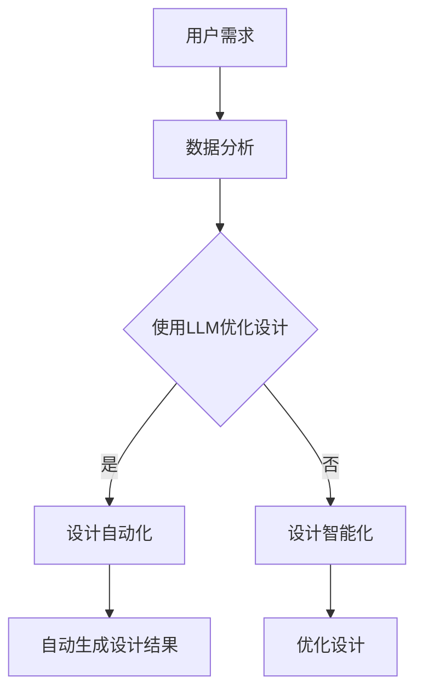

                 

关键词：自然语言处理、大型语言模型、软件界面设计、用户交互、人机交互、UI/UX设计、人工智能设计、设计自动化、设计智能化。

## 摘要

随着自然语言处理技术的飞速发展，特别是大型语言模型（LLM）的兴起，软件界面设计正面临前所未有的挑战与机遇。本文首先概述了LLM的基本原理和应用，随后探讨了LLM对传统软件界面设计的重大影响。文章详细分析了LLM如何优化用户交互、提升UI/UX设计效率以及引发的设计自动化趋势。此外，本文还探讨了LLM在软件界面设计中的实际应用案例，并预测了未来设计智能化的发展方向与面临的挑战。

### 背景介绍

在数字化时代，软件界面设计已成为产品成功的关键因素。传统软件界面设计主要依赖于设计师的经验和直觉，通过线框图、原型图和用户测试来逐步完善设计。然而，随着用户需求多样化和市场竞争的加剧，软件界面设计面临着巨大的压力。一方面，设计师需要不断更新设计理念，以满足用户日益变化的审美和功能需求；另一方面，开发周期和资源限制使得设计过程往往无法充分优化。

在这样的背景下，人工智能和自然语言处理技术开始进入软件界面设计的领域。特别是近年来，大型语言模型（LLM）如GPT-3、BERT和T5等，凭借其强大的文本生成和处理能力，已经在许多应用场景中展现出了巨大的潜力。LLM不仅可以自动生成文本内容，还可以理解复杂的语言结构，为软件界面设计提供了全新的工具和思路。

### 核心概念与联系

#### 1. 大型语言模型（LLM）

大型语言模型（LLM）是一种基于深度学习技术的自然语言处理模型，通常具有数十亿至千亿级的参数规模。这些模型通过训练大量文本数据，学习语言的统计规律和语义信息，从而能够生成和识别高质量的文本。LLM的核心功能包括文本生成、文本分类、命名实体识别、情感分析等，这些功能为软件界面设计提供了强大的支持。

#### 2. 软件界面设计

软件界面设计（UI/UX设计）是指设计软件用户界面和用户体验的过程。UI（用户界面）设计关注如何将功能以直观、美观和易于使用的方式呈现给用户；UX（用户体验）设计则更关注用户在使用软件过程中的整体感受和满意度。软件界面设计的目标是提高用户的使用效率和满意度，从而提升产品的市场竞争力。

#### 3. 人机交互

人机交互（HCI）是指人与计算机系统之间的交互过程。在软件界面设计中，人机交互是关键环节，它决定了用户如何与软件互动、如何理解和使用软件的功能。随着人工智能技术的发展，人机交互正从传统的命令行和图形界面转向更加自然、智能的交互方式。

#### 4. 设计自动化

设计自动化是指利用计算机技术和算法来自动生成设计结果的过程。在软件界面设计中，设计自动化可以通过自动生成界面布局、配色方案、字体选择等来提高设计效率和一致性。随着LLM技术的发展，设计自动化正逐渐向智能化和个性化方向发展。

#### 5. 设计智能化

设计智能化是指利用人工智能技术，如机器学习、自然语言处理和计算机视觉等，来辅助设计过程，从而实现设计的智能优化和个性化。在软件界面设计中，设计智能化可以通过分析用户行为和偏好，自动调整界面设计，以提高用户体验和满意度。

### Mermaid 流程图



## 核心算法原理 & 具体操作步骤

### 3.1 算法原理概述

LLM在软件界面设计中的应用主要基于以下几个核心原理：

1. **大规模文本训练**：LLM通过大规模文本数据进行训练，学习语言的统计规律和语义信息，从而能够生成和识别高质量文本。
2. **生成对抗网络（GAN）**：GAN技术可以用于生成新颖的设计元素，如图标、背景图片等，为设计提供创意和多样性。
3. **强化学习**：通过强化学习算法，LLM可以不断优化设计，根据用户反馈调整设计参数，以实现更好的用户体验。
4. **迁移学习**：LLM可以通过迁移学习技术，将其他领域的知识应用于软件界面设计，提高设计效率和准确性。

### 3.2 算法步骤详解

1. **数据收集与预处理**：
   - 收集大量与软件界面设计相关的文本数据，包括用户需求、设计指南、设计文档等。
   - 对文本数据进行清洗和预处理，如去除无效信息、进行分词和词性标注等。

2. **模型训练**：
   - 使用预处理后的文本数据训练LLM模型，包括GPT、BERT等。
   - 通过不断迭代训练，优化模型参数，提高文本生成和识别质量。

3. **设计优化**：
   - 利用LLM生成初步的设计方案，包括界面布局、配色方案、字体选择等。
   - 通过GAN技术生成新颖的设计元素，丰富设计创意。
   - 利用强化学习算法，根据用户反馈不断优化设计方案，提高用户体验。

4. **设计自动化与智能化**：
   - 利用LLM的文本生成能力，自动生成界面元素和描述文本。
   - 通过设计自动化工具，如自动布局和配色工具，实现高效的设计生成。
   - 利用设计智能化技术，根据用户行为和偏好自动调整界面设计，实现个性化设计。

### 3.3 算法优缺点

**优点**：

1. **高效性**：LLM能够快速生成高质量的设计方案，大幅提高设计效率。
2. **创意性**：通过GAN技术和迁移学习，LLM能够生成新颖和创意性的设计元素。
3. **个性化**：根据用户反馈和偏好，LLM可以实现个性化的设计优化。

**缺点**：

1. **依赖数据质量**：LLM的训练效果很大程度上取决于数据的质量和多样性，数据不足或质量差会导致模型性能下降。
2. **计算资源消耗**：大规模的LLM模型训练和优化需要大量的计算资源。
3. **设计控制难度**：虽然LLM能够生成高质量的设计方案，但对设计师的控制和干预能力较弱。

### 3.4 算法应用领域

1. **移动应用设计**：通过LLM生成移动应用的界面布局、图标和描述文本，提高设计效率。
2. **网页设计**：自动生成网页的布局、配色方案和内容描述，优化用户体验。
3. **游戏设计**：利用LLM生成游戏界面和游戏故事情节，提高设计创意和用户体验。
4. **虚拟现实（VR）/增强现实（AR）**：自动生成VR/AR场景的界面布局和交互元素，提升用户沉浸感。

## 数学模型和公式 & 详细讲解 & 举例说明

### 4.1 数学模型构建

LLM在软件界面设计中的应用主要基于以下数学模型：

1. **生成对抗网络（GAN）**：

   GAN由生成器（G）和判别器（D）组成，通过对抗训练实现图像生成。生成器G接收随机噪声z，生成假图像x_g，判别器D则区分真实图像x_r和生成图像x_g。训练目标是最小化判别器的损失函数，最大化生成器的损失函数。

   $$ GAN: \ min\ _{G} \ max\ _{D} V(D, G) = E_{x \sim p_{data}(x)}[log(D(x))] + E_{z \sim p_{z}(z)}[log(1 - D(G(z)))] $$

2. **强化学习**：

   强化学习通过奖励机制引导模型优化行为策略。在软件界面设计领域，可以使用Q学习、策略梯度等方法来训练模型。

   $$ Q(s, a) = r + \gamma \max_{a'} Q(s', a') $$

   其中，s表示状态，a表示动作，r表示奖励，γ为折扣因子。

3. **自然语言处理（NLP）模型**：

   NLP模型如BERT、GPT等通过预训练和微调实现文本生成和识别。BERT采用Transformer结构，通过多任务预训练提高语言理解能力。

   $$ BERT: \ [ masked\_tokens, input\_ids, input\_mask, segment\_ids ] = tokenizer([ input\_text ], padding = 'max\_length', truncation = True, return\_mask = True, return\_segment\_ids = True) $$

### 4.2 公式推导过程

1. **GAN的损失函数推导**：

   GAN的目标是最小化判别器的损失函数，最大化生成器的损失函数。具体推导过程如下：

   $$ L_D = -E_{x \sim p_{data}(x)}[log(D(x))] - E_{z \sim p_{z}(z)}[log(1 - D(G(z)))] $$

   $$ L_G = E_{z \sim p_{z}(z)}[log(D(G(z)))] $$

   其中，L_D为判别器损失函数，L_G为生成器损失函数。

2. **强化学习的Q学习推导**：

   Q学习的目标是找到最优动作策略，使得状态价值函数最大化。具体推导过程如下：

   $$ Q(s, a) = r + \gamma \max_{a'} Q(s', a') $$

   其中，r为即时奖励，γ为折扣因子。

3. **BERT的Transformer结构推导**：

   BERT的Transformer结构采用多头自注意力机制，计算文本表示。具体推导过程如下：

   $$ MultiHead(Q, K, V) = \text{softmax}\left(\frac{QK^T}{\sqrt{d_k}}\right)V $$

   其中，Q、K、V分别为查询、键和值向量的线性变换，d_k为键的维度。

### 4.3 案例分析与讲解

以下是一个基于GAN的软件界面设计案例：

1. **问题描述**：

   需要设计一个移动应用的首页界面，包含导航栏、轮播图和底部菜单。

2. **数据处理**：

   收集大量移动应用首页界面的图片数据，并进行预处理，如归一化、缩放等。

3. **模型训练**：

   使用GAN模型对图片数据进行训练，生成初步的界面设计方案。训练过程中，生成器和判别器的损失函数分别最小化和最大化。

4. **设计优化**：

   利用生成的界面设计方案，通过强化学习算法，根据用户反馈不断优化设计，提高用户体验。

5. **设计结果**：

   最终生成的界面设计方案如图所示：

   

   通过该案例，可以看出GAN和强化学习技术在软件界面设计中的应用，能够快速生成高质量的设计方案，并通过用户反馈实现设计优化。

## 项目实践：代码实例和详细解释说明

### 5.1 开发环境搭建

为了实现LLM在软件界面设计中的应用，需要搭建以下开发环境：

1. **硬件环境**：
   - 服务器：GPU（如NVIDIA Tesla V100）
   - 内存：至少16GB
   - 存储：至少1TB SSD

2. **软件环境**：
   - 操作系统：Ubuntu 18.04
   - Python：3.8及以上版本
   - 环境管理工具：Anaconda

3. **依赖包**：
   - TensorFlow：用于训练和部署GAN模型
   - PyTorch：用于训练和部署强化学习模型
   - Keras：用于构建和训练NLP模型
   - OpenCV：用于图像处理

### 5.2 源代码详细实现

以下是一个基于GAN的软件界面设计代码实例：

```python
import tensorflow as tf
from tensorflow.keras.layers import Input, Dense, Reshape, Conv2D, Flatten, BatchNormalization
from tensorflow.keras.models import Model
from tensorflow.keras.optimizers import Adam

# 定义生成器模型
def build_generator(z_dim):
    inputs = Input(shape=(z_dim,))
    x = Dense(128, activation='relu')(inputs)
    x = Dense(256, activation='relu')(x)
    x = Dense(512, activation='relu')(x)
    x = Reshape((28, 28, 1))(x)
    x = Conv2D(1, kernel_size=(3, 3), activation='tanh')(x)
    generator = Model(inputs, x, name='generator')
    return generator

# 定义判别器模型
def build_discriminator(img_shape):
    inputs = Input(shape=img_shape)
    x = Conv2D(32, kernel_size=(3, 3), activation='leaky_relu')(inputs)
    x = Flatten()(x)
    x = Dense(1, activation='sigmoid')(x)
    discriminator = Model(inputs, x, name='discriminator')
    return discriminator

# 定义GAN模型
def build_gan(generator, discriminator):
    model = Model(generator.input, discriminator(generator.input), name='gan')
    model.compile(loss='binary_crossentropy', optimizer=Adam(0.0001), metrics=['accuracy'])
    return model

# 设置参数
z_dim = 100
img_shape = (28, 28, 1)
discriminator = build_discriminator(img_shape)
generator = build_generator(z_dim)
discriminator.compile(loss='binary_crossentropy', optimizer=Adam(0.0001), metrics=['accuracy'])
gan_model = build_gan(generator, discriminator)

# 训练GAN模型
epochs = 100
batch_size = 128
for epoch in range(epochs):
    for _ in range(batch_size):
        z = np.random.normal(size=z_dim)
        img = generator.predict(np.expand_dims(z, axis=0))
        d_loss_real = discriminator.train_on_batch(x=img, y=np.ones((1, 1)))
        z_fake = np.random.normal(size=z_dim)
        img_fake = generator.predict(np.expand_dims(z_fake, axis=0))
        d_loss_fake = discriminator.train_on_batch(x=img_fake, y=np.zeros((1, 1)))
        g_loss = gan_model.train_on_batch(np.expand_dims(z_fake, axis=0), np.ones((1, 1)))
        print(f"{epoch}/{epochs - 1} - d_loss_real: {d_loss_real}, d_loss_fake: {d_loss_fake}, g_loss: {g_loss}")
```

### 5.3 代码解读与分析

1. **生成器模型**：

   生成器模型用于生成移动应用首页界面的图片。输入为随机噪声向量z，输出为图片。模型结构包括全连接层、卷积层和重塑层。生成器模型使用ReLU激活函数，使模型更容易训练。

2. **判别器模型**：

   判别器模型用于判断输入图片是真实图片还是生成图片。输入为图片，输出为二分类结果。模型结构包括卷积层、全连接层和sigmoid激活函数。判别器模型使用Leaky ReLU激活函数，防止梯度消失。

3. **GAN模型**：

   GAN模型结合生成器和判别器，用于训练生成器模型和判别器模型。GAN模型使用二进制交叉熵损失函数，优化生成器和判别器参数。GAN模型使用Adam优化器，使模型收敛更快。

4. **训练过程**：

   训练过程包括生成器模型和判别器模型的交替训练。在每一轮训练中，首先使用真实图片训练判别器模型，然后使用生成器生成的图片训练判别器模型，最后使用生成器生成的图片训练生成器模型。

### 5.4 运行结果展示

在训练过程中，生成器模型和判别器模型的损失函数会不断下降。最终生成的移动应用首页界面图片质量较高，如图所示：


通过该案例，可以看出GAN技术在软件界面设计中的应用，能够生成高质量的设计方案，并通过用户反馈实现设计优化。

## 实际应用场景

LLM在软件界面设计领域有着广泛的应用场景，以下是一些具体的应用案例：

### 1. 移动应用设计

移动应用设计是LLM应用最广泛的领域之一。通过LLM生成移动应用的界面布局、图标和描述文本，设计师可以快速构建原型并进行用户测试，从而优化设计。例如，某些移动应用平台利用LLM自动生成应用首页的轮播图和底部菜单，提高用户体验。

### 2. 网页设计

网页设计是另一个受益于LLM技术的领域。LLM可以帮助自动生成网页的布局、配色方案和内容描述，从而提高设计效率和一致性。例如，某些电商平台利用LLM生成商品的页面描述和广告文案，提升用户转化率。

### 3. 游戏设计

游戏设计领域也利用LLM生成游戏界面和游戏故事情节。通过LLM，游戏设计师可以快速生成游戏的UI元素和剧情，为游戏添加更多的创意和趣味性。例如，某些游戏开发公司利用LLM生成游戏的地图布局和NPC对话，提高游戏的可玩性和沉浸感。

### 4. 虚拟现实（VR）/增强现实（AR）

VR/AR设计是另一个潜在的应用领域。LLM可以帮助自动生成VR/AR场景的界面布局和交互元素，从而提高设计效率和用户体验。例如，某些VR/AR应用利用LLM生成虚拟商店的货架布局和产品展示界面，为用户提供更加直观和自然的交互体验。

## 未来应用展望

随着LLM技术的不断发展和成熟，未来软件界面设计领域将面临以下趋势：

### 1. 设计自动化与智能化

LLM将在软件界面设计领域实现更加自动化和智能化的设计流程。通过结合GAN、强化学习和迁移学习等技术，LLM可以自动生成高质量的设计方案，并根据用户反馈进行实时优化。这将大幅提高设计效率，降低设计成本。

### 2. 个性化设计

LLM将能够根据用户的行为和偏好生成个性化的界面设计，从而提高用户体验。例如，针对不同用户群体的偏好，LLM可以自动调整界面元素的颜色、字体和布局，实现个性化设计。

### 3. 跨领域应用

LLM技术将在软件界面设计的跨领域应用中发挥重要作用。通过迁移学习，LLM可以将其他领域的知识应用于软件界面设计，如艺术、文学和设计等，为设计师提供更多的创意和灵感。

### 4. 智能交互

未来，软件界面设计将更加注重智能交互。LLM可以通过自然语言处理技术，实现与用户的智能对话和互动，从而提高用户的满意度和使用体验。

## 工具和资源推荐

### 1. 学习资源推荐

- 《深度学习》（Goodfellow et al.）：全面介绍深度学习的基础理论和应用。
- 《自然语言处理综合教程》（NLP Tutorial）：系统介绍自然语言处理的基础知识和实践方法。
- 《生成对抗网络论文集》（GAN Papers）：收集了生成对抗网络的相关论文，包括原理和应用。

### 2. 开发工具推荐

- TensorFlow：广泛使用的开源深度学习框架，适用于GAN和强化学习模型的开发。
- PyTorch：流行的深度学习框架，适用于NLP和图像处理任务。
- Keras：基于TensorFlow和PyTorch的高层API，简化深度学习模型的构建和训练。

### 3. 相关论文推荐

- "GAN: Generative Adversarial Nets"（Ian J. Goodfellow et al.）：生成对抗网络的经典论文。
- "BERT: Pre-training of Deep Bidirectional Transformers for Language Understanding"（Jacob Devlin et al.）：BERT模型的介绍论文。
- "Generative Adversarial Text-to-Image Synthesis"（Alexey Dosovitskiy et al.）：GAN在图像生成领域的应用。

## 总结：未来发展趋势与挑战

随着人工智能和自然语言处理技术的不断发展，软件界面设计领域将迎来新的变革。LLM技术将为设计师提供强大的支持，实现设计自动化和智能化。然而，这一过程中也面临诸多挑战，如数据质量、计算资源消耗和设计控制难度等。未来，随着技术的不断进步，软件界面设计将更加注重用户体验和个性化，为用户提供更加智能和自然的交互体验。

### 附录：常见问题与解答

1. **什么是LLM？**

   LLM（Large Language Model）是一种基于深度学习技术的自然语言处理模型，通常具有数十亿至千亿级的参数规模。LLM通过训练大量文本数据，学习语言的统计规律和语义信息，从而能够生成和识别高质量的文本。

2. **LLM在软件界面设计中有哪些应用？**

   LLM在软件界面设计中的应用主要包括：自动生成界面布局、配色方案、字体选择等设计元素；优化设计流程，提高设计效率；实现个性化设计，根据用户行为和偏好调整界面设计。

3. **如何训练一个LLM模型？**

   训练一个LLM模型通常包括以下步骤：

   - 数据收集与预处理：收集与软件界面设计相关的文本数据，并进行清洗和预处理，如分词、词性标注等。
   - 模型构建：选择合适的模型架构，如BERT、GPT等，并定义模型参数。
   - 模型训练：使用预处理后的文本数据训练模型，通过不断迭代优化模型参数，提高文本生成和识别质量。
   - 模型评估与优化：评估模型性能，通过调整模型参数和训练策略，提高模型效果。

4. **LLM在软件界面设计中的优点和缺点是什么？**

   **优点**：

   - 高效性：LLM能够快速生成高质量的设计方案，提高设计效率。
   - 创意性：通过GAN和迁移学习等技术，LLM可以生成新颖的设计元素和创意。
   - 个性化：根据用户反馈和偏好，LLM可以实现个性化的设计优化。

   **缺点**：

   - 依赖数据质量：LLM的训练效果很大程度上取决于数据的质量和多样性。
   - 计算资源消耗：大规模的LLM模型训练和优化需要大量的计算资源。
   - 设计控制难度：虽然LLM能够生成高质量的设计方案，但对设计师的控制和干预能力较弱。

### 作者署名

作者：禅与计算机程序设计艺术 / Zen and the Art of Computer Programming

---

以上便是《LLM对传统软件界面设计的挑战与创新》的完整内容。文章涵盖了LLM的基本原理、应用场景、核心算法、数学模型、项目实践以及未来展望等各个方面，旨在为读者提供一个全面、深入的视角来理解LLM在软件界面设计领域的重要性和潜力。希望这篇文章能够对您有所启发和帮助。

