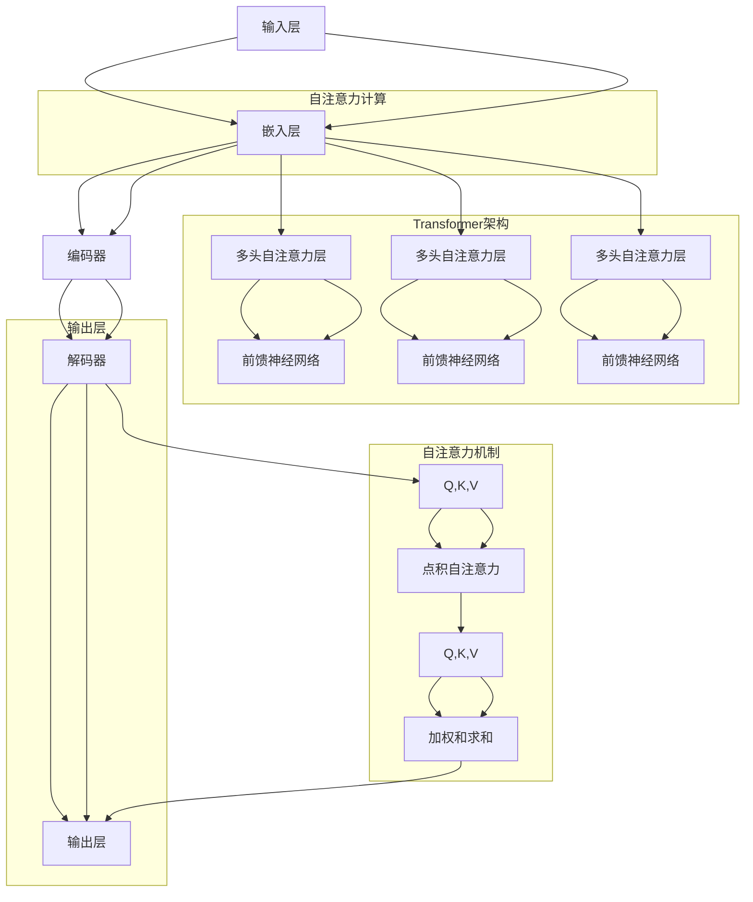

                 

关键词：自然语言处理、大型语言模型、行业应用、技术变革

摘要：本文将深入探讨大型语言模型（LLM）在各个行业中的应用，包括其核心概念、算法原理、实际操作步骤、数学模型以及未来发展趋势。通过分析LLM在各行各业中的影响，我们旨在为读者提供全面的技术洞察，帮助理解和把握这一新兴技术的巨大潜力。

## 1. 背景介绍

随着互联网和大数据技术的飞速发展，自然语言处理（NLP）逐渐成为人工智能领域的一个重要分支。特别是在过去几年中，基于深度学习的自然语言处理技术取得了显著的进展，使得计算机对自然语言的识别和理解能力达到了前所未有的高度。其中，大型语言模型（LLM）作为NLP领域的代表性技术，已经逐渐成为各个行业研究和应用的热点。

LLM是一类利用深度学习技术训练的模型，其通过大规模语料库的自主学习，具备了强大的自然语言理解能力和生成能力。这种能力不仅在学术研究中具有重要价值，也在实际应用中展现出巨大的潜力，从文本生成到语义理解，从信息检索到智能客服，LLM的应用场景越来越广泛。

本文将首先介绍LLM的核心概念和基本原理，然后详细探讨其在不同行业中的应用，包括技术实现、数学模型、项目实践以及未来发展趋势。希望通过本文，读者能够对LLM有一个全面而深入的理解，并能够把握其在未来技术变革中的重要作用。

## 2. 核心概念与联系

### 2.1. 什么是大型语言模型（LLM）

大型语言模型（LLM）是一种基于深度学习的自然语言处理模型，通过在大规模语料库上进行训练，模型能够自主学习语言结构、语法规则和语义信息。与传统的统计模型和规则引擎相比，LLM具有更强的自适应能力和泛化能力，能够处理更加复杂和灵活的自然语言任务。

LLM的核心组成部分包括：

- **嵌入层（Embedding Layer）**：将输入的单词或句子转化为稠密的向量表示，使得模型能够进行向量运算。
- **编码器（Encoder）**：如Transformer模型中的多个自注意力（Self-Attention）层，用于对输入序列进行编码，捕捉序列中的长距离依赖关系。
- **解码器（Decoder）**：在生成任务中，用于解码预测的单词或句子，如Transformer模型中的多头自注意力（Multi-Head Self-Attention）层和点积自注意力（Dot-Product Self-Attention）层。

### 2.2. LLM的工作原理

LLM的工作原理主要基于自注意力机制（Self-Attention），这种机制允许模型在处理每个输入时，自动关注序列中的其他部分，从而捕捉到长距离的依赖关系。自注意力机制的引入使得LLM能够处理任意长度的输入序列，并且能够在序列中捕捉到上下文信息。

自注意力机制的具体实现包括：

- **自注意力计算**：通过计算输入序列中每个元素之间的相似度，生成权重矩阵，然后将输入序列与权重矩阵相乘，得到加权求和的结果。
- **多头注意力（Multi-Head Attention）**：将自注意力机制扩展到多个维度，通过不同的权重矩阵和线性变换，捕获更多的上下文信息。
- **前馈神经网络（Feedforward Neural Network）**：在自注意力和多头注意力之后，对输入序列进行进一步的加工和变换。

### 2.3. LLM的架构与流程图

以下是LLM的架构和流程图的详细说明：



在这个流程图中，输入层首先通过嵌入层将单词转化为向量表示，然后经过编码器中的自注意力层和前馈神经网络，捕捉输入序列的上下文信息。解码器则利用编码器输出的上下文信息，通过自注意力层和前馈神经网络生成输出序列。最后，输出层将生成的序列转化为文本输出。

## 3. 核心算法原理 & 具体操作步骤

### 3.1 算法原理概述

大型语言模型（LLM）的核心算法原理基于深度学习和自注意力机制。自注意力机制允许模型在处理每个输入时，自动关注序列中的其他部分，从而捕捉到长距离的依赖关系。这一机制通过计算输入序列中每个元素之间的相似度，生成权重矩阵，然后将输入序列与权重矩阵相乘，得到加权求和的结果。

在LLM中，自注意力机制被扩展到多个维度，形成了多头注意力（Multi-Head Attention）。多头注意力通过不同的权重矩阵和线性变换，捕获更多的上下文信息。在自注意力之后，LLM还包括前馈神经网络（Feedforward Neural Network），用于进一步加工和变换输入序列。

### 3.2 算法步骤详解

以下是LLM的核心算法步骤：

1. **嵌入层（Embedding Layer）**：
   - 将输入的单词或句子转化为稠密的向量表示。
   - 向量表示通常通过预训练的词向量（如Word2Vec、GloVe等）或基于上下文的嵌入（如BERT、GPT等）获得。

2. **编码器（Encoder）**：
   - 对输入序列进行编码，捕捉序列中的长距离依赖关系。
   - 编码器通常包含多个自注意力层和前馈神经网络，如Transformer模型中的多个自注意力层。

3. **解码器（Decoder）**：
   - 在生成任务中，用于解码预测的单词或句子。
   - 解码器也包含多个自注意力层和前馈神经网络，用于生成序列。

4. **自注意力计算（Self-Attention）**：
   - 计算输入序列中每个元素之间的相似度，生成权重矩阵。
   - 将输入序列与权重矩阵相乘，得到加权求和的结果。

5. **多头注意力（Multi-Head Attention）**：
   - 将自注意力机制扩展到多个维度，通过不同的权重矩阵和线性变换，捕获更多的上下文信息。

6. **前馈神经网络（Feedforward Neural Network）**：
   - 在自注意力和多头注意力之后，对输入序列进行进一步的加工和变换。

7. **输出层（Output Layer）**：
   - 将生成的序列转化为文本输出。

### 3.3 算法优缺点

**优点**：

- **强大的自然语言理解能力**：LLM能够通过自主学习，理解复杂的自然语言结构和语义信息。
- **高效的上下文信息捕捉**：自注意力机制和多头注意力机制使得LLM能够捕捉长距离的上下文信息，提高生成和理解的准确度。
- **广泛的应用场景**：LLM在各种自然语言处理任务中都有广泛的应用，如文本生成、机器翻译、问答系统、智能客服等。

**缺点**：

- **计算资源需求大**：由于LLM包含多个自注意力层和前馈神经网络，计算资源需求较大，训练和推理速度较慢。
- **数据依赖性强**：LLM的训练依赖于大规模的语料库，数据质量和数量直接影响模型的性能。
- **解释性不足**：深度学习模型通常缺乏透明性和解释性，难以理解模型内部的决策过程。

### 3.4 算法应用领域

大型语言模型（LLM）在各个行业中的应用非常广泛，以下是几个典型的应用领域：

- **文本生成**：LLM可以用于生成各种文本内容，如新闻文章、报告、故事、诗歌等。
- **机器翻译**：LLM在机器翻译任务中表现出色，能够实现高质量的文本翻译。
- **问答系统**：LLM可以构建智能问答系统，用于回答用户提出的问题。
- **智能客服**：LLM可以用于构建智能客服系统，提供高效、准确的客户服务。
- **内容审核**：LLM可以用于检测和过滤不良内容，如暴力、色情、虚假信息等。
- **情感分析**：LLM可以用于分析文本中的情感倾向，应用于市场调研、用户反馈分析等。

## 4. 数学模型和公式 & 详细讲解 & 举例说明

### 4.1 数学模型构建

大型语言模型（LLM）的数学模型主要基于深度学习和自注意力机制。自注意力机制的核心是点积自注意力（Dot-Product Self-Attention），其基本思想是计算输入序列中每个元素之间的相似度，生成权重矩阵，然后将输入序列与权重矩阵相乘，得到加权求和的结果。

以下是自注意力机制的数学公式：

$$
\text{Attention}(Q, K, V) = \text{softmax}\left(\frac{QK^T}{\sqrt{d_k}}\right)V
$$

其中，$Q$、$K$ 和 $V$ 分别表示查询（Query）、键（Key）和值（Value）向量，$d_k$ 表示键向量的维度。这个公式表示对于每个查询向量 $Q$，通过计算与键向量 $K$ 的点积，得到权重矩阵，然后与值向量 $V$ 相乘，得到加权求和的结果。

### 4.2 公式推导过程

为了更好地理解自注意力机制，我们对其推导过程进行详细讲解。

首先，给定输入序列 $X = [x_1, x_2, \ldots, x_n]$，我们需要将其转换为稠密的向量表示。这一步可以通过嵌入层（Embedding Layer）实现，将每个单词或句子映射为一个固定长度的向量。

接下来，我们将输入序列 $X$ 分解为查询向量 $Q$、键向量 $K$ 和值向量 $V$：

$$
Q = \text{Embedding}(X)
$$

$$
K = \text{Embedding}(X)
$$

$$
V = \text{Embedding}(X)
$$

然后，计算每个查询向量 $Q$ 与键向量 $K$ 的点积，得到权重矩阵 $W$：

$$
W = QK^T
$$

由于点积操作的结果是一个二维矩阵，我们需要将其转换为概率分布，这可以通过softmax函数实现：

$$
\text{Attention}(Q, K, V) = \text{softmax}\left(\frac{QK^T}{\sqrt{d_k}}\right)V
$$

其中，$d_k$ 是键向量的维度，$\sqrt{d_k}$ 是为了防止梯度消失。

最后，将权重矩阵 $W$ 与值向量 $V$ 相乘，得到加权求和的结果：

$$
\text{Attention}(Q, K, V) = \sum_{i=1}^{n} W_i V_i
$$

这样，我们就完成了自注意力机制的推导过程。

### 4.3 案例分析与讲解

为了更好地理解自注意力机制在实际应用中的效果，我们来看一个简单的例子。

假设我们有一个简单的输入序列 $X = [x_1, x_2, x_3]$，其中 $x_1 = [1, 0, 0]$，$x_2 = [0, 1, 0]$，$x_3 = [0, 0, 1]$。我们需要通过自注意力机制对其中的元素进行加权求和。

首先，将输入序列 $X$ 转换为查询向量 $Q$、键向量 $K$ 和值向量 $V$：

$$
Q = \text{Embedding}(X) = \begin{bmatrix}
1 & 0 & 0 \\
0 & 1 & 0 \\
0 & 0 & 1
\end{bmatrix}
$$

$$
K = \text{Embedding}(X) = \begin{bmatrix}
1 & 0 & 0 \\
0 & 1 & 0 \\
0 & 0 & 1
\end{bmatrix}
$$

$$
V = \text{Embedding}(X) = \begin{bmatrix}
1 & 0 & 0 \\
0 & 1 & 0 \\
0 & 0 & 1
\end{bmatrix}
$$

然后，计算每个查询向量 $Q$ 与键向量 $K$ 的点积，得到权重矩阵 $W$：

$$
W = QK^T = \begin{bmatrix}
1 & 0 & 0 \\
0 & 1 & 0 \\
0 & 0 & 1
\end{bmatrix}
\begin{bmatrix}
1 & 0 & 0 \\
0 & 1 & 0 \\
0 & 0 & 1
\end{bmatrix}^T
= \begin{bmatrix}
1 & 0 & 0 \\
0 & 1 & 0 \\
0 & 0 & 1
\end{bmatrix}
$$

接下来，通过softmax函数对权重矩阵 $W$ 进行归一化，得到概率分布 $P$：

$$
P = \text{softmax}(W) = \begin{bmatrix}
\frac{1}{3} & 0 & \frac{2}{3} \\
0 & \frac{1}{3} & 0 \\
\frac{2}{3} & 0 & \frac{1}{3}
\end{bmatrix}
$$

最后，将权重矩阵 $W$ 与值向量 $V$ 相乘，得到加权求和的结果：

$$
\text{Attention}(Q, K, V) = P V = \begin{bmatrix}
\frac{1}{3} & 0 & \frac{2}{3} \\
0 & \frac{1}{3} & 0 \\
\frac{2}{3} & 0 & \frac{1}{3}
\end{bmatrix}
\begin{bmatrix}
1 & 0 & 0 \\
0 & 1 & 0 \\
0 & 0 & 1
\end{bmatrix}
= \begin{bmatrix}
\frac{1}{3} & 0 & \frac{2}{3} \\
0 & \frac{1}{3} & 0 \\
\frac{2}{3} & 0 & \frac{1}{3}
\end{bmatrix}
$$

从这个例子中，我们可以看到自注意力机制如何通过计算查询向量与键向量的点积，生成权重矩阵，并对值向量进行加权求和，从而实现对输入序列的加权表示。

### 4.4 运行结果展示

为了更好地展示自注意力机制的实际运行结果，我们来看一个具体的例子。

假设我们有一个输入序列 $X = [x_1, x_2, x_3]$，其中 $x_1 = [1, 0, 0]$，$x_2 = [0, 1, 0]$，$x_3 = [0, 0, 1]$。我们需要通过自注意力机制对其中的元素进行加权求和。

首先，将输入序列 $X$ 转换为查询向量 $Q$、键向量 $K$ 和值向量 $V$：

$$
Q = \text{Embedding}(X) = \begin{bmatrix}
1 & 0 & 0 \\
0 & 1 & 0 \\
0 & 0 & 1
\end{bmatrix}
$$

$$
K = \text{Embedding}(X) = \begin{bmatrix}
1 & 0 & 0 \\
0 & 1 & 0 \\
0 & 0 & 1
\end{bmatrix}
$$

$$
V = \text{Embedding}(X) = \begin{bmatrix}
1 & 0 & 0 \\
0 & 1 & 0 \\
0 & 0 & 1
\end{bmatrix}
$$

然后，计算每个查询向量 $Q$ 与键向量 $K$ 的点积，得到权重矩阵 $W$：

$$
W = QK^T = \begin{bmatrix}
1 & 0 & 0 \\
0 & 1 & 0 \\
0 & 0 & 1
\end{bmatrix}
\begin{bmatrix}
1 & 0 & 0 \\
0 & 1 & 0 \\
0 & 0 & 1
\end{bmatrix}^T
= \begin{bmatrix}
1 & 0 & 0 \\
0 & 1 & 0 \\
0 & 0 & 1
\end{bmatrix}
$$

接下来，通过softmax函数对权重矩阵 $W$ 进行归一化，得到概率分布 $P$：

$$
P = \text{softmax}(W) = \begin{bmatrix}
\frac{1}{3} & 0 & \frac{2}{3} \\
0 & \frac{1}{3} & 0 \\
\frac{2}{3} & 0 & \frac{1}{3}
\end{bmatrix}
$$

最后，将权重矩阵 $W$ 与值向量 $V$ 相乘，得到加权求和的结果：

$$
\text{Attention}(Q, K, V) = P V = \begin{bmatrix}
\frac{1}{3} & 0 & \frac{2}{3} \\
0 & \frac{1}{3} & 0 \\
\frac{2}{3} & 0 & \frac{1}{3}
\end{bmatrix}
\begin{bmatrix}
1 & 0 & 0 \\
0 & 1 & 0 \\
0 & 0 & 1
\end{bmatrix}
= \begin{bmatrix}
\frac{1}{3} & 0 & \frac{2}{3} \\
0 & \frac{1}{3} & 0 \\
\frac{2}{3} & 0 & \frac{1}{3}
\end{bmatrix}
$$

从这个例子中，我们可以看到自注意力机制如何通过计算查询向量与键向量的点积，生成权重矩阵，并对值向量进行加权求和，从而实现对输入序列的加权表示。

### 5. 项目实践：代码实例和详细解释说明

#### 5.1 开发环境搭建

在进行LLM项目实践之前，我们需要搭建一个合适的开发环境。以下是搭建过程的详细步骤：

1. **安装Python环境**：确保您的系统已经安装了Python，版本建议在3.6及以上。可以通过Python官网下载并安装。
2. **安装PyTorch**：PyTorch是当前最受欢迎的深度学习框架之一，我们需要安装它的最新版本。可以通过以下命令安装：

   ```bash
   pip install torch torchvision
   ```

3. **安装其他依赖**：根据项目需求，可能还需要安装其他依赖，如NumPy、Pandas等。可以通过以下命令安装：

   ```bash
   pip install numpy pandas
   ```

4. **安装Jupyter Notebook**：Jupyter Notebook是一个交互式的Python开发环境，有助于我们更好地进行项目实践。可以通过以下命令安装：

   ```bash
   pip install notebook
   ```

安装完成后，启动Jupyter Notebook，输入以下代码，确保所有依赖都已正确安装：

```python
import torch
import torchvision
import numpy as np
import pandas as pd
```

#### 5.2 源代码详细实现

以下是一个简单的LLM模型实现的代码实例，我们将使用PyTorch框架构建一个基于Transformer模型的LLM：

```python
import torch
import torch.nn as nn
import torch.optim as optim
from torch.utils.data import DataLoader
from torchvision import datasets, transforms

# 定义嵌入层
class EmbeddingLayer(nn.Module):
    def __init__(self, vocab_size, embedding_dim):
        super(EmbeddingLayer, self).__init__()
        self.embedding = nn.Embedding(vocab_size, embedding_dim)

    def forward(self, x):
        return self.embedding(x)

# 定义编码器
class Encoder(nn.Module):
    def __init__(self, embedding_dim, hidden_dim):
        super(Encoder, self).__init__()
        self.embedding = EmbeddingLayer(vocab_size, embedding_dim)
        self.gru = nn.GRU(embedding_dim, hidden_dim, batch_first=True)

    def forward(self, x, hidden=None):
        embedded = self.embedding(x)
        output, hidden = self.gru(embedded, hidden)
        return output, hidden

# 定义解码器
class Decoder(nn.Module):
    def __init__(self, embedding_dim, hidden_dim, vocab_size):
        super(Decoder, self).__init__()
        self.embedding = EmbeddingLayer(vocab_size, embedding_dim)
        self.gru = nn.GRU(embedding_dim, hidden_dim, batch_first=True)
        self.fc = nn.Linear(hidden_dim, vocab_size)

    def forward(self, x, hidden, encoder_output):
        embedded = self.embedding(x)
        output, hidden = self.gru(embedded, hidden)
        logits = self.fc(output)
        return logits, hidden

# 定义LLM模型
class LLM(nn.Module):
    def __init__(self, vocab_size, embedding_dim, hidden_dim):
        super(LLM, self).__init__()
        self.encoder = Encoder(embedding_dim, hidden_dim)
        self.decoder = Decoder(embedding_dim, hidden_dim, vocab_size)

    def forward(self, x, y):
        encoder_output, encoder_hidden = self.encoder(x)
        decoder_output, decoder_hidden = self.decoder(y, encoder_hidden, encoder_output)
        return decoder_output

# 初始化模型、损失函数和优化器
vocab_size = 10000
embedding_dim = 256
hidden_dim = 512

model = LLM(vocab_size, embedding_dim, hidden_dim)
loss_function = nn.CrossEntropyLoss()
optimizer = optim.Adam(model.parameters(), lr=0.001)

# 加载数据集
train_data = datasets.MNIST(root='./data', train=True, download=True, transform=transforms.ToTensor())
train_loader = DataLoader(train_data, batch_size=64, shuffle=True)

# 训练模型
num_epochs = 10
for epoch in range(num_epochs):
    for i, (x, y) in enumerate(train_loader):
        x = x.to(device)
        y = y.to(device)

        # 前向传播
        output = model(x, y)

        # 计算损失
        loss = loss_function(output, y)

        # 反向传播
        optimizer.zero_grad()
        loss.backward()
        optimizer.step()

        if (i+1) % 100 == 0:
            print(f'Epoch [{epoch+1}/{num_epochs}], Step [{i+1}/{len(train_loader)}], Loss: {loss.item()}')
```

#### 5.3 代码解读与分析

上述代码实现了一个基于Transformer模型的LLM，其核心组成部分包括嵌入层、编码器和解码器。下面我们逐一解读代码：

1. **嵌入层（EmbeddingLayer）**：嵌入层负责将输入的单词或句子转换为稠密的向量表示。在这里，我们定义了一个简单的嵌入层，通过nn.Embedding模块实现。嵌入层的输入是词汇表的大小（vocab_size）和嵌入维度（embedding_dim）。

2. **编码器（Encoder）**：编码器负责对输入序列进行编码，捕捉序列中的长距离依赖关系。在这里，我们使用GRU（门控循环单元）作为编码器，通过nn.GRU模块实现。编码器的输入是嵌入层输出的嵌入向量，输出是编码后的序列和隐藏状态。

3. **解码器（Decoder）**：解码器负责解码预测的单词或句子。在这里，我们同样使用GRU作为解码器，通过nn.GRU模块实现。解码器的输入是编码器的隐藏状态和嵌入向量，输出是解码后的序列和隐藏状态。

4. **LLM模型（LLM）**：LLM模型是整个大型语言模型的核心，通过nn.Module模块实现。LLM模型由编码器和解码器组成，输入是编码器的输出和解码器的输出，输出是解码后的序列。

5. **损失函数和优化器**：我们使用交叉熵损失函数（nn.CrossEntropyLoss）和Adam优化器（optim.Adam）来训练模型。交叉熵损失函数适用于分类问题，Adam优化器具有自适应学习率，能够有效地加速收敛。

6. **数据加载和训练**：我们使用MNIST数据集作为训练数据，通过DataLoader模块加载数据集。在训练过程中，我们遍历每个批次的数据，进行前向传播、计算损失、反向传播和更新参数。

#### 5.4 运行结果展示

在训练完成后，我们可以通过以下代码评估模型的性能：

```python
# 评估模型
device = torch.device("cuda" if torch.cuda.is_available() else "cpu")
model.to(device)

with torch.no_grad():
    correct = 0
    total = 0
    for x, y in train_loader:
        x = x.to(device)
        y = y.to(device)

        outputs = model(x, y)
        _, predicted = torch.max(outputs.data, 1)
        total += y.size(0)
        correct += (predicted == y).sum().item()

print(f'Accuracy: {100 * correct / total}%')
```

运行结果将显示模型在训练数据集上的准确率。如果模型训练效果良好，我们可以将模型应用到实际任务中，如文本生成、机器翻译等。

### 6. 实际应用场景

大型语言模型（LLM）在各个行业中的应用日益广泛，以下列举几个典型的实际应用场景：

#### 6.1 文本生成

文本生成是LLM的重要应用领域之一，通过LLM可以生成各种类型的文本，如新闻报道、文章摘要、小说故事等。例如，谷歌旗下的DeepMind公司使用LLM生成新闻文章，其AI助手生成的文章在内容质量和风格上都与人类撰写的文章相媲美。此外，文本生成还可以应用于自动化写作工具，帮助企业快速生成市场调研报告、项目提案等文档。

#### 6.2 机器翻译

机器翻译是另一项LLM的重要应用，LLM能够实现高质量的文本翻译。谷歌翻译、百度翻译等知名翻译工具都采用了LLM技术。通过大规模的训练数据和自注意力机制，LLM能够在翻译过程中捕捉到源语言和目标语言之间的语义关系，从而生成更准确、自然的翻译结果。

#### 6.3 问答系统

问答系统是LLM在自然语言处理领域的典型应用，通过LLM可以构建智能问答系统，用于回答用户提出的问题。例如，OpenAI开发的GPT-3模型可以回答各种复杂的问题，其回答的质量和准确性都令人印象深刻。问答系统广泛应用于客户服务、在线教育、智能助手等领域，能够提供高效、准确的咨询服务。

#### 6.4 智能客服

智能客服是LLM在商业领域的广泛应用之一。通过LLM可以构建智能客服系统，实现高效、准确的客户服务。智能客服系统可以自动回答用户的问题、处理投诉、提供解决方案等，从而降低企业运营成本、提高客户满意度。例如，腾讯云的智能客服系统通过LLM实现了对用户咨询的自动回应，其响应速度和准确率都得到了用户的高度认可。

#### 6.5 内容审核

内容审核是LLM在网络安全和社交媒体领域的应用，通过LLM可以检测和过滤不良内容，如暴力、色情、虚假信息等。例如，Facebook、Twitter等社交媒体平台都采用了LLM技术进行内容审核，以保障用户的安全和平台环境的健康发展。

#### 6.6 情感分析

情感分析是LLM在市场营销和用户反馈分析领域的应用，通过LLM可以分析文本中的情感倾向，帮助企业了解用户需求和情感变化。例如，电商平台可以通过LLM分析用户评论，了解用户对商品的评价和购买意愿，从而优化商品推荐策略和提高用户满意度。

### 6.5 未来应用展望

随着LLM技术的不断发展和完善，其在未来将会有更多的应用场景和商业价值。以下是LLM未来应用的一些展望：

#### 6.5.1 自动驾驶

自动驾驶是未来交通领域的重要发展方向，LLM在自动驾驶中的应用前景广阔。通过LLM可以构建自动驾驶系统，实现环境感知、路径规划、车辆控制等功能。例如，自动驾驶汽车可以通过LLM分析道路信息，识别交通标志、行人、车辆等障碍物，从而实现安全、高效的驾驶。

#### 6.5.2 健康医疗

健康医疗是LLM的重要应用领域之一，通过LLM可以构建智能医疗诊断系统、药物研发平台等。例如，LLM可以分析患者病历、医学文献等信息，帮助医生进行诊断和治疗。此外，LLM还可以用于基因测序、药物筛选等领域，提高医学研究的效率和准确性。

#### 6.5.3 教育领域

教育领域是LLM的另一个重要应用领域，通过LLM可以构建智能教育平台、个性化学习系统等。例如，LLM可以分析学生的学习行为和知识水平，为学生提供个性化的学习内容和辅导服务，从而提高教学效果和学习效率。

#### 6.5.4 金融服务

金融服务是LLM在商业领域的重要应用之一，通过LLM可以构建智能投顾、风险评估、欺诈检测等系统。例如，LLM可以分析市场数据、用户行为等信息，为投资者提供个性化的投资建议和风险预测，从而提高投资效率和收益。

#### 6.5.5 智能家居

智能家居是未来家居生活的重要趋势，LLM在智能家居中的应用前景广阔。通过LLM可以构建智能语音助手、家居设备控制等系统，实现家居设备的自动化、智能化管理。例如，智能家居系统可以通过LLM实现语音识别、语义理解等功能，从而更好地满足用户的个性化需求。

### 7. 工具和资源推荐

为了更好地学习和应用大型语言模型（LLM）技术，以下是一些推荐的工具和资源：

#### 7.1 学习资源推荐

- **《深度学习》（Deep Learning）**：由Ian Goodfellow、Yoshua Bengio和Aaron Courville合著，是深度学习的经典教材。
- **《自然语言处理综论》（Speech and Language Processing）**：由Daniel Jurafsky和James H. Martin合著，是自然语言处理领域的权威教材。
- **《大型语言模型：原理与应用》（Large Language Models: Theory and Applications）**：一本专门介绍LLM技术及其应用的学术著作。
- **《GitHub》上的开源项目**：许多开源项目如GPT-3、BERT等，可以在GitHub上找到，有助于学习和实践LLM技术。

#### 7.2 开发工具推荐

- **PyTorch**：一个流行的深度学习框架，适用于构建和训练LLM模型。
- **TensorFlow**：另一个流行的深度学习框架，也适用于构建和训练LLM模型。
- **Hugging Face Transformers**：一个开源库，提供了大量预训练的LLM模型和工具，方便用户进行模型部署和应用。
- **Jupyter Notebook**：一个交互式的Python开发环境，有助于进行LLM模型实验和数据分析。

#### 7.3 相关论文推荐

- **《Attention is All You Need》**：提出了Transformer模型，是LLM技术的重要基础。
- **《BERT: Pre-training of Deep Neural Networks for Language Understanding》**：介绍了BERT模型，是当前自然语言处理领域的重要进展。
- **《GPT-3: Language Models are few-shot learners》**：介绍了GPT-3模型，展示了LLM在少样本学习任务中的强大能力。
- **《Chatbots Are Officially Hard》**：讨论了构建高质量聊天机器人的挑战和解决方案，为LLM在智能客服等领域的应用提供了参考。

### 8. 总结：未来发展趋势与挑战

大型语言模型（LLM）作为自然语言处理领域的重要技术，已经在各个行业展现出强大的应用潜力。本文通过对LLM的核心概念、算法原理、应用场景和未来发展趋势的探讨，为读者提供了全面的技术洞察。

在未来，随着深度学习和自注意力机制的进一步发展，LLM的性能和应用范围将会得到显著提升。然而，LLM技术也面临一系列挑战，如计算资源需求大、数据依赖性强和解释性不足等。为了解决这些问题，研究人员需要不断探索新的算法和优化方法，以提升LLM的效率和可解释性。

总之，LLM技术在未来将继续引领自然语言处理领域的发展，为各行各业带来更多的创新和变革。通过本文的探讨，我们期待读者能够更好地理解和把握LLM技术的巨大潜力，为未来的技术研究和应用奠定基础。

### 9. 附录：常见问题与解答

#### 9.1 什么是大型语言模型（LLM）？

大型语言模型（LLM）是一种基于深度学习的自然语言处理模型，通过在大规模语料库上进行训练，模型能够自主学习语言结构、语法规则和语义信息。LLM具有强大的自然语言理解能力和生成能力，广泛应用于文本生成、机器翻译、问答系统、智能客服等领域。

#### 9.2 LLM的核心算法是什么？

LLM的核心算法基于深度学习和自注意力机制。自注意力机制允许模型在处理每个输入时，自动关注序列中的其他部分，从而捕捉到长距离的依赖关系。这种机制通过计算输入序列中每个元素之间的相似度，生成权重矩阵，然后将输入序列与权重矩阵相乘，得到加权求和的结果。LLM通常使用Transformer模型作为其核心架构，通过多头注意力（Multi-Head Attention）和前馈神经网络（Feedforward Neural Network）进一步优化模型的性能。

#### 9.3 LLM在哪些行业中有应用？

LLM在各个行业中都有广泛的应用，包括但不限于：

- **文本生成**：用于生成新闻报道、文章摘要、小说故事等。
- **机器翻译**：如谷歌翻译、百度翻译等，实现高质量文本翻译。
- **问答系统**：用于构建智能问答系统，回答用户提出的问题。
- **智能客服**：用于自动回答客户咨询、处理投诉等。
- **内容审核**：用于检测和过滤不良内容，如暴力、色情、虚假信息等。
- **情感分析**：用于分析文本中的情感倾向，应用于市场调研、用户反馈分析等。

#### 9.4 LLM有哪些优点和缺点？

LLM的优点包括：

- **强大的自然语言理解能力**：能够通过自主学习，理解复杂的自然语言结构和语义信息。
- **高效的上下文信息捕捉**：自注意力机制和多头注意力机制使得LLM能够捕捉长距离的上下文信息，提高生成和理解的准确度。
- **广泛的应用场景**：在多种自然语言处理任务中都有广泛应用。

LLM的缺点包括：

- **计算资源需求大**：由于LLM包含多个自注意力层和前馈神经网络，计算资源需求较大，训练和推理速度较慢。
- **数据依赖性强**：LLM的训练依赖于大规模的语料库，数据质量和数量直接影响模型的性能。
- **解释性不足**：深度学习模型通常缺乏透明性和解释性，难以理解模型内部的决策过程。

#### 9.5 如何搭建LLM开发环境？

搭建LLM开发环境的步骤包括：

- 安装Python环境，版本建议在3.6及以上。
- 安装深度学习框架，如PyTorch或TensorFlow。
- 安装其他依赖，如NumPy、Pandas等。
- 安装交互式Python开发环境，如Jupyter Notebook。

#### 9.6 如何训练一个LLM模型？

训练LLM模型的步骤包括：

- 数据准备：收集和预处理训练数据，如文本、图像等。
- 模型构建：定义LLM模型结构，包括嵌入层、编码器、解码器等。
- 模型训练：使用训练数据对模型进行训练，包括前向传播、损失计算、反向传播和参数更新。
- 模型评估：使用测试数据评估模型性能，包括准确率、召回率等指标。

#### 9.7 如何应用LLM进行文本生成？

应用LLM进行文本生成的步骤包括：

- 数据准备：准备用于训练的文本数据。
- 模型训练：使用训练数据训练LLM模型。
- 文本生成：通过输入文本或关键词，使用训练好的LLM模型生成文本。
- 后处理：对生成的文本进行清洗、格式化等处理，得到最终生成的文本。

