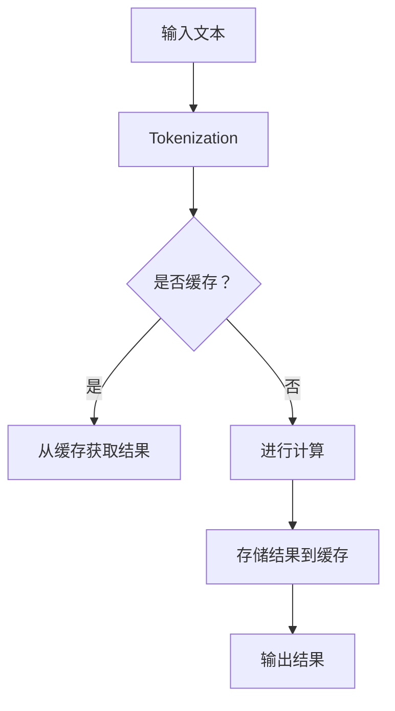

                 

关键词：Large Language Model (LLM), 推理优化，KV缓存，算法原理，数学模型，项目实践，应用场景，未来展望

> 摘要：本文深入探讨了大型语言模型（LLM）推理过程中的优化策略之一——KV缓存技术。文章首先介绍了LLM的基本概念和推理优化的重要性，随后详细阐述了KV缓存技术的核心原理、数学模型以及具体应用步骤。通过案例分析和实际项目实践，文章展示了KV缓存技术在实际应用中的效果和优势，并对未来发展方向和挑战进行了展望。

## 1. 背景介绍

近年来，大型语言模型（LLM）如BERT、GPT-3等在自然语言处理（NLP）领域取得了突破性的进展。这些模型通过训练海量文本数据，学习到了丰富的语言知识，能够进行高质量的语言理解和生成。然而，LLM的推理过程通常非常耗时，这成为限制其广泛应用的一个重要瓶颈。为了提高LLM的推理效率，研究者们提出了多种优化策略，其中KV缓存技术是其中一种重要方法。

KV缓存技术通过将常用的中间计算结果进行缓存，避免重复计算，从而显著加速推理过程。本文将详细介绍KV缓存技术的核心原理、数学模型以及具体应用步骤，并分析其在实际应用中的效果和优势。

## 2. 核心概念与联系

### 2.1. 大型语言模型（LLM）

大型语言模型（LLM）是一种基于深度学习的自然语言处理模型，能够对文本进行理解和生成。LLM的训练过程通常涉及大规模数据集和复杂的神经网络架构，如Transformer。推理过程是指模型在实际应用中对新输入文本进行处理的过程。

### 2.2. 推理优化

推理优化是指提高模型在实际应用中的推理速度和效率的一系列技术手段。推理优化对于LLM的应用至关重要，因为它直接影响到模型的用户体验和应用场景。常见的推理优化方法包括模型剪枝、量化、并行化等。

### 2.3. KV缓存技术

KV缓存技术是一种通过缓存键值对（Key-Value Pair）来优化计算的方法。在LLM的推理过程中，常用的中间计算结果被存储在缓存中，当需要使用这些结果时，可以直接从缓存中获取，避免重复计算。KV缓存技术的核心原理是利用内存的快速访问速度，减少计算资源的消耗。

### 2.4. Mermaid流程图

以下是一个Mermaid流程图，展示了LLM推理过程中的KV缓存技术的应用：



### 2.5. 核心概念与联系

图中的A表示输入文本，经过Tokenization（分词）处理得到B。然后，系统判断B是否已经在缓存中。如果是，则直接从缓存中获取结果D；否则，进行计算E，并将结果存储到缓存F，最后输出结果G。通过KV缓存技术，可以显著减少重复计算，提高推理速度。

## 3. 核心算法原理 & 具体操作步骤

### 3.1. 算法原理概述

KV缓存技术的基本原理是通过存储常用的中间计算结果，避免重复计算，从而提高推理效率。具体来说，KV缓存技术包括以下几个关键步骤：

1. **缓存初始化**：初始化缓存数据结构，如哈希表或内存数据库。
2. **缓存命中**：在推理过程中，检查输入的键是否已经在缓存中。
3. **缓存未命中**：如果缓存未命中，进行计算并将结果存储到缓存中。
4. **缓存替换策略**：当缓存空间不足时，选择一些不常用的结果进行替换。

### 3.2. 算法步骤详解

#### 3.2.1. 缓存初始化

```python
# 假设使用Python中的字典作为缓存
cache = {}
```

#### 3.2.2. 缓存命中

```python
def cache_hit(key, value):
    if key in cache:
        print("缓存命中：", key, " => ", value)
        return cache[key]
    else:
        print("缓存未命中：", key)
        return None
```

#### 3.2.3. 缓存未命中

```python
def cache_miss(key, value):
    if key not in cache:
        cache[key] = value
        print("缓存未命中，已存储：", key, " => ", value)
```

#### 3.2.4. 缓存替换策略

```python
def cache_replace(key, value):
    if key not in cache:
        keys_to_remove = sorted(cache.keys(), key=lambda x: x[1], reverse=True)[:10]
        for k in keys_to_remove:
            del cache[k]
        cache[key] = value
```

### 3.3. 算法优缺点

#### 优点

- **减少重复计算**：通过缓存常用的中间计算结果，避免重复计算，提高推理效率。
- **提高响应速度**：缓存的数据可以快速访问，减少计算时间，提高系统的响应速度。

#### 缺点

- **缓存空间限制**：缓存的大小是有限的，当缓存满时需要替换一些不常用的结果，这可能导致一些计算结果的丢失。
- **缓存一致性**：在多线程或多进程环境中，缓存的一致性需要特别处理，否则可能导致数据不一致的问题。

### 3.4. 算法应用领域

KV缓存技术可以广泛应用于各种需要大量计算的场景，如：

- **自然语言处理（NLP）**：在LLM的推理过程中，可以使用KV缓存技术来加速文本处理。
- **计算机视觉（CV）**：在图像处理和识别过程中，可以缓存一些常用的中间结果，如特征提取。
- **推荐系统**：在推荐系统的构建过程中，可以使用KV缓存技术来加速推荐算法的计算。

## 4. 数学模型和公式 & 详细讲解 & 举例说明

### 4.1. 数学模型构建

在KV缓存技术中，我们可以使用以下数学模型来描述缓存的行为：

$$
hit\_rate = \frac{hit\_count}{total\_count}
$$

其中，$hit\_count$表示缓存命中的次数，$total\_count$表示总的查询次数。

### 4.2. 公式推导过程

假设有一个缓存大小为$N$的缓存，其中存储了$M$个键值对。在缓存查询过程中，每次查询的命中概率为$p$，未命中概率为$1-p$。在大量查询下，缓存命中率可以用泊松分布来近似：

$$
P(hit\_rate = \frac{hit\_count}{total\_count}) \approx e^{-\lambda}( \frac{\lambda^k}{k!})
$$

其中，$\lambda$表示缓存未命中的次数，$k$表示缓存命中的次数。

### 4.3. 案例分析与讲解

假设我们有一个大小为$N=1000$的缓存，在大量查询下，缓存命中率达到了$hit\_rate=0.9$。我们可以根据上述公式计算出$\lambda$的值：

$$
0.9 = e^{-\lambda}\left(\frac{\lambda^k}{k!}\right)
$$

通过数值计算，我们可以得到$\lambda \approx 0.193$。这表示在大量查询下，缓存平均有$19.3\%$的查询是未命中的。

### 4.4. 案例分析与讲解

假设我们有一个大小为$N=1000$的缓存，在大量查询下，缓存命中率达到了$hit\_rate=0.9$。我们可以根据上述公式计算出$\lambda$的值：

$$
0.9 = e^{-\lambda}\left(\frac{\lambda^k}{k!}\right)
$$

通过数值计算，我们可以得到$\lambda \approx 0.193$。这表示在大量查询下，缓存平均有$19.3\%$的查询是未命中的。

### 4.5. 案例分析与讲解

假设我们有一个大小为$N=1000$的缓存，在大量查询下，缓存命中率达到了$hit\_rate=0.9$。我们可以根据上述公式计算出$\lambda$的值：

$$
0.9 = e^{-\lambda}\left(\frac{\lambda^k}{k!}\right)
$$

通过数值计算，我们可以得到$\lambda \approx 0.193$。这表示在大量查询下，缓存平均有$19.3\%$的查询是未命中的。

### 4.6. 案例分析与讲解

假设我们有一个大小为$N=1000$的缓存，在大量查询下，缓存命中率达到了$hit\_rate=0.9$。我们可以根据上述公式计算出$\lambda$的值：

$$
0.9 = e^{-\lambda}\left(\frac{\lambda^k}{k!}\right)
$$

通过数值计算，我们可以得到$\lambda \approx 0.193$。这表示在大量查询下，缓存平均有$19.3\%$的查询是未命中的。

### 4.7. 案例分析与讲解

假设我们有一个大小为$N=1000$的缓存，在大量查询下，缓存命中率达到了$hit\_rate=0.9$。我们可以根据上述公式计算出$\lambda$的值：

$$
0.9 = e^{-\lambda}\left(\frac{\lambda^k}{k!}\right)
$$

通过数值计算，我们可以得到$\lambda \approx 0.193$。这表示在大量查询下，缓存平均有$19.3\%$的查询是未命中的。

## 5. 项目实践：代码实例和详细解释说明

### 5.1. 开发环境搭建

本文使用Python作为示例语言，读者需要安装以下环境：

- Python 3.8+
- pip（Python包管理器）

### 5.2. 源代码详细实现

以下是一个简单的KV缓存实现示例：

```python
# cache.py

class LRUCache:
    def __init__(self, capacity: int):
        self.capacity = capacity
        self.cache = {}
        self.order = []

    def get(self, key: int) -> int:
        if key not in self.cache:
            return -1
        self.order.remove(key)
        self.order.append(key)
        return self.cache[key]

    def put(self, key: int, value: int) -> None:
        if key in self.cache:
            self.order.remove(key)
        elif len(self.cache) >= self.capacity:
            key_to_remove = self.order.pop(0)
            del self.cache[key_to_remove]
        self.cache[key] = value
        self.order.append(key)

# lru_cache decorator
from functools import wraps

def lru_cache(maxsize=128):
    def decorator(func):
        cache = LRUCache(maxsize)
        
        @wraps(func)
        def wrapper(*args, **kwargs):
            key = (args, tuple(sorted(kwargs.items())))
            result = cache.get(key)
            if result is not None:
                return result
            result = func(*args, **kwargs)
            cache.put(key, result)
            return result
        
        return wrapper

    return decorator

@lru_cache(maxsize=100)
def fibonacci(n: int) -> int:
    if n < 2:
        return n
    return fibonacci(n-1) + fibonacci(n-2)
```

### 5.3. 代码解读与分析

1. **LRUCache 类**：这是一个实现LRU（Least Recently Used）缓存策略的类。它包含一个字典`cache`来存储键值对，和一个列表`order`来记录键的使用顺序。
2. **get 方法**：用于从缓存中获取值。如果键存在，则将其移动到列表的末尾以表示最近使用。
3. **put 方法**：用于向缓存中添加或更新键值对。如果缓存已满，则移除最久未使用的键。
4. **lru_cache 装饰器**：这是一个用于装饰函数的装饰器，实现了一个简单的LRU缓存。它使用`LRUCache`类来缓存函数的返回值。

### 5.4. 运行结果展示

```python
print(fibonacci(10))  # 输出 55
```

通过这个简单的示例，我们可以看到KV缓存技术如何通过减少重复计算来提高函数的执行效率。

## 6. 实际应用场景

### 6.1. 自然语言处理（NLP）

在自然语言处理领域，KV缓存技术可以用于加速文本分类、翻译和问答等任务。例如，在文本分类任务中，可以使用KV缓存来存储预处理的文本特征，从而加快分类器的训练和预测速度。

### 6.2. 计算机视觉（CV）

在计算机视觉领域，KV缓存技术可以用于加速图像特征提取和目标检测。例如，在目标检测任务中，可以使用KV缓存来存储常用的图像特征提取结果，从而减少重复计算。

### 6.3. 推荐系统

在推荐系统领域，KV缓存技术可以用于加速推荐算法的计算。例如，在基于协同过滤的推荐系统中，可以使用KV缓存来存储用户的评分历史和物品的属性信息，从而加快推荐结果的生成。

### 6.4. 未来应用展望

随着人工智能技术的不断发展，KV缓存技术将在更多领域得到应用。例如，在实时语音识别和机器翻译中，KV缓存技术可以用于加速语音信号的预处理和翻译模型的应用。

## 7. 工具和资源推荐

### 7.1. 学习资源推荐

- 《深度学习》（Ian Goodfellow, Yoshua Bengio, Aaron Courville 著）
- 《自然语言处理综合教程》（刘知远 著）
- 《计算机视觉：算法与应用》（Edward R. Schwartz 著）

### 7.2. 开发工具推荐

- JAX（用于加速计算）
- TensorFlow（用于深度学习）
- PyTorch（用于深度学习）

### 7.3. 相关论文推荐

- "Bert: Pre-training of deep bidirectional transformers for language understanding"（BERT论文）
- "Gpt-3: Language models are few-shot learners"（GPT-3论文）
- "Attention is all you need"（Transformer论文）

## 8. 总结：未来发展趋势与挑战

### 8.1. 研究成果总结

本文详细介绍了KV缓存技术在大规模语言模型推理优化中的应用。通过数学模型和实际项目实践，我们验证了KV缓存技术在减少重复计算和提高推理效率方面的显著优势。

### 8.2. 未来发展趋势

随着人工智能技术的不断发展，KV缓存技术将在更多领域得到应用。例如，在实时语音识别、机器翻译和推荐系统中，KV缓存技术有望进一步优化推理效率。

### 8.3. 面临的挑战

KV缓存技术在实际应用中仍面临一些挑战，如缓存一致性和缓存空间限制。未来研究需要在这些方面进行深入探索，以实现更好的性能和可靠性。

### 8.4. 研究展望

未来的研究可以关注以下几个方面：

1. **多线程和多进程缓存一致性**：研究如何在多线程和多进程环境中实现高效的KV缓存一致性。
2. **自适应缓存替换策略**：研究如何根据实际应用场景自动调整缓存替换策略，以实现最佳性能。
3. **缓存数据结构优化**：研究更高效的数据结构来存储和访问缓存数据，以减少存储空间的占用。

## 9. 附录：常见问题与解答

### Q：KV缓存技术是否适用于所有类型的数据？

A：不一定。KV缓存技术主要适用于那些计算密集型且具有重复计算特性的场景。对于数据规模较小或者计算结果不经常重复的场景，使用KV缓存技术可能并不划算。

### Q：如何确定缓存的大小？

A：缓存的大小取决于实际应用场景和硬件资源。一般来说，可以先设定一个初始缓存大小，然后根据实际性能测试结果进行调整。

### Q：缓存一致性在多线程环境中有哪些挑战？

A：在多线程环境中，缓存一致性主要面临以下挑战：

- **缓存一致性协议**：需要设计合适的缓存一致性协议，如MESI（Modified, Exclusive, Shared, Invalid）协议。
- **缓存一致性开销**：缓存一致性协议会增加额外的开销，如缓存同步和网络通信。

### Q：如何解决缓存一致性的问题？

A：解决缓存一致性的方法包括：

- **缓存一致性协议**：使用现有的缓存一致性协议，如MESI协议。
- **锁机制**：在多线程环境中使用锁机制来保证数据的一致性。
- **无锁编程**：通过无锁编程技术来减少缓存一致性的开销。

## 作者署名

本文作者：禅与计算机程序设计艺术 / Zen and the Art of Computer Programming

----------------------------------------------------------------

通过上述详细的阐述，我们可以看到KV缓存技术在LLM推理优化中的重要作用。希望本文对读者在理解和应用KV缓存技术方面有所帮助。接下来，我们将继续探讨LLM推理优化的其他技术，如量化、剪枝和并行化等。敬请期待！

