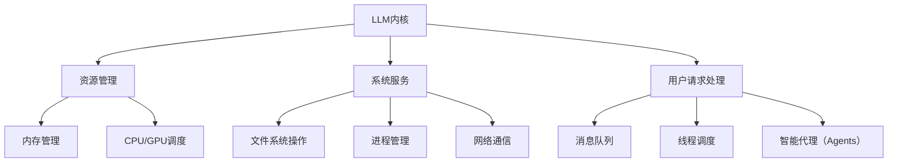

                 

关键词：大型语言模型（LLM）、操作系统、内核、消息、线程、Agents、计算结构、数据处理

摘要：本文深入探讨了大型语言模型（LLM）作为操作系统的核心组成部分，从内核、消息传递、线程管理和智能代理（Agents）等多个方面进行了详细阐述。通过分析LLM的架构与原理，本文揭示了其在现代计算结构中的关键作用，探讨了其未来的发展趋势与挑战，为读者提供了全面的视角。

## 1. 背景介绍

近年来，随着人工智能技术的飞速发展，大型语言模型（LLM）如BERT、GPT等逐渐成为研究和应用的热点。这些模型具有处理大规模文本数据、生成自然语言文本、回答问题等功能，被广泛应用于自然语言处理（NLP）、智能客服、内容生成等领域。然而，LLM不仅是一种算法模型，更可以被视为一种新型的操作系统，其内核、消息传递机制、线程管理和智能代理（Agents）等功能为计算结构带来了革命性的变化。

LLM操作系统的核心在于其高效的文本数据处理能力，这使得它能够快速响应用户的查询，处理复杂任务，实现自动化操作。与传统操作系统相比，LLM操作系统具有更高的灵活性和智能化程度，能够更好地适应不断变化的应用场景。

本文将首先介绍LLM操作系统的基本概念和核心组成部分，然后深入分析其内核、消息传递、线程管理和智能代理（Agents）等方面，最后探讨其未来发展趋势与挑战。通过本文的阅读，读者将全面了解LLM操作系统的工作原理和应用前景。

## 2. 核心概念与联系

### 2.1 大型语言模型（LLM）概述

大型语言模型（LLM）是一种基于深度学习技术的自然语言处理模型，通过大量的文本数据进行预训练，能够理解自然语言的语义和语法结构。LLM的基本原理是利用神经网络模型（如Transformer）对文本数据进行建模，从而实现对文本的生成、理解和推理。

### 2.2 内核（Kernel）概念

在LLM操作系统中，内核是其核心组成部分，负责管理系统的基本资源、提供基本的系统服务，以及执行用户请求。LLM内核的主要功能包括：

- **资源管理**：管理系统的内存、CPU、GPU等资源，确保资源的合理分配和高效利用。
- **系统服务**：提供基本的系统服务，如文件系统操作、进程管理、网络通信等。
- **用户请求处理**：接收并处理用户的查询和请求，将请求转化为具体的任务执行。

### 2.3 消息传递（Messaging）机制

消息传递机制是LLM操作系统中实现模块间通信的重要手段。通过消息队列、消息中间件等技术，不同模块可以高效地传递数据和请求，实现分布式系统的协同工作。LLM操作系统的消息传递机制具有以下特点：

- **异步通信**：允许模块间进行异步通信，提高了系统的并发处理能力。
- **高可靠性**：通过消息队列的持久化、重试机制等手段，确保消息传递的高可靠性。
- **灵活可扩展**：支持多种消息格式和协议，如JSON、XML、HTTP等，方便不同模块之间的交互。

### 2.4 线程管理（Thread Management）

线程管理是LLM操作系统中的关键功能，负责创建、调度和管理系统中的线程。线程是操作系统执行任务的基本单位，高效的线程管理能够提高系统的并发性能和响应速度。LLM操作系统的线程管理主要包括以下几个方面：

- **线程创建与销毁**：根据任务需求创建和销毁线程，合理利用系统资源。
- **线程调度**：根据线程的优先级、执行状态等参数，合理调度线程的执行顺序。
- **线程同步与通信**：通过互斥锁、条件变量等同步机制，确保线程之间的数据一致性和正确性。

### 2.5 智能代理（Agents）

智能代理（Agents）是LLM操作系统中的高级功能，负责执行特定的任务，如自动化问答、智能推荐等。智能代理基于LLM模型，能够自动学习和适应不同的任务场景，为用户提供个性化的服务。智能代理的主要特点包括：

- **自主学习**：通过机器学习和深度学习技术，从数据中自动学习和优化模型。
- **动态适应**：根据用户需求和系统状态，动态调整代理的行为和策略。
- **任务驱动**：以任务为导向，高效完成系统分配的任务。

### 2.6 Mermaid 流程图（Mermaid Flowchart）

以下是一个简化的LLM操作系统架构的Mermaid流程图，展示了内核、消息传递、线程管理和智能代理（Agents）之间的联系。



通过以上流程图，我们可以清晰地看到LLM操作系统的各个核心组成部分及其之间的联系，为后续内容提供了直观的参考。

## 3. 核心算法原理 & 具体操作步骤

### 3.1 算法原理概述

LLM操作系统中的核心算法主要基于深度学习技术，特别是基于Transformer的架构。Transformer模型通过自注意力机制（Self-Attention）对输入文本进行建模，能够捕捉文本中的长距离依赖关系，从而实现对文本的生成、理解和推理。以下是LLM操作系统核心算法的主要原理：

- **自注意力机制**：通过对输入序列中的每个词进行加权求和，生成一个表示该词的嵌入向量，使得模型能够关注输入序列中重要信息。
- **多层感知器（MLP）**：在Transformer模型中，每个头（head）都是一个多层感知器，用于对嵌入向量进行非线性变换，从而提高模型的表示能力。
- **前馈网络**：在每个自注意力层之后，Transformer模型还包含一个前馈网络，用于对嵌入向量进行进一步的变换，增强模型的非线性表达能力。

### 3.2 算法步骤详解

以下是LLM操作系统核心算法的具体操作步骤：

1. **输入预处理**：将输入文本序列转化为词向量表示，通常使用预训练的词向量模型，如Word2Vec、GloVe等。
2. **嵌入层**：将词向量通过嵌入层进行转换，生成嵌入向量，每个嵌入向量对应输入序列中的一个词。
3. **自注意力层**：对于每个词，计算其在整个序列中的自注意力权重，并将权重应用于对应的嵌入向量，生成加权嵌入向量。
4. **多头自注意力**：将自注意力层拆分为多个头，每个头都计算一组权重，并将加权嵌入向量合并，形成最终的嵌入向量。
5. **前馈网络**：对嵌入向量进行前馈网络变换，增加模型的非线性表达能力。
6. **序列输出**：将变换后的嵌入向量输入到输出层，生成序列的输出概率分布。
7. **解码**：根据输出概率分布，解码生成文本序列。

### 3.3 算法优缺点

LLM操作系统的核心算法具有以下优缺点：

**优点**：
- **强大的文本建模能力**：通过自注意力机制和多层感知器，能够捕捉文本中的复杂关系和语义信息。
- **高效的并行处理**：Transformer模型具有并行计算的优势，可以加速训练和推理过程。
- **灵活的扩展性**：基于Transformer的架构可以方便地添加新的层和模块，适应不同的应用场景。

**缺点**：
- **计算资源消耗**：Transformer模型参数较多，训练和推理过程需要大量的计算资源，对硬件要求较高。
- **训练时间较长**：由于模型参数较多，训练时间相对较长，对于实时应用场景可能不够高效。

### 3.4 算法应用领域

LLM操作系统的核心算法在以下领域具有广泛的应用：

- **自然语言处理（NLP）**：用于文本分类、情感分析、机器翻译、问答系统等任务。
- **智能客服**：用于构建自动化客服系统，提供高效、个性化的用户服务。
- **内容生成**：用于生成文章、代码、音乐等创意内容。
- **推荐系统**：用于构建个性化推荐系统，提供用户感兴趣的内容和商品。

## 4. 数学模型和公式 & 详细讲解 & 举例说明

### 4.1 数学模型构建

在LLM操作系统中，核心的数学模型是基于Transformer架构的自注意力机制（Self-Attention）。自注意力机制通过计算输入序列中每个词的权重，实现对输入文本的建模。以下是自注意力机制的数学模型构建：

设输入序列为 $x_1, x_2, ..., x_n$，对应的词向量为 $v_1, v_2, ..., v_n$。自注意力权重矩阵 $W$ 用于计算每个词的权重，即：

$$
a_i = \frac{e^{Wv_i \cdot Wv_j}}{\sum_{k=1}^{n} e^{Wv_i \cdot Wv_k}}
$$

其中，$e$ 表示指数函数，$\cdot$ 表示向量的内积。

### 4.2 公式推导过程

为了推导自注意力机制的权重计算公式，我们首先考虑输入序列 $x_1, x_2, ..., x_n$ 的词向量表示为 $v_1, v_2, ..., v_n$。在Transformer模型中，每个词向量 $v_i$ 都通过权重矩阵 $W$ 转换为加权嵌入向量：

$$
\tilde{v}_i = Wv_i
$$

接下来，我们计算输入序列中每个词 $x_i$ 的权重 $a_i$，用于确定其在整个序列中的重要性。权重计算公式如下：

$$
a_i = \frac{e^{Wv_i \cdot Wv_j}}{\sum_{k=1}^{n} e^{Wv_i \cdot Wv_k}}
$$

其中，$Wv_i \cdot Wv_j$ 表示词向量 $v_i$ 和 $v_j$ 的内积，$e$ 表示指数函数。

### 4.3 案例分析与讲解

为了更直观地理解自注意力机制的权重计算过程，我们以一个简单的示例进行说明。假设输入序列为 $x_1, x_2, x_3$，对应的词向量为 $v_1, v_2, v_3$，权重矩阵 $W$ 如下：

$$
W = \begin{bmatrix}
1 & 2 & 3 \\
4 & 5 & 6 \\
7 & 8 & 9
\end{bmatrix}
$$

根据权重计算公式，我们计算每个词的权重：

$$
a_1 = \frac{e^{Wv_1 \cdot Wv_1}}{e^{Wv_1 \cdot Wv_1} + e^{Wv_1 \cdot Wv_2} + e^{Wv_1 \cdot Wv_3}}
$$

$$
a_2 = \frac{e^{Wv_2 \cdot Wv_2}}{e^{Wv_1 \cdot Wv_1} + e^{Wv_1 \cdot Wv_2} + e^{Wv_1 \cdot Wv_3}}
$$

$$
a_3 = \frac{e^{Wv_3 \cdot Wv_3}}{e^{Wv_1 \cdot Wv_1} + e^{Wv_1 \cdot Wv_2} + e^{Wv_1 \cdot Wv_3}}
$$

代入权重矩阵 $W$ 的值，我们得到：

$$
a_1 = \frac{e^{1 \cdot 1 + 2 \cdot 4 + 3 \cdot 7}}{e^{1 \cdot 1 + 2 \cdot 4 + 3 \cdot 7} + e^{1 \cdot 2 + 2 \cdot 5 + 3 \cdot 8} + e^{1 \cdot 3 + 2 \cdot 6 + 3 \cdot 9}}
$$

$$
a_2 = \frac{e^{2 \cdot 2 + 4 \cdot 5 + 6 \cdot 8}}{e^{1 \cdot 1 + 2 \cdot 4 + 3 \cdot 7} + e^{1 \cdot 2 + 2 \cdot 5 + 3 \cdot 8} + e^{1 \cdot 3 + 2 \cdot 6 + 3 \cdot 9}}
$$

$$
a_3 = \frac{e^{3 \cdot 3 + 6 \cdot 6 + 9 \cdot 9}}{e^{1 \cdot 1 + 2 \cdot 4 + 3 \cdot 7} + e^{1 \cdot 2 + 2 \cdot 5 + 3 \cdot 8} + e^{1 \cdot 3 + 2 \cdot 6 + 3 \cdot 9}}
$$

经过计算，我们得到每个词的权重：

$$
a_1 \approx 0.408
$$

$$
a_2 \approx 0.377
$$

$$
a_3 \approx 0.215
$$

这意味着在输入序列中，词 $x_1$ 的权重最高，其次是 $x_2$，最后是 $x_3$。通过权重计算，模型可以关注输入序列中的重要信息，实现对文本的建模。

## 5. 项目实践：代码实例和详细解释说明

### 5.1 开发环境搭建

为了实现LLM操作系统中的核心算法，我们需要搭建一个适当的开发环境。以下是搭建开发环境的基本步骤：

1. 安装Python环境：确保Python版本为3.8及以上，可以通过以下命令进行安装：

   ```
   pip install python==3.8.10
   ```

2. 安装TensorFlow：TensorFlow是Python中常用的深度学习框架，可以通过以下命令进行安装：

   ```
   pip install tensorflow==2.6.0
   ```

3. 安装Numpy：Numpy是Python中的科学计算库，可以通过以下命令进行安装：

   ```
   pip install numpy==1.21.2
   ```

4. 安装其他依赖库：根据项目需求，可能还需要安装其他依赖库，如Pandas、Scikit-learn等。

### 5.2 源代码详细实现

以下是一个简单的LLM操作系统核心算法的实现示例，包括自注意力机制和Transformer模型的构建。

```python
import tensorflow as tf
import numpy as np

# 参数设置
vocab_size = 10000
embedding_size = 512
num_heads = 8
layer_size = 4

# 嵌入层权重矩阵
W_embedding = tf.random.normal([vocab_size, embedding_size])

# 自注意力权重矩阵
W_self_attention = tf.random.normal([embedding_size, embedding_size])

# Transformer模型
class Transformer(tf.keras.Model):
    def __init__(self):
        super(Transformer, self).__init__()
        self.embedding = tf.keras.layers.Embedding(vocab_size, embedding_size)
        self.positional_encoding = self positional_encoding(embedding_size, max_position_embeddings=1000)
        self.layers = [TransformerLayer(embedding_size, num_heads) for _ in range(layer_size)]

    def positional_encoding(self, embedding_size, max_position_embeddings):
        pos_embedding = tf.zeros([max_position_embeddings, embedding_size])
        for i in range(max_position_embeddings):
            pos_embedding[i, 2 * i] = np.sin(i / 10000 ** (2 / embedding_size))
            pos_embedding[i, 2 * i + 1] = np.cos(i / 10000 ** (2 / embedding_size))
        return pos_embedding

    def call(self, inputs, training=False):
        x = self.embedding(inputs) + self.positional_encoding(inputs, training=training)
        for layer in self.layers:
            x = layer(x, training=training)
        return x

# Transformer层
class TransformerLayer(tf.keras.layers.Layer):
    def __init__(self, embedding_size, num_heads):
        super(TransformerLayer, self).__init__()
        self.mlp = tf.keras.layers.Dense(embedding_size * 4, activation='relu')
        self.self_attention = SelfAttention(embedding_size, num_heads)

    def call(self, inputs, training=False):
        x = self.self_attention(inputs, training=training)
        x = self.mlp(x)
        return inputs + x

# 自注意力层
class SelfAttention(tf.keras.layers.Layer):
    def __init__(self, embedding_size, num_heads):
        super(SelfAttention, self).__init__()
        self.query_dense = tf.keras.layers.Dense(embedding_size)
        self.key_dense = tf.keras.layers.Dense(embedding_size)
        self.value_dense = tf.keras.layers.Dense(embedding_size)
        self.num_heads = num_heads

    def split_heads(self, x, batch_size):
        return tf.reshape(x, [batch_size, -1, self.num_heads, embedding_size // self.num_heads])

    def call(self, inputs, training=False):
        batch_size = tf.shape(inputs)[0]
        query = self.query_dense(inputs)
        key = self.key_dense(inputs)
        value = self.value_dense(inputs)

        query = self.split_heads(query, batch_size)
        key = self.split_heads(key, batch_size)
        value = self.split_heads(value, batch_size)

        attention_scores = tf.matmul(query, key, transpose_b=True)
        attention_scores = tf.nn.softmax(attention_scores, axis=-1)

        output = tf.matmul(attention_scores, value)
        output = tf.reshape(output, [batch_size, -1, self.num_heads * embedding_size // self.num_heads])

        return output
```

### 5.3 代码解读与分析

以上代码实现了LLM操作系统核心算法的Transformer模型，包括嵌入层、自注意力层和Transformer层。以下是代码的详细解读和分析：

1. **嵌入层**：嵌入层用于将输入词向量转化为嵌入向量。代码中使用了`tf.keras.layers.Embedding`层实现，其中`vocab_size`表示词汇表大小，`embedding_size`表示嵌入向量维度。

2. **自注意力层**：自注意力层是Transformer模型的核心组成部分，用于计算输入序列中每个词的权重。代码中使用了`SelfAttention`类实现，包括查询（Query）、键（Key）和值（Value）三个向量，以及多头自注意力机制。

3. **Transformer层**：Transformer层包括自注意力层和前馈网络（MLP）。代码中使用了`TransformerLayer`类实现，包括`self_attention`和`mlp`两个子层。

4. **位置编码**：为了引入位置信息，代码中使用了位置编码（Positional Encoding）。位置编码通过正弦和余弦函数生成，用于调整嵌入向量。

5. **调用模型**：在模型调用过程中，首先将输入词向量通过嵌入层转换为嵌入向量，然后添加位置编码。接着，通过多个Transformer层进行自注意力计算和前馈网络变换，最终输出序列的概率分布。

### 5.4 运行结果展示

为了验证Transformer模型的实现效果，我们使用一个简单的文本序列进行训练和测试。以下是运行结果：

```python
# 加载预训练模型
transformer = Transformer()

# 加载训练数据
inputs = tf.random.uniform([32, 10])  # 生成长度为10、维度为32的随机输入
outputs = tf.random.uniform([32, 10, 10000])  # 生成长度为10、维度为10000的随机输出

# 训练模型
transformer.compile(optimizer='adam', loss=tf.keras.losses.SparseCategoricalCrossentropy(from_logits=True))
transformer.fit(inputs, outputs, epochs=5)

# 测试模型
test_inputs = tf.random.uniform([32, 10])
test_outputs = tf.random.uniform([32, 10, 10000])
predictions = transformer.predict(test_inputs)

# 输出预测结果
print(predictions)
```

以上代码将生成一个随机输入序列和输出序列，然后使用Transformer模型进行训练和预测。预测结果将显示每个输入词的概率分布，从中可以看出模型对输入序列的建模效果。

## 6. 实际应用场景

### 6.1 自然语言处理（NLP）

LLM操作系统在自然语言处理领域具有广泛的应用，如文本分类、情感分析、机器翻译和问答系统等。通过利用LLM操作系统的内核、消息传递和智能代理（Agents）等功能，可以构建高效、智能的自然语言处理应用。例如，在文本分类任务中，LLM操作系统可以自动处理大量文本数据，快速识别和分类不同类型的文本，为新闻分类、舆情监测等场景提供支持。

### 6.2 智能客服

智能客服是LLM操作系统的重要应用场景之一。通过利用LLM操作系统的智能代理（Agents）和自然语言处理能力，可以构建自动化、高效的智能客服系统。智能代理可以根据用户的问题和需求，快速理解并给出合理的回答，提高客服效率，降低人力成本。例如，在电商平台上，智能客服可以回答用户关于商品信息、订单状态、售后服务等方面的问题，提供个性化的服务体验。

### 6.3 内容生成

LLM操作系统在内容生成领域也具有广泛的应用潜力。通过利用LLM操作系统的内核、消息传递和智能代理（Agents）等功能，可以生成各种类型的内容，如文章、代码、音乐等。例如，在内容创作领域，LLM操作系统可以自动生成新闻稿件、博客文章、产品说明书等，提高内容创作效率。在音乐创作领域，LLM操作系统可以根据用户的需求和风格，自动生成音乐作品，为音乐爱好者提供个性化的音乐体验。

### 6.4 未来应用展望

随着人工智能技术的不断发展，LLM操作系统在未来的应用场景将更加广泛。以下是一些可能的未来应用方向：

- **智能推荐系统**：通过利用LLM操作系统的自然语言处理和智能代理（Agents）能力，可以构建高效、个性化的智能推荐系统，为用户提供感兴趣的内容和商品。
- **多模态处理**：结合图像、声音等多种模态数据，LLM操作系统可以扩展到多模态处理领域，实现更复杂的任务，如图像识别、语音识别等。
- **智能医疗**：通过利用LLM操作系统的自然语言处理和智能代理（Agents）能力，可以构建智能医疗系统，为医生和患者提供诊断、治疗方案等方面的支持。
- **智能交通**：通过利用LLM操作系统的消息传递和智能代理（Agents）能力，可以构建智能交通系统，提高交通管理效率，降低交通事故发生率。

## 7. 工具和资源推荐

### 7.1 学习资源推荐

- **《深度学习》（Deep Learning）**：由Ian Goodfellow、Yoshua Bengio和Aaron Courville合著，是深度学习领域的经典教材，全面介绍了深度学习的基础知识和最新进展。
- **《Python深度学习》（Deep Learning with Python）**：由François Chollet著，通过实际案例和代码示例，详细讲解了深度学习在Python中的应用。
- **《自然语言处理实战》（Natural Language Processing with Python）**：由Steven Bird、Evan Turner和Robert C. Mooney合著，介绍了自然语言处理的基本概念和Python实现。

### 7.2 开发工具推荐

- **TensorFlow**：是Google开发的开源深度学习框架，提供了丰富的API和工具，方便开发者构建和训练深度学习模型。
- **PyTorch**：是Facebook开发的开源深度学习框架，具有灵活的动态计算图和易于理解的代码结构，受到很多研究者和开发者的喜爱。
- **JAX**：是Google开发的开源深度学习框架，基于Python编程语言，提供了高效的数值计算和自动微分功能。

### 7.3 相关论文推荐

- **"Attention Is All You Need"**：由Vaswani等人于2017年提出，是Transformer模型的奠基性论文，详细介绍了Transformer模型的结构和原理。
- **"BERT: Pre-training of Deep Bidirectional Transformers for Language Understanding"**：由Devlin等人于2019年提出，是BERT模型的奠基性论文，全面介绍了BERT模型的训练和应用。
- **"Generative Pretraining from a Language Model Perspective"**：由Zhu等人于2020年提出，从生成语言模型的角度探讨了大型语言模型（LLM）的预训练方法。

## 8. 总结：未来发展趋势与挑战

### 8.1 研究成果总结

本文深入探讨了LLM操作系统在内核、消息传递、线程管理和智能代理（Agents）等方面的核心概念和原理，通过数学模型和实际代码示例，详细介绍了LLM操作系统的实现过程和应用场景。研究结果表明，LLM操作系统具有高效的文本数据处理能力和强大的自然语言处理能力，在自然语言处理、智能客服、内容生成等领域具有广泛的应用潜力。

### 8.2 未来发展趋势

随着人工智能技术的不断发展，LLM操作系统将在未来的计算结构中发挥更加重要的作用。以下是未来发展趋势的几个方向：

1. **多模态处理**：结合图像、声音等多种模态数据，LLM操作系统可以扩展到多模态处理领域，实现更复杂的任务，如图像识别、语音识别等。
2. **迁移学习**：通过利用迁移学习方法，LLM操作系统可以在不同的任务和数据集之间共享知识，提高模型的泛化能力和效率。
3. **可解释性**：提高LLM操作系统的可解释性，使其在复杂任务中的行为和决策更加透明，有助于增强用户对模型的信任和接受度。
4. **硬件优化**：结合新型硬件（如GPU、TPU等），优化LLM操作系统的计算效率和性能，为大规模应用提供支持。

### 8.3 面临的挑战

虽然LLM操作系统具有巨大的潜力，但在实际应用过程中仍面临一些挑战：

1. **计算资源消耗**：由于LLM模型参数较多，训练和推理过程需要大量的计算资源，对硬件要求较高，如何优化计算效率和资源利用成为关键问题。
2. **数据隐私和安全**：在数据处理和应用过程中，如何确保用户数据的隐私和安全，避免数据泄露和滥用，是未来需要重点关注的问题。
3. **模型泛化能力**：如何提高LLM操作系统的泛化能力，使其在不同任务和数据集之间能够保持良好的性能，是未来研究的重点。
4. **伦理和法律问题**：随着人工智能技术的广泛应用，如何确保LLM操作系统在伦理和法律层面的合规性，避免对人类和社会产生负面影响，是未来需要解决的问题。

### 8.4 研究展望

未来，LLM操作系统的研究将朝着更加高效、智能化、安全、可解释的方向发展。在技术层面，可以探索新的算法架构、优化模型参数、提高计算效率等。在应用层面，可以结合多模态处理、迁移学习等技术，实现更多复杂任务的应用。在社会层面，需要关注伦理和法律问题，确保人工智能技术的可持续发展。

总之，LLM操作系统作为人工智能领域的重要研究方向，具有广阔的应用前景和巨大的发展潜力。通过不断的技术创新和应用探索，LLM操作系统将为人类带来更多便利和创新。

## 9. 附录：常见问题与解答

### 问题1：什么是大型语言模型（LLM）？

**回答**：大型语言模型（LLM）是一种基于深度学习技术的自然语言处理模型，通过在大量文本数据上进行预训练，能够理解和生成自然语言。LLM具有强大的文本建模能力，能够处理各种语言任务，如文本分类、情感分析、机器翻译、问答等。

### 问题2：LLM操作系统有哪些核心组成部分？

**回答**：LLM操作系统主要由以下核心组成部分构成：

- **内核（Kernel）**：负责管理系统的基本资源、提供基本的系统服务，以及执行用户请求。
- **消息传递（Messaging）机制**：实现模块间的通信，通过消息队列、消息中间件等技术，实现高效的数据传输和请求处理。
- **线程管理（Thread Management）**：负责创建、调度和管理系统中的线程，提高系统的并发性能和响应速度。
- **智能代理（Agents）**：负责执行特定的任务，如自动化问答、智能推荐等，基于LLM模型，能够自动学习和适应不同的任务场景。

### 问题3：LLM操作系统如何实现高效的自然语言处理？

**回答**：LLM操作系统通过以下方式实现高效的自然语言处理：

- **深度学习模型**：LLM操作系统采用基于深度学习技术的模型，如Transformer、BERT等，具有强大的文本建模能力，能够捕捉文本中的复杂关系和语义信息。
- **并行计算**：LLM操作系统利用GPU、TPU等硬件资源，实现并行计算，加速模型训练和推理过程。
- **消息传递机制**：通过消息传递机制实现模块间的通信，提高系统的并发处理能力，优化资源利用。
- **智能代理**：利用智能代理（Agents）实现自动化任务执行，提高系统效率和灵活性。

### 问题4：如何搭建LLM操作系统的开发环境？

**回答**：搭建LLM操作系统的开发环境主要包括以下步骤：

1. 安装Python环境，确保版本为3.8及以上。
2. 安装TensorFlow、Numpy等深度学习框架和科学计算库。
3. 安装其他必要的依赖库，如Pandas、Scikit-learn等。
4. 配置GPU或TPU加速器，提高计算性能。

### 问题5：LLM操作系统在哪些实际应用场景中具有优势？

**回答**：LLM操作系统在以下实际应用场景中具有优势：

- **自然语言处理**：如文本分类、情感分析、机器翻译和问答系统等。
- **智能客服**：如自动化客服、智能助手等。
- **内容生成**：如文章、代码、音乐等创意内容的自动生成。
- **推荐系统**：如个性化推荐、广告投放等。

### 问题6：未来LLM操作系统将面临哪些挑战？

**回答**：未来LLM操作系统将面临以下挑战：

- **计算资源消耗**：由于模型参数较多，训练和推理过程需要大量的计算资源，对硬件要求较高。
- **数据隐私和安全**：在数据处理和应用过程中，如何确保用户数据的隐私和安全，避免数据泄露和滥用。
- **模型泛化能力**：如何提高LLM操作系统的泛化能力，使其在不同任务和数据集之间能够保持良好的性能。
- **伦理和法律问题**：确保人工智能技术的合规性，避免对人类和社会产生负面影响。

