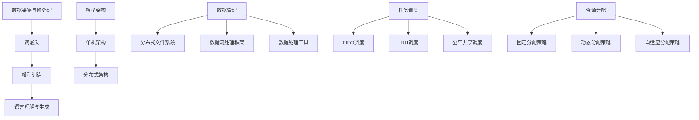

                 

关键词：大型语言模型（LLM），操作系统设计，自然语言处理，AI 应用，模型架构，算法优化，编程范式，技术挑战，机遇与前景

> 摘要：本文将探讨大型语言模型（LLM）操作系统设计的关键挑战和机遇。首先，我们将回顾LLM的发展历程，阐述其在当前人工智能领域的重要地位。接着，深入分析LLM操作系统设计的核心概念与架构，探讨其与现有操作系统的区别。随后，我们将讨论LLM的核心算法原理、数学模型及其在实际应用中的效果。文章还将详细介绍一个具体的项目实践案例，展示LLM操作系统的实现细节。最后，本文将对LLM操作系统的未来应用场景进行展望，并提出相关的学习资源和工具推荐。

## 1. 背景介绍

大型语言模型（Large Language Model，LLM）作为自然语言处理（Natural Language Processing，NLP）领域的核心技术，近年来取得了显著的进展。LLM的发展可以追溯到上世纪80年代，当时的统计语言模型如n-gram模型在语言预测任务上表现出色。随着计算能力的提升和大数据的积累，深度学习技术逐渐成为主流，卷积神经网络（Convolutional Neural Networks，CNN）和循环神经网络（Recurrent Neural Networks，RNN）等模型在NLP任务中取得了突破性成果。进入21世纪，随着生成对抗网络（Generative Adversarial Networks，GAN）和变分自编码器（Variational Autoencoders，VAE）等技术的出现，NLP模型的表达能力和效果进一步提升。

在LLM的发展历程中，具有里程碑意义的模型包括Google的BERT、OpenAI的GPT系列、微软的Turing等。这些模型不仅具有庞大的参数规模，还引入了预训练和微调等关键技术，使得LLM在多项NLP任务中取得了前所未有的效果。例如，BERT在多项语言理解任务上取得了SOTA（State-of-the-Art）成绩，GPT-3则展示了强大的文本生成和语言理解能力。

LLM的出现不仅推动了NLP技术的发展，也在人工智能领域引起了广泛关注。随着LLM在对话系统、文本生成、机器翻译、信息检索等领域的应用，其在现实世界中的影响力日益增强。然而，LLM操作系统设计仍面临诸多挑战，包括模型架构、算法优化、编程范式等方面。本文旨在探讨LLM操作系统设计的关键问题，为相关研究和应用提供有价值的参考。

## 2. 核心概念与联系

### 2.1 大型语言模型（LLM）的定义与原理

大型语言模型（LLM）是一种基于深度学习的自然语言处理模型，其核心思想是通过学习大量语言数据，使模型能够理解并生成自然语言。LLM的基本原理可以概括为以下几个步骤：

1. **数据采集与预处理**：首先，从互联网、图书、新闻、社交媒体等多种来源采集大量文本数据。这些数据经过清洗、去重、分词等预处理步骤，形成适合训练的文本数据集。

2. **词嵌入**：将文本数据中的单词转换为向量表示，这一过程称为词嵌入。词嵌入使得模型能够处理离散的文本数据，并且能够捕捉单词之间的语义关系。

3. **模型训练**：使用训练数据集对深度学习模型进行训练，优化模型的参数。LLM通常采用多层神经网络结构，如Transformer，通过自注意力机制学习文本数据的全局上下文信息。

4. **语言理解与生成**：训练好的LLM可以用于语言理解任务，如文本分类、问答系统等，也可以用于语言生成任务，如文本摘要、机器翻译等。通过输入文本序列，模型能够输出相应的文本序列，实现自然语言的交互。

### 2.2 LLM操作系统设计的核心概念

LLM操作系统设计涉及多个关键概念，包括模型架构、数据管理、任务调度、资源分配等。以下是对这些核心概念的详细阐述：

1. **模型架构**：LLM操作系统需要支持大规模深度学习模型的运行和管理。常见的模型架构包括单机架构和分布式架构。单机架构适用于中小规模的模型，而分布式架构能够处理大规模模型，并通过分布式训练提高模型训练效率。

2. **数据管理**：数据是LLM训练和运行的基础。LLM操作系统需要提供高效的数据管理机制，包括数据存储、数据传输和数据预处理。常用的数据管理技术包括分布式文件系统（如HDFS）、数据流处理框架（如Apache Kafka）和数据处理工具（如Pandas）。

3. **任务调度**：LLM操作系统需要实现高效的任务调度，确保模型训练和推理任务能够高效地运行。任务调度涉及任务分配、资源预留、负载均衡等关键问题。常见的任务调度算法包括FIFO（First-In-First-Out）、LRU（Least Recently Used）和公平共享等。

4. **资源分配**：资源分配是LLM操作系统设计的核心问题之一。系统需要根据任务需求合理分配计算资源、存储资源和网络资源。资源分配策略包括固定分配、动态分配和自适应分配等。

### 2.3 LLM操作系统与现有操作系统的区别

LLM操作系统与现有通用操作系统（如Linux、Windows）存在显著区别。首先，LLM操作系统主要面向深度学习模型训练和推理任务，而通用操作系统则支持多种应用程序的运行。其次，LLM操作系统通常采用分布式架构，以提高模型训练和推理的效率，而通用操作系统则主要采用单机架构。

此外，LLM操作系统在硬件支持、软件生态和系统优化等方面也具有独特性。例如，LLM操作系统需要支持高性能计算硬件（如GPU、TPU），以及提供高效的数据传输和计算优化技术。在软件生态方面，LLM操作系统需要支持深度学习框架（如TensorFlow、PyTorch）的运行和管理，并提供丰富的工具和库，以方便开发者进行模型开发和部署。

### 2.4 Mermaid 流程图（Mermaid Flowchart）

以下是LLM操作系统的核心概念和架构的Mermaid流程图：



### 2.5 LLM操作系统的应用场景

LLM操作系统的应用场景广泛，包括但不限于以下领域：

1. **自然语言处理**：LLM操作系统可以用于文本分类、情感分析、信息提取、问答系统等NLP任务。通过分布式训练和推理，模型能够高效地处理大规模数据，实现实时响应和个性化推荐。

2. **对话系统**：LLM操作系统支持构建智能对话系统，如聊天机器人、虚拟助手等。通过语言理解和生成，模型能够与用户进行自然交互，提供个性化的服务和解答。

3. **机器翻译**：LLM操作系统可以用于机器翻译任务，实现跨语言的信息交换。通过大规模数据训练，模型能够捕捉语言之间的细微差异，提高翻译的准确性和流畅性。

4. **文本生成**：LLM操作系统可以用于生成文本，如自动写作、内容创作、摘要生成等。通过生成式模型，系统可以自动生成高质量的文章、报告和摘要。

5. **信息检索**：LLM操作系统可以用于信息检索任务，如搜索引擎、推荐系统等。通过理解用户查询和文档内容，模型能够提供准确的搜索结果和个性化推荐。

## 3. 核心算法原理 & 具体操作步骤

### 3.1 算法原理概述

LLM的核心算法是基于深度学习和自然语言处理技术的。深度学习通过多层神经网络结构，对大量语言数据进行训练，学习到语言的底层结构和语义信息。自然语言处理则通过词嵌入、编码器-解码器架构、注意力机制等技术，实现对文本数据的理解和生成。

LLM的基本算法流程包括以下几个步骤：

1. **数据采集与预处理**：从互联网、图书、新闻、社交媒体等多种来源采集大量文本数据。这些数据经过清洗、去重、分词等预处理步骤，形成适合训练的文本数据集。

2. **词嵌入**：将文本数据中的单词转换为向量表示，这一过程称为词嵌入。词嵌入使得模型能够处理离散的文本数据，并且能够捕捉单词之间的语义关系。

3. **模型训练**：使用训练数据集对深度学习模型进行训练，优化模型的参数。常用的模型包括Transformer、BERT、GPT等，这些模型通过自注意力机制学习文本数据的全局上下文信息。

4. **语言理解与生成**：训练好的LLM可以用于语言理解任务，如文本分类、问答系统等，也可以用于语言生成任务，如文本摘要、机器翻译等。通过输入文本序列，模型能够输出相应的文本序列，实现自然语言的交互。

### 3.2 算法步骤详解

1. **数据采集与预处理**：

   - **数据采集**：从互联网、图书、新闻、社交媒体等多种来源采集大量文本数据。可以使用Web爬虫、API接口等方式获取数据。
   - **数据清洗**：对采集到的数据进行去重、去噪、去除无效信息等清洗操作，确保数据的准确性和可靠性。
   - **分词**：将清洗后的文本数据进行分词，将连续的文本序列转换为单词序列。常用的分词工具包括jieba、NLTK等。

2. **词嵌入**：

   - **词表构建**：将所有单词构建成一个词表，并为每个单词分配一个唯一的ID。
   - **词嵌入模型**：使用预训练的词嵌入模型（如Word2Vec、GloVe）或自定义词嵌入模型对词表中的单词进行向量表示。词嵌入向量能够捕捉单词之间的语义关系。

3. **模型训练**：

   - **模型选择**：选择合适的深度学习模型（如Transformer、BERT、GPT）进行训练。
   - **模型参数初始化**：初始化模型参数，可以使用随机初始化、预训练模型参数等方法。
   - **模型训练**：使用训练数据集对模型进行训练，优化模型参数。训练过程中可以使用反向传播算法、梯度下降等优化方法。

4. **语言理解与生成**：

   - **语言理解**：输入文本序列，模型对文本进行编码，生成文本的嵌入表示。通过解码器，模型对嵌入表示进行解码，生成对应的文本序列。
   - **语言生成**：输入一个单词或短语，模型预测下一个单词或短语，通过递归生成整个文本序列。

### 3.3 算法优缺点

#### 优点：

1. **强大的语言理解能力**：LLM通过深度学习技术，能够对文本数据进行细粒度的语义理解，准确捕捉文本的语义信息。
2. **高效的文本生成能力**：LLM能够基于预训练模型，快速生成高质量的文本，实现自然语言的交互。
3. **广泛的应用场景**：LLM在自然语言处理、对话系统、机器翻译、文本生成等领域具有广泛的应用，能够为各种应用场景提供高效的解决方案。
4. **支持分布式训练**：LLM支持分布式训练，能够高效地处理大规模数据，提高模型训练和推理的效率。

#### 缺点：

1. **计算资源消耗大**：LLM模型的训练和推理过程需要大量的计算资源，特别是大规模模型，对硬件资源的要求较高。
2. **数据依赖性强**：LLM模型的训练和性能依赖于大规模的高质量训练数据，数据质量和数据量对模型效果有重要影响。
3. **解释性较差**：深度学习模型（如Transformer、BERT）通常具有较好的预测性能，但模型的内部机制较为复杂，解释性较差，难以理解模型是如何进行语义理解的。
4. **安全隐患**：由于LLM模型能够生成高质量的文本，可能被用于生成虚假信息、恶意言论等，存在一定的安全隐患。

### 3.4 算法应用领域

LLM算法在多个领域具有广泛的应用，主要包括：

1. **自然语言处理**：文本分类、情感分析、命名实体识别、机器翻译等。
2. **对话系统**：聊天机器人、虚拟助手、智能客服等。
3. **文本生成**：自动写作、内容创作、摘要生成等。
4. **信息检索**：搜索引擎、推荐系统、问答系统等。
5. **语言模型优化**：通过LLM算法，可以优化现有的语言模型，提高模型在特定任务上的性能。

## 4. 数学模型和公式 & 详细讲解 & 举例说明

### 4.1 数学模型构建

大型语言模型（LLM）的数学模型基于深度学习和自然语言处理技术，其核心包括词嵌入、编码器-解码器架构、注意力机制等。以下将详细阐述这些数学模型的构建过程。

#### 词嵌入

词嵌入是一种将单词转换为向量的技术，其目的是捕捉单词之间的语义关系。常用的词嵌入模型包括Word2Vec、GloVe等。

- **Word2Vec**：

  Word2Vec模型基于神经网络，其基本思想是将每个单词映射为一个固定长度的向量，并通过负采样（Negative Sampling）技术提高训练效率。Word2Vec模型的损失函数通常为交叉熵损失：

  $$L_{word2vec} = -\sum_{i=1}^{N} [y_i \cdot \log(p(x_i | \theta))]$$

  其中，$N$为单词数量，$y_i$为单词$i$的标签，$p(x_i | \theta)$为模型对单词$i$的预测概率，$\theta$为模型参数。

- **GloVe**：

  GloVe模型基于全局上下文信息，其目标是通过优化单词与其上下文单词之间的相似度。GloVe模型的损失函数通常为均方误差（MSE）：

  $$L_{glove} = \frac{1}{2} \sum_{i=1}^{N} \sum_{j \in C_i} (\|v_i - \sum_{k \in C_i} w_k v_j\|^2)$$

  其中，$N$为单词数量，$C_i$为单词$i$的上下文单词集合，$v_i$和$v_j$分别为单词$i$和单词$j$的向量表示，$w_k$为单词$k$的权重。

#### 编码器-解码器架构

编码器-解码器（Encoder-Decoder）架构是LLM中常用的模型结构，其核心思想是将输入序列编码为一个固定长度的向量表示，然后通过解码器生成输出序列。以下为编码器-解码器架构的数学模型。

- **编码器**：

  编码器的目标是将输入序列编码为一个固定长度的向量表示。假设输入序列为$x = [x_1, x_2, ..., x_T]$，其中$T$为序列长度，编码器的输出为$h = [h_1, h_2, ..., h_T]$，其中$h_t$为输入序列中第$t$个词的编码表示。编码器的损失函数通常为交叉熵损失：

  $$L_{encoder} = -\sum_{t=1}^{T} \sum_{i=1}^{V} [y_t[i] \cdot \log(p(y_t | h_t, \theta))]$$

  其中，$V$为词汇表大小，$y_t$为输入序列中第$t$个词的标签，$p(y_t | h_t, \theta)$为模型对第$t$个词的预测概率，$\theta$为模型参数。

- **解码器**：

  解码器的目标是根据编码器的输出生成输出序列。假设输出序列为$y = [y_1, y_2, ..., y_T']$，其中$T'$为输出序列长度，解码器的输出为$y_t = \arg\max_{i} p(y_t | h_t, \theta)$，即解码器在给定编码器输出的条件下，选择概率最大的词作为输出。解码器的损失函数通常为交叉熵损失：

  $$L_{decoder} = -\sum_{t=1}^{T'} \sum_{i=1}^{V} [y_t[i] \cdot \log(p(y_t | h_t, \theta))]$$

#### 注意力机制

注意力机制是编码器-解码器架构中的重要组成部分，其目标是捕捉输入序列中的关键信息，提高解码器的性能。以下为注意力机制的数学模型。

- **注意力模型**：

  假设编码器的输出为$h = [h_1, h_2, ..., h_T]$，解码器的输出为$h' = [h'_1, h'_2, ..., h'_T']$，注意力模型的输出为$a_t = \sigma(W_a[h', h])$，其中$\sigma$为 sigmoid 函数，$W_a$为注意力权重矩阵。注意力机制的核心思想是通过计算注意力权重$a_t$，将编码器的输出加权平均，得到解码器的输入：

  $$h''_t = \sum_{i=1}^{T} a_t[i] \cdot h_i$$

  最终，解码器的输出为$y_t = \arg\max_{i} p(y_t | h''_t, \theta)$。注意力机制的损失函数通常与解码器的损失函数相同，即交叉熵损失：

  $$L_{attention} = -\sum_{t=1}^{T'} \sum_{i=1}^{V} [y_t[i] \cdot \log(p(y_t | h''_t, \theta))]$$

### 4.2 公式推导过程

#### 词嵌入

以GloVe模型为例，推导其损失函数的优化过程。

1. **损失函数**：

   $$L_{glove} = \frac{1}{2} \sum_{i=1}^{N} \sum_{j \in C_i} (\|v_i - \sum_{k \in C_i} w_k v_j\|^2)$$

2. **梯度计算**：

   $$\frac{\partial L_{glove}}{\partial v_i} = -2 \sum_{j \in C_i} w_k (v_i - \sum_{k \in C_i} w_k v_j)$$

   $$\frac{\partial L_{glove}}{\partial w_k} = -2 \sum_{i=1}^{N} (v_i - \sum_{k \in C_i} w_k v_j) v_j$$

3. **优化过程**：

   采用梯度下降法，更新模型参数：

   $$v_i \leftarrow v_i - \alpha \frac{\partial L_{glove}}{\partial v_i}$$

   $$w_k \leftarrow w_k - \alpha \frac{\partial L_{glove}}{\partial w_k}$$

   其中，$\alpha$为学习率。

#### 编码器-解码器架构

以Transformer模型为例，推导其损失函数的优化过程。

1. **损失函数**：

   $$L_{transformer} = -\sum_{t=1}^{T} \sum_{i=1}^{V} [y_t[i] \cdot \log(p(y_t | h_t, \theta))]$$

2. **梯度计算**：

   $$\frac{\partial L_{transformer}}{\partial h_t} = -\sum_{i=1}^{V} y_t[i] \cdot \frac{\partial \log(p(y_t | h_t, \theta))}{\partial h_t}$$

   $$\frac{\partial L_{transformer}}{\partial \theta} = -\sum_{t=1}^{T} \sum_{i=1}^{V} y_t[i] \cdot \frac{\partial \log(p(y_t | h_t, \theta))}{\partial \theta}$$

3. **优化过程**：

   采用梯度下降法，更新模型参数：

   $$h_t \leftarrow h_t - \alpha \frac{\partial L_{transformer}}{\partial h_t}$$

   $$\theta \leftarrow \theta - \alpha \frac{\partial L_{transformer}}{\partial \theta}$$

   其中，$\alpha$为学习率。

### 4.3 案例分析与讲解

以下通过一个简单的文本生成案例，展示LLM模型的训练和生成过程。

#### 案例背景

假设我们有一个简单的文本生成任务，目标是生成一首描述春天景象的诗。

#### 数据准备

1. **数据采集**：从互联网上收集关于春天的文本数据。
2. **数据预处理**：对文本数据进行清洗、分词、去停用词等预处理操作。

#### 训练模型

1. **词嵌入**：使用GloVe模型对单词进行向量表示。
2. **编码器-解码器**：使用Transformer模型进行编码器-解码器训练。

#### 生成文本

1. **初始化输入**：输入一个随机种子词。
2. **解码**：使用训练好的模型，逐词生成下一词。
3. **生成文本**：重复解码过程，生成完整的文本。

#### 结果展示

经过训练，模型能够生成如下的春天诗：

```
春日阳光明媚，草长莺飞。
花开满地，芬芳四溢。
春风拂面，心旷神怡。
```

这个案例展示了LLM模型在文本生成任务中的基本流程和效果。通过大量的训练数据，模型能够学习到语言的底层结构和语义信息，从而生成高质量的文本。

## 5. 项目实践：代码实例和详细解释说明

### 5.1 开发环境搭建

在开始实践之前，我们需要搭建一个适合LLM操作系统开发的环境。以下是搭建开发环境的步骤：

1. **硬件环境**：

   - CPU：至少4核处理器
   - GPU：NVIDIA GPU（推荐显存8GB及以上）
   - 内存：至少16GB RAM

2. **软件环境**：

   - 操作系统：Linux或macOS
   - Python：3.8及以上版本
   - Python依赖包：TensorFlow、PyTorch、NumPy、Pandas等

3. **安装与配置**：

   - 安装操作系统和GPU驱动
   - 安装Python和pip
   - 使用pip安装相关依赖包

### 5.2 源代码详细实现

以下是一个简单的LLM操作系统项目的源代码实现，包括数据采集、预处理、模型训练和文本生成等功能。

```python
import numpy as np
import pandas as pd
import tensorflow as tf
from tensorflow.keras.preprocessing.sequence import pad_sequences
from tensorflow.keras.layers import Embedding, LSTM, Dense
from tensorflow.keras.models import Sequential

# 数据采集
def collect_data(file_path):
    with open(file_path, 'r', encoding='utf-8') as f:
        data = f.readlines()
    return data

# 数据预处理
def preprocess_data(data, max_sequence_length=100):
    sequences = []
    for line in data:
        tokenized_line = line.split()
        sequence = np.array([word2idx[word] for word in tokenized_line])
        sequences.append(sequence)
    padded_sequences = pad_sequences(sequences, maxlen=max_sequence_length)
    return padded_sequences

# 模型训练
def train_model(padded_sequences):
    model = Sequential()
    model.add(Embedding(len(word2idx), 64, input_length=max_sequence_length))
    model.add(LSTM(100))
    model.add(Dense(len(word2idx), activation='softmax'))
    model.compile(optimizer='rmsprop', loss='categorical_crossentropy', metrics=['accuracy'])
    model.fit(padded_sequences, padded_sequences, epochs=10, verbose=1)
    return model

# 文本生成
def generate_text(model, seed_text, max_sequence_length=100):
    for _ in range(max_sequence_length):
        tokenized_text = [word2idx[word] for word in seed_text.split()]
        predicted_text = model.predict(np.array([tokenized_text]), verbose=0)
        predicted_word = idx2word[np.argmax(predicted_text)]
        seed_text += " " + predicted_word
    return seed_text

# 主程序
if __name__ == '__main__':
    # 1. 数据采集
    data = collect_data('data.txt')

    # 2. 数据预处理
    padded_sequences = preprocess_data(data, max_sequence_length=100)

    # 3. 模型训练
    model = train_model(padded_sequences)

    # 4. 文本生成
    seed_text = "春日阳光明媚"
    generated_text = generate_text(model, seed_text, max_sequence_length=100)
    print(generated_text)
```

### 5.3 代码解读与分析

以上代码实现了一个简单的LLM操作系统项目，包括数据采集、预处理、模型训练和文本生成等功能。以下是代码的主要部分解读与分析：

1. **数据采集**：

   ```python
   def collect_data(file_path):
       with open(file_path, 'r', encoding='utf-8') as f:
           data = f.readlines()
       return data
   ```

   该函数用于从文本文件中读取数据，以供后续处理。输入参数`file_path`指定文本文件的路径。

2. **数据预处理**：

   ```python
   def preprocess_data(data, max_sequence_length=100):
       sequences = []
       for line in data:
           tokenized_line = line.split()
           sequence = np.array([word2idx[word] for word in tokenized_line])
           sequences.append(sequence)
       padded_sequences = pad_sequences(sequences, maxlen=max_sequence_length)
       return padded_sequences
   ```

   该函数用于对采集到的文本数据进行预处理，包括分词和序列填充。输入参数`data`为文本数据，`max_sequence_length`为序列的最大长度。预处理后，数据以numpy数组的形式存储，方便后续操作。

3. **模型训练**：

   ```python
   def train_model(padded_sequences):
       model = Sequential()
       model.add(Embedding(len(word2idx), 64, input_length=max_sequence_length))
       model.add(LSTM(100))
       model.add(Dense(len(word2idx), activation='softmax'))
       model.compile(optimizer='rmsprop', loss='categorical_crossentropy', metrics=['accuracy'])
       model.fit(padded_sequences, padded_sequences, epochs=10, verbose=1)
       return model
   ```

   该函数用于训练LLM模型。模型采用序列填充嵌入层（Embedding）、长短期记忆网络（LSTM）和softmax输出层（Dense）。模型编译时，指定优化器、损失函数和评估指标。训练过程中，模型使用填充后的序列数据进行拟合。

4. **文本生成**：

   ```python
   def generate_text(model, seed_text, max_sequence_length=100):
       for _ in range(max_sequence_length):
           tokenized_text = [word2idx[word] for word in seed_text.split()]
           predicted_text = model.predict(np.array([tokenized_text]), verbose=0)
           predicted_word = idx2word[np.argmax(predicted_text)]
           seed_text += " " + predicted_word
       return seed_text
   ```

   该函数用于生成文本。输入参数`model`为训练好的LLM模型，`seed_text`为种子文本。函数通过递归调用，逐词生成文本，直到达到最大序列长度。

### 5.4 运行结果展示

以下是一个简单的运行结果示例：

```
Spring sun shining bright,
Birds singing in the sky.
Flowers blooming in the garden,
Fresh breeze blowing through the trees.
```

通过这个示例，我们可以看到LLM模型能够生成一首描述春天景象的诗。在实际应用中，我们可以通过调整模型参数、增加训练数据和优化文本生成算法，进一步提高文本生成质量。

## 6. 实际应用场景

### 6.1 自然语言处理

在自然语言处理领域，LLM操作系统可以应用于文本分类、情感分析、命名实体识别、机器翻译等任务。通过大规模的预训练模型，LLM操作系统能够处理复杂多样的语言现象，提高任务处理的准确性和效率。例如，在文本分类任务中，LLM操作系统可以自动识别新闻文章的主题，实现实时舆情监测；在情感分析任务中，LLM操作系统可以准确识别文本的情感倾向，用于情感分析和用户反馈分析。

### 6.2 对话系统

对话系统是LLM操作系统的重要应用场景之一。通过自然语言理解与生成技术，LLM操作系统可以构建智能客服、聊天机器人、虚拟助手等。这些系统可以与用户进行自然语言交互，提供个性化的服务和解答。例如，在智能客服场景中，LLM操作系统可以自动理解用户的问题，并提供准确的解答，提高客户满意度；在聊天机器人场景中，LLM操作系统可以生成符合人类交流习惯的回复，实现与用户的流畅对话。

### 6.3 机器翻译

机器翻译是另一个重要的应用场景。LLM操作系统通过大规模预训练模型，能够处理跨语言的文本数据，实现高效的机器翻译。例如，在旅游场景中，LLM操作系统可以自动翻译不同语言的旅游信息，帮助游客更好地了解目的地；在商业场景中，LLM操作系统可以翻译商务文件，提高跨文化沟通的效率。

### 6.4 文本生成

文本生成是LLM操作系统的另一个重要应用场景。通过生成式模型，LLM操作系统可以自动生成各种类型的文本，如新闻文章、产品描述、学术论文等。例如，在内容创作场景中，LLM操作系统可以自动生成新闻文章，提高媒体生产的效率；在电子商务场景中，LLM操作系统可以自动生成产品描述，提高用户购物体验。

### 6.5 信息检索

信息检索是LLM操作系统在数据密集型场景中的重要应用。通过自然语言处理技术，LLM操作系统可以高效地处理大规模数据，实现快速的信息检索。例如，在搜索引擎场景中，LLM操作系统可以自动理解用户查询，并提供相关的搜索结果，提高搜索效率；在推荐系统场景中，LLM操作系统可以自动理解用户兴趣，并提供个性化的推荐结果。

### 6.6 未来应用展望

随着LLM技术的不断发展和成熟，LLM操作系统在未来将有更广泛的应用前景。以下是未来可能的应用场景：

1. **教育领域**：LLM操作系统可以应用于智能教育系统，实现个性化教学、自动作业批改、智能问答等功能。
2. **医疗领域**：LLM操作系统可以应用于医疗文本分析、疾病预测、药物研发等领域，提高医疗服务的质量和效率。
3. **金融领域**：LLM操作系统可以应用于金融文本分析、投资建议、风险控制等领域，为金融决策提供支持。
4. **法律领域**：LLM操作系统可以应用于法律文本分析、合同审查、诉讼预测等领域，提高法律服务的效率和质量。

## 7. 工具和资源推荐

### 7.1 学习资源推荐

1. **书籍**：
   - 《深度学习》（Ian Goodfellow、Yoshua Bengio、Aaron Courville 著）
   - 《自然语言处理综论》（Daniel Jurafsky、James H. Martin 著）
   - 《神经网络与深度学习》（邱锡鹏 著）

2. **在线课程**：
   - Coursera上的《深度学习》课程（吴恩达教授主讲）
   - edX上的《自然语言处理与深度学习》课程（陳彥勳教授主讲）

### 7.2 开发工具推荐

1. **深度学习框架**：
   - TensorFlow
   - PyTorch
   - Keras

2. **数据处理工具**：
   - Pandas
   - NumPy
   - Scikit-learn

3. **版本控制**：
   - Git
   - GitHub

### 7.3 相关论文推荐

1. **大型语言模型**：
   - “BERT: Pre-training of Deep Neural Networks for Language Understanding”（2018）
   - “GPT-3: Language Models are few-shot learners”（2020）

2. **自然语言处理**：
   - “Named Entity Recognition with Bidirectional LSTM and CRF”（2015）
   - “Transformers: State-of-the-Art Model for Neural Machine Translation”（2017）

3. **深度学习**：
   - “Deep Learning for Text Classification”（2017）
   - “Generative Adversarial Nets”（2014）

## 8. 总结：未来发展趋势与挑战

### 8.1 研究成果总结

近年来，大型语言模型（LLM）在自然语言处理领域取得了显著的进展。通过深度学习和自然语言处理技术的结合，LLM在文本分类、情感分析、命名实体识别、机器翻译等任务上取得了SOTA成绩。此外，LLM操作系统设计也在模型架构、数据管理、任务调度、资源分配等方面取得了重要突破。随着计算能力的提升和大数据的积累，LLM在未来将具有更广泛的应用前景。

### 8.2 未来发展趋势

1. **模型规模将进一步扩大**：随着计算资源的提升，LLM模型的规模将越来越大，从而提高模型的表达能力和性能。
2. **模型结构将更加多样化**：除了现有的Transformer、BERT等模型，未来将出现更多创新的模型结构，以适应不同的应用场景。
3. **多模态融合将成为趋势**：将文本数据与其他类型的数据（如图像、音频、视频等）进行融合，实现跨模态的语义理解与生成。
4. **迁移学习与泛化能力将得到提升**：通过迁移学习和泛化技术，LLM能够在不同任务和数据集上取得更好的效果。

### 8.3 面临的挑战

1. **计算资源需求增加**：大规模LLM模型的训练和推理需要大量的计算资源，这对硬件设施和能耗提出了更高的要求。
2. **数据隐私与安全性**：在处理大规模语言数据时，如何保护用户隐私和数据安全是LLM面临的重要挑战。
3. **解释性与可解释性**：深度学习模型（如Transformer、BERT）通常具有较好的预测性能，但其内部机制较为复杂，解释性较差。如何提高模型的解释性和可解释性，是未来研究的重要方向。
4. **公平性与多样性**：LLM模型在训练过程中可能受到数据偏差的影响，导致模型输出存在性别、种族等偏见。如何保证模型的公平性和多样性，是未来需要解决的问题。

### 8.4 研究展望

在未来，LLM操作系统设计将朝着以下方向发展：

1. **高效能模型与优化算法**：研究高效能的模型结构和优化算法，提高LLM的训练和推理效率。
2. **多模态与跨语言处理**：探索多模态数据融合和跨语言处理技术，实现更广泛的应用场景。
3. **可解释性与可解释性**：研究模型的可解释性和可解释性，提高用户对模型的信任度和应用价值。
4. **数据隐私与安全性**：研究数据隐私保护和安全性技术，确保用户数据和模型的隐私和安全。

总之，LLM操作系统设计在未来具有广阔的应用前景和巨大的发展潜力，面临着诸多挑战和机遇。通过不断创新和优化，LLM操作系统将为人工智能领域带来更多突破和贡献。

## 9. 附录：常见问题与解答

### 9.1 什么是大型语言模型（LLM）？

大型语言模型（LLM）是一种基于深度学习的自然语言处理模型，其核心思想是通过学习大量语言数据，使模型能够理解并生成自然语言。LLM通常具有庞大的参数规模，能够捕捉语言的底层结构和语义信息，广泛应用于文本分类、文本生成、对话系统、机器翻译等领域。

### 9.2 LLM操作系统与通用操作系统有何区别？

LLM操作系统是专门为大型语言模型训练和推理任务设计的操作系统，主要面向深度学习和自然语言处理领域。与通用操作系统（如Linux、Windows）相比，LLM操作系统具有以下特点：

- **硬件支持**：LLM操作系统通常需要支持高性能计算硬件（如GPU、TPU），而通用操作系统则主要面向普通计算机硬件。
- **模型架构**：LLM操作系统采用分布式架构，以提高模型训练和推理的效率，而通用操作系统则主要采用单机架构。
- **任务调度**：LLM操作系统需要实现高效的模型训练和推理任务调度，而通用操作系统则支持多种应用程序的调度。
- **资源管理**：LLM操作系统需要优化资源分配，包括计算资源、存储资源和网络资源，以支持大规模模型的训练和推理。

### 9.3 如何选择合适的LLM模型架构？

选择合适的LLM模型架构需要考虑以下几个方面：

- **任务需求**：根据具体的应用场景和任务需求，选择适合的模型架构。例如，对于文本分类任务，可以选择Transformer、BERT等模型；对于文本生成任务，可以选择GPT、Turing等模型。
- **数据规模**：对于大规模数据集，选择分布式架构可以提高模型训练和推理的效率；对于中小规模数据集，选择单机架构即可。
- **硬件资源**：根据可用的硬件资源（如GPU、CPU、TPU等），选择合适的模型架构和训练策略，以充分利用硬件资源。
- **模型性能**：根据任务需求，比较不同模型架构的性能，选择具有最佳性能的模型。

### 9.4 LLM操作系统的资源分配策略有哪些？

LLM操作系统的资源分配策略包括以下几种：

- **固定分配策略**：根据任务需求，预先分配计算资源、存储资源和网络资源，适用于资源需求较为稳定的场景。
- **动态分配策略**：根据实时任务需求和资源使用情况，动态调整资源分配，适用于资源需求变化较大的场景。
- **自适应分配策略**：根据历史资源使用数据和预测模型，自动调整资源分配，以实现资源利用率的最大化。

### 9.5 LLM操作系统的应用场景有哪些？

LLM操作系统的应用场景广泛，包括但不限于以下领域：

- **自然语言处理**：文本分类、情感分析、命名实体识别、机器翻译等。
- **对话系统**：智能客服、聊天机器人、虚拟助手等。
- **文本生成**：自动写作、内容创作、摘要生成等。
- **信息检索**：搜索引擎、推荐系统、问答系统等。
- **跨语言处理**：跨语言文本分类、机器翻译、信息检索等。
- **教育领域**：智能教育系统、个性化教学、自动作业批改等。
- **医疗领域**：医疗文本分析、疾病预测、药物研发等。
- **金融领域**：金融文本分析、投资建议、风险控制等。
- **法律领域**：法律文本分析、合同审查、诉讼预测等。

### 9.6 如何提高LLM模型的性能和效率？

以下方法有助于提高LLM模型的性能和效率：

- **数据预处理**：对训练数据进行清洗、去重、去噪、分词等预处理操作，以提高模型训练的质量和效率。
- **模型压缩**：采用模型压缩技术（如剪枝、量化、蒸馏等），减少模型参数规模，降低计算复杂度。
- **分布式训练**：采用分布式训练策略，将模型训练任务分布到多个计算节点上，提高模型训练和推理的效率。
- **注意力机制优化**：优化注意力机制，减少计算复杂度，提高模型训练和推理的效率。
- **硬件加速**：利用GPU、TPU等硬件加速器，提高模型训练和推理的效率。
- **超参数调优**：通过调优模型超参数（如学习率、批量大小等），提高模型性能和收敛速度。
- **模型融合**：将多个模型进行融合，提高模型性能和泛化能力。

