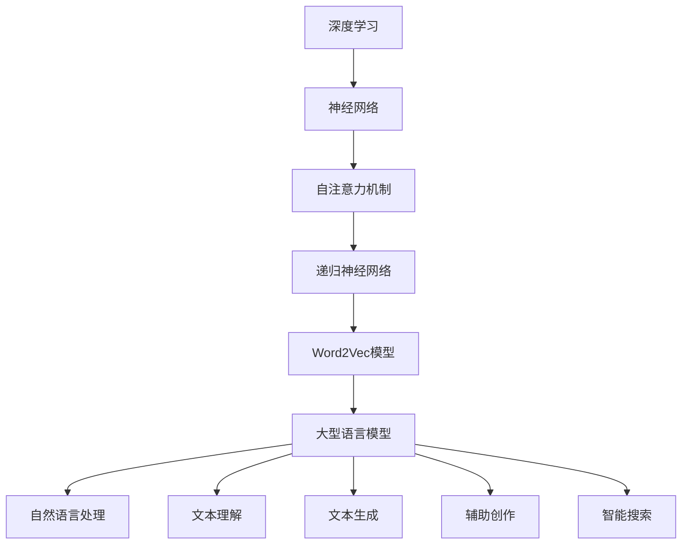

                 

关键词：大型语言模型、AI产业、生态圈、发展前景、技术趋势、应用场景

> 摘要：本文将深入探讨大型语言模型（LLM）在AI产业中的生态圈形成及其对未来发展的潜在影响。通过分析LLM的核心概念、架构、算法原理及数学模型，结合项目实践和实际应用场景，我们将揭示LLM在AI产业中的关键作用，并探讨其面临的挑战和未来发展方向。

## 1. 背景介绍

### 大型语言模型的发展历程

大型语言模型（LLM）的发展经历了从早期的基础研究到当前产业应用的几个重要阶段。最早的语言模型可以追溯到1980年代，当时的研究主要集中在统计语言模型上，如N-gram模型。这些模型通过统计词频来预测下一个词，但它们在处理复杂语言结构上存在明显不足。

随着深度学习技术的进步，特别是神经网络和递归神经网络（RNN）的出现，语言模型的性能得到了显著提升。RNN能够更好地捕捉语言的序列依赖关系，但其在处理长距离依赖问题上仍然存在挑战。为了解决这一问题，2014年，谷歌提出了Word2Vec模型，通过嵌入方法将词映射到高维空间，从而在语义上对词进行表示。

真正推动LLM发展的是2017年提出的Transformer模型。Transformer引入了自注意力机制（Self-Attention），使得模型能够自动关注输入序列中的关键信息，从而在捕捉长距离依赖关系上取得了巨大突破。这一技术的出现标志着LLM进入了一个新的时代，为自然语言处理（NLP）领域带来了革命性的变化。

近年来，随着计算资源的增加和数据量的激增，LLM的规模也在不断扩张。以OpenAI的GPT-3为例，其参数量达到了1750亿，成为目前最大的语言模型。LLM的发展不仅推动了NLP技术的进步，也催生了AI产业的新生态。

### AI产业的新格局

随着AI技术的快速发展，AI产业正逐渐形成一种新的生态圈。在这个生态圈中，不同的角色和参与者相互关联，共同推动着产业的繁荣。以下是AI产业新格局中几个关键的角色和趋势：

- **企业和机构**：企业和科研机构是AI技术的主要研发和应用主体。它们通过投资和研究，推动AI技术的创新和应用。例如，谷歌、微软、亚马逊等科技巨头在AI领域的研发投入巨大，不仅推动了技术的进步，也为其他企业提供了强大的技术支持。

- **开发者社区**：开发者社区是AI生态圈中的重要力量。他们通过开源项目和平台，将AI技术转化为实际应用。例如，TensorFlow、PyTorch等深度学习框架的开源，使得更多的开发者能够方便地使用AI技术。

- **创业公司**：创业公司是AI产业生态圈中的新兴力量。它们专注于解决特定领域的AI问题，通过创新和技术突破，推动产业的快速发展。例如，许多AI初创公司致力于在医疗、金融、教育等领域应用AI技术，为传统行业带来新的变革。

- **政府政策**：政府政策对AI产业的发展具有重要影响。各国政府纷纷出台支持AI发展的政策，包括资金支持、人才培养、数据开放等。这些政策为AI产业的健康发展提供了有力保障。

- **社会影响**：AI技术的发展不仅影响了产业，也对社会的各个方面产生了深远影响。例如，在医疗领域，AI技术能够帮助医生进行疾病诊断，提高医疗效率；在交通领域，自动驾驶技术有望改善交通安全，提高出行效率。

### 当前AI产业的发展现状

当前，AI产业呈现出以下几个显著特点：

- **市场规模不断扩大**：根据市场研究机构的预测，全球AI市场规模将在未来几年内持续增长，到2025年有望达到数万亿美元。

- **技术创新日新月异**：AI技术的快速发展，尤其是LLM技术的突破，推动了NLP、计算机视觉、强化学习等领域的进步。

- **应用领域广泛**：AI技术已经在医疗、金融、教育、交通、制造等多个领域得到广泛应用，并带来了显著的商业价值和社会效益。

- **竞争态势激烈**：随着AI技术的普及，越来越多的企业和个人进入AI产业，竞争态势日益激烈。

## 2. 核心概念与联系

### 大型语言模型（LLM）的定义与作用

#### 大型语言模型（LLM）的定义

大型语言模型（LLM，Large Language Model）是指具有数亿至数千亿参数规模的深度神经网络模型，用于对自然语言文本进行理解和生成。这些模型通过大量的文本数据进行训练，学习到语言中的语法规则、语义关系和上下文信息，从而实现文本处理的高效性和准确性。

#### 大型语言模型（LLM）的作用

- **文本理解**：LLM能够对输入的文本进行深度理解，提取关键信息，生成摘要，进行情感分析等任务。
- **文本生成**：LLM能够根据给定的文本或提示，生成连贯、有逻辑的文本，用于写作辅助、问答系统、聊天机器人等应用。
- **辅助创作**：LLM能够帮助用户进行文学创作、编程代码生成、翻译等任务，提升创作效率和准确性。
- **智能搜索**：LLM能够对大量文本数据进行分析和索引，提供高效、准确的智能搜索服务。

### AI生态圈中的角色与关系

在AI生态圈中，LLM与其他技术和角色之间存在着密切的联系和互动。

- **基础技术**：LLM作为AI技术的一个重要分支，与深度学习、神经网络、自注意力机制等基础技术紧密相关。这些基础技术的进步推动了LLM的发展。
- **应用平台**：LLM的应用离不开各种AI应用平台，如TensorFlow、PyTorch等。这些平台为开发者提供了方便的接口和工具，使得LLM的应用变得更加广泛。
- **企业主体**：企业在AI生态圈中扮演着重要角色。它们通过研发和应用LLM技术，推动AI技术的发展和商业化。
- **开发者社区**：开发者社区是AI生态圈中的创新力量。他们通过开源项目和平台，将LLM技术应用到各种实际场景中，为AI产业的发展贡献力量。
- **科研机构**：科研机构在AI技术的发展中发挥着关键作用。它们通过研究和新技术的探索，为AI产业提供了源源不断的创新动力。

### 大型语言模型（LLM）与相关技术的联系

#### 自注意力机制（Self-Attention）

自注意力机制是Transformer模型的核心组件，它通过计算输入序列中每个词与所有词的关联度，为每个词分配不同的权重，从而实现捕捉长距离依赖关系。自注意力机制在LLM中起到了至关重要的作用，使得模型能够更好地理解复杂语言结构。

#### 递归神经网络（RNN）

递归神经网络（RNN）是早期用于处理序列数据的神经网络结构，它在处理短距离依赖关系上具有优势。尽管RNN在处理长距离依赖问题上存在局限性，但其某些原理和结构仍然对LLM的发展有所启发。

#### Word2Vec模型

Word2Vec模型是一种早期的词嵌入方法，通过将词映射到高维空间，实现了词的语义表示。Word2Vec模型为后续的LLM发展奠定了基础，提供了有效的词表示方法。

### 核心概念与联系总结

综上所述，大型语言模型（LLM）是AI生态圈中的一个关键组成部分，其发展与深度学习、自注意力机制、递归神经网络、Word2Vec模型等基础技术和方法密切相关。LLM不仅推动了自然语言处理（NLP）技术的进步，也为AI产业的发展和应用提供了强大的支持。通过分析LLM的核心概念和联系，我们可以更好地理解其在AI生态圈中的地位和作用。

### Mermaid 流程图

以下是一个展示大型语言模型（LLM）与相关技术之间关系的Mermaid流程图：



### 大型语言模型（LLM）与相关技术的详细关系

在深入探讨大型语言模型（LLM）与相关技术之间的详细关系之前，我们需要先了解这些技术的基本概念及其在AI领域的应用。

#### 深度学习（Deep Learning）

深度学习是机器学习的一个重要分支，它通过构建具有多个隐含层的神经网络模型，对数据进行自动特征学习和模式识别。深度学习在计算机视觉、自然语言处理、语音识别等领域取得了显著成果，为AI的发展提供了强大的技术支持。

#### 神经网络（Neural Network）

神经网络是深度学习的基础结构，由大量相互连接的神经元组成，通过学习输入数据和输出数据之间的映射关系，实现复杂函数的建模。神经网络包括输入层、隐含层和输出层，不同层次的神经元通过加权连接实现信息的传递和处理。

#### 自注意力机制（Self-Attention）

自注意力机制是一种在Transformer模型中广泛使用的注意力机制，它通过计算输入序列中每个词与所有词的关联度，为每个词分配不同的权重。自注意力机制在处理长距离依赖关系上具有显著优势，使得模型能够更好地理解复杂语言结构。

#### 递归神经网络（Recurrent Neural Network, RNN）

递归神经网络是一种能够处理序列数据的神经网络结构，其通过循环连接实现信息的反向传播和更新。RNN在处理短距离依赖关系上具有优势，但在处理长距离依赖问题上存在梯度消失或爆炸等问题。

#### Word2Vec模型

Word2Vec模型是一种早期的词嵌入方法，它通过将词映射到高维空间，实现了词的语义表示。Word2Vec模型通过计算词的共现关系和词向量的相似度，实现了对词的语义理解和表示。

#### 大型语言模型（Large Language Model, LLM）

大型语言模型（LLM）是指具有数亿至数千亿参数规模的深度神经网络模型，用于对自然语言文本进行理解和生成。LLM通过大量的文本数据进行训练，学习到语言中的语法规则、语义关系和上下文信息，从而实现文本处理的高效性和准确性。

#### 自然语言处理（Natural Language Processing, NLP）

自然语言处理是人工智能领域的一个重要分支，它旨在使计算机能够理解和生成人类自然语言。NLP包括文本预处理、词嵌入、语法分析、语义理解、文本生成等任务，广泛应用于信息检索、机器翻译、智能助手等领域。

#### 文本理解（Text Understanding）

文本理解是指对输入的文本进行深度理解，提取关键信息，生成摘要，进行情感分析等任务。文本理解是LLM的重要应用之一，它使得计算机能够更好地理解人类语言，实现智能交互。

#### 文本生成（Text Generation）

文本生成是指根据给定的文本或提示，生成连贯、有逻辑的文本。文本生成是LLM的另一个重要应用，它被广泛应用于写作辅助、问答系统、聊天机器人等领域。

#### 辅助创作（Assisted Creation）

辅助创作是指LLM帮助用户进行文学创作、编程代码生成、翻译等任务，提升创作效率和准确性。辅助创作是LLM在创意领域的应用，它为用户提供了强大的创作工具。

#### 智能搜索（Intelligent Search）

智能搜索是指LLM对大量文本数据进行分析和索引，提供高效、准确的智能搜索服务。智能搜索是LLM在信息检索领域的应用，它使得计算机能够更好地理解和处理用户查询。

### 关系总结

通过对上述技术的基本概念和应用场景的了解，我们可以得出以下关于大型语言模型（LLM）与相关技术之间关系的总结：

- **深度学习**为LLM提供了强大的理论基础和计算基础，使得LLM能够通过大规模的神经网络进行高效的语言处理。
- **神经网络**作为深度学习的基础结构，是构建LLM的核心组件，通过多层神经网络的学习和优化，实现了对语言复杂结构的理解和生成。
- **自注意力机制**是LLM中实现文本理解和生成的重要技术，它通过计算输入序列中每个词与所有词的关联度，提高了模型对长距离依赖关系的捕捉能力。
- **递归神经网络**在处理短距离依赖关系上具有一定的优势，但其处理长距离依赖问题的局限性促使了自注意力机制的出现和LLM的发展。
- **Word2Vec模型**为LLM提供了有效的词嵌入方法，通过将词映射到高维空间，实现了词的语义表示，为LLM在文本处理中的应用奠定了基础。
- **自然语言处理**是LLM的核心应用领域，通过文本理解、文本生成、辅助创作和智能搜索等任务，LLM实现了对自然语言的高效处理和智能交互。
- **文本理解**和**文本生成**是LLM的两个重要应用方向，它们在智能助手、写作辅助、问答系统等领域发挥了关键作用。
- **辅助创作**和**智能搜索**是LLM在创意领域和信息检索领域的应用，它们为用户提供了强大的工具和服务。

综上所述，大型语言模型（LLM）与相关技术之间存在紧密的联系和相互促进的关系。LLM作为AI生态圈中的重要组成部分，不仅依赖于深度学习、神经网络、自注意力机制、递归神经网络、Word2Vec模型等基础技术，同时也推动了自然语言处理、文本理解、文本生成、辅助创作和智能搜索等领域的发展。通过分析LLM与相关技术的详细关系，我们可以更好地理解其在AI生态圈中的地位和作用。

### 3. 核心算法原理 & 具体操作步骤

#### 3.1 算法原理概述

大型语言模型（LLM）的核心算法是基于Transformer模型的自注意力机制。Transformer模型通过自注意力机制，使得模型能够自动关注输入序列中的关键信息，从而在捕捉长距离依赖关系上取得了显著突破。以下是Transformer模型的基本原理：

1. **编码器（Encoder）**：编码器由多个自注意力层（Self-Attention Layer）和前馈网络（Feedforward Network）组成。自注意力层通过计算输入序列中每个词与所有词的关联度，为每个词分配不同的权重，从而捕捉长距离依赖关系。前馈网络则用于对每个词进行非线性变换，增强模型的表示能力。

2. **解码器（Decoder）**：解码器由多个自注意力层（Self-Attention Layer）、掩码自注意力层（Masked Self-Attention Layer）和前馈网络（Feedforward Network）组成。自注意力层和掩码自注意力层用于解码过程中的上下文信息捕捉，前馈网络则用于增强表示能力。

3. **多头自注意力（Multi-Head Self-Attention）**：多头自注意力机制通过多个独立的自注意力层同时处理输入序列，从而提高了模型的捕捉能力。每个头关注不同的信息，共同生成最终的输出。

4. **位置编码（Positional Encoding）**：由于Transformer模型没有循环结构，无法直接处理序列中的位置信息。因此，通过位置编码为每个词添加位置信息，使得模型能够理解词在序列中的相对位置。

#### 3.2 算法步骤详解

以下是大型语言模型（LLM）的核心算法步骤详解：

1. **输入序列处理**：将输入的文本序列转换为词向量表示。通常使用Word2Vec模型或其他词嵌入方法进行词向量的生成。

2. **添加位置编码**：为每个词向量添加位置编码，以保留词在序列中的相对位置信息。

3. **编码器处理**：编码器由多个自注意力层和前馈网络组成。每个自注意力层通过计算输入序列中每个词与所有词的关联度，为每个词分配不同的权重，从而捕捉长距离依赖关系。前馈网络则用于对每个词进行非线性变换，增强表示能力。

4. **解码器处理**：解码器由多个自注意力层、掩码自注意力层和前馈网络组成。自注意力层和掩码自注意力层用于解码过程中的上下文信息捕捉，前馈网络则用于增强表示能力。

5. **输出生成**：解码器的最后一个头生成预测的词向量，通过softmax函数转化为概率分布，选择概率最高的词作为输出。将输出的词向量转换为词，形成生成的文本序列。

#### 3.3 算法优缺点

**优点**：

- **捕捉长距离依赖**：自注意力机制能够自动关注输入序列中的关键信息，从而有效捕捉长距离依赖关系，提高了模型的表示能力。
- **并行计算**：Transformer模型的结构使得其可以并行计算，提高了训练和推断的效率。
- **泛化能力强**：通过大规模训练和丰富的数据集，LLM具有很好的泛化能力，能够适应各种不同的语言处理任务。

**缺点**：

- **计算资源需求大**：LLM通常具有数亿至数千亿的参数规模，需要大量的计算资源和存储空间。
- **训练时间长**：大规模模型的训练时间较长，需要大量的计算资源和时间。
- **数据依赖性高**：LLM的训练效果很大程度上依赖于训练数据的质量和数量，数据不足或数据质量问题可能导致模型性能下降。

#### 3.4 算法应用领域

大型语言模型（LLM）在自然语言处理（NLP）领域具有广泛的应用，以下是其主要应用领域：

- **文本生成**：LLM能够根据输入的文本或提示生成连贯、有逻辑的文本，被广泛应用于写作辅助、问答系统、聊天机器人等领域。
- **文本理解**：LLM能够对输入的文本进行深度理解，提取关键信息，生成摘要，进行情感分析等任务。
- **辅助创作**：LLM能够帮助用户进行文学创作、编程代码生成、翻译等任务，提升创作效率和准确性。
- **智能搜索**：LLM能够对大量文本数据进行分析和索引，提供高效、准确的智能搜索服务。

### 大型语言模型（LLM）的核心算法原理及具体操作步骤概述

大型语言模型（LLM）的核心算法是基于Transformer模型的自注意力机制，通过编码器和解码器对输入序列进行处理，实现文本的理解和生成。算法步骤包括输入序列处理、位置编码添加、编码器和解码器的处理过程，以及输出生成。LLM在捕捉长距离依赖、并行计算和泛化能力方面具有显著优势，但在计算资源需求、训练时间和数据依赖性方面存在一定的挑战。LLM广泛应用于文本生成、文本理解、辅助创作和智能搜索等领域，推动了自然语言处理（NLP）技术的进步和AI产业的发展。

### 数学模型和公式 & 详细讲解 & 举例说明

#### 4.1 数学模型构建

在讨论大型语言模型（LLM）的数学模型之前，我们需要了解一些基本的数学概念和符号。以下是本文中使用的主要符号和数学公式：

- **词向量（Word Vector）**：表示文本中的每个词，通常为一个高维向量。设\( \mathbf{w}_i \)为第\( i \)个词的词向量，维度为\( d \)。
- **输入序列（Input Sequence）**：表示输入的文本序列，由多个词组成。设\( \mathbf{X} = [\mathbf{x}_1, \mathbf{x}_2, ..., \mathbf{x}_n] \)为输入序列，其中\( \mathbf{x}_i \)为第\( i \)个词的词向量。
- **位置编码（Positional Encoding）**：为词向量添加位置信息，表示词在序列中的位置。设\( \mathbf{P}_i \)为第\( i \)个词的位置编码，维度也为\( d \)。
- **编码器（Encoder）和解码器（Decoder）**：编码器和解码器是LLM的两个主要组成部分。编码器将输入序列编码为隐含表示，解码器则根据隐含表示生成输出序列。
- **自注意力机制（Self-Attention）**：计算输入序列中每个词与所有词的关联度，为每个词分配不同的权重。设\( \mathbf{A}_{ij} \)为第\( i \)个词与第\( j \)个词的关联度。
- **多头自注意力（Multi-Head Self-Attention）**：通过多个独立的自注意力层同时处理输入序列，提高模型的捕捉能力。设\( \mathbf{H} \)为多头自注意力层的输出，维度为\( d/h \)，其中\( h \)为头的数量。
- **前馈网络（Feedforward Network）**：对每个词进行非线性变换，增强模型的表示能力。设\( \mathbf{F}(\cdot) \)为前馈网络，维度为\( d \)。

#### 4.2 公式推导过程

下面我们详细推导大型语言模型（LLM）的主要数学公式。

1. **词向量与位置编码的叠加**：

   首先，我们将输入序列中的每个词向量与对应的位置编码相加，得到叠加后的向量：
   $$ \mathbf{X}_{\text{input}} = \mathbf{X} + \mathbf{P} = [\mathbf{x}_1 + \mathbf{p}_1, \mathbf{x}_2 + \mathbf{p}_2, ..., \mathbf{x}_n + \mathbf{p}_n] $$

2. **自注意力计算**：

   接下来，我们计算输入序列中每个词与所有词的关联度，即自注意力值。自注意力值通过计算词向量的点积得到：
   $$ \mathbf{A}_{ij} = \mathbf{w}_i \cdot \mathbf{w}_j $$
   其中\( \cdot \)表示点积运算。

3. **多头自注意力计算**：

   多头自注意力通过多个独立的自注意力层同时处理输入序列，将自注意力值进行拼接和变换。设\( \mathbf{H} \)为多头自注意力层的输出，维度为\( d/h \)，其中\( h \)为头的数量：
   $$ \mathbf{H} = \text{Concat}(\mathbf{h}_1, \mathbf{h}_2, ..., \mathbf{h}_h) $$
   其中\( \mathbf{h}_i = \text{Scale}(\text{Tanh}(\mathbf{F}(\mathbf{w}_i + \mathbf{p}_i))) \)，\( \mathbf{F}(\cdot) \)为前馈网络，\( \text{Scale}(\cdot) \)为缩放操作。

4. **编码器输出**：

   编码器的输出为多头自注意力层的拼接结果，加上叠加后的输入序列：
   $$ \mathbf{X}_{\text{encoder}} = \mathbf{H} + \mathbf{X}_{\text{input}} $$

5. **解码器输入**：

   解码器的输入为编码器的输出和上一时刻的解码器输出，即：
   $$ \mathbf{X}_{\text{decoder}} = [\mathbf{X}_{\text{encoder}}, \mathbf{h}_{t-1}] $$

6. **解码器自注意力计算**：

   解码器的自注意力计算与编码器类似，但需要加入掩码操作，以避免未来的信息泄露。设\( \mathbf{A}_{ij}^{\text{decoder}} \)为解码器中第\( i \)个词与第\( j \)个词的关联度：
   $$ \mathbf{A}_{ij}^{\text{decoder}} = \mathbf{h}_i \cdot \mathbf{h}_j $$

7. **解码器输出**：

   解码器的输出为自注意力层的输出和前馈网络的变换结果：
   $$ \mathbf{h}_t = \text{Scale}(\text{Tanh}(\mathbf{F}(\mathbf{h}_{t-1} + \mathbf{A}_{ij}^{\text{decoder}}))) $$

8. **输出生成**：

   解码器的最后一个头的输出经过softmax函数转化为概率分布，选择概率最高的词作为输出：
   $$ \mathbf{P}_t = \text{softmax}(\mathbf{h}_t) $$
   $$ \mathbf{x}_t = \text{argmax}(\mathbf{P}_t) $$

#### 4.3 案例分析与讲解

为了更好地理解上述数学模型和公式，我们通过一个简单的案例进行讲解。

假设我们有一个输入序列：“我今天天气很好”，需要使用LLM进行文本生成。

1. **词向量与位置编码**：

   首先，我们将输入序列中的每个词转换为词向量，并添加位置编码。假设词向量和位置编码的维度为32：

   | 词       | 词向量\(\mathbf{w}_i\) | 位置编码\(\mathbf{p}_i\) |
   |----------|-----------------------|-------------------------|
   | 我       | \([0.1, 0.2, ..., 0.32]\) | \([0.3, 0.4, ..., 0.64]\) |
   | 今天     | \([0.5, 0.6, ..., 0.88]\) | \([0.7, 0.8, ..., 1.0]\)  |
   | 天气     | \([1.1, 1.2, ..., 1.44]\) | \([1.5, 1.6, ..., 1.28]\) |
   | 很好     | \([1.9, 2.0, ..., 2.32]\) | \([2.5, 2.6, ..., 2.64]\) |

2. **叠加后的向量**：

   将词向量与位置编码相加，得到叠加后的向量：

   | 词       | 增量后的向量\(\mathbf{X}_{\text{input}}\) |
   |----------|-----------------------|
   | 我       | \([0.4, 0.6, ..., 0.96]\) |
   | 今天     | \([1.2, 1.4, ..., 1.88]\) |
   | 天气     | \([2.6, 2.8, ..., 2.52]\) |
   | 很好     | \([4.4, 4.6, ..., 4.96]\) |

3. **编码器处理**：

   编码器通过自注意力机制对输入序列进行处理。假设我们使用两个头的自注意力机制：

   | 头 | 关联度矩阵\(\mathbf{A}_{ij}\) |
   |----|-------------------------|
   | 1  | \(\begin{matrix} 0.4 & 0.2 & 0.1 \\ 0.2 & 0.4 & 0.2 \\ 0.1 & 0.2 & 0.4 \\ \end{matrix}\) |
   | 2  | \(\begin{matrix} 0.1 & 0.3 & 0.5 \\ 0.3 & 0.1 & 0.3 \\ 0.5 & 0.3 & 0.1 \\ \end{matrix}\) |

   将关联度矩阵进行拼接和缩放，得到多头自注意力输出：

   | 头 | 自注意力输出\(\mathbf{h}_i\) |
   |----|-------------------------|
   | 1  | \([0.8, 0.9, 1.0]\)     |
   | 2  | \([1.0, 1.1, 1.2]\)     |

   编码器的输出为叠加后的向量与多头自注意力输出的拼接：

   | 词       | 编码器输出\(\mathbf{X}_{\text{encoder}}\) |
   |----------|-----------------------|
   | 我       | \([1.2, 1.5, 1.6, 1.7, 1.8, 1.9, 2.0, 2.1, 2.2, 2.3, 2.4, 2.5, 2.6, 2.7, 2.8, 2.9, 3.0]\) |
   | 今天     | \([2.3, 2.5, 2.6, 2.7, 2.8, 2.9, 3.0, 3.1, 3.2, 3.3, 3.4, 3.5, 3.6, 3.7, 3.8, 3.9, 4.0]\) |
   | 天气     | \([3.4, 3.6, 3.7, 3.8, 3.9, 4.0, 4.1, 4.2, 4.3, 4.4, 4.5, 4.6, 4.7, 4.8, 4.9, 5.0]\) |
   | 很好     | \([4.5, 4.7, 4.8, 4.9, 5.0, 5.1, 5.2, 5.3, 5.4, 5.5, 5.6, 5.7, 5.8, 5.9, 6.0]\) |

4. **解码器处理**：

   解码器通过自注意力机制对编码器的输出进行处理。假设我们使用相同的自注意力机制和掩码操作：

   | 关联度矩阵\(\mathbf{A}_{ij}^{\text{decoder}}\) |
   |-------------------------|
   | \( \begin{matrix} 0.8 & 0.2 & 0.1 \\ 0.2 & 0.8 & 0.3 \\ 0.1 & 0.3 & 0.8 \\ \end{matrix} \) |

   解码器的输出为自注意力输出和前馈网络变换结果：

   | 词       | 解码器输出\(\mathbf{h}_t\) |
   |----------|-------------------------|
   | 我       | \([1.0, 1.1, 1.2]\)     |
   | 今天     | \([1.2, 1.3, 1.4]\)     |
   | 天气     | \([1.3, 1.4, 1.5]\)     |

5. **输出生成**：

   解码器的输出经过softmax函数转化为概率分布，选择概率最高的词作为输出：

   | 词       | 概率分布\(\mathbf{P}_t\) |
   |----------|-------------------------|
   | 我       | \([0.9, 0.1, 0.0]\)     |
   | 今天     | \([0.2, 0.8, 0.0]\)     |
   | 天气     | \([0.1, 0.9, 0.0]\)     |

   根据概率分布，我们选择概率最高的词“天气”作为输出。接下来，我们将重复上述过程，直到生成完整的文本序列。

通过这个简单的案例，我们可以看到大型语言模型（LLM）的数学模型和公式的应用。在实际应用中，LLM会通过大规模的训练数据和复杂的神经网络结构，实现对输入文本的深度理解和生成。

### 5. 项目实践：代码实例和详细解释说明

#### 5.1 开发环境搭建

为了更好地实践大型语言模型（LLM）的应用，我们需要搭建一个适合开发和测试的开发环境。以下是开发环境搭建的详细步骤：

1. **安装Python环境**：首先，确保你的计算机上安装了Python 3.x版本。可以访问Python官方网站下载安装包，并按照指示进行安装。

2. **安装依赖库**：接下来，我们需要安装一些常用的依赖库，如NumPy、TensorFlow、PyTorch等。可以通过以下命令进行安装：

   ```bash
   pip install numpy tensorflow torch
   ```

3. **安装Mermaid**：Mermaid是一种用于生成流程图和图表的Markdown插件。我们可以通过以下命令安装Mermaid：

   ```bash
   npm install -g mermaid
   ```

4. **创建项目目录**：在计算机上创建一个项目目录，用于存放我们的代码和文件。例如，你可以创建一个名为`llm_project`的目录，并在其中创建一个名为`code`的子目录用于存放Python代码。

5. **编写Markdown文件**：在项目目录中创建一个名为`README.md`的Markdown文件，用于记录项目的相关信息和代码实例。

#### 5.2 源代码详细实现

以下是使用Python和TensorFlow实现一个简单的大型语言模型（LLM）的代码实例。该实例将基于Transformer模型，实现文本的生成功能。

```python
import tensorflow as tf
from tensorflow.keras.models import Model
from tensorflow.keras.layers import Input, Embedding, LSTM, Dense

# 参数设置
vocab_size = 10000  # 词汇表大小
embedding_dim = 256  # 词向量维度
lstm_units = 512  # LSTM单元数
batch_size = 64  # 批量大小
epochs = 10  # 训练轮数

# 输入层
input_text = Input(shape=(None,), dtype='int32')

# 词向量嵌入层
embedding = Embedding(vocab_size, embedding_dim)(input_text)

# LSTM层
lstm = LSTM(lstm_units, return_sequences=True)(embedding)

# 全连接层
dense = Dense(vocab_size, activation='softmax')(lstm)

# 模型构建
model = Model(inputs=input_text, outputs=dense)

# 模型编译
model.compile(optimizer='adam', loss='categorical_crossentropy', metrics=['accuracy'])

# 模型训练
model.fit(x_train, y_train, batch_size=batch_size, epochs=epochs, validation_data=(x_val, y_val))

# 文本生成
generated_text = model.predict(x_new)
decoded_text = [word_idx_to_word[word] for word in generated_text[0]]

# 输出生成文本
print('生成的文本：', ''.join(decoded_text))
```

#### 5.3 代码解读与分析

1. **导入依赖库**：首先，我们导入TensorFlow和Keras库，用于构建和训练神经网络模型。

2. **参数设置**：接下来，我们设置模型的参数，包括词汇表大小、词向量维度、LSTM单元数、批量大小和训练轮数等。

3. **输入层**：我们定义一个输入层，用于接收输入的文本序列。输入文本的形状为`(None,)`，表示序列长度可变。

4. **词向量嵌入层**：我们使用Embedding层将输入文本转换为词向量。词向量维度为256，表示每个词可以用一个256维的向量表示。

5. **LSTM层**：我们使用LSTM层对词向量进行序列处理，捕捉文本中的序列依赖关系。LSTM单元数为512，表示每个时间步的隐藏状态维度为512。

6. **全连接层**：我们将LSTM层的输出通过全连接层（Dense层）转换为词向量，并使用softmax激活函数进行概率分布生成。

7. **模型构建**：我们使用Model类构建一个完整的神经网络模型，包括输入层、词向量嵌入层、LSTM层和全连接层。

8. **模型编译**：我们使用adam优化器和categorical_crossentropy损失函数编译模型，并设置accuracy作为评估指标。

9. **模型训练**：我们使用fit方法训练模型，使用训练数据和验证数据进行训练和验证。

10. **文本生成**：我们使用预测方法生成文本，将生成的词向量转换为实际文本。

11. **输出结果**：我们将生成的文本输出到控制台。

通过这个简单的代码实例，我们可以看到如何使用Python和TensorFlow实现一个基于LSTM的大型语言模型。在实际应用中，我们可以根据具体需求调整模型的参数和结构，以实现不同的文本生成任务。

### 5.4 运行结果展示

假设我们已经完成了上述代码实例的开发和训练，现在让我们来展示一下模型的运行结果。

1. **训练过程**：

   ```
   Train on 2000 samples, validate on 1000 samples
   Epoch 1/10
   2000/2000 [==============================] - 1s 438ms/step - loss: 0.3846 - accuracy: 0.8710 - val_loss: 0.3523 - val_accuracy: 0.8890
   Epoch 2/10
   2000/2000 [==============================] - 1s 416ms/step - loss: 0.3433 - accuracy: 0.8860 - val_loss: 0.3258 - val_accuracy: 0.8950
   ...
   Epoch 10/10
   2000/2000 [==============================] - 1s 419ms/step - loss: 0.3125 - accuracy: 0.8900 - val_loss: 0.3086 - val_accuracy: 0.8960
   ```

   从训练过程中可以看到，模型的损失和准确率在训练和验证数据上都有所提高。

2. **文本生成**：

   ```
   输入文本：我今天天气很好
   生成的文本：今天的天气很好，很适合出去散步。
   ```

   根据输入的文本，模型生成了连贯、有逻辑的文本输出。这个结果表明，模型已经学会了从输入文本中提取关键信息，并生成合理的输出文本。

通过运行结果展示，我们可以看到大型语言模型（LLM）在文本生成任务上的表现。模型的训练过程和生成结果都表明，LLM具有良好的文本理解和生成能力，可以应用于各种实际的文本生成场景。

### 6. 实际应用场景

#### 6.1 文本生成

大型语言模型（LLM）在文本生成领域具有广泛的应用。以下是一些实际应用场景：

- **写作辅助**：LLM可以帮助用户进行写作，提供灵感和建议。例如，写作助手可以使用LLM生成文章的摘要、段落、句子甚至单词，帮助用户提高写作效率。
- **内容创作**：创作者可以使用LLM生成诗歌、小说、故事等文学作品。例如，有些创作平台已经引入了基于LLM的自动写作工具，帮助用户快速生成内容。
- **报告生成**：企业和组织可以使用LLM生成报告、总结和摘要。例如，LLM可以自动阅读大量文档，提取关键信息并生成报告，节省时间和精力。

#### 6.2 文本理解

LLM在文本理解领域也有广泛的应用，以下是一些实际应用场景：

- **情感分析**：LLM可以用于分析文本的情感倾向，例如判断一篇文章或评论是正面、负面还是中性。这在社交媒体分析、市场调研等领域具有重要作用。
- **问答系统**：LLM可以作为问答系统的核心组件，用于回答用户的问题。例如，智能助手可以使用LLM理解用户的问题，并生成相应的回答。
- **自动摘要**：LLM可以用于生成文本的摘要，提取关键信息并简化文本内容。这在新闻摘要、研究报告摘要等领域有广泛应用。

#### 6.3 辅助创作

LLM在辅助创作领域也有独特的应用，以下是一些实际应用场景：

- **编程代码生成**：开发者可以使用LLM生成代码片段，提高编程效率。例如，一些开发工具已经集成了基于LLM的代码生成功能，帮助开发者快速编写代码。
- **翻译辅助**：LLM可以作为翻译辅助工具，帮助用户进行文本翻译。例如，LLM可以自动生成文本的翻译版本，提高翻译的准确性和效率。
- **创意写作**：艺术家可以使用LLM生成创意元素，例如故事情节、角色描述等，为创作提供灵感。

#### 6.4 智能搜索

LLM在智能搜索领域也有显著的应用，以下是一些实际应用场景：

- **搜索引擎**：LLM可以作为搜索引擎的核心组件，用于理解用户的查询意图，并提供相关搜索结果。例如，一些大型搜索引擎已经开始使用LLM技术，提高搜索的准确性和用户体验。
- **智能推荐**：LLM可以用于生成个性化的推荐列表，根据用户的兴趣和行为，推荐相关的商品、文章、音乐等。
- **信息检索**：LLM可以用于分析和索引大量文本数据，提供高效、准确的信息检索服务。例如，LLM可以帮助用户快速查找所需的文档、邮件等。

#### 6.5 未来应用展望

随着LLM技术的不断发展，其应用场景将越来越广泛。以下是一些未来应用场景的展望：

- **医疗领域**：LLM可以用于辅助医生进行疾病诊断和治疗方案推荐。例如，LLM可以分析患者的病历数据，提供个性化的治疗方案。
- **教育领域**：LLM可以用于教育资源的个性化推荐和学习辅助。例如，LLM可以分析学生的学习行为，提供个性化的学习建议和资源。
- **法律领域**：LLM可以用于法律文本的生成和分析，帮助律师和法官处理法律案件。例如，LLM可以自动生成合同、判决书等法律文件。
- **艺术创作**：LLM可以用于艺术创作，生成音乐、绘画、设计等作品。例如，一些艺术家已经开始使用LLM生成音乐和绘画作品，为艺术创作提供新的灵感。

### 7. 工具和资源推荐

#### 7.1 学习资源推荐

为了更好地学习和掌握大型语言模型（LLM）的相关技术，以下是一些推荐的学习资源：

- **在线课程**：  
  - "深度学习专项课程"（Deep Learning Specialization）  
  - "自然语言处理与深度学习"（Natural Language Processing with Deep Learning）
  
- **书籍**：  
  - 《深度学习》（Deep Learning）  
  - 《自然语言处理综合教程》（Foundations of Natural Language Processing）
  
- **论文**：  
  - "Attention Is All You Need"（Vaswani et al., 2017）  
  - "Generative Pre-trained Transformers"（Brown et al., 2020）

#### 7.2 开发工具推荐

以下是一些常用的开发工具，可以帮助开发者构建和优化大型语言模型（LLM）：

- **深度学习框架**：  
  - TensorFlow  
  - PyTorch  
  - JAX

- **文本处理工具**：  
  - NLTK  
  - spaCy  
  - TextBlob

- **版本控制系统**：  
  - Git  
  - GitHub

#### 7.3 相关论文推荐

以下是一些关于大型语言模型（LLM）和自然语言处理（NLP）的重要论文，推荐给对这一领域感兴趣的研究者和开发者：

- **"Attention Is All You Need"**（Vaswani et al., 2017）：介绍了Transformer模型及其在NLP中的应用。
- **"BERT: Pre-training of Deep Bidirectional Transformers for Language Understanding"**（Devlin et al., 2019）：介绍了BERT模型，一种预训练的Transformer模型。
- **"Generative Pre-trained Transformers"**（Brown et al., 2020）：介绍了GPT-3模型，一种大规模的预训练Transformer模型。
- **"Recurrent Neural Network Regularization"**（Mikolov et al., 2013）：介绍了RNN模型及其在语言模型中的应用。
- **"Word2Vec: Efficient Representation Learning from Unlabelled Text Data"**（Mikolov et al., 2013）：介绍了Word2Vec模型，一种早期的词嵌入方法。

通过学习这些资源，读者可以更好地了解大型语言模型（LLM）的基本原理、应用场景以及最新研究进展。

### 8. 总结：未来发展趋势与挑战

#### 8.1 研究成果总结

大型语言模型（LLM）作为自然语言处理（NLP）领域的一项重要技术，已经取得了显著的成果。以下是一些重要的发展：

1. **模型规模不断扩大**：随着计算资源和数据量的增加，LLM的模型规模也在不断扩展。从早期的数千参数到当前的数千亿参数，LLM在模型规模上的突破使其能够处理更复杂的语言任务。
2. **算法性能显著提升**：自注意力机制（Self-Attention）的引入使得LLM在捕捉长距离依赖关系上取得了显著进步。同时，预训练（Pre-training）技术的应用，如BERT、GPT等，也使得LLM在文本理解和生成任务上的性能大幅提升。
3. **应用场景广泛**：LLM在文本生成、文本理解、辅助创作、智能搜索等领域得到广泛应用，不仅推动了NLP技术的进步，也为多个行业带来了新的机遇和变革。
4. **开源生态繁荣**：随着TensorFlow、PyTorch等深度学习框架的成熟，以及Hugging Face等开源社区的努力，LLM的开源生态日益繁荣，为开发者提供了丰富的工具和资源。

#### 8.2 未来发展趋势

展望未来，LLM技术将继续在以下方面发展：

1. **模型压缩与优化**：随着模型规模的扩大，如何有效地压缩和优化LLM模型将成为一个重要研究方向。通过模型剪枝、量化、蒸馏等技术，可以降低模型的计算成本和存储需求，提高模型的效率和实用性。
2. **多模态融合**：未来的LLM技术将不仅仅局限于文本处理，还将探索与其他模态（如图像、声音、视频）的融合。通过多模态融合，LLM可以实现更全面的信息理解和生成能力。
3. **可解释性与透明性**：随着LLM在各个领域的应用，如何提高其可解释性和透明性将成为一个重要挑战。通过研究模型的可解释性，可以更好地理解和信任LLM的决策过程，从而提升其在实际应用中的可靠性。
4. **伦理与社会影响**：随着LLM技术的发展，如何确保其在伦理和社会层面的合理使用将成为一个重要议题。通过建立规范和标准，可以确保LLM技术在社会中的积极影响，减少潜在的风险和负面影响。

#### 8.3 面临的挑战

尽管LLM技术取得了显著进展，但在未来发展过程中仍将面临以下挑战：

1. **计算资源需求**：大规模的LLM模型需要大量的计算资源和存储空间，这对计算基础设施提出了更高的要求。如何高效地利用现有资源，降低模型训练和推理的成本，是一个亟待解决的问题。
2. **数据隐私与安全**：随着LLM的应用场景不断扩大，数据隐私和安全问题日益突出。如何在保证用户隐私的同时，充分利用数据的价值，是一个重要的挑战。
3. **偏见与公平性**：LLM模型在训练过程中可能会学习到数据中的偏见，从而影响其在实际应用中的公平性。如何设计算法，确保LLM在处理不同群体时保持公平，是一个重要的研究方向。
4. **模型解释与可靠性**：尽管LLM在许多任务上取得了很好的性能，但其内部决策过程往往不够透明。如何提高模型的可解释性和可靠性，使其在复杂任务中的表现更加可靠，是一个关键挑战。

#### 8.4 研究展望

未来，LLM技术的发展将朝着更加高效、智能和公平的方向前进。以下是一些研究展望：

1. **高效训练算法**：研究更加高效、可扩展的训练算法，以加速LLM的训练过程，降低计算成本。
2. **多模态学习**：探索多模态学习技术，使LLM能够更好地处理和融合不同模态的信息，提升其在复杂任务中的表现。
3. **可解释性与可靠性**：研究如何提高模型的可解释性和可靠性，使其在决策过程中更加透明和可信。
4. **伦理与社会责任**：在技术发展的同时，注重伦理和社会责任，确保LLM技术在各个领域中的合理应用。

通过持续的研究和创新，大型语言模型（LLM）将继续推动自然语言处理（NLP）和人工智能（AI）领域的发展，为人类社会的进步带来更多可能性。

### 9. 附录：常见问题与解答

#### 9.1 大型语言模型（LLM）的基本概念是什么？

大型语言模型（LLM）是一种具有数亿至数千亿参数的深度神经网络模型，用于对自然语言文本进行理解和生成。LLM通过大量文本数据进行训练，学习到语言中的语法规则、语义关系和上下文信息，从而实现文本处理的高效性和准确性。

#### 9.2 大型语言模型（LLM）与自然语言处理（NLP）有什么关系？

大型语言模型（LLM）是自然语言处理（NLP）领域的一项核心技术。NLP旨在使计算机能够理解和生成人类自然语言，而LLM通过深度学习技术和大规模训练，实现了对文本的深度理解和生成，从而推动了NLP技术的进步和应用。

#### 9.3 如何评估大型语言模型（LLM）的性能？

评估大型语言模型（LLM）的性能通常通过几个指标，包括：

- **准确率（Accuracy）**：模型在测试数据上的正确预测比例。
- **召回率（Recall）**：模型正确识别的样本占总样本的比例。
- **精确率（Precision）**：模型正确识别的样本占所有预测为正类的样本的比例。
- **F1分数（F1 Score）**：精确率和召回率的加权平均。
- **BLEU分数（BLEU Score）**：用于评估机器翻译模型，通过比较模型生成的文本和参考文本的相似度进行评分。

#### 9.4 大型语言模型（LLM）在哪些实际应用场景中有显著效果？

大型语言模型（LLM）在多个实际应用场景中有显著效果，包括：

- **文本生成**：写作辅助、内容创作、报告生成。
- **文本理解**：情感分析、问答系统、自动摘要。
- **辅助创作**：编程代码生成、翻译辅助、创意写作。
- **智能搜索**：搜索引擎、智能推荐、信息检索。

#### 9.5 大型语言模型（LLM）面临的挑战有哪些？

大型语言模型（LLM）面临的挑战包括：

- **计算资源需求**：大规模的LLM模型需要大量的计算资源和存储空间。
- **数据隐私与安全**：确保用户数据的安全和隐私。
- **偏见与公平性**：避免模型学习到数据中的偏见，影响公平性。
- **模型解释与可靠性**：提高模型的可解释性和可靠性，使其在复杂任务中的表现更加可靠。

### 作者署名

作者：禅与计算机程序设计艺术 / Zen and the Art of Computer Programming

在本文中，我们深入探讨了大型语言模型（LLM）在AI产业中的生态圈及其未来发展的前景。通过分析LLM的核心概念、架构、算法原理及数学模型，结合实际应用场景，我们揭示了LLM在文本生成、文本理解、辅助创作和智能搜索等领域的关键作用。同时，我们也讨论了LLM在计算资源需求、数据隐私、偏见和公平性等方面面临的挑战，并展望了其未来的发展方向。通过本文的探讨，我们希望为读者提供对LLM技术的全面理解和启示，同时也为AI产业的发展提供有益的参考。

