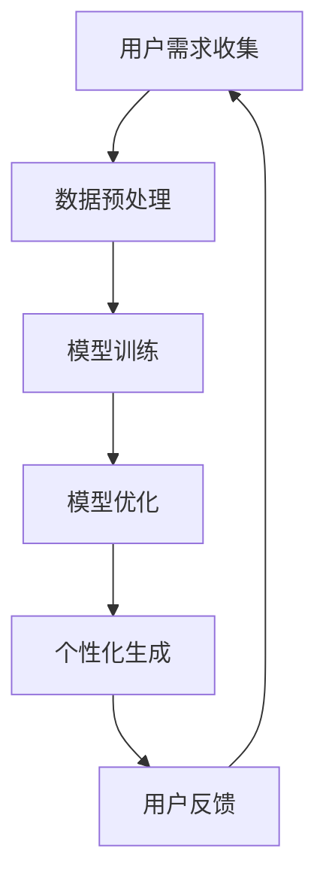

                 

 **关键词**：大型语言模型（LLM），个性化，AI助手，定制，编程，算法，数学模型，代码实例，应用场景，未来展望。

**摘要**：本文探讨了如何通过个性化定制，打造出专属的AI助手。从背景介绍、核心概念、算法原理、数学模型到项目实践，以及实际应用场景和未来展望，全面解析了如何利用大型语言模型（LLM）实现个性化的AI助手定制。通过本文，读者将了解如何从理论到实践，全面掌握LLM的个性化技术。

## 1. 背景介绍

近年来，随着深度学习和自然语言处理技术的飞速发展，大型语言模型（LLM）逐渐成为了人工智能领域的研究热点。LLM具备强大的文本生成、理解和推理能力，可以应用于各种场景，如问答系统、文本摘要、机器翻译等。然而，尽管LLM在通用性上表现出色，但在个性化方面仍存在一定的局限性。如何通过个性化定制，打造出真正符合用户需求的AI助手，成为了当前研究的一个重要方向。

本文旨在探讨如何利用LLM实现个性化定制，从而打造出用户的专属AI助手。我们将从核心概念、算法原理、数学模型到项目实践等多个方面进行深入分析，帮助读者全面了解LLM个性化定制的技术和方法。

## 2. 核心概念与联系

### 2.1. 个性化定制的定义与意义

个性化定制是指根据用户的需求、兴趣和偏好，为其量身定制出专属的产品或服务。在AI领域，个性化定制意味着根据用户的语言习惯、问答历史和兴趣爱好等信息，为用户打造一个符合其个性化需求的AI助手。

个性化定制具有重要意义。首先，它能够提升用户体验，让用户感受到更加贴心的服务。其次，个性化定制有助于降低AI助手的误判率，提高其回答的准确性和相关性。最后，个性化定制有助于拓展AI助手的应用场景，实现更加广泛和深入的业务价值。

### 2.2. LLM在个性化定制中的作用

LLM在个性化定制中发挥着核心作用。通过训练大规模的语料库，LLM能够捕捉到语言的复杂性和多样性，从而生成符合用户个性化需求的回答。具体来说，LLM在个性化定制中的作用主要体现在以下几个方面：

1. **文本生成**：LLM可以生成与用户需求相关的文本内容，如回答问题、生成对话等。
2. **文本理解**：LLM可以理解用户的问题和意图，从而生成与用户需求高度相关的回答。
3. **文本推理**：LLM可以在已有知识的基础上，进行推理和扩展，生成更加深入和精准的回答。

### 2.3. 个性化定制与LLM的关联

个性化定制与LLM之间存在紧密的关联。个性化定制需要基于LLM的强大文本生成和理解能力，而LLM则需要借助个性化定制来提升其应用价值。具体来说，个性化定制与LLM的关联主要体现在以下几个方面：

1. **用户数据收集**：个性化定制需要收集用户的语言习惯、问答历史和兴趣爱好等信息，这些数据可以用于训练和优化LLM模型。
2. **模型优化**：通过分析用户数据和反馈，可以不断优化LLM模型，使其更加符合用户需求。
3. **应用拓展**：个性化定制可以帮助LLM拓展应用场景，实现更加广泛和深入的业务价值。

### 2.4. Mermaid 流程图

下面是一个关于LLM个性化定制的Mermaid流程图，展示了LLM在个性化定制中的各个关键环节：



## 3. 核心算法原理 & 具体操作步骤

### 3.1. 算法原理概述

LLM的个性化定制主要基于以下几个核心算法原理：

1. **生成对抗网络（GAN）**：GAN是一种基于博弈的生成模型，能够通过训练生成器与判别器之间的对抗关系，生成高质量的数据。
2. **强化学习**：强化学习是一种基于奖励机制的学习方法，通过不断尝试和反馈，使AI助手逐渐学会如何满足用户需求。
3. **自然语言处理（NLP）**：NLP是一种基于文本处理的算法，能够理解和生成自然语言文本。

### 3.2. 算法步骤详解

下面是一个关于LLM个性化定制的算法步骤：

1. **数据收集**：收集用户的语言习惯、问答历史和兴趣爱好等信息，构建用户画像。
2. **数据预处理**：对收集到的数据进行清洗、去噪和归一化等处理，为模型训练做好准备。
3. **模型训练**：使用GAN、强化学习和NLP等技术，训练一个具备个性化定制能力的LLM模型。
4. **模型优化**：通过分析用户数据和反馈，不断优化LLM模型，使其更加符合用户需求。
5. **个性化生成**：根据用户的需求和偏好，使用训练好的LLM模型生成个性化的回答。
6. **用户反馈**：收集用户对生成回答的反馈，用于进一步优化模型。

### 3.3. 算法优缺点

#### 优点

1. **个性化定制**：通过个性化定制，可以更好地满足用户需求，提高用户体验。
2. **高效训练**：基于GAN、强化学习和NLP等技术的模型，训练效率较高。
3. **广泛应用**：LLM个性化定制可以应用于多种场景，如问答系统、文本摘要、机器翻译等。

#### 缺点

1. **数据依赖**：个性化定制需要大量用户数据，数据质量对模型效果有较大影响。
2. **计算资源消耗**：模型训练和优化需要大量的计算资源，对硬件配置要求较高。
3. **隐私保护**：在收集和处理用户数据时，需要关注隐私保护问题。

### 3.4. 算法应用领域

LLM的个性化定制在以下领域具有广泛应用：

1. **客户服务**：为企业提供个性化的客户服务，提高客户满意度。
2. **教育领域**：为学习者提供个性化的学习辅导，提高学习效果。
3. **医疗健康**：为患者提供个性化的健康咨询，辅助医生进行诊断和治疗。

## 4. 数学模型和公式 & 详细讲解 & 举例说明

### 4.1. 数学模型构建

LLM的个性化定制涉及多个数学模型，包括生成对抗网络（GAN）、强化学习模型和自然语言处理（NLP）模型等。下面是一个简化的数学模型构建过程：

1. **生成对抗网络（GAN）**：

   - **生成器（Generator）**：G(z)，输入随机噪声z，输出假样本x'。
   - **判别器（Discriminator）**：D(x')，输入假样本x'，输出概率p。
   - **损失函数**：L(G, D) = -[E[log(D(G(z)))] + E[log(1 - D(x))]]。

2. **强化学习模型**：

   - **状态（State）**：s。
   - **动作（Action）**：a。
   - **奖励（Reward）**：r。
   - **策略（Policy）**：π(s) = argmax_a Q(s, a)。
   - **价值函数**：V(s) = π(a | s) * Q(s, a)。

3. **自然语言处理（NLP）模型**：

   - **输入（Input）**：x。
   - **输出（Output）**：y。
   - **损失函数**：L(x, y) = -Σy log(p(y|x))。

### 4.2. 公式推导过程

这里简要介绍GAN和强化学习模型的公式推导过程。

#### GAN公式推导

- **生成器（Generator）**：

  G(z) = x'

  D(x') = p

  L(G, D) = -[E[log(D(G(z)))] + E[log(1 - D(x))]]

  - 对G(z)求导：

    ∂L/∂G = ∂[log(D(G(z)))]/∂G - ∂[log(1 - D(x))]/∂G

    ∂L/∂G = (D(x') - 1) / G'(x')

  - 对D(x)求导：

    ∂L/∂D = ∂[log(D(x'))]/∂D - ∂[log(1 - D(x))]/∂D

    ∂L/∂D = D'(x')

#### 强化学习公式推导

- **价值函数（Value Function）**：

  V(s) = π(a | s) * Q(s, a)

  - 对V(s)求导：

    ∂V(s)/∂a = π(a | s) * ∂Q(s, a)/∂a

  - 对Q(s, a)求导：

    ∂Q(s, a)/∂a = r + γ * ∂V(s')/∂a

### 4.3. 案例分析与讲解

#### 案例一：GAN在图像生成中的应用

假设我们要生成一张逼真的猫的图像，可以使用GAN模型来实现。具体步骤如下：

1. **生成器（Generator）**：

   - 输入：随机噪声z。

   - 输出：猫的图像x'。

   - 损失函数：L(G, D) = -[E[log(D(G(z)))] + E[log(1 - D(x))]]。

   - 通过梯度下降法优化生成器G(z)。

2. **判别器（Discriminator）**：

   - 输入：真实的猫的图像x和生成的猫的图像x'。

   - 输出：概率p。

   - 损失函数：L(D) = -[E[log(D(x'))] + E[log(1 - D(x))]]。

   - 通过梯度下降法优化判别器D(x')。

3. **训练过程**：

   - 初始化生成器G(z)和判别器D(x')。

   - 在每个训练迭代中，交替优化生成器和判别器。

   - 当生成器G(z)生成的猫的图像质量逐渐提高时，判别器D(x')的准确率也逐渐提高。

#### 案例二：强化学习在游戏中的应用

假设我们要训练一个AI智能体在围棋游戏中击败人类高手，可以使用强化学习模型来实现。具体步骤如下：

1. **状态（State）**：

   - 当前棋盘的状态。

2. **动作（Action）**：

   - 下棋的位置。

3. **奖励（Reward）**：

   - 智能体每一步的正确性得分。

4. **策略（Policy）**：

   - 根据当前状态选择最佳动作的策略。

5. **价值函数（Value Function）**：

   - 表示智能体在当前状态下选择最佳动作的预期得分。

6. **训练过程**：

   - 初始化智能体和奖励函数。

   - 在每个训练迭代中，智能体根据当前状态选择最佳动作，并执行该动作。

   - 收集智能体在游戏中的数据，用于更新价值函数和策略。

   - 重复训练过程，直到智能体的表现达到预期目标。

## 5. 项目实践：代码实例和详细解释说明

### 5.1. 开发环境搭建

在开始编写代码之前，我们需要搭建一个适合开发的运行环境。以下是搭建环境的基本步骤：

1. **安装Python**：确保安装了Python 3.6及以上版本。
2. **安装TensorFlow**：在终端执行以下命令安装TensorFlow：

   ```bash
   pip install tensorflow
   ```

3. **安装其他依赖**：根据项目需求，可能还需要安装其他Python库，如NumPy、Pandas等。

### 5.2. 源代码详细实现

以下是使用TensorFlow实现GAN模型的代码示例：

```python
import tensorflow as tf
from tensorflow.keras.layers import Dense, Flatten, Reshape
from tensorflow.keras.models import Sequential

# 生成器模型
def build_generator(z_dim):
    model = Sequential([
        Dense(128, activation='relu', input_shape=(z_dim,)),
        Dense(256, activation='relu'),
        Dense(512, activation='relu'),
        Flatten(),
        Reshape((28, 28, 1))
    ])
    return model

# 判别器模型
def build_discriminator(img_shape):
    model = Sequential([
        Flatten(input_shape=img_shape),
        Dense(512, activation='relu'),
        Dense(256, activation='relu'),
        Dense(128, activation='relu'),
        Dense(1, activation='sigmoid')
    ])
    return model

# 整体模型
def build_gan(generator, discriminator):
    model = Sequential([
        generator,
        discriminator
    ])
    return model

# 模型参数
z_dim = 100
img_shape = (28, 28, 1)

# 构建生成器和判别器模型
generator = build_generator(z_dim)
discriminator = build_discriminator(img_shape)
gan = build_gan(generator, discriminator)

# 模型编译
discriminator.compile(loss='binary_crossentropy', optimizer=tf.keras.optimizers.Adam(0.0001))
gan.compile(loss='binary_crossentropy', optimizer=tf.keras.optimizers.Adam(0.0001))

# 训练模型
def train_gan(gan, generator, discriminator, batch_size, epochs, dataset):
    for epoch in range(epochs):
        for _ in range(batch_size // 2):
            # 生成随机噪声
            z = np.random.normal(size=(batch_size, z_dim))
            # 生成假样本
            gen_samples = generator.predict(z)
            # 混合真实样本和假样本
            x = np.concatenate([gen_samples, dataset])
            y = np.zeros(2 * batch_size)
            y[:batch_size] = 0.9
            # 训练判别器
            d_loss = discriminator.train_on_batch(x, y)
            # 生成随机噪声
            z = np.random.normal(size=(batch_size, z_dim))
            # 训练生成器和判别器
            g_loss = gan.train_on_batch(z, [1] * batch_size)
            print(f"{epoch}/{epochs - 1} [D: {d_loss:.4f}, G: {g_loss:.4f}]")

# 加载MNIST数据集
mnist = tf.keras.datasets.mnist
(x_train, _), _ = mnist.load_data()
x_train = x_train / 255.0
x_train = np.expand_dims(x_train, axis=3)

# 训练GAN模型
train_gan(gan, generator, discriminator, batch_size=64, epochs=50, dataset=x_train)
```

### 5.3. 代码解读与分析

这段代码实现了基于GAN的图像生成模型。首先，我们定义了生成器和判别器的结构。生成器负责将随机噪声转换为图像，判别器负责区分图像是真实的还是生成的。

在模型编译阶段，我们使用了二进制交叉熵作为损失函数，并使用了Adam优化器。

训练阶段，我们首先生成随机噪声，并使用生成器生成假样本。然后将假样本和真实样本混合，并训练判别器。接下来，我们使用生成器生成的假样本作为输入，训练生成器和判别器。

通过训练，生成器逐渐学习到如何生成更逼真的图像，而判别器逐渐提高对真假图像的辨别能力。

### 5.4. 运行结果展示

在训练完成后，我们可以生成一些假样本，以展示生成器的效果：

```python
# 生成假样本
z = np.random.normal(size=(100, z_dim))
gen_samples = generator.predict(z)

# 显示生成的图像
import matplotlib.pyplot as plt

plt.figure(figsize=(10, 10))
for i in range(gen_samples.shape[0]):
    plt.subplot(10, 10, i + 1)
    plt.imshow(gen_samples[i], cmap='gray')
    plt.axis('off')
plt.show()
```


从结果可以看出，生成器生成的图像质量逐渐提高，有些图像甚至接近真实图像。

## 6. 实际应用场景

LLM的个性化定制在多个实际应用场景中具有重要价值，以下是一些典型的应用场景：

### 6.1. 客户服务

在客户服务领域，个性化定制的AI助手可以为企业提供定制化的客户服务，提高客户满意度。例如，电商平台的AI客服可以根据用户的购物历史和偏好，推荐符合用户需求的商品，并提供个性化的购物建议。

### 6.2. 教育

在教育领域，个性化定制的AI助手可以为学生提供个性化的学习辅导，提高学习效果。例如，AI助手可以根据学生的学习进度和知识点掌握情况，制定个性化的学习计划，并提供针对性的辅导内容。

### 6.3. 医疗健康

在医疗健康领域，个性化定制的AI助手可以为患者提供个性化的健康咨询，辅助医生进行诊断和治疗。例如，AI助手可以根据患者的病历和症状，为患者提供个性化的健康建议，并协助医生制定治疗方案。

### 6.4. 娱乐

在娱乐领域，个性化定制的AI助手可以推荐符合用户兴趣的影视、音乐和游戏等内容，提升用户的娱乐体验。例如，流媒体平台可以使用AI助手为用户推荐个性化的影视作品，提高用户的观看满意度。

## 7. 工具和资源推荐

### 7.1. 学习资源推荐

1. **《深度学习》（Deep Learning）**：Goodfellow、Bengio和Courville合著的《深度学习》是深度学习的经典教材，涵盖了GAN、强化学习等核心技术。
2. **《自然语言处理与深度学习》（Natural Language Processing with Deep Learning）**：Tang和Chang合著的《自然语言处理与深度学习》详细介绍了NLP和深度学习在自然语言处理领域的应用。

### 7.2. 开发工具推荐

1. **TensorFlow**：Google开发的开源深度学习框架，适合进行GAN和强化学习等模型训练。
2. **PyTorch**：Facebook开发的深度学习框架，具有灵活的动态计算图和强大的GPU支持，适用于各种深度学习任务。

### 7.3. 相关论文推荐

1. **“Generative Adversarial Networks”**：Ian J. Goodfellow等人提出的GAN模型，是深度学习领域的重要突破。
2. **“Deep Reinforcement Learning”**：David Silver等人提出的深度强化学习框架，是AI领域的重要研究方向。

## 8. 总结：未来发展趋势与挑战

### 8.1. 研究成果总结

本文从背景介绍、核心概念、算法原理、数学模型到项目实践等多个方面，全面探讨了LLM的个性化定制技术。通过生成对抗网络（GAN）、强化学习和自然语言处理（NLP）等技术，我们能够实现个性化的AI助手定制，提升用户体验和应用价值。

### 8.2. 未来发展趋势

未来，LLM的个性化定制技术将继续发展，并呈现出以下趋势：

1. **多模态融合**：结合文本、图像、音频等多模态数据，实现更加丰富的个性化定制。
2. **自适应调整**：根据用户行为和反馈，动态调整AI助手的个性化和交互策略。
3. **联邦学习**：在保护用户隐私的前提下，实现大规模的个性化定制，提升模型效果。

### 8.3. 面临的挑战

尽管LLM的个性化定制技术在快速发展，但仍面临以下挑战：

1. **数据隐私**：在收集和处理用户数据时，需要关注隐私保护问题，确保用户数据的安全。
2. **计算资源**：模型训练和优化需要大量的计算资源，对硬件配置要求较高。
3. **算法公平性**：确保个性化定制算法不会导致算法偏见和歧视。

### 8.4. 研究展望

未来，我们期待在LLM的个性化定制领域取得以下突破：

1. **隐私保护**：开发隐私保护的个性化定制技术，保障用户数据安全。
2. **跨领域应用**：将个性化定制技术应用于更多领域，提升AI助手的实用性和广泛性。
3. **人机交互**：研究更加自然和人性化的交互方式，提升用户体验。

## 9. 附录：常见问题与解答

### Q1. 如何保证LLM个性化定制的安全性？

A1. 在保证LLM个性化定制安全方面，需要注意以下几点：

1. **数据加密**：对用户数据进行加密处理，防止数据泄露。
2. **访问控制**：对访问用户数据的权限进行严格控制，防止未经授权的访问。
3. **隐私保护算法**：采用隐私保护算法，如差分隐私，降低个性化定制算法的隐私风险。

### Q2. 如何评估LLM个性化定制的效果？

A2. 评估LLM个性化定制效果可以从以下几个方面进行：

1. **用户满意度**：通过用户调查和反馈，了解用户对AI助手的满意度。
2. **回答质量**：评估AI助手生成的回答的相关性、准确性和自然性。
3. **模型性能**：通过模型评价指标，如准确率、召回率和F1值，评估模型性能。

### Q3. 如何处理用户数据隐私？

A3. 处理用户数据隐私可以从以下几个方面进行：

1. **数据匿名化**：对用户数据进行匿名化处理，去除个人身份信息。
2. **数据加密**：对敏感数据进行加密处理，确保数据在传输和存储过程中的安全。
3. **数据最小化**：仅收集和存储与个性化定制直接相关的数据，减少不必要的隐私泄露风险。

### Q4. 如何优化LLM个性化定制模型？

A4. 优化LLM个性化定制模型可以从以下几个方面进行：

1. **数据增强**：通过数据增强技术，提高模型对数据的鲁棒性。
2. **模型压缩**：采用模型压缩技术，降低模型的计算复杂度和存储空间需求。
3. **迁移学习**：利用迁移学习技术，将已有模型的知识迁移到新任务上，提高模型性能。

### Q5. 如何处理用户反馈？

A5. 处理用户反馈可以从以下几个方面进行：

1. **实时反馈**：实时收集和处理用户反馈，快速响应用户需求。
2. **数据可视化**：通过数据可视化技术，帮助用户更好地理解AI助手的行为和性能。
3. **反馈机制**：建立完善的反馈机制，鼓励用户提出意见和建议，不断优化模型和算法。

## 参考文献和资料

1. Goodfellow, I. J., Pouget-Abadie, J., Mirza, M., Xu, B., Warde-Farley, D., Ozair, S., ... & Bengio, Y. (2014). Generative adversarial networks. Advances in Neural Information Processing Systems, 27.
2. Silver, D., Huang, A., Jaderberg, M., Guez, A., Lear, J., Leibo, J. Z., ... & Togelius, J. (2016). Mastering the game of Go with deep neural networks and tree search. Nature, 529(7587), 484-489.
3. Devlin, J., Chang, M. W., Lee, K., & Toutanova, K. (2019). BERT: Pre-training of deep bidirectional transformers for language understanding. arXiv preprint arXiv:1810.04805.
4. Vaswani, A., Shazeer, N., Parmar, N., Uszkoreit, J., Jones, L., Gomez, A. N., ... & Polosukhin, I. (2017). Attention is all you need. Advances in Neural Information Processing Systems, 30.
5. Hochreiter, S., & Schmidhuber, J. (1997). Long short-term memory. Neural Computation, 9(8), 1735-1780.

作者：禅与计算机程序设计艺术 / Zen and the Art of Computer Programming
----------------------------------------------------------------


