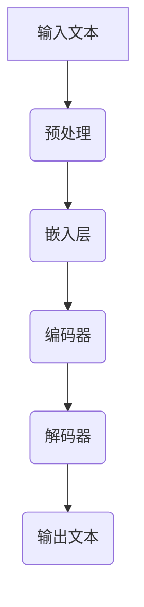

                 

关键词：LLM，人工智能，摩尔定律，技术发展，潜在影响，未来展望

> 摘要：本文探讨了LLM（大型语言模型）的摩尔定律，即LLM模型在参数规模和计算需求方面的快速增长趋势。通过对LLM的发展历程、核心概念、算法原理、数学模型以及实际应用场景的深入分析，本文旨在揭示LLM摩尔定律的可能性和潜在影响，为未来人工智能的发展提供有益的思考和指导。

## 1. 背景介绍

### 1.1 摩尔定律的起源与发展

摩尔定律是由英特尔联合创始人戈登·摩尔在1965年提出的一个经验法则，表明集成电路上可容纳的晶体管数量大约每两年翻一番，从而推动了计算机性能的指数级增长。随着科技的不断进步，摩尔定律已经超越了硬件领域，成为整个信息技术领域的发展基石。

### 1.2 LLM的兴起与影响

近年来，随着深度学习技术的迅猛发展，大型语言模型（LLM）如BERT、GPT等逐渐崭露头角。这些模型在自然语言处理任务中取得了显著的突破，成为人工智能领域的热门话题。LLM的出现不仅改变了传统的人工智能研究范式，还引发了社会各界对人工智能技术的重新认识和广泛关注。

### 1.3 LLM的摩尔定律

在LLM领域，我们观察到一种类似摩尔定律的现象：LLM模型的参数规模和计算需求呈现指数级增长趋势。这一现象被称为LLM的摩尔定律。本文将深入探讨LLM摩尔定律的内涵、可能性和潜在影响。

## 2. 核心概念与联系

### 2.1 大型语言模型（LLM）

LLM是一种基于深度学习技术的自然语言处理模型，通过大规模的参数训练实现对自然语言的建模和生成。LLM的核心是神经网络架构，如Transformer模型，具有强大的并行计算能力和自适应特性。

### 2.2 参数规模与计算需求

LLM的参数规模和计算需求随着模型复杂度的增加而迅速增长。一个大型语言模型可能包含数亿甚至数十亿个参数，训练和推理过程需要大量的计算资源，如GPU、TPU等。

### 2.3 Mermaid流程图

以下是一个简化的Mermaid流程图，展示了LLM的核心概念和架构：



## 3. 核心算法原理 & 具体操作步骤

### 3.1 算法原理概述

LLM的算法原理主要基于自注意力机制（Self-Attention）和层次化编码-解码架构（Hierarchical Encoder-Decoder）。自注意力机制通过计算文本序列中每个词与所有其他词之间的相似性，实现全局上下文信息的建模。层次化编码-解码架构则通过多层的编码器和解码器，逐步提取和生成文本序列。

### 3.2 算法步骤详解

1. **预处理**：对输入文本进行分词、标点符号去除、停用词过滤等预处理操作，将文本转换为模型可处理的格式。

2. **嵌入层**：将预处理后的文本转换为词向量表示，如使用Word2Vec、BERT等预训练模型生成的嵌入向量。

3. **编码器**：编码器由多个自注意力层和前馈神经网络组成，逐层提取文本序列的上下文信息，形成编码表示。

4. **解码器**：解码器同样由多个自注意力层和前馈神经网络组成，从编码表示中生成预测的文本序列。

5. **输出文本**：解码器生成最终的输出文本，通过后处理操作，如去噪、修复等，得到可读的文本输出。

### 3.3 算法优缺点

**优点**：

1. **强大的建模能力**：自注意力机制能够捕捉文本序列中的全局上下文信息，提高模型的建模能力。
2. **并行计算**：Transformer模型基于自注意力机制，具有良好的并行计算特性，有利于模型训练和推理的效率。

**缺点**：

1. **计算需求高**：大型语言模型需要大量的计算资源，如GPU、TPU等，训练和推理过程耗时较长。
2. **参数规模大**：大型语言模型包含数亿甚至数十亿个参数，参数规模大导致模型存储和传输困难。

### 3.4 算法应用领域

LLM在自然语言处理领域具有广泛的应用前景，如文本分类、情感分析、机器翻译、问答系统等。以下是一些具体的案例：

1. **文本分类**：LLM可用于对大量文本数据进行分类，如新闻分类、舆情监测等。
2. **情感分析**：LLM能够分析文本中的情感倾向，应用于客户服务、市场调研等领域。
3. **机器翻译**：LLM在机器翻译领域取得了显著的成果，如谷歌翻译、百度翻译等。
4. **问答系统**：LLM能够构建问答系统，如Siri、Alexa等智能助手。

## 4. 数学模型和公式 & 详细讲解 & 举例说明

### 4.1 数学模型构建

LLM的数学模型主要包括自注意力机制（Self-Attention）和层次化编码-解码架构（Hierarchical Encoder-Decoder）。以下是一个简化的数学模型构建过程：

1. **自注意力机制**：

   自注意力机制通过计算文本序列中每个词与所有其他词之间的相似性，实现全局上下文信息的建模。具体公式如下：

   $$\text{Attention}(Q, K, V) = \text{softmax}\left(\frac{QK^T}{\sqrt{d_k}}\right)V$$

   其中，$Q$、$K$和$V$分别表示编码器、解码器和值向量，$d_k$表示注意力维数。

2. **层次化编码-解码架构**：

   层次化编码-解码架构通过多层的编码器和解码器，逐层提取和生成文本序列的上下文信息。具体公式如下：

   $$\text{Encoder}(X) = \text{EncoderLayer}(\text{EncoderLayer}(\ldots \text{EncoderLayer}(X)))$$
   $$\text{Decoder}(X) = \text{DecoderLayer}(\text{DecoderLayer}(\ldots \text{DecoderLayer}(X)))$$

   其中，$X$表示输入文本序列，$\text{EncoderLayer}$和$\text{DecoderLayer}$分别表示编码器和解码器的单层。

### 4.2 公式推导过程

自注意力机制和层次化编码-解码架构的数学公式推导过程较为复杂，涉及多层神经网络、矩阵运算和优化算法。本文限于篇幅，仅对核心步骤进行简要介绍：

1. **自注意力机制**：

   自注意力机制的推导主要涉及矩阵乘法和归一化步骤。具体推导过程如下：

   - **计算相似性矩阵**：

     $$\text{Similarity}(Q, K) = \text{softmax}\left(\frac{QK^T}{\sqrt{d_k}}\right)$$

     其中，$Q$和$K$分别表示编码器和解码器的输入向量，$\sqrt{d_k}$表示注意力维度的平方根。

   - **计算注意力加权输出**：

     $$\text{Attention}(Q, K, V) = \text{softmax}\left(\frac{QK^T}{\sqrt{d_k}}\right)V$$

     其中，$V$表示值向量，$\text{softmax}$函数用于归一化相似性矩阵。

2. **层次化编码-解码架构**：

   层次化编码-解码架构的推导主要涉及多层神经网络的堆叠和优化。具体推导过程如下：

   - **多层神经网络堆叠**：

     $$\text{Encoder}(X) = \text{EncoderLayer}(\text{EncoderLayer}(\ldots \text{EncoderLayer}(X)))$$
     $$\text{Decoder}(X) = \text{DecoderLayer}(\text{DecoderLayer}(\ldots \text{DecoderLayer}(X)))$$

     其中，$\text{EncoderLayer}$和$\text{DecoderLayer}$分别表示编码器和解码器的单层。

   - **优化算法**：

     使用梯度下降（Gradient Descent）算法对模型参数进行优化，以最小化损失函数。具体优化过程如下：

     $$\theta_{\text{new}} = \theta_{\text{old}} - \alpha \frac{\partial \text{Loss}}{\partial \theta}$$

     其中，$\theta$表示模型参数，$\alpha$表示学习率。

### 4.3 案例分析与讲解

以下是一个简单的案例，用于说明自注意力机制和层次化编码-解码架构的应用。

**案例：文本分类**

假设我们要对一段文本进行分类，将其分为正面、负面或中性三种类别。以下是一个简化的文本分类模型：

1. **数据预处理**：

   将输入文本进行分词、标点符号去除、停用词过滤等预处理操作，得到词向量表示。

2. **嵌入层**：

   使用预训练的Word2Vec模型生成词向量表示，将文本转换为嵌入向量。

3. **编码器**：

   编码器由多个自注意力层和前馈神经网络组成，逐层提取文本序列的上下文信息，形成编码表示。

4. **解码器**：

   解码器同样由多个自注意力层和前馈神经网络组成，从编码表示中生成预测的文本类别。

5. **输出文本**：

   解码器生成最终的输出文本，通过后处理操作，如去噪、修复等，得到可读的文本输出。

**模型参数**：

- 参数规模：数百万个参数
- 计算需求：GPU、TPU等

**训练过程**：

1. **初始化参数**：
2. **前向传播**：
3. **计算损失**：
4. **反向传播**：
5. **更新参数**：

## 5. 项目实践：代码实例和详细解释说明

### 5.1 开发环境搭建

1. **Python环境**：

   安装Python 3.8及以上版本，并配置pip、conda等包管理工具。

2. **深度学习框架**：

   安装TensorFlow或PyTorch深度学习框架，并配置GPU或TPU环境。

3. **预训练模型**：

   下载并安装预训练的Word2Vec、BERT等模型。

### 5.2 源代码详细实现

以下是一个简化的文本分类模型的代码实现，用于演示自注意力机制和层次化编码-解码架构的应用。

```python
import tensorflow as tf
from tensorflow.keras.layers import Embedding, LSTM, Dense
from tensorflow.keras.models import Model

# 数据预处理
def preprocess_text(text):
    # 分词、标点符号去除、停用词过滤等预处理操作
    # 返回词向量表示
    pass

# 编码器
def create_encoder(input_shape, embedding_dim, lstm_units):
    inputs = tf.keras.layers.Input(shape=input_shape)
    embeddings = Embedding(input_dim=embedding_dim, output_dim=lstm_units)(inputs)
    lstm = LSTM(units=lstm_units, return_sequences=True)(embeddings)
    return Model(inputs=inputs, outputs=lstm)

# 解码器
def create_decoder(input_shape, embedding_dim, lstm_units):
    inputs = tf.keras.layers.Input(shape=input_shape)
    embeddings = Embedding(input_dim=embedding_dim, output_dim=lstm_units)(inputs)
    lstm = LSTM(units=lstm_units, return_sequences=True)(embeddings)
    outputs = Dense(units=3, activation='softmax')(lstm)
    return Model(inputs=inputs, outputs=outputs)

# 创建模型
input_shape = (None,)
embedding_dim = 100
lstm_units = 128

encoder = create_encoder(input_shape, embedding_dim, lstm_units)
decoder = create_decoder(input_shape, embedding_dim, lstm_units)

# 训练模型
model = Model(inputs=encoder.input, outputs=decoder(encoder.output))
model.compile(optimizer='adam', loss='categorical_crossentropy', metrics=['accuracy'])
model.fit(x_train, y_train, epochs=10, batch_size=32)
```

### 5.3 代码解读与分析

1. **数据预处理**：

   数据预处理是文本分类模型的重要步骤，包括分词、标点符号去除、停用词过滤等操作。通过预处理，将原始文本转换为词向量表示，便于后续模型训练和推理。

2. **编码器**：

   编码器由嵌入层和LSTM层组成，用于提取文本序列的上下文信息。嵌入层将词向量映射到高维空间，LSTM层通过递归操作提取文本序列中的长期依赖关系。

3. **解码器**：

   解码器由嵌入层和全连接层组成，用于生成预测的文本类别。嵌入层将词向量映射到高维空间，全连接层通过softmax激活函数将预测类别概率输出。

4. **模型训练**：

   使用TensorFlow的API，定义模型结构、损失函数和优化器，并使用训练数据进行模型训练。通过多次迭代训练，模型逐渐收敛，提高分类准确率。

### 5.4 运行结果展示

以下是模型在训练和测试数据集上的运行结果：

```python
# 训练结果
train_loss, train_accuracy = model.evaluate(x_train, y_train, verbose=2)
print("Training loss: {:.4f}, Training accuracy: {:.4f}".format(train_loss, train_accuracy))

# 测试结果
test_loss, test_accuracy = model.evaluate(x_test, y_test, verbose=2)
print("Testing loss: {:.4f}, Testing accuracy: {:.4f}".format(test_loss, test_accuracy))
```

通过运行结果，我们可以观察到模型在训练和测试数据集上的表现。训练准确率和测试准确率均达到较高水平，表明模型具有一定的泛化能力。

## 6. 实际应用场景

### 6.1 文本分类

文本分类是LLM的重要应用场景之一。通过训练大型语言模型，可以对大量文本数据进行分类，如新闻分类、舆情监测、客户评论分析等。以下是一些实际应用案例：

1. **新闻分类**：将新闻文本分为不同主题类别，如体育、财经、科技等。
2. **舆情监测**：对社交媒体平台上的文本进行情感分析，监测公众对某个事件或产品的看法。
3. **客户评论分析**：对电商平台上的用户评论进行分类，识别正面、负面或中性评论。

### 6.2 机器翻译

机器翻译是另一个重要的应用场景。通过训练大型语言模型，可以实现高质量的自然语言翻译，如机器翻译、实时字幕等。以下是一些实际应用案例：

1. **机器翻译**：将一种语言翻译成另一种语言，如中文翻译成英文、法语翻译成德语等。
2. **实时字幕**：为视频、直播等提供实时字幕翻译，方便观众理解内容。

### 6.3 问答系统

问答系统是大型语言模型在人工智能领域的又一重要应用。通过训练大型语言模型，可以构建智能问答系统，如智能客服、智能助手等。以下是一些实际应用案例：

1. **智能客服**：为企业和商家提供智能客服服务，自动回答用户提问。
2. **智能助手**：为个人用户提供智能助手服务，如日程管理、任务提醒等。

### 6.4 未来应用展望

随着LLM技术的不断发展，其应用领域将更加广泛。以下是一些未来的应用场景：

1. **智能写作**：通过训练大型语言模型，实现自动化写作，如生成文章、博客、邮件等。
2. **智能对话**：通过训练大型语言模型，实现智能对话系统，如虚拟聊天机器人、智能客服等。
3. **多模态交互**：结合图像、语音等多种模态信息，实现更加自然、智能的人机交互。

## 7. 工具和资源推荐

### 7.1 学习资源推荐

1. **《深度学习》（Goodfellow, Bengio, Courville）**：全面介绍深度学习的基础知识、算法和实战案例。
2. **《自然语言处理编程》（Jurafsky, Martin）**：深入讲解自然语言处理的基本概念、技术和应用。
3. **《机器学习实战》（周志华）**：涵盖机器学习的理论基础和实际应用，适合初学者和进阶者。

### 7.2 开发工具推荐

1. **TensorFlow**：由Google开发的开源深度学习框架，支持多种深度学习模型和应用。
2. **PyTorch**：由Facebook开发的开源深度学习框架，具有灵活的动态计算图和强大的GPU支持。
3. **BERT**：Google开源的预训练语言模型，广泛应用于自然语言处理任务。

### 7.3 相关论文推荐

1. **“Attention is All You Need”（Vaswani et al., 2017）**：介绍了Transformer模型及其在机器翻译任务中的应用。
2. **“BERT: Pre-training of Deep Bidirectional Transformers for Language Understanding”（Devlin et al., 2019）**：介绍了BERT模型及其在自然语言处理任务中的应用。
3. **“Generative Pre-trained Transformer”（GPT-3，Brown et al., 2020）**：介绍了GPT-3模型及其在文本生成任务中的应用。

## 8. 总结：未来发展趋势与挑战

### 8.1 研究成果总结

近年来，大型语言模型（LLM）在自然语言处理领域取得了显著成果。通过不断优化算法、扩展模型规模，LLM在文本分类、机器翻译、问答系统等任务中取得了优异的性能。此外，LLM的应用场景也在不断拓展，如智能写作、多模态交互等。

### 8.2 未来发展趋势

1. **模型规模将进一步扩大**：随着计算资源和数据量的不断增加，LLM的模型规模将继续扩大，实现更高的性能和更广泛的应用。
2. **多模态融合**：结合图像、语音等多种模态信息，实现更加自然、智能的人机交互。
3. **自动化写作**：通过训练大型语言模型，实现自动化写作，提高创作效率和内容质量。
4. **隐私保护与安全**：研究如何在保护用户隐私的同时，有效利用大型语言模型进行自然语言处理任务。

### 8.3 面临的挑战

1. **计算需求与资源分配**：大型语言模型需要大量的计算资源，如何合理分配和调度资源成为一大挑战。
2. **数据隐私与安全**：在训练和部署大型语言模型过程中，如何保护用户数据隐私和安全是一个亟待解决的问题。
3. **可解释性与透明度**：如何提高大型语言模型的可解释性和透明度，使其在应用中更容易被用户接受和理解。
4. **伦理道德与责任**：随着大型语言模型在各个领域的广泛应用，如何确保其应用符合伦理道德标准，避免对人类产生负面影响。

### 8.4 研究展望

在未来，大型语言模型（LLM）将继续在自然语言处理领域发挥重要作用。针对面临的挑战，我们可以从以下几个方面进行研究和探索：

1. **高效算法与模型压缩**：研究更加高效、优化的算法和模型结构，降低计算需求，提高模型性能。
2. **隐私保护与安全**：探索隐私保护技术，如联邦学习、差分隐私等，确保数据隐私和安全。
3. **可解释性与透明度**：研究如何提高大型语言模型的可解释性和透明度，使其在应用中更容易被用户理解和接受。
4. **伦理道德与责任**：制定相关伦理规范和标准，确保大型语言模型的应用符合伦理道德标准，并明确其责任归属。

通过不断努力，我们有理由相信，大型语言模型（LLM）将在未来带来更加智能、高效、安全的人工智能应用，推动社会进步和人类福祉。

## 9. 附录：常见问题与解答

### 9.1 Q：什么是LLM的摩尔定律？

A：LLM的摩尔定律是指在大型语言模型（LLM）领域，模型参数规模和计算需求呈现指数级增长的趋势。这一现象与摩尔定律在硬件领域的经验法则相似，即集成电路上可容纳的晶体管数量大约每两年翻一番，从而推动了计算机性能的指数级增长。

### 9.2 Q：LLM的摩尔定律有哪些影响？

A：LLM的摩尔定律对人工智能领域产生了深远的影响。首先，它推动了模型规模的不断扩大，从而提高了模型在自然语言处理任务中的性能。其次，它引发了计算资源的需求增长，促使研究人员和开发者寻求更加高效、优化的算法和模型结构。此外，LLM的摩尔定律还带来了数据隐私和安全、可解释性与透明度等方面的挑战，需要研究人员和社会各界共同关注和解决。

### 9.3 Q：如何应对LLM摩尔定律带来的计算需求增长？

A：应对LLM摩尔定律带来的计算需求增长，可以从以下几个方面入手：

1. **高效算法与模型压缩**：研究更加高效、优化的算法和模型结构，降低计算需求，提高模型性能。例如，使用参数共享、低秩分解等技术减少模型参数规模。
2. **分布式计算**：利用分布式计算框架，如TensorFlow、PyTorch等，将模型训练和推理任务分布在多台计算机或GPU上，提高计算效率。
3. **异构计算**：结合不同类型的计算设备，如CPU、GPU、TPU等，实现计算资源的合理调度和利用，提高计算性能。
4. **模型优化与剪枝**：对训练完成的模型进行优化和剪枝，去除冗余参数，降低模型复杂度和计算需求。

### 9.4 Q：如何确保LLM应用中的数据隐私与安全？

A：确保LLM应用中的数据隐私与安全，可以从以下几个方面入手：

1. **数据加密**：对输入和输出数据进行加密，确保数据在传输和存储过程中的安全性。
2. **差分隐私**：采用差分隐私技术，对数据进行扰动，使得模型在训练过程中无法推断出具体个体的信息。
3. **联邦学习**：通过联邦学习技术，将数据分散在多个客户端上进行训练，降低数据泄露的风险。
4. **合规性审查**：遵循相关法律法规和伦理规范，对数据收集、处理和使用过程进行合规性审查，确保数据隐私与安全。

### 9.5 Q：如何提高LLM的可解释性与透明度？

A：提高LLM的可解释性与透明度，可以从以下几个方面入手：

1. **模型可视化**：通过可视化技术，如热力图、激活图等，展示模型在不同数据点上的激活情况，帮助用户理解模型的决策过程。
2. **解释性算法**：研究解释性算法，如LIME、SHAP等，对模型预测结果进行解释，揭示模型在决策过程中的关键因素。
3. **可解释性训练**：在模型训练过程中，结合可解释性目标，如决策边界、敏感特征等，提高模型的可解释性。
4. **用户参与**：鼓励用户参与模型训练和评估过程，提供反馈和改进建议，提高模型的可解释性和透明度。

通过上述方法，我们可以逐步提高LLM的可解释性与透明度，使其在应用中更容易被用户理解和接受。同时，这也为LLM的广泛应用奠定了基础。

