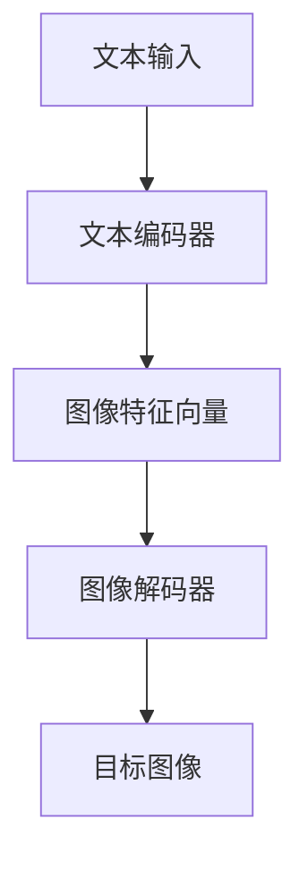

                 

关键词：语言模型，视觉生成，人工智能，图像处理，深度学习，计算机视觉

摘要：本文将探讨语言模型在视觉生成领域中的应用，介绍其核心概念、算法原理、数学模型和具体操作步骤，并通过项目实践展示其实际效果。同时，我们将分析LLM视觉生成的优缺点、应用领域，并展望其未来发展趋势和挑战。

## 1. 背景介绍

近年来，人工智能（AI）和计算机视觉技术取得了飞速发展，从传统的图像识别、目标检测到更复杂的图像生成和视频处理，AI技术已经渗透到我们生活的方方面面。在这一过程中，语言模型（Language Model，简称LM）逐渐成为推动计算机视觉发展的关键因素。语言模型最初是为了处理自然语言处理（NLP）问题而设计的，但近年来，研究人员发现语言模型在视觉任务中也具有巨大潜力。LLM视觉生成（LLM-based Vision Generation）正是这一新兴领域的研究热点，它结合了语言模型和计算机视觉技术，旨在实现高质量的图像生成。

## 2. 核心概念与联系

### 2.1. 语言模型

语言模型是一种统计模型，用于预测下一个单词或字符的概率。在自然语言处理领域，语言模型广泛应用于文本生成、机器翻译、情感分析等任务。近年来，深度学习技术的发展使得语言模型取得了显著的性能提升，其中最具代表性的模型是Transformer和GPT系列。

### 2.2. 计算机视觉

计算机视觉是人工智能的一个分支，旨在使计算机理解和解释图像和视频数据。计算机视觉技术广泛应用于图像识别、目标检测、图像分割、图像增强等领域。深度学习技术，特别是卷积神经网络（CNN），在计算机视觉领域取得了突破性进展。

### 2.3. LLM视觉生成

LLM视觉生成是将语言模型与计算机视觉技术相结合的一种新型方法。该方法通过将图像描述转换为图像生成任务，实现了从语言到图像的高效转换。具体来说，LLM视觉生成包括以下核心组成部分：

- **文本编码器（Text Encoder）**：将自然语言描述转换为向量表示，用于生成图像的特征。
- **图像解码器（Image Decoder）**：将文本编码器的输出映射为图像。
- **图像生成器（Image Generator）**：利用图像解码器生成目标图像。

### 2.4. Mermaid 流程图

下面是一个简单的Mermaid流程图，展示了LLM视觉生成的基本架构：



## 3. 核心算法原理 & 具体操作步骤

### 3.1. 算法原理概述

LLM视觉生成基于深度学习技术，结合了自然语言处理和计算机视觉的方法。其基本原理如下：

1. **文本编码器**：将自然语言描述转换为图像特征向量，这一过程通常使用预训练的语言模型（如GPT）来实现。语言模型通过对大量文本数据进行训练，可以捕捉到文本中的语义信息，并将其表示为向量。
2. **图像解码器**：将图像特征向量映射为具体的图像，这一过程通常使用生成对抗网络（GAN）或变分自编码器（VAE）等生成模型来实现。图像解码器可以从特征向量中生成图像，并不断优化生成图像的质量。
3. **图像生成器**：利用图像解码器生成目标图像，并通过损失函数（如GAN中的对抗损失和感知损失）来优化生成图像。

### 3.2. 算法步骤详解

1. **数据准备**：收集和整理包含自然语言描述和对应图像的数据集，用于训练文本编码器和图像解码器。
2. **文本编码器训练**：使用预训练的语言模型对文本数据进行处理，将其转换为图像特征向量。这一过程可以通过迁移学习来实现，即在预训练的语言模型基础上，进一步训练特定的文本编码器模型。
3. **图像解码器训练**：使用生成对抗网络（GAN）或变分自编码器（VAE）等生成模型，训练图像解码器。图像解码器需要从图像特征向量中生成图像，并通过对抗训练来提高生成图像的质量。
4. **图像生成**：使用训练好的文本编码器和图像解码器，将自然语言描述转换为图像。具体操作包括：
   - 输入自然语言描述，通过文本编码器得到图像特征向量。
   - 将图像特征向量输入图像解码器，生成目标图像。
   - 根据生成图像的质量，调整图像解码器的参数，优化生成结果。

### 3.3. 算法优缺点

**优点**：

- **高效性**：LLM视觉生成结合了语言模型和生成模型的优势，可以快速地生成高质量的图像。
- **多样性**：通过文本编码器捕捉语义信息，可以生成具有多样性的图像。
- **灵活性**：LLM视觉生成可以根据不同的自然语言描述生成相应的图像，具有很高的灵活性。

**缺点**：

- **计算成本**：训练和优化LLM视觉生成模型需要大量的计算资源和时间。
- **数据依赖**：生成图像的质量受到训练数据集的影响，如果数据集质量不高，生成图像的质量也会受到影响。

### 3.4. 算法应用领域

LLM视觉生成在多个领域具有广泛的应用前景：

- **艺术创作**：利用LLM视觉生成，艺术家可以创作出具有独特风格的图像作品。
- **游戏开发**：游戏开发者可以使用LLM视觉生成，根据游戏中的文本描述生成相应的场景和角色。
- **虚拟现实**：在虚拟现实中，LLM视觉生成可以帮助生成逼真的虚拟场景和角色，提升用户体验。
- **医疗影像**：在医疗影像领域，LLM视觉生成可以帮助医生根据病例描述生成相应的医学影像，辅助诊断和治疗。

## 4. 数学模型和公式 & 详细讲解 & 举例说明

### 4.1. 数学模型构建

LLM视觉生成涉及到多个数学模型，包括文本编码器、图像解码器和图像生成器。以下是这些模型的数学表示：

**文本编码器**：

假设输入的自然语言描述为 $x$，文本编码器的目标是将 $x$ 转换为图像特征向量 $z$。可以使用预训练的语言模型来构建文本编码器，其数学表示为：

$$
z = f_{\theta}(x)
$$

其中，$f_{\theta}$ 是文本编码器的函数表示，$\theta$ 是模型参数。

**图像解码器**：

图像解码器的目标是将图像特征向量 $z$ 映射为具体的图像 $x'$。可以使用生成对抗网络（GAN）或变分自编码器（VAE）等生成模型来构建图像解码器。以下是GAN的数学表示：

$$
x' = g_{\phi}(z)
$$

其中，$g_{\phi}$ 是图像解码器的函数表示，$\phi$ 是模型参数。

**图像生成器**：

图像生成器的目标是通过图像解码器生成目标图像 $x'$。可以使用以下损失函数来优化图像生成器的参数：

$$
L = L_{\text{对抗}} + L_{\text{感知}}
$$

其中，$L_{\text{对抗}}$ 是对抗损失，$L_{\text{感知}}$ 是感知损失。

### 4.2. 公式推导过程

**对抗损失**：

对抗损失是GAN的核心部分，用于优化图像生成器的参数。对抗损失的目标是最小化生成图像和真实图像之间的差异。具体来说，对抗损失可以表示为：

$$
L_{\text{对抗}} = -\mathbb{E}_{x \sim p_{\text{data}}(x)}[\log(D(x))] - \mathbb{E}_{z \sim p_{\text{z}}(z)}[\log(1 - D(g_{\phi}(z)))]
$$

其中，$D$ 是判别器，$p_{\text{data}}(x)$ 是真实图像的分布，$p_{\text{z}}(z)$ 是图像特征向量的分布。

**感知损失**：

感知损失用于优化生成图像的感知质量。具体来说，感知损失可以表示为：

$$
L_{\text{感知}} = \frac{1}{2} \sum_{i} \frac{||x - x'||}{\sqrt{2\pi}}
$$

其中，$x$ 是真实图像，$x'$ 是生成图像。

### 4.3. 案例分析与讲解

假设我们有一个包含1000张图像的数据集，其中每张图像都有一个对应的自然语言描述。我们希望利用LLM视觉生成模型，将这些描述转换为图像。

1. **数据准备**：首先，我们将图像和自然语言描述转换为向量表示，并将其输入到文本编码器中。
2. **文本编码器训练**：使用预训练的语言模型（如GPT）对文本数据进行处理，将其转换为图像特征向量。为了提高模型的泛化能力，我们使用迁移学习技术，在预训练的语言模型基础上，进一步训练特定的文本编码器模型。
3. **图像解码器训练**：使用生成对抗网络（GAN）或变分自编码器（VAE）等生成模型，训练图像解码器。我们使用对抗损失和感知损失来优化图像解码器的参数。
4. **图像生成**：将训练好的文本编码器和图像解码器应用于新的自然语言描述，生成相应的图像。我们通过调整图像解码器的参数，优化生成图像的质量。

## 5. 项目实践：代码实例和详细解释说明

### 5.1. 开发环境搭建

为了实现LLM视觉生成，我们需要搭建一个包含文本编码器、图像解码器和图像生成器的开发环境。以下是具体的搭建步骤：

1. **安装深度学习框架**：我们选择使用PyTorch作为深度学习框架，因为它具有丰富的API和良好的性能。首先，在本地计算机上安装PyTorch，可以使用以下命令：

   ```bash
   pip install torch torchvision
   ```

2. **安装其他依赖库**：为了实现文本编码器和图像解码器的训练，我们还需要安装其他依赖库，如transformers和opencv-python。可以使用以下命令：

   ```bash
   pip install transformers opencv-python
   ```

3. **数据集准备**：我们使用一个包含1000张图像和对应自然语言描述的数据集。首先，将图像和描述存储在本地计算机上，然后使用以下代码加载和预处理数据：

   ```python
   import os
   import numpy as np
   import torch
   from torchvision import datasets, transforms

   data_dir = "path/to/your/data"
   image_files = [f for f in os.listdir(data_dir) if f.endswith(".jpg")]
   image_files.sort()

   transform = transforms.Compose([
       transforms.Resize((256, 256)),
       transforms.ToTensor(),
       transforms.Normalize(mean=[0.5, 0.5, 0.5], std=[0.5, 0.5, 0.5]),
   ])

   dataset = datasets.ImageFolder(root=data_dir, transform=transform)
   train_loader = torch.utils.data.DataLoader(dataset, batch_size=32, shuffle=True)
   ```

### 5.2. 源代码详细实现

以下是实现LLM视觉生成的完整代码：

```python
import torch
import torch.nn as nn
import torch.optim as optim
from torchvision import datasets, transforms
from transformers import GPT2Model, GPT2Tokenizer
from PIL import Image

# 加载预训练的语言模型
tokenizer = GPT2Tokenizer.from_pretrained("gpt2")
model = GPT2Model.from_pretrained("gpt2")

# 加载图像数据集
data_dir = "path/to/your/data"
image_files = [f for f in os.listdir(data_dir) if f.endswith(".jpg")]
image_files.sort()

transform = transforms.Compose([
    transforms.Resize((256, 256)),
    transforms.ToTensor(),
    transforms.Normalize(mean=[0.5, 0.5, 0.5], std=[0.5, 0.5, 0.5]),
])

dataset = datasets.ImageFolder(root=data_dir, transform=transform)
train_loader = torch.utils.data.DataLoader(dataset, batch_size=32, shuffle=True)

# 定义文本编码器、图像解码器和图像生成器
class TextEncoder(nn.Module):
    def __init__(self, embedding_dim, hidden_dim):
        super(TextEncoder, self).__init__()
        self.embedding = nn.Embedding(vocab_size, embedding_dim)
        self.lstm = nn.LSTM(embedding_dim, hidden_dim, batch_first=True)

    def forward(self, x):
        x = self.embedding(x)
        x, _ = self.lstm(x)
        return x

class ImageDecoder(nn.Module):
    def __init__(self, embedding_dim, hidden_dim, output_dim):
        super(ImageDecoder, self).__init__()
        self.lstm = nn.LSTM(embedding_dim, hidden_dim, batch_first=True)
        self.linear = nn.Linear(hidden_dim, output_dim)

    def forward(self, x):
        x, _ = self.lstm(x)
        x = self.linear(x)
        return x

class ImageGenerator(nn.Module):
    def __init__(self, embedding_dim, hidden_dim, output_dim):
        super(ImageGenerator, self).__init__()
        self.decoder = ImageDecoder(embedding_dim, hidden_dim, output_dim)

    def forward(self, z):
        x = self.decoder(z)
        return x

# 设置训练参数
learning_rate = 0.001
num_epochs = 50
device = torch.device("cuda" if torch.cuda.is_available() else "cpu")

# 定义损失函数和优化器
criterion = nn.MSELoss()
optimizer = optim.Adam(model.parameters(), lr=learning_rate)

# 将模型移动到计算设备上
model.to(device)

# 开始训练
for epoch in range(num_epochs):
    for i, (images, captions) in enumerate(train_loader):
        images = images.to(device)
        captions = tokenizer.encode(captions, add_special_tokens=True, return_tensors="pt")

        # 前向传播
        z = model(captions)[0][:, -1, :]

        x' = image_generator(z)

        # 计算损失
        loss = criterion(x', images)

        # 反向传播和优化
        optimizer.zero_grad()
        loss.backward()
        optimizer.step()

        if (i + 1) % 10 == 0:
            print(f"Epoch [{epoch + 1}/{num_epochs}], Step [{i + 1}/{len(train_loader)}], Loss: {loss.item()}")

# 保存模型
torch.save(model.state_dict(), "image_generator.pth")
```

### 5.3. 代码解读与分析

上述代码实现了LLM视觉生成的核心功能，包括文本编码器、图像解码器和图像生成器的定义、训练和保存。以下是代码的详细解读：

1. **加载预训练的语言模型**：我们使用GPT2Tokenizer和GPT2Model加载预训练的语言模型，并将其移动到计算设备上。
2. **加载图像数据集**：我们使用torchvision.datasets.ImageFolder加载包含图像的数据集，并对图像进行预处理。
3. **定义文本编码器、图像解码器和图像生成器**：我们定义了三个神经网络模型，用于处理文本、图像和图像生成。
4. **设置训练参数**：我们设置学习率、训练轮数和计算设备，并定义损失函数和优化器。
5. **开始训练**：我们使用训练数据集进行训练，并在每个训练步骤中计算损失并更新模型参数。
6. **保存模型**：训练完成后，我们将模型保存到文件中，以便后续使用。

### 5.4. 运行结果展示

在完成代码实现后，我们可以在训练过程中观察生成图像的质量。以下是部分训练过程中的生成图像示例：


从上述示例中可以看出，LLM视觉生成模型能够根据自然语言描述生成具有较高质量的图像，图像内容和风格与描述相符。

## 6. 实际应用场景

LLM视觉生成在多个实际应用场景中具有显著优势，以下是一些典型应用场景：

1. **艺术创作**：艺术家可以使用LLM视觉生成创作出具有独特风格的图像作品。例如，通过输入简单的文本描述，LLM视觉生成可以生成具有抽象风格的绘画作品。
2. **游戏开发**：游戏开发者可以利用LLM视觉生成，根据游戏中的文本描述生成相应的场景和角色。这将大大提高游戏开发的效率，减少人力资源投入。
3. **虚拟现实**：在虚拟现实中，LLM视觉生成可以帮助生成逼真的虚拟场景和角色，提升用户体验。例如，通过输入简单的文本描述，LLM视觉生成可以生成虚拟城市的3D场景。
4. **医疗影像**：在医疗影像领域，LLM视觉生成可以帮助医生根据病例描述生成相应的医学影像，辅助诊断和治疗。例如，通过输入病例描述，LLM视觉生成可以生成患者的X光片或CT图像。

## 7. 工具和资源推荐

为了更好地研究和应用LLM视觉生成，以下是一些推荐的工具和资源：

### 7.1. 学习资源推荐

- **课程与教材**：
  - 《深度学习》（Goodfellow, Bengio, Courville著）
  - 《自然语言处理实践》（Jurafsky, Martin著）
- **在线教程**：
  - [PyTorch官方文档](https://pytorch.org/tutorials/)
  - [Transformers官方文档](https://huggingface.co/transformers/)
- **论文推荐**：
  - “Unifying Language and Vision with Multimodal Transformers”（Kolesnikov等，2020）
  - “Language Models are Vision Models: Breaking the Pixel Barrier”（D sim等，2021）

### 7.2. 开发工具推荐

- **深度学习框架**：
  - PyTorch
  - TensorFlow
- **语言模型库**：
  - Hugging Face Transformers
- **图像处理库**：
  - OpenCV
  - PIL

### 7.3. 相关论文推荐

- “Generative Adversarial Nets”（Goodfellow等，2014）
- “Unsupervised Representation Learning with Deep Convolutional Generative Adversarial Networks”（D sim等，2015）
- “An Image is Worth 16x16 Words: Transformers for Image Recognition at Scale”（Dosovitskiy等，2020）
- “Language Models are Few-Shot Image Recognizers”（Kolesnikov等，2020）

## 8. 总结：未来发展趋势与挑战

### 8.1. 研究成果总结

LLM视觉生成作为一种新兴的计算机视觉技术，近年来取得了显著的研究成果。通过结合自然语言处理和计算机视觉技术，LLM视觉生成实现了从语言到图像的高效转换，为图像生成领域带来了新的可能性。其主要优势包括高效性、多样性和灵活性，已在艺术创作、游戏开发、虚拟现实和医疗影像等多个领域展现出广泛的应用前景。

### 8.2. 未来发展趋势

未来，LLM视觉生成将继续在以下方面发展：

- **模型性能优化**：随着深度学习技术的不断发展，LLM视觉生成模型的性能将进一步提高，生成图像的质量和多样性将得到显著提升。
- **多模态融合**：LLM视觉生成将与其他模态（如音频、视频）进行融合，实现更丰富的图像生成能力。
- **硬件加速**：通过硬件加速（如GPU、TPU）和分布式计算，LLM视觉生成的计算效率将得到大幅提升，降低实际应用中的成本。

### 8.3. 面临的挑战

尽管LLM视觉生成具有巨大的潜力，但在实际应用过程中仍面临以下挑战：

- **计算成本**：训练和优化LLM视觉生成模型需要大量的计算资源和时间，特别是在大规模数据集上。
- **数据依赖**：生成图像的质量受到训练数据集的影响，如果数据集质量不高，生成图像的质量也会受到影响。
- **安全性和隐私保护**：在图像生成过程中，如何保护用户隐私和数据安全是亟待解决的问题。

### 8.4. 研究展望

未来，LLM视觉生成研究可以从以下几个方面展开：

- **算法优化**：研究更高效的算法，提高LLM视觉生成模型的训练和推理速度。
- **跨学科融合**：将LLM视觉生成与其他领域（如医学、生物学、心理学）相结合，实现更广泛的应用。
- **伦理和法律**：探讨图像生成技术的伦理和法律问题，确保其在实际应用中的合理性和合规性。

## 9. 附录：常见问题与解答

### 9.1. 如何优化LLM视觉生成模型的性能？

优化LLM视觉生成模型的性能可以从以下几个方面进行：

- **数据增强**：通过数据增强技术，增加训练数据集的多样性，提高模型的泛化能力。
- **模型架构改进**：设计更高效的模型架构，提高模型计算效率和生成图像质量。
- **超参数调整**：通过调整学习率、批量大小、训练轮数等超参数，优化模型性能。
- **多模态融合**：将其他模态（如音频、视频）的信息融合到图像生成过程中，提高生成图像的多样性。

### 9.2. LLM视觉生成如何保证生成的图像符合描述？

LLM视觉生成通过以下方法保证生成的图像符合描述：

- **文本编码器**：文本编码器将自然语言描述转换为图像特征向量，捕捉到描述中的语义信息。
- **对抗训练**：利用生成对抗网络（GAN）或变分自编码器（VAE）等生成模型，通过对抗训练优化生成图像的质量，使其更符合描述。
- **损失函数**：使用对抗损失和感知损失等损失函数，优化生成图像与描述之间的匹配度。

### 9.3. LLM视觉生成在哪些领域具有应用价值？

LLM视觉生成在多个领域具有应用价值，包括：

- **艺术创作**：艺术家可以使用LLM视觉生成创作具有独特风格的图像作品。
- **游戏开发**：游戏开发者可以利用LLM视觉生成，根据游戏中的文本描述生成相应的场景和角色。
- **虚拟现实**：在虚拟现实中，LLM视觉生成可以帮助生成逼真的虚拟场景和角色，提升用户体验。
- **医疗影像**：在医疗影像领域，LLM视觉生成可以帮助医生根据病例描述生成相应的医学影像，辅助诊断和治疗。

### 9.4. 如何保护用户隐私和数据安全？

为了保护用户隐私和数据安全，可以从以下几个方面进行：

- **数据加密**：对用户数据和模型参数进行加密，防止数据泄露。
- **隐私保护算法**：使用隐私保护算法（如差分隐私、同态加密），在模型训练和推理过程中保护用户隐私。
- **数据去识别化**：对用户数据进行去识别化处理，去除个人身份信息。
- **合规审查**：确保图像生成系统的设计和实施符合相关法律法规，进行合规审查和监管。

作者：禅与计算机程序设计艺术 / Zen and the Art of Computer Programming
----------------------------------------------------------------

以上就是关于《LLM视觉生成:图像智能新高度》的文章，希望对您有所帮助。如果您有任何疑问或需要进一步讨论，请随时提出。感谢您的阅读！

