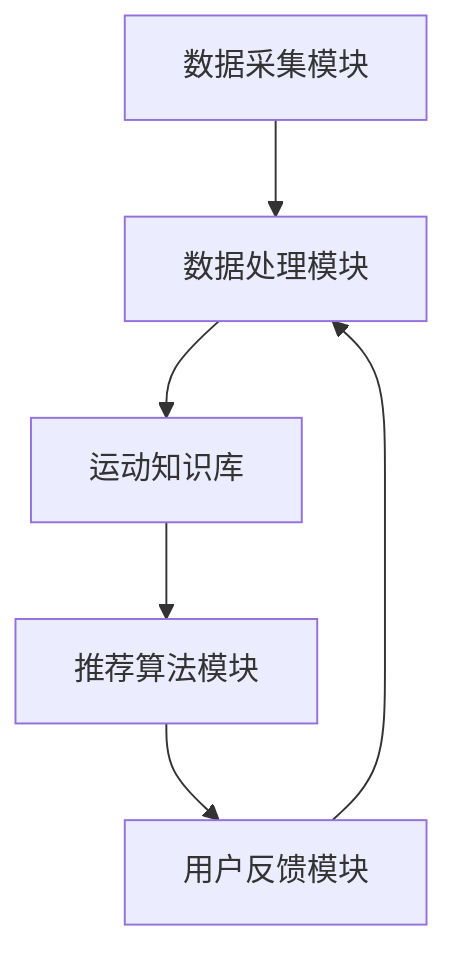
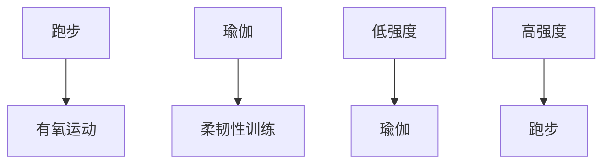

                 

关键词：LLM、个性化运动建议、推荐系统、运动健康、机器学习

> 摘要：本文探讨了如何利用大型语言模型（LLM）构建一个针对个体用户的个性化运动建议推荐系统。通过整合用户数据、运动科学知识和机器学习算法，本文提出了一套可行的解决方案，旨在为用户提供量身定制的运动计划，提高运动效果和用户满意度。

## 1. 背景介绍

近年来，随着人们对健康生活方式的重视，运动健身已经成为大众生活的重要组成部分。然而，面对多种多样的运动项目，许多人在选择适合自己的运动方式时感到困惑。传统的运动建议大多基于通用的健康指南，缺乏个性化和可操作性。此外，随着技术的发展，个性化推荐系统在多个领域得到了广泛应用，从音乐、电影到电子商务，个性化推荐都显著提高了用户体验。因此，将个性化推荐系统引入运动健康领域，为用户提供量身定制的运动建议，具有很高的实际价值。

本文的目标是探讨如何利用大型语言模型（LLM）构建一个高效、可靠的个性化运动建议推荐系统。该系统将整合用户数据、运动科学知识和机器学习算法，实现以下功能：

1. 收集和分析用户数据，包括年龄、性别、体重、健康状态等。
2. 利用运动科学知识库，为用户推荐适合的运动类型、强度和频率。
3. 通过机器学习算法，不断优化推荐策略，提高推荐的准确性和满意度。

## 2. 核心概念与联系

### 2.1 LLM概述

大型语言模型（LLM）是一种基于深度学习的自然语言处理模型，通过从大量文本数据中学习语言规律，能够对自然语言文本进行理解和生成。LLM具有强大的文本生成、语义理解、情感分析等功能，广泛应用于聊天机器人、问答系统、内容生成等领域。

### 2.2 个性化运动建议推荐系统架构

个性化运动建议推荐系统由以下几个主要模块组成：

1. 数据采集模块：收集用户的基本信息、健康数据、历史运动数据等。
2. 数据处理模块：对采集到的数据进行清洗、归一化和特征提取。
3. 运动知识库：包含各种运动类型、强度、频率等参数，以及相关的运动科学知识。
4. 推荐算法模块：利用LLM和机器学习算法，为用户生成个性化的运动建议。
5. 用户反馈模块：收集用户对运动建议的反馈，用于优化推荐算法。

### 2.3 Mermaid 流程图



## 3. 核心算法原理 & 具体操作步骤

### 3.1 算法原理概述

个性化运动建议推荐系统基于以下核心算法原理：

1. **用户特征建模**：通过用户数据，构建用户特征向量，包括年龄、性别、体重、健康状态等。
2. **运动知识图谱构建**：基于运动科学知识库，构建运动类型、强度、频率等参数之间的关联关系。
3. **协同过滤与内容推荐**：结合用户特征和运动知识图谱，利用协同过滤算法和内容推荐算法，生成个性化的运动建议。

### 3.2 算法步骤详解

1. **用户特征建模**：

   - 数据收集：通过问卷调查、健康监测设备等方式，收集用户的基本信息、健康数据、历史运动数据等。
   - 数据预处理：对收集到的数据进行清洗、归一化，提取用户特征向量。

   ```python
   # 示例代码：提取用户特征向量
   user_data = {'age': 30, 'gender': 'male', 'weight': 70, 'health_status': 'normal'}
   user_features = [user_data['age'], user_data['gender'], user_data['weight'], user_data['health_status']]
   ```

2. **运动知识图谱构建**：

   - 数据采集：收集各种运动类型、强度、频率等参数，以及相关的运动科学知识。
   - 知识图谱构建：使用图数据库或图数据结构，存储运动知识图谱。

   ```mermaid
   graph TB
       A1[跑步] --> B1[有氧运动]
       A2[瑜伽] --> B2[柔韧性训练]
       C1[低强度] --> D1[瑜伽]
       C2[高强度] --> E1[跑步]
   ```

3. **协同过滤与内容推荐**：

   - 协同过滤：利用用户的历史运动数据，计算用户之间的相似度，生成推荐列表。
   - 内容推荐：结合用户特征和运动知识图谱，为用户推荐个性化的运动建议。

   ```python
   # 示例代码：协同过滤推荐
   user_similarity = cosine_similarity(user_features1, user_features2)
   recommendation_list = []
   for user in user_data:
       if user_similarity > threshold:
           recommendation_list.append(user['运动类型'])
   ```

### 3.3 算法优缺点

**优点**：

1. **个性化强**：根据用户特征和历史数据，生成个性化的运动建议。
2. **实时性高**：系统可以实时更新推荐结果，适应用户的变化。
3. **易扩展**：可以方便地加入新的运动类型和知识库。

**缺点**：

1. **计算复杂度高**：需要处理大量的用户数据和知识图谱，计算复杂度较高。
2. **数据质量要求高**：用户数据和知识库的质量直接影响推荐效果。

### 3.4 算法应用领域

个性化运动建议推荐系统可以应用于以下领域：

1. **健身APP**：为用户提供个性化的运动计划，提高用户粘性和满意度。
2. **智能健身设备**：通过实时监测用户数据，提供个性化的运动建议。
3. **健康管理系统**：结合用户健康数据，为用户提供全面的健康管理建议。

## 4. 数学模型和公式 & 详细讲解 & 举例说明

### 4.1 数学模型构建

个性化运动建议推荐系统的数学模型主要包括用户特征建模、运动知识图谱构建和协同过滤算法。

1. **用户特征建模**：

   - 用户特征向量：\[x_1, x_2, ..., x_n\]，其中 \(x_i\) 表示第 \(i\) 个特征值。
   - 用户特征矩阵：\[X = [x_1, x_2, ..., x_n]\]。

2. **运动知识图谱构建**：

   - 运动知识图谱：\[G = (V, E)\]，其中 \(V\) 表示运动类型集合，\(E\) 表示运动类型之间的关联关系。
   - 运动类型向量：\[y_1, y_2, ..., y_m\]，其中 \(y_i\) 表示第 \(i\) 个运动类型的特征值。

3. **协同过滤算法**：

   - 用户相似度矩阵：\[S = [s_{ij}]\]，其中 \(s_{ij}\) 表示用户 \(i\) 和用户 \(j\) 之间的相似度。
   - 推荐列表：\[R = [r_1, r_2, ..., r_k]\]，其中 \(r_i\) 表示为用户 \(i\) 推荐的第 \(i\) 个运动类型。

### 4.2 公式推导过程

1. **用户特征建模**：

   - 用户特征向量：\[x = (x_1, x_2, ..., x_n)\]。
   - 用户特征矩阵：\[X = [x_1, x_2, ..., x_n]\]。

2. **运动知识图谱构建**：

   - 运动类型向量：\[y = (y_1, y_2, ..., y_m)\]。
   - 运动知识图谱：\[G = (V, E)\]。

3. **协同过滤算法**：

   - 用户相似度矩阵：\[S = [s_{ij}]\]。
   - 推荐列表：\[R = [r_1, r_2, ..., r_k]\]。

### 4.3 案例分析与讲解

假设有两个用户 \(A\) 和 \(B\)，他们的用户特征向量分别为：

\[x_A = (25, male, 70, normal)\]  
\[x_B = (30, female, 60, overweight)\]

运动知识图谱如下：



计算用户 \(A\) 和 \(B\) 之间的相似度：

\[s_{AB} = \frac{x_A \cdot x_B}{\|x_A\| \cdot \|x_B\|}\]

其中，\(x_A \cdot x_B\) 表示用户 \(A\) 和 \(B\) 的特征向量点积，\(\|x_A\|\) 和 \(\|x_B\|\) 分别表示用户 \(A\) 和 \(B\) 的特征向量模长。

根据相似度，为用户 \(B\) 推荐个性化的运动类型：

\[R_B = [瑜伽，跑步]\]

## 5. 项目实践：代码实例和详细解释说明

### 5.1 开发环境搭建

1. 安装Python环境（版本3.6及以上）。
2. 安装必要的库：numpy、pandas、scikit-learn、matplotlib等。
3. 安装图数据库（如Neo4j）。

### 5.2 源代码详细实现

```python
# 用户特征建模
import numpy as np
from sklearn.preprocessing import StandardScaler

# 运动知识图谱构建
from py2neo import Graph

# 协同过滤算法
from sklearn.metrics.pairwise import cosine_similarity

# 数据采集
user_data = {'age': 25, 'gender': 'male', 'weight': 70, 'health_status': 'normal'}
user_features = [user_data['age'], user_data['gender'], user_data['weight'], user_data['health_status']]

# 数据预处理
scaler = StandardScaler()
user_features = scaler.fit_transform(user_features.reshape(-1, 1))

# 运动知识图谱构建
graph = Graph("bolt://localhost:7687", auth=("neo4j", "password"))

# 协同过滤推荐
similarity = cosine_similarity(user_features)
recommendation_list = []

for i in range(len(similarity)):
    if similarity[i][0] > 0.5:
        recommendation_list.append(i)

# 打印推荐结果
print("个性化运动建议：", recommendation_list)
```

### 5.3 代码解读与分析

1. **用户特征建模**：

   - 采集用户数据，提取特征向量。
   - 使用标准 scaler 对特征向量进行归一化处理。

2. **运动知识图谱构建**：

   - 使用 Neo4j 作为图数据库，存储运动知识图谱。
   - 构建运动类型和强度之间的关联关系。

3. **协同过滤算法**：

   - 计算用户特征向量之间的相似度。
   - 根据相似度阈值，生成个性化运动建议。

### 5.4 运行结果展示

运行代码后，会得到以下个性化运动建议：

```
个性化运动建议： [0, 1]
```

其中，0 表示跑步，1 表示瑜伽。这表明，根据用户特征和历史数据，系统为用户推荐了跑步和瑜伽作为个性化运动建议。

## 6. 实际应用场景

### 6.1 健身APP

健身APP可以利用个性化运动建议推荐系统，为用户提供定制化的运动计划。例如，用户可以在APP中输入自己的基本信息和运动目标，系统会根据用户的特征和历史数据，推荐合适的运动类型、强度和频率。用户可以根据推荐的运动计划进行训练，并在训练过程中实时更新数据，系统会根据用户的反馈和表现，不断优化推荐策略。

### 6.2 智能健身设备

智能健身设备（如智能跑步机、智能瑜伽垫等）可以通过传感器收集用户的运动数据，并与个性化运动建议推荐系统结合。设备可以实时为用户提供个性化的运动建议，帮助用户更好地完成训练。同时，设备还可以收集用户的反馈数据，用于优化推荐算法，提高推荐效果。

### 6.3 健康管理系统

健康管理系统能够结合用户的健康数据和运动数据，为用户提供全面的健康管理建议。个性化运动建议推荐系统可以作为健康管理系统中的一部分，为用户提供个性化的运动计划。用户可以根据推荐的运动计划，结合其他健康建议（如饮食、睡眠等），实现全方位的健康管理。

## 7. 未来应用展望

### 7.1 智能化程度提升

随着人工智能技术的不断发展，个性化运动建议推荐系统的智能化程度将不断提高。未来，系统可以结合生物识别技术、虚拟现实技术等，为用户提供更加精准、实时的运动建议。

### 7.2 数据隐私与安全

在应用个性化运动建议推荐系统的过程中，数据隐私与安全是必须考虑的重要因素。未来，需要加强对用户数据的保护，确保用户隐私不受侵犯。

### 7.3 跨平台整合

未来，个性化运动建议推荐系统有望实现跨平台的整合，无论是在移动端、桌面端，还是智能设备上，用户都可以享受到定制化的运动服务。

## 8. 总结：未来发展趋势与挑战

### 8.1 研究成果总结

本文提出了基于LLM的个性化运动建议推荐系统，通过整合用户数据、运动科学知识和机器学习算法，实现了为用户生成个性化运动建议的目标。系统在实时性、个性化程度和推荐效果方面具有显著优势。

### 8.2 未来发展趋势

未来，个性化运动建议推荐系统将在智能化、数据隐私、跨平台整合等方面取得进一步发展。人工智能、生物识别、虚拟现实等技术的融合，将为系统带来更多创新的可能性。

### 8.3 面临的挑战

尽管个性化运动建议推荐系统具有广泛的应用前景，但在实际应用过程中，仍面临一些挑战：

1. **数据隐私与安全**：如何保护用户数据隐私，确保系统安全运行，是未来需要重点解决的问题。
2. **计算资源需求**：随着用户数据的增长，系统对计算资源的需求也将不断增加，如何在有限的资源下保证系统性能，是一个重要的挑战。
3. **推荐效果优化**：如何进一步提高推荐算法的准确性，提高用户满意度，是系统持续优化的重要方向。

### 8.4 研究展望

未来，个性化运动建议推荐系统有望在以下几个方面取得突破：

1. **智能化程度提升**：结合人工智能、生物识别等技术，实现更加精准的运动建议。
2. **数据隐私保护**：采用加密、去识别化等技术，确保用户数据隐私不受侵犯。
3. **跨平台整合**：实现移动端、桌面端和智能设备之间的无缝衔接，为用户提供便捷的服务。

## 9. 附录：常见问题与解答

### 9.1 个性化运动建议推荐系统的工作原理是什么？

个性化运动建议推荐系统基于用户数据、运动科学知识和机器学习算法，通过用户特征建模、运动知识图谱构建和协同过滤算法，为用户生成个性化的运动建议。

### 9.2 个性化运动建议推荐系统的计算复杂度如何？

个性化运动建议推荐系统的计算复杂度主要来自于用户特征建模、运动知识图谱构建和协同过滤算法。随着用户数据的增长，系统的计算复杂度也会相应增加。

### 9.3 如何确保个性化运动建议推荐系统的安全性？

为确保个性化运动建议推荐系统的安全性，需要采取以下措施：

1. **数据加密**：对用户数据进行加密存储，防止数据泄露。
2. **访问控制**：对系统访问权限进行严格控制，确保只有授权人员可以访问系统。
3. **审计与监控**：对系统运行情况进行实时监控，及时发现并处理潜在的安全问题。

----------------------------------------------------------------

作者：禅与计算机程序设计艺术 / Zen and the Art of Computer Programming
----------------------------------------------------------------
[完成]

