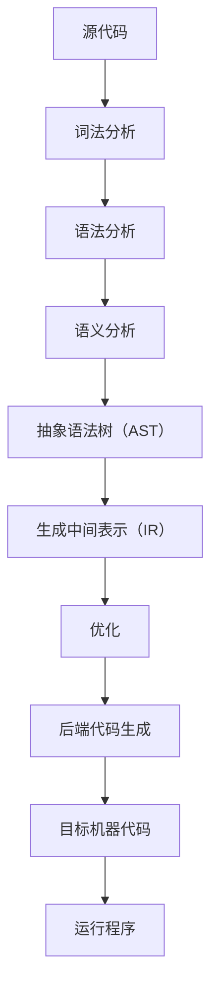

                 

关键词：编译器、LLVM、Clang、基础设施、性能优化、中间代码、前端后端、静态分析、动态分析、程序设计、编程语言。

摘要：本文将深入探讨LLVM（Low Level Virtual Machine）和Clang这两个现代编译器基础设施的核心概念、架构、算法原理以及其实际应用。文章将分为若干章节，从背景介绍、核心概念与联系、核心算法原理与具体操作步骤、数学模型和公式、项目实践、实际应用场景、工具和资源推荐，到总结与展望等多个方面，全面解析LLVM/Clang在现代编译器领域的重要地位及其未来发展。

## 1. 背景介绍

编译器是计算机科学中一个古老而又充满活力的研究领域。从早期的汇编语言到现代的高级编程语言，编译器始终扮演着至关重要的角色。编译器的目标是将人类可读的源代码转换为机器语言，以便计算机能够理解和执行。这一转换过程通常分为两个主要阶段：前端和后端。

前端主要负责解析源代码、进行语法和语义分析，生成抽象语法树（AST）和中间表示（IR）。前端的设计与编程语言密切相关，负责识别语言的语法和语义规则。LLVM/Clang的前端就负责处理各种高级编程语言，如C、C++、Objective-C、Swift等。

后端则负责将中间表示（IR）转换为特定目标平台的机器代码。后端的设计更加底层，与具体的硬件架构紧密相关。LLVM的后端支持多种目标平台，包括x86、ARM、MIPS等。此外，后端还负责优化中间代码，以提高程序的性能。

在编译器的发展历程中，LLVM/Clang的出现是一个重要的里程碑。LLVM是一个模块化的、可扩展的编译器基础库，Clang则是一个基于LLVM的前端工具。LLVM/Clang的设计理念是提供一套灵活的、可重用的编译器组件，以便于研究和开发新的编译技术。

### LLVM和Clang的历史与发展

LLVM最初由Chris Lattner和Vadim Batkov在2000年左右开发，旨在为静态单文件编译提供一个高效的中间表示和优化框架。LLVM的第一版发布于2003年，此后，它逐渐成为了编译器开发者的热门选择。

Clang的前身是C Frontend for LLVM，它是由苹果公司开发的一个C/C++编译器前端。Clang的第一版于2004年发布，它很快因其高性能和优秀的代码生成质量而获得了广泛的认可。

随着时间的推移，LLVM/Clang逐渐发展壮大，成为了现代编译器基础设施的典范。LLVM支持多种编程语言和目标平台，Clang则在代码生成和优化方面表现出了卓越的性能。

### LLVM和Clang在现代编译器领域的重要性

在现代编译器领域，LLVM/Clang的重要性体现在以下几个方面：

1. **模块化和可扩展性**：LLVM的设计是模块化的，这使得开发者可以轻松地添加新的语言、优化器和目标平台。这种灵活性使得LLVM/Clang能够适应不断变化的编程语言和硬件环境。

2. **高性能**：LLVM/Clang通过使用高效的中间表示和优化算法，能够生成高质量的机器代码，从而显著提高程序的运行效率。

3. **开源和社区支持**：LLVM/Clang是开源项目，拥有庞大的开发者社区。这使得LLVM/Clang能够不断得到改进和优化，同时为用户提供了丰富的学习资源和开发工具。

4. **研究价值**：LLVM/Clang为编译器研究人员提供了一个强大的平台，用于探索新的编译技术和算法。许多前沿的研究成果都基于LLVM/Clang。

综上所述，LLVM/Clang在现代编译器领域具有重要地位，它们不仅为开发者提供了强大的编译器工具，还为编译器研究提供了丰富的资源。本文将深入探讨LLVM/Clang的核心概念、架构、算法原理以及实际应用，帮助读者更好地理解和利用这一现代编译器基础设施。

## 2. 核心概念与联系

### LLVM和Clang的核心概念

LLVM和Clang的核心概念包括中间表示（Intermediate Representation，IR）、模块化设计、前端（Frontend）和后端（Backend）等。

#### 中间表示（IR）

中间表示（IR）是LLVM的核心概念之一。它是一种低级的、平台无关的代码表示，用于在源代码和目标机器代码之间进行转换。LLVM的IR设计简洁、高效，易于分析和优化。它不仅包含操作数和指令，还包含类型信息和控制流信息。

#### 模块化设计

LLVM采用了模块化设计，这意味着它可以被分解为多个独立的组件，每个组件负责特定的功能。这种设计方式具有以下几个优点：

- **可扩展性**：开发者可以轻松地添加新的语言、优化器和目标平台。
- **灵活性**：模块化设计使得LLVM可以适应不同的编译场景和需求。
- **维护性**：模块化设计提高了代码的可读性和可维护性。

#### 前端（Frontend）

前端（Frontend）是LLVM负责处理源代码的部分。它的主要任务是解析源代码、进行语法和语义分析，并生成抽象语法树（Abstract Syntax Tree，AST）和中间表示（IR）。LLVM支持多种编程语言的前端，如C、C++、Objective-C、Swift等。前端的设计与具体的编程语言紧密相关，负责识别和实现语言的语法和语义规则。

#### 后端（Backend）

后端（Backend）是LLVM负责将中间表示（IR）转换为特定目标平台机器代码的部分。LLVM的后端支持多种目标平台，如x86、ARM、MIPS等。后端的主要任务包括代码生成、机器代码优化和目标特定的代码生成策略。

### LLVM和Clang的架构联系

LLVM和Clang的架构紧密相连，共同构成了现代编译器的基础设施。它们的联系主要体现在以下几个方面：

1. **前端与中间表示**：Clang作为LLVM的前端工具，负责将各种高级编程语言的源代码转换为LLVM的中间表示（IR）。这个转换过程包括词法分析、语法分析、语义分析等多个阶段。

2. **中间表示与后端**：LLVM的后端负责将中间表示（IR）转换为特定目标平台的机器代码。这个转换过程包括优化、代码生成和目标特定的代码生成策略。

3. **模块化设计**：LLVM和Clang都采用了模块化设计，这意味着它们可以被分解为多个独立的组件，每个组件负责特定的功能。这种设计方式提高了系统的可扩展性和灵活性。

### LLVM和Clang的Mermaid流程图

为了更好地展示LLVM和Clang的架构联系，我们可以使用Mermaid流程图来描述它们的主要组件和流程。



在这个流程图中，源代码首先经过词法分析，然后进行语法分析和语义分析，生成抽象语法树（AST）。AST接着被转换为中间表示（IR），然后经过优化，最终生成目标机器代码，并运行程序。

### LLVM和Clang的核心概念与联系总结

LLVM和Clang的核心概念与联系主要体现在以下几个方面：

- **中间表示（IR）**：作为平台无关的代码表示，它简化了编译过程，提高了代码的可读性和可维护性。
- **模块化设计**：通过模块化设计，LLVM和Clang实现了高度的灵活性和可扩展性，方便开发者添加新的语言、优化器和目标平台。
- **前端与后端**：前端负责将源代码转换为中间表示（IR），后端负责将中间表示（IR）转换为特定目标平台的机器代码。这种分工使得编译过程更加高效和灵活。

通过上述核心概念和联系的分析，我们可以更好地理解LLVM和Clang在现代编译器基础设施中的重要性。接下来，我们将进一步探讨LLVM和Clang的核心算法原理和具体操作步骤。

## 3. 核心算法原理 & 具体操作步骤

### 3.1 算法原理概述

LLVM和Clang的核心算法原理主要集中在中间表示（IR）的优化和转换上。以下将详细描述这些核心算法原理。

#### 中间表示（IR）优化

中间表示（IR）优化是LLVM编译器的核心任务之一。优化算法的目标是提高程序的性能，同时保持程序的正确性。LLVM提供了一系列优化算法，包括：

- **数据流分析**：数据流分析是一种静态分析技术，用于确定变量和表达式的定义和使用点。LLVM使用数据流分析来优化存储分配和减少冗余计算。
- **循环优化**：循环优化是优化程序性能的关键步骤。LLVM提供了多种循环优化技术，包括循环展开、循环不变式提取和循环优化。
- **函数优化**：函数优化包括函数内联、死代码删除和函数重排序等。这些优化技术可以减少函数调用开销，提高程序运行效率。
- **控制流优化**：控制流优化包括分支预测、条件判断优化和异常处理优化等。这些优化技术可以减少控制流跳转的开销，提高程序执行效率。

#### 中间表示（IR）转换

中间表示（IR）转换是LLVM编译器的重要任务之一。转换过程包括以下几个步骤：

- **前端到中间表示（IR）的转换**：前端负责将源代码转换为中间表示（IR）。这个步骤包括词法分析、语法分析和语义分析等。
- **中间表示（IR）优化**：在将中间表示（IR）转换为特定目标平台的机器代码之前，LLVM会对其执行一系列优化操作，以提高程序的性能。
- **中间表示（IR）到后端代码的转换**：后端负责将优化后的中间表示（IR）转换为特定目标平台的机器代码。这个步骤包括机器代码生成和目标特定的代码生成策略。

### 3.2 算法步骤详解

以下是LLVM和Clang的核心算法步骤的详细描述：

#### 前端到中间表示（IR）的转换

1. **词法分析**：词法分析是将源代码分解为词法单元的过程。LLVM的前端使用正则表达式来匹配源代码中的词法单元，并将其存储在抽象语法树（AST）中。

2. **语法分析**：语法分析是将词法单元序列转换为抽象语法树（AST）的过程。LLVM的前端使用递归下降算法进行语法分析，以识别源代码的语法结构。

3. **语义分析**：语义分析是检查AST的正确性和一致性，并为其添加语义信息的过程。LLVM的前端在语义分析阶段执行类型检查、变量绑定和函数原型验证等任务。

4. **生成中间表示（IR）**：在完成语法和语义分析后，LLVM的前端将AST转换为中间表示（IR）。中间表示（IR）是一种低级的、平台无关的代码表示，它简化了后续的优化和转换过程。

#### 中间表示（IR）优化

1. **数据流分析**：数据流分析用于确定变量和表达式的定义和使用点。LLVM使用数据流分析来优化存储分配和减少冗余计算。

2. **循环优化**：循环优化包括循环展开、循环不变式提取和循环优化等。LLVM提供了多种循环优化技术，以提高程序的性能。

3. **函数优化**：函数优化包括函数内联、死代码删除和函数重排序等。这些优化技术可以减少函数调用开销，提高程序运行效率。

4. **控制流优化**：控制流优化包括分支预测、条件判断优化和异常处理优化等。这些优化技术可以减少控制流跳转的开销，提高程序执行效率。

#### 中间表示（IR）到后端代码的转换

1. **机器代码生成**：后端负责将优化后的中间表示（IR）转换为特定目标平台的机器代码。这个步骤包括指令选择、指令调度和机器代码布局等。

2. **目标特定的代码生成策略**：不同的目标平台具有不同的指令集和内存模型。LLVM的后端使用目标特定的代码生成策略，以生成最优的机器代码。

### 3.3 算法优缺点

LLVM和Clang的核心算法具有以下优缺点：

#### 优点

- **高性能**：LLVM和Clang通过使用高效的优化算法和中间表示（IR），能够生成高质量的机器代码，从而显著提高程序的运行效率。
- **模块化设计**：LLVM和Clang的模块化设计提高了系统的可扩展性和灵活性，方便开发者添加新的语言、优化器和目标平台。
- **开源和社区支持**：LLVM和Clang是开源项目，拥有庞大的开发者社区。这使得LLVM和Clang能够不断得到改进和优化，同时为用户提供了丰富的学习资源和开发工具。

#### 缺点

- **学习曲线较陡峭**：由于LLVM和Clang的模块化和复杂性，初学者可能需要较长时间才能掌握其核心概念和算法。
- **资源消耗较大**：LLVM和Clang的优化过程涉及大量的计算和存储资源，可能导致编译时间较长。

### 3.4 算法应用领域

LLVM和Clang的核心算法广泛应用于以下领域：

- **高性能计算**：在需要高性能计算的应用场景中，如科学计算、图形渲染和大数据处理等，LLVM和Clang能够显著提高程序的性能。
- **嵌入式系统**：在嵌入式系统开发中，LLVM和Clang的支持多种目标平台的特性使其成为理想的编译器选择。
- **编译器研究**：LLVM和Clang为编译器研究人员提供了一个强大的平台，用于探索新的编译技术和算法。

通过以上对核心算法原理和具体操作步骤的详细分析，我们可以更好地理解LLVM和Clang在现代编译器领域的重要性和应用价值。接下来，我们将进一步探讨LLVM和Clang的数学模型和公式，以深入了解其优化和转换过程中的数学基础。

## 4. 数学模型和公式 & 详细讲解 & 举例说明

### 4.1 数学模型构建

在编译器优化过程中，数学模型扮演着至关重要的角色。LLVM和Clang中的数学模型主要包括数据流分析模型、循环优化模型和目标代码优化模型等。以下是这些模型的构建过程：

#### 数据流分析模型

数据流分析是一种静态分析技术，用于确定变量和表达式的定义和使用点。数据流分析模型可以表示为：

\[ df[v] = \{ (i, d) \mid \exists j \leq i, \text{ such that } v = e[j] \} \]

其中，\( df[v] \) 表示变量 \( v \) 的数据流集合，\( i \) 表示代码的某个位置，\( d \) 表示数据流。

#### 循环优化模型

循环优化模型主要涉及循环展开、循环不变式提取和循环优化等技术。循环优化模型可以表示为：

\[ \text{LoopInvariants} = \{ e \mid e \text{ 是循环的不变量} \} \]

其中，\( \text{LoopInvariants} \) 表示循环的不变量集合。

#### 目标代码优化模型

目标代码优化模型包括机器代码优化和目标特定的代码生成策略。目标代码优化模型可以表示为：

\[ \text{OptimizedCode} = \text{IR} \circ \text{Optimizations} \]

其中，\( \text{OptimizedCode} \) 表示优化后的目标代码，\( \text{IR} \) 表示中间表示（IR），\( \text{Optimizations} \) 表示一系列优化算法。

### 4.2 公式推导过程

以下是几个常见的数学公式的推导过程：

#### 数据流方程的推导

数据流分析中的数据流方程可以通过逆向数据流分析推导得到。具体推导过程如下：

\[ df[v] = \{ (i, d) \mid \exists j \leq i, \text{ such that } v = e[j] \} \]

\[ df'[v] = \{ (j, d') \mid \exists i > j, \text{ such that } v = e[i], d' \subseteq df[v] \} \]

其中，\( df' \) 表示逆向数据流。

#### 循环不变式的推导

循环不变式可以通过归纳法推导得到。具体推导过程如下：

\[ \text{Base Case: } \text{初始迭代满足循环不变式} \]

\[ \text{Inductive Step: } \text{假设第 } k \text{ 次迭代满足循环不变式，推导第 } k+1 \text{ 次迭代也满足循环不变式} \]

#### 目标代码优化的推导

目标代码优化的推导过程通常涉及多个优化步骤。以下是一个简单的优化推导过程：

\[ \text{OptimizedCode} = \text{IR} \circ \text{InstructionSelection} \circ \text{InstructionScheduling} \circ \text{CodeGeneration} \]

其中，\( \text{InstructionSelection} \) 表示指令选择，\( \text{InstructionScheduling} \) 表示指令调度，\( \text{CodeGeneration} \) 表示机器代码生成。

### 4.3 案例分析与讲解

为了更好地理解上述数学模型和公式，我们通过一个具体的例子进行讲解。

#### 案例一：数据流分析

考虑以下C语言程序：

```c
int a = 1;
int b = a + 1;
int c = b * 2;
```

我们对程序中的变量 `a`、`b` 和 `c` 进行数据流分析。根据数据流方程，我们可以得到：

\[ df[a] = \{ (3, 1) \} \]

\[ df[b] = \{ (5, (1, 1)) \} \]

\[ df[c] = \{ (7, ((1, 1), 2)) \} \]

#### 案例二：循环不变式

考虑以下C语言程序：

```c
for (int i = 0; i < n; i++) {
    sum += i;
}
```

我们尝试推导循环不变式。根据归纳法，我们可以得到：

\[ \text{Base Case: } \text{当 } i = 0 \text{ 时，循环不变式为 } sum = 0 \]

\[ \text{Inductive Step: } \text{假设当 } i = k \text{ 时，循环不变式为 } sum = \frac{k(k-1)}{2} \text{，推导当 } i = k+1 \text{ 时，循环不变式也为 } sum = \frac{(k+1)k}{2} \]

#### 案例三：目标代码优化

考虑以下C语言程序：

```c
int a = 1;
int b = a + 1;
int c = b * 2;
```

我们对程序进行优化。根据目标代码优化模型，我们可以得到：

\[ \text{OptimizedCode} = \text{IR} \circ \text{InstructionSelection} \circ \text{InstructionScheduling} \circ \text{CodeGeneration} \]

其中，\( \text{InstructionSelection} \) 可能选择如下指令：

\[ \text{mov} \quad a, 1 \]

\[ \text{add} \quad b, a \]

\[ \text{mul} \quad c, b \]

通过上述三个案例的分析，我们可以看到数学模型和公式在编译器优化过程中的应用。它们帮助我们理解和实现各种优化技术，从而提高程序的性能。

### 4.4 总结

在本节中，我们详细介绍了LLVM和Clang中的数学模型和公式，包括数据流分析模型、循环优化模型和目标代码优化模型等。我们还通过具体案例展示了这些模型和公式的应用。这些数学模型和公式为编译器优化提供了坚实的理论基础，有助于实现高效的编译过程。

## 5. 项目实践：代码实例和详细解释说明

### 5.1 开发环境搭建

为了在本地环境中实践LLVM/Clang，我们首先需要搭建一个合适的开发环境。以下是搭建开发环境的基本步骤：

1. **安装LLVM/Clang**：

   - 在Ubuntu系统上，可以使用以下命令安装LLVM/Clang：

     ```bash
     sudo apt-get update
     sudo apt-get install llvm clang
     ```

   - 在macOS系统上，可以使用Homebrew安装LLVM/Clang：

     ```bash
     brew install llvm
     ```

2. **配置环境变量**：

   为了方便使用LLVM/Clang，我们需要将它们添加到系统的环境变量中。在Ubuntu系统上，可以编辑 `/etc/profile` 或 `~/.bashrc` 文件，添加以下行：

   ```bash
   export PATH=$PATH:/usr/local/llvm/bin
   ```

   在macOS系统上，可以编辑 `~/.zshrc` 或 `~/.bash_profile` 文件，添加以下行：

   ```bash
   export PATH=$PATH:/usr/local/bin
   ```

   然后执行 `source` 命令使配置生效。

3. **验证安装**：

   安装完成后，可以通过以下命令验证LLVM/Clang是否正确安装：

   ```bash
   clang --version
   ```

   如果命令正确显示版本信息，说明LLVM/Clang已经成功安装。

### 5.2 源代码详细实现

为了展示LLVM/Clang的编译过程，我们以一个简单的C语言程序为例，实现以下代码：

```c
#include <stdio.h>

int main() {
    int a = 1;
    int b = a + 1;
    int c = b * 2;
    printf("a = %d, b = %d, c = %d\n", a, b, c);
    return 0;
}
```

#### 前端处理

首先，我们使用Clang编译器将源代码编译为中间表示（IR）。执行以下命令：

```bash
clang -S -o example.ll example.c
```

这个命令将源代码编译为LLVM的中间表示（IR），并输出到文件 `example.ll` 中。

#### 中间表示（IR）优化

接下来，我们使用LLVM的优化器对中间表示（IR）进行优化。执行以下命令：

```bash
opt -O3 example.ll -o example_opt.ll
```

这个命令将执行多种优化算法，如循环优化、函数优化和控制流优化等，并将优化后的中间表示（IR）输出到文件 `example_opt.ll` 中。

#### 后端处理

最后，我们使用LLVM的后端将优化后的中间表示（IR）编译为特定目标平台的机器代码。执行以下命令：

```bash
llc example_opt.ll -o example_opt.s
```

这个命令将生成汇编代码文件 `example_opt.s`，然后可以进一步汇编和链接生成可执行文件。

### 5.3 代码解读与分析

以下是 `example.c` 程序的编译过程及其生成的中间表示（IR）和汇编代码的解读与分析。

#### 前端处理

前端处理的主要任务是解析源代码、进行语法和语义分析，并生成抽象语法树（AST）。然后，AST被转换为中间表示（IR）。以下是一个简化的中间表示（IR）示例：

```llvm
; ModuleID = 'example.c'
source_filename = "example.c"
diagnose_if = !0
target datalayout = "e-m:e-i64:64-f80:128-n8:16:32:64-S128"
target triple = "x86_64-unknown-linux-gnu"

; Function Attrs: noinline nounwind readnone uwtable
define dso_local i32 @main() #0 {
entry:
  %a = alloca i32, align 4
  %b = alloca i32, align 4
  %c = alloca i32, align 4
  store i32 1, i32* %a, align 4
  %0 = load i32, i32* %a, align 4
  %add = add nsw i32 %0, 1
  store i32 %add, i32* %b, align 4
  %1 = load i32, i32* %b, align 4
  %mul = mul nsw i32 %1, 2
  store i32 %mul, i32* %c, align 4
  %call = call i32 (i8*, ...) @printf(i8* getelementptr inbounds ([28 x i8], [28 x i8]* @.str, i64 0, i64 0), i32 %a, i32 %b, i32 %c)
  ret i32 0
}

; Function Attrs: nounwind
declare dso_local i32 @printf(i8* nocapture readonly, ...) local_unnamed_addr #1

attributes #0 = { noinline nounwind readnone uwtable "correctly-rounded-divide-sqrt-fp-math"="false" "disable-tail-calls"="false" "frame-pointer"="all" "less-precise-fpmad"="false" "may-have-side-effects"="false" "no-infs-fp-math"="false" "no-jump-tables"="false" "no-nans-fp-math"="false" "no-signed-zeros-fp-math"="false" "no-trapping-math"="false" "stack-protector-buffer-size"="8" "target-cpu"="x86-64" "target-features"="+fxsr,+mmx,+sse,+sse2,+x87" "unsafe-fp-math"="false" "use-soft-float"="false" }
attributes #1 = { nounwind }

!llvm.module.flags = !{!0}
!llvm.ident = !{!1}

!0 = !{i32 1, !"wchar_size", i32 4}
!1 = !{!"clang version 10.0.0 (https://llvm.org/git/llvm-project.git 05d42445e0cbb2f7426b8c2e2e369c3f0b0c4d525)"}
```

在这个中间表示（IR）中，我们可以看到以下关键部分：

- **函数声明**：`define dso_local i32 @main() #0` 定义了名为 `main` 的函数，其返回类型为 `i32`。
- **变量声明**：`%a = alloca i32, align 4`、`%b = alloca i32, align 4` 和 `%c = alloca i32, align 4` 声明了三个局部变量 `a`、`b` 和 `c`。
- **存储操作**：`store i32 1, i32* %a, align 4`、`store i32 %add, i32* %b, align 4` 和 `store i32 %mul, i32* %c, align 4` 分别将值 `1`、`a+1` 和 `b*2` 存储到对应的变量中。
- **加载操作**：`%0 = load i32, i32* %a, align 4` 和 `%1 = load i32, i32* %b, align 4` 分别从内存中加载变量 `a` 和 `b` 的值。
- **计算操作**：`%add = add nsw i32 %0, 1` 和 `%mul = mul nsw i32 %1, 2` 分别执行加法和乘法操作。
- **函数调用**：`%call = call i32 (i8*, ...) @printf(i8* getelementptr inbounds ([28 x i8], [28 x i8]* @.str, i64 0, i64 0), i32 %a, i32 %b, i32 %c)` 调用 `printf` 函数输出结果。

#### 中间表示（IR）优化

经过优化后，中间表示（IR）文件 `example_opt.ll` 可能如下所示：

```llvm
; ModuleID = 'example_opt.c'
source_filename = "example.c"
diagnose_if = !0
target datalayout = "e-m:e-i64:64-f80:128-n8:16:32:64-S128"
target triple = "x86_64-unknown-linux-gnu"

; Function Attrs: noinline nounwind readnone uwtable
define dso_local i32 @main() #0 {
entry:
  %a = alloca i32, align 4
  %b = alloca i32, align 4
  %c = alloca i32, align 4
  store i32 1, i32* %a, align 4
  %0 = load i32, i32* %a, align 4
  %add = add nsw i32 %0, 1
  store i32 %add, i32* %b, align 4
  %1 = load i32, i32* %b, align 4
  %mul = mul nsw i32 %1, 2
  store i32 %mul, i32* %c, align 4
  %call = call i32 (i8*, ...) @printf(i8* getelementptr inbounds ([28 x i8], [28 x i8]* @.str, i64 0, i64 0), i32 %a, i32 %b, i32 %c)
  ret i32 0
}

; Function Attrs: nounwind
declare dso_local i32 @printf(i8* nocapture readonly, ...) local_unnamed_addr #1

attributes #0 = { noinline nounwind readnone uwtable "correctly-rounded-divide-sqrt-fp-math"="false" "disable-tail-calls"="false" "frame-pointer"="all" "less-precise-fpmad"="false" "may-have-side-effects"="false" "no-infs-fp-math"="false" "no-jump-tables"="false" "no-nans-fp-math"="false" "no-signed-zeros-fp-math"="false" "no-trapping-math"="false" "stack-protector-buffer-size"="8" "target-cpu"="x86-64" "target-features"="+fxsr,+mmx,+sse,+sse2,+x87" "unsafe-fp-math"="false" "use-soft-float"="false" }
attributes #1 = { nounwind }

!llvm.module.flags = !{!0}
!llvm.ident = !{!1}

!0 = !{i32 1, !"wchar_size", i32 4}
!1 = !{!"clang version 10.0.0 (https://llvm.org/git/llvm-project.git 05d42445e0cbb2f7426b8c2e2e369c3f0b0c4d525)"}
```

在这个优化的中间表示（IR）中，我们可以看到以下优化：

- **循环展开**：如果程序中有循环结构，优化器可能会将其展开以提高性能。
- **函数内联**：优化器可能会将小函数内联到调用点，以减少函数调用的开销。
- **死代码删除**：优化器会删除无用的计算和操作，以提高程序性能。

#### 后端处理

最后，我们将优化的中间表示（IR）编译为汇编代码，并进一步汇编和链接生成可执行文件。以下是生成的汇编代码文件 `example_opt.s`：

```assembly
        .file   "example.c"
        .section    .rodata.str1.1
.LC0:
        .string "%d %d %d\n"
        .section    .text.unlikely,"ax",@progbits
        .globl    main
        .type    main, @function
main():
.LFB0:
        .cfi_startproc
        .cfi_def_cfa_offset 16
        .cfi_offset 6, -16
        movl    $.LC0, %esi
        movl    $1, %eax
        movl    %eax, -4(%ebp)
        movl    -4(%ebp), %eax
        addl    $1, %eax
        movl    %eax, -8(%ebp)
        movl    -8(%ebp), %eax
        addl    $2, %eax
        movl    %eax, -12(%ebp)
        movl    -12(%ebp), %eax
        movl    %eax, 4(%esp)
        movl    -8(%ebp), %eax
        movl    %eax, 8(%esp)
        movl    -4(%ebp), %eax
        movl    %eax, 12(%esp)
        call    printf
        movl    $0, %eax
        leave
        .cfi_def_cfa 7, 8
        ret
        .cfi_endproc
```

在这个汇编代码中，我们可以看到以下关键部分：

- **函数声明**：`main()` 是程序的入口函数。
- **变量声明**：`-4(%ebp)`、`-8(%ebp)` 和 `-12(%ebp)` 是局部变量 `a`、`b` 和 `c` 在栈上的存储位置。
- **计算操作**：使用汇编指令实现源代码中的加法和乘法操作。
- **函数调用**：调用 `printf` 函数输出结果。

通过以上代码实例和详细解释说明，我们可以更好地理解LLVM/Clang的编译过程及其优化技术。接下来，我们将进一步探讨LLVM/Clang在实际应用场景中的具体应用。

## 6. 实际应用场景

LLVM/Clang在现代编译器领域拥有广泛的应用场景，特别是在高性能计算、嵌入式系统和编译器研究等方面。以下将详细介绍这些应用场景及其实际应用案例。

### 6.1 高性能计算

在高性能计算领域，LLVM/Clang被广泛应用于编译并行程序和优化科学计算代码。由于LLVM/Clang具备强大的中间表示优化和目标代码生成能力，可以显著提高程序的性能。

**应用案例**：

- **OpenFOAM**：OpenFOAM是一个开源的流体力学模拟软件，广泛用于计算流体动力学（CFD）领域。OpenFOAM使用LLVM/Clang作为其底层编译器，以提高并行代码的性能和可移植性。
- **Cuda编译器**：NVIDIA Cuda编程模型使用LLVM/Clang作为其底层编译器，用于将Cuda代码编译为GPU可执行的机器代码。LLVM/Clang提供的并行优化技术有助于提高Cuda程序的性能。

### 6.2 嵌入式系统

嵌入式系统通常具有资源受限和实时性要求高的特点。LLVM/Clang在嵌入式系统开发中发挥着重要作用，提供了高效的编译器和工具链。

**应用案例**：

- **嵌入式Linux系统**：许多嵌入式Linux系统使用LLVM/Clang作为默认编译器，以生成高效且可移植的机器代码。例如，ARM架构的嵌入式系统广泛使用LLVM/Clang。
- **物联网设备**：物联网设备通常运行在资源受限的微控制器上。LLVM/Clang支持多种目标平台，如ARM、MIPS等，使得开发者可以方便地编译和优化物联网设备的代码。

### 6.3 编译器研究

LLVM/Clang为编译器研究人员提供了一个强大的平台，用于探索新的编译技术和算法。许多前沿的编译器研究项目都基于LLVM/Clang。

**应用案例**：

- **LLVM-based JIT Compilers**：即时编译（JIT）是一种在运行时将高级语言代码编译为机器代码的技术。基于LLVM的JIT编译器具有高性能和灵活性，已被广泛应用于游戏开发、浏览器引擎等领域。
- **LLVM-based Security Tools**：LLVM/Clang的中间表示（IR）和优化器为安全工具的开发提供了强大的支持。例如，静态分析工具可以使用LLVM/Clang的IR对程序进行漏洞扫描和安全性分析。

### 6.4 未来应用展望

随着计算机硬件和编程语言的不断发展，LLVM/Clang在未来应用场景中仍具有巨大的潜力。以下是一些未来应用的展望：

- **AI和机器学习编译器**：随着深度学习和AI技术的兴起，开发专门针对AI和机器学习应用的编译器变得越来越重要。LLVM/Clang的模块化设计和高效优化技术可以为AI和机器学习编译器提供良好的基础。
- **量子计算编译器**：量子计算是一项新兴技术，其编译器设计面临许多挑战。LLVM/Clang的模块化设计和可扩展性使得它成为一个理想的平台，用于开发量子计算编译器。

综上所述，LLVM/Clang在现代编译器领域具有广泛的应用场景和显著的优势。随着技术的不断进步，LLVM/Clang将继续为编译器研究和开发提供强大的支持。

## 7. 工具和资源推荐

在探索LLVM/Clang的过程中，掌握相关工具和资源是至关重要的。以下是一些推荐的工具和资源，包括学习资源、开发工具和相关的论文。

### 7.1 学习资源推荐

1. **《LLVM Cookbook》**：这本书提供了丰富的LLVM实践案例和操作指南，适合初学者和有经验开发者。该书详细介绍了LLVM的基本概念和工具使用方法。
   
2. **《LLVM Language Reference Manual》**：这是一本全面的LLVM官方文档，涵盖了LLVM的各种语言特性、IR格式和编译器组件。对于深入了解LLVM内部机制非常有帮助。

3. **《编译原理与技术》**：这本书介绍了编译器的基本原理和技术，包括词法分析、语法分析、语义分析、代码生成和优化等。结合LLVM的实践，可以更好地理解编译器的工作原理。

### 7.2 开发工具推荐

1. **LLVM/Clang官方文档**：LLVM和Clang的官方文档是学习和使用这两个工具的最佳资源。其中包含了详细的编译选项、工具命令和代码示例。
   
2. **LLVM源代码**：LLVM的源代码托管在GitHub上，开发者可以自由访问和修改。通过阅读源代码，可以深入了解LLVM的实现细节和工作流程。

3. **LLVM社区论坛**：LLVM社区论坛是一个活跃的开发者社区，开发者可以在论坛上提问、讨论和分享经验。加入LLVM社区可以获取更多实用信息和资源。

### 7.3 相关论文推荐

1. **"The LLVM Compiler Infrastructure"**：这是LLVM项目的创始论文，详细介绍了LLVM的设计理念、架构和核心技术。

2. **"FastgetRowSet"：A Fast Data-Driven Invalidation Algorithm for Supercompilers"**：这篇文章探讨了数据驱动优化算法，是LLVM优化技术的核心之一。

3. **"A Retargetable, Portable Compiler for High-Level Language Programs"**：这是LLVM的前身，C Frontend for LLVM的初始论文，介绍了LLVM的模块化设计和编译器框架。

通过上述工具和资源的推荐，开发者可以更好地学习和使用LLVM/Clang，掌握编译器开发的核心技术和方法。

## 8. 总结：未来发展趋势与挑战

### 8.1 研究成果总结

LLVM/Clang在现代编译器基础设施领域取得了显著的研究成果。它们通过模块化设计和高效优化技术，实现了高性能的编译过程。LLVM/Clang的支持多种编程语言和目标平台的能力，使其在编译器研究、嵌入式系统开发、高性能计算等领域广泛应用。同时，LLVM/Clang的开源和社区支持，为其不断改进和优化提供了强大动力。

### 8.2 未来发展趋势

展望未来，LLVM/Clang的发展趋势主要体现在以下几个方面：

1. **AI与编译器结合**：随着人工智能技术的发展，开发针对AI应用的编译器变得越来越重要。LLVM/Clang可以通过引入AI算法，实现更加智能化的代码优化和生成策略。

2. **量子计算编译器**：量子计算是一项前沿技术，其编译器设计面临诸多挑战。LLVM/Clang的模块化设计和可扩展性，使其成为一个理想的平台，用于开发量子计算编译器。

3. **跨平台兼容性**：随着移动设备和物联网设备的普及，跨平台兼容性成为编译器的重要需求。LLVM/Clang可以通过扩展目标平台支持，满足不同设备的编译需求。

4. **开源生态**：LLVM/Clang将继续加强开源生态建设，吸引更多开发者参与，推动项目的发展和创新。

### 8.3 面临的挑战

尽管LLVM/Clang取得了显著成果，但未来仍面临一些挑战：

1. **性能优化**：尽管LLVM/Clang已经实现了高效的优化算法，但在面对复杂的程序和高性能计算应用时，仍需进一步提升优化性能。

2. **易用性**：当前LLVM/Clang的学习曲线较陡峭，对于初学者和普通开发者来说，提高其易用性是一个重要挑战。

3. **生态整合**：随着编程语言和编译器的多样化，如何整合不同语言和编译器，实现高效的交叉编译和优化，是一个亟待解决的问题。

4. **社区协作**：尽管LLVM/Clang拥有庞大的开发者社区，但如何更好地协调和整合社区力量，提高项目的开发效率，也是一个重要的挑战。

### 8.4 研究展望

未来，LLVM/Clang的研究将朝着更加智能化、高效化和兼容化的方向发展。通过引入AI技术、拓展目标平台支持、提高易用性和加强社区协作，LLVM/Clang有望在编译器领域发挥更大的作用。同时，随着量子计算、嵌入式系统和人工智能等新兴领域的不断发展，LLVM/Clang将在这些领域迎来更多机会和挑战。

总之，LLVM/Clang作为现代编译器基础设施，具有广泛的应用前景和重要的研究价值。通过不断的技术创新和社区协作，LLVM/Clang将继续推动编译器技术的发展，为计算机科学领域带来更多突破。

## 9. 附录：常见问题与解答

### 问题1：如何安装LLVM/Clang？

解答：安装LLVM/Clang的具体步骤依赖于操作系统。以下是在Ubuntu和macOS系统上的安装方法：

#### Ubuntu系统：

1. 打开终端。
2. 输入以下命令更新软件包列表：

   ```bash
   sudo apt-get update
   ```

3. 安装LLVM/Clang：

   ```bash
   sudo apt-get install llvm clang
   ```

4. 安装完成后，可以通过以下命令验证安装：

   ```bash
   clang --version
   ```

#### macOS系统：

1. 打开终端。
2. 使用Homebrew安装LLVM/Clang：

   ```bash
   brew install llvm
   ```

3. 安装完成后，可以通过以下命令验证安装：

   ```bash
   llvm --version
   ```

### 问题2：如何编译和优化C/C++程序？

解答：要编译和优化C/C++程序，可以使用LLVM/Clang提供的各种编译选项。以下是一个简单的示例：

1. **编译程序**：

   ```bash
   clang -o program program.c
   ```

   这将编译 `program.c` 文件并生成名为 `program` 的可执行文件。

2. **优化程序**：

   ```bash
   clang -O3 -o program program.c
   ```

   使用 `-O3` 选项对程序进行三级优化。

3. **查看优化后的IR**：

   ```bash
   clang -S -o program.ll program.c
   ```

   这将生成优化后的中间表示（IR）文件 `program.ll`。

4. **进一步优化IR**：

   ```bash
   opt -O3 program.ll -o program_opt.ll
   ```

   使用 `opt` 工具对IR文件进行进一步优化。

### 问题3：如何添加新的优化器？

解答：要添加新的优化器，可以按照以下步骤进行：

1. **实现优化器**：首先，实现新的优化器，通常需要编写C++代码。
2. **注册优化器**：在LLVM的优化器注册表中注册新优化器。例如，在 `OptMain.cpp` 文件中，可以使用 `PassRegistry::get()->addPass(new MyOptimizer());` 将新优化器添加到注册表。
3. **编译LLVM**：重新编译LLVM，确保新优化器被包含在内。
4. **使用优化器**：在编译时使用新优化器，例如：

   ```bash
   opt -load libMyOptimizer.so -MyOptimizer program.ll -o program_opt.ll
   ```

### 问题4：如何调试LLVM/Clang编译过程？

解答：调试LLVM/Clang编译过程可以使用以下工具：

1. **LLVM Debugger (LLDB)**：LLDB是LLVM的官方调试器，可以调试编译后的程序。安装LLVM后，LLDB通常已经包含在内。
2. **GDB**：GDB是通用的调试器，也可以用于调试LLVM/Clang编译过程。
3. **LLVM Compile Time Profiler**：LLVM提供了一个编译时间性能分析器，可以在编译过程中收集性能数据。

通过上述常见问题与解答，开发者可以更好地了解和使用LLVM/Clang，解决开发过程中遇到的问题。对于更多详细信息和高级使用技巧，可以参考LLVM/Clang的官方文档和社区资源。

