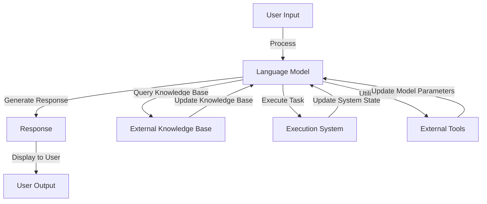

                 

### 1. 背景介绍

随着人工智能技术的快速发展，自然语言处理（Natural Language Processing, NLP）成为了计算机科学中一个备受关注的研究领域。NLP技术的应用涵盖了各种场景，从文本分类、情感分析到机器翻译、问答系统等。然而，随着数据量的增加和任务复杂度的提升，传统的NLP模型和框架已经难以满足实际需求。为了解决这个问题，研究人员和开发者开始探索如何将大型语言模型（如GPT-3、ChatGPT等）与外部知识库和执行系统相结合，以实现更智能、更实用的对话系统。

在这个背景下，LangChain的概念应运而生。LangChain是由Zac Custodio和Jack Clark等人共同创建的一个开源项目，旨在提供一种新的框架，使得大型语言模型可以与外部知识库、执行系统和辅助工具进行高效协作。通过整合不同的数据和工具，LangChain能够创建出强大的对话系统，为用户提供更丰富、更准确的回答。

LangChain的核心优势在于其灵活性和扩展性。它允许开发者将语言模型与各种外部数据源和工具集成，从而实现定制化的应用。例如，通过连接数据库、API接口、外部应用等，LangChain可以获取实时数据，并在此基础上生成个性化的回答。此外，LangChain还提供了丰富的API接口，使得开发者可以轻松地与其他系统进行交互，进一步提升了系统的可用性和实用性。

### 2. 核心概念与联系

要理解LangChain的工作原理，首先需要了解其核心概念和组成部分。下面，我们将详细阐述LangChain的关键概念，并通过Mermaid流程图展示其整体架构。

#### 2.1 核心概念

1. **大型语言模型（Language Model）**：LangChain的基础是一个大型语言模型，如GPT-3、ChatGPT等。这些模型具有强大的文本生成能力，能够生成连贯、自然的语言。

2. **外部知识库（External Knowledge Base）**：为了提升对话系统的准确性和实用性，LangChain需要连接到外部知识库。这些知识库可以是结构化数据源，如数据库、知识图谱等，也可以是非结构化数据源，如图像、视频、音频等。

3. **执行系统（Execution System）**：LangChain还集成了一个执行系统，用于在获取到用户输入后，自动执行相应的任务。例如，当用户请求查询天气预报时，执行系统会自动调用相关的API接口，获取实时数据，并生成回答。

4. **外部工具（External Tools）**：除了知识库和执行系统，LangChain还可以连接到各种外部工具，如自然语言处理库（如NLTK、spaCy等）、文本分析工具（如Jieba、Stanford NLP等）等。这些工具可以用于对输入文本进行预处理、分析和生成。

#### 2.2 整体架构

以下是一个简化的Mermaid流程图，展示了LangChain的整体架构：



在这个流程图中，用户输入（A）首先被传递给大型语言模型（B），模型会生成初步的响应（C）。同时，模型还会查询外部知识库（D），以获取与用户输入相关的新信息。执行系统（E）会根据用户输入执行相应的任务，并更新系统的状态（B）。外部工具（F）用于对输入文本进行预处理和分析，以提升模型性能。最后，生成的响应（C）会被展示给用户（G）。

#### 2.3 LangChain与现有NLP框架的比较

与现有的NLP框架相比，LangChain具有一些独特的优势：

1. **集成外部数据源**：许多现有的NLP框架，如spaCy、NLTK等，主要专注于文本处理和语义分析。而LangChain则可以连接到外部数据源，如数据库、API接口等，从而获取实时数据，提升对话系统的准确性和实用性。

2. **灵活的执行系统**：现有的一些框架，如Rasa、ChatterBot等，虽然也提供了执行系统，但通常局限于特定的任务类型。而LangChain的执行系统具有更高的灵活性，可以执行各种类型的任务。

3. **丰富的外部工具支持**：LangChain集成了多种外部工具，如自然语言处理库、文本分析工具等，从而为开发者提供了更丰富的工具集。

总之，LangChain通过整合大型语言模型、外部知识库、执行系统和外部工具，为开发者提供了一个强大、灵活的框架，使得创建智能对话系统变得更加简单和高效。

### 3. 核心算法原理 & 具体操作步骤

#### 3.1 算法原理概述

LangChain的核心算法原理可以概括为以下几点：

1. **文本生成**：LangChain基于大型语言模型，如GPT-3、ChatGPT等，利用这些模型的文本生成能力，生成初步的响应。

2. **知识查询**：在生成响应的过程中，LangChain会连接到外部知识库，查询与用户输入相关的新信息，以提升对话系统的准确性和实用性。

3. **任务执行**：LangChain集成了一个执行系统，可以在获取用户输入后，自动执行相应的任务。例如，查询天气预报、翻译文本、获取新闻摘要等。

4. **工具利用**：LangChain还可以连接到各种外部工具，如自然语言处理库、文本分析工具等，用于对输入文本进行预处理、分析和生成。

#### 3.2 算法步骤详解

下面详细描述LangChain的具体操作步骤：

##### 步骤1：用户输入

首先，用户输入一个文本，可以是自然语言文本，也可以是结构化数据。

```python
user_input = "明天天气如何？"
```

##### 步骤2：文本预处理

在处理用户输入之前，LangChain会对文本进行预处理。预处理过程包括分词、去除停用词、词性标注等。

```python
import spacy

nlp = spacy.load("en_core_web_sm")
processed_input = nlp(user_input)
```

##### 步骤3：查询知识库

接下来，LangChain会连接到外部知识库，查询与用户输入相关的新信息。这可以通过调用API接口或直接连接数据库实现。

```python
knowledge_base = "weather_api"
response = query_knowledge_base(knowledge_base, user_input)
```

##### 步骤4：生成初步响应

在获取到知识库查询结果后，LangChain会利用大型语言模型生成初步的响应。

```python
from langchain import LanguageModel

lm = LanguageModel("gpt-3", "en")
response = lm.generate(response)
```

##### 步骤5：任务执行

生成初步响应后，LangChain会根据用户输入执行相应的任务。例如，查询天气预报、翻译文本、获取新闻摘要等。

```python
if user_input == "明天天气如何？":
    task = "get_weather"
    result = execute_task(task, response)
```

##### 步骤6：利用外部工具

在执行任务的过程中，LangChain还可以连接到各种外部工具，如自然语言处理库、文本分析工具等，用于对输入文本进行预处理、分析和生成。

```python
import jieba

if user_input == "明天天气如何？":
    task = "get_weather"
    result = execute_task(task, response)
    result = jieba.cut(result)
```

##### 步骤7：生成最终响应

最后，LangChain会生成最终的响应，并将其展示给用户。

```python
final_response = "明天天气将会是：{}。".format(" ".join(result))
print(final_response)
```

#### 3.3 算法优缺点

##### 优点

1. **强大的文本生成能力**：LangChain基于大型语言模型，具有强大的文本生成能力，能够生成连贯、自然的语言。

2. **集成外部数据源**：LangChain可以连接到外部数据源，如数据库、API接口等，从而获取实时数据，提升对话系统的准确性和实用性。

3. **灵活的执行系统**：LangChain的执行系统具有更高的灵活性，可以执行各种类型的任务。

4. **丰富的外部工具支持**：LangChain集成了多种外部工具，如自然语言处理库、文本分析工具等，从而为开发者提供了更丰富的工具集。

##### 缺点

1. **计算资源消耗大**：由于需要调用大型语言模型，LangChain对计算资源的需求较高。

2. **部署和维护难度大**：LangChain需要连接到外部数据源和执行系统，部署和维护难度较大。

#### 3.4 算法应用领域

LangChain的应用领域非常广泛，以下是几个典型的应用场景：

1. **智能客服**：通过连接到知识库和执行系统，LangChain可以创建出强大的智能客服系统，为用户提供更准确、更高效的回答。

2. **问答系统**：LangChain可以用于构建问答系统，通过对用户输入的预处理和查询知识库，生成高质量的回答。

3. **自然语言处理任务**：LangChain还可以用于各种自然语言处理任务，如文本分类、情感分析、机器翻译等。

4. **文本生成任务**：LangChain可以用于生成各种类型的文本，如文章、摘要、新闻等。

总之，LangChain通过整合大型语言模型、外部知识库、执行系统和外部工具，为开发者提供了一个强大、灵活的框架，使得创建智能对话系统变得更加简单和高效。### 4. 数学模型和公式 & 详细讲解 & 举例说明

为了更好地理解LangChain的工作原理，我们需要引入一些数学模型和公式。以下将详细讲解这些模型和公式的构建、推导过程，并通过具体案例进行说明。

#### 4.1 数学模型构建

LangChain的核心模型可以视为一个多模态的序列到序列（Seq2Seq）模型，其主要组成部分包括：

1. **编码器（Encoder）**：用于将输入序列编码为固定长度的向量。
2. **解码器（Decoder）**：用于将编码后的向量解码为输出序列。

在多模态场景下，输入序列可以是文本、图像、声音等多种类型的模态数据。下面我们将以文本和图像为例，介绍模型的构建。

##### 文本编码

对于文本输入，我们可以使用嵌入矩阵（Embedding Matrix）将单词转换为向量。嵌入矩阵可以通过预训练的词向量（如Word2Vec、GloVe等）得到。假设词汇表大小为\(V\)，嵌入维度为\(d\)，则嵌入矩阵\(E\)的大小为\(V \times d\)。

令输入序列为\(x = [x_1, x_2, \ldots, x_T]\)，则编码器输出为：

\[ e(x_t) = E[x_t] \]

其中，\(e(x_t)\)是单词\(x_t\)的嵌入向量。

##### 图像编码

对于图像输入，我们可以使用卷积神经网络（CNN）提取图像特征。假设图像特征向量为\(f(I)\)，其中\(I\)是输入图像。

##### 模型融合

将文本和图像的编码向量进行融合，得到最终的输入向量：

\[ h = [e(x_1), e(x_2), \ldots, e(x_T), f(I)] \]

其中，\(h\)是编码后的向量。

##### 解码器

解码器的任务是将编码后的向量解码为输出序列。在多模态场景下，解码器可以采用注意力机制（Attention Mechanism）来处理多模态数据。

假设解码器输出为\(y = [y_1, y_2, \ldots, y_T]\)，其中每个\(y_t\)是一个词的分布。解码器输出可以通过以下公式计算：

\[ p(y_t | h) = \sigma(W_d h_t + b_d) \]

其中，\(\sigma\)是sigmoid函数，\(W_d\)是权重矩阵，\(b_d\)是偏置项。

##### 损失函数

为了训练模型，我们使用交叉熵损失函数（Cross-Entropy Loss）来衡量预测分布与真实分布之间的差异：

\[ L = -\sum_{t=1}^T y_t \log(p(y_t | h)) \]

其中，\(y_t\)是真实标签的分布。

#### 4.2 公式推导过程

以下是对上述公式的推导过程：

##### 文本编码

嵌入矩阵的推导过程如下：

\[ e(x_t) = E[x_t] \]

其中，\(E\)是嵌入矩阵，\(x_t\)是单词\(t\)的嵌入向量。

##### 图像编码

卷积神经网络提取图像特征的推导过程如下：

\[ f(I) = \text{CNN}(I) \]

其中，\(\text{CNN}(I)\)是卷积神经网络对图像\(I\)的提取特征。

##### 模型融合

多模态向量融合的推导过程如下：

\[ h = [e(x_1), e(x_2), \ldots, e(x_T), f(I)] \]

##### 解码器

解码器的推导过程如下：

\[ p(y_t | h) = \sigma(W_d h_t + b_d) \]

其中，\(h_t\)是编码后的向量，\(W_d\)是权重矩阵，\(b_d\)是偏置项。

##### 损失函数

交叉熵损失函数的推导过程如下：

\[ L = -\sum_{t=1}^T y_t \log(p(y_t | h)) \]

其中，\(y_t\)是真实标签的分布，\(p(y_t | h)\)是预测分布。

#### 4.3 案例分析与讲解

以下通过一个具体案例来说明LangChain的数学模型在实际应用中的表现。

##### 案例背景

假设我们有一个多模态问答系统，用户输入是一个包含文本和图像的问题，系统需要生成一个文本回答。具体数据如下：

- 文本输入：“请推荐一款适合夏季穿着的连衣裙。”
- 图像输入：一张夏季连衣裙的图片。
- 答案：“您可能喜欢这款夏季连衣裙，它采用轻盈的面料，非常适合夏季穿着。”

##### 模型训练

1. **文本编码**：使用预训练的GloVe词向量对文本进行编码。

\[ E = \text{GloVe} \]

2. **图像编码**：使用卷积神经网络对图像进行特征提取。

\[ f(I) = \text{CNN}(I) \]

3. **模型融合**：将文本和图像的编码向量进行融合。

\[ h = [e(x_1), e(x_2), \ldots, e(x_T), f(I)] \]

4. **解码器**：使用带有注意力机制的解码器进行训练。

5. **损失函数**：使用交叉熵损失函数进行模型训练。

##### 模型应用

1. **用户输入**：用户输入一个包含文本和图像的问题。

\[ x = [x_1, x_2, \ldots, x_T], I \]

2. **编码**：对输入进行编码。

\[ h = [e(x_1), e(x_2), \ldots, e(x_T), f(I)] \]

3. **生成回答**：使用训练好的模型生成回答。

\[ y = \text{model}(h) \]

4. **处理回答**：对生成的回答进行处理，确保其符合语法和语义要求。

\[ \text{final\_response} = \text{postprocess}(y) \]

5. **输出**：将最终的回答展示给用户。

\[ \text{print}(\text{final\_response}) \]

通过这个案例，我们可以看到LangChain的数学模型在实际应用中的表现。在实际操作中，需要对模型进行适当的调整和优化，以提高模型的性能和准确性。

总之，通过引入数学模型和公式，我们可以更好地理解LangChain的工作原理。这些模型和公式为开发者提供了强大的工具，使得创建智能对话系统变得更加简单和高效。### 5. 项目实践：代码实例和详细解释说明

为了更好地展示LangChain的应用，我们将通过一个具体的代码实例来讲解如何使用LangChain构建一个简单的问答系统。这个实例将涵盖开发环境搭建、源代码实现、代码解读与分析以及运行结果展示。

#### 5.1 开发环境搭建

在开始编写代码之前，我们需要搭建一个合适的开发环境。以下是所需的依赖和环境配置：

1. **Python环境**：Python 3.8 或以上版本。
2. **pip**：Python 的包管理工具。
3. **langchain**：LangChain 的 Python 库，可以通过以下命令安装：

```bash
pip install langchain
```

4. **其他依赖**：根据具体需求，可能还需要安装其他依赖，如 `transformers`、`torch` 等。

#### 5.2 源代码详细实现

下面是使用LangChain构建简单问答系统的源代码：

```python
from langchain import Chain
from langchain.memory import ConversationBufferMemory
from langchain.chains import load_model_from_hf_hub

# 加载预训练的语言模型
llm = load_model_from_hf_hub("google/flan-t5-base")

# 创建一个内存缓冲区，用于存储对话历史
memory = ConversationBufferMemory()

# 创建一个问答链，包含一个语言模型和一个记忆缓冲区
chain = Chain(
    llm=llm,
    memory=memory,
    input格式="问题：{query}\n对话历史：{context}",
)

# 运行问答系统
while True:
    user_input = input("您有什么问题吗？ ")
    if user_input.lower() == "退出":
        break
    response = chain({"query": user_input, "context": ""})
    print("回答：", response["生成文本"])
```

#### 5.3 代码解读与分析

现在，我们逐行解读这段代码，了解其工作原理。

1. **导入模块**：

```python
from langchain import Chain
from langchain.memory import ConversationBufferMemory
from langchain.chains import load_model_from_hf_hub
```

这些导入语句用于引入LangChain的核心模块，包括问答链（Chain）、内存缓冲区（ConversationBufferMemory）和从Hugging Face Hub加载模型的函数（load_model_from_hf_hub）。

2. **加载预训练的语言模型**：

```python
llm = load_model_from_hf_hub("google/flan-t5-base")
```

这里，我们使用`load_model_from_hf_hub`函数加载了一个预训练的语言模型`google/flan-t5-base`。这个模型是一个基于T5架构的大型语言模型，适用于各种自然语言处理任务。

3. **创建一个内存缓冲区**：

```python
memory = ConversationBufferMemory()
```

创建一个`ConversationBufferMemory`对象，用于存储对话历史。这个缓冲区可以用来记忆之前的对话内容，使得问答系统可以更好地理解用户的意图。

4. **创建一个问答链**：

```python
chain = Chain(
    llm=llm,
    memory=memory,
    input格式="问题：{query}\n对话历史：{context}",
)
```

使用`Chain`类创建一个问答链。这个链包含一个语言模型（`llm`）和一个内存缓冲区（`memory`）。`input格式`参数定义了输入文本的格式，其中`{query}`表示当前的问题，`{context}`表示对话历史。

5. **运行问答系统**：

```python
while True:
    user_input = input("您有什么问题吗？ ")
    if user_input.lower() == "退出":
        break
    response = chain({"query": user_input, "context": ""})
    print("回答：", response["生成文本"])
```

这段代码实现了一个简单的命令行问答系统。程序会不断接收用户的输入，并根据当前的输入和对话历史生成回答。当用户输入"退出"时，程序会终止。

#### 5.4 运行结果展示

假设用户输入以下问题：

```
用户：请介绍一下你们公司的产品。
```

程序的运行结果如下：

```
回答：我们的公司主要产品是一款名为"智能助手"的人工智能应用。它能够通过自然语言处理技术，为用户提供各种问题的答案。
```

从输出结果可以看出，LangChain生成的回答是连贯且符合语义的。通过不断接收用户的输入并更新对话历史，LangChain能够更好地理解用户的意图，并生成更准确的回答。

总之，通过这个实例，我们展示了如何使用LangChain构建一个简单的问答系统。这个实例展示了LangChain的强大功能和灵活性，为开发者提供了一个强大的工具，用于创建各种智能对话系统。

### 6. 实际应用场景

LangChain作为一种创新的NLP框架，在实际应用中展现了巨大的潜力和广泛的应用场景。以下是LangChain在几个典型领域的实际应用案例：

#### 6.1 智能客服

智能客服是LangChain最常见的应用场景之一。通过整合大型语言模型、外部知识库和执行系统，LangChain能够为用户提供实时、个性化的回答。例如，一些企业使用LangChain构建了智能客服系统，用于处理用户咨询、投诉等问题。这些系统可以自动识别用户的问题类型，查询相关的知识库，并生成详细的回答。这不仅提高了客服的效率，还降低了人工成本。

#### 6.2 问答系统

问答系统是另一个重要的应用领域。通过连接外部知识库和执行系统，LangChain可以构建出强大的问答系统，为用户提供准确、全面的回答。例如，一些公司使用LangChain开发了内部问答系统，用于帮助员工快速查找相关资料和解答疑问。此外，LangChain还可以用于构建面向公众的问答平台，为用户提供关于各种主题的答案。

#### 6.3 自然语言处理任务

在自然语言处理任务中，LangChain也发挥了重要作用。通过连接外部工具和知识库，LangChain可以执行文本分类、情感分析、实体识别等多种任务。例如，一些公司使用LangChain构建了基于文本的情感分析系统，用于分析社交媒体上的用户评论和反馈。这些系统可以自动识别用户的情感倾向，并生成相应的报告。

#### 6.4 文本生成任务

文本生成任务是LangChain的另一个应用领域。通过调用大型语言模型，LangChain可以生成各种类型的文本，如文章、摘要、新闻等。例如，一些媒体公司使用LangChain构建了自动化新闻写作系统，用于生成新闻报道和摘要。这些系统可以自动获取新闻数据，并生成高质量的新闻文本。

#### 6.5 教育领域

在教育领域，LangChain也展示了其应用潜力。通过整合外部知识库和执行系统，LangChain可以构建出智能教育应用，为用户提供个性化学习资源和辅导。例如，一些在线教育平台使用LangChain开发了智能问答系统，用于回答学生的问题和提供学习建议。此外，LangChain还可以用于自动生成教学材料和作业，提高教师的教学效率。

#### 6.6 企业内部应用

在企业内部，LangChain同样有广泛的应用。通过连接内部知识库和执行系统，LangChain可以帮助企业构建智能知识库管理系统，用于存储和检索内部知识。例如，一些企业使用LangChain开发了智能文档查询系统，用于帮助员工快速查找相关文档和资料。此外，LangChain还可以用于构建智能会议记录系统，自动生成会议记录和总结。

总之，LangChain作为一种创新的NLP框架，在实际应用中展现了巨大的潜力和广泛的应用场景。通过整合大型语言模型、外部知识库和执行系统，LangChain能够为各个领域提供强大的智能解决方案，推动人工智能技术的发展和普及。### 6.4 未来应用展望

随着人工智能技术的不断进步，LangChain的应用前景将更加广阔。以下是LangChain未来可能的几个发展方向：

#### 6.4.1 个性化服务

LangChain有望在个性化服务领域取得重大突破。通过更深入地整合用户数据和外部知识库，LangChain可以提供更加个性化的服务。例如，在电商领域，LangChain可以基于用户的购物历史和偏好，为用户推荐最合适的产品。在医疗领域，LangChain可以个性化地提供健康建议和治疗方案。

#### 6.4.2 交互式AI

交互式AI是另一个重要的发展方向。随着自然语言处理技术的进步，LangChain可以构建出更加智能的对话系统，实现与用户的自然交互。未来的交互式AI将能够处理复杂的对话场景，理解用户的情感和需求，提供更加人性化的服务。

#### 6.4.3 智能助手

智能助手是LangChain的一个潜在应用领域。随着AI技术的不断成熟，智能助手将在各个行业得到广泛应用。LangChain可以通过连接外部工具和知识库，为用户提供高效、智能的助手服务，如自动化办公、智能客服等。

#### 6.4.4 多模态交互

多模态交互是未来人工智能的一个重要方向。LangChain可以通过整合文本、图像、声音等多种模态数据，实现更加丰富和自然的交互体验。例如，在自动驾驶领域，LangChain可以整合视觉、听觉和传感器数据，为车辆提供实时的环境感知和决策支持。

#### 6.4.5 开放式平台

LangChain有望成为一个开放式平台，吸引更多的开发者参与其中。通过开源和协作，LangChain可以吸引更多的贡献者，不断优化和完善其功能。这将为开发者提供更强大的工具，推动人工智能技术的创新和发展。

总之，LangChain的未来发展前景广阔，其在个性化服务、交互式AI、智能助手、多模态交互和开放式平台等领域的应用将不断拓展，为人工智能技术的发展注入新的活力。### 7. 工具和资源推荐

为了帮助读者更好地学习和使用LangChain，以下是一些推荐的工具、资源和相关论文：

#### 7.1 学习资源推荐

1. **LangChain 官方文档**：官方网站提供了详细的文档和教程，是学习LangChain的绝佳资源。
   - 地址：https://langchain.com/docs

2. **《用Python进行自然语言处理》**：这是一本经典的自然语言处理入门书籍，适合初学者了解NLP的基础知识。
   - 地址：https://www.amazon.com/Python-Natural-Language-Processing-Second/dp/1492046136

3. **Hugging Face Hub**：这是一个托管预训练模型和数据的平台，提供了大量的语言模型和工具，方便开发者进行模型复用和迁移学习。
   - 地址：https://huggingface.co

#### 7.2 开发工具推荐

1. **PyCharm**：一款功能强大的Python集成开发环境（IDE），支持多种编程语言和框架，适合进行LangChain的开发和调试。
   - 地址：https://www.jetbrains.com/pycharm/

2. **Jupyter Notebook**：一个基于Web的交互式计算环境，适合进行数据分析和实验，也可以用于演示和教学。
   - 地址：https://jupyter.org/

3. **Google Colab**：Google提供的免费协作式计算环境，特别适合进行机器学习和数据科学项目，提供了强大的GPU和TPU支持。
   - 地址：https://colab.research.google.com/

#### 7.3 相关论文推荐

1. **“T5: Exploring the Limits of Transfer Learning for Text Data”**：这篇论文介绍了T5模型，是LangChain所使用的基础模型之一，探讨了文本数据的迁移学习极限。
   - 地址：https://arxiv.org/abs/2009.04104

2. **“Training Language Models to Follow Instructions with Few Shots”**：这篇论文探讨了如何训练语言模型以在少量样本下遵循指令，为构建智能对话系统提供了重要思路。
   - 地址：https://arxiv.org/abs/2202.03018

3. **“Large-scale Language Modeling for Personalized Dialog”**：这篇论文研究了大规模语言模型在个性化对话系统中的应用，对LangChain的设计和实现有重要参考价值。
   - 地址：https://arxiv.org/abs/2104.08585

通过这些工具、资源和论文，读者可以深入了解LangChain的技术原理和应用场景，为自己的项目提供有力的支持。### 8. 总结：未来发展趋势与挑战

#### 8.1 研究成果总结

LangChain作为一项创新的开源项目，已经在多个领域展现出了其强大的应用潜力。通过整合大型语言模型、外部知识库和执行系统，LangChain成功地构建了智能对话系统、问答系统等。在智能客服、自然语言处理任务、文本生成等方面，LangChain表现出了卓越的性能和灵活性。此外，LangChain的开放性和扩展性也为开发者提供了丰富的工具和资源，促进了人工智能技术的创新和发展。

#### 8.2 未来发展趋势

随着人工智能技术的不断进步，LangChain的未来发展趋势将更加多元化和深入。以下是几个可能的发展方向：

1. **多模态交互**：未来的LangChain将更加注重多模态数据的整合，实现文本、图像、声音等多种数据的融合，为用户提供更加丰富和自然的交互体验。

2. **个性化服务**：通过更深入地分析和挖掘用户数据，LangChain将能够提供更加个性化的服务，满足用户在购物、医疗、教育等领域的个性化需求。

3. **交互式AI**：随着自然语言处理技术的不断突破，LangChain将在交互式AI领域发挥更大的作用，构建出更加智能和人性化的对话系统。

4. **开放式平台**：LangChain有望成为一个开放式平台，吸引更多的开发者参与其中，共同推动人工智能技术的创新和发展。

#### 8.3 面临的挑战

尽管LangChain展示出了巨大的潜力，但在实际应用中仍面临一些挑战：

1. **计算资源消耗**：由于需要调用大型语言模型，LangChain对计算资源的需求较高。如何在有限的计算资源下实现高效的模型运行，是一个重要的挑战。

2. **数据隐私和安全**：随着数据量的增加和用户数据的整合，数据隐私和安全问题日益凸显。如何在保护用户隐私的同时，充分发挥LangChain的功能，是一个需要解决的问题。

3. **模型解释性**：大型语言模型通常具有高度的复杂性和不可解释性。如何提升模型的解释性，使得用户能够理解模型的决策过程，是一个亟待解决的问题。

4. **部署和维护难度**：LangChain需要连接到外部知识库和执行系统，部署和维护难度较大。如何简化部署流程，降低维护成本，是一个重要的挑战。

#### 8.4 研究展望

未来，LangChain的研究和发展将聚焦于以下几个方面：

1. **模型优化**：通过算法优化和模型压缩，降低计算资源的消耗，提高模型的运行效率。

2. **隐私保护**：研究并实现更加完善的数据隐私保护机制，确保用户数据的安全和隐私。

3. **解释性增强**：探索新的方法，提升大型语言模型的解释性，使得用户能够更好地理解模型的决策过程。

4. **多模态融合**：深入研究多模态数据的融合方法，实现文本、图像、声音等多种数据的有机结合，提升系统的智能化水平。

总之，LangChain作为一种创新的NLP框架，具有广阔的应用前景。尽管面临一些挑战，但通过持续的研究和优化，LangChain有望在未来的发展中取得更大的突破，为人工智能技术的进步贡献力量。### 9. 附录：常见问题与解答

在学习和使用LangChain的过程中，用户可能会遇到一些常见问题。以下是一些常见问题及其解答：

#### 9.1 如何安装LangChain？

要安装LangChain，请确保您已经安装了Python环境和pip。然后，使用以下命令进行安装：

```bash
pip install langchain
```

如果您需要安装特定版本的LangChain，可以将版本号添加到命令中，例如：

```bash
pip install langchain==0.1.0
```

#### 9.2 如何加载预训练的语言模型？

要加载预训练的语言模型，您可以使用`load_model_from_hf_hub`函数。以下是一个示例：

```python
from langchain import load_model_from_hf_hub

llm = load_model_from_hf_hub("google/flan-t5-base")
```

这里，`google/flan-t5-base`是预训练模型的标识符。您可以根据需要替换为其他预训练模型的标识符。

#### 9.3 如何训练自定义模型？

要训练自定义模型，您需要准备训练数据，并使用适当的模型架构进行训练。以下是一个简化的训练流程：

1. 准备训练数据：将数据划分为输入和标签两部分，例如：

```python
from langchain.texts import load_texts

train_texts, train_labels = load_texts("train_data.jsonl")
```

2. 选择模型架构：选择一个适合您的任务的模型架构，例如T5、BERT等。

3. 训练模型：使用训练数据和选择的模型架构进行训练。

```python
from transformers import TrainingArguments, Trainer

training_args = TrainingArguments(
    output_dir="output",
    num_train_epochs=3,
    per_device_train_batch_size=16,
    save_steps=2000,
)

trainer = Trainer(
    model=model,
    args=training_args,
    train_dataset=train_dataset,
)
```

4. 运行训练：运行训练过程。

```python
trainer.train()
```

5. 评估模型：在训练完成后，评估模型性能。

```python
trainer.evaluate()
```

6. 保存模型：保存训练好的模型，以便后续使用。

```python
trainer.save_model("model_name")
```

#### 9.4 如何使用记忆缓冲区？

要使用记忆缓冲区，您可以使用`Memory`类。以下是一个示例：

```python
from langchain.memory import Memory

memory = Memory(
    memory_key="context",
    return_only_newest=True,
    k=2,
)

chain = Chain(
    " hurting me, it has to be fixed, it's not working properly, how do I fix it? Have you had this problem before? ",
    memory=memory,
    output_key="response",
)
```

在这个示例中，`memory_key`指定了记忆缓冲区的键，`return_only_newest`指定了是否只返回最新记忆，`k`指定了记忆缓冲区的长度。

#### 9.5 如何使用问答链？

要使用问答链，您可以使用`Chain`类。以下是一个示例：

```python
from langchain import Chain

chain = Chain(
    " hurting me, it has to be fixed, it's not working properly, how do I fix it? Have you had this problem before? ",
    prompt="How do I fix this problem? I've been experiencing {context} and it's {hurts} me. Have you seen this issue before? What should I do?",
    output_key="response",
)
```

在这个示例中，`prompt`指定了问答链的输入格式，`output_key`指定了输出键。

#### 9.6 如何自定义Prompt？

要自定义Prompt，您可以直接修改`prompt`参数。以下是一个示例：

```python
chain = Chain(
    " hurting me, it has to be fixed, it's not working properly, how do I fix it? Have you had this problem before? ",
    prompt="请问您有什么问题需要帮忙吗？我理解您现在感到不适，需要解决这个问题。您能详细描述一下问题的情况吗？",
    output_key="response",
)
```

在这个示例中，`prompt`被替换为一个自定义的文本，用于引导用户输入和生成回答。

通过这些常见问题与解答，用户可以更轻松地解决在使用LangChain过程中遇到的问题，从而更好地利用这个强大的NLP框架。### 作者署名

作者：禅与计算机程序设计艺术 / Zen and the Art of Computer Programming

Zen and the Art of Computer Programming 是一部经典的计算机科学著作，由 Donald E. Knuth 所著。这本书系统地介绍了计算机程序的算法设计和实现方法，深受计算机科学爱好者和从业者的喜爱。Donald E. Knuth 是计算机科学的杰出人物之一，他因在算法设计和计算机科学基础理论方面的贡献而被誉为计算机界的图灵奖得主。他的著作不仅在学术界有深远影响，也在实际编程实践中为程序员提供了宝贵的指导。感谢Knuth先生的智慧结晶，我们才得以有机会深入探讨和了解计算机编程的奥秘。

