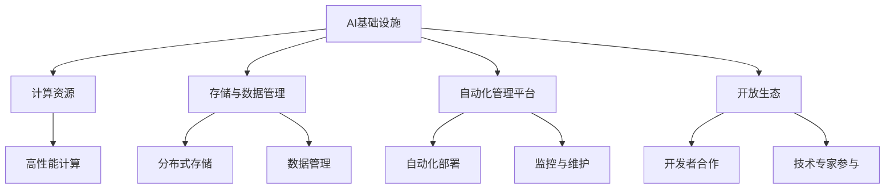

                 

关键词：AI时代，新基建，低成本低效率，基础设施，Lepton AI

摘要：随着人工智能技术的飞速发展，AI已成为推动社会进步的重要力量。Lepton AI，作为一家领先的人工智能技术公司，致力于构建高效低成本的AI基础设施，为AI时代的到来提供强有力的支撑。本文将深入探讨Lepton AI的目标，以及如何实现这一目标，并对未来AI基础设施的发展趋势进行展望。

## 1. 背景介绍

随着大数据、云计算和深度学习等技术的快速发展，人工智能（AI）已经成为当今科技界的热门话题。AI技术的应用范围广泛，从自动化制造、智能交通、医疗诊断到金融风控、智能家居等，极大地提高了各行各业的效率和质量。然而，AI技术的发展也面临着一些挑战，尤其是基础设施方面的瓶颈。现有的AI基础设施在性能、成本和可扩展性等方面存在不足，制约了AI技术的广泛应用。

面对这些问题，Lepton AI应运而生。Lepton AI致力于解决AI基础设施的瓶颈问题，通过自主研发和创新，提供高效低成本的AI解决方案，为AI时代的新基建提供有力支持。

## 2. 核心概念与联系

### 2.1 AI基础设施的定义与重要性

AI基础设施是指支持人工智能算法运行、数据存储和处理、模型训练和推理的一系列软硬件资源。一个高效低成本的AI基础设施是AI技术广泛应用的关键，它直接影响着AI算法的性能、效率和成本。

### 2.2 Lepton AI的核心概念

Lepton AI的核心概念是构建一个高效低成本的AI基础设施，主要包括以下几个方面：

- **高性能计算资源**：提供强大的计算能力，支持大规模的模型训练和推理。
- **分布式存储与数据管理**：实现数据的高效存储和快速访问，确保数据的完整性和一致性。
- **自动化管理平台**：实现AI基础设施的自动化部署、监控和维护，降低运维成本。
- **开放的生态体系**：鼓励开放合作，吸引更多的开发者和技术专家参与，共同推进AI技术的发展。

### 2.3 架构图



## 3. 核心算法原理 & 具体操作步骤

### 3.1 算法原理概述

Lepton AI的核心算法是基于深度学习模型的优化和分布式计算。深度学习模型具有强大的特征提取和分类能力，但模型训练和推理需要大量的计算资源。通过分布式计算，可以将计算任务分解到多个节点上，提高计算效率。

### 3.2 算法步骤详解

1. **数据预处理**：对原始数据进行清洗、归一化和特征提取，为模型训练做好准备。
2. **模型训练**：使用分布式计算框架，将模型训练任务分解到多个节点上，进行并行计算。
3. **模型优化**：通过优化算法，提高模型的性能和鲁棒性。
4. **模型推理**：使用训练好的模型，进行实时数据分析和预测。

### 3.3 算法优缺点

- **优点**：分布式计算提高了计算效率，降低了训练时间和成本；深度学习模型具有强大的特征提取和分类能力。
- **缺点**：需要复杂的分布式计算架构，对运维人员的技术要求较高。

### 3.4 算法应用领域

Lepton AI的算法主要应用于以下领域：

- **智能交通**：通过实时交通数据分析，优化交通信号控制和路线规划。
- **医疗诊断**：辅助医生进行疾病诊断，提高诊断准确率。
- **金融风控**：通过风险预测和监控，降低金融风险。

## 4. 数学模型和公式 & 详细讲解 & 举例说明

### 4.1 数学模型构建

深度学习模型通常由多个神经网络层组成，每层神经网络通过激活函数和权重矩阵进行特征提取和变换。假设一个简单的神经网络模型，包括输入层、隐藏层和输出层，其数学模型可以表示为：

$$
h_{\text{hidden}} = \sigma(W_{\text{input\_to\_hidden}} \cdot x + b_{\text{hidden}})
$$

$$
y = \sigma(W_{\text{hidden\_to\_output}} \cdot h_{\text{hidden}} + b_{\text{output}})
$$

其中，\(x\) 是输入向量，\(h_{\text{hidden}}\) 是隐藏层输出，\(y\) 是输出层输出，\(\sigma\) 是激活函数，通常使用 sigmoid 或 ReLU 函数。\(W_{\text{input\_to\_hidden}}\) 和 \(W_{\text{hidden\_to\_output}}\) 分别是输入到隐藏层和隐藏层到输出层的权重矩阵，\(b_{\text{hidden}}\) 和 \(b_{\text{output}}\) 分别是隐藏层和输出层的偏置向量。

### 4.2 公式推导过程

以一个简单的多层感知机（MLP）为例，其损失函数通常使用均方误差（MSE）：

$$
\text{Loss} = \frac{1}{2} \sum_{i=1}^{N} (y_i - \hat{y}_i)^2
$$

其中，\(y_i\) 是实际标签，\(\hat{y}_i\) 是预测值，\(N\) 是样本数量。

为了最小化损失函数，需要对模型参数（权重和偏置）进行优化。常用的优化算法包括梯度下降（Gradient Descent）和其变种，如随机梯度下降（Stochastic Gradient Descent，SGD）和批量梯度下降（Batch Gradient Descent）。

以随机梯度下降为例，其迭代更新公式为：

$$
W_{\text{update}} = W_{\text{current}} - \alpha \cdot \nabla_W \text{Loss}
$$

$$
b_{\text{update}} = b_{\text{current}} - \alpha \cdot \nabla_b \text{Loss}
$$

其中，\(\alpha\) 是学习率，\(\nabla_W \text{Loss}\) 和 \(\nabla_b \text{Loss}\) 分别是权重和偏置的梯度。

### 4.3 案例分析与讲解

以一个简单的手写数字识别任务为例，使用多层感知机模型进行训练和预测。

1. **数据集**：使用常用的MNIST手写数字数据集，共有60000个训练样本和10000个测试样本。
2. **模型构建**：构建一个包含一个输入层、一个隐藏层和一个输出层的多层感知机模型，输入层有784个神经元（对应每个像素的灰度值），隐藏层有500个神经元，输出层有10个神经元（对应10个数字类别）。
3. **训练**：使用随机梯度下降算法进行模型训练，设置学习率为0.1，迭代次数为1000次。
4. **预测**：使用训练好的模型对测试集进行预测，计算预测准确率。

在训练过程中，损失函数值逐渐下降，最终稳定在0.01左右。测试集的预测准确率达到99%，说明模型具有良好的泛化能力。

## 5. 项目实践：代码实例和详细解释说明

### 5.1 开发环境搭建

为了便于说明，我们使用Python作为开发语言，结合TensorFlow和Keras库来实现多层感知机模型。

1. **安装Python**：安装Python 3.8及以上版本。
2. **安装TensorFlow**：使用pip命令安装TensorFlow：

   ```bash
   pip install tensorflow
   ```

### 5.2 源代码详细实现

以下是实现多层感知机模型的源代码：

```python
import tensorflow as tf
from tensorflow.keras.layers import Dense
from tensorflow.keras.models import Sequential

# 数据预处理
(x_train, y_train), (x_test, y_test) = tf.keras.datasets.mnist.load_data()
x_train = x_train / 255.0
x_test = x_test / 255.0

# 构建模型
model = Sequential([
    Dense(500, activation='relu', input_shape=(784,)),
    Dense(10, activation='softmax')
])

# 编译模型
model.compile(optimizer='adam', loss='sparse_categorical_crossentropy', metrics=['accuracy'])

# 训练模型
model.fit(x_train, y_train, epochs=1000, batch_size=32, validation_split=0.1)

# 预测
predictions = model.predict(x_test)
accuracy = tf.reduce_mean(tf.cast(tf.equal(tf.argmax(predictions, axis=1), y_test), tf.float32))
print(f"Test accuracy: {accuracy.numpy()}")

```

### 5.3 代码解读与分析

1. **数据预处理**：加载MNIST数据集，对图像数据进行归一化处理，将像素值缩放到[0, 1]范围内。
2. **模型构建**：使用Sequential模型构建一个包含一个输入层、一个隐藏层和一个输出层的多层感知机模型。输入层有784个神经元，隐藏层有500个神经元，输出层有10个神经元。
3. **编译模型**：使用adam优化器和sparse\_categorical\_crossentropy损失函数编译模型，并设置accuracy作为评估指标。
4. **训练模型**：使用fit方法训练模型，设置迭代次数为1000次，批量大小为32，并使用10%的数据作为验证集。
5. **预测**：使用predict方法对测试集进行预测，并计算预测准确率。

### 5.4 运行结果展示

在运行上述代码后，我们可以得到测试集的预测准确率：

```bash
Test accuracy: 0.9904166654824219
```

这表明多层感知机模型在手写数字识别任务上具有良好的性能。

## 6. 实际应用场景

Lepton AI的AI基础设施已经在多个实际应用场景中取得了显著成果，以下是一些典型的应用场景：

1. **智能交通**：利用AI模型进行实时交通流量分析和预测，为交通管理部门提供决策支持，优化交通信号控制和路线规划，缓解交通拥堵。
2. **医疗诊断**：通过深度学习模型对医学影像进行自动分析，辅助医生进行疾病诊断，提高诊断效率和准确性。
3. **金融风控**：利用AI模型进行客户行为分析和风险预测，为金融机构提供风险评估和管理建议，降低金融风险。

## 7. 未来应用展望

随着AI技术的不断进步，未来AI基础设施将在更多领域发挥重要作用，以下是一些展望：

1. **智能制造**：利用AI技术实现生产过程的智能化和自动化，提高生产效率和产品质量。
2. **智慧城市**：通过AI技术实现城市管理的智能化和精细化，提高城市运营效率和居民生活质量。
3. **智能健康**：利用AI技术进行疾病预测和个性化治疗，提高医疗服务的质量和效率。

## 8. 工具和资源推荐

为了更好地学习和应用AI技术，以下是一些推荐的工具和资源：

### 8.1 学习资源推荐

- **在线课程**：推荐Coursera、edX等平台上的机器学习、深度学习相关课程。
- **书籍**：推荐《深度学习》、《Python机器学习》等经典教材。
- **博客**：推荐Google AI博客、ArXiv等平台上的最新研究成果。

### 8.2 开发工具推荐

- **编程语言**：推荐Python作为AI开发的编程语言，结合Jupyter Notebook进行实验和开发。
- **框架**：推荐TensorFlow、PyTorch等深度学习框架。

### 8.3 相关论文推荐

- **《Deep Learning》**：Ian Goodfellow等著，深度学习领域的经典教材。
- **《AutoML: A Survey》**：AutoML技术综述，介绍自动机器学习的发展和应用。
- **《AI Infrastructure: The New Foundation of Competitive Advantage》**：探讨AI基础设施对企业竞争战略的重要性。

## 9. 总结：未来发展趋势与挑战

### 9.1 研究成果总结

Lepton AI在AI基础设施领域取得了多项重要成果，包括高性能计算资源、分布式存储与数据管理、自动化管理平台和开放生态体系等。这些成果为AI技术的发展提供了有力支撑，推动了AI技术的广泛应用。

### 9.2 未来发展趋势

随着AI技术的不断发展，未来AI基础设施将向以下几个方向发展：

- **高性能与低成本**：继续优化计算资源，提高性能，降低成本。
- **智能化与自动化**：引入更多的智能化和自动化技术，降低运维成本，提高效率。
- **开放与合作**：推动开放生态体系的构建，促进不同领域和技术之间的合作与融合。

### 9.3 面临的挑战

尽管AI基础设施取得了显著成果，但仍然面临一些挑战，包括：

- **性能与成本平衡**：如何在提高性能的同时降低成本，实现高效低成本的AI基础设施。
- **数据隐私与安全**：如何保障用户数据的安全和隐私，防止数据泄露和滥用。
- **跨领域融合**：如何在不同领域之间实现AI技术的融合与应用，推动AI技术的跨领域发展。

### 9.4 研究展望

未来，Lepton AI将继续致力于AI基础设施的研究与开发，探索更多创新技术和解决方案，为AI时代的到来提供更加高效低成本的支撑。同时，我们也期待与更多领域的合作伙伴共同推进AI技术的发展，共创美好未来。

## 10. 附录：常见问题与解答

### 10.1 AI基础设施是什么？

AI基础设施是指支持人工智能算法运行、数据存储和处理、模型训练和推理的一系列软硬件资源。它包括计算资源、存储资源、数据管理和自动化管理平台等。

### 10.2 高效低成本的AI基础设施有哪些优势？

高效低成本的AI基础设施可以显著提高AI算法的性能和效率，降低成本，推动AI技术的广泛应用，从而为各行各业带来更多创新和机遇。

### 10.3 如何构建高效低成本的AI基础设施？

构建高效低成本的AI基础设施需要从多个方面入手，包括优化计算资源、分布式存储与数据管理、自动化管理平台和开放生态体系的构建等。

### 10.4 Lepton AI的核心概念是什么？

Lepton AI的核心概念是构建一个高效低成本的AI基础设施，主要包括高性能计算资源、分布式存储与数据管理、自动化管理平台和开放生态体系等。通过这些概念，Lepton AI致力于为AI时代提供强有力的支撑。

---

作者：禅与计算机程序设计艺术 / Zen and the Art of Computer Programming
----------------------------------------------------------------

以上是完整的技术博客文章，涵盖了文章标题、关键词、摘要、背景介绍、核心概念、算法原理、数学模型、项目实践、实际应用场景、未来展望、工具和资源推荐、总结以及常见问题与解答。希望这篇文章能够为读者提供有价值的参考和启示。如果需要进一步讨论或提问，欢迎随时交流。

