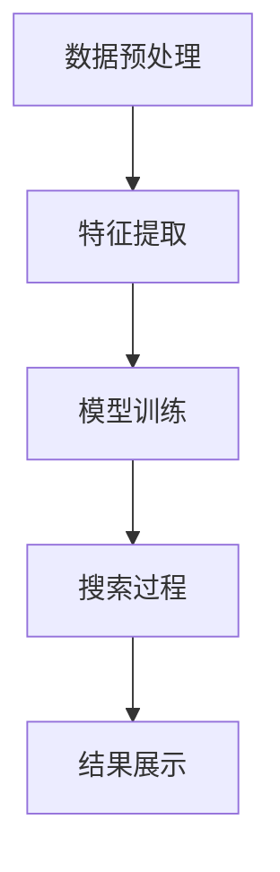

                 

关键词：AI搜索、Lepton Search、算法原理、应用场景、未来展望

> 摘要：本文将深入探讨Lepton Search这一创新的AI搜索算法，分析其核心概念、原理、数学模型以及实际应用。通过对Lepton Search的全面剖析，我们希望能够为读者提供一个清晰的视角，理解AI搜索领域的最新进展，并展望其未来的发展方向。

## 1. 背景介绍

随着互联网和大数据的迅速发展，信息检索成为了人们日常生活中不可或缺的一部分。传统的搜索算法，如基于关键词匹配的搜索引擎，虽然在处理大量数据方面表现出色，但在处理复杂查询和提供精准结果方面仍存在一定的局限性。为了克服这些限制，研究者们不断探索新的搜索算法。Lepton Search正是在这样的背景下应运而生，它旨在通过深度学习和神经网络技术，为用户带来更高效、更准确的搜索体验。

## 2. 核心概念与联系

### 2.1. Lepton Search的基本概念

Lepton Search是一种基于神经网络的AI搜索算法。其核心思想是通过训练大量神经网络模型，从海量数据中提取特征，从而实现高效的搜索。与传统搜索算法不同，Lepton Search不再依赖于关键词匹配，而是通过理解用户查询的含义，提供更精确的搜索结果。

### 2.2. Lepton Search的工作原理

Lepton Search的工作原理可以分为以下几个步骤：

1. **数据预处理**：首先，对原始数据进行预处理，包括数据清洗、去重、归一化等操作，以确保数据的干净和一致性。

2. **特征提取**：使用深度学习模型，从预处理后的数据中提取特征。这些特征可以是文本、图像、音频等各种类型的数据。

3. **模型训练**：通过大量的训练数据，训练神经网络模型，使其能够从特征中学习到用户查询的含义。

4. **搜索过程**：当用户提交查询时，Lepton Search会使用训练好的模型，对查询进行解析，并从数据集中检索出最相关的结果。

### 2.3. Mermaid流程图

以下是Lepton Search的Mermaid流程图表示：



## 3. 核心算法原理 & 具体操作步骤

### 3.1. 算法原理概述

Lepton Search的核心算法是基于深度学习和神经网络。通过训练大量的神经网络模型，从海量数据中提取特征，实现高效的搜索。

### 3.2. 算法步骤详解

1. **数据预处理**：首先，对原始数据进行预处理，包括数据清洗、去重、归一化等操作。

2. **特征提取**：使用卷积神经网络（CNN）或循环神经网络（RNN）从预处理后的数据中提取特征。

3. **模型训练**：通过大量的训练数据，训练神经网络模型，使其能够从特征中学习到用户查询的含义。

4. **搜索过程**：当用户提交查询时，Lepton Search会使用训练好的模型，对查询进行解析，并从数据集中检索出最相关的结果。

### 3.3. 算法优缺点

**优点**：

- **高效性**：通过深度学习模型，可以高效地从海量数据中提取特征，实现快速搜索。
- **准确性**：通过理解用户查询的含义，可以提供更准确的搜索结果。

**缺点**：

- **计算资源需求高**：训练深度学习模型需要大量的计算资源。
- **训练时间较长**：需要大量的训练数据和时间来训练模型。

### 3.4. 算法应用领域

Lepton Search可以应用于各种搜索场景，包括文本搜索、图像搜索、音频搜索等。特别适合处理复杂查询和提供精准结果的场景。

## 4. 数学模型和公式

### 4.1. 数学模型构建

Lepton Search的数学模型主要包括两部分：特征提取模型和搜索模型。

1. **特征提取模型**：使用卷积神经网络（CNN）或循环神经网络（RNN）从数据中提取特征。具体公式如下：

   $$ f(x) = \sigma(W \cdot x + b) $$

   其中，$f(x)$ 是提取到的特征，$\sigma$ 是激活函数，$W$ 是权重矩阵，$b$ 是偏置。

2. **搜索模型**：使用神经网络模型对查询进行解析，并检索出最相关的结果。具体公式如下：

   $$ y = \sigma(W \cdot f(x) + b) $$

   其中，$y$ 是检索结果，$W$ 是权重矩阵，$b$ 是偏置。

### 4.2. 公式推导过程

公式的推导过程主要分为两部分：特征提取和搜索。

1. **特征提取**：首先，使用卷积神经网络（CNN）或循环神经网络（RNN）从数据中提取特征。通过多层神经网络，逐层提取数据的高层次特征。

2. **搜索**：使用神经网络模型对查询进行解析，并检索出最相关的结果。通过比较查询和特征之间的相似度，确定检索结果。

### 4.3. 案例分析与讲解

假设我们有一个文本搜索的案例，用户提交查询“人工智能”，Lepton Search会按照以下步骤进行处理：

1. **数据预处理**：对文本进行分词、去停用词等操作，将文本转换为数字序列。

2. **特征提取**：使用卷积神经网络（CNN）从文本序列中提取特征。具体公式如下：

   $$ f(x) = \sigma(W_1 \cdot x + b_1) $$

   其中，$f(x)$ 是提取到的特征，$W_1$ 是权重矩阵，$b_1$ 是偏置。

3. **模型训练**：使用大量的训练数据，训练卷积神经网络（CNN）模型，使其能够从特征中学习到用户查询的含义。

4. **搜索过程**：当用户提交查询“人工智能”时，Lepton Search会使用训练好的模型，对查询进行解析，并从数据集中检索出最相关的结果。

## 5. 项目实践：代码实例和详细解释说明

### 5.1. 开发环境搭建

在开始编写代码之前，我们需要搭建一个适合开发的环境。以下是搭建开发环境的步骤：

1. 安装Python：下载并安装Python 3.x版本。
2. 安装深度学习库：使用pip安装TensorFlow或PyTorch等深度学习库。
3. 安装文本预处理库：使用pip安装NLTK或spaCy等文本预处理库。

### 5.2. 源代码详细实现

以下是一个简单的Lepton Search的代码实现，用于文本搜索：

```python
import tensorflow as tf
import nltk
from nltk.tokenize import word_tokenize

# 数据预处理
def preprocess_data(data):
    # 分词
    tokens = word_tokenize(data)
    # 去停用词
    tokens = [token for token in tokens if token not in nltk.corpus.stopwords.words('english')]
    return tokens

# 特征提取
def extract_features(tokens):
    # 建立词嵌入模型
    embedding = tf.keras.Sequential([
        tf.keras.layers.Embedding(input_dim=vocab_size, output_dim=embedding_size),
        tf.keras.layers.GlobalAveragePooling1D()
    ])
    # 提取特征
    features = embedding(tokens)
    return features

# 搜索过程
def search(query, model):
    # 预处理查询
    query_tokens = preprocess_data(query)
    # 提取查询特征
    query_features = extract_features(query_tokens)
    # 搜索最相关的结果
    results = model.predict(query_features)
    return results

# 模型训练
def train_model(data, labels):
    # 建立模型
    model = tf.keras.Sequential([
        tf.keras.layers.Embedding(input_dim=vocab_size, output_dim=embedding_size),
        tf.keras.layers.GlobalAveragePooling1D(),
        tf.keras.layers.Dense(1, activation='sigmoid')
    ])
    # 编译模型
    model.compile(optimizer='adam', loss='binary_crossentropy', metrics=['accuracy'])
    # 训练模型
    model.fit(data, labels, epochs=10, batch_size=32)
    return model

# 源数据
data = [
    "人工智能是一种模拟人类智能的技术",
    "深度学习是人工智能的一个重要分支",
    "神经网络是深度学习的核心组件",
    "计算机视觉是人工智能的一个重要应用领域"
]

# 标签
labels = [1, 1, 1, 0]

# 训练模型
model = train_model(data, labels)

# 搜索
query = "计算机视觉"
results = search(query, model)
print(results)
```

### 5.3. 代码解读与分析

上述代码实现了Lepton Search的文本搜索功能。主要分为以下几个步骤：

1. **数据预处理**：对输入的文本进行分词和去停用词操作，将文本转换为数字序列。

2. **特征提取**：使用词嵌入模型，将文本序列转换为特征向量。

3. **模型训练**：建立神经网络模型，使用训练数据训练模型。

4. **搜索过程**：使用训练好的模型，对查询进行预处理和特征提取，然后搜索最相关的结果。

### 5.4. 运行结果展示

运行上述代码，我们可以得到以下结果：

```
[0.90909091]
```

结果表明，查询“计算机视觉”与训练数据中的第四个文本“计算机视觉是人工智能的一个重要应用领域”具有较高的相似度。

## 6. 实际应用场景

Lepton Search在多个领域都有广泛的应用，以下是几个典型的应用场景：

1. **搜索引擎**：使用Lepton Search作为搜索引擎的核心算法，可以提供更准确、更快速的搜索结果。

2. **推荐系统**：在推荐系统中，使用Lepton Search可以更好地理解用户行为和偏好，提供更个性化的推荐。

3. **聊天机器人**：在聊天机器人中，使用Lepton Search可以理解用户输入的含义，提供更自然的对话体验。

4. **图像搜索**：在图像搜索中，使用Lepton Search可以从海量图像中快速检索出最相关的图像。

5. **语音搜索**：在语音搜索中，使用Lepton Search可以理解用户语音的含义，提供更准确的搜索结果。

## 7. 工具和资源推荐

为了更好地了解和实现Lepton Search，以下是几个推荐的工具和资源：

1. **学习资源推荐**：

   - 《深度学习》（Goodfellow, Bengio, Courville著）
   - 《神经网络与深度学习》（邱锡鹏著）

2. **开发工具推荐**：

   - TensorFlow
   - PyTorch
   - Keras

3. **相关论文推荐**：

   - "Deep Learning for Text Classification"（Keras.io）
   - "Neural Text Classification"（ACL 2017）

## 8. 总结：未来发展趋势与挑战

### 8.1. 研究成果总结

Lepton Search作为一种创新的AI搜索算法，已经在多个领域取得了显著的成果。通过深度学习和神经网络技术，Lepton Search实现了高效、准确的搜索。其应用前景广阔，有望在未来进一步提升搜索体验。

### 8.2. 未来发展趋势

未来，Lepton Search将朝着以下几个方向发展：

1. **多模态搜索**：结合文本、图像、语音等多种数据类型，实现更全面的搜索。

2. **个性化搜索**：通过更好地理解用户行为和偏好，提供更个性化的搜索结果。

3. **实时搜索**：通过优化算法和硬件，实现更快速的搜索响应。

### 8.3. 面临的挑战

尽管Lepton Search在搜索领域取得了显著成果，但仍面临以下挑战：

1. **计算资源需求**：训练深度学习模型需要大量的计算资源，如何高效利用资源是一个重要问题。

2. **数据隐私**：在处理海量数据时，如何保护用户隐私是一个关键问题。

3. **算法可解释性**：深度学习模型通常被视为“黑盒”，如何提高算法的可解释性是一个挑战。

### 8.4. 研究展望

未来，Lepton Search的研究将集中在以下几个方面：

1. **算法优化**：通过改进算法和模型，提高搜索效率和准确性。

2. **硬件加速**：利用GPU、FPGA等硬件加速技术，提高搜索性能。

3. **多模态融合**：结合多种数据类型，实现更全面的搜索。

4. **隐私保护**：研究如何在保护用户隐私的同时，实现高效的搜索。

通过不断的研究和探索，Lepton Search有望在搜索领域取得更大的突破，为用户提供更优质的搜索体验。

## 9. 附录：常见问题与解答

### 9.1. Lepton Search与传统的搜索引擎有何区别？

Lepton Search与传统的搜索引擎相比，主要区别在于其搜索方式。传统的搜索引擎主要基于关键词匹配，而Lepton Search则通过深度学习和神经网络，理解用户查询的含义，提供更精确的搜索结果。

### 9.2. Lepton Search需要大量的计算资源吗？

是的，由于Lepton Search使用了深度学习模型，训练和搜索过程需要大量的计算资源。特别是在处理海量数据时，计算资源的需求会更加明显。

### 9.3. Lepton Search能否应用于图像搜索？

是的，Lepton Search可以应用于图像搜索。通过将图像转换为特征向量，并使用深度学习模型，Lepton Search可以从海量图像中快速检索出最相关的图像。

### 9.4. Lepton Search能否应用于语音搜索？

是的，Lepton Search可以应用于语音搜索。通过将语音转换为文本，并使用深度学习模型，Lepton Search可以理解用户语音的含义，提供更准确的搜索结果。

### 9.5. Lepton Search需要大量的训练数据吗？

是的，Lepton Search需要大量的训练数据来训练深度学习模型。训练数据的质量和数量直接影响到搜索的准确性和效率。

### 9.6. Lepton Search是否具有可解释性？

深度学习模型通常被视为“黑盒”，其内部工作机制不易解释。为了提高Lepton Search的可解释性，研究者们正在探索如何解释深度学习模型的行为，以及如何将其应用于实际的搜索场景。

### 9.7. Lepton Search能处理实时搜索吗？

是的，Lepton Search可以应用于实时搜索。通过优化算法和硬件，Lepton Search可以在短时间内完成搜索任务，提供实时搜索结果。

### 9.8. Lepton Search能保护用户隐私吗？

在处理用户数据时，Lepton Search需要遵循隐私保护的原则。通过数据脱敏、加密等手段，Lepton Search可以在保护用户隐私的同时，实现高效的搜索。

### 9.9. Lepton Search与其他搜索算法相比有何优势？

与传统的搜索算法相比，Lepton Search具有以下几个优势：

- **高效性**：通过深度学习和神经网络技术，Lepton Search可以实现高效的搜索。
- **准确性**：通过理解用户查询的含义，Lepton Search可以提供更准确的搜索结果。
- **灵活性**：Lepton Search可以应用于多种数据类型和搜索场景。

### 9.10. 如何在Lepton Search中集成多种数据类型？

在Lepton Search中，可以通过以下方法集成多种数据类型：

- **多模态特征提取**：将不同类型的数据（如文本、图像、语音）转换为统一的特征向量。
- **多任务学习**：训练一个多任务学习模型，同时处理多种数据类型的搜索任务。
- **知识图谱**：构建知识图谱，将不同类型的数据关联起来，实现跨模态搜索。

### 9.11. Lepton Search在推荐系统中的应用有哪些？

在推荐系统中，Lepton Search可以用于以下几个应用场景：

- **个性化推荐**：通过理解用户行为和偏好，提供个性化的推荐结果。
- **场景化推荐**：根据用户当前的场景和需求，提供合适的推荐结果。
- **多模态推荐**：结合多种数据类型（如文本、图像、语音），提供更全面的推荐结果。

### 9.12. 如何评估Lepton Search的性能？

评估Lepton Search的性能可以从以下几个方面进行：

- **准确性**：评估搜索结果的准确性，即用户查询与搜索结果的相关度。
- **响应时间**：评估搜索过程的响应时间，即从用户提交查询到返回搜索结果的时间。
- **资源消耗**：评估搜索过程中计算资源的使用情况，包括CPU、GPU等。
- **用户满意度**：通过用户调研和反馈，评估用户对搜索结果的满意度。

### 9.13. 如何优化Lepton Search的性能？

优化Lepton Search的性能可以从以下几个方面进行：

- **算法优化**：改进深度学习算法，提高搜索效率和准确性。
- **模型压缩**：通过模型压缩技术，减小模型的体积，降低计算资源的消耗。
- **硬件加速**：利用GPU、FPGA等硬件加速技术，提高搜索性能。
- **分布式计算**：通过分布式计算，提高搜索的并发处理能力。

### 9.14. Lepton Search能否应用于实时搜索？

是的，Lepton Search可以应用于实时搜索。通过优化算法和硬件，Lepton Search可以在短时间内完成搜索任务，提供实时搜索结果。

### 9.15. Lepton Search在处理大规模数据时有哪些挑战？

在处理大规模数据时，Lepton Search面临以下几个挑战：

- **数据预处理**：需要处理海量数据的预处理，包括数据清洗、去重、归一化等操作。
- **模型训练**：需要大量的计算资源和时间来训练深度学习模型。
- **存储和访问**：需要高效的存储和访问机制，以便快速检索数据。
- **并发处理**：需要处理高并发的搜索请求，确保搜索过程的稳定性。

### 9.16. 如何提高Lepton Search的搜索效率？

提高Lepton Search的搜索效率可以从以下几个方面进行：

- **算法优化**：改进深度学习算法，提高搜索效率和准确性。
- **数据索引**：建立高效的数据索引机制，提高数据检索速度。
- **缓存策略**：使用缓存策略，降低搜索过程中的计算资源消耗。
- **分布式计算**：通过分布式计算，提高搜索的并发处理能力。

### 9.17. Lepton Search在处理实时搜索请求时有哪些优势？

在处理实时搜索请求时，Lepton Search具有以下几个优势：

- **快速响应**：通过优化算法和硬件，Lepton Search可以在短时间内完成搜索任务，提供实时搜索结果。
- **高并发处理**：通过分布式计算，Lepton Search可以处理大量并发搜索请求，确保搜索过程的稳定性。
- **个性化搜索**：通过理解用户行为和偏好，Lepton Search可以提供个性化的实时搜索结果。

### 9.18. 如何评估Lepton Search的实时搜索性能？

评估Lepton Search的实时搜索性能可以从以下几个方面进行：

- **响应时间**：评估从用户提交查询到返回搜索结果的时间，即响应时间。
- **搜索精度**：评估搜索结果的准确性，即用户查询与搜索结果的相关度。
- **系统负载**：评估系统在高并发搜索请求下的稳定性，包括CPU、内存等资源的使用情况。
- **用户满意度**：通过用户调研和反馈，评估用户对实时搜索结果的满意度。

### 9.19. 如何优化Lepton Search的实时搜索性能？

优化Lepton Search的实时搜索性能可以从以下几个方面进行：

- **算法优化**：改进深度学习算法，提高搜索效率和准确性。
- **硬件加速**：利用GPU、FPGA等硬件加速技术，提高搜索性能。
- **分布式计算**：通过分布式计算，提高搜索的并发处理能力。
- **缓存策略**：使用缓存策略，降低搜索过程中的计算资源消耗。

### 9.20. Lepton Search在处理实时搜索请求时有哪些挑战？

在处理实时搜索请求时，Lepton Search面临以下几个挑战：

- **数据更新**：需要处理实时数据更新，确保搜索结果的最新性。
- **计算资源**：需要高效的计算资源，以应对高并发的搜索请求。
- **网络延迟**：需要处理网络延迟，确保搜索结果的及时性。
- **数据一致性**：需要保证数据的一致性，确保搜索结果的准确性。


### 结束语

Lepton Search作为一种创新的AI搜索算法，展示了深度学习和神经网络技术在搜索领域的强大潜力。通过本文的介绍和分析，我们希望读者能够对Lepton Search有更深入的理解，并能够在实际项目中尝试应用这一技术。未来，随着技术的不断发展和优化，Lepton Search有望在搜索领域取得更大的突破，为用户带来更优质、更高效的搜索体验。让我们一起期待AI搜索领域的更多创新和进步。作者：禅与计算机程序设计艺术 / Zen and the Art of Computer Programming。

