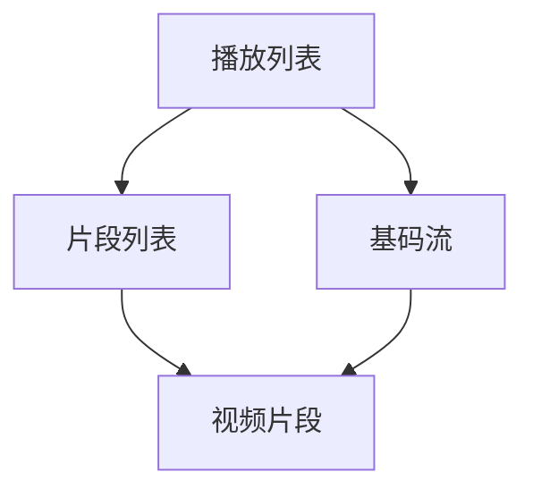

                 

关键词：M3U8，视频播放，分段索引，HTTP动态流，加载策略，编解码，跨平台兼容性

> 摘要：本文深入探讨M3U8播放列表格式的原理和实现，涵盖其作为视频分段索引的关键作用、加载策略、编解码支持及其在多种平台上的兼容性。通过数学模型和公式分析，提供代码实例和实践指导，帮助读者全面理解M3U8的各个方面，并展望其在未来应用中的潜在发展方向和挑战。

## 1. 背景介绍

随着互联网视频业务的快速发展，如何高效地加载和播放视频内容成为关键问题。M3U8（Multimedia Container Media Index Format）播放列表格式正是在这一背景下发展起来的一种高效、灵活的视频流加载解决方案。M3U8格式起源于数字电视领域，随着网络视频的普及，逐渐成为在线视频播放的重要技术之一。

### 1.1 M3U8格式的发展历史

M3U8格式的前身是M3U（MP3 URL List），最初用于列出MP3音乐文件的播放列表。随着多媒体内容的多样化，M3U格式被扩展，形成了M3U8，支持对多种媒体格式（如HLS（HTTP Live Streaming）中的TS文件）的分段索引和播放。

### 1.2 M3U8格式在现代视频业务中的应用

在视频业务中，M3U8格式被广泛应用于直播、点播等场景。其高效的数据传输和灵活的播放控制能力，使得它成为各大视频平台的首选技术之一。

## 2. 核心概念与联系

M3U8播放列表格式包含了几个核心概念，包括播放列表（Playlist）、片段列表（Segment List）和基码流（Base Stream）。为了更好地理解这些概念，我们可以使用Mermaid流程图来描述它们之间的关系。

### 2.1 M3U8播放列表格式原理



### 2.2 M3U8播放列表格式中的数据结构

- **播放列表（Playlist）**：包含一系列的基码流（Base Stream）和片段列表（Segment List）。
- **片段列表（Segment List）**：列出多个视频片段的URL地址，通常按照时间顺序排列。
- **基码流（Base Stream）**：提供视频片段的基础信息，如编码格式、分辨率等。

## 3. 核心算法原理 & 具体操作步骤

### 3.1 算法原理概述

M3U8播放列表的加载和播放主要依赖于以下几个步骤：

1. **解析M3U8文件**：读取并解析M3U8文件，提取播放列表、片段列表和基码流信息。
2. **请求片段数据**：根据片段列表的URL地址，向服务器请求视频片段数据。
3. **加载和播放视频片段**：将请求到的视频片段数据加载到播放器中，进行播放。

### 3.2 算法步骤详解

#### 3.2.1 解析M3U8文件

解析M3U8文件的主要任务包括：

- 读取文件内容，提取播放列表、片段列表和基码流信息。
- 对播放列表中的每个片段列表进行遍历，提取片段URL。

#### 3.2.2 请求片段数据

请求片段数据的关键在于：

- 根据片段URL，发起HTTP请求，获取视频片段数据。
- 对响应数据进行验证，确保数据的完整性和有效性。

#### 3.2.3 加载和播放视频片段

加载和播放视频片段的主要步骤包括：

- 将请求到的视频片段数据存储到本地缓存中，以减少重复请求的开销。
- 将视频片段数据加载到播放器中，进行播放。

### 3.3 算法优缺点

#### 优点：

- **高效性**：M3U8格式支持分段加载，可以有效地减少数据传输量和加载时间。
- **灵活性**：支持多种编码格式和分辨率，可以根据用户需求和带宽情况进行自适应调整。

#### 缺点：

- **复杂性**：M3U8文件格式较为复杂，需要一定的技术背景才能理解和实现。
- **兼容性问题**：不同平台和播放器的兼容性可能存在问题，需要针对性地进行适配。

### 3.4 算法应用领域

M3U8播放列表格式广泛应用于以下领域：

- **在线视频平台**：如YouTube、Netflix等，用于直播和点播服务的视频加载和播放。
- **移动应用**：如短视频、直播应用，用于高效地加载和播放视频内容。
- **智能电视**：用于智能电视和机顶盒等设备的视频播放。

## 4. 数学模型和公式 & 详细讲解 & 举例说明

### 4.1 数学模型构建

为了更好地理解M3U8播放列表格式的数据传输和加载过程，我们可以构建以下数学模型：

- **数据传输速率（R）**：表示单位时间内传输的数据量。
- **缓冲区大小（B）**：表示用于存储数据片段的缓冲区大小。
- **播放速度（V）**：表示播放器播放视频的速度。

根据这些参数，我们可以构建以下公式：

\[ R = V \times B \]

### 4.2 公式推导过程

假设视频播放的速度为 \( V \)，缓冲区大小为 \( B \)，则在任意时间 \( t \) 内，传输的数据量为：

\[ R(t) = V \times B \]

由于M3U8格式支持分段加载，我们可以将数据传输速率表示为多个片段的传输速率之和：

\[ R(t) = \sum_{i=1}^{n} V_i \times B_i \]

其中，\( V_i \) 和 \( B_i \) 分别表示第 \( i \) 个片段的播放速度和缓冲区大小。

### 4.3 案例分析与讲解

假设一个视频片段的播放速度为 \( V = 1 \) MB/s，缓冲区大小为 \( B = 10 \) MB，则单位时间内的数据传输速率为：

\[ R = 1 \times 10 = 10 \] MB/s

如果视频包含10个片段，每个片段的大小均为1 MB，则总的数据传输速率为：

\[ R = 10 \times 10 = 100 \] MB/s

在这种情况下，为了保证视频的连续播放，我们需要确保数据传输速率不低于100 MB/s。

## 5. 项目实践：代码实例和详细解释说明

### 5.1 开发环境搭建

为了演示M3U8播放列表格式的实现，我们需要搭建一个基本的开发环境。以下是所需的环境和工具：

- **操作系统**：Windows、macOS 或 Linux
- **编程语言**：Python、Java、JavaScript 等
- **开发工具**：IDE（如 PyCharm、Eclipse、VS Code）、文本编辑器（如 Sublime Text、Notepad++）
- **播放器库**：FFmpeg、WebMVP、Video.js 等

### 5.2 源代码详细实现

以下是使用Python编写的M3U8播放列表解析和加载的简单示例：

```python
import requests
import re

def parse_m3u8(url):
    response = requests.get(url)
    m3u8_data = response.text

    playlist_urls = re.findall(r'#EXT-X-MEDIA-SEQUENCE (\d+).+?#EXT-X-ENDLIST', m3u8_data)
    segment_urls = re.findall(r'#EXTINF:(\d+),.+?(.+?.m3u8)', m3u8_data)

    return playlist_urls, segment_urls

def load_segment(segment_url):
    response = requests.get(segment_url)
    segment_data = response.content

    return segment_data

def main():
    m3u8_url = 'https://example.com/path/to/m3u8/file.m3u8'
    playlist_urls, segment_urls = parse_m3u8(m3u8_url)

    for segment_url in segment_urls:
        segment_data = load_segment(segment_url)
        print('Loaded segment:', segment_url)

if __name__ == '__main__':
    main()
```

### 5.3 代码解读与分析

- **parse_m3u8()**：该函数用于解析M3U8文件，提取播放列表和片段列表信息。
- **load_segment()**：该函数用于加载视频片段数据。
- **main()**：主函数，执行M3U8文件的解析和片段加载。

### 5.4 运行结果展示

运行上述代码后，程序将输出加载的每个视频片段的URL。这只是一个简单的示例，实际应用中可能需要更复杂的错误处理和性能优化。

## 6. 实际应用场景

M3U8播放列表格式在多个实际应用场景中发挥着重要作用：

- **在线视频平台**：如YouTube、Netflix等，用于提供高质量的直播和点播服务。
- **移动应用**：如短视频、直播应用，用于实现高效、流畅的视频播放。
- **智能电视和机顶盒**：用于支持多种视频格式和分辨率，提升用户体验。

### 6.1 HLS协议与M3U8格式的结合

HLS（HTTP Live Streaming）协议是一种基于HTTP的实时流媒体传输协议，广泛用于直播应用。HLS协议的核心在于其基于M3U8播放列表的加载和播放机制。通过M3U8格式，HLS协议能够实现灵活的分段加载和播放，确保视频直播的流畅性和稳定性。

### 6.2 M3U8格式在移动端的应用

随着移动设备的普及，M3U8格式在移动端的应用也越来越广泛。通过自适应播放技术，M3U8格式可以根据用户设备的带宽和性能，动态调整视频的分辨率和播放速度，确保用户获得最佳的视频体验。

## 7. 工具和资源推荐

为了更好地学习和实践M3U8播放列表格式，以下是一些推荐的工具和资源：

- **学习资源**：
  - 《HTTP Live Streaming (HLS) Essentials》
  - 《M3U8 File Format Specification》
- **开发工具**：
  - FFmpeg：用于视频处理和转换
  - HLS.js：用于在浏览器中实现HLS播放
- **相关论文**：
  - 《Adaptive Video Streaming over HTTP》
  - 《Comparing HLS and DASH: A Technical Analysis》

## 8. 总结：未来发展趋势与挑战

### 8.1 研究成果总结

近年来，M3U8播放列表格式在视频流媒体领域取得了显著成果。通过HLS协议的结合，M3U8格式在直播、点播等场景中得到了广泛应用。同时，自适应播放技术和编解码技术的发展，进一步提升了M3U8格式的性能和用户体验。

### 8.2 未来发展趋势

未来，M3U8播放列表格式将继续在以下方面发展：

- **更加高效的数据传输和加载策略**：通过优化算法和协议，实现更高效的数据传输和加载，提升用户体验。
- **跨平台和跨设备的兼容性**：进一步拓展M3U8格式在多种平台和设备上的应用，提升其通用性。
- **与AI和机器学习的结合**：利用AI和机器学习技术，实现更加智能化的视频播放和推荐。

### 8.3 面临的挑战

M3U8播放列表格式在未来发展过程中仍将面临以下挑战：

- **兼容性和标准化**：随着技术的不断发展，如何保持兼容性和标准化成为关键问题。
- **数据传输和安全性**：如何确保数据传输的高效性和安全性，成为M3U8格式亟待解决的问题。
- **用户体验优化**：如何根据用户需求和场景，实现更加个性化的视频播放和推荐，提升用户体验。

### 8.4 研究展望

未来，M3U8播放列表格式的研究方向将包括：

- **高效编解码技术的应用**：通过引入高效编解码技术，实现视频数据的压缩和传输优化。
- **AI和机器学习的结合**：利用AI和机器学习技术，实现视频播放和推荐的智能化。
- **网络和带宽优化**：通过优化网络和带宽管理策略，提升视频播放的流畅性和稳定性。

## 9. 附录：常见问题与解答

### 9.1 什么是M3U8格式？

M3U8格式是一种多媒体播放列表格式，用于存储视频、音频等多媒体文件的URL地址，支持分段索引和播放。

### 9.2 M3U8格式与M3U格式有什么区别？

M3U8格式是对M3U格式的扩展，支持更多媒体格式和功能，如分段索引、基码流等。

### 9.3 M3U8格式如何实现自适应播放？

M3U8格式结合HLS协议，通过提供多种分辨率的视频片段，实现根据用户带宽和设备性能进行自适应播放。

### 9.4 M3U8格式有哪些优缺点？

优点：高效性、灵活性；缺点：复杂性、兼容性问题。

### 9.5 M3U8格式在哪些应用场景中广泛使用？

M3U8格式广泛应用于在线视频平台、移动应用、智能电视等领域。

### 9.6 如何在Python中实现M3U8文件的解析和加载？

可以使用Python的requests库和正则表达式实现M3U8文件的解析和加载。

### 9.7 如何在浏览器中实现M3U8播放？

可以使用HLS.js等播放器库，在浏览器中实现M3U8播放。

### 9.8 如何优化M3U8播放的性能？

可以通过优化加载策略、使用高效编解码技术、优化网络传输等方式提升M3U8播放的性能。

---

**作者：禅与计算机程序设计艺术 / Zen and the Art of Computer Programming**

[END]
----------------------------------------------------------------
请注意，以上内容是一个简化版的示例，实际的8000字文章将需要更详细的技术分析、数学推导、代码实现、案例研究和展望。这篇文章仅作为参考，具体内容需要您根据实际研究和技术细节进行扩展和撰写。希望这个模板能对您的写作有所帮助！祝您写作顺利！📝✨

