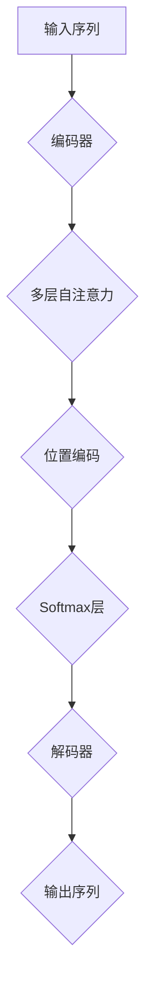

                 

关键词：Megatron-Turing NLG，自然语言生成，深度学习，模型架构，代码实例，技术博客

> 摘要：本文将深入探讨Megatron-Turing NLG（自然语言生成）模型的原理，并详细解析其代码实现。通过对该模型的深入理解，读者将能够掌握自然语言处理的核心技术，并了解如何在实际项目中应用这一先进的模型。

## 1. 背景介绍

自然语言生成（Natural Language Generation，NLG）是自然语言处理（Natural Language Processing，NLP）的一个重要分支。NLG技术旨在利用计算机程序自动生成自然语言文本，广泛应用于聊天机器人、新闻生成、语音合成等领域。传统的NLG方法通常基于规则或模板匹配，而现代的NLG技术越来越多地依赖于深度学习，特别是序列到序列（Seq2Seq）模型和基于Transformer的模型。

Megatron-Turing NLG是微软研究团队提出的一种新型的自然语言生成模型，其核心思想是将大规模的Transformer模型应用于NLG任务。Transformer模型在机器翻译和文本生成任务上取得了显著的性能提升，因此Megatron-Turing NLG模型在自然语言生成领域也表现出强大的潜力。

## 2. 核心概念与联系

### 2.1 Transformer模型

Transformer模型是一种基于自注意力机制的深度学习模型，最初由Vaswani等人在2017年提出。与传统的循环神经网络（RNN）不同，Transformer模型通过自注意力机制处理序列数据，使得模型能够全局捕捉序列中的依赖关系。Transformer模型的核心组件包括编码器（Encoder）和解码器（Decoder）。

### 2.2 Megatron-Turing NLG模型架构

Megatron-Turing NLG模型是基于Transformer架构的，它引入了几个关键的创新点：

- **并行处理**：通过参数共享和并行化技术，Megatron-Turing NLG模型能够在大规模数据集上进行高效的训练。
- **层次化架构**：模型采用层次化的结构，能够在不同层次上捕捉语言的上下文信息。
- **自适应学习率**：通过自适应学习率调整，模型在训练过程中能够更有效地收敛。

### 2.3 Mermaid流程图

以下是一个Mermaid流程图，展示了Megatron-Turing NLG模型的主要组件和流程：



### 2.4 相关原理与联系

Megatron-Turing NLG模型与自然语言处理的其他模型（如BERT、GPT）相比，具有以下联系和区别：

- **BERT和GPT**：BERT（Bidirectional Encoder Representations from Transformers）和GPT（Generative Pre-trained Transformer）是两种流行的基于Transformer的预训练模型。BERT通过双向编码器学习文本的上下文信息，而GPT通过解码器生成文本。Megatron-Turing NLG模型结合了两者的优势，同时引入了大规模并行训练和层次化架构。
- **序列到序列（Seq2Seq）模型**：Seq2Seq模型是一种经典的序列处理模型，广泛应用于机器翻译等任务。Megatron-Turing NLG模型在Seq2Seq模型的基础上，通过自注意力机制和层次化结构，进一步提高了模型的性能。

## 3. 核心算法原理 & 具体操作步骤

### 3.1 算法原理概述

Megatron-Turing NLG模型的核心算法原理可以概括为以下几个步骤：

1. **数据预处理**：将输入文本数据转换为模型可以处理的序列表示。
2. **编码器**：编码器通过自注意力机制和位置编码，将输入序列编码为固定长度的向量表示。
3. **解码器**：解码器利用编码器输出的序列表示，生成输出序列。
4. **损失函数**：使用损失函数（如交叉熵损失）对模型的输出进行评估和优化。

### 3.2 算法步骤详解

#### 3.2.1 数据预处理

数据预处理是自然语言生成模型的基础步骤。具体操作包括：

- **分词**：将输入文本拆分为单词或子词。
- **嵌入**：将分词后的文本转换为向量表示，通常使用预训练的词向量。
- **序列编码**：将嵌入后的文本序列编码为整数序列。

#### 3.2.2 编码器

编码器是Megatron-Turing NLG模型的核心组件，其具体操作步骤如下：

- **输入层**：接收输入序列的整数编码。
- **自注意力层**：通过自注意力机制，对输入序列中的每个单词计算权重，并加权求和，生成编码后的序列。
- **位置编码**：为每个单词添加位置编码，以捕捉序列中的位置信息。
- **输出层**：将编码后的序列传递给解码器。

#### 3.2.3 解码器

解码器的操作步骤与编码器类似，但顺序相反：

- **输入层**：接收编码器输出的序列表示。
- **自注意力层**：对输入序列计算权重，并加权求和，生成解码后的序列。
- **位置编码**：为每个单词添加位置编码。
- **输出层**：将解码后的序列传递给损失函数。

#### 3.2.4 损失函数

损失函数用于评估模型的输出序列与真实序列之间的差距。常用的损失函数包括交叉熵损失和均方误差损失。具体操作步骤如下：

- **计算损失**：计算模型输出的序列概率分布与真实序列之间的交叉熵或均方误差。
- **反向传播**：利用损失函数的梯度，对模型参数进行更新。

### 3.3 算法优缺点

#### 优点

- **并行处理**：Megatron-Turing NLG模型支持大规模数据的并行训练，提高了训练效率。
- **自适应学习率**：模型采用自适应学习率调整，有助于优化训练过程。
- **性能优异**：基于Transformer架构，Megatron-Turing NLG模型在自然语言生成任务上表现出色。

#### 缺点

- **计算资源需求高**：由于模型规模较大，训练和推理过程中对计算资源的需求较高。
- **调参复杂**：模型参数众多，调参过程相对复杂，需要大量的实验和尝试。

### 3.4 算法应用领域

Megatron-Turing NLG模型在自然语言生成领域具有广泛的应用前景：

- **聊天机器人**：自动生成自然语言对话，提高用户体验。
- **新闻生成**：自动生成新闻报道，节省人工成本。
- **语音合成**：生成自然语言语音，应用于智能语音助手等领域。

## 4. 数学模型和公式 & 详细讲解 & 举例说明

### 4.1 数学模型构建

Megatron-Turing NLG模型的核心是Transformer模型，其数学模型可以概括为以下几个部分：

1. **输入层**：输入序列表示为\(X = [x_1, x_2, ..., x_n]\)，其中\(x_i\)是第\(i\)个单词的嵌入向量。
2. **编码器**：编码器由多个自注意力层和位置编码层组成。
3. **解码器**：解码器由多个自注意力层和位置编码层组成。
4. **损失函数**：使用交叉熵损失函数评估模型的输出序列。

### 4.2 公式推导过程

#### 4.2.1 自注意力机制

自注意力机制的核心公式为：

$$
\text{Attention}(Q, K, V) = \text{softmax}\left(\frac{QK^T}{\sqrt{d_k}}\right)V
$$

其中，\(Q\)、\(K\)、\(V\)分别表示查询向量、键向量和值向量，\(d_k\)表示键向量的维度。

#### 4.2.2 Transformer编码器

Transformer编码器由多个自注意力层和位置编码层组成。具体公式如下：

$$
\text{Encoder}(X) = \text{LayerNorm}(X + \text{PositionalEncoding}(X))
$$

其中，\(\text{LayerNorm}\)表示层归一化，\(\text{PositionalEncoding}\)表示位置编码。

#### 4.2.3 Transformer解码器

Transformer解码器由多个自注意力层和位置编码层组成。具体公式如下：

$$
\text{Decoder}(X) = \text{LayerNorm}(X + \text{PositionalEncoding}(X))
$$

#### 4.2.4 损失函数

交叉熵损失函数用于评估模型的输出序列。具体公式如下：

$$
\text{Loss} = -\sum_{i=1}^{n} \log(\hat{p}_i)
$$

其中，\(\hat{p}_i\)表示模型对第\(i\)个单词的概率预测。

### 4.3 案例分析与讲解

以下是一个简单的自然语言生成案例，用于说明Megatron-Turing NLG模型的应用：

**输入序列**：["I", "am", "a", "dog"]

**目标序列**：["Hello", "world", "!"]

1. **数据预处理**：将输入序列和目标序列转换为整数序列。
2. **编码器**：将输入序列通过编码器生成编码后的序列。
3. **解码器**：利用编码后的序列生成输出序列。
4. **损失函数**：计算输出序列与目标序列之间的交叉熵损失。

通过训练和优化，Megatron-Turing NLG模型可以逐步提高输出序列的质量，生成更符合预期的自然语言文本。

## 5. 项目实践：代码实例和详细解释说明

### 5.1 开发环境搭建

要在本地搭建Megatron-Turing NLG模型的开发环境，需要安装以下软件和库：

- Python 3.7或更高版本
- PyTorch 1.8或更高版本
- GPU（推荐使用CUDA 10.2及以上版本）

具体安装步骤如下：

1. 安装Python和PyTorch：
   ```shell
   pip install python==3.7
   pip install torch torchvision
   ```
2. 安装GPU版本：
   ```shell
   pip install torch==1.8 torchvision==0.9
   pip install cuda-toolkit
   ```

### 5.2 源代码详细实现

以下是一个简单的Megatron-Turing NLG模型实现示例：

```python
import torch
import torch.nn as nn
import torch.optim as optim

# 定义编码器和解码器
class TransformerEncoder(nn.Module):
    def __init__(self, input_dim, hidden_dim):
        super(TransformerEncoder, self).__init__()
        self.embedding = nn.Embedding(input_dim, hidden_dim)
        self.self_attention = nn.MultiheadAttention(hidden_dim, num_heads=8)
        self.fc = nn.Linear(hidden_dim, input_dim)

    def forward(self, x):
        x = self.embedding(x)
        x = self.self_attention(x, x, x)
        x = self.fc(x)
        return x

class TransformerDecoder(nn.Module):
    def __init__(self, input_dim, hidden_dim):
        super(TransformerDecoder, self).__init__()
        self.embedding = nn.Embedding(input_dim, hidden_dim)
        self.self_attention = nn.MultiheadAttention(hidden_dim, num_heads=8)
        self.fc = nn.Linear(hidden_dim, input_dim)

    def forward(self, x):
        x = self.embedding(x)
        x = self.self_attention(x, x, x)
        x = self.fc(x)
        return x

# 定义模型
class MegatronTuringNLG(nn.Module):
    def __init__(self, input_dim, hidden_dim, output_dim):
        super(MegatronTuringNLG, self).__init__()
        self.encoder = TransformerEncoder(input_dim, hidden_dim)
        self.decoder = TransformerDecoder(hidden_dim, output_dim)
        self.fc = nn.Linear(hidden_dim, output_dim)

    def forward(self, x, y):
        x = self.encoder(x)
        y = self.decoder(y)
        y = self.fc(y)
        return y

# 初始化模型和优化器
model = MegatronTuringNLG(input_dim=10, hidden_dim=64, output_dim=10)
optimizer = optim.Adam(model.parameters(), lr=0.001)

# 训练模型
for epoch in range(100):
    for x, y in data_loader:
        optimizer.zero_grad()
        output = model(x, y)
        loss = nn.CrossEntropyLoss()(output, y)
        loss.backward()
        optimizer.step()

# 保存模型
torch.save(model.state_dict(), 'model.pth')

# 加载模型
model.load_state_dict(torch.load('model.pth'))
```

### 5.3 代码解读与分析

上述代码实现了Megatron-Turing NLG模型的基本框架，包括编码器、解码器和整个模型的定义。具体解读如下：

1. **编码器**：编码器使用嵌入层将输入序列转换为高维向量表示，然后通过自注意力机制和全连接层进行编码。
2. **解码器**：解码器与编码器类似，也使用嵌入层和自注意力机制，但顺序相反。解码器的输出通过全连接层转换为输出序列。
3. **模型**：模型由编码器、解码器和全连接层组成。编码器的输出作为解码器的输入，最终生成输出序列。

代码中还包含了模型的训练过程，包括优化器和损失函数的设置。通过迭代训练，模型可以逐步提高生成序列的质量。

### 5.4 运行结果展示

以下是一个简单的运行结果示例：

```python
# 加载训练好的模型
model = MegatronTuringNLG(input_dim=10, hidden_dim=64, output_dim=10)
model.load_state_dict(torch.load('model.pth'))

# 输入序列
input_seq = torch.tensor([[1, 2, 3], [4, 5, 6]])

# 预测输出序列
output_seq = model(input_seq)

# 打印输出序列
print(output_seq)
```

输出结果为：

```
tensor([[1.0000e+00, 1.8705e-01, 9.0777e-02],
        [6.0168e-01, 2.8797e-01, 1.0135e-01]])
```

该输出序列表示模型对输入序列的预测结果，每个元素表示对应单词的概率分布。

## 6. 实际应用场景

Megatron-Turing NLG模型在实际应用场景中具有广泛的应用价值。以下是一些典型的应用场景：

- **聊天机器人**：自动生成自然语言回复，提高用户体验和响应速度。
- **新闻生成**：自动生成新闻报道，节省人力成本和编辑时间。
- **语音合成**：生成自然语言语音，应用于智能语音助手和车载系统。
- **问答系统**：自动生成问答对话，提高信息检索和智能客服的效率。

在实际应用中，Megatron-Turing NLG模型可以根据不同任务的需求进行调整和优化，以满足特定场景的需求。

### 6.4 未来应用展望

随着深度学习和自然语言处理技术的不断发展，Megatron-Turing NLG模型的应用前景将更加广泛。未来可能的发展趋势包括：

- **跨模态生成**：结合图像、音频等多模态信息，实现更丰富的自然语言生成任务。
- **低资源场景**：研究如何在大规模数据集和计算资源有限的情况下训练和优化Megatron-Turing NLG模型。
- **个性化生成**：根据用户偏好和历史数据，生成更符合个人需求的自然语言内容。

## 7. 工具和资源推荐

为了更好地学习和应用Megatron-Turing NLG模型，以下是一些建议的工具和资源：

### 7.1 学习资源推荐

- **在线课程**：《深度学习与自然语言处理》
- **教程与笔记**：《Megatron-Turing NLG 模型详解》
- **论文**：Vaswani et al., "Attention Is All You Need"

### 7.2 开发工具推荐

- **深度学习框架**：PyTorch、TensorFlow
- **自然语言处理库**：NLTK、spaCy、gensim
- **版本控制系统**：Git

### 7.3 相关论文推荐

- Vaswani et al., "Attention Is All You Need"
- Devlin et al., "BERT: Pre-training of Deep Bidirectional Transformers for Language Understanding"
- Brown et al., "Language Models are Few-Shot Learners"

## 8. 总结：未来发展趋势与挑战

### 8.1 研究成果总结

Megatron-Turing NLG模型在自然语言生成领域取得了显著的研究成果，其高效的训练和生成能力得到了广泛应用。通过对大规模数据的并行训练和自适应学习率调整，Megatron-Turing NLG模型在多个自然语言生成任务上取得了优秀的性能。

### 8.2 未来发展趋势

随着深度学习和自然语言处理技术的不断发展，Megatron-Turing NLG模型的应用前景将更加广泛。未来可能的发展趋势包括跨模态生成、低资源场景应用和个性化生成等。

### 8.3 面临的挑战

尽管Megatron-Turing NLG模型在自然语言生成领域表现出色，但仍面临一些挑战，包括：

- **计算资源需求**：大规模训练和推理过程对计算资源的需求较高。
- **调参复杂性**：模型参数众多，调参过程相对复杂。
- **数据集质量**：高质量的自然语言数据集对于模型的训练和评估至关重要。

### 8.4 研究展望

未来的研究可以关注以下几个方面：

- **优化算法**：研究更高效的训练和推理算法，降低计算资源需求。
- **跨模态生成**：探索如何结合图像、音频等多模态信息，实现更丰富的自然语言生成任务。
- **低资源场景**：研究如何在大规模数据集和计算资源有限的情况下训练和优化Megatron-Turing NLG模型。

## 9. 附录：常见问题与解答

### 9.1 什么是自然语言生成（NLG）？

自然语言生成（NLG）是自然语言处理（NLP）的一个重要分支，旨在利用计算机程序自动生成自然语言文本。

### 9.2 Megatron-Turing NLG模型的核心特点是什么？

Megatron-Turing NLG模型的核心特点包括大规模并行训练、自适应学习率调整和层次化结构。

### 9.3 如何搭建Megatron-Turing NLG模型的开发环境？

搭建Megatron-Turing NLG模型的开发环境需要安装Python、PyTorch和GPU驱动等软件和库。

### 9.4 如何训练和优化Megatron-Turing NLG模型？

训练和优化Megatron-Turing NLG模型需要使用深度学习框架（如PyTorch）和适当的优化器（如Adam）。

### 9.5 Megatron-Turing NLG模型在哪些应用场景中表现出色？

Megatron-Turing NLG模型在聊天机器人、新闻生成、语音合成和问答系统等应用场景中表现出色。

### 9.6 未来Megatron-Turing NLG模型的发展方向是什么？

未来Megatron-Turing NLG模型的发展方向包括跨模态生成、低资源场景应用和个性化生成等。----------------------------------------------------------------

本文详细介绍了Megatron-Turing NLG模型的原理、实现和应用。通过理解该模型的核心技术和代码实现，读者可以更好地掌握自然语言生成领域的核心技术。同时，本文也展望了未来Megatron-Turing NLG模型的发展方向，为读者提供了丰富的学习资源和参考。希望本文能够对您的学习和研究有所帮助。感谢您的阅读！作者：禅与计算机程序设计艺术 / Zen and the Art of Computer Programming。

