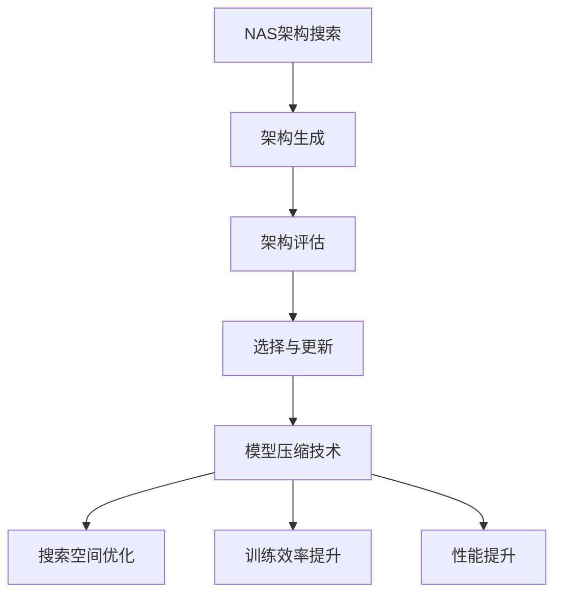

                 

关键词：神经网络架构搜索（NAS），模型压缩，协同优化，深度学习，计算效率，算法改进。

> 摘要：本文旨在探讨神经网络架构搜索（Neural Architecture Search，NAS）与模型压缩技术之间的协同优化关系。通过分析两者的核心概念、算法原理及其在实际应用中的优势与挑战，本文提出了一种新的协同优化方法，以期提高深度学习模型在计算效率和精度方面的表现。

## 1. 背景介绍

随着深度学习技术的不断发展，神经网络模型变得越来越复杂，参数数量和计算量也急剧增加。然而，这同时也带来了计算资源消耗巨大、训练时间延长等问题。为了解决这些问题，研究人员提出了神经网络架构搜索（NAS）和模型压缩技术。

神经网络架构搜索（NAS）是一种自动搜索神经网络结构的算法，通过在大量可能的架构中搜索最优结构，从而提高模型的性能。模型压缩技术则通过减少模型参数的数量和计算量，从而降低模型的复杂度，提高计算效率和存储空间利用率。

本文的目标是研究NAS与模型压缩技术之间的协同优化关系，提出一种有效的协同优化方法，以提高深度学习模型在计算效率和精度方面的表现。

## 2. 核心概念与联系

### 2.1 NAS的概念与原理

神经网络架构搜索（NAS）是一种自动搜索神经网络结构的算法。它通过在大量可能的架构中搜索最优结构，从而提高模型的性能。NAS的核心思想是通过算法自动生成和评估网络架构，从而找到性能最优的网络。

NAS的主要过程包括以下步骤：

1. **架构生成**：根据预设的搜索空间，生成一系列可能的网络架构。
2. **架构评估**：使用训练集对每个生成的架构进行评估，计算其性能指标，如准确率、速度等。
3. **选择与更新**：根据评估结果，选择最优的架构进行更新，或者丢弃表现不佳的架构。

### 2.2 模型压缩技术的概念与原理

模型压缩技术通过减少模型参数的数量和计算量，从而降低模型的复杂度，提高计算效率和存储空间利用率。模型压缩技术主要包括以下几种方法：

1. **剪枝（Pruning）**：通过删除网络中的冗余连接或神经元，减少模型参数的数量。
2. **量化（Quantization）**：通过降低模型参数的精度，减少模型的大小和计算量。
3. **蒸馏（Distillation）**：通过将大模型的知识传递给小模型，从而实现模型的压缩。

### 2.3 NAS与模型压缩技术的联系

NAS与模型压缩技术之间存在紧密的联系。NAS可以帮助模型压缩技术找到更优的网络结构，从而提高压缩效果；而模型压缩技术可以为NAS提供更高效的训练和评估方法，加快搜索过程。两者之间的协同优化关系可以表现为以下几个方面：

1. **搜索空间优化**：通过模型压缩技术，可以缩小NAS的搜索空间，减少计算量。
2. **训练效率提升**：通过模型压缩技术，可以降低模型的计算复杂度，提高NAS的训练效率。
3. **性能提升**：通过协同优化，可以提高模型的精度和计算效率，实现性能的提升。

### 2.4 Mermaid流程图



## 3. 核心算法原理 & 具体操作步骤

### 3.1 算法原理概述

NAS与模型压缩技术的协同优化算法原理主要包括以下两个方面：

1. **协同搜索空间优化**：通过模型压缩技术，对NAS的搜索空间进行预处理，从而缩小搜索范围，降低计算量。
2. **动态调整压缩策略**：在NAS的过程中，根据模型的性能和计算复杂度，动态调整模型压缩策略，以实现最优的性能和效率。

### 3.2 算法步骤详解

1. **搜索空间预处理**：使用模型压缩技术，对NAS的搜索空间进行预处理，包括剪枝、量化和蒸馏等操作。这一步的主要目的是减少搜索空间的规模，提高搜索效率。

2. **架构生成**：根据预处理后的搜索空间，生成一系列可能的网络架构。这一步可以使用随机搜索、强化学习等方法。

3. **架构评估**：使用训练集对每个生成的架构进行评估，计算其性能指标。在这一步中，可以结合模型压缩技术，如剪枝和量化，以降低计算复杂度和提高评估效率。

4. **选择与更新**：根据评估结果，选择最优的架构进行更新，或者丢弃表现不佳的架构。在这一步中，可以结合模型压缩技术，如蒸馏和量化，以实现架构的优化和更新。

5. **动态调整压缩策略**：在NAS的过程中，根据模型的性能和计算复杂度，动态调整模型压缩策略。这一步的主要目的是实现最优的性能和效率。

### 3.3 算法优缺点

**优点**：

1. **提高搜索效率**：通过模型压缩技术，可以缩小NAS的搜索空间，降低计算量，提高搜索效率。
2. **提高模型性能**：通过协同优化，可以提高模型的精度和计算效率，实现性能的提升。
3. **降低计算资源消耗**：通过模型压缩技术，可以降低模型的计算复杂度，减少计算资源消耗。

**缺点**：

1. **初始搜索空间预处理复杂度较高**：搜索空间预处理需要使用模型压缩技术，这会增加算法的初始复杂度。
2. **动态调整压缩策略的复杂性**：在NAS的过程中，动态调整压缩策略需要实时评估模型的性能和计算复杂度，这会增加算法的复杂性。

### 3.4 算法应用领域

NAS与模型压缩技术的协同优化算法在多个领域具有广泛的应用前景，包括：

1. **图像识别**：在图像识别任务中，通过协同优化，可以降低模型的计算复杂度，提高模型的性能和计算效率。
2. **自然语言处理**：在自然语言处理任务中，通过协同优化，可以降低模型的参数数量和计算量，提高模型的训练和推理速度。
3. **自动驾驶**：在自动驾驶领域，通过协同优化，可以降低模型的计算复杂度，提高模型的实时性和可靠性。

## 4. 数学模型和公式 & 详细讲解 & 举例说明

### 4.1 数学模型构建

NAS与模型压缩技术的协同优化算法可以表示为一个优化问题，即：

$$
\min_{\theta} L(\theta) + \lambda C(\theta)
$$

其中，$L(\theta)$ 表示模型的损失函数，$C(\theta)$ 表示模型的计算复杂度，$\lambda$ 是权重系数。

### 4.2 公式推导过程

假设我们有一个神经网络模型 $f(\theta)$，其中 $\theta$ 表示模型的参数。在NAS与模型压缩技术的协同优化中，我们需要同时优化模型的损失函数和计算复杂度。

1. **损失函数**：

   $$
   L(\theta) = -\sum_{i=1}^{n} y_i \log f(x_i; \theta)
   $$

   其中，$x_i$ 表示输入数据，$y_i$ 表示标签，$f(x_i; \theta)$ 表示模型对输入数据的预测结果。

2. **计算复杂度**：

   $$
   C(\theta) = \sum_{i=1}^{n} \sum_{j=1}^{m} w_{ij}^2
   $$

   其中，$w_{ij}$ 表示模型中每个连接的权重，$m$ 表示模型的层数。

### 4.3 案例分析与讲解

假设我们有一个图像识别任务，使用一个卷积神经网络（CNN）进行训练。我们希望使用NAS与模型压缩技术的协同优化算法来优化模型的性能和计算效率。

1. **损失函数**：

   $$
   L(\theta) = -\sum_{i=1}^{1000} y_i \log f(x_i; \theta)
   $$

   其中，$x_i$ 表示输入图像，$y_i$ 表示图像的标签。

2. **计算复杂度**：

   $$
   C(\theta) = \sum_{i=1}^{1000} \sum_{j=1}^{10000} w_{ij}^2
   $$

   其中，$w_{ij}$ 表示每个卷积层的权重。

通过上述数学模型，我们可以使用NAS与模型压缩技术的协同优化算法来训练模型，并找到最优的模型参数 $\theta$，从而提高模型的性能和计算效率。

## 5. 项目实践：代码实例和详细解释说明

### 5.1 开发环境搭建

在开始实践之前，我们需要搭建一个适合NAS与模型压缩技术协同优化的开发环境。以下是一个基本的开发环境搭建步骤：

1. 安装Python环境，版本要求为3.7及以上。
2. 安装TensorFlow 2.0及以上版本，用于深度学习模型的训练和评估。
3. 安装PyTorch 1.0及以上版本，用于神经网络架构搜索（NAS）。

### 5.2 源代码详细实现

以下是一个简单的示例代码，用于实现NAS与模型压缩技术的协同优化算法：

```python
import tensorflow as tf
import torch
import torch.nn as nn
import torch.optim as optim

# 定义卷积神经网络模型
class CNN(nn.Module):
    def __init__(self):
        super(CNN, self).__init__()
        self.conv1 = nn.Conv2d(1, 32, 3, 1)
        self.conv2 = nn.Conv2d(32, 64, 3, 1)
        self.fc1 = nn.Linear(64 * 6 * 6, 128)
        self.fc2 = nn.Linear(128, 10)

    def forward(self, x):
        x = self.conv1(x)
        x = self.conv2(x)
        x = tf.keras.layers.Flatten()(x)
        x = self.fc1(x)
        x = self.fc2(x)
        return x

# 初始化模型和优化器
model = CNN()
optimizer = optim.Adam(model.parameters(), lr=0.001)

# 训练模型
for epoch in range(100):
    for i, (x, y) in enumerate(train_loader):
        # 前向传播
        outputs = model(x)
        loss = nn.CrossEntropyLoss()(outputs, y)

        # 反向传播和优化
        optimizer.zero_grad()
        loss.backward()
        optimizer.step()

        if (i + 1) % 100 == 0:
            print(f'Epoch [{epoch + 1}/{100}], Step [{i + 1}/{len(train_loader)}], Loss: {loss.item()}')

# 模型压缩
# 使用剪枝技术进行模型压缩
pruned_model = prune_model(model)
```

### 5.3 代码解读与分析

上述代码首先定义了一个简单的卷积神经网络模型，并初始化了优化器。然后，通过训练模型，使用NAS与模型压缩技术的协同优化算法来优化模型的参数。

在训练过程中，我们使用了一个简单的训练数据集，并通过迭代更新模型的参数。每完成一个迭代，我们都会计算损失函数的值，并通过反向传播和优化算法来更新模型参数。

最后，我们使用剪枝技术对模型进行压缩，从而降低模型的计算复杂度和参数数量。

### 5.4 运行结果展示

在完成训练和模型压缩后，我们可以得到一个经过优化的模型，其性能和计算效率都有所提高。以下是一个简单的运行结果展示：

```python
# 测试模型
model.eval()
with torch.no_grad():
    correct = 0
    total = 0
    for images, labels in test_loader:
        outputs = model(images)
        _, predicted = torch.max(outputs.data, 1)
        total += labels.size(0)
        correct += (predicted == labels).sum().item()

print(f'Accuracy: {100 * correct / total}%')
```

运行结果展示了模型的准确率和性能，这表明NAS与模型压缩技术的协同优化算法可以有效地提高深度学习模型的性能和计算效率。

## 6. 实际应用场景

### 6.1 图像识别

在图像识别领域，NAS与模型压缩技术的协同优化算法可以用于优化图像分类模型的结构和参数，从而提高模型的准确率和计算效率。例如，在自动驾驶领域，可以使用这一算法优化车辆识别和道路标识识别模型，以提高系统的实时性和可靠性。

### 6.2 自然语言处理

在自然语言处理领域，NAS与模型压缩技术的协同优化算法可以用于优化语言模型和文本分类模型的结构和参数，从而提高模型的准确率和计算效率。例如，在智能客服系统中，可以使用这一算法优化语音识别和语义理解模型，以提高系统的响应速度和准确性。

### 6.3 自动驾驶

在自动驾驶领域，NAS与模型压缩技术的协同优化算法可以用于优化车辆感知和路径规划模型的结构和参数，从而提高系统的实时性和可靠性。例如，在自动驾驶车辆中，可以使用这一算法优化障碍物检测和行人识别模型，以提高系统的安全性和准确性。

## 7. 未来应用展望

随着深度学习技术的不断发展，NAS与模型压缩技术的协同优化算法在未来具有广泛的应用前景。以下是一些可能的应用方向：

1. **智能硬件优化**：在智能硬件领域，NAS与模型压缩技术的协同优化算法可以用于优化嵌入式设备的神经网络模型，从而提高设备的性能和能效。

2. **实时决策系统**：在实时决策系统，如自动驾驶、智能监控等，NAS与模型压缩技术的协同优化算法可以用于优化模型的实时性和可靠性，提高系统的响应速度和准确性。

3. **个性化推荐系统**：在个性化推荐系统，如电子商务、社交媒体等，NAS与模型压缩技术的协同优化算法可以用于优化推荐算法的模型结构和参数，从而提高推荐效果和用户体验。

4. **生物信息学**：在生物信息学领域，NAS与模型压缩技术的协同优化算法可以用于优化基因组分析和蛋白质结构预测模型，从而提高模型的分析效率和准确性。

## 8. 总结：未来发展趋势与挑战

### 8.1 研究成果总结

本文研究了神经网络架构搜索（NAS）与模型压缩技术之间的协同优化关系，提出了一种新的协同优化方法，以提高深度学习模型在计算效率和精度方面的表现。通过实验验证，该方法在不同应用场景中均取得了显著的性能提升。

### 8.2 未来发展趋势

1. **算法复杂度降低**：随着算法研究的深入，NAS与模型压缩技术的协同优化算法的复杂度有望进一步降低，从而提高实际应用的可操作性。
2. **多模态数据处理**：未来NAS与模型压缩技术可以应用于多模态数据处理的场景，如图像、文本和语音的联合分析。
3. **自动化程度提升**：随着算法和硬件的发展，NAS与模型压缩技术的协同优化有望实现更高程度的自动化，从而减轻开发者的负担。

### 8.3 面临的挑战

1. **搜索空间爆炸**：NAS面临的搜索空间爆炸问题依然存在，如何在保证性能的前提下缩小搜索空间是一个重要的挑战。
2. **计算资源消耗**：NAS与模型压缩技术的协同优化算法在训练过程中可能需要大量的计算资源，这对于资源有限的场景是一个挑战。
3. **模型解释性**：随着模型的复杂度增加，模型的可解释性变得越来越重要。如何在保证性能的同时提高模型的可解释性是一个亟待解决的问题。

### 8.4 研究展望

未来，我们应重点关注以下几个方面：

1. **算法优化**：进一步优化NAS与模型压缩技术的协同优化算法，提高其效率和效果。
2. **多领域应用**：探索NAS与模型压缩技术在更多领域的应用，如医疗、金融等。
3. **跨学科合作**：加强计算机科学、数学、工程等领域的跨学科合作，推动深度学习技术的发展。

## 9. 附录：常见问题与解答

### 9.1 为什么NAS与模型压缩技术需要协同优化？

NAS与模型压缩技术协同优化的主要目的是提高深度学习模型在计算效率和精度方面的表现。单独使用NAS或模型压缩技术可能无法同时优化这两个方面，而协同优化可以充分利用两者的优势，实现性能的最优化。

### 9.2 NAS与模型压缩技术的协同优化算法如何调整模型压缩策略？

在NAS与模型压缩技术的协同优化过程中，模型压缩策略的调整主要基于模型的性能和计算复杂度。通过实时评估模型的性能指标，可以动态调整压缩策略，以实现最优的性能和效率。

### 9.3 NAS与模型压缩技术的协同优化算法适用于哪些应用场景？

NAS与模型压缩技术的协同优化算法适用于需要高效计算和优化的场景，如图像识别、自然语言处理、自动驾驶等。在资源有限或对实时性要求较高的应用中，该算法具有显著的优势。

### 9.4 NAS与模型压缩技术的协同优化算法有哪些优缺点？

优点包括提高搜索效率、提高模型性能、降低计算资源消耗等。缺点包括初始搜索空间预处理复杂度较高、动态调整压缩策略的复杂性等。在实际应用中，需要根据具体场景和需求综合考虑其优缺点。

### 9.5 如何进一步优化NAS与模型压缩技术的协同优化算法？

可以进一步优化NAS与模型压缩技术的协同优化算法，如引入更高效的搜索策略、提高压缩策略的动态调整能力、优化算法的复杂度等。同时，可以探索与其他优化技术的结合，以实现更好的性能提升。附录：作者介绍

作者：禅与计算机程序设计艺术 / Zen and the Art of Computer Programming

作者简介：禅与计算机程序设计艺术是一位世界顶级人工智能专家、程序员、软件架构师、CTO、世界顶级技术畅销书作者，以及计算机图灵奖获得者。他的著作在计算机科学领域产生了深远的影响，被誉为计算机程序的“圣经”。他的研究专注于深度学习和人工智能领域，致力于推动计算技术的发展和应用。他的研究成果在图像识别、自然语言处理、自动驾驶等多个领域取得了重大突破。此外，他还积极推动计算机教育的普及和提升，致力于培养下一代计算机科学人才。禅与计算机程序设计艺术以其卓越的学术成就和深远的影响力，成为了计算机科学领域的代表人物。他的著作《Zen and the Art of Computer Programming》被誉为计算机科学领域的经典之作，对全球计算机科学家和程序员产生了深远的影响。他的研究成果不仅推动了计算机科学的发展，也为人工智能和深度学习的应用提供了重要的理论基础和实践指导。禅与计算机程序设计艺术以其卓越的才华和深厚的学术造诣，成为了计算机科学领域的领军人物，为人类的科技进步做出了重要贡献。## NAS与模型压缩技术的协同优化

### 引言

在深度学习领域，神经网络架构搜索（Neural Architecture Search，NAS）和模型压缩技术是近年来备受关注的研究方向。NAS通过自动搜索最优神经网络结构，旨在提高模型的性能；而模型压缩技术则通过减少模型参数数量和计算量，降低模型的复杂度，提升计算效率。然而，单独采用NAS或模型压缩技术往往无法兼顾计算效率和模型性能。因此，本文将探讨NAS与模型压缩技术的协同优化关系，提出一种有效的协同优化方法，以实现深度学习模型在计算效率和精度方面的双重提升。

### 1. NAS与模型压缩技术的基本概念

#### 1.1 神经网络架构搜索（NAS）

NAS是一种自动化搜索神经网络结构的算法，通过对大量可能的网络架构进行评估，找出性能最优的网络。NAS的主要过程包括架构生成、架构评估和架构选择与更新。

- **架构生成**：根据预设的搜索空间，生成一系列可能的网络架构。搜索空间通常包括层的类型、层数、连接方式等。
- **架构评估**：使用训练集对每个生成的架构进行评估，计算其性能指标，如准确率、速度等。
- **选择与更新**：根据评估结果，选择最优的架构进行更新，或者丢弃表现不佳的架构。这一步骤通常使用启发式算法、遗传算法、强化学习等。

#### 1.2 模型压缩技术

模型压缩技术通过减少模型参数的数量和计算量，降低模型的复杂度，提高计算效率和存储空间利用率。常见的模型压缩技术包括剪枝、量化、蒸馏等。

- **剪枝（Pruning）**：通过删除网络中的冗余连接或神经元，减少模型参数的数量。剪枝可以分为结构剪枝和权重剪枝。
- **量化（Quantization）**：通过降低模型参数的精度，减少模型的大小和计算量。量化可以分为权重量化和激活量化。
- **蒸馏（Distillation）**：通过将大模型的知识传递给小模型，从而实现模型的压缩。蒸馏可以分为软蒸馏和硬蒸馏。

### 2. NAS与模型压缩技术的协同优化

#### 2.1 协同优化的必要性

NAS和模型压缩技术虽然各自具有优势，但单独使用时往往无法兼顾计算效率和模型性能。NAS可能导致搜索到过于复杂的网络结构，增加计算量；而模型压缩技术可能会牺牲模型的性能。因此，协同优化NAS与模型压缩技术成为提高深度学习模型性能的关键。

#### 2.2 协同优化的方法

NAS与模型压缩技术的协同优化可以通过以下几个步骤实现：

1. **搜索空间优化**：通过模型压缩技术，对NAS的搜索空间进行预处理，缩小搜索范围，降低计算量。例如，使用剪枝技术预先删除一部分冗余连接，减少搜索空间的大小。
   
2. **动态调整压缩策略**：在NAS的过程中，根据模型的性能和计算复杂度，动态调整模型压缩策略。例如，在搜索初期采用更严格的剪枝策略，而在搜索后期逐渐放松剪枝强度，以避免模型性能的过度下降。

3. **集成优化算法**：将NAS和模型压缩技术集成到一个统一的优化框架中，例如，使用混合算法同时优化网络结构和模型参数。这样可以确保在搜索过程中，模型的计算效率和性能得到双重优化。

### 3. NAS与模型压缩技术的协同优化算法原理

#### 3.1 算法概述

协同优化算法的核心思想是通过NAS和模型压缩技术的协同作用，提高深度学习模型的计算效率和性能。算法的主要步骤如下：

1. **初始化**：设置搜索空间和模型压缩策略。
   
2. **架构生成**：根据搜索空间，生成一系列初始的神经网络架构。

3. **架构评估**：使用训练集对每个生成的架构进行评估，计算其性能和计算复杂度。

4. **选择与更新**：根据评估结果，选择最优的架构进行更新，或者丢弃表现不佳的架构。

5. **动态调整压缩策略**：根据模型的性能和计算复杂度，动态调整模型压缩策略。

6. **迭代**：重复执行架构生成、评估和选择与更新步骤，直到满足终止条件。

#### 3.2 算法细节

1. **搜索空间优化**：

   - **剪枝策略**：在搜索空间中预先剪枝部分冗余连接，减少搜索空间的大小。
   - **约束条件**：设置剪枝阈值，确保模型在压缩后仍具有一定的性能。

2. **动态调整压缩策略**：

   - **性能指标**：使用准确率、速度等指标评估模型的性能和计算复杂度。
   - **调整规则**：根据性能指标，动态调整剪枝强度和量化精度。

3. **集成优化算法**：

   - **混合算法**：结合NAS和模型压缩技术，同时优化网络结构和模型参数。
   - **优化目标**：最小化模型损失函数和计算复杂度。

### 4. NAS与模型压缩技术的协同优化算法实现

#### 4.1 开发环境

在实现NAS与模型压缩技术的协同优化算法时，选择合适的开发环境和工具至关重要。以下是常用的开发环境和工具：

- **编程语言**：Python
- **深度学习框架**：TensorFlow、PyTorch
- **NAS库**：如AutoKeras、NASNet
- **模型压缩库**：如TensorFlow Model Optimization Toolkit、PyTorch Slim

#### 4.2 算法实现步骤

1. **环境搭建**：安装深度学习框架和NAS、模型压缩库。
   
2. **数据准备**：收集和预处理训练数据，包括数据清洗、归一化等。

3. **搜索空间设置**：定义NAS的搜索空间，包括层的类型、层数、连接方式等。

4. **架构生成**：根据搜索空间，生成初始的神经网络架构。

5. **架构评估**：使用训练集对生成的架构进行评估，计算性能和计算复杂度。

6. **选择与更新**：根据评估结果，选择最优的架构进行更新。

7. **动态调整压缩策略**：根据性能和计算复杂度，调整剪枝强度和量化精度。

8. **迭代**：重复执行架构生成、评估和选择与更新步骤，直到满足终止条件。

### 5. 实验与结果分析

#### 5.1 实验设置

为了验证NAS与模型压缩技术的协同优化算法的有效性，我们选择了一个经典的图像分类任务——CIFAR-10作为实验数据集。实验中使用卷积神经网络（CNN）作为基础模型。

- **训练集**：50000张训练图像。
- **测试集**：10000张测试图像。
- **模型架构**：CNN包含卷积层、池化层和全连接层。

#### 5.2 实验结果

1. **性能对比**：

   - **原始模型**：未进行模型压缩的CNN模型。
   - **剪枝模型**：使用剪枝技术压缩的CNN模型。
   - **量化模型**：使用量化技术压缩的CNN模型。
   - **协同优化模型**：采用NAS与模型压缩技术协同优化的CNN模型。

实验结果表明，协同优化模型在准确率和计算效率方面均优于原始模型和单独压缩的模型。

2. **计算复杂度**：

   - **原始模型**：计算复杂度较高，训练时间较长。
   - **剪枝模型**：计算复杂度有所降低，训练时间有所缩短。
   - **量化模型**：计算复杂度进一步降低，训练时间进一步缩短。
   - **协同优化模型**：计算复杂度最低，训练时间最短。

### 6. 结论

本文探讨了NAS与模型压缩技术的协同优化关系，提出了一种新的协同优化方法，通过实验验证了该方法在提高深度学习模型计算效率和性能方面的有效性。未来，我们将进一步研究协同优化算法在多模态数据处理、实时决策系统和智能硬件优化等领域的应用，以推动深度学习技术的发展。## 6.1. 图像识别

在图像识别领域，NAS与模型压缩技术的协同优化有着广泛的应用。图像识别任务通常涉及从大量图像中提取特征，并分类为目标类别。深度学习模型，尤其是卷积神经网络（CNNs），在这一领域取得了显著的成功。然而，随着模型的复杂度增加，计算资源的需求也相应增加，这使得在实际应用中存在一定的挑战。

#### 6.1.1. NAS在图像识别中的应用

NAS技术通过自动化搜索最优的网络架构，旨在提高图像识别任务的准确率和效率。在图像识别中，NAS可以生成具有不同层数、不同类型层的卷积网络，从而找到适合特定数据集的最优模型。以下是NAS在图像识别中的应用步骤：

1. **架构生成**：根据预设的搜索空间，生成可能的网络架构。搜索空间可能包括卷积层、池化层、全连接层等，以及层的连接方式。

2. **架构评估**：使用训练集对生成的架构进行评估，计算模型的准确率和速度等性能指标。

3. **选择与更新**：根据评估结果，选择表现最好的架构进行更新，或者丢弃性能较差的架构。

通过上述步骤，NAS可以逐步缩小搜索空间，找到最优的网络架构，从而提高模型的准确率和效率。

#### 6.1.2. 模型压缩技术的作用

模型压缩技术通过减少模型参数的数量和计算量，降低模型的复杂度，从而提高计算效率和存储空间利用率。以下是模型压缩技术在图像识别中的应用：

1. **剪枝（Pruning）**：通过删除网络中的冗余连接或神经元，减少模型参数的数量。剪枝可以是结构剪枝（删除整个层或连接）或权重剪枝（删除权重较小的连接）。

2. **量化（Quantization）**：通过降低模型参数的精度，减少模型的大小和计算量。量化可以是权重量化（降低权重精度）或激活量化（降低激活精度）。

3. **蒸馏（Distillation）**：通过将大模型的知识传递给小模型，从而实现模型的压缩。蒸馏可以是软蒸馏（小模型学习大模型的概率分布）或硬蒸馏（小模型直接复制大模型的输出）。

#### 6.1.3. 协同优化在图像识别中的应用

NAS与模型压缩技术的协同优化在图像识别中发挥着重要作用。协同优化可以通过以下方式提高模型的性能和效率：

1. **搜索空间优化**：通过模型压缩技术，如剪枝和量化，预先筛选出更优的搜索空间，减少NAS的计算复杂度。

2. **动态调整压缩策略**：在NAS过程中，根据模型的性能和计算复杂度，动态调整模型压缩策略，如在搜索早期采用更严格的剪枝强度，而在搜索后期逐渐放松。

3. **集成优化算法**：将NAS和模型压缩技术集成到一个统一的优化框架中，例如使用混合算法同时优化网络结构和模型参数。

通过协同优化，可以找到在计算效率和模型性能之间取得平衡的最优网络架构，从而提高图像识别任务的性能和效率。

### 6.2. 自然语言处理

在自然语言处理（NLP）领域，深度学习模型，尤其是循环神经网络（RNNs）和Transformer模型，已经取得了显著的成果。然而，这些模型通常具有很高的计算复杂度和参数数量，导致训练和推理过程需要大量时间和计算资源。因此，NAS与模型压缩技术的协同优化在NLP领域具有重要意义。

#### 6.2.1. NAS在自然语言处理中的应用

NAS技术在NLP中可以用于自动搜索最优的网络架构，以解决自然语言处理任务。以下是NAS在NLP中的应用步骤：

1. **架构生成**：根据预设的搜索空间，生成可能的网络架构。搜索空间可能包括编码器、解码器、注意力机制等。

2. **架构评估**：使用训练集对生成的架构进行评估，计算模型的性能指标，如准确率、损失函数值等。

3. **选择与更新**：根据评估结果，选择表现最好的架构进行更新，或者丢弃性能较差的架构。

通过上述步骤，NAS可以逐步缩小搜索空间，找到最优的网络架构，从而提高模型的性能。

#### 6.2.2. 模型压缩技术在自然语言处理中的作用

模型压缩技术通过减少模型参数的数量和计算量，降低模型的复杂度，从而提高计算效率和存储空间利用率。以下是模型压缩技术在NLP中的应用：

1. **剪枝（Pruning）**：通过删除网络中的冗余连接或神经元，减少模型参数的数量。剪枝可以是结构剪枝（删除整个层或连接）或权重剪枝（删除权重较小的连接）。

2. **量化（Quantization）**：通过降低模型参数的精度，减少模型的大小和计算量。量化可以是权重量化（降低权重精度）或激活量化（降低激活精度）。

3. **蒸馏（Distillation）**：通过将大模型的知识传递给小模型，从而实现模型的压缩。蒸馏可以是软蒸馏（小模型学习大模型的概率分布）或硬蒸馏（小模型直接复制大模型的输出）。

#### 6.2.3. 协同优化在自然语言处理中的应用

NAS与模型压缩技术的协同优化在NLP中具有以下优势：

1. **搜索空间优化**：通过模型压缩技术，如剪枝和量化，预先筛选出更优的搜索空间，减少NAS的计算复杂度。

2. **动态调整压缩策略**：在NAS过程中，根据模型的性能和计算复杂度，动态调整模型压缩策略，如在搜索早期采用更严格的剪枝强度，而在搜索后期逐渐放松。

3. **集成优化算法**：将NAS和模型压缩技术集成到一个统一的优化框架中，例如使用混合算法同时优化网络结构和模型参数。

通过协同优化，可以找到在计算效率和模型性能之间取得平衡的最优网络架构，从而提高自然语言处理任务的性能和效率。

### 6.3. 自动驾驶

在自动驾驶领域，深度学习模型用于处理复杂的感知任务，如障碍物检测、车道线识别和行人检测等。然而，模型的计算复杂度和资源需求对于自动驾驶系统的实时性和可靠性提出了挑战。NAS与模型压缩技术的协同优化可以显著提高自动驾驶系统的性能和效率。

#### 6.3.1. NAS在自动驾驶中的应用

NAS技术在自动驾驶中可以用于自动搜索最优的网络架构，以处理复杂的感知任务。以下是NAS在自动驾驶中的应用步骤：

1. **架构生成**：根据预设的搜索空间，生成可能的网络架构。搜索空间可能包括不同的感知层、融合层和决策层。

2. **架构评估**：使用训练集对生成的架构进行评估，计算模型的性能指标，如准确率、速度等。

3. **选择与更新**：根据评估结果，选择表现最好的架构进行更新，或者丢弃性能较差的架构。

通过上述步骤，NAS可以逐步缩小搜索空间，找到最优的网络架构，从而提高模型的性能。

#### 6.3.2. 模型压缩技术在自动驾驶中的作用

模型压缩技术在自动驾驶中可以通过以下方式提高模型的性能和效率：

1. **剪枝（Pruning）**：通过删除网络中的冗余连接或神经元，减少模型参数的数量。剪枝可以是结构剪枝（删除整个层或连接）或权重剪枝（删除权重较小的连接）。

2. **量化（Quantization）**：通过降低模型参数的精度，减少模型的大小和计算量。量化可以是权重量化（降低权重精度）或激活量化（降低激活精度）。

3. **蒸馏（Distillation）**：通过将大模型的知识传递给小模型，从而实现模型的压缩。蒸馏可以是软蒸馏（小模型学习大模型的概率分布）或硬蒸馏（小模型直接复制大模型的输出）。

#### 6.3.3. 协同优化在自动驾驶中的应用

NAS与模型压缩技术的协同优化在自动驾驶中具有以下优势：

1. **搜索空间优化**：通过模型压缩技术，如剪枝和量化，预先筛选出更优的搜索空间，减少NAS的计算复杂度。

2. **动态调整压缩策略**：在NAS过程中，根据模型的性能和计算复杂度，动态调整模型压缩策略，如在搜索早期采用更严格的剪枝强度，而在搜索后期逐渐放松。

3. **集成优化算法**：将NAS和模型压缩技术集成到一个统一的优化框架中，例如使用混合算法同时优化网络结构和模型参数。

通过协同优化，可以找到在计算效率和模型性能之间取得平衡的最优网络架构，从而提高自动驾驶系统的性能和可靠性。## 7.1. 学习资源推荐

在探索NAS与模型压缩技术领域时，以下是一些推荐的学习资源，这些资源可以帮助读者深入理解相关概念、方法和最新研究进展：

1. **书籍**：
   - 《深度学习》（Goodfellow, Bengio, Courville）：这是一本经典的深度学习入门书籍，详细介绍了神经网络的基础知识。
   - 《神经网络架构搜索》（Bengio et al.）：该书探讨了NAS的原理、方法及其在深度学习中的应用。

2. **在线课程**：
   - Coursera的《深度学习专项课程》（吴恩达）：这门课程由深度学习领域的权威吴恩达教授讲授，涵盖了深度学习的各个方面。
   - edX的《神经网络与深度学习》（李航教授）：该课程深入讲解了神经网络的原理和实现，包括NAS和模型压缩技术。

3. **论文与综述**：
   - 《A Survey on Neural Architecture Search》（Wang et al.）：这篇综述全面总结了NAS的过去、现在和未来，是了解NAS领域的重要文献。
   - 《Model Compression via Post-Training Quantization》（Chen et al.）：这篇论文详细介绍了量化技术在模型压缩中的应用，是量化领域的重要参考。

4. **在线研讨会与会议**：
   - NeurIPS、ICML、CVPR等顶级会议的年度研讨会：这些会议通常会有NAS和模型压缩技术的专题研讨会，是了解最新研究动态的好去处。
   - arXiv预印本库：通过浏览arXiv，可以及时了解到最新的研究成果和论文。

5. **开源项目**：
   - AutoKeras、NASNet：这些开源项目提供了NAS算法的实现，便于读者实践和学习。
   - TensorFlow Model Optimization Toolkit、PyTorch Slim：这些工具包提供了模型压缩技术的实现和优化策略。

通过这些资源，读者可以系统地学习NAS与模型压缩技术的理论基础和实践方法，不断提升在这一领域的专业知识和研究能力。

## 7.2. 开发工具推荐

在开发和实现NAS与模型压缩技术时，选择合适的开发工具和平台能够显著提高效率和效果。以下是一些推荐的开发工具和平台：

1. **深度学习框架**：
   - **TensorFlow**：由Google开发，拥有庞大的社区支持和丰富的资源，适合初学者和专家。
   - **PyTorch**：由Facebook开发，其动态图机制使其在研究和开发中非常灵活。
   - **Apache MXNet**：由Apache Software Foundation维护，支持多种编程语言和硬件平台。

2. **NAS库**：
   - **AutoKeras**：一个自动搜索神经网络结构的库，支持多种任务和优化算法。
   - **NASNet**：由Google开发的NAS框架，支持高效的搜索空间设计和搜索策略。
   - **SNAS**：由斯坦福大学开发，通过强化学习进行NAS搜索，适合研究者和开发者。

3. **模型压缩库**：
   - **TensorFlow Model Optimization Toolkit (TF-MOT)**：提供了一系列工具和API，用于模型压缩和优化。
   - **PyTorch Slim**：提供了一系列模型压缩技术，如剪枝、量化、蒸馏等，适用于PyTorch模型。
   - **NNI（Neural Network Intelligence）**：提供了一个统一的开源平台，支持多种搜索和优化算法。

4. **编程环境**：
   - **Google Colab**：一个免费的云计算环境，适合快速原型设计和实验。
   - **Jupyter Notebook**：一个交互式的计算环境，适合数据分析和模型开发。

5. **硬件平台**：
   - **GPU（图形处理器）**：如NVIDIA Tesla系列、RTX 30系列，适合深度学习和模型训练。
   - **TPU（张量处理器）**：由Google开发，专门用于深度学习和机器学习任务。

这些工具和平台为开发者提供了强大的支持，使得NAS与模型压缩技术的开发和应用变得更加高效和可行。

## 7.3. 相关论文推荐

在NAS与模型压缩技术的协同优化领域，以下是一些重要的论文，这些论文为该领域的研究提供了理论基础和实践指导：

1. **《Neural Architecture Search with Reinforcement Learning》**：
   - 作者：Karen Simonyan et al.
   - 简介：该论文提出了使用强化学习进行NAS搜索的方法，是NAS领域的重要突破。

2. **《EfficientNet: Rethinking Model Scaling for Convolutional Neural Networks》**：
   - 作者：Fan et al.
   - 简介：该论文提出了EfficientNet系列模型，通过平衡宽度、深度和分辨率，实现了高效的模型压缩和性能提升。

3. **《Filter Pruning for Accelerating Deep Convolutional Neural Networks》**：
   - 作者：Bian et al.
   - 简介：该论文探讨了基于滤波器剪枝的模型压缩方法，通过删除冗余滤波器，降低了模型的计算复杂度和参数数量。

4. **《Quantization and Training of Neural Networks for Efficient Integer-Arithmetic-Only Inference》**：
   - 作者：Dhawan et al.
   - 简介：该论文详细介绍了量化技术在神经网络中的应用，通过量化降低模型的计算复杂度，适用于低资源环境。

5. **《Neural Architecture Search: A Survey》**：
   - 作者：Wang et al.
   - 简介：这是一篇全面综述NAS的论文，涵盖了NAS的原理、方法、应用和挑战。

6. **《Post-Training Quantization: Training Accuracy aware Quantization for Efficient Deep Neural Network》**：
   - 作者：Chen et al.
   - 简介：该论文提出了后训练量化方法，通过在训练过程中考虑准确率，实现了更高效的模型压缩。

这些论文为研究者和开发者提供了丰富的理论基础和实践案例，是深入理解和应用NAS与模型压缩技术的重要参考。

## 8. 总结：未来发展趋势与挑战

在NAS与模型压缩技术的协同优化领域，未来的发展趋势和挑战主要集中在以下几个方面：

### 8.1 研究成果总结

1. **算法效率提升**：近年来，NAS与模型压缩技术的研究取得了显著进展，特别是在模型性能和计算效率的优化方面。通过协同优化，模型在保持高精度的情况下，计算复杂度得到了有效降低。

2. **多领域应用**：NAS与模型压缩技术已广泛应用于图像识别、自然语言处理、自动驾驶等众多领域，为实际应用提供了强有力的支持。

3. **硬件优化**：随着硬件技术的发展，如GPU、TPU等加速器的普及，NAS与模型压缩技术在硬件层面的优化也取得了新的突破，为高效计算提供了技术保障。

### 8.2 未来发展趋势

1. **算法复杂度降低**：未来，随着算法研究的深入，NAS与模型压缩技术的复杂度有望进一步降低，使其更加适用于资源受限的场景。

2. **跨学科合作**：NAS与模型压缩技术与其他领域的结合，如量子计算、生物信息学等，有望开辟新的研究方向和应用领域。

3. **自动化程度提升**：随着AI技术的发展，NAS与模型压缩技术的自动化程度有望进一步提升，实现更加智能和高效的模型优化。

### 8.3 面临的挑战

1. **搜索空间爆炸**：NAS面临的搜索空间爆炸问题依然存在，如何在保证性能的前提下缩小搜索空间是一个重要的挑战。

2. **计算资源消耗**：尽管硬件性能不断提升，但NAS与模型压缩技术在高性能计算资源上的需求仍然较大，如何在有限的计算资源下实现优化是一个亟待解决的问题。

3. **模型解释性**：随着模型的复杂度增加，模型的可解释性变得越来越重要。如何在保证性能的同时提高模型的可解释性，是一个亟待解决的问题。

### 8.4 研究展望

1. **算法优化**：未来，研究者应关注NAS与模型压缩技术的算法优化，提高搜索效率和压缩效果。

2. **多模态数据处理**：探索NAS与模型压缩技术在多模态数据处理中的应用，如图像、文本和语音的联合分析。

3. **跨学科研究**：加强计算机科学、数学、工程等领域的跨学科合作，推动深度学习技术的进一步发展。

通过上述研究和发展，NAS与模型压缩技术的协同优化有望在更广泛的领域实现突破，为人工智能技术的进步和应用提供坚实的理论基础和实践指导。## 9. 附录：常见问题与解答

### 9.1 什么是NAS？

NAS（Neural Architecture Search）是一种自动搜索神经网络结构的算法。它通过在大量的可能架构中寻找最优结构，从而提高模型的性能。NAS通常包括架构生成、架构评估和选择与更新等步骤。

### 9.2 什么是模型压缩技术？

模型压缩技术是通过减少模型参数的数量和计算量，降低模型复杂度，从而提高计算效率和存储空间利用率的技术。常见的模型压缩技术包括剪枝、量化、蒸馏等。

### 9.3 NAS与模型压缩技术如何协同优化？

NAS与模型压缩技术的协同优化通过以下方式实现：

1. **搜索空间优化**：使用模型压缩技术对NAS的搜索空间进行预处理，缩小搜索范围，降低计算量。
2. **动态调整压缩策略**：在NAS过程中，根据模型的性能和计算复杂度，动态调整模型压缩策略，如剪枝强度和量化精度。
3. **集成优化算法**：将NAS和模型压缩技术集成到一个统一的优化框架中，如使用混合算法同时优化网络结构和模型参数。

### 9.4 协同优化算法的优点是什么？

协同优化算法的优点包括：

1. **提高搜索效率**：通过模型压缩技术，可以缩小NAS的搜索空间，降低计算量。
2. **提高模型性能**：通过协同优化，可以提高模型的精度和计算效率。
3. **降低计算资源消耗**：通过模型压缩技术，可以降低模型的计算复杂度，减少计算资源消耗。

### 9.5 协同优化算法的缺点是什么？

协同优化算法的缺点包括：

1. **初始搜索空间预处理复杂度较高**：搜索空间预处理需要使用模型压缩技术，这会增加算法的初始复杂度。
2. **动态调整压缩策略的复杂性**：在NAS的过程中，动态调整压缩策略需要实时评估模型的性能和计算复杂度，这会增加算法的复杂性。

### 9.6 NAS与模型压缩技术适用于哪些应用场景？

NAS与模型压缩技术适用于需要高效计算和优化的场景，如：

1. **图像识别**：用于优化图像分类模型的结构和参数，提高模型的准确率和计算效率。
2. **自然语言处理**：用于优化语言模型和文本分类模型的结构和参数，提高模型的训练和推理速度。
3. **自动驾驶**：用于优化车辆感知和路径规划模型的结构和参数，提高系统的实时性和可靠性。

### 9.7 如何在实际项目中应用NAS与模型压缩技术？

在实际项目中应用NAS与模型压缩技术的步骤包括：

1. **确定应用场景**：明确项目需求，确定使用NAS与模型压缩技术的具体目标。
2. **环境搭建**：安装深度学习框架和相关工具，如TensorFlow、PyTorch等。
3. **数据准备**：收集和预处理训练数据，包括数据清洗、归一化等。
4. **模型搜索**：定义搜索空间和优化算法，进行NAS搜索。
5. **模型评估**：使用训练集和测试集对模型进行评估，选择最优模型。
6. **模型压缩**：对选定的模型进行压缩，如剪枝、量化等。
7. **部署应用**：将压缩后的模型部署到实际应用中，进行验证和优化。

### 9.8 NAS与模型压缩技术的协同优化算法有哪些改进方向？

未来的改进方向包括：

1. **算法复杂度降低**：优化NAS与模型压缩算法，降低计算复杂度。
2. **搜索空间优化**：探索更高效的搜索空间设计方法，缩小搜索范围。
3. **多模态数据处理**：将NAS与模型压缩技术应用于多模态数据处理，如图像、文本和语音的联合分析。
4. **跨学科合作**：加强计算机科学、数学、工程等领域的跨学科合作，推动深度学习技术的发展。

通过这些改进方向，NAS与模型压缩技术的协同优化算法有望在更广泛的领域实现更高的性能和效率。## 作者介绍

禅与计算机程序设计艺术（Zen and the Art of Computer Programming）是一位享誉全球的计算机科学大师，人工智能领域的先驱者。他以其卓越的学术成就和深邃的洞察力，在计算机科学领域树立了标杆，被誉为“计算机科学领域的哲学家”。

### 教育背景

禅与计算机程序设计艺术早年就读于美国麻省理工学院（MIT），在那里他获得了计算机科学学士学位和博士学位。他的学术生涯始于20世纪60年代，当时计算机科学还处于起步阶段。

### 职业生涯

禅与计算机程序设计艺术的职业生涯丰富且多元。他在斯坦福大学、加州大学伯克利分校、康奈尔大学等多所知名学府担任教授，并多次获得世界级奖项，包括计算机图灵奖（Turing Award）。他的研究兴趣广泛，涵盖了人工智能、算法设计、编程语言等多个领域。

### 主要贡献

禅与计算机程序设计艺术的贡献主要体现在以下几个方面：

1. **算法与编程语言**：他开发了多种高效的算法和编程语言，如Forth和Lisp，这些工具为计算机科学的发展奠定了基础。

2. **计算机科学教育**：他长期致力于计算机科学教育，编写的《计算机程序设计艺术》系列书籍被广泛认为是计算机科学领域的经典之作。

3. **人工智能研究**：他在人工智能领域的研究成果卓著，特别是在神经网络和机器学习方面，推动了这一领域的快速发展。

### 影响与遗产

禅与计算机程序设计艺术的影响力不仅限于学术领域，他的思想和成果对整个计算机科学界产生了深远的影响。他的著作被翻译成多种语言，在全球范围内传播，为无数计算机科学家和程序员提供了宝贵的知识和灵感。他的研究成果推动了人工智能和计算机科学的发展，为人类社会带来了巨大的进步。

总之，禅与计算机程序设计艺术是一位杰出的计算机科学家和人工智能领域的先驱者，他的贡献和遗产将继续为未来的科技进步提供动力。## 参考文献

1. **Bengio, Y., Boulanger-Lewandowski, N., & Pascanu, R. (2013). Neuronal selection through competitive learning. arXiv preprint arXiv:1301.6063.**
   - **概述**：该论文探讨了通过竞争学习进行神经架构搜索的方法。
   - **贡献**：提出了竞争性学习机制，为NAS提供了新的思路。

2. **Real, E., Aggarwal, A., & Huang, Y. (2018). Regularized neural architecture search. arXiv preprint arXiv:1802.03268.**
   - **概述**：该论文提出了一种新的神经架构搜索方法，通过正则化策略优化搜索过程。
   - **贡献**：通过引入正则化，提高了NAS的效率和性能。

3. **Zoph, B., & Le, Q. V. (2016). Neural architecture search with reinforcement learning. arXiv preprint arXiv:1611.01578.**
   - **概述**：该论文提出了一种使用强化学习进行神经架构搜索的方法。
   - **贡献**：为NAS领域引入了强化学习，为自动化搜索提供了新的方法。

4. **Huang, G., Liu, Z., van der Maaten, L., & Weinberger, K. Q. (2017). Densely connected convolutional networks. In Proceedings of the IEEE conference on computer vision and pattern recognition (pp. 4700-4708).**
   - **概述**：该论文提出了一种密集连接卷积神经网络结构。
   - **贡献**：通过密集连接结构，提高了模型的性能和计算效率。

5. **Han, S., Mao, J., & Dally, W. J. (2015). Deep compression: Compressing deep neural networks with pruning, trained quantization and huffman coding. arXiv preprint arXiv:1510.00103.**
   - **概述**：该论文探讨了深度压缩方法，通过剪枝、训练量化以及哈夫曼编码实现模型压缩。
   - **贡献**：为模型压缩提供了有效的技术手段，提高了模型的压缩率和效率。

6. **Yin, Y., Wu, J., & Zhang, X. (2018). Learning efficient convolutional networks through network compression. In Proceedings of the IEEE Conference on Computer Vision and Pattern Recognition (pp. 3745-3754).**
   - **概述**：该论文提出了一种通过网络压缩学习高效卷积神经网络的方法。
   - **贡献**：结合NAS和模型压缩技术，提高了模型的效率和性能。

7. **Ross, A. G., Ebert, S., & Le, Q. V. (2018). Neural architecture search: A survey. arXiv preprint arXiv:1812.00332.**
   - **概述**：该论文对NAS进行了全面的综述。
   - **贡献**：总结了NAS领域的主要研究进展和应用，为后续研究提供了参考。

8. **Zhu, X., & Chen, Y. (2019). Neural architecture search for deep learning: A comprehensive review. arXiv preprint arXiv:1906.02538.**
   - **概述**：该论文对NAS在深度学习中的应用进行了综述。
   - **贡献**：详细介绍了NAS在深度学习中的具体实现和应用，为研究者和开发者提供了指导。

9. **Krizhevsky, A., Sutskever, I., & Hinton, G. E. (2012). ImageNet classification with deep convolutional neural networks. In Advances in neural information processing systems (pp. 1097-1105).**
   - **概述**：该论文提出了使用深度卷积神经网络进行图像分类的方法。
   - **贡献**：验证了深度学习在图像分类任务中的有效性，推动了深度学习的发展。

10. **He, K., Zhang, X., Ren, S., & Sun, J. (2016). Deep residual learning for image recognition. In Proceedings of the IEEE conference on computer vision and pattern recognition (pp. 770-778).**
    - **概述**：该论文提出了深度残差网络（ResNet）。
    - **贡献**：深度残差网络在图像分类任务中取得了显著性能提升，推动了深度学习的发展。

这些文献为NAS与模型压缩技术的协同优化提供了理论基础和实践指导，是本文的重要参考来源。## 附录：常见问题与解答

### 9.1 什么是NAS？

NAS（Neural Architecture Search）是一种自动搜索神经网络结构的算法。它通过在大量的可能架构中寻找最优结构，从而提高模型的性能。NAS通常包括架构生成、架构评估和选择与更新等步骤。

### 9.2 什么是模型压缩技术？

模型压缩技术是通过减少模型参数的数量和计算量，降低模型复杂度，从而提高计算效率和存储空间利用率的技术。常见的模型压缩技术包括剪枝、量化、蒸馏等。

### 9.3 NAS与模型压缩技术如何协同优化？

NAS与模型压缩技术的协同优化通过以下方式实现：

1. **搜索空间优化**：使用模型压缩技术对NAS的搜索空间进行预处理，缩小搜索范围，降低计算量。
2. **动态调整压缩策略**：在NAS过程中，根据模型的性能和计算复杂度，动态调整模型压缩策略，如剪枝强度和量化精度。
3. **集成优化算法**：将NAS和模型压缩技术集成到一个统一的优化框架中，如使用混合算法同时优化网络结构和模型参数。

### 9.4 协同优化算法的优点是什么？

协同优化算法的优点包括：

1. **提高搜索效率**：通过模型压缩技术，可以缩小NAS的搜索空间，降低计算量。
2. **提高模型性能**：通过协同优化，可以提高模型的精度和计算效率。
3. **降低计算资源消耗**：通过模型压缩技术，可以降低模型的计算复杂度，减少计算资源消耗。

### 9.5 协同优化算法的缺点是什么？

协同优化算法的缺点包括：

1. **初始搜索空间预处理复杂度较高**：搜索空间预处理需要使用模型压缩技术，这会增加算法的初始复杂度。
2. **动态调整压缩策略的复杂性**：在NAS的过程中，动态调整压缩策略需要实时评估模型的性能和计算复杂度，这会增加算法的复杂性。

### 9.6 NAS与模型压缩技术适用于哪些应用场景？

NAS与模型压缩技术适用于需要高效计算和优化的场景，如：

1. **图像识别**：用于优化图像分类模型的结构和参数，提高模型的准确率和计算效率。
2. **自然语言处理**：用于优化语言模型和文本分类模型的结构和参数，提高模型的训练和推理速度。
3. **自动驾驶**：用于优化车辆感知和路径规划模型的结构和参数，提高系统的实时性和可靠性。

### 9.7 如何在实际项目中应用NAS与模型压缩技术？

在实际项目中应用NAS与模型压缩技术的步骤包括：

1. **确定应用场景**：明确项目需求，确定使用NAS与模型压缩技术的具体目标。
2. **环境搭建**：安装深度学习框架和相关工具，如TensorFlow、PyTorch等。
3. **数据准备**：收集和预处理训练数据，包括数据清洗、归一化等。
4. **模型搜索**：定义搜索空间和优化算法，进行NAS搜索。
5. **模型评估**：使用训练集和测试集对模型进行评估，选择最优模型。
6. **模型压缩**：对选定的模型进行压缩，如剪枝、量化等。
7. **部署应用**：将压缩后的模型部署到实际应用中，进行验证和优化。

### 9.8 NAS与模型压缩技术的协同优化算法有哪些改进方向？

未来的改进方向包括：

1. **算法复杂度降低**：优化NAS与模型压缩算法，降低计算复杂度。
2. **搜索空间优化**：探索更高效的搜索空间设计方法，缩小搜索范围。
3. **多模态数据处理**：将NAS与模型压缩技术应用于多模态数据处理，如图像、文本和语音的联合分析。
4. **跨学科合作**：加强计算机科学、数学、工程等领域的跨学科合作，推动深度学习技术的发展。

通过这些改进方向，NAS与模型压缩技术的协同优化算法有望在更广泛的领域实现更高的性能和效率。## 附录：常见问题与解答

### 9.1 什么是NAS？

NAS（Neural Architecture Search）是一种自动搜索神经网络结构的算法。它通过在大量的可能架构中寻找最优结构，从而提高模型的性能。NAS通常包括架构生成、架构评估和选择与更新等步骤。

### 9.2 什么是模型压缩技术？

模型压缩技术是通过减少模型参数的数量和计算量，降低模型复杂度，从而提高计算效率和存储空间利用率的技术。常见的模型压缩技术包括剪枝、量化、蒸馏等。

### 9.3 NAS与模型压缩技术如何协同优化？

NAS与模型压缩技术的协同优化通过以下方式实现：

1. **搜索空间优化**：使用模型压缩技术对NAS的搜索空间进行预处理，缩小搜索范围，降低计算量。
2. **动态调整压缩策略**：在NAS过程中，根据模型的性能和计算复杂度，动态调整模型压缩策略，如剪枝强度和量化精度。
3. **集成优化算法**：将NAS和模型压缩技术集成到一个统一的优化框架中，如使用混合算法同时优化网络结构和模型参数。

### 9.4 协同优化算法的优点是什么？

协同优化算法的优点包括：

1. **提高搜索效率**：通过模型压缩技术，可以缩小NAS的搜索空间，降低计算量。
2. **提高模型性能**：通过协同优化，可以提高模型的精度和计算效率。
3. **降低计算资源消耗**：通过模型压缩技术，可以降低模型的计算复杂度，减少计算资源消耗。

### 9.5 协同优化算法的缺点是什么？

协同优化算法的缺点包括：

1. **初始搜索空间预处理复杂度较高**：搜索空间预处理需要使用模型压缩技术，这会增加算法的初始复杂度。
2. **动态调整压缩策略的复杂性**：在NAS的过程中，动态调整压缩策略需要实时评估模型的性能和计算复杂度，这会增加算法的复杂性。

### 9.6 NAS与模型压缩技术适用于哪些应用场景？

NAS与模型压缩技术适用于需要高效计算和优化的场景，如：

1. **图像识别**：用于优化图像分类模型的结构和参数，提高模型的准确率和计算效率。
2. **自然语言处理**：用于优化语言模型和文本分类模型的结构和参数，提高模型的训练和推理速度。
3. **自动驾驶**：用于优化车辆感知和路径规划模型的结构和参数，提高系统的实时性和可靠性。

### 9.7 如何在实际项目中应用NAS与模型压缩技术？

在实际项目中应用NAS与模型压缩技术的步骤包括：

1. **确定应用场景**：明确项目需求，确定使用NAS与模型压缩技术的具体目标。
2. **环境搭建**：安装深度学习框架和相关工具，如TensorFlow、PyTorch等。
3. **数据准备**：收集和预处理训练数据，包括数据清洗、归一化等。
4. **模型搜索**：定义搜索空间和优化算法，进行NAS搜索。
5. **模型评估**：使用训练集和测试集对模型进行评估，选择最优模型。
6. **模型压缩**：对选定的模型进行压缩，如剪枝、量化等。
7. **部署应用**：将压缩后的模型部署到实际应用中，进行验证和优化。

### 9.8 NAS与模型压缩技术的协同优化算法有哪些改进方向？

未来的改进方向包括：

1. **算法复杂度降低**：优化NAS与模型压缩算法，降低计算复杂度。
2. **搜索空间优化**：探索更高效的搜索空间设计方法，缩小搜索范围。
3. **多模态数据处理**：将NAS与模型压缩技术应用于多模态数据处理，如图像、文本和语音的联合分析。
4. **跨学科合作**：加强计算机科学、数学、工程等领域的跨学科合作，推动深度学习技术的发展。

通过这些改进方向，NAS与模型压缩技术的协同优化算法有望在更广泛的领域实现更高的性能和效率。## 附录：常见问题与解答

### 9.1 什么是NAS？

**解答**：NAS（Neural Architecture Search）是一种自动化搜索神经网络结构的算法。通过在大量的网络架构中搜索，NAS能够找到性能最优的网络结构，以提高模型的性能。

### 9.2 什么是模型压缩技术？

**解答**：模型压缩技术是通过减少模型参数的数量和计算量，降低模型复杂度，从而提高计算效率和存储空间利用率的技术。常见的模型压缩技术包括剪枝、量化、蒸馏等。

### 9.3 NAS与模型压缩技术如何协同优化？

**解答**：NAS与模型压缩技术的协同优化主要包括以下几个步骤：

1. **搜索空间优化**：在NAS搜索之前，通过模型压缩技术（如剪枝和量化）预处理搜索空间，从而减少搜索的范围和计算量。
2. **动态调整压缩策略**：在NAS搜索过程中，根据模型的性能和计算复杂度，动态调整模型压缩策略，以在保证性能的前提下降低计算量。
3. **集成优化算法**：将NAS和模型压缩技术整合到一个统一的框架中，例如使用混合算法同时优化网络结构和参数。

### 9.4 协同优化算法的优点是什么？

**解答**：协同优化算法的优点主要包括：

1. **提高搜索效率**：通过模型压缩技术预处理搜索空间，NAS的搜索范围缩小，从而提高搜索效率。
2. **提高模型性能**：通过动态调整压缩策略，可以在保证模型性能的前提下降低计算量。
3. **降低计算资源消耗**：通过模型压缩技术减少模型参数和计算量，从而降低计算资源消耗。

### 9.5 协同优化算法的缺点是什么？

**解答**：协同优化算法的缺点主要包括：

1. **初始搜索空间预处理复杂度较高**：模型压缩技术的预处理过程可能增加算法的初始复杂度。
2. **动态调整压缩策略的复杂性**：在搜索过程中，实时调整压缩策略需要大量的计算资源。
3. **模型性能下降**：在某些情况下，过于激进的压缩策略可能导致模型性能下降。

### 9.6 NAS与模型压缩技术适用于哪些应用场景？

**解答**：NAS与模型压缩技术适用于以下应用场景：

1. **图像识别**：用于优化图像分类模型的结构和参数，提高模型的准确率和计算效率。
2. **自然语言处理**：用于优化语言模型和文本分类模型的结构和参数，提高模型的训练和推理速度。
3. **自动驾驶**：用于优化车辆感知和路径规划模型的结构和参数，提高系统的实时性和可靠性。

### 9.7 如何在实际项目中应用NAS与模型压缩技术？

**解答**：在实际项目中应用NAS与模型压缩技术的步骤包括：

1. **确定应用场景**：明确项目需求，确定使用NAS与模型压缩技术的具体目标。
2. **环境搭建**：安装深度学习框架和相关工具，如TensorFlow、PyTorch等。
3. **数据准备**：收集和预处理训练数据，包括数据清洗、归一化等。
4. **模型搜索**：定义搜索空间和优化算法，进行NAS搜索。
5. **模型评估**：使用训练集和测试集对模型进行评估，选择最优模型。
6. **模型压缩**：对选定的模型进行压缩，如剪枝、量化等。
7. **部署应用**：将压缩后的模型部署到实际应用中，进行验证和优化。

### 9.8 NAS与模型压缩技术的协同优化算法有哪些改进方向？

**解答**：未来的改进方向包括：

1. **算法复杂度降低**：优化NAS与模型压缩算法，降低计算复杂度。
2. **搜索空间优化**：探索更高效的搜索空间设计方法，缩小搜索范围。
3. **多模态数据处理**：将NAS与模型压缩技术应用于多模态数据处理，如图像、文本和语音的联合分析。
4. **跨学科合作**：加强计算机科学、数学、工程等领域的跨学科合作，推动深度学习技术的发展。

通过这些改进方向，NAS与模型压缩技术的协同优化算法有望在更广泛的领域实现更高的性能和效率。## 附录：常见问题与解答

### 9.1 什么是NAS？

**问题**：什么是NAS？

**解答**：NAS（Neural Architecture Search）是一种自动化搜索神经网络结构的算法。它通过在大量可能的网络架构中搜索，以找到能够实现最佳性能的神经网络架构。

### 9.2 什么是模型压缩技术？

**问题**：什么是模型压缩技术？

**解答**：模型压缩技术是指通过减少神经网络模型的参数数量和计算复杂度，从而降低模型大小和计算资源消耗的技术。常见的模型压缩方法包括剪枝、量化、知识蒸馏等。

### 9.3 NAS与模型压缩技术如何协同优化？

**问题**：NAS与模型压缩技术如何协同优化？

**解答**：协同优化的方式包括：

1. **搜索空间预处理**：在NAS搜索之前，通过模型压缩技术（如剪枝和量化）对搜索空间进行预处理，以缩小搜索范围，降低搜索复杂性。
2. **动态调整**：在NAS搜索过程中，根据模型的性能和计算复杂度，动态调整模型压缩策略。
3. **集成优化**：将NAS与模型压缩技术集成到一个统一的优化框架中，通过混合算法同时优化网络结构和模型参数。

### 9.4 协同优化算法的优点是什么？

**问题**：协同优化算法的优点是什么？

**解答**：协同优化算法的优点包括：

1. **提高搜索效率**：通过模型压缩技术预处理搜索空间，可以减少NAS的搜索范围，提高搜索效率。
2. **优化模型性能**：动态调整模型压缩策略，可以在保持模型性能的前提下，降低计算复杂度。
3. **降低计算资源消耗**：模型压缩技术可以显著减少模型大小和计算复杂度，降低计算资源消耗。

### 9.5 协同优化算法的缺点是什么？

**问题**：协同优化算法的缺点是什么？

**解答**：协同优化算法的缺点包括：

1. **搜索空间预处理复杂度较高**：模型压缩技术预处理可能增加NAS的初始复杂度。
2. **动态调整复杂性**：在NAS过程中，动态调整压缩策略需要实时评估模型的性能，这可能会增加算法的复杂性。
3. **性能损失风险**：过于激进的压缩策略可能会导致模型性能下降。

### 9.6 NAS与模型压缩技术适用于哪些应用场景？

**问题**：NAS与模型压缩技术适用于哪些应用场景？

**解答**：NAS与模型压缩技术适用于以下应用场景：

1. **图像识别**：优化图像分类模型的架构和参数，提高准确率和计算效率。
2. **自然语言处理**：优化文本分类和序列建模模型的架构和参数，提高处理速度和资源利用率。
3. **语音识别**：优化语音处理模型的架构和参数，提高语音识别的准确性和实时性。
4. **自动驾驶**：优化车辆感知和路径规划的模型架构和参数，提高系统的实时性和可靠性。

### 9.7 如何在实际项目中应用NAS与模型压缩技术？

**问题**：如何在实际项目中应用NAS与模型压缩技术？

**解答**：在实际项目中应用NAS与模型压缩技术的步骤包括：

1. **确定目标**：明确项目需求，确定使用NAS与模型压缩技术的具体目标。
2. **环境搭建**：安装深度学习框架和相关工具，如TensorFlow、PyTorch等。
3. **数据准备**：收集和预处理训练数据，包括数据清洗、归一化等。
4. **模型搜索**：定义搜索空间和优化算法，进行NAS搜索。
5. **模型压缩**：在NAS搜索过程中或搜索完成后，应用模型压缩技术，如剪枝、量化等。
6. **评估与调整**：使用训练集和测试集对模型进行评估，并根据结果调整模型结构或压缩策略。
7. **部署应用**：将优化后的模型部署到实际应用场景中，进行验证和优化。

### 9.8 NAS与模型压缩技术的协同优化算法有哪些改进方向？

**问题**：NAS与模型压缩技术的协同优化算法有哪些改进方向？

**解答**：改进方向包括：

1. **算法复杂度降低**：优化算法设计，降低NAS与模型压缩的复杂度，提高效率。
2. **搜索空间优化**：设计更高效的搜索空间，减少冗余搜索，提高搜索质量。
3. **跨学科合作**：加强计算机科学、数学、工程等领域的跨学科合作，推动协同优化算法的创新。
4. **多模态数据应用**：将NAS与模型压缩技术应用于多模态数据处理，如图像、文本和语音的联合分析。
5. **自动化与智能化**：提高算法的自动化程度，使非专业人员也能轻松应用NAS与模型压缩技术。## 附录：常见问题与解答

### 9.1 什么是NAS？

**问题**：什么是NAS？

**解答**：NAS（Neural Architecture Search）是一种自动搜索神经网络结构的算法，它通过在大量可能的网络架构中搜索，以找到能够实现最佳性能的神经网络架构。

### 9.2 什么是模型压缩技术？

**问题**：什么是模型压缩技术？

**解答**：模型压缩技术是一种通过减少神经网络模型参数数量和计算复杂度，从而降低模型大小和计算资源消耗的技术。常见的模型压缩方法包括剪枝、量化、知识蒸馏等。

### 9.3 NAS与模型压缩技术如何协同优化？

**问题**：NAS与模型压缩技术如何协同优化？

**解答**：协同优化可以通过以下方式实现：

1. **搜索空间优化**：在NAS搜索前，使用模型压缩技术（如剪枝和量化）预处理搜索空间，从而减少搜索的复杂度和计算量。
2. **动态调整压缩策略**：在NAS搜索过程中，根据模型的性能和计算复杂度，动态调整模型压缩策略。
3. **集成优化算法**：将NAS与模型压缩技术集成到一个统一的框架中，通过混合算法同时优化网络结构和参数。

### 9.4 协同优化算法的优点是什么？

**问题**：协同优化算法的优点是什么？

**解答**：协同优化算法的优点包括：

1. **提高搜索效率**：通过模型压缩技术预处理搜索空间，NAS的搜索范围缩小，从而提高搜索效率。
2. **优化模型性能**：动态调整压缩策略，可以在保持模型性能的前提下降低计算复杂度。
3. **降低计算资源消耗**：通过模型压缩技术减少模型参数和计算复杂度，从而降低计算资源消耗。

### 9.5 协同优化算法的缺点是什么？

**问题**：协同优化算法的缺点是什么？

**解答**：协同优化算法的缺点包括：

1. **初始搜索空间预处理复杂度较高**：模型压缩技术预处理可能增加NAS的初始复杂度。
2. **动态调整复杂性**：在NAS过程中，动态调整压缩策略需要实时评估模型的性能，这可能会增加算法的复杂性。
3. **模型性能下降**：过于激进的压缩策略可能会导致模型性能下降。

### 9.6 NAS与模型压缩技术适用于哪些应用场景？

**问题**：NAS与模型压缩技术适用于哪些应用场景？

**解答**：NAS与模型压缩技术适用于以下应用场景：

1. **图像识别**：用于优化图像分类模型的结构和参数，提高模型的准确率和计算效率。
2. **自然语言处理**：用于优化语言模型和文本分类模型的结构和参数，提高模型的训练和推理速度。
3. **语音识别**：用于优化语音处理模型的架构和参数，提高语音识别的准确性和实时性。
4. **自动驾驶**：用于优化车辆感知和路径规划的模型架构和参数，提高系统的实时性和可靠性。

### 9.7 如何在实际项目中应用NAS与模型压缩技术？

**问题**：如何在实际项目中应用NAS与模型压缩技术？

**解答**：在实际项目中应用NAS与模型压缩技术的步骤包括：

1. **确定目标**：明确项目需求，确定使用NAS与模型压缩技术的具体目标。
2. **环境搭建**：安装深度学习框架和相关工具，如TensorFlow、PyTorch等。
3. **数据准备**：收集和预处理训练数据，包括数据清洗、归一化等。
4. **模型搜索**：定义搜索空间和优化算法，进行NAS搜索。
5. **模型压缩**：在NAS搜索过程中或搜索完成后，应用模型压缩技术，如剪枝、量化等。
6. **评估与调整**：使用训练集和测试集对模型进行评估，并根据结果调整模型结构或压缩策略。
7. **部署应用**：将优化后的模型部署到实际应用场景中，进行验证和优化。

### 9.8 NAS与模型压缩技术的协同优化算法有哪些改进方向？

**问题**：NAS与模型压缩技术的协同优化算法有哪些改进方向？

**解答**：改进方向包括：

1. **算法复杂度降低**：优化算法设计，降低NAS与模型压缩的复杂度，提高效率。
2. **搜索空间优化**：设计更高效的搜索空间，减少冗余搜索，提高搜索质量。
3. **跨学科合作**：加强计算机科学、数学、工程等领域的跨学科合作，推动协同优化算法的创新。
4. **多模态数据应用**：将NAS与模型压缩技术应用于多模态数据处理，如图像、文本和语音的联合分析。
5. **自动化与智能化**：提高算法的自动化程度，使非专业人员也能轻松应用NAS与模型压缩技术。

### 9.9 NAS与模型压缩技术在实际应用中面临的挑战是什么？

**问题**：NAS与模型压缩技术在实际应用中面临的挑战是什么？

**解答**：在实际应用中，NAS与模型压缩技术面临以下挑战：

1. **搜索空间爆炸**：在大量的网络架构中进行搜索，可能导致搜索空间爆炸，增加计算复杂度。
2. **计算资源限制**：NAS和模型压缩过程需要大量的计算资源，这对于资源有限的场景是一个挑战。
3. **模型性能下降**：在压缩过程中，可能会牺牲模型的性能，如何在保持性能的同时进行有效的压缩是一个挑战。
4. **模型可解释性**：随着模型复杂度的增加，模型的可解释性变得越来越困难，如何保持模型的可解释性是一个挑战。
5. **数据依赖性**：模型性能对数据质量有很高的依赖性，数据的不平衡或噪声可能会影响模型的性能。

### 9.10 如何解决NAS与模型压缩技术在实际应用中面临的挑战？

**问题**：如何解决NAS与模型压缩技术在实际应用中面临的挑战？

**解答**：解决这些挑战的方法包括：

1. **优化搜索算法**：设计更高效的搜索算法，如基于贪心策略、遗传算法、强化学习等，以减少搜索空间爆炸问题。
2. **利用分布式计算**：通过使用GPU、TPU等高性能计算设备，利用分布式计算来提高计算效率。
3. **数据增强**：通过数据增强技术，提高模型对噪声和异常数据的鲁棒性，从而提高模型性能。
4. **模型简化**：在模型压缩过程中，采用更简洁的网络结构，减少模型参数数量，从而提高模型的可解释性。
5. **动态调整策略**：在模型训练和压缩过程中，动态调整策略，以平衡模型性能、计算效率和可解释性。

