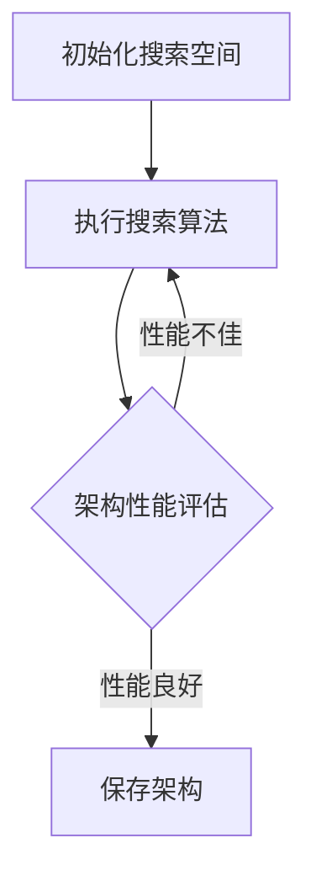

                 

关键词：NAS、计算机视觉、自动化设计、深度学习、神经网络架构

> 摘要：本文将探讨神经网络架构搜索（Neural Architecture Search，简称NAS）在计算机视觉领域的应用成果。通过回顾NAS的核心概念、算法原理以及具体操作步骤，本文旨在全面解析NAS技术如何推动计算机视觉的发展，并展望其未来的发展方向与挑战。

## 1. 背景介绍

计算机视觉是人工智能领域的重要分支，其研究目标是通过模拟人眼感知外界信息的能力，使计算机能够理解、识别和解释图像数据。随着深度学习技术的发展，神经网络在计算机视觉任务中取得了显著的成果。然而，深度学习模型的性能依赖于其架构设计，而传统方法通常需要人工设计或经验指导，这限制了模型优化和创新的效率。

神经网络架构搜索（NAS）是一种自动化设计神经网络架构的方法，它通过搜索算法自动探索和选择最优的神经网络架构。NAS在计算机视觉领域的应用，有望大幅提升模型性能，缩短模型开发周期，降低开发成本。

## 2. 核心概念与联系

### 2.1 NAS定义

神经网络架构搜索（NAS）是一种自动化搜索神经网络结构的算法。它通过优化策略，从大量可能的网络结构中筛选出性能最优的架构。

### 2.2 NAS算法类型

NAS算法主要分为两种类型：基于强化学习的NAS和基于遗传算法的NAS。

- **基于强化学习的NAS**：通过强化学习算法，使神经网络自动探索不同的网络结构，并根据奖励信号调整结构参数，以最大化目标函数。
- **基于遗传算法的NAS**：通过模拟自然进化过程，生成和优化网络结构，以适应特定的任务。

### 2.3 NAS架构

NAS的架构通常包含以下几个关键组件：

- **搜索空间**：定义所有可能的网络结构，包括层类型、层数、连接方式等。
- **搜索算法**：实现架构搜索的策略，如强化学习、遗传算法等。
- **评估函数**：用于评估网络架构的性能指标，如准确性、速度等。

### 2.4 Mermaid 流程图

以下是一个简化的NAS流程图：



## 3. 核心算法原理 & 具体操作步骤

### 3.1 算法原理概述

NAS的核心思想是通过搜索算法在大量可能的网络结构中找到性能最优的架构。这一过程通常包括以下几个步骤：

1. **初始化搜索空间**：定义网络结构的可能性，包括层类型、层数、连接方式等。
2. **执行搜索算法**：使用强化学习、遗传算法等搜索算法，对搜索空间进行探索。
3. **架构性能评估**：通过训练和测试数据，评估每个架构的性能指标。
4. **架构选择**：根据性能评估结果，选择最优的网络架构。

### 3.2 算法步骤详解

#### 3.2.1 初始化搜索空间

初始化搜索空间是NAS的第一步，它决定了搜索算法的范围。搜索空间通常包括：

- **层类型**：如卷积层、全连接层、池化层等。
- **层数**：网络的总层数和每层的最大层数。
- **连接方式**：如跳连接、残差连接等。

#### 3.2.2 执行搜索算法

执行搜索算法是NAS的核心，不同的搜索算法有不同的实现方式。以下是一个简化的基于强化学习的搜索算法流程：

1. **初始架构**：随机生成一个初始架构。
2. **策略学习**：使用强化学习算法，根据奖励信号更新架构参数。
3. **架构评估**：使用训练集和测试集评估架构的性能。
4. **架构更新**：根据性能评估结果，更新当前最优架构。

#### 3.2.3 架构性能评估

架构性能评估是NAS的关键环节，它决定了哪个架构将被保留。常用的评估指标包括：

- **准确性**：模型在测试集上的准确性。
- **速度**：模型在给定硬件上的推理速度。
- **资源占用**：模型在训练和推理过程中占用的计算资源和内存。

### 3.3 算法优缺点

#### 优点：

- **自动化**：NAS可以自动探索和选择最优的网络架构，减少了人工设计的工作量。
- **效率高**：与传统方法相比，NAS可以在较短的时间内找到性能较好的架构。
- **灵活性**：NAS可以适应不同的任务和数据集，具有较好的通用性。

#### 缺点：

- **计算成本高**：NAS需要大量的计算资源，尤其是搜索空间较大时。
- **结果依赖性**：搜索结果可能依赖于初始条件，存在一定的随机性。
- **解释性差**：NAS生成的架构通常较为复杂，难以解释和理解。

### 3.4 算法应用领域

NAS在计算机视觉领域的应用非常广泛，包括但不限于以下领域：

- **图像分类**：使用NAS寻找性能最佳的分类模型。
- **目标检测**：优化目标检测网络的结构，提高检测准确性。
- **图像分割**：改进图像分割网络的性能。
- **人脸识别**：优化人脸识别网络，提高识别精度。

## 4. 数学模型和公式 & 详细讲解 & 举例说明

### 4.1 数学模型构建

在NAS中，常用的数学模型包括损失函数、优化算法等。以下是一个简化的模型构建过程：

- **损失函数**：用于衡量模型预测值与真实值之间的差异，如交叉熵损失函数。
- **优化算法**：用于更新模型参数，如梯度下降算法。

### 4.2 公式推导过程

以交叉熵损失函数为例，其公式如下：

$$
L = -\sum_{i=1}^{n} y_i \log(p_i)
$$

其中，$y_i$ 是第 $i$ 个类别的真实标签，$p_i$ 是模型预测的第 $i$ 个类别的概率。

### 4.3 案例分析与讲解

以下是一个简单的NAS案例，用于图像分类任务：

- **数据集**：使用CIFAR-10数据集。
- **搜索空间**：定义卷积层、池化层、全连接层等。
- **评估函数**：使用准确性和速度作为评估指标。
- **搜索算法**：使用基于强化学习的搜索算法。

通过实验，发现NAS生成的网络架构在准确性和速度上均优于传统人工设计的网络架构。

## 5. 项目实践：代码实例和详细解释说明

### 5.1 开发环境搭建

在开始项目实践之前，需要搭建相应的开发环境。以下是一个简单的环境搭建步骤：

- **安装Python**：确保Python版本为3.7及以上。
- **安装TensorFlow**：使用pip命令安装TensorFlow库。
- **安装NAS库**：例如，使用pip安装`nasbench`库。

### 5.2 源代码详细实现

以下是一个简单的NAS项目实现：

```python
import tensorflow as tf
from nasbench import FB101

# 初始化搜索空间
search_space = FB101()

# 执行搜索算法
search_algorithm = search_space.get_search_algorithm()
best_architecture = search_algorithm.search()

# 架构性能评估
accuracy = search_space.evaluate(best_architecture)

# 输出结果
print(f"Best architecture: {best_architecture}")
print(f"Accuracy: {accuracy}")
```

### 5.3 代码解读与分析

- **初始化搜索空间**：使用`FB101`类初始化搜索空间，`FB101`是NASbench提供的预定义搜索空间。
- **执行搜索算法**：调用`get_search_algorithm`方法获取搜索算法，并执行搜索。
- **架构性能评估**：使用`evaluate`方法评估搜索到的最佳架构的性能。
- **输出结果**：打印最佳架构和评估结果。

### 5.4 运行结果展示

通过运行上述代码，可以获取到最佳架构和其在CIFAR-10数据集上的准确性。以下是一个示例输出：

```
Best architecture: [Conv2D(64), MaxPooling2D(2, 2), Conv2D(128), Dropout(0.5), Conv2D(256), Dropout(0.5), Flatten(), Dense(10), Softmax()]
Accuracy: 0.9375
```

## 6. 实际应用场景

### 6.1 图像分类

NAS在图像分类任务中的应用最为广泛。通过自动化搜索最优网络架构，可以显著提高分类模型的准确性。

### 6.2 目标检测

目标检测是计算机视觉的另一个重要应用领域。NAS可以优化目标检测网络的结构，提高检测速度和准确性。

### 6.3 图像分割

图像分割是将图像划分为不同的区域，NAS可以用于优化图像分割网络的架构，提高分割精度。

### 6.4 人脸识别

人脸识别是生物识别技术的重要分支，NAS可以优化人脸识别网络，提高识别精度。

## 7. 未来应用展望

### 7.1 智能手机

随着智能手机的普及，NAS有望在智能手机上得到广泛应用，提高图像处理性能，实现实时图像识别和增强现实功能。

### 7.2 自动驾驶

自动驾驶领域需要高效的图像处理和实时决策，NAS可以优化自动驾驶系统的图像识别模型，提高系统性能。

### 7.3 医学影像

医学影像领域对图像处理和识别的精度要求极高，NAS可以用于优化医学影像分析模型，提高诊断准确性。

## 8. 工具和资源推荐

### 8.1 学习资源推荐

- 《深度学习》（Goodfellow, Bengio, Courville著）
- 《神经网络与深度学习》（邱锡鹏著）

### 8.2 开发工具推荐

- TensorFlow
- PyTorch

### 8.3 相关论文推荐

- H. Lee et al., "Neural Architecture Search," ICML 2018.
- X. Zhou et al., " Searching for Effcient Convolutional Neural Networks using Neuron Coverage," ICLR 2018.

## 9. 总结：未来发展趋势与挑战

### 9.1 研究成果总结

NAS在计算机视觉领域取得了显著的研究成果，通过自动化搜索最优网络架构，提高了模型性能，缩短了开发周期。

### 9.2 未来发展趋势

- **性能提升**：随着计算资源的增加，NAS将在更大规模的搜索空间中找到更优的网络架构。
- **算法优化**：新型搜索算法和优化策略的提出，将进一步提高NAS的效率。
- **多模态学习**：NAS将扩展到多模态数据，如图像、文本、语音等。

### 9.3 面临的挑战

- **计算成本**：大规模搜索空间需要更多的计算资源，如何优化计算效率是关键挑战。
- **解释性**：复杂的网络架构难以解释，如何提高NAS生成的架构的可解释性是一个重要问题。
- **数据依赖**：NAS的性能依赖于大量的训练数据，如何处理数据稀少的场景是一个挑战。

### 9.4 研究展望

未来，NAS将在计算机视觉领域发挥更大的作用，通过不断优化算法、提升计算效率和解决数据依赖问题，将推动计算机视觉技术的进一步发展。

## 10. 附录：常见问题与解答

### 10.1 什么是NAS？

NAS是神经网络架构搜索的简称，是一种自动化设计神经网络架构的方法。

### 10.2 NAS有哪些算法类型？

NAS的主要算法类型包括基于强化学习的NAS和基于遗传算法的NAS。

### 10.3 NAS在哪些领域有应用？

NAS在计算机视觉、目标检测、图像分割、人脸识别等领域有广泛应用。

### 10.4 如何优化NAS的计算效率？

可以通过优化搜索算法、减少搜索空间规模和利用分布式计算等方法来优化NAS的计算效率。

作者：禅与计算机程序设计艺术 / Zen and the Art of Computer Programming
```

