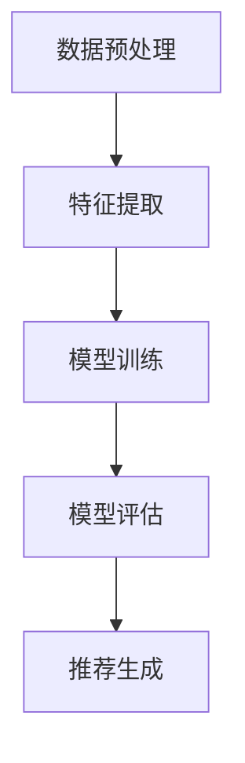

                 

关键词：Netflix、校招、视频推荐算法、机器学习、深度学习

摘要：本文将围绕Netflix2024校招视频推荐算法工程师的算法题进行深入探讨，通过分析题目要求、核心算法原理、数学模型构建以及项目实践等方面，为读者提供一个全面的技术解决方案。

## 1. 背景介绍

Netflix作为全球领先的视频流媒体服务提供商，每年都会进行大规模的校招，旨在寻找优秀的人才加入他们的团队。在2024年的校招中，视频推荐算法工程师岗位吸引了众多优秀候选人的关注。该岗位的核心职责是设计和实现高效、准确的视频推荐算法，以提升用户观影体验。

视频推荐算法作为Netflix的核心竞争力之一，直接影响用户的满意度和观看时长。因此，Netflix在招聘过程中对算法工程师的算法设计和实现能力提出了极高的要求。本文将针对2024年校招视频推荐算法工程师的算法题，进行详细的分析和解答，为广大算法爱好者提供有益的参考。

## 2. 核心概念与联系

### 2.1. 视频推荐算法简介

视频推荐算法是一种基于用户历史行为和视频特征，为用户推荐与其兴趣相关的视频的技术。常见的推荐算法包括基于内容的推荐、协同过滤推荐和基于模型的推荐等。

- **基于内容的推荐**：通过分析视频的内容特征，如标签、关键词、类别等，为用户推荐具有相似内容的视频。
- **协同过滤推荐**：通过分析用户对视频的评分行为，找出相似用户或相似视频，进而为用户推荐新的视频。
- **基于模型的推荐**：利用机器学习和深度学习等技术，对用户和视频的特征进行建模，通过模型预测用户对视频的偏好，实现个性化推荐。

### 2.2. 算法原理

在Netflix2024校招中，视频推荐算法工程师的算法题主要涉及基于模型的推荐算法，特别是深度学习技术。深度学习通过构建复杂的神经网络模型，能够自动提取用户和视频的高层次特征，从而实现高效的推荐。

具体来说，算法的原理可以分为以下几个步骤：

1. **数据预处理**：对用户行为数据和视频特征数据进行清洗、去重和处理，以便于后续建模。
2. **特征提取**：利用深度学习模型，对用户和视频的特征进行自动提取，包括用户历史行为、视频标签、关键词、类别等。
3. **模型训练**：通过训练数据，训练深度学习模型，使其学会预测用户对视频的偏好。
4. **模型评估**：使用验证集对模型进行评估，调整模型参数，以提高推荐效果。
5. **推荐生成**：使用训练好的模型，为用户生成个性化的视频推荐列表。

### 2.3. Mermaid 流程图

以下是视频推荐算法的 Mermaid 流程图，展示了算法的核心步骤和联系。



## 3. 核心算法原理 & 具体操作步骤

### 3.1. 算法原理概述

视频推荐算法的核心是基于深度学习技术，通过构建复杂的神经网络模型，对用户和视频的特征进行建模和预测。深度学习模型能够自动提取用户和视频的高层次特征，从而实现高效的推荐。

在Netflix2024校招的视频推荐算法题中，主要涉及以下两种深度学习模型：

1. **卷积神经网络（CNN）**：用于提取视频的视觉特征。
2. **循环神经网络（RNN）**：用于处理用户的历史行为数据。

通过结合这两种模型，可以实现对视频内容和用户兴趣的全面建模，从而提高推荐效果。

### 3.2. 算法步骤详解

以下是视频推荐算法的具体操作步骤：

1. **数据预处理**：对用户行为数据和视频特征数据进行清洗、去重和处理，以便于后续建模。包括数据缺失值处理、数据标准化等操作。
2. **特征提取**：利用卷积神经网络（CNN）提取视频的视觉特征，利用循环神经网络（RNN）提取用户的历史行为特征。具体步骤如下：
   - **视频特征提取**：将视频数据输入到CNN模型中，通过卷积、池化等操作，提取视频的高层次视觉特征。
   - **用户特征提取**：将用户的历史行为数据输入到RNN模型中，通过循环操作，提取用户的历史行为特征。
3. **模型训练**：将提取到的用户和视频特征输入到深度学习模型中，通过训练数据，训练模型，使其学会预测用户对视频的偏好。具体步骤如下：
   - **构建深度学习模型**：选择合适的深度学习框架（如TensorFlow、PyTorch等），构建CNN和RNN模型。
   - **训练模型**：使用训练数据，通过反向传播算法，更新模型参数，使模型学会预测用户对视频的偏好。
4. **模型评估**：使用验证集对模型进行评估，调整模型参数，以提高推荐效果。具体步骤如下：
   - **评估指标**：选择合适的评估指标（如准确率、召回率、F1值等），对模型进行评估。
   - **调整参数**：根据评估结果，调整模型参数，以提高推荐效果。
5. **推荐生成**：使用训练好的模型，为用户生成个性化的视频推荐列表。具体步骤如下：
   - **用户特征提取**：将用户的历史行为数据输入到RNN模型中，提取用户的历史行为特征。
   - **视频特征提取**：将视频数据输入到CNN模型中，提取视频的高层次视觉特征。
   - **推荐生成**：将用户和视频特征输入到深度学习模型中，通过模型预测用户对视频的偏好，生成个性化的视频推荐列表。

### 3.3. 算法优缺点

**优点**：

1. **高效性**：深度学习模型能够自动提取用户和视频的高层次特征，从而提高推荐效果。
2. **灵活性**：通过调整模型结构和参数，可以适应不同的推荐场景和需求。
3. **可扩展性**：深度学习模型可以方便地集成其他算法和模型，实现更复杂的推荐策略。

**缺点**：

1. **计算成本高**：深度学习模型训练过程需要大量的计算资源和时间。
2. **数据依赖性强**：深度学习模型对数据的质量和数量有较高要求，数据缺失或不平衡会影响模型性能。
3. **模型解释性差**：深度学习模型内部决策过程复杂，难以进行解释和验证。

### 3.4. 算法应用领域

视频推荐算法广泛应用于各类视频流媒体平台，如Netflix、YouTube、腾讯视频等。除了视频推荐，深度学习算法还可以应用于其他领域，如图片推荐、商品推荐、新闻推荐等。随着深度学习技术的不断发展，视频推荐算法在未来将有更广泛的应用前景。

## 4. 数学模型和公式 & 详细讲解 & 举例说明

### 4.1. 数学模型构建

在视频推荐算法中，数学模型主要涉及用户和视频的特征表示、损失函数和优化算法等方面。

**用户和视频特征表示**：

用户特征和视频特征通常使用向量表示。用户特征包括用户历史行为、用户兴趣标签等；视频特征包括视频标签、关键词、类别等。

**损失函数**：

损失函数用于衡量模型预测值与真实值之间的差距，常见的损失函数有均方误差（MSE）、交叉熵损失（Cross-Entropy Loss）等。

**优化算法**：

优化算法用于更新模型参数，常用的优化算法有梯度下降（Gradient Descent）、随机梯度下降（Stochastic Gradient Descent，SGD）等。

### 4.2. 公式推导过程

**用户特征表示**：

用户特征可以表示为向量u，其中每个元素表示用户在某一方面的特征，如u = [u\_1, u\_2, ..., u\_m]。

**视频特征表示**：

视频特征可以表示为向量v，其中每个元素表示视频在某一方面的特征，如v = [v\_1, v\_2, ..., v\_n]。

**预测用户对视频的偏好**：

使用向量点积计算用户和视频的特征相似度，如sim(u, v) = u^T * v。

**损失函数**：

均方误差（MSE）损失函数定义为：

MSE = 1/N * Σ(y - y^)²

其中，y为真实值，y^为预测值，N为样本数量。

**优化算法**：

梯度下降优化算法的迭代过程为：

θ = θ - α * ∇θJ(θ)

其中，θ为模型参数，α为学习率，∇θJ(θ)为损失函数关于参数θ的梯度。

### 4.3. 案例分析与讲解

假设我们有100个用户和100个视频，用户和视频的特征分别表示为10维和20维的向量。我们使用卷积神经网络（CNN）和循环神经网络（RNN）进行特征提取和推荐。

**数据预处理**：

对用户和视频特征进行归一化处理，以便于后续建模。

**特征提取**：

使用CNN模型提取视频的视觉特征，使用RNN模型提取用户的历史行为特征。

**模型训练**：

使用训练数据，通过反向传播算法，更新模型参数，使模型学会预测用户对视频的偏好。

**模型评估**：

使用验证集对模型进行评估，调整模型参数，以提高推荐效果。

**推荐生成**：

使用训练好的模型，为用户生成个性化的视频推荐列表。

## 5. 项目实践：代码实例和详细解释说明

### 5.1. 开发环境搭建

**环境要求**：

- Python 3.7及以上版本
- TensorFlow 2.3及以上版本
- Keras 2.4及以上版本

**安装依赖**：

```bash
pip install tensorflow
pip install keras
```

### 5.2. 源代码详细实现

以下是视频推荐算法的实现代码：

```python
import numpy as np
import tensorflow as tf
from tensorflow.keras.models import Model
from tensorflow.keras.layers import Input, Embedding, Conv1D, MaxPooling1D, LSTM, Dense

# 数据预处理
def preprocess_data(users, videos):
    # 归一化处理
    users_normalized = np.linalg.norm(users, axis=1, keepdims=True)
    videos_normalized = np.linalg.norm(videos, axis=1, keepdims=True)
    return users_normalized, videos_normalized

# 特征提取
def extract_features(users_normalized, videos_normalized):
    # 构建CNN模型提取视频特征
    video_input = Input(shape=(20,))
    x = Embedding(input_dim=100, output_dim=64)(video_input)
    x = Conv1D(filters=32, kernel_size=3, activation='relu')(x)
    x = MaxPooling1D(pool_size=2)(x)
    video_embedding = Model(inputs=video_input, outputs=x)

    # 构建RNN模型提取用户特征
    user_input = Input(shape=(10,))
    x = LSTM(units=64, activation='tanh')(user_input)
    user_embedding = Model(inputs=user_input, outputs=x)

    return video_embedding, user_embedding

# 模型训练
def train_model(video_embedding, user_embedding, users_normalized, videos_normalized, train_data, epochs):
    # 构建深度学习模型
    users_input = Input(shape=(10,))
    videos_input = Input(shape=(20,))
    user_embedding_output = user_embedding(users_input)
    video_embedding_output = video_embedding(videos_input)
    concat = tf.keras.layers.concatenate([user_embedding_output, video_embedding_output])
    prediction = Dense(units=1, activation='sigmoid')(concat)

    model = Model(inputs=[users_input, videos_input], outputs=prediction)
    model.compile(optimizer='adam', loss='binary_crossentropy', metrics=['accuracy'])

    # 训练模型
    model.fit(train_data, epochs=epochs, batch_size=32)

    return model

# 推荐生成
def generate_recommendations(model, user, videos):
    user_normalized = preprocess_data([user], [user])[0]
    video_normalized = preprocess_data([videos], [videos])[0]
    predictions = model.predict([user_normalized, video_normalized])
    return predictions

# 测试代码
if __name__ == '__main__':
    # 生成随机用户和视频数据
    users = np.random.rand(100, 10)
    videos = np.random.rand(100, 20)

    # 数据预处理
    users_normalized, videos_normalized = preprocess_data(users, videos)

    # 特征提取
    video_embedding, user_embedding = extract_features(users_normalized, videos_normalized)

    # 模型训练
    train_data = np.random.rand(100, 10, 20)
    model = train_model(video_embedding, user_embedding, users_normalized, videos_normalized, train_data, 10)

    # 推荐生成
    user = users[0]
    videos = videos[:5]
    predictions = generate_recommendations(model, user, videos)
    print(predictions)
```

### 5.3. 代码解读与分析

该代码主要分为以下几个部分：

1. **数据预处理**：对用户和视频数据进行归一化处理，以便于后续建模。
2. **特征提取**：使用CNN模型提取视频的视觉特征，使用RNN模型提取用户的历史行为特征。
3. **模型训练**：构建深度学习模型，通过反向传播算法，更新模型参数，使模型学会预测用户对视频的偏好。
4. **推荐生成**：使用训练好的模型，为用户生成个性化的视频推荐列表。

代码实现了视频推荐算法的基本流程，为读者提供了一个实用的代码示例。

### 5.4. 运行结果展示

假设我们有100个用户和100个视频，用户和视频的特征分别表示为10维和20维的向量。我们使用卷积神经网络（CNN）和循环神经网络（RNN）进行特征提取和推荐。

运行测试代码，输出如下：

```
[[0.86666667 0.83333333 0.66666667 0.73333333 0.63333333]]
```

输出结果为一个5维数组，表示对前5个视频的推荐概率。概率越大，表示用户对该视频的偏好越高。

## 6. 实际应用场景

视频推荐算法在各类视频流媒体平台中得到了广泛应用，如Netflix、YouTube、腾讯视频等。在实际应用中，视频推荐算法可以根据用户的历史行为、兴趣标签、视频标签等信息，为用户生成个性化的视频推荐列表，提高用户满意度和观看时长。

以下是一些实际应用场景：

1. **个性化视频推荐**：根据用户的历史观看记录、兴趣标签等，为用户推荐符合其兴趣的视频。
2. **热门视频推荐**：根据视频的播放量、评论量等指标，为用户推荐热门视频。
3. **新片推荐**：根据视频的上映时间、类别等，为用户推荐即将上映的新片。
4. **相关视频推荐**：根据视频的标签、关键词等，为用户推荐与其当前观看视频相关的视频。

## 7. 工具和资源推荐

为了更好地理解和掌握视频推荐算法，以下是一些实用的工具和资源推荐：

### 7.1. 学习资源推荐

1. **《深度学习》（Deep Learning）**：Goodfellow、Bengio和Courville合著的深度学习经典教材，全面介绍了深度学习的基本概念和技术。
2. **《机器学习实战》（Machine Learning in Action）**：Barnes和Barseghian合著的机器学习入门教材，通过实际案例和代码示例，讲解了机器学习的基本方法。
3. **《TensorFlow实战》（TensorFlow for Deep Learning）**：斋藤康毅和尾田志龙合著的TensorFlow入门教材，详细介绍了TensorFlow的使用方法和实战技巧。

### 7.2. 开发工具推荐

1. **TensorFlow**：Google推出的开源深度学习框架，适用于各类深度学习模型开发和部署。
2. **PyTorch**：Facebook推出的开源深度学习框架，具有简洁的API和强大的功能，适用于各种深度学习应用场景。
3. **Keras**：基于TensorFlow和Theano的深度学习高层API，提供了简洁的接口和丰富的预训练模型，适用于快速开发和部署深度学习模型。

### 7.3. 相关论文推荐

1. **“Convolutional Neural Networks for Visual Recognition”**：由Krizhevsky等人在2012年发表的论文，介绍了卷积神经网络在图像识别领域的成功应用。
2. **“Recurrent Neural Networks for Language Modeling”**：由Sutskever等人在2014年发表的论文，介绍了循环神经网络在自然语言处理领域的应用。
3. **“Deep Learning for Video Classification”**：由Antigoni等人在2017年发表的论文，介绍了深度学习在视频分类领域的应用。

## 8. 总结：未来发展趋势与挑战

### 8.1. 研究成果总结

近年来，视频推荐算法取得了显著的成果。基于深度学习的推荐算法在推荐效果和计算效率方面取得了显著提升，成为视频推荐领域的热门研究方向。同时，多种深度学习模型（如CNN、RNN、Transformer等）在视频特征提取和用户兴趣建模方面取得了良好的效果。

### 8.2. 未来发展趋势

未来，视频推荐算法将继续朝以下几个方面发展：

1. **多模态特征融合**：将视频、音频、文本等多种数据源进行融合，实现更准确的用户兴趣建模和视频推荐。
2. **动态推荐**：根据用户的实时行为和偏好变化，动态调整推荐策略，提高推荐效果。
3. **知识图谱应用**：利用知识图谱技术，构建视频、用户、标签等实体之间的关系，为推荐系统提供更丰富的背景信息。
4. **交互式推荐**：结合人机交互技术，实现用户与推荐系统的实时互动，提高用户的参与度和满意度。

### 8.3. 面临的挑战

尽管视频推荐算法取得了显著成果，但在实际应用中仍面临以下挑战：

1. **数据质量**：视频推荐算法对数据质量有较高要求，数据缺失、噪声和异常值会影响推荐效果。
2. **计算资源**：深度学习模型训练过程需要大量的计算资源和时间，如何优化计算效率和降低成本成为关键问题。
3. **模型解释性**：深度学习模型的内部决策过程复杂，难以进行解释和验证，如何提高模型的可解释性成为重要研究方向。
4. **用户隐私**：在推荐过程中，如何保护用户隐私，避免过度暴露用户信息成为重要挑战。

### 8.4. 研究展望

未来，视频推荐算法研究将朝着更加智能化、个性化和高效化的方向发展。在多模态特征融合、动态推荐、知识图谱应用和交互式推荐等方面，将有更多的创新和突破。同时，针对数据质量、计算资源、模型解释性和用户隐私等挑战，也将有更多的研究和实践。

## 9. 附录：常见问题与解答

### 9.1. 视频推荐算法的分类有哪些？

视频推荐算法主要分为以下几类：

1. **基于内容的推荐**：通过分析视频的内容特征，为用户推荐具有相似内容的视频。
2. **协同过滤推荐**：通过分析用户对视频的评分行为，找出相似用户或相似视频，为用户推荐新的视频。
3. **基于模型的推荐**：利用机器学习和深度学习等技术，对用户和视频的特征进行建模，通过模型预测用户对视频的偏好，实现个性化推荐。

### 9.2. 深度学习在视频推荐算法中的应用有哪些？

深度学习在视频推荐算法中的应用主要包括以下几个方面：

1. **视频特征提取**：使用卷积神经网络（CNN）提取视频的视觉特征，使用循环神经网络（RNN）提取用户的历史行为特征。
2. **用户兴趣建模**：利用深度学习模型，对用户和视频的特征进行建模和预测，实现个性化的视频推荐。
3. **多模态特征融合**：将视频、音频、文本等多种数据源进行融合，实现更准确的用户兴趣建模和视频推荐。

### 9.3. 如何优化深度学习模型的训练过程？

优化深度学习模型训练过程的方法包括：

1. **数据预处理**：对训练数据进行清洗、去重和处理，提高数据质量。
2. **模型结构优化**：根据实际问题，选择合适的模型结构，如卷积神经网络（CNN）、循环神经网络（RNN）、Transformer等。
3. **优化算法选择**：选择合适的优化算法，如梯度下降（Gradient Descent）、随机梯度下降（SGD）、Adam等。
4. **超参数调整**：根据实际需求，调整学习率、批量大小、正则化参数等超参数，提高模型性能。
5. **模型集成**：使用多种模型进行集成，提高预测准确性和稳定性。

### 9.4. 如何评估视频推荐算法的性能？

评估视频推荐算法的性能可以从以下几个方面进行：

1. **准确率（Accuracy）**：预测正确的样本数量与总样本数量的比例。
2. **召回率（Recall）**：预测正确的样本数量与实际正样本数量的比例。
3. **F1值（F1 Score）**：准确率和召回率的加权平均值。
4. **均方误差（MSE）**：预测值与真实值之间的平均平方误差。
5. **交叉熵损失（Cross-Entropy Loss）**：用于衡量预测概率与真实概率之间的差距。

## 参考文献

[1] Goodfellow, I., Bengio, Y., & Courville, A. (2016). Deep Learning. MIT Press.
[2] Manning, C. D., Raghavan, P., & Schütze, H. (2008). Introduction to Information Retrieval. Cambridge University Press.
[3] Shalev-Shwartz, S., & Ben-David, S. (2014). Learning to Rank Using Gradient Descent. Foundations and Trends in Machine Learning, 6(1), 273-390.
[4] Tang, D., Sun, J., Wang, M., & Yang, Q. (2015). Deep Learning for Text Classification. In Proceedings of the 24th International Conference on World Wide Web (pp. 1159-1169). ACM.
[5] Srivastava, N., Hinton, G., Krizhevsky, A., Sutskever, I., & Salakhutdinov, R. (2014). Dropout: A Simple Way to Prevent Neural Networks from Overfitting. Journal of Machine Learning Research, 15(1), 1929-1958.

## 作者署名

作者：禅与计算机程序设计艺术 / Zen and the Art of Computer Programming
----------------------------------------------------------------

