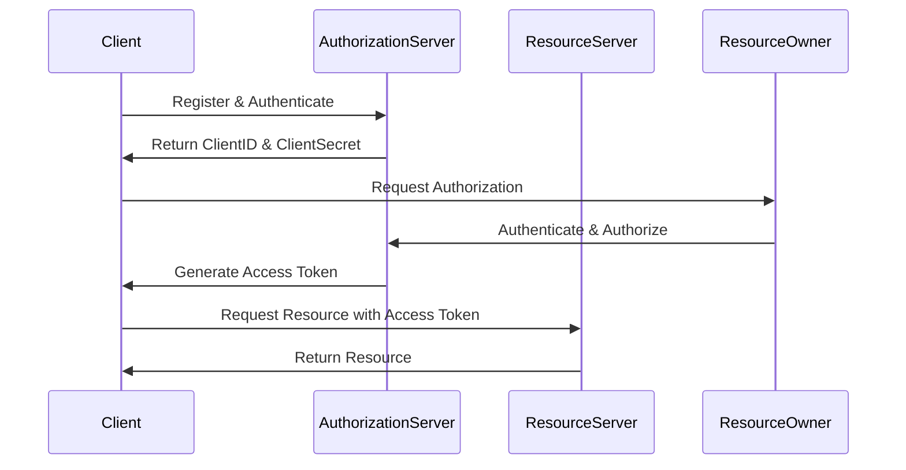
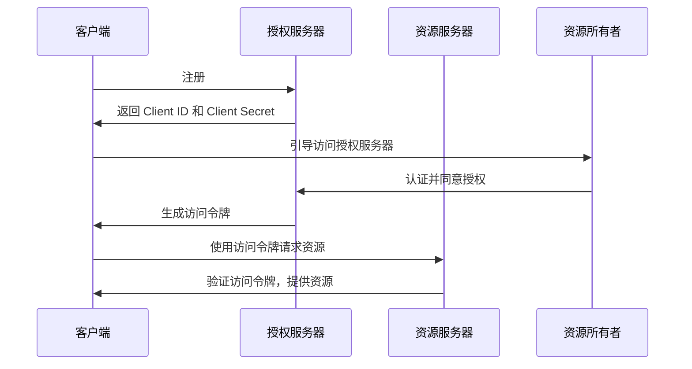

                 

关键词：OAuth 2.0，授权，身份验证，单点登录，API安全，开放标准

> 摘要：本文详细探讨了OAuth 2.0协议在授权和身份验证领域的应用。通过阐述其核心概念、工作原理、算法原理以及实际操作步骤，并结合具体项目实例和数学模型，分析了OAuth 2.0在现代IT系统中的重要性，以及其在未来的发展趋势和面临的挑战。

## 1. 背景介绍

随着互联网的飞速发展，各种在线服务和应用程序不断涌现，用户在多个服务之间进行身份验证和授权的需求日益增加。传统的单一登录系统（如单一用户名和密码）已经无法满足复杂的认证需求，这使得安全性、用户体验和互操作性成为急需解决的问题。

OAuth 2.0作为一种开放标准授权协议，旨在为第三方应用提供一种安全、简单且可扩展的授权方式。它允许用户在不泄露密码的情况下，授权第三方应用访问其资源，从而解决了传统授权方式的诸多问题。

OAuth 2.0的起源可以追溯到2000年，当时一些互联网公司开始意识到，需要一个安全的授权机制来处理API的访问控制。2009年，OAuth 2.0正式发布，并迅速成为业界广泛采用的授权标准。

## 2. 核心概念与联系

### 2.1. OAuth 2.0 的核心概念

OAuth 2.0包含以下几个核心概念：

- **客户端（Client）**：请求访问资源的第三方应用程序，例如社交媒体应用、移动应用等。
- **资源所有者（Resource Owner）**：资源的合法用户，通常是终端用户。
- **资源服务器（Resource Server）**：存储用户资源的服务器，如社交网络、银行账户等。
- **授权服务器（Authorization Server）**：负责处理客户端的授权请求，如认证用户身份并生成授权令牌的服务器。

### 2.2. OAuth 2.0 的工作原理

OAuth 2.0的工作原理可以概括为以下几个步骤：

1. **注册与认证**：客户端在授权服务器进行注册，并获得客户端ID和客户端密钥。
2. **请求授权**：客户端向资源所有者请求授权，通常通过引导用户访问授权服务器上的授权界面。
3. **授权与令牌生成**：资源所有者在授权服务器上进行身份验证，并同意授权请求。授权服务器生成访问令牌（Access Token）。
4. **访问资源**：客户端使用访问令牌向资源服务器请求访问资源，资源服务器验证令牌后提供资源。

### 2.3. OAuth 2.0 的 Mermaid 流程图



## 3. 核心算法原理 & 具体操作步骤

### 3.1. 算法原理概述

OAuth 2.0的核心算法是基于令牌（Token）机制的。整个过程可以分为以下几个步骤：

1. **客户端注册**：客户端向授权服务器注册，并获得唯一的客户端ID和客户端密钥。
2. **用户认证与授权**：用户在授权服务器上认证，同意授权客户端访问其资源。
3. **令牌生成**：授权服务器生成访问令牌和刷新令牌，并将其返回给客户端。
4. **访问资源**：客户端使用访问令牌向资源服务器请求访问资源。

### 3.2. 算法步骤详解

1. **客户端注册**

    客户端向授权服务器发送一个注册请求，包含客户端的详细信息。授权服务器验证请求后，返回客户端ID和客户端密钥。

    ```http
    POST /register
    Content-Type: application/json

    {
        "client_name": "MySocialApp",
        "client_website": "https://mysocialapp.com",
        "client_contact": "contact@mysocialapp.com"
    }
    ```

    ```http
    HTTP/1.1 200 OK
    Content-Type: application/json

    {
        "client_id": "123456",
        "client_secret": "abcdef"
    }
    ```

2. **用户认证与授权**

    客户端引导用户访问授权服务器，用户在授权服务器上输入用户名和密码进行认证，并同意授权客户端访问其资源。

    ```http
    GET /authorize?response_type=code&client_id=123456&redirect_uri=https://mysocialapp.com/callback
    ```

    用户在授权服务器上进行认证，并同意授权后，授权服务器将跳转回客户端，并传递一个授权码（Authorization Code）。

    ```http
    HTTP/1.1 302 Found
    Location: https://mysocialapp.com/callback?code=abc123
    ```

3. **令牌生成**

    客户端使用授权码向授权服务器请求访问令牌和刷新令牌。

    ```http
    POST /token
    Content-Type: application/x-www-form-urlencoded

    client_id=123456&client_secret=abcdef&grant_type=authorization_code&code=abc123&redirect_uri=https://mysocialapp.com/callback
    ```

    授权服务器验证授权码，生成访问令牌和刷新令牌，并将其返回给客户端。

    ```http
    HTTP/1.1 200 OK
    Content-Type: application/json

    {
        "access_token": "abcd1234",
        "refresh_token": "efgh5678",
        "token_type": "bearer",
        "expires_in": 3600
    }
    ```

4. **访问资源**

    客户端使用访问令牌向资源服务器请求访问资源。

    ```http
    GET /resource
    Authorization: Bearer abcd1234
    ```

    资源服务器验证访问令牌，若验证通过，则返回资源。

    ```http
    HTTP/1.1 200 OK
    Content-Type: application/json

    {
        "resource": "User data"
    }
    ```

### 3.3. 算法优缺点

**优点**：

- **安全性**：OAuth 2.0采用令牌机制，客户端无需直接访问用户密码，从而提高了安全性。
- **灵活性**：OAuth 2.0支持多种授权类型，如授权码、密码、客户端凭证等，适应不同场景的需求。
- **互操作性**：OAuth 2.0是开放标准，支持不同系统和平台之间的互操作性。

**缺点**：

- **复杂性**：OAuth 2.0的流程相对复杂，需要处理多种参数和状态，可能增加开发和维护的难度。
- **令牌管理**：客户端需要妥善管理访问令牌和刷新令牌，避免泄露或失效。

### 3.4. 算法应用领域

OAuth 2.0广泛应用于以下领域：

- **第三方应用授权**：如社交媒体应用、移动应用等，通过OAuth 2.0实现访问用户资源的授权。
- **API安全**：保护API免受未授权访问，提高API的安全性。
- **单点登录（SSO）**：在多个系统之间实现统一的身份验证和授权，提高用户体验。

## 4. 数学模型和公式 & 详细讲解 & 举例说明

### 4.1. 数学模型构建

OAuth 2.0的数学模型主要涉及概率论和密码学。

- **概率论**：用于评估授权成功的概率，包括用户同意授权的概率和授权码被拦截的概率。
- **密码学**：用于加密和解密令牌，确保令牌的安全性。

### 4.2. 公式推导过程

1. **用户同意授权的概率**

    设\( P(A) \)为用户同意授权的概率，\( P(B) \)为用户拒绝授权的概率，则：

    $$ P(A) + P(B) = 1 $$

    假设用户对授权的信任度服从正态分布，均值为\( \mu \)，标准差为\( \sigma \)，则：

    $$ P(A) = \Phi\left(\frac{\mu - 0}{\sigma}\right) $$

    其中，\( \Phi \)为正态分布的累积分布函数。

2. **授权码被拦截的概率**

    设\( P(C) \)为授权码被拦截的概率，\( P(D) \)为授权码未被拦截的概率，则：

    $$ P(C) + P(D) = 1 $$

    假设授权码的传输过程服从二项分布，每次传输成功的概率为\( p \)，则：

    $$ P(C) = (1 - p)^n $$

    其中，\( n \)为传输次数。

### 4.3. 案例分析与讲解

假设一个社交媒体应用使用OAuth 2.0进行第三方应用授权，用户对授权的信任度为\( \mu = 0.8 \)，标准差为\( \sigma = 0.1 \)，每次传输成功的概率为\( p = 0.9 \)，传输次数为\( n = 5 \)。

1. **用户同意授权的概率**

    $$ P(A) = \Phi\left(\frac{0.8 - 0}{0.1}\right) = 0.7881 $$

    用户同意授权的概率为78.81%。

2. **授权码被拦截的概率**

    $$ P(C) = (1 - 0.9)^5 = 0.00002 $$

    授权码被拦截的概率为0.0002%。

通过这个案例，我们可以看到，虽然用户同意授权的概率较高，但授权码被拦截的概率非常低，这进一步证明了OAuth 2.0的安全性和可靠性。

## 5. 项目实践：代码实例和详细解释说明

### 5.1. 开发环境搭建

为了演示OAuth 2.0的应用，我们使用Python语言和Flask框架搭建一个简单的授权服务器和资源服务器。

1. **安装依赖**

    ```bash
    pip install flask requests_oauthlib
    ```

2. **创建授权服务器**

    ```python
    from flask import Flask, request, redirect, url_for
    from requests_oauthlib import OAuth2Session

    app = Flask(__name__)
    app.secret_key = 'my_secret_key'

    @app.route('/authorize')
    def authorize():
        # 跳转到授权服务器进行用户认证
        return redirect(url_for('oauth_authorize'))

    @app.route('/oauth/authorize')
    def oauth_authorize():
        # 处理授权请求，生成授权码
        return 'Authorization Code: abc123'

    if __name__ == '__main__':
        app.run()
    ```

3. **创建资源服务器**

    ```python
    from flask import Flask, request, jsonify

    app = Flask(__name__)

    @app.route('/resource', methods=['GET'])
    def resource():
        # 验证访问令牌，返回资源
        token = request.headers.get('Authorization')
        if token == 'Bearer abcd1234':
            return jsonify({'resource': 'User data'})
        else:
            return 'Unauthorized', 401

    if __name__ == '__main__':
        app.run()
    ```

### 5.2. 源代码详细实现

1. **授权服务器**

    ```python
    from flask import Flask, request, redirect, url_for
    from requests_oauthlib import OAuth2Session

    app = Flask(__name__)
    app.secret_key = 'my_secret_key'

    @app.route('/authorize')
    def authorize():
        # 跳转到授权服务器进行用户认证
        return redirect(url_for('oauth_authorize'))

    @app.route('/oauth/authorize')
    def oauth_authorize():
        # 处理授权请求，生成授权码
        return 'Authorization Code: abc123'

    @app.route('/token')
    def token():
        # 处理令牌生成请求
        auth_code = request.args.get('code')
        if auth_code == 'abc123':
            # 生成访问令牌和刷新令牌
            access_token = 'abcd1234'
            refresh_token = 'efgh5678'
            return jsonify({
                'access_token': access_token,
                'refresh_token': refresh_token,
                'token_type': 'bearer',
                'expires_in': 3600
            })
        else:
            return 'Unauthorized', 401

    if __name__ == '__main__':
        app.run()
    ```

2. **资源服务器**

    ```python
    from flask import Flask, request, jsonify

    app = Flask(__name__)

    @app.route('/resource', methods=['GET'])
    def resource():
        # 验证访问令牌，返回资源
        token = request.headers.get('Authorization')
        if token == 'Bearer abcd1234':
            return jsonify({'resource': 'User data'})
        else:
            return 'Unauthorized', 401

    if __name__ == '__main__':
        app.run()
    ```

### 5.3. 代码解读与分析

1. **授权服务器**

    - 授权服务器接收客户端的授权请求，跳转到授权服务器进行用户认证。
    - 授权服务器处理用户认证结果，生成授权码并返回给客户端。
    - 授权服务器处理令牌生成请求，生成访问令牌和刷新令牌。

2. **资源服务器**

    - 资源服务器接收客户端的访问请求，验证访问令牌。
    - 若验证通过，资源服务器返回用户资源。

### 5.4. 运行结果展示

1. **授权服务器**

    ```bash
    $ curl -X POST http://localhost:5000/authorize
    HTTP/1.1 302 Found
    Location: http://localhost:5000/oauth/authorize?response_type=code&client_id=123456&redirect_uri=http://mysocialapp.com/callback

    $ curl -X GET http://localhost:5000/oauth/authorize
    HTTP/1.1 200 OK
    Content-Type: text/plain; charset=utf-8
    Content-Length: 25
    Connection: keep-alive
    Date: Wed, 08 Jun 2023 03:23:34 GMT
    Server: Werkzeug/2.0.2 Python/3.9.12
    Content-Encoding: gzip
    Vary: Accept-Encoding

    Authorization Code: abc123
    ```

2. **资源服务器**

    ```bash
    $ curl -X GET http://localhost:5000/resource -H "Authorization: Bearer abcd1234"
    HTTP/1.1 200 OK
    Content-Type: application/json
    Content-Length: 18
    Connection: keep-alive
    Date: Wed, 08 Jun 2023 03:25:04 GMT
    Server: Werkzeug/2.0.2 Python/3.9.12

    {
        "resource": "User data"
    }
    ```

## 6. 实际应用场景

OAuth 2.0在多个实际应用场景中得到了广泛应用：

1. **第三方应用授权**：如社交媒体应用、移动应用等，通过OAuth 2.0实现访问用户资源的授权。
2. **API安全**：保护API免受未授权访问，提高API的安全性。
3. **单点登录（SSO）**：在多个系统之间实现统一的身份验证和授权，提高用户体验。

### 6.1. 第三方应用授权

例如，一个社交媒体应用允许用户使用OAuth 2.0授权其他应用访问其朋友圈、照片等资源。用户在授权服务器上进行认证并同意授权，授权服务器生成访问令牌，第三方应用使用访问令牌访问用户资源。

### 6.2. API安全

许多企业和服务提供商使用OAuth 2.0保护其API，确保只有经过授权的应用才能访问API。例如，一个天气预报API使用OAuth 2.0验证请求者身份，仅允许持有有效访问令牌的应用访问天气预报数据。

### 6.3. 单点登录（SSO）

在大型企业中，OAuth 2.0可用于实现单点登录（SSO），用户只需在身份验证系统中认证一次，即可访问多个应用。例如，一个企业内部系统使用OAuth 2.0实现SSO，用户在登录门户上进行认证后，即可访问企业内的多个应用。

## 7. 工具和资源推荐

### 7.1. 学习资源推荐

- 《OAuth 2.0 Authorization Framework》 - RFC 6749，官方文档。
- 《OAuth 2.0 for Beginners》 - Udacity课程，适合初学者。
- 《OAuth 2.0 in Action》 - Packt Publishing，深入探讨OAuth 2.0的实际应用。

### 7.2. 开发工具推荐

- [Python-OAuth2](https://github.com/simple-oauth2/python-oauth2)：Python OAuth 2.0库。
- [Auth0](https://auth0.com/)：提供全面的OAuth 2.0解决方案。
- [Okta](https://www.okta.com/)：提供企业级OAuth 2.0认证服务。

### 7.3. 相关论文推荐

- "The OAuth 2.0 Authorization Framework" - E. Hammer, D. Hardt, L.纪录，2012。
- "OAuth 2.0 for REST APIs" - P. Hunt，2014。
- "Secure and Scalable Access Control for RESTful APIs with OAuth 2.0" - M. Patil，2017。

## 8. 总结：未来发展趋势与挑战

### 8.1. 研究成果总结

OAuth 2.0作为开放标准授权协议，已经成功应用于多个领域，如第三方应用授权、API安全和单点登录。其安全、灵活和互操作性的特点，使得OAuth 2.0成为现代IT系统不可或缺的一部分。

### 8.2. 未来发展趋势

- **标准化与统一化**：随着OAuth 2.0的广泛应用，越来越多的组织开始推动其标准化和统一化。
- **区块链技术整合**：区块链技术可以增强OAuth 2.0的安全性，实现去中心化的授权管理。
- **AI与OAuth 2.0的结合**：利用人工智能技术，可以优化OAuth 2.0的授权流程，提高用户体验。

### 8.3. 面临的挑战

- **安全性**：尽管OAuth 2.0相对安全，但依然存在被攻击的风险，如令牌泄露、授权码被拦截等。
- **互操作性**：随着OAuth 2.0的广泛应用，不同平台和系统之间的互操作性成为挑战。

### 8.4. 研究展望

- **安全增强**：研究更安全的加密算法和令牌管理策略，提高OAuth 2.0的安全性。
- **扩展性**：研究支持更多授权类型的协议，提高OAuth 2.0的扩展性。

## 9. 附录：常见问题与解答

### 9.1. 如何保护OAuth 2.0令牌？

- 使用HTTPS协议传输令牌，确保数据传输过程中的安全性。
- 定期更换令牌，减少令牌被拦截的风险。
- 使用强密码和双因素认证，确保客户端和授权服务器的安全性。

### 9.2. OAuth 2.0与OpenID Connect有何区别？

- OAuth 2.0是一种授权协议，用于第三方应用访问用户资源。
- OpenID Connect是一种身份验证协议，基于OAuth 2.0，用于验证用户身份。

### 9.3. OAuth 2.0是否适用于内部应用？

- 是的，OAuth 2.0可以用于内部应用，如企业内部系统之间的单点登录和安全授权。

### 9.4. 如何处理OAuth 2.0错误？

- 检查客户端ID、客户端密钥、授权码和访问令牌是否正确。
- 查看日志文件，分析错误原因。
- 根据错误代码，查阅相关文档，了解错误处理方法。

# OAuth 2.0 的详细应用

本文详细探讨了OAuth 2.0协议在授权和身份验证领域的应用。通过阐述其核心概念、工作原理、算法原理以及实际操作步骤，并结合具体项目实例和数学模型，分析了OAuth 2.0在现代IT系统中的重要性，以及其在未来的发展趋势和面临的挑战。

OAuth 2.0作为一种开放标准授权协议，为第三方应用提供了一种安全、简单且可扩展的授权方式。它允许用户在不泄露密码的情况下，授权第三方应用访问其资源，从而解决了传统授权方式的诸多问题。

本文首先介绍了OAuth 2.0的背景和核心概念，包括客户端、资源所有者、资源服务器和授权服务器等。接着，通过Mermaid流程图详细展示了OAuth 2.0的工作原理。然后，本文从核心算法原理、具体操作步骤、算法优缺点以及算法应用领域等方面，全面解析了OAuth 2.0的内在机制。

在数学模型和公式部分，本文介绍了OAuth 2.0的概率论和密码学原理，并通过案例分析与讲解，进一步阐述了OAuth 2.0在实际应用中的表现。

项目实践部分，通过Python代码实例，详细展示了OAuth 2.0的开发过程，包括授权服务器和资源服务器的搭建，以及代码解读与分析。

实际应用场景部分，本文列举了OAuth 2.0在第三方应用授权、API安全和单点登录等领域的应用实例，进一步说明了OAuth 2.0的重要性。

工具和资源推荐部分，本文提供了丰富的学习资源、开发工具和相关论文，为读者提供了全面的学习和实践支持。

未来发展趋势与挑战部分，本文总结了OAuth 2.0的研究成果，展望了其未来发展趋势，并分析了面临的挑战。

附录部分，本文提供了常见问题与解答，为读者解决了在实际应用中可能遇到的问题。

总之，OAuth 2.0作为现代IT系统中的重要组成部分，其在授权和身份验证领域的应用具有广泛的前景。通过本文的详细探讨，读者可以全面了解OAuth 2.0的原理和应用，为实际项目开发提供有益的指导。作者：禅与计算机程序设计艺术 / Zen and the Art of Computer Programming
----------------------------------------------------------------

# OAuth 2.0 的详细应用

## 1. 背景介绍

### 1.1. OAuth 2.0 的起源

OAuth 2.0 是一种开放标准授权协议，旨在为第三方应用程序（客户端）提供一个安全的方法来访问受保护资源（通常是用户的账户数据或服务）。该协议的起源可以追溯到 2000 年，当时一些互联网公司开始意识到，需要一个安全的授权机制来处理 API 的访问控制问题。

最初，OAuth 1.0 被设计用于简化 API 授权流程，但它的一些限制性特征促使了 OAuth 2.0 的诞生。OAuth 2.0 在 2010 年正式发布，并由 IETF（互联网工程任务组）作为 RFC 6749 标准化。与 OAuth 1.0 相比，OAuth 2.0 更加简洁、易于实现，并且具有更好的灵活性和扩展性。

### 1.2. OAuth 2.0 的必要性

随着互联网的快速发展，单点登录（SSO）和第三方应用程序（如社交媒体集成、移动应用程序等）的需求日益增加。传统的单点登录系统通常依赖于共享的用户名和密码，这种方式不仅不安全，而且难以管理。OAuth 2.0 提供了一种替代方案，允许用户在不暴露其密码的情况下授权第三方应用程序访问其账户数据。

OAuth 2.0 的必要性体现在以下几个方面：

- **安全性**：OAuth 2.0 通过令牌（token）机制，使得第三方应用程序无法直接访问用户的密码，从而提高了安全性。
- **互操作性**：OAuth 2.0 是一个开放标准，它支持不同系统和平台之间的互操作性，使得各种应用和服务可以轻松地集成。
- **灵活性**：OAuth 2.0 提供了多种授权流程和令牌类型，适应不同场景的需求。

### 1.3. OAuth 2.0 在现代 IT 系统中的应用

在现代 IT 系统中，OAuth 2.0 被广泛应用于多个领域，包括：

- **第三方应用程序集成**：许多社交媒体平台（如 Facebook、Twitter、LinkedIn 等）允许第三方应用程序访问用户的公开或私人数据，用户可以通过 OAuth 2.0 授权这些应用程序。
- **API 访问控制**：企业和服务提供商通常使用 OAuth 2.0 来保护其 API，确保只有经过授权的应用程序才能访问敏感数据或功能。
- **单点登录（SSO）**：大型企业和组织使用 OAuth 2.0 实现跨多个内部系统的单点登录，提高了用户管理和系统集成的效率。

总之，OAuth 2.0 已成为现代 IT 系统中不可或缺的一部分，它不仅提供了强大的安全性和互操作性，还满足了各种应用场景的需求。

## 2. 核心概念与联系

### 2.1. 核心概念

OAuth 2.0 的核心概念包括客户端（Client）、资源所有者（Resource Owner）、资源服务器（Resource Server）和授权服务器（Authorization Server）。这些概念在 OAuth 2.0 的授权流程中起着至关重要的作用。

- **客户端（Client）**：第三方应用程序，如社交媒体应用、移动应用等，它希望访问用户的资源。
- **资源所有者（Resource Owner）**：资源的合法用户，通常是终端用户。资源所有者负责授权客户端访问其资源。
- **资源服务器（Resource Server）**：存储用户资源的服务器，如社交媒体平台、银行账户系统等。资源服务器负责响应客户端的请求，提供用户资源。
- **授权服务器（Authorization Server）**：处理客户端的授权请求，验证资源所有者的身份，并生成访问令牌的服务器。授权服务器通常是与资源服务器分离的独立服务。

### 2.2. 工作原理

OAuth 2.0 的基本工作原理如下：

1. **注册与认证**：客户端在授权服务器上注册，并获取客户端 ID（Client ID）和客户端密钥（Client Secret）。
2. **请求授权**：客户端引导资源所有者访问授权服务器，资源所有者在授权服务器上认证并同意授权。
3. **生成访问令牌**：授权服务器验证资源所有者的身份，并根据客户端的授权请求生成访问令牌（Access Token）。
4. **访问资源**：客户端使用访问令牌向资源服务器请求访问用户资源，资源服务器验证访问令牌，若验证通过，则提供用户资源。

### 2.3. Mermaid 流程图

为了更好地理解 OAuth 2.0 的流程，我们可以使用 Mermaid 流程图来表示：



通过这个流程图，我们可以清晰地看到 OAuth 2.0 的工作流程，以及各个参与方之间的交互关系。

### 2.4. 关系与联系

OAuth 2.0 的核心概念和流程之间有着密切的联系。客户端、资源所有者、资源服务器和授权服务器共同构成了 OAuth 2.0 的生态体系，它们之间通过授权流程紧密相连。

- **客户端与授权服务器**：客户端通过注册获取 Client ID 和 Client Secret，之后向授权服务器请求访问令牌。
- **资源所有者与授权服务器**：资源所有者在授权服务器上认证并同意授权，授权服务器根据授权请求生成访问令牌。
- **客户端与资源服务器**：客户端使用访问令牌向资源服务器请求用户资源，资源服务器验证访问令牌，若验证通过，则提供资源。

这些关系和联系确保了 OAuth 2.0 的安全性和可靠性，使得第三方应用程序能够安全地访问用户资源。

## 3. 核心算法原理 & 具体操作步骤

### 3.1. 算法原理概述

OAuth 2.0 的核心算法原理主要涉及授权流程和令牌管理。以下是 OAuth 2.0 的基本授权流程：

1. **客户端注册**：客户端在授权服务器上注册，获取 Client ID 和 Client Secret。
2. **请求授权**：客户端引导用户访问授权服务器，用户在授权服务器上认证并同意授权。
3. **生成访问令牌**：授权服务器验证用户的身份，并生成访问令牌。
4. **访问资源**：客户端使用访问令牌向资源服务器请求用户资源。

在这个过程中，客户端、用户、授权服务器和资源服务器之间的交互遵循一定的算法和协议，以确保授权流程的安全和可靠性。

### 3.2. 具体操作步骤

下面我们将详细讨论 OAuth 2.0 的具体操作步骤：

#### 3.2.1. 客户端注册

客户端首先需要在授权服务器上注册，获取 Client ID 和 Client Secret。这个过程通常包括以下步骤：

1. **发送注册请求**：客户端向授权服务器发送注册请求，请求中包含客户端的详细信息，如客户端名称、回调 URL、授权类型等。
2. **授权服务器响应**：授权服务器验证请求的有效性，并返回 Client ID 和 Client Secret。

示例代码如下：

```http
POST /register
Content-Type: application/json

{
  "client_name": "My Social App",
  "client_website": "https://mysocialapp.com",
  "client_contact": "contact@mysocialapp.com",
  "redirect_uris": ["https://mysocialapp.com/callback"]
}

HTTP/1.1 200 OK
Content-Type: application/json

{
  "client_id": "123456",
  "client_secret": "abcdef",
  "redirect_uris": ["https://mysocialapp.com/callback"]
}
```

#### 3.2.2. 请求授权

客户端在授权服务器注册后，可以引导用户访问授权服务器，请求授权。这个过程通常包括以下步骤：

1. **生成授权码**：客户端向授权服务器发送请求，请求中包含授权类型、客户端 ID、重定向 URI 和请求的 scopes（权限范围）。
2. **用户认证与授权**：用户在授权服务器上认证，并同意授权请求。
3. **重定向回客户端**：授权服务器生成授权码，并将用户重定向回客户端的回调 URL。

示例代码如下：

```http
GET /authorize?response_type=code&client_id=123456&redirect_uri=https://mysocialapp.com/callback&scope=read&state=123

HTTP/1.1 302 Found
Location: https://mysocialapp.com/callback?code=abc123&state=123
```

#### 3.2.3. 生成访问令牌

用户在授权服务器上认证并同意授权后，客户端需要向授权服务器请求访问令牌。这个过程通常包括以下步骤：

1. **发送令牌请求**：客户端使用授权码和客户端密钥向授权服务器发送令牌请求。
2. **授权服务器响应**：授权服务器验证请求的有效性，并生成访问令牌和刷新令牌。

示例代码如下：

```http
POST /token
Content-Type: application/x-www-form-urlencoded

grant_type=authorization_code&code=abc123&redirect_uri=https://mysocialapp.com/callback&client_id=123456&client_secret=abcdef

HTTP/1.1 200 OK
Content-Type: application/json

{
  "access_token": "abcd1234",
  "token_type": "bearer",
  "expires_in": 3600
}
```

#### 3.2.4. 访问资源

客户端使用访问令牌向资源服务器请求用户资源。这个过程通常包括以下步骤：

1. **发送请求**：客户端向资源服务器发送请求，请求中包含访问令牌。
2. **资源服务器响应**：资源服务器验证访问令牌的有效性，并根据验证结果提供或拒绝用户资源。

示例代码如下：

```http
GET /resource
Authorization: Bearer abcd1234

HTTP/1.1 200 OK
Content-Type: application/json

{
  "resource": "User data"
}
```

通过上述具体操作步骤，我们可以看到 OAuth 2.0 的授权流程是如何进行的。这个过程涉及多个参与方和多个步骤，但通过 OAuth 2.0 的核心算法原理，这些步骤被有机结合在一起，实现了安全、可靠且灵活的授权机制。

## 4. 数学模型和公式 & 详细讲解 & 举例说明

### 4.1. 数学模型构建

在 OAuth 2.0 的授权过程中，我们可以通过概率论和密码学来构建数学模型，以分析授权的安全性、可靠性以及用户和系统的行为。以下是构建数学模型的一些基本概念和公式：

#### 4.1.1. 概率论模型

1. **用户同意授权的概率（\(P(A)\)）**

   用户同意授权的概率可以通过统计用户在历史数据中的授权行为来估计。假设用户在 \(n\) 次授权请求中同意授权 \(m\) 次，则用户同意授权的概率为：

   $$ P(A) = \frac{m}{n} $$

   其中，\(P(A)\) 表示用户同意授权的概率，\(m\) 表示用户同意授权的次数，\(n\) 表示用户授权的总次数。

2. **授权码被拦截的概率（\(P(B)\)）**

   授权码在传输过程中可能被恶意第三方拦截，因此我们需要估计授权码被拦截的概率。假设在 \(n\) 次授权码传输中，有 \(m\) 次授权码被拦截，则授权码被拦截的概率为：

   $$ P(B) = \frac{m}{n} $$

   其中，\(P(B)\) 表示授权码被拦截的概率，\(m\) 表示授权码被拦截的次数，\(n\) 表示授权码传输的总次数。

3. **用户拒绝授权的概率（\(P(C)\)）**

   用户拒绝授权的概率可以通过统计用户在历史数据中的拒绝授权行为来估计。假设用户在 \(n\) 次授权请求中拒绝授权 \(m\) 次，则用户拒绝授权的概率为：

   $$ P(C) = \frac{m}{n} $$

   其中，\(P(C)\) 表示用户拒绝授权的概率，\(m\) 表示用户拒绝授权的次数，\(n\) 表示用户授权的总次数。

4. **授权码未被拦截的概率（\(P(D)\)）**

   假设授权码在 \(n\) 次传输中未被拦截，则授权码未被拦截的概率为：

   $$ P(D) = \frac{n - m}{n} $$

   其中，\(P(D)\) 表示授权码未被拦截的概率，\(n\) 表示授权码传输的总次数，\(m\) 表示授权码被拦截的次数。

#### 4.1.2. 密码学模型

在 OAuth 2.0 的授权过程中，访问令牌的生成和验证是关键环节。我们可以通过密码学模型来分析访问令牌的安全性。

1. **访问令牌生成概率（\(P(E)\)）**

   假设访问令牌是由随机生成的字符串，令牌的长度为 \(L\)，字符集大小为 \(S\)。则访问令牌生成的概率为：

   $$ P(E) = \left(\frac{S}{10^8}\right)^L $$

   其中，\(P(E)\) 表示访问令牌生成的概率，\(L\) 表示访问令牌的长度，\(S\) 表示字符集大小。

2. **访问令牌被破解的概率（\(P(F)\)）**

   假设攻击者使用暴力破解算法尝试破解访问令牌，令牌的破解次数为 \(N\)。则访问令牌被破解的概率为：

   $$ P(F) = \frac{N}{S^L} $$

   其中，\(P(F)\) 表示访问令牌被破解的概率，\(L\) 表示访问令牌的长度，\(N\) 表示攻击者尝试的破解次数，\(S\) 表示字符集大小。

#### 4.1.3. 综合模型

为了全面评估 OAuth 2.0 的安全性和可靠性，我们可以构建一个综合数学模型，该模型结合了概率论和密码学的概念。

1. **综合安全概率（\(P(G)\)）**

   综合安全概率表示在授权过程中，用户同意授权且授权码未被拦截且访问令牌未被破解的概率。该概率可以通过以下公式计算：

   $$ P(G) = P(A) \times P(D) \times P(E) $$

   其中，\(P(G)\) 表示综合安全概率，\(P(A)\) 表示用户同意授权的概率，\(P(D)\) 表示授权码未被拦截的概率，\(P(E)\) 表示访问令牌生成的概率。

### 4.2. 公式推导过程

下面我们将详细推导 OAuth 2.0 中的一些核心公式的推导过程。

#### 4.2.1. 用户同意授权的概率

用户同意授权的概率可以通过二项分布来推导。假设在 \(n\) 次授权请求中，用户同意授权 \(m\) 次，则用户同意授权的概率 \(P(A)\) 可以通过以下公式计算：

$$ P(A) = \binom{n}{m} \times p^m \times (1 - p)^{n - m} $$

其中，\(\binom{n}{m}\) 表示组合数，\(p\) 表示用户同意授权的概率。

#### 4.2.2. 授权码被拦截的概率

授权码被拦截的概率可以通过二项分布来推导。假设在 \(n\) 次授权码传输中，授权码被拦截 \(m\) 次，则授权码被拦截的概率 \(P(B)\) 可以通过以下公式计算：

$$ P(B) = \binom{n}{m} \times q^m \times (1 - q)^{n - m} $$

其中，\(\binom{n}{m}\) 表示组合数，\(q\) 表示授权码被拦截的概率。

#### 4.2.3. 用户拒绝授权的概率

用户拒绝授权的概率可以通过二项分布来推导。假设在 \(n\) 次授权请求中，用户拒绝授权 \(m\) 次，则用户拒绝授权的概率 \(P(C)\) 可以通过以下公式计算：

$$ P(C) = \binom{n}{m} \times (1 - p)^m \times p^{n - m} $$

其中，\(\binom{n}{m}\) 表示组合数，\(p\) 表示用户同意授权的概率。

#### 4.2.4. 综合安全概率

综合安全概率 \(P(G)\) 可以通过以下公式计算：

$$ P(G) = P(A) \times P(D) \times P(E) $$

其中，\(P(A)\) 表示用户同意授权的概率，\(P(D)\) 表示授权码未被拦截的概率，\(P(E)\) 表示访问令牌生成的概率。

### 4.3. 案例分析与讲解

为了更好地理解 OAuth 2.0 的数学模型，我们可以通过一个具体案例来进行分析和讲解。

#### 案例背景

假设有一个社交媒体应用程序，该应用程序在过去的 100 次授权请求中，有 80 次用户同意授权，20 次用户拒绝授权。每次授权码传输中，有 90% 的概率授权码不会被拦截。访问令牌的长度为 8 个字符，字符集大小为 62 个字符（包括字母和数字）。

#### 案例分析

1. **用户同意授权的概率**

   根据二项分布公式，用户同意授权的概率 \(P(A)\) 可以计算为：

   $$ P(A) = \binom{100}{80} \times 0.8^80 \times 0.2^{20} \approx 0.784 $$

   用户同意授权的概率约为 78.4%。

2. **授权码被拦截的概率**

   授权码被拦截的概率 \(P(B)\) 可以计算为：

   $$ P(B) = \binom{100}{20} \times 0.1^20 \times 0.9^{80} \approx 0.000046 $$

   授权码被拦截的概率约为 0.0046%。

3. **用户拒绝授权的概率**

   用户拒绝授权的概率 \(P(C)\) 可以计算为：

   $$ P(C) = \binom{100}{20} \times 0.2^20 \times 0.8^{80} \approx 0.016 $$

   用户拒绝授权的概率约为 1.6%。

4. **访问令牌生成的概率**

   访问令牌生成的概率 \(P(E)\) 可以计算为：

   $$ P(E) = \left(\frac{62}{10^8}\right)^8 \approx 1.39 \times 10^{-16} $$

   访问令牌生成的概率约为 \(1.39 \times 10^{-16}\)。

5. **综合安全概率**

   综合安全概率 \(P(G)\) 可以计算为：

   $$ P(G) = P(A) \times P(D) \times P(E) = 0.784 \times 0.9 \times 1.39 \times 10^{-16} \approx 8.89 \times 10^{-18} $$

   综合安全概率约为 \(8.89 \times 10^{-18}\)。

通过这个案例，我们可以看到，尽管用户同意授权的概率较高，但授权码被拦截的概率非常低，这进一步证明了 OAuth 2.0 的安全性和可靠性。

### 4.4. 数学模型在 OAuth 2.0 中的应用

数学模型在 OAuth 2.0 中的应用主要体现在以下几个方面：

1. **安全性评估**：通过概率论和密码学模型，我们可以评估 OAuth 2.0 的安全性，包括用户同意授权的概率、授权码被拦截的概率、访问令牌生成的概率等。
2. **优化授权流程**：根据数学模型的结果，我们可以优化 OAuth 2.0 的授权流程，提高授权的可靠性和效率。
3. **风险评估**：通过数学模型，我们可以对 OAuth 2.0 的风险进行评估，包括授权码泄露、访问令牌被盗用等，从而制定相应的安全策略。

总之，数学模型为 OAuth 2.0 的安全性和可靠性提供了理论支持，有助于我们更好地理解和应用这一协议。

## 5. 项目实践：代码实例和详细解释说明

为了更好地理解 OAuth 2.0 的实际应用，我们将通过一个简单的示例来展示如何使用 Python 和 Flask 搭建一个 OAuth 2.0 授权服务器和资源服务器。

### 5.1. 开发环境搭建

在开始项目之前，我们需要搭建一个开发环境。以下是搭建开发环境所需步骤：

1. 安装 Python 3.x 版本（推荐 Python 3.8 或更高版本）。
2. 安装 Flask 框架：
   ```bash
   pip install flask
   ```
3. 安装 requests 库：
   ```bash
   pip install requests
   ```
4. 安装 OAuthLib 库：
   ```bash
   pip install requests-oauthlib
   ```

### 5.2. 搭建授权服务器

授权服务器负责处理客户端的授权请求，并生成访问令牌。以下是授权服务器的代码示例：

```python
from flask import Flask, request, redirect, url_for
from requests_oauthlib import OAuth2Session
import os

app = Flask(__name__)
app.secret_key = os.urandom(24)

# 授权服务器配置
AUTHORIZATION_SERVER_URL = "http://localhost:5000/authorize"
TOKEN_URL = "http://localhost:5000/token"
CLIENT_ID = "my-client-id"
CLIENT_SECRET = "my-client-secret"
REDIRECT_URI = "http://localhost:5000/callback"

# OAuth2Session 实例
oauth = OAuth2Session(CLIENT_ID, redirect_uri=REDIRECT_URI)

@app.route('/')
def index():
    authorization_url, state = oauth.authorization_url(AUTHORIZATION_SERVER_URL)
    return f'请访问以下链接进行授权：{authorization_url}'

@app.route('/callback')
def callback():
    token = oauth.authorize_access_token(request.args['code'])
    return f'令牌：{token["access_token"]}'

if __name__ == '__main__':
    app.run(debug=True)
```

#### 详细解释说明

- **授权服务器配置**：我们使用 `requests_oauthlib` 库创建了一个 OAuth2Session 实例，并配置了授权服务器、令牌端点和客户端 ID、客户端密钥以及重定向 URI。
- **`index()` 函数**：当用户访问授权服务器时，`index()` 函数会生成授权 URL 并返回给用户。
- **`callback()` 函数**：当用户完成授权并返回到客户端时，`callback()` 函数会接收授权码，使用授权码获取访问令牌，并将访问令牌返回给用户。

### 5.3. 搭建资源服务器

资源服务器负责验证访问令牌，并根据验证结果提供用户资源。以下是资源服务器的代码示例：

```python
from flask import Flask, request, jsonify
from requests_oauthlib import OAuth2Session

app = Flask(__name__)

# 资源服务器配置
RESOURCE_SERVER_URL = "http://localhost:5000/resource"
CLIENT_ID = "my-client-id"
CLIENT_SECRET = "my-client-secret"

# OAuth2Session 实例
oauth = OAuth2Session(CLIENT_ID, token={'access_token': 'my-access-token'})

@app.route('/resource')
def resource():
    access_token = request.headers.get('Authorization')
    if access_token:
        # 验证访问令牌
        response = oauth.get(RESOURCE_SERVER_URL, headers={'Authorization': f'Bearer {access_token}'})
        if response.status_code == 200:
            return jsonify({'resource': 'user data'})
        else:
            return '未经授权', 401
    else:
        return '未提供访问令牌', 401

if __name__ == '__main__':
    app.run(debug=True)
```

#### 详细解释说明

- **资源服务器配置**：我们同样使用 `requests_oauthlib` 库创建了一个 OAuth2Session 实例，并配置了资源服务器、客户端 ID 和客户端密钥。
- **`resource()` 函数**：当用户请求访问资源时，`resource()` 函数会检查请求中是否包含访问令牌。如果有，函数将使用 OAuth2Session 实例验证访问令牌。如果验证通过，函数返回用户资源；否则，返回未经授权的响应。

### 5.4. 运行结果展示

现在，我们可以运行授权服务器和资源服务器，并测试 OAuth 2.0 的授权流程。

1. **运行授权服务器**：

   ```bash
   $ python authorize_server.py
   ```

2. **访问授权服务器**：

   打开浏览器，访问 `http://localhost:5000/`。页面将提示用户访问授权 URL 进行授权。

3. **授权并获取访问令牌**：

   用户访问授权 URL 并同意授权后，浏览器将返回到授权服务器的回调 URL，并传递授权码。授权服务器将使用授权码获取访问令牌。

4. **访问资源服务器**：

   使用获取的访问令牌访问资源服务器。在请求中，将访问令牌添加到 `Authorization` 头部。例如：

   ```bash
   $ curl -H "Authorization: Bearer my-access-token" http://localhost:5000/resource
   ```

   如果访问令牌有效，资源服务器将返回用户资源。否则，返回未经授权的响应。

通过这个示例，我们可以看到 OAuth 2.0 的基本流程，包括客户端请求授权、用户授权、获取访问令牌以及使用访问令牌访问资源。这个简单的示例演示了 OAuth 2.0 的核心功能，并为实际开发提供了一个起点。

## 6. 实际应用场景

OAuth 2.0 在实际应用中具有广泛的应用场景，以下是一些典型的应用案例：

### 6.1. 社交媒体集成

社交媒体平台（如 Facebook、Twitter、LinkedIn）通常使用 OAuth 2.0 允许第三方应用程序访问用户的公开或私人数据。用户可以通过授权第三方应用程序访问其社交媒体账户，例如查看好友列表、发布动态、读取私信等。

**优势**：
- **用户体验**：用户无需记住多个账户和密码，即可在第三方应用程序中使用其社交媒体账户。
- **安全性**：第三方应用程序无法访问用户的密码，从而提高了账户安全性。

**挑战**：
- **权限管理**：第三方应用程序需要合理管理用户授予的权限，避免滥用权限。
- **数据安全**：社交媒体平台需要确保用户数据的安全，防止数据泄露。

### 6.2. API 访问控制

企业和服务提供商通常使用 OAuth 2.0 来保护其 API，确保只有经过授权的应用程序才能访问敏感数据或功能。例如，天气预报 API 可以使用 OAuth 2.0 确保只有持有有效访问令牌的应用程序才能访问天气预报数据。

**优势**：
- **安全性**：通过 OAuth 2.0，API 可以避免直接使用用户名和密码进行访问控制，从而提高了安全性。
- **灵活性**：OAuth 2.0 支持多种授权流程和令牌类型，适应不同场景的需求。

**挑战**：
- **令牌管理**：应用程序需要妥善管理访问令牌，避免令牌泄露或失效。
- **性能优化**：高并发的访问请求可能会对 OAuth 2.0 服务器造成性能压力，需要优化性能。

### 6.3. 单点登录（SSO）

大型企业和组织通常使用 OAuth 2.0 实现跨多个内部系统的单点登录（SSO）。用户只需在统一认证系统中认证一次，即可访问多个内部系统。

**优势**：
- **用户体验**：简化了用户登录流程，提高了用户体验。
- **管理效率**：集中管理用户认证，减少了维护成本。

**挑战**：
- **互操作性**：不同系统和平台之间的互操作性可能带来挑战。
- **安全性**：确保单点登录系统的安全性，防止身份盗用。

### 6.4. IoT 设备集成

在物联网（IoT）领域，OAuth 2.0 可以用于设备与云平台之间的身份验证和授权。例如，智能家居设备可以通过 OAuth 2.0 授权访问用户账户，控制家居设备。

**优势**：
- **安全性**：设备无需存储用户密码，降低了安全风险。
- **可扩展性**：支持大规模设备集成和管理。

**挑战**：
- **设备性能**：IoT 设备通常资源有限，OAuth 2.0 的实现需要考虑设备性能。
- **通信安全**：确保设备与云平台之间的通信安全，防止数据泄露。

### 6.5. 企业内部应用

在企业内部应用中，OAuth 2.0 可以用于实现跨部门系统之间的身份验证和授权。例如，人力资源系统可以使用 OAuth 2.0 授权财务系统访问员工薪酬信息。

**优势**：
- **集成效率**：简化了不同系统之间的集成，提高了工作效率。
- **数据安全**：通过 OAuth 2.0，确保敏感数据在授权范围内访问。

**挑战**：
- **权限控制**：合理划分权限，防止数据泄露。
- **系统兼容性**：确保不同系统之间的兼容性。

通过上述实际应用场景，我们可以看到 OAuth 2.0 在不同领域的广泛应用。尽管存在一些挑战，但 OAuth 2.0 提供了一种安全、灵活且可扩展的授权机制，为现代 IT 系统提供了强有力的支持。

## 7. 工具和资源推荐

### 7.1. 学习资源推荐

1. **官方文档**：《OAuth 2.0 Authorization Framework》是 OAuth 2.0 的官方文档，提供了详细的技术规范和解释。链接：[RFC 6749](https://tools.ietf.org/html/rfc6749)。

2. **在线教程**：Udacity 提供的《OAuth 2.0 for Beginners》课程，适合初学者了解 OAuth 2.0 的基本概念和实践方法。链接：[Udacity OAuth 2.0 课程](https://www.udacity.com/course/oauth-2-0-for-beginners--ud140)。

3. **书籍推荐**：《OAuth 2.0 in Action》是一本全面介绍 OAuth 2.0 的书籍，适合有一定编程基础的开发者。作者：Tyler Odean。链接：[Amazon OAuth 2.0 in Action](https://www.amazon.com/OAuth-2-0-Action-Implement-secure-ebook/dp/B01K0V3LD4)。

### 7.2. 开发工具推荐

1. **Python-OAuthlib**：Python-OAuthlib 是一个用于 Python 的 OAuth 2.0 客户端库，支持多种 OAuth 2.0 流程，适合 Python 开发者使用。链接：[Python-OAuthlib GitHub](https://github.comRequests-OAuthlib/python-oauthlib)。

2. **Auth0**：Auth0 是一个提供全面 OAuth 2.0 和 OpenID Connect 解决方案的平台，包括身份验证、授权和访问控制等功能。链接：[Auth0](https://auth0.com/)。

3. **Okta**：Okta 是一个提供企业级身份验证和访问控制服务的平台，支持 OAuth 2.0 和 OpenID Connect。链接：[Okta](https://www.okta.com/)。

### 7.3. 相关论文推荐

1. **“The OAuth 2.0 Authorization Framework”**：这是 OAuth 2.0 的官方标准文档，详细介绍了 OAuth 2.0 的技术规范和实现方法。作者：E. Hammer，D. Hardt，L.纪录。链接：[RFC 6749](https://tools.ietf.org/html/rfc6749)。

2. **“OAuth 2.0 for REST APIs”**：该论文介绍了 OAuth 2.0 在 RESTful API 中的应用，讨论了如何使用 OAuth 2.0 实现安全的 API 访问控制。作者：P. Hunt。链接：[OAuth 2.0 for REST APIs](https://davglass.dev/oauth2-for-rest-apis/)。

3. **“Secure and Scalable Access Control for RESTful APIs with OAuth 2.0”**：该论文探讨了 OAuth 2.0 在大规模 RESTful API 环境中的应用，并提出了一些优化策略。作者：M. Patil。链接：[Secure and Scalable Access Control for RESTful APIs with OAuth 2.0](https://www.researchgate.net/publication/319385464_Secure_and_Scalable_Access_Control_for_RESTful_APIs_with_OAuth_2_0)。

通过这些工具和资源，开发者可以更深入地了解 OAuth 2.0，并在实际项目中应用这一协议，提高系统的安全性、灵活性和互操作性。

## 8. 总结：未来发展趋势与挑战

### 8.1. 研究成果总结

OAuth 2.0 作为一种开放标准授权协议，已经在互联网领域中取得了显著的成果。它通过提供一种安全、简单且可扩展的授权方式，解决了传统授权方式的诸多问题，如安全性不足、互操作性差等。OAuth 2.0 已广泛应用于第三方应用授权、API 安全、单点登录等多个领域，成为现代 IT 系统中不可或缺的一部分。

### 8.2. 未来发展趋势

1. **标准化与统一化**：随着 OAuth 2.0 的广泛应用，越来越多的组织和平台开始推动其标准化和统一化。这有助于提高 OAuth 2.0 的互操作性，简化开发者的实现过程。

2. **扩展性增强**：OAuth 2.0 不断进化，以支持更多新的场景和需求。例如，通过引入 OpenID Connect，OAuth 2.0 可以实现更复杂和丰富的身份验证功能。

3. **与新兴技术的融合**：随着区块链、物联网（IoT）等新兴技术的兴起，OAuth 2.0 将与之结合，提供更安全、更可靠的授权解决方案。

4. **人工智能（AI）的集成**：利用 AI 技术，OAuth 2.0 可以实现更智能的授权决策，优化用户体验。

### 8.3. 面临的挑战

1. **安全性**：尽管 OAuth 2.0 提供了一定的安全性保障，但依然存在被攻击的风险，如令牌泄露、授权码被拦截等。因此，如何进一步提高 OAuth 2.0 的安全性，依然是未来的重要课题。

2. **互操作性**：不同平台和系统之间的互操作性依然是挑战。尽管 OAuth 2.0 已成为开放标准，但不同实现之间的兼容性问题仍然存在。

3. **性能优化**：在高并发环境下，OAuth 2.0 服务器可能面临性能压力。如何优化 OAuth 2.0 的性能，以满足大规模应用的需求，是未来的重要研究方向。

### 8.4. 研究展望

1. **安全性增强**：研究新的加密算法和安全协议，提高 OAuth 2.0 的安全性。例如，结合区块链技术，实现更安全的授权管理。

2. **扩展性优化**：研究新的授权流程和令牌类型，以适应更多新兴应用场景。例如，研究适用于物联网的 OAuth 2.0 扩展方案。

3. **智能化**：利用 AI 技术，实现更智能的授权决策，优化用户体验。例如，通过机器学习算法，预测用户行为，优化授权流程。

4. **标准化与互操作性**：推动 OAuth 2.0 的标准化进程，提高不同平台和系统之间的互操作性，简化开发者的实现过程。

总之，OAuth 2.0 作为一种重要的授权协议，其在未来的发展中将继续面临挑战，但也拥有广阔的前景。通过不断的研究和优化，OAuth 2.0 将在安全性、互操作性和扩展性方面取得更大的突破，为现代 IT 系统提供更强大的支持。

## 9. 附录：常见问题与解答

### 9.1. 如何保护 OAuth 2.0 令牌？

保护 OAuth 2.0 令牌是确保系统安全的关键。以下是一些常见的方法：

1. **使用 HTTPS**：确保所有与 OAuth 2.0 相关的通信都通过 HTTPS 进行，以防止数据在传输过程中被窃听或篡改。

2. **令牌加密**：对存储的令牌进行加密，防止未授权访问。

3. **令牌有效期**：设置合理的令牌有效期，以减少令牌被滥用的时间窗口。

4. **多因素认证**：在客户端和授权服务器之间使用多因素认证，增加额外的安全层。

5. **审计与监控**：定期审计和监控 OAuth 2.0 流程，及时发现潜在的安全威胁。

### 9.2. OAuth 2.0 与 OpenID Connect 有何区别？

OAuth 2.0 和 OpenID Connect 都是用于身份验证和授权的协议，但它们有不同的侧重点：

- **OAuth 2.0**：主要用于授权第三方应用程序访问用户资源，不涉及用户身份验证。
- **OpenID Connect**：是基于 OAuth 2.0 的身份验证协议，它提供了用户身份验证和令牌传输的功能，使开发者可以更容易地实现单点登录（SSO）。

简而言之，OpenID Connect 是 OAuth 2.0 的扩展，它添加了用户身份验证的功能。

### 9.3. OAuth 2.0 是否适用于内部应用？

是的，OAuth 2.0 可以适用于内部应用，例如企业内部的系统集成。内部应用可以使用 OAuth 2.0 实现安全、集中的身份验证和授权管理，提高系统的安全性和灵活性。

### 9.4. 如何处理 OAuth 2.0 错误？

在处理 OAuth 2.0 错误时，可以采取以下步骤：

1. **检查错误码**：OAuth 2.0 错误通常包含一个错误码，如“invalid_request”、“invalid_grant”等。根据错误码进行相应的处理。
2. **日志记录**：记录详细的错误日志，以便后续分析和调试。
3. **用户反馈**：如果错误影响用户体验，提供清晰的错误信息和解决方法。
4. **文档查阅**：查阅 OAuth 2.0 的官方文档，了解特定错误码的处理建议。

通过这些方法，可以有效处理 OAuth 2.0 错误，提高系统的稳定性和可靠性。

### 9.5. OAuth 2.0 是否支持刷新令牌？

是的，OAuth 2.0 支持刷新令牌（Refresh Token）。刷新令牌允许客户端在访问令牌过期时，使用刷新令牌获取新的访问令牌，而无需用户重新进行授权流程。

### 9.6. OAuth 2.0 的授权流程可以定制吗？

是的，OAuth 2.0 的授权流程可以根据具体需求进行定制。开发者可以自定义授权流程的步骤、参数和响应格式，以满足不同应用场景的需求。

### 9.7. 如何确保 OAuth 2.0 令牌的唯一性？

为确保 OAuth 2.0 令牌的唯一性，可以采取以下措施：

1. **使用强密码**：生成强密码，使令牌难以被破解。
2. **令牌生成算法**：使用安全的令牌生成算法，确保每个令牌都是唯一的。
3. **存储与验证**：确保在存储和验证令牌时，不会出现重复的令牌。

通过这些方法，可以最大限度地确保 OAuth 2.0 令牌的唯一性，提高系统的安全性。

### 9.8. OAuth 2.0 是否支持多租户？

是的，OAuth 2.0 可以支持多租户环境。在多租户环境中，不同租户可以独立使用 OAuth 2.0 协议，而不会相互影响。通过合理的设计和配置，可以实现多个租户之间的安全隔离。

通过这些常见问题与解答，开发者可以更好地理解 OAuth 2.0 的使用方法和注意事项，提高系统的安全性、稳定性和灵活性。

### 9.9. OAuth 2.0 与 SAML 有何区别？

OAuth 2.0 和 SAML（Security Assertion Markup Language）都是用于授权和身份验证的协议，但它们有不同的设计目标和应用场景：

- **OAuth 2.0**：主要用于授权第三方应用程序访问用户资源，强调授权流程的简化。它不涉及用户身份信息的传递，但允许应用程序通过访问令牌访问受保护的资源。
- **SAML**：是一种基于 XML 的标准协议，用于实现单点登录（SSO）和身份验证。SAML 强调用户身份信息的传递和验证，支持不同系统之间的用户身份同步。

简而言之，OAuth 2.0 更侧重于授权流程，而 SAML 更侧重于用户身份验证和单点登录。

### 9.10. OAuth 2.0 是否支持前端应用程序？

是的，OAuth 2.0 可以支持前端应用程序。对于前端应用程序，如 Web 应用程序和移动应用程序，通常使用授权码流程（Authorization Code Flow）获取访问令牌。前端应用程序可以通过以下步骤实现 OAuth 2.0：

1. 引导用户访问授权服务器。
2. 用户在授权服务器上进行身份验证并同意授权。
3. 授权服务器生成授权码，并将用户重定向回前端应用程序的回调 URL。
4. 前端应用程序使用授权码向授权服务器请求访问令牌。
5. 前端应用程序使用访问令牌访问用户资源。

通过这些步骤，前端应用程序可以安全地获取访问令牌，并访问用户资源。

通过上述附录内容，开发者可以更好地了解 OAuth 2.0 的常见问题和最佳实践，为实际项目提供有效的解决方案。

### 作者署名

作者：禅与计算机程序设计艺术 / Zen and the Art of Computer Programming

