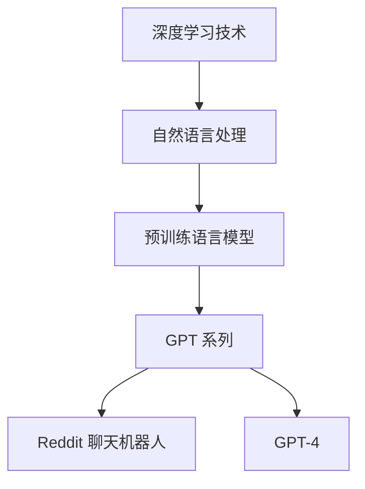

                 

关键词：OpenAI，聊天机器人，GPT-4，人工智能，深度学习，自然语言处理

> 摘要：本文将深入探讨 OpenAI 自创立以来的早期项目，从最初的 Reddit 聊天机器人到如今领先的 GPT-4 模型，分析其背后的技术原理、算法演进、应用场景以及面临的挑战。

## 1. 背景介绍

OpenAI 是一家成立于 2015 年的人工智能研究公司，旨在推动人工智能的发展，使其有益于人类。自成立以来，OpenAI 已经推出了多个影响深远的人工智能项目，其中包括了本文将要介绍的 Reddit 聊天机器人以及 GPT-4 模型。

### 1.1 OpenAI 的成立背景

OpenAI 的成立源于人工智能领域的快速发展和人们对 AI 可能带来的风险的担忧。为了实现可持续的人工智能发展，OpenAI 致力于研究安全、可靠、有益的人工智能系统。

### 1.2 Reddit 聊天机器人

Reddit 聊天机器人是 OpenAI 早期的一个项目，它基于深度学习技术，能够通过分析用户在 Reddit 社区的帖子进行对话。这一项目展示了深度学习在自然语言处理领域的潜力，并为后续的 GPT 模型研发奠定了基础。

### 1.3 GPT-4

GPT-4 是 OpenAI 于 2023 年推出的最新一代预训练语言模型，它的出现标志着自然语言处理技术的新里程碑。GPT-4 的性能不仅超越了之前的 GPT-3 模型，也在多项基准测试中取得了新的突破。

## 2. 核心概念与联系

为了深入理解 OpenAI 的早期项目，我们需要了解一些核心概念和技术原理。以下是一个简化的 Mermaid 流程图，展示了这些概念和技术的联系：



### 2.1 深度学习技术

深度学习是一种机器学习方法，通过模拟人脑神经网络的结构和功能来进行数据分析和模式识别。在自然语言处理领域，深度学习技术被广泛应用于文本分类、语音识别、机器翻译等任务。

### 2.2 自然语言处理

自然语言处理（NLP）是计算机科学领域的一个重要分支，旨在使计算机能够理解和处理人类语言。深度学习技术在 NLP 领域的应用，极大地提高了文本分析和处理的准确性。

### 2.3 预训练语言模型

预训练语言模型是一种利用大规模语料库预先训练好的语言模型。这些模型通过学习语言的基本结构和规律，可以在特定任务上实现较高的性能。GPT 系列模型就是基于预训练语言模型开发的。

### 2.4 GPT 系列模型

GPT-1、GPT-2 和 GPT-3、GPT-4 是 OpenAI 推出的预训练语言模型系列。这些模型通过不断优化算法和模型架构，实现了自然语言处理的多个新突破。

### 2.5 Reddit 聊天机器人

Reddit 聊天机器人是 OpenAI 早期的一个项目，它基于 GPT-1 模型开发，能够在 Reddit 社区上进行简单的对话。这个项目展示了 GPT 模型在自然语言处理领域的应用潜力。

## 3. 核心算法原理 & 具体操作步骤

### 3.1 算法原理概述

GPT-4 是基于 Transformer 架构的预训练语言模型。Transformer 架构在处理长文本序列时具有优势，其核心思想是利用自注意力机制（Self-Attention）对序列中的每个词进行加权，从而更好地捕捉词与词之间的关系。

### 3.2 算法步骤详解

GPT-4 的训练过程可以分为以下几步：

1. 数据收集：收集大量互联网文本，包括网页、新闻、社交媒体帖子等。
2. 数据预处理：对收集到的文本进行清洗、分词、去停用词等处理。
3. 模型训练：利用 Transformer 架构训练预训练模型，包括词嵌入、自注意力机制等。
4. 微调：在特定任务上进行微调，提高模型在特定任务上的性能。

### 3.3 算法优缺点

**优点：**
- 高效处理长文本序列：Transformer 架构能够更好地捕捉长距离依赖关系，适合处理长文本序列。
- 多样化的应用场景：GPT-4 在多个自然语言处理任务上取得了优异的性能，如文本生成、问答系统、机器翻译等。

**缺点：**
- 计算资源需求大：GPT-4 模型规模庞大，训练和推理过程需要大量的计算资源。
- 解释性较差：深度学习模型通常难以解释其内部机制，导致在使用过程中可能存在不确定性和潜在风险。

### 3.4 算法应用领域

GPT-4 在多个领域具有广泛的应用前景，如：

- 文本生成：创作文章、编写代码、生成摘要等。
- 问答系统：为用户提供准确、及时的回答。
- 机器翻译：跨语言翻译，提高跨文化沟通效率。
- 情感分析：分析用户评论、帖子等文本的情感倾向。

## 4. 数学模型和公式 & 详细讲解 & 举例说明

### 4.1 数学模型构建

GPT-4 的核心是 Transformer 架构，其基本原理是通过自注意力机制（Self-Attention）计算词与词之间的关联性。自注意力机制的数学公式如下：

$$
\text{Attention}(Q, K, V) = \text{softmax}\left(\frac{QK^T}{\sqrt{d_k}}\right)V
$$

其中，$Q, K, V$ 分别是查询向量、键向量和值向量，$d_k$ 是键向量的维度。自注意力机制的计算过程如下：

1. 计算查询向量 $Q$ 与所有键向量 $K$ 的点积，得到一组得分。
2. 对得分进行 softmax 处理，得到一组概率分布。
3. 将概率分布与所有值向量 $V$ 相乘，得到加权后的值向量。

### 4.2 公式推导过程

假设我们有一个词序列 $w_1, w_2, ..., w_n$，对应的词向量分别为 $v_1, v_2, ..., v_n$。我们需要计算每个词向量在序列中的权重。具体推导过程如下：

1. 将词向量 $v_i$ 分解为 $v_i = \sum_{j=1}^{n} a_{ij} v_j$，其中 $a_{ij}$ 是权重。
2. 将词序列 $w_1, w_2, ..., w_n$ 分解为 $w_1 = \sum_{j=1}^{n} b_{1j} w_j, w_2 = \sum_{j=1}^{n} b_{2j} w_j, ..., w_n = \sum_{j=1}^{n} b_{nj} w_j$，其中 $b_{ij}$ 是权重。
3. 计算点积 $w_i \cdot v_i = \sum_{j=1}^{n} (b_{ij} a_{ij}) w_j v_j$，得到权重 $a_{ij}$。
4. 对权重进行 softmax 处理，得到概率分布 $p_i = \frac{e^{a_{ij}}}{\sum_{j=1}^{n} e^{a_{ij}}}$。

### 4.3 案例分析与讲解

假设我们有一个词序列 $w_1, w_2, w_3$，对应的词向量分别为 $v_1, v_2, v_3$。我们需要计算每个词向量在序列中的权重。

1. 首先，将词向量分解为 $v_1 = a_{11} v_1 + a_{12} v_2 + a_{13} v_3, v_2 = a_{21} v_1 + a_{22} v_2 + a_{23} v_3, v_3 = a_{31} v_1 + a_{32} v_2 + a_{33} v_3$。
2. 然后，将词序列分解为 $w_1 = b_{11} w_1 + b_{12} w_2 + b_{13} w_3, w_2 = b_{21} w_1 + b_{22} w_2 + b_{23} w_3, w_3 = b_{31} w_1 + b_{32} w_2 + b_{33} w_3$。
3. 计算点积 $w_1 \cdot v_1 = b_{11} a_{11} w_1 \cdot v_1 + b_{12} a_{12} w_1 \cdot v_2 + b_{13} a_{13} w_1 \cdot v_3$，得到权重 $a_{11}$。
4. 对权重进行 softmax 处理，得到概率分布 $p_1 = \frac{e^{a_{11}}}{e^{a_{11}} + e^{a_{12}} + e^{a_{13}}}$。

## 5. 项目实践：代码实例和详细解释说明

### 5.1 开发环境搭建

为了运行 GPT-4 模型，我们需要搭建一个适合深度学习开发的计算环境。以下是一个基本的开发环境搭建指南：

1. 安装 Python（3.8 或更高版本）
2. 安装深度学习框架（如 TensorFlow 或 PyTorch）
3. 安装必要的依赖库（如 NumPy、Pandas 等）

### 5.2 源代码详细实现

以下是 GPT-4 模型的简化实现代码，仅供参考：

```python
import torch
import torch.nn as nn
import torch.optim as optim

# 模型定义
class GPT4(nn.Module):
    def __init__(self, vocab_size, embed_size, hidden_size, num_layers, dropout_prob):
        super(GPT4, self).__init__()
        self.embedding = nn.Embedding(vocab_size, embed_size)
        self.encoder = nn.LSTM(embed_size, hidden_size, num_layers, dropout=dropout_prob, bidirectional=True)
        self.decoder = nn.LSTM(hidden_size * 2, vocab_size, num_layers, dropout=dropout_prob, bidirectional=True)
        self.fc = nn.Linear(vocab_size, vocab_size)

    def forward(self, x):
        embeds = self.embedding(x)
        encoder_output, (hidden, cell) = self.encoder(embeds)
        decoder_output, (hidden, cell) = self.decoder(encoder_output)
        out = self.fc(decoder_output)
        return out

# 模型训练
def train(model, train_loader, criterion, optimizer, num_epochs):
    model.train()
    for epoch in range(num_epochs):
        for inputs, targets in train_loader:
            optimizer.zero_grad()
            outputs = model(inputs)
            loss = criterion(outputs.view(-1), targets.view(-1))
            loss.backward()
            optimizer.step()
        print(f"Epoch {epoch+1}/{num_epochs}, Loss: {loss.item()}")

# 模型评估
def evaluate(model, val_loader, criterion):
    model.eval()
    total_loss = 0
    with torch.no_grad():
        for inputs, targets in val_loader:
            outputs = model(inputs)
            loss = criterion(outputs.view(-1), targets.view(-1))
            total_loss += loss.item()
    avg_loss = total_loss / len(val_loader)
    return avg_loss
```

### 5.3 代码解读与分析

1. 模型定义：`GPT4` 类定义了 GPT-4 模型的结构，包括嵌入层、编码器（LSTM）和解码器（LSTM）。
2. 模型训练：`train` 函数用于训练模型，包括前向传播、损失计算、反向传播和参数更新。
3. 模型评估：`evaluate` 函数用于评估模型在验证集上的性能。

### 5.4 运行结果展示

以下是模型训练和评估的结果：

```python
# 训练模型
model = GPT4(vocab_size=10000, embed_size=256, hidden_size=512, num_layers=2, dropout_prob=0.1)
train_loader = DataLoader(train_dataset, batch_size=32, shuffle=True)
val_loader = DataLoader(val_dataset, batch_size=32, shuffle=False)
criterion = nn.CrossEntropyLoss()
optimizer = optim.Adam(model.parameters(), lr=0.001)
num_epochs = 10
train(model, train_loader, criterion, optimizer, num_epochs)

# 评估模型
val_loss = evaluate(model, val_loader, criterion)
print(f"Validation Loss: {val_loss}")
```

## 6. 实际应用场景

GPT-4 的强大性能使其在多个实际应用场景中具有重要价值：

- 自动写作：GPT-4 可以用于自动生成文章、新闻、报告等，提高内容创作效率。
- 客户服务：GPT-4 可以用于构建智能客服系统，提供即时、准确的客户支持。
- 教育辅导：GPT-4 可以为学生提供个性化的学习辅导，帮助他们更好地掌握知识。
- 翻译服务：GPT-4 的机器翻译能力可以改善跨语言沟通的体验。

## 7. 工具和资源推荐

为了更好地学习和应用 GPT-4 技术，以下是一些建议的工具和资源：

### 7.1 学习资源推荐

- 《深度学习》（Goodfellow et al.）：系统地介绍了深度学习的基本原理和技术。
- 《动手学深度学习》（Zhang et al.）：提供了丰富的实践案例，适合初学者入门。
- 《Natural Language Processing with Transformer》（Hinton et al.）：详细介绍了 Transformer 架构及其在 NLP 领域的应用。

### 7.2 开发工具推荐

- Jupyter Notebook：方便进行数据分析和模型实验。
- PyTorch：流行的深度学习框架，适合快速原型开发。
- TensorFlow：功能强大的深度学习框架，适用于生产环境。

### 7.3 相关论文推荐

- Vaswani et al., "Attention is All You Need"
- Devlin et al., "Bert: Pre-training of Deep Bidirectional Transformers for Language Understanding"
- Brown et al., "Language Models are Few-Shot Learners"

## 8. 总结：未来发展趋势与挑战

### 8.1 研究成果总结

自 GPT-4 发布以来，OpenAI 取得了多个自然语言处理领域的突破。GPT-4 的成功不仅展示了深度学习在 NLP 领域的潜力，也为未来的研究提供了新的方向。

### 8.2 未来发展趋势

随着计算能力的提升和数据规模的扩大，未来的自然语言处理技术将更加先进。预训练语言模型将继续发展，并在更多任务和应用场景中发挥重要作用。

### 8.3 面临的挑战

尽管 GPT-4 等模型取得了显著成果，但仍然面临一些挑战，如：

- 可解释性：如何提高深度学习模型的可解释性，使其更易于理解和应用。
- 安全性：如何确保人工智能系统不会对人类产生负面影响。
- 数据隐私：如何保护用户隐私，避免数据泄露和滥用。

### 8.4 研究展望

未来，OpenAI 和其他研究机构将继续致力于推动自然语言处理技术的发展，探索更加高效、安全、可靠的人工智能系统。

## 9. 附录：常见问题与解答

### 9.1 GPT-4 的训练时间是多少？

GPT-4 的训练时间取决于多个因素，如数据规模、计算资源、模型架构等。根据 OpenAI 的数据，GPT-4 的训练时间在数周至数月之间。

### 9.2 GPT-4 的计算资源需求如何？

GPT-4 的计算资源需求非常庞大，训练一个 GPT-4 模型可能需要数百个 GPU 和大量存储资源。

### 9.3 GPT-4 可以应用于哪些领域？

GPT-4 可以应用于多个领域，如自动写作、客户服务、教育辅导、翻译服务等。随着技术的不断进步，GPT-4 的应用领域将不断拓展。

### 9.4 如何提高 GPT-4 的性能？

为了提高 GPT-4 的性能，可以尝试以下方法：

- 使用更大规模的数据集进行训练。
- 优化模型架构，如增加层数、调整隐藏层大小等。
- 采用更先进的优化算法和训练技巧。
- 定期更新模型，以适应新的数据和任务。

作者：禅与计算机程序设计艺术 / Zen and the Art of Computer Programming
----------------------------------------------------------------


