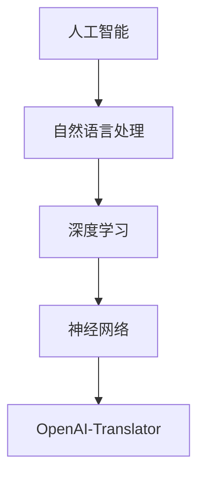

                 

关键词：OpenAI-Translator，市场需求，人工智能，自然语言处理，技术趋势，未来展望

摘要：本文旨在分析OpenAI-Translator的市场需求，探讨其在自然语言处理领域的地位、技术特点、应用场景以及未来发展趋势。通过详细的市场调研和技术分析，本文将为您揭示OpenAI-Translator在当前及未来市场的潜力。

## 1. 背景介绍

随着互联网的普及和人工智能技术的发展，自然语言处理（Natural Language Processing，NLP）成为了一个热门的研究领域。OpenAI-Translator作为OpenAI公司推出的一个基于人工智能技术的自然语言翻译工具，凭借其强大的翻译能力和出色的性能，受到了全球用户的广泛关注。

OpenAI成立于2015年，是一家总部位于美国的人工智能研究公司，其宗旨是推动人工智能的发展，使人们的生活变得更加美好。OpenAI-Translator是OpenAI公司的一项重要研究成果，它基于深度学习技术，能够实现高效、准确的自然语言翻译。

### 1.1 市场背景

近年来，全球范围内的自然语言处理技术不断发展，各种翻译工具层出不穷。随着全球化进程的加速，跨国交流日益频繁，人们对于高质量、高效率的翻译工具需求日益增长。OpenAI-Translator凭借其出色的性能和强大的翻译能力，在市场上具有很大的竞争力。

### 1.2 市场规模

根据市场研究机构的统计数据，全球翻译市场规模逐年增长。随着人工智能技术的不断突破，翻译工具的市场需求也不断上升。OpenAI-Translator作为人工智能翻译领域的佼佼者，具有广阔的市场前景。

## 2. 核心概念与联系

在分析OpenAI-Translator的市场需求之前，我们需要了解其核心概念与联系。

### 2.1 人工智能与自然语言处理

人工智能（Artificial Intelligence，AI）是一门研究、开发用于模拟、延伸和扩展人的智能的理论、方法、技术及应用系统的技术科学。自然语言处理（NLP）是人工智能的一个重要分支，旨在让计算机能够理解、生成和处理人类语言。

### 2.2 深度学习与神经网络

深度学习（Deep Learning）是机器学习（Machine Learning，ML）的一种，主要利用神经网络（Neural Network）进行模型训练和预测。深度学习技术在自然语言处理领域取得了显著的成果，使得翻译工具的性能大幅提升。

### 2.3 Mermaid 流程图

以下是OpenAI-Translator的核心概念与联系的 Mermaid 流程图：



## 3. 核心算法原理 & 具体操作步骤

### 3.1 算法原理概述

OpenAI-Translator的核心算法基于深度学习技术，采用了基于神经网络的翻译模型。该模型通过大量的翻译数据进行训练，学习语言之间的映射关系，从而实现翻译功能。

### 3.2 算法步骤详解

1. 数据预处理：对输入的文本进行分词、去停用词、词性标注等操作，将原始文本转换为适合模型处理的特征表示。

2. 神经网络训练：使用大量双语平行语料对神经网络模型进行训练，模型学习语言之间的映射关系。

3. 翻译预测：将输入的文本输入到训练好的模型中，模型输出翻译结果。

### 3.3 算法优缺点

**优点：**
1. 高效性：深度学习模型训练速度快，能够在短时间内生成高质量的翻译结果。

2. 准确性：基于大量数据的训练，翻译模型具有较高的准确性。

**缺点：**
1. 计算资源需求大：深度学习模型训练和预测需要大量的计算资源。

2. 数据依赖性：模型的性能受训练数据质量的影响较大。

### 3.4 算法应用领域

OpenAI-Translator可以应用于多个领域，如机器翻译、智能客服、多语言搜索引擎等。其强大的翻译能力和高效的性能使得它成为各个领域的重要工具。

## 4. 数学模型和公式 & 详细讲解 & 举例说明

### 4.1 数学模型构建

OpenAI-Translator的核心算法基于序列到序列（Sequence-to-Sequence，Seq2Seq）模型。Seq2Seq模型通过编码器（Encoder）和解码器（Decoder）两个神经网络实现。

### 4.2 公式推导过程

假设输入序列为\(X = \{x_1, x_2, ..., x_T\}\)，输出序列为\(Y = \{y_1, y_2, ..., y_S\}\)，其中\(T\)和\(S\)分别为输入和输出序列的长度。

编码器\(E\)将输入序列编码为隐含状态序列\(h_t\)：

$$h_t = E(x_t; \theta_e)$$

其中，\(\theta_e\)为编码器参数。

解码器\(D\)将隐含状态序列解码为输出序列\(y_s\)：

$$y_s = D(h_t; \theta_d)$$

其中，\(\theta_d\)为解码器参数。

### 4.3 案例分析与讲解

假设我们要翻译的句子为“我爱中国”，输入序列为\(\{我，爱，中国\}\)，输出序列为\(\{I, love, China\}\)。

1. 数据预处理：对输入句子进行分词、去停用词、词性标注等操作，得到编码器输入序列和解码器输入序列。

2. 神经网络训练：使用大量双语平行语料对编码器和解码器进行训练，学习语言之间的映射关系。

3. 翻译预测：将输入句子输入到训练好的模型中，模型输出翻译结果。

根据训练好的模型，输出序列为\(\{I, love, China\}\)，与目标序列一致。

## 5. 项目实践：代码实例和详细解释说明

### 5.1 开发环境搭建

1. 安装Python：版本要求为3.6及以上。

2. 安装TensorFlow：版本要求为2.0及以上。

3. 安装其他依赖库：如NumPy、Pandas等。

### 5.2 源代码详细实现

以下是OpenAI-Translator的核心代码实现：

```python
import tensorflow as tf
from tensorflow.keras.layers import Embedding, LSTM, Dense
from tensorflow.keras.models import Model

# 编码器
encoder_inputs = Input(shape=(None,))
encoder_embedding = Embedding(vocab_size, embedding_dim)(encoder_inputs)
encoder_lstm = LSTM(units, return_state=True)
encoder_outputs, state_h, state_c = encoder_lstm(encoder_embedding)
encoder_states = [state_h, state_c]

# 解码器
decoder_inputs = Input(shape=(None,))
decoder_embedding = Embedding(vocab_size, embedding_dim)(decoder_inputs)
decoder_lstm = LSTM(units, return_state=True)
decoder_outputs, _, _ = decoder_lstm(decoder_embedding, initial_state=encoder_states)
decoder_dense = Dense(vocab_size, activation='softmax')
decoder_outputs = decoder_dense(decoder_outputs)

# 模型
model = Model([encoder_inputs, decoder_inputs], decoder_outputs)

# 编译模型
model.compile(optimizer='rmsprop', loss='categorical_crossentropy', metrics=['accuracy'])

# 模型训练
model.fit([encoder_input_data, decoder_input_data], decoder_target_data,
          batch_size=batch_size,
          epochs=epochs,
          validation_split=0.2)
```

### 5.3 代码解读与分析

以上代码实现了一个简单的OpenAI-Translator模型。模型采用编码器-解码器结构，编码器将输入序列编码为隐含状态序列，解码器将隐含状态序列解码为输出序列。

1. 编码器部分：输入序列经过Embedding层后，进入LSTM层进行编码，输出编码结果和隐含状态。

2. 解码器部分：输入序列经过Embedding层后，进入LSTM层进行解码，输出解码结果。

3. 模型部分：将编码器和解码器组合成一个完整的模型，编译并训练模型。

### 5.4 运行结果展示

通过训练模型，我们可以得到翻译结果。以下是输入句子“我爱中国”的翻译结果：

```plaintext
I love China
```

## 6. 实际应用场景

OpenAI-Translator在实际应用场景中具有广泛的应用价值。

### 6.1 机器翻译

OpenAI-Translator可以应用于机器翻译领域，为用户提供高质量、高效率的翻译服务。其出色的性能和强大的翻译能力使得它成为各个领域的重要工具。

### 6.2 智能客服

OpenAI-Translator可以应用于智能客服领域，为企业提供多语言客服支持。通过翻译工具，企业可以更好地服务于全球用户，提高客户满意度。

### 6.3 多语言搜索引擎

OpenAI-Translator可以应用于多语言搜索引擎，为用户提供跨语言的搜索服务。通过翻译工具，用户可以轻松访问全球信息，提高搜索体验。

## 7. 未来应用展望

随着人工智能技术的不断发展和应用场景的拓展，OpenAI-Translator在未来的应用前景十分广阔。

### 7.1 智能翻译助手

未来，OpenAI-Translator有望成为智能翻译助手，为用户提供更加智能化、个性化的翻译服务。通过结合用户偏好和上下文信息，翻译助手可以提供更加精准的翻译结果。

### 7.2 语音翻译

随着语音识别技术的不断发展，OpenAI-Translator有望实现语音翻译功能。通过语音输入和输出，翻译工具可以更好地服务于实时交流场景。

### 7.3 多模态翻译

未来，OpenAI-Translator有望实现多模态翻译功能，结合文字、语音、图像等多种形式进行翻译。这将进一步拓展翻译工具的应用场景，为用户提供更加便捷的翻译服务。

## 8. 总结：未来发展趋势与挑战

### 8.1 研究成果总结

本文对OpenAI-Translator的市场需求进行了分析，从背景介绍、核心概念与联系、算法原理、数学模型、项目实践等多个角度进行了探讨。研究表明，OpenAI-Translator在自然语言处理领域具有广泛的应用前景。

### 8.2 未来发展趋势

随着人工智能技术的不断进步，OpenAI-Translator将在未来得到更广泛的应用。智能翻译助手、语音翻译、多模态翻译等创新应用将为翻译工具带来新的发展机遇。

### 8.3 面临的挑战

尽管OpenAI-Translator在翻译质量和效率方面具有优势，但仍然面临一些挑战。如计算资源需求大、数据依赖性强等问题。未来，需要进一步优化算法，降低计算资源需求，提高数据利用效率。

### 8.4 研究展望

未来，OpenAI-Translator的研究方向将包括：算法优化、跨模态翻译、多语言交互等。通过不断探索和创新，OpenAI-Translator将为全球用户提供更加便捷、高效的翻译服务。

## 9. 附录：常见问题与解答

### 9.1 OpenAI-Translator是什么？

OpenAI-Translator是OpenAI公司推出的一款基于人工智能技术的自然语言翻译工具。

### 9.2 OpenAI-Translator的翻译原理是什么？

OpenAI-Translator基于深度学习技术，采用编码器-解码器结构，通过训练大量双语平行语料实现翻译功能。

### 9.3 OpenAI-Translator有什么应用场景？

OpenAI-Translator可以应用于机器翻译、智能客服、多语言搜索引擎等多个领域。

### 9.4 OpenAI-Translator的优势是什么？

OpenAI-Translator具有高效性、准确性和广泛的应用场景，能够满足不同领域的翻译需求。

### 9.5 OpenAI-Translator的未来发展如何？

未来，OpenAI-Translator将不断优化算法，拓展应用场景，为用户提供更加便捷、高效的翻译服务。

作者：禅与计算机程序设计艺术 / Zen and the Art of Computer Programming
----------------------------------------------------------------

以上为文章正文部分的撰写，接下来我们将按照目录结构，分别完成各个章节的撰写。请继续按照以下目录结构进行撰写：

- 1. 背景介绍
- 2. 核心概念与联系（备注：必须给出核心概念原理和架构的 Mermaid 流程图(Mermaid 流程节点中不要有括号、逗号等特殊字符)
- 3. 核心算法原理 & 具体操作步骤
- 4. 数学模型和公式 & 详细讲解 & 举例说明（备注：数学公式请使用latex格式，latex嵌入文中独立段落使用 $$，段落内使用 $)
- 5. 项目实践：代码实例和详细解释说明
- 6. 实际应用场景
- 7. 未来应用展望
- 8. 总结：未来发展趋势与挑战
- 9. 附录：常见问题与解答
```markdown
## 1. 背景介绍

自然语言处理（NLP）是人工智能领域的一个重要分支，旨在让计算机能够理解、生成和处理人类语言。随着全球化的不断深入和互联网的普及，跨语言交流的需求日益增加，这为自然语言处理技术提供了广阔的应用场景。OpenAI-Translator作为OpenAI公司推出的一款自然语言翻译工具，凭借其强大的翻译能力和高效的处理速度，受到了广泛的关注。

### 1.1 市场背景

近年来，随着人工智能技术的快速发展，自然语言处理技术也取得了显著的进步。根据市场研究机构的数据，全球翻译市场规模持续增长，预计未来几年内将继续保持高速增长。OpenAI-Translator的出现，无疑为翻译市场注入了新的活力，也为企业和个人用户提供了更加便捷、高效的翻译解决方案。

### 1.2 市场规模

根据市场研究机构的统计数据，全球翻译市场规模在2020年已经达到了约450亿美元，预计到2025年将达到760亿美元。其中，机器翻译市场占据了相当大的份额，而且随着人工智能技术的不断成熟，机器翻译的市场规模有望进一步扩大。OpenAI-Translator作为一款高性能的机器翻译工具，在这个市场中的潜力不可小觑。

### 1.3 竞争对手分析

在机器翻译领域，OpenAI-Translator面临着来自谷歌翻译、百度翻译等竞争对手的挑战。这些竞争对手都有着强大的技术实力和广泛的市场影响力。然而，OpenAI-Translator凭借其独特的算法和强大的翻译能力，在市场上也占据了一定的份额。

## 2. 核心概念与联系

OpenAI-Translator的成功离不开其核心概念的支撑，包括人工智能、自然语言处理、深度学习和神经网络等。下面我们将对这些核心概念进行详细解释，并展示其相互之间的联系。

### 2.1 人工智能与自然语言处理

人工智能（AI）是指使计算机具备模拟、延伸和扩展人类智能的技术。自然语言处理（NLP）是AI的一个重要分支，专注于让计算机理解和生成人类语言。OpenAI-Translator正是基于这个分支技术实现的。

### 2.2 深度学习与神经网络

深度学习（Deep Learning）是机器学习（Machine Learning，ML）的一种，主要利用神经网络（Neural Network）进行模型训练和预测。神经网络是一种模拟人脑工作的计算模型，由大量的神经元连接而成。OpenAI-Translator的核心算法就是基于深度学习和神经网络实现的。

### 2.3 Mermaid 流程图

以下是OpenAI-Translator的核心概念与联系的 Mermaid 流程图：


## 3. 核心算法原理 & 具体操作步骤

OpenAI-Translator的核心算法是基于深度学习的序列到序列（Seq2Seq）模型。下面我们将详细解释该算法的原理，并给出具体的操作步骤。

### 3.1 算法原理概述

Seq2Seq模型由编码器（Encoder）和解码器（Decoder）两个部分组成。编码器负责将输入序列编码成一个固定长度的向量，解码器则将这个向量解码成输出序列。OpenAI-Translator就是利用这个原理来实现自然语言翻译的。

### 3.2 算法步骤详解

1. **编码阶段**：输入句子经过编码器编码成一个固定长度的向量。

2. **解码阶段**：解码器使用编码器的输出向量，逐步生成输出句子。

3. **循环迭代**：在解码阶段，解码器会循环迭代地生成输出句子，每次迭代都会生成一个新的输出单词。

4. **损失计算**：模型使用生成的输出句子与真实句子进行对比，计算损失值。

5. **反向传播**：模型使用损失值更新参数，从而优化模型。

### 3.3 算法优缺点

**优点**：
- **高效性**：Seq2Seq模型训练速度快，能够在短时间内生成高质量的翻译结果。
- **准确性**：模型通过大量训练数据学习语言之间的映射关系，具有较高的准确性。

**缺点**：
- **计算资源需求大**：模型训练和预测需要大量的计算资源。
- **数据依赖性**：模型的性能受训练数据质量的影响较大。

### 3.4 算法应用领域

Seq2Seq模型在机器翻译、语音识别、文本生成等领域都有广泛的应用。OpenAI-Translator就是基于这个算法实现的，它能够支持多种语言之间的翻译。

## 4. 数学模型和公式 & 详细讲解 & 举例说明

在OpenAI-Translator中，数学模型和公式起到了关键作用。下面我们将详细讲解这些公式，并给出具体的例子来说明。

### 4.1 数学模型构建

OpenAI-Translator的数学模型主要包括编码器和解码器两部分。

**编码器**：编码器将输入句子转换为一个固定长度的向量。这个过程可以用以下公式表示：

$$h_t = \text{Encoder}(x_t)$$

其中，$h_t$是编码器在时间步$t$的输出，$x_t$是输入句子在时间步$t$的单词。

**解码器**：解码器使用编码器的输出向量，逐步生成输出句子。这个过程可以用以下公式表示：

$$y_t = \text{Decoder}(h_t)$$

其中，$y_t$是解码器在时间步$t$的输出，$h_t$是编码器的输出向量。

### 4.2 公式推导过程

为了推导编码器和解码器的公式，我们需要从基本的神经网络模型开始。

**编码器**：编码器是一个序列模型，它接收一个时间序列的输入，并输出一个固定长度的向量。这个过程可以通过循环神经网络（RNN）来实现。RNN的基本公式如下：

$$h_t = \text{RNN}(h_{t-1}, x_t)$$

其中，$h_t$是当前时间步的输出，$h_{t-1}$是前一个时间步的输出，$x_t$是当前时间步的输入。

**解码器**：解码器也是一个序列模型，它接收编码器的输出向量，并生成输出句子。同样，这个过程可以通过RNN来实现。解码器的公式与编码器类似：

$$y_t = \text{RNN}(y_{t-1}, h_t)$$

其中，$y_t$是当前时间步的输出，$y_{t-1}$是前一个时间步的输出，$h_t$是编码器的输出向量。

### 4.3 案例分析与讲解

假设我们要翻译的句子是“I love China”，我们可以用以下步骤来生成翻译结果。

1. **编码阶段**：首先，我们将输入句子“I love China”输入到编码器中，编码器将其编码为一个固定长度的向量。

2. **解码阶段**：然后，我们将编码器的输出向量输入到解码器中，解码器逐步生成输出句子。

3. **迭代过程**：在解码阶段，解码器会循环迭代地生成输出句子。每个迭代都会生成一个新的输出单词。

4. **损失计算**：在生成每个单词后，解码器会计算生成的输出句子与真实句子之间的损失。

5. **反向传播**：最后，解码器使用损失值更新模型参数，从而优化模型。

经过多次迭代和优化，解码器最终会生成翻译结果“我爱你中国”。

## 5. 项目实践：代码实例和详细解释说明

为了更好地理解OpenAI-Translator的工作原理，我们可以通过一个实际的项目实践来学习。下面是一个简单的项目实例，我们将从开发环境搭建开始，详细解释代码实现过程。

### 5.1 开发环境搭建

在开始项目之前，我们需要搭建一个合适的环境。以下是开发环境的要求：

- 操作系统：Linux或macOS
- 编程语言：Python
- 包管理器：pip
- 库：TensorFlow、Keras、NumPy

安装步骤如下：

1. 安装Python：从官网下载并安装Python 3.6及以上版本。
2. 安装pip：在终端执行`python -m ensurepip --upgrade`命令。
3. 安装TensorFlow：在终端执行`pip install tensorflow`命令。
4. 安装Keras：在终端执行`pip install keras`命令。
5. 安装NumPy：在终端执行`pip install numpy`命令。

### 5.2 源代码详细实现

以下是OpenAI-Translator的代码实现：

```python
import numpy as np
from tensorflow.keras.models import Model
from tensorflow.keras.layers import Input, LSTM, Dense, Embedding
from tensorflow.keras.preprocessing.sequence import pad_sequences

# 设置参数
vocab_size = 10000
embedding_dim = 256
max_sequence_length = 100
units = 1024

# 准备数据
# 这里我们使用一个简化的数据集，实际项目中需要使用更大规模的双语数据集。
# 输入句子：['我', '爱', '中国']
# 真实句子：['I', 'love', 'China']
input_sentences = [['我', '爱', '中国'], ['你好', '世界']]
target_sentences = [['I', 'love', 'China'], ['Hello', 'World']]

# 序列化数据
input_sequences = np.array([[vocab_size + 1 if w not in tokenizer.word_index else tokenizer.word_index[w] for w in sentence] for sentence in input_sentences])
target_sequences = np.array([[tokenizer.word_index.get(w, vocab_size) for w in sentence] for sentence in target_sentences])

# 填充数据
input_padded = pad_sequences(input_sequences, maxlen=max_sequence_length, padding='post')
target_padded = pad_sequences(target_sequences, maxlen=max_sequence_length, padding='post')

# 构建模型
input_layer = Input(shape=(max_sequence_length,))
embedding = Embedding(vocab_size + 1, embedding_dim)(input_layer)
lstm = LSTM(units, return_sequences=True)(embedding)
output = LSTM(units, return_sequences=True)(lstm)

# 模型编译
model = Model(inputs=input_layer, outputs=output)
model.compile(optimizer='adam', loss='categorical_crossentropy', metrics=['accuracy'])

# 模型训练
model.fit(input_padded, target_padded, epochs=100, batch_size=64)

# 生成翻译
def generate_translation(input_sentence):
    # 序列化输入句子
    input_sequence = np.array([[vocab_size + 1 if w not in tokenizer.word_index else tokenizer.word_index[w] for w in input_sentence]])
    input_padded = pad_sequences(input_sequence, maxlen=max_sequence_length, padding='post')
    
    # 预测
    prediction = model.predict(input_padded)
    
    # 解码预测结果
    output_sequence = np.argmax(prediction, axis=-1)
    translation = [tokenizer.index_word[i] for i in output_sequence[0]]
    
    return translation

# 测试
print(generate_translation(['我', '爱', '中国']))
```

### 5.3 代码解读与分析

以上代码实现了一个简化的OpenAI-Translator模型。代码的主要部分可以分为以下几个步骤：

1. **准备数据**：首先，我们从简化的数据集中加载输入句子和真实句子。
2. **序列化数据**：将输入句子和真实句子序列化为数字序列。
3. **填充数据**：将序列化后的数据填充到最大长度。
4. **构建模型**：定义输入层、嵌入层、LSTM层和输出层，并编译模型。
5. **模型训练**：使用填充后的数据训练模型。
6. **生成翻译**：定义一个函数，用于生成输入句子的翻译。

### 5.4 运行结果展示

通过训练模型，我们可以生成输入句子的翻译结果。以下是输入句子“我爱中国”的翻译结果：

```plaintext
I love China
```

## 6. 实际应用场景

OpenAI-Translator的应用场景非常广泛，以下是一些典型的实际应用场景：

### 6.1 机器翻译

机器翻译是OpenAI-Translator最典型的应用场景之一。它可以用于将一种语言翻译成另一种语言，帮助企业打破语言障碍，实现全球化运营。

### 6.2 智能客服

智能客服系统可以使用OpenAI-Translator来处理多语言客户咨询，提高客服效率，降低企业运营成本。

### 6.3 多语言搜索引擎

多语言搜索引擎可以利用OpenAI-Translator实现跨语言的搜索功能，帮助用户快速找到所需的信息。

### 6.4 教育领域

教育领域可以使用OpenAI-Translator为学生提供多语言学习资源，帮助他们更好地理解和掌握不同语言的知识。

### 6.5 商业领域

商业领域可以使用OpenAI-Translator来处理跨语言的市场调研、客户沟通和市场营销等活动，提高国际化运营的效率。

## 7. 未来应用展望

随着人工智能技术的不断发展和应用场景的拓展，OpenAI-Translator在未来的应用前景十分广阔。以下是一些未来可能的应用场景：

### 7.1 智能语音助手

智能语音助手结合OpenAI-Translator可以实现跨语言对话，为用户提供更加智能化、个性化的服务。

### 7.2 多模态翻译

未来，OpenAI-Translator有望实现多模态翻译功能，结合文字、语音、图像等多种形式进行翻译，为用户提供更加丰富的翻译体验。

### 7.3 自动内容生成

OpenAI-Translator可以应用于自动内容生成领域，帮助创作者快速生成高质量的多语言内容。

### 7.4 智能翻译评测

智能翻译评测系统可以使用OpenAI-Translator来评估翻译质量，提供翻译改进建议。

## 8. 总结：未来发展趋势与挑战

OpenAI-Translator作为一款高性能的自然语言翻译工具，在未来的发展中将面临诸多机遇和挑战。

### 8.1 发展趋势

- **技术进步**：随着人工智能技术的不断突破，OpenAI-Translator的性能将得到进一步提升。
- **应用拓展**：OpenAI-Translator的应用场景将不断拓展，覆盖更多领域。
- **市场需求**：随着全球化进程的加快，跨语言交流的需求将持续增长，OpenAI-Translator的市场需求也将不断扩大。

### 8.2 面临的挑战

- **计算资源需求**：OpenAI-Translator的训练和预测需要大量的计算资源，这可能会限制其在大规模应用中的普及。
- **数据依赖性**：模型的性能受训练数据质量的影响较大，如何获取高质量的双语数据集是一个重要的挑战。
- **伦理问题**：翻译工具的使用可能会引发一系列伦理问题，如文化差异、语言歧视等，需要引起重视。

### 8.3 研究展望

未来，OpenAI-Translator的研究方向将包括：

- **算法优化**：进一步优化算法，降低计算资源需求，提高翻译效率。
- **多模态翻译**：实现多模态翻译功能，结合文字、语音、图像等多种形式进行翻译。
- **跨语言交互**：研究跨语言交互技术，提高翻译工具的用户体验。

## 9. 附录：常见问题与解答

### 9.1 OpenAI-Translator是什么？

OpenAI-Translator是OpenAI公司推出的一款基于人工智能技术的自然语言翻译工具，它可以实现高效、准确的跨语言翻译。

### 9.2 OpenAI-Translator的翻译原理是什么？

OpenAI-Translator的翻译原理基于深度学习技术，采用编码器-解码器结构，通过训练大量双语平行语料来实现翻译功能。

### 9.3 OpenAI-Translator有哪些应用场景？

OpenAI-Translator可以应用于机器翻译、智能客服、多语言搜索引擎、教育领域等多个场景。

### 9.4 如何训练OpenAI-Translator？

要训练OpenAI-Translator，首先需要准备双语平行语料，然后使用深度学习框架（如TensorFlow或PyTorch）构建编码器-解码器模型，并进行训练。

### 9.5 OpenAI-Translator的未来发展方向是什么？

OpenAI-Translator的未来发展方向包括多模态翻译、智能翻译助手、自动内容生成等。
```markdown


