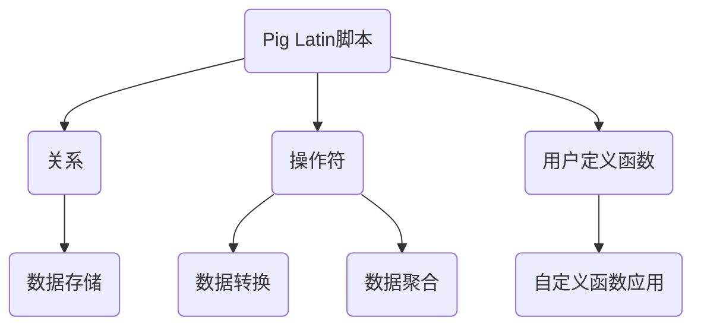

                 

“Pig Latin”是一种用于数据处理和变换的高级数据流语言，由Apache Pig项目开发。Pig Latin提供了简单且易用的抽象，用于处理大规模数据集。本文将深入讲解Pig Latin脚本的基本原理，并通过具体代码实例展示其应用。

## 文章关键词
- Pig Latin
- 数据处理
- Apache Pig
- 数据流语言
- 高级抽象

## 文章摘要
本文首先介绍了Pig Latin的背景和优势，然后详细阐述了其核心概念和架构。接着，通过具体实例演示了Pig Latin脚本的使用方法，包括数据读取、转换和存储。最后，文章探讨了Pig Latin在数据科学和大数据处理中的实际应用，并展望了其未来的发展方向。

## 1. 背景介绍
### 1.1 Pig Latin的起源
Pig Latin是由Apache Software Foundation开发的一种高级数据流语言。它起源于Google的MapReduce编程模型，但提供了更加高级和抽象的编程接口。Pig Latin的目的是简化大数据处理任务的编程复杂性，使得数据科学家和开发者能够更加专注于业务逻辑，而不是底层细节。

### 1.2 Apache Pig项目
Apache Pig是一个开源项目，它为Pig Latin脚本提供了一个解释器和编译器。Pig Latin脚本可以被编译成MapReduce作业，也可以转换为其他分布式数据处理引擎（如Hive、Spark）的查询。这使得Pig Latin在多种大数据平台上有广泛的适用性。

## 2. 核心概念与联系
### 2.1 Pig Latin的基本概念
Pig Latin有以下几个核心概念：
- **关系（Relational）**：Pig Latin中的数据以关系的形式组织，类似于SQL中的表。
- **操作符（Operator）**：Pig Latin提供了丰富的操作符，用于数据转换和聚合。
- **用户定义函数（UDF）**：用户可以定义自己的函数，以便在Pig Latin脚本中使用。

### 2.2 Pig Latin架构图（使用Mermaid绘制）

## 3. 核心算法原理 & 具体操作步骤
### 3.1 算法原理概述
Pig Latin的核心算法是基于其操作符和数据关系。它通过一系列的转换和操作，将原始数据转换为目标数据。这个过程类似于SQL查询，但提供了更加灵活和动态的操作方式。

### 3.2 算法步骤详解
1. **数据读取**：使用`LOAD`操作符读取数据源。
2. **数据转换**：使用`REGISTER`操作符加载用户定义函数，然后使用`JOIN`、`GROUP`、`DISTINCT`等操作符进行数据转换。
3. **数据存储**：使用`STORE`操作符将转换后的数据存储到目标位置。

### 3.3 算法优缺点
**优点**：
- **易用性**：提供了高级的抽象，降低了编程复杂性。
- **灵活性**：可以自定义函数，适用于各种复杂的数据处理任务。

**缺点**：
- **性能**：与原生MapReduce或Spark等相比，可能会有一定的性能损耗。

### 3.4 算法应用领域
Pig Latin广泛应用于数据清洗、数据转换、数据分析等场景。它在数据仓库、大数据处理、机器学习等领域都有广泛的应用。

## 4. 数学模型和公式 & 详细讲解 & 举例说明
### 4.1 数学模型构建
Pig Latin脚本中的许多操作都可以用数学模型来描述。例如，`JOIN`操作可以看作是两个数据集的笛卡尔积。

### 4.2 公式推导过程
设两个关系R和S，分别有m和n个属性，其笛卡尔积为T，则：
\[ T = R \times S \]
其中，\( T(i, j) = R(i) \times S(j) \)

### 4.3 案例分析与讲解
假设我们有两个数据集，一个是用户数据（包含用户ID、姓名、年龄），另一个是订单数据（包含订单ID、用户ID、订单日期）。我们可以使用Pig Latin脚本进行用户订单关系的分析。

## 5. 项目实践：代码实例和详细解释说明
### 5.1 开发环境搭建
确保安装了Hadoop和Apache Pig。

### 5.2 源代码详细实现
```pig
-- 加载数据
users = LOAD '/path/to/users.csv' USING PigStorage(',') AS (id:int, name:chararray, age:int);
orders = LOAD '/path/to/orders.csv' USING PigStorage(',') AS (id:int, user_id:int, date:chararray);

-- 联合数据集
user_orders = JOIN users BY id, orders BY user_id;

-- 转换数据格式
user_orders_final = FOREACH user_orders GENERATE users::id, users::name, users::age, orders::date;

-- 存储结果
STORE user_orders_final INTO '/path/to/user_orders.csv' USING PigStorage(',');
```

### 5.3 代码解读与分析
- `LOAD`：读取用户数据和订单数据。
- `JOIN`：将用户数据和订单数据按照用户ID进行联合。
- `FOREACH`：对联合后的数据进行转换。
- `STORE`：将转换后的数据存储到文件。

### 5.4 运行结果展示
运行上述脚本后，会在指定的路径生成用户订单关系的CSV文件。

## 6. 实际应用场景
Pig Latin在多种大数据应用中都有广泛应用，如：
- 数据仓库：用于数据清洗、转换和集成。
- 数据科学：用于大规模数据分析。
- 机器学习：用于数据处理和特征工程。

## 7. 工具和资源推荐
### 7.1 学习资源推荐
- Apache Pig官方文档：[Apache Pig Documentation](https://pig.apache.org/docs/r0.17.0/)
- 《Pig in Action》一书

### 7.2 开发工具推荐
- IntelliJ IDEA：支持Pig语言的开发环境。
- Eclipse：也支持Pig语言开发，但相对较少使用。

### 7.3 相关论文推荐
- "Pig: A Platform for Creating MapReduce Programs for Data Processing on Large Clusters" by D. DeWitt and C. F. Chang.

## 8. 总结：未来发展趋势与挑战
Pig Latin在数据处理领域有广阔的应用前景。未来，随着大数据技术的发展，Pig Latin有望在更多场景中发挥作用。然而，也需要解决性能优化、兼容性和易用性等方面的问题。

## 9. 附录：常见问题与解答
### Q：Pig Latin和MapReduce有什么区别？
A：Pig Latin提供了更高的抽象层次，使得编写大数据处理任务更加简单。MapReduce则需要手动编写Map和Reduce函数，更底层的实现细节。

### Q：Pig Latin能和Spark集成吗？
A：是的，Apache Pig支持将Pig Latin脚本转换为Spark SQL查询，从而在Spark上进行数据操作。

作者：禅与计算机程序设计艺术 / Zen and the Art of Computer Programming
```markdown
----------------------------------------------------------------

# Pig Latin脚本原理与代码实例讲解

> 关键词：Pig Latin、数据处理、Apache Pig、数据流语言、高级抽象

> 摘要：本文介绍了Pig Latin的背景和优势，详细讲解了其核心概念和架构。通过具体代码实例，展示了Pig Latin脚本的使用方法。文章最后探讨了Pig Latin在数据科学和大数据处理中的实际应用，并展望了其未来的发展方向。

## 1. 背景介绍

### 1.1 Pig Latin的起源
Pig Latin是由Apache Software Foundation开发的一种高级数据流语言。它起源于Google的MapReduce编程模型，但提供了更加高级和抽象的编程接口。Pig Latin的目的是简化大数据处理任务的编程复杂性，使得数据科学家和开发者能够更加专注于业务逻辑，而不是底层细节。

### 1.2 Apache Pig项目
Apache Pig是一个开源项目，它为Pig Latin脚本提供了一个解释器和编译器。Pig Latin脚本可以被编译成MapReduce作业，也可以转换为其他分布式数据处理引擎（如Hive、Spark）的查询。这使得Pig Latin在多种大数据平台上有广泛的适用性。

## 2. 核心概念与联系

### 2.1 Pig Latin的基本概念
Pig Latin中的数据以关系的形式组织，类似于SQL中的表。Pig Latin提供了丰富的操作符，用于数据转换和聚合。此外，用户可以定义自己的函数，以便在Pig Latin脚本中使用。

### 2.2 Pig Latin架构图（使用Mermaid绘制）


## 3. 核心算法原理 & 具体操作步骤

### 3.1 算法原理概述
Pig Latin的核心算法是基于其操作符和数据关系。它通过一系列的转换和操作，将原始数据转换为目标数据。这个过程类似于SQL查询，但提供了更加灵活和动态的操作方式。

### 3.2 算法步骤详解
1. **数据读取**：使用`LOAD`操作符读取数据源。
2. **数据转换**：使用`REGISTER`操作符加载用户定义函数，然后使用`JOIN`、`GROUP`、`DISTINCT`等操作符进行数据转换。
3. **数据存储**：使用`STORE`操作符将转换后的数据存储到目标位置。

### 3.3 算法优缺点
**优点**：
- **易用性**：提供了高级的抽象，降低了编程复杂性。
- **灵活性**：可以自定义函数，适用于各种复杂的数据处理任务。

**缺点**：
- **性能**：与原生MapReduce或Spark等相比，可能会有一定的性能损耗。

### 3.4 算法应用领域
Pig Latin广泛应用于数据清洗、数据转换、数据分析等场景。它在数据仓库、大数据处理、机器学习等领域都有广泛的应用。

## 4. 数学模型和公式 & 详细讲解 & 举例说明

### 4.1 数学模型构建
Pig Latin脚本中的许多操作都可以用数学模型来描述。例如，`JOIN`操作可以看作是两个数据集的笛卡尔积。

### 4.2 公式推导过程
设两个关系R和S，分别有m和n个属性，其笛卡尔积为T，则：
\[ T = R \times S \]
其中，\( T(i, j) = R(i) \times S(j) \)

### 4.3 案例分析与讲解
假设我们有两个数据集，一个是用户数据（包含用户ID、姓名、年龄），另一个是订单数据（包含订单ID、用户ID、订单日期）。我们可以使用Pig Latin脚本进行用户订单关系的分析。

## 5. 项目实践：代码实例和详细解释说明

### 5.1 开发环境搭建
确保安装了Hadoop和Apache Pig。

### 5.2 源代码详细实现
```pig
-- 加载数据
users = LOAD '/path/to/users.csv' USING PigStorage(',') AS (id:int, name:chararray, age:int);
orders = LOAD '/path/to/orders.csv' USING PigStorage(',') AS (id:int, user_id:int, date:chararray);

-- 联合数据集
user_orders = JOIN users BY id, orders BY user_id;

-- 转换数据格式
user_orders_final = FOREACH user_orders GENERATE users::id, users::name, users::age, orders::date;

-- 存储结果
STORE user_orders_final INTO '/path/to/user_orders.csv' USING PigStorage(',');
```

### 5.3 代码解读与分析
- `LOAD`：读取用户数据和订单数据。
- `JOIN`：将用户数据和订单数据按照用户ID进行联合。
- `FOREACH`：对联合后的数据进行转换。
- `STORE`：将转换后的数据存储到文件。

### 5.4 运行结果展示
运行上述脚本后，会在指定的路径生成用户订单关系的CSV文件。

## 6. 实际应用场景
Pig Latin在多种大数据应用中都有广泛应用，如：
- 数据仓库：用于数据清洗、转换和集成。
- 数据科学：用于大规模数据分析。
- 机器学习：用于数据处理和特征工程。

## 7. 工具和资源推荐

### 7.1 学习资源推荐
- Apache Pig官方文档：[Apache Pig Documentation](https://pig.apache.org/docs/r0.17.0/)
- 《Pig in Action》一书

### 7.2 开发工具推荐
- IntelliJ IDEA：支持Pig语言的开发环境。
- Eclipse：也支持Pig语言开发，但相对较少使用。

### 7.3 相关论文推荐
- "Pig: A Platform for Creating MapReduce Programs for Data Processing on Large Clusters" by D. DeWitt and C. F. Chang.

## 8. 总结：未来发展趋势与挑战
Pig Latin在数据处理领域有广阔的应用前景。未来，随着大数据技术的发展，Pig Latin有望在更多场景中发挥作用。然而，也需要解决性能优化、兼容性和易用性等方面的问题。

## 9. 附录：常见问题与解答

### Q：Pig Latin和MapReduce有什么区别？
A：Pig Latin提供了更高的抽象层次，使得编写大数据处理任务更加简单。MapReduce则需要手动编写Map和Reduce函数，更底层的实现细节。

### Q：Pig Latin能和Spark集成吗？
A：是的，Apache Pig支持将Pig Latin脚本转换为Spark SQL查询，从而在Spark上进行数据操作。

作者：禅与计算机程序设计艺术 / Zen and the Art of Computer Programming
```

