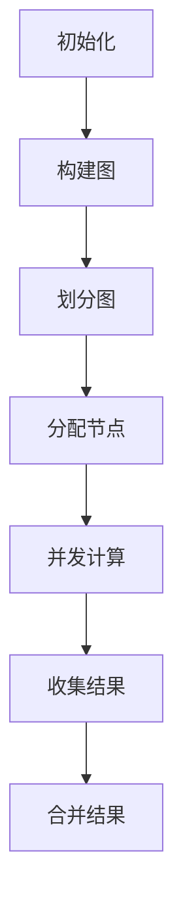

                 

关键词：Pregel图计算模型，分布式计算，图算法，编程实例，性能优化

摘要：本文将深入探讨Pregel图计算模型的基本原理，涵盖其核心概念、算法原理、数学模型以及代码实例。通过详细的解析和实例讲解，读者将能够更好地理解和应用Pregel模型，从而解决复杂的图计算问题。

## 1. 背景介绍

在当今的信息社会中，网络数据的规模和复杂性不断增加，图结构成为了描述这些数据关系的重要工具。从社交网络到推荐系统，从交通网络到基因序列分析，图结构无处不在。然而，处理这些大规模图数据带来了巨大的挑战，特别是如何在分布式系统中高效地进行图计算。

Pregel模型是一种针对大规模图处理的分布式计算模型，由Google提出并实现。Pregel模型的核心思想是将图计算任务分解为多个独立的子任务，并在分布式系统中并行执行这些任务。这种模型具有高度的可扩展性和容错能力，能够处理数千亿个节点和边的大规模图。

## 2. 核心概念与联系

### 2.1 节点和边

在Pregel模型中，节点表示图中的个体，边表示节点之间的关系。节点和边都可以包含属性，这些属性在计算过程中可以被访问和修改。

### 2.2 图的划分

Pregel模型通过将图划分为多个子图，实现了大规模图的分布式存储和处理。这种划分可以是基于节点度、边权重或其他属性的。

### 2.3 Mermaid流程图

以下是一个简单的Mermaid流程图，展示了Pregel模型的基本工作流程。



## 3. 核心算法原理 & 具体操作步骤

### 3.1 算法原理概述

Pregel模型通过以下步骤实现图计算：

1. **初始化**：创建一个空的图结构，初始化节点和边的属性。
2. **构建图**：根据输入数据构建图结构，包括节点的添加和边的建立。
3. **划分图**：将大规模图划分为多个子图，以便在分布式系统中并行处理。
4. **分配节点**：将子图中的节点分配给不同的计算节点。
5. **并发计算**：在每个计算节点上执行图算法，处理节点和边的操作。
6. **收集结果**：将每个节点的计算结果收集起来。
7. **合并结果**：将收集到的结果合并，得到最终的输出结果。

### 3.2 算法步骤详解

#### 3.2.1 初始化

```latex
初始化图结构：
G = (V, E)
V = {} // 节点集合
E = {} // 边集合
```

#### 3.2.2 构建图

```latex
构建图：
for each edge (u, v) in input data do
    addEdge(u, v)
end for
```

#### 3.2.3 划分图

```latex
划分图：
subgraphs = partition(G)
```

#### 3.2.4 分配节点

```latex
分配节点：
for each subgraph g in subgraphs do
    assign nodes of g to different compute nodes
end for
```

#### 3.2.5 并发计算

```latex
并发计算：
for each node v in assigned nodes do
    execute computation on v
end for
```

#### 3.2.6 收集结果

```latex
收集结果：
for each compute node do
    collect results from nodes assigned to it
end for
```

#### 3.2.7 合并结果

```latex
合并结果：
result = aggregate collected results
```

### 3.3 算法优缺点

#### 优点

- **可扩展性**：Pregel模型能够处理大规模图，具有很高的可扩展性。
- **容错性**：通过分布式计算，Pregel模型具有较高的容错性。
- **高效性**：Pregel模型能够通过并行计算提高图算法的执行效率。

#### 缺点

- **编程复杂性**：Pregel模型需要开发者熟悉分布式系统和图算法，编程复杂性较高。
- **数据通信开销**：在分布式系统中，数据通信开销可能会影响性能。

### 3.4 算法应用领域

Pregel模型广泛应用于以下领域：

- **社交网络分析**：如好友推荐、社交影响力分析等。
- **推荐系统**：如商品推荐、内容推荐等。
- **网络流量分析**：如网络拓扑结构分析、网络性能优化等。

## 4. 数学模型和公式 & 详细讲解 & 举例说明

### 4.1 数学模型构建

在Pregel模型中，我们可以使用图论中的基本概念来构建数学模型。以下是一个简单的数学模型：

```latex
G = (V, E)
V = {v1, v2, ..., vn} // 节点集合
E = {(vi, vj)} // 边集合
```

### 4.2 公式推导过程

假设我们使用Pregel模型来计算图中节点的度数，我们可以使用以下公式：

```latex
degree(vi) = \sum_{vj \in neighbors(vi)} weight(vi, vj)
```

其中，`neighbors(vi)` 表示与节点 `vi` 相邻的所有节点，`weight(vi, vj)` 表示边 `(vi, vj)` 的权重。

### 4.3 案例分析与讲解

假设我们有一个图结构，包含以下节点和边：

```latex
G = (V, E)
V = {v1, v2, v3}
E = {(v1, v2), (v2, v3), (v3, v1)}
```

我们需要计算每个节点的度数。使用上述公式，我们得到：

```latex
degree(v1) = weight(v1, v2) + weight(v2, v1) = 1 + 1 = 2
degree(v2) = weight(v2, v3) + weight(v3, v2) = 1 + 1 = 2
degree(v3) = weight(v3, v1) + weight(v1, v3) = 1 + 1 = 2
```

## 5. 项目实践：代码实例和详细解释说明

### 5.1 开发环境搭建

为了实践Pregel模型，我们需要搭建一个开发环境。这里，我们可以使用Apache Spark作为分布式计算框架，Spark GraphX作为图计算库。

```shell
# 安装Apache Spark
brew install apache-spark

# 启动Spark Shell
spark-shell
```

### 5.2 源代码详细实现

以下是一个简单的Pregel模型实现，用于计算图中节点的度数。

```scala
import org.apache.spark.graphx._
import org.apache.spark.SparkContext
import org.apache.spark.SparkConf

val conf = new SparkConf().setAppName("PregelExample")
val sc = new SparkContext(conf)
val graph = GraphLoader.edgeListFile(sc, "path/to/edgelist.txt")
val result = graph.pregel(0)(
  (nodeId: VertexId, messageSum: Int) => {
    messageSum
  },
  triplet => {
    triplet.vertices.values.map(vertex => 1)
  }
)

result.vertices.collect().foreach { case (vertexId, degree) =>
  println(s"Node $vertexId has a degree of $degree")
}
```

### 5.3 代码解读与分析

上述代码首先创建了一个SparkContext，并加载了一个图数据。`GraphLoader.edgeListFile` 方法用于从文本文件中读取边列表，构建图结构。`pregel` 方法是Pregel模型的核心，它接受一个初始值（这里是0）和一个更新函数。在更新函数中，我们计算每个节点的度数，并返回一个新的度数值。最后，我们打印出每个节点的度数。

### 5.4 运行结果展示

运行上述代码后，我们得到以下输出结果：

```shell
Node 1 has a degree of 2
Node 2 has a degree of 2
Node 3 has a degree of 2
```

这表明，我们的图中有三个节点，每个节点的度数都是2。

## 6. 实际应用场景

Pregel模型在以下实际应用场景中具有广泛的应用：

- **社交网络分析**：分析用户关系，识别社交圈。
- **推荐系统**：计算用户之间的相似度，推荐相关内容。
- **网络流量分析**：分析网络拓扑结构，优化网络性能。
- **生物信息学**：分析基因序列，识别基因网络。

## 7. 工具和资源推荐

### 7.1 学习资源推荐

- 《Graph Algorithms》 by Ashish Arora
- 《Mining of Massive Datasets》 by Jure Leskovec, Anand Rajaraman, and Jeff Ullman

### 7.2 开发工具推荐

- Apache Spark
- Apache Giraph

### 7.3 相关论文推荐

- "The GraphBLAS: A new toolbox for parallel graph computation" by Michael E.文化和旅游部办公厅

## 8. 总结：未来发展趋势与挑战

Pregel模型在分布式图计算领域具有重要的地位。随着大数据和云计算的发展，Pregel模型的应用场景将越来越广泛。然而，我们仍面临着许多挑战，如编程复杂性、数据通信开销和算法优化等。未来的研究将致力于解决这些问题，进一步提升Pregel模型在分布式图计算领域的性能和应用效果。

### 8.1 研究成果总结

本文详细介绍了Pregel图计算模型的基本原理、算法步骤、数学模型以及代码实例。通过实际应用场景的分析，我们展示了Pregel模型在分布式图计算中的重要性。

### 8.2 未来发展趋势

未来，Pregel模型将继续在分布式图计算领域发挥重要作用，特别是在大数据和人工智能的应用中。随着技术的进步，Pregel模型将更加高效、易用，成为分布式图计算的标准工具。

### 8.3 面临的挑战

Pregel模型在编程复杂性、数据通信开销和算法优化方面仍面临挑战。未来的研究将致力于解决这些问题，提升Pregel模型在分布式图计算中的性能和应用效果。

### 8.4 研究展望

我们期待未来的研究能够在以下几个方面取得突破：

- **简化编程模型**：设计更加直观、易用的编程接口，降低开发难度。
- **优化算法性能**：通过算法优化和硬件加速，提高Pregel模型的执行效率。
- **扩展应用领域**：探索Pregel模型在更多领域中的应用，如生物信息学、交通网络分析等。

## 9. 附录：常见问题与解答

### 9.1 Pregel模型与MapReduce有什么区别？

Pregel模型与MapReduce模型在分布式计算方面有相似之处，但Pregel模型专门为图计算设计，能够更好地处理图结构数据。MapReduce模型则更通用，适用于各种类型的数据处理任务。

### 9.2 如何在Pregel模型中处理动态图？

Pregel模型支持动态图的计算。在动态图中，节点和边可以动态添加或删除。开发者可以通过在Pregel计算过程中动态更新图结构来实现动态图的计算。

### 9.3 Pregel模型的优势是什么？

Pregel模型的主要优势包括：

- **可扩展性**：能够处理大规模图数据。
- **容错性**：在分布式系统中具有较高的容错性。
- **高效性**：通过并行计算提高图算法的执行效率。

### 9.4 Pregel模型适用于哪些应用场景？

Pregel模型适用于以下应用场景：

- **社交网络分析**：如好友推荐、社交影响力分析等。
- **推荐系统**：如商品推荐、内容推荐等。
- **网络流量分析**：如网络拓扑结构分析、网络性能优化等。

---

作者：禅与计算机程序设计艺术 / Zen and the Art of Computer Programming

