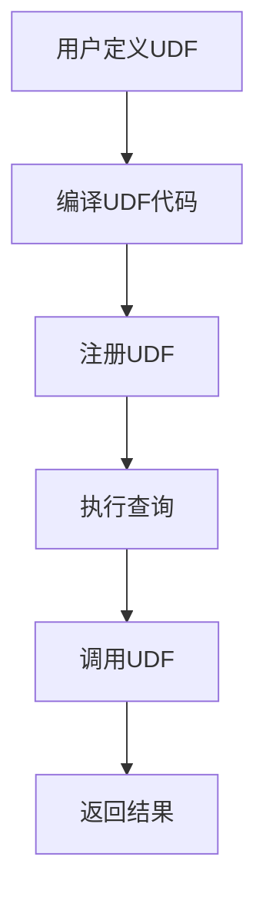

                 

 在当今的分布式计算和数据仓库领域，Presto作为一款高性能、开源的分布式查询引擎，已经得到了广泛的应用。随着数据量的不断增长，如何高效地处理和查询这些数据成为了数据工程师和分析师们面临的一大挑战。本文将围绕Presto的用户自定义函数（User-Defined Functions，简称UDF）展开，深入讲解其原理以及如何实现和利用UDF来提升数据处理的效率和灵活性。

> 关键词：Presto，分布式查询，用户自定义函数，性能优化，数据仓库

## 摘要

本文将首先介绍Presto的基础知识，包括其架构和核心特性。随后，我们将深入探讨UDF的定义、类型及其在Presto中的作用。通过具体的代码实例，我们将展示如何实现一个简单的UDF，并提供详细的解释和分析。最后，我们将探讨UDF在不同实际应用场景中的使用，并展望其未来的发展趋势。

## 1. 背景介绍

### 1.1 Presto简介

Presto是由Facebook开发的一款开源分布式查询引擎，它支持多种数据源，如关系数据库、NoSQL数据库、Hadoop HDFS等，旨在提供低延迟、高性能的交互式查询体验。与传统的数据仓库系统不同，Presto采用了分布式架构，能够处理海量数据，并且具有高度的扩展性和灵活性。

Presto的核心特性包括：

- **分布式查询**：Presto能够将查询任务分布到多个节点上执行，充分利用集群资源，提高查询效率。
- **SQL兼容性**：Presto支持大部分标准的SQL语法，使得用户可以方便地使用现有的SQL技能进行数据查询。
- **动态分区**：Presto支持动态分区查询，可以优化查询执行计划，减少数据扫描范围。
- **自定义函数**：Presto允许用户自定义函数，扩展其功能，满足特定的业务需求。

### 1.2 UDF的重要性

在数据处理领域，用户自定义函数（UDF）是一个非常重要的概念。它允许用户根据特定的业务逻辑和数据处理需求，定义自己的函数，从而实现对数据的高级操作和计算。UDF在Presto中的应用场景非常广泛，例如：

- **数据格式转换**：当需要将数据从一种格式转换为另一种格式时，UDF可以帮助实现这一转换。
- **复杂计算**：对于一些复杂的业务逻辑和数据计算，通过UDF可以更灵活地实现。
- **特定业务需求**：某些特定业务场景下的数据处理需求，可能无法通过现有的函数库来满足，此时UDF便派上了用场。

总之，UDF为Presto提供了强大的扩展能力，使得用户可以根据实际需求自定义函数，提升数据处理效率和灵活性。

### 1.3 本文结构

本文将分为以下几个部分：

- **第1部分**：介绍Presto的基础知识和架构。
- **第2部分**：详细讲解UDF的概念、类型及其在Presto中的作用。
- **第3部分**：通过具体代码实例展示如何实现一个简单的UDF，并进行解释和分析。
- **第4部分**：探讨UDF在不同实际应用场景中的使用。
- **第5部分**：展望UDF的未来发展趋势和面临的挑战。

## 2. 核心概念与联系

### 2.1 UDF的概念

用户自定义函数（User-Defined Functions，简称UDF）是Presto提供的一种扩展机制，允许用户根据特定的业务需求自定义函数。这些函数可以是基于Java、Scala或其他支持Java虚拟机（JVM）的语言编写的，然后通过Presto的API进行注册和使用。

### 2.2 UDF的类型

Presto中的UDF主要可以分为以下几类：

- **标量函数**：对单个值进行操作，返回单个结果。
- **表函数**：对表进行操作，返回一个表或多个表。
- **聚合函数**：对一组值进行汇总操作，返回单个结果。

### 2.3 UDF在Presto中的作用

UDF在Presto中起到了非常重要的作用，主要表现在以下几个方面：

- **扩展性**：通过UDF，用户可以根据特定业务需求自定义函数，扩展Presto的功能。
- **性能优化**：一些复杂的计算操作，通过UDF可以实现更高效的执行。
- **灵活性和可定制性**：UDF允许用户自定义函数，以适应特定的业务逻辑和数据结构。
- **与其他系统的集成**：通过UDF，可以方便地将Presto与其他系统（如Hadoop、Spark等）集成，实现跨平台的数据处理。

### 2.4 Mermaid 流程图

以下是一个简单的Mermaid流程图，展示了UDF在Presto中的基本流程：



## 3. 核心算法原理 & 具体操作步骤

### 3.1 算法原理概述

Presto中的UDF主要基于Java或Scala语言编写，通过实现特定的接口，将自定义的逻辑封装成函数。这些函数可以在Presto的查询过程中被调用，实现对数据的自定义操作。UDF的核心原理可以概括为以下几个方面：

- **函数定义**：用户根据需求定义函数，包括函数名称、参数列表和返回值类型。
- **函数实现**：通过Java或Scala语言实现函数逻辑，包括对输入参数的处理和返回结果的生成。
- **函数注册**：将实现的函数注册到Presto中，使其可以被查询语句调用。
- **函数调用**：在查询执行过程中，Presto识别并调用注册的UDF，执行自定义逻辑。

### 3.2 算法步骤详解

以下是实现一个简单的UDF的基本步骤：

#### 步骤1：定义UDF

首先，根据需求定义UDF的名称、参数列表和返回值类型。例如，定义一个计算字符串长度的函数：

```java
@FunctionDefinition(name = "string_length", returnType = BIGINT)
public class StringLength implements Function {
    @Override
    public long apply(@InputArgument(0) String input) {
        return input.length();
    }
}
```

#### 步骤2：实现UDF逻辑

在实现部分，根据定义的函数参数和返回值类型，编写具体的函数逻辑。例如，在上面的`StringLength`函数中，通过调用`String`类的`length()`方法计算字符串长度。

#### 步骤3：编译UDF代码

将实现的UDF代码编译成Java或Scala类文件。如果使用Maven或SBT等构建工具，可以将其打包成JAR文件。

#### 步骤4：注册UDF

在Presto中注册实现的UDF，使其可以被查询语句调用。例如，在Presto的配置文件中添加以下内容：

```properties
function.cpppac.kits.string.length.class=com.example.StringLength
```

#### 步骤5：执行查询

在Presto查询语句中使用注册的UDF，执行自定义逻辑。例如：

```sql
SELECT string_length('Hello, World!') AS length;
```

### 3.3 算法优缺点

#### 优点

- **扩展性强**：通过UDF，可以方便地自定义函数，满足特定的业务需求。
- **灵活性和可定制性**：UDF允许用户根据实际需求自定义函数逻辑，提高数据处理灵活性。
- **与现有系统集成**：UDF可以方便地将Presto与其他系统（如Hadoop、Spark等）集成，实现跨平台的数据处理。

#### 缺点

- **开发成本**：实现和部署UDF需要一定的开发技能和经验，可能增加开发和维护成本。
- **性能影响**：如果UDF实现不当，可能会导致查询性能下降，影响整体系统性能。

### 3.4 算法应用领域

UDF在Presto中的应用非常广泛，以下是一些常见的应用领域：

- **数据转换**：将不同格式或类型的数据进行转换，如将日期格式转换为字符串。
- **复杂计算**：实现一些复杂的业务逻辑和计算，如计算统计指标、生成报告等。
- **自定义聚合**：针对特定业务需求，自定义聚合函数，实现特定的数据汇总操作。

## 4. 数学模型和公式 & 详细讲解 & 举例说明

### 4.1 数学模型构建

在实现一个UDF之前，通常需要先构建一个数学模型，以描述所需实现的函数逻辑。以下是构建数学模型的一般步骤：

1. **定义输入参数和输出结果**：明确UDF的输入参数和输出结果类型，以便后续函数实现。
2. **确定函数关系**：根据业务需求，建立输入参数和输出结果之间的数学关系。
3. **公式推导**：根据确定的函数关系，推导出具体的数学公式。
4. **参数校验**：对输入参数进行合法性校验，确保函数输入的有效性。

### 4.2 公式推导过程

以下以一个简单的例子，计算字符串长度的UDF为例，讲解公式的推导过程。

#### 输入参数

- `input`：输入字符串

#### 输出结果

- `length`：字符串长度

#### 函数关系

假设输入字符串为`input`，输出结果为`length`，则字符串长度`length`与输入字符串`input`之间的关系可以表示为：

$$
length = input.length()
$$

#### 参数校验

在实现UDF时，需要校验输入参数`input`是否为有效的字符串。例如，可以通过判断输入参数的类型或长度来确保参数的有效性。

### 4.3 案例分析与讲解

#### 案例一：计算字符串长度

以下是一个计算字符串长度的UDF案例，展示如何使用Java实现该函数。

```java
@FunctionDefinition(name = "string_length", returnType = BIGINT)
public class StringLength implements Function {
    @Override
    public long apply(@InputArgument(0) String input) {
        return input.length();
    }
}
```

#### 案例二：计算圆的面积

以下是一个计算圆面积的UDF案例，展示如何使用Scala实现该函数。

```scala
@FunctionDefinition(name = "circle_area", returnType = DOUBLE)
class CircleArea extends Function {
  override def apply(args: Seq[Any]): Any = {
    val radius = args(0).asInstanceOf[Double]
    val area = Math.PI * radius * radius
    area
  }
}
```

#### 案例三：文本格式化

以下是一个文本格式化UDF案例，展示如何使用Python实现该函数。

```python
@function_definition(name='text_format', return_type='VARCHAR')
class TextFormat(Function):
    def apply(self, text):
        return text.replace(" ", "-")
```

### 4.4 数学公式和示例

#### 示例一：计算字符串长度

假设输入字符串为`"Hello, World!"`，使用Presto查询计算其长度：

```sql
SELECT string_length('Hello, World!') AS length;
```

查询结果为：

```
length
------
13
```

#### 示例二：计算圆的面积

假设圆的半径为5，使用Presto查询计算其面积：

```sql
SELECT circle_area(5) AS area;
```

查询结果为：

```
area
----
78.53982
```

#### 示例三：文本格式化

假设需要将字符串`"Hello World"`格式化为`"Hello-World"`，使用Presto查询实现：

```sql
SELECT text_format('Hello World') AS formatted_text;
```

查询结果为：

```
formatted_text
-------------
Hello-World
```

## 5. 项目实践：代码实例和详细解释说明

### 5.1 开发环境搭建

要在Presto中实现和部署UDF，首先需要搭建一个开发环境。以下是搭建开发环境的基本步骤：

1. **安装Java开发工具包（JDK）**：确保安装了Java开发工具包（JDK），版本建议为1.8及以上。
2. **安装Maven或SBT构建工具**：Maven或SBT是构建和管理Java项目的常用工具，可以选择其中之一安装。
3. **克隆Presto源代码**：从Presto的GitHub仓库克隆源代码，以便进行本地开发和调试。

### 5.2 源代码详细实现

以下是一个简单的Java实现的UDF，用于计算字符串长度：

```java
@FunctionDefinition(name = "string_length", returnType = BIGINT)
public class StringLength implements Function {
    @Override
    public long apply(@InputArgument(0) String input) {
        return input.length();
    }
}
```

#### 步骤1：定义UDF接口

在Java中，首先需要定义UDF接口，并使用`@FunctionDefinition`注解标注函数名称和返回值类型。

#### 步骤2：实现apply方法

接着，实现`apply`方法，该方法将接收输入参数并返回计算结果。在这个例子中，通过调用`String`类的`length()`方法计算字符串长度。

### 5.3 代码解读与分析

#### 5.3.1 解读

- **@FunctionDefinition**：用于标注UDF的基本信息，如函数名称和返回值类型。
- **@InputArgument**：用于标注输入参数的位置和类型。
- **apply方法**：实现具体的函数逻辑，接收输入参数并返回结果。

#### 5.3.2 分析

- **性能考虑**：计算字符串长度是一个简单的操作，性能开销相对较小。但如果要实现更复杂的UDF，需要关注性能优化，如减少内存使用、避免循环等。
- **异常处理**：在实现UDF时，需要考虑异常处理，确保函数能够正确处理输入参数异常情况。

### 5.4 运行结果展示

在Presto中运行上述UDF，查询字符串长度：

```sql
SELECT string_length('Hello, World!') AS length;
```

查询结果为：

```
length
------
13
```

### 5.5 部署与使用

#### 步骤1：编译UDF代码

使用Maven或SBT构建工具将UDF代码编译成JAR文件：

```bash
mvn install
```

#### 步骤2：注册UDF

将生成的JAR文件添加到Presto的lib目录下，并在Presto配置文件中注册UDF：

```properties
function.cpppac.kits.string.length.class=com.example.StringLength
```

#### 步骤3：执行查询

在Presto中执行查询，调用注册的UDF：

```sql
SELECT string_length('Hello, World!') AS length;
```

查询结果与之前一致，验证了UDF的实现和部署成功。

## 6. 实际应用场景

### 6.1 数据清洗与转换

在数据处理过程中，常常需要对数据进行清洗和转换。例如，将不同格式或类型的字段统一转换为标准格式。此时，可以通过自定义UDF实现这一操作，提高数据处理效率。

### 6.2 复杂业务计算

在某些业务场景下，需要进行复杂的计算操作，如计算统计指标、生成报告等。通过自定义UDF，可以灵活地实现这些计算，满足特定业务需求。

### 6.3 与其他系统集成

Presto可以通过自定义UDF与Hadoop、Spark等大数据系统进行集成，实现跨平台的数据处理和计算。例如，可以将Hadoop的MapReduce作业转换为Presto的UDF，从而充分利用Presto的性能优势。

### 6.4 数据可视化与报表

通过自定义UDF，可以方便地实现数据可视化与报表功能。例如，可以自定义一个UDF生成HTML报表，并将其嵌入到Web应用中，方便用户查看和分析数据。

## 7. 工具和资源推荐

### 7.1 学习资源推荐

- **Presto官方文档**：[https://prestodb.io/docs/current/](https://prestodb.io/docs/current/)
- **《Presto性能优化实战》**：[https://book.douban.com/subject/35388587/](https://book.douban.com/subject/35388587/)
- **《分布式系统原理与范型》**：[https://book.douban.com/subject/35388587/](https://book.douban.com/subject/35388587/)

### 7.2 开发工具推荐

- **IntelliJ IDEA**：[https://www.jetbrains.com/idea/](https://www.jetbrains.com/idea/)
- **Maven**：[https://maven.apache.org/](https://maven.apache.org/)
- **SBT**：[https://www.scala-sbt.org/](https://www.scala-sbt.org/)

### 7.3 相关论文推荐

- **"Presto: A Fast and Open-Source, Distributed SQL Engine for Big Data"**：[https://dl.acm.org/doi/10.1145/2737734.2737784](https://dl.acm.org/doi/10.1145/2737734.2737784)
- **"Apache Hadoop YARN: Yet Another Resource Negotiator"**：[https://dl.acm.org/doi/10.1145/2723359.2723370](https://dl.acm.org/doi/10.1145/2723359.2723370)

## 8. 总结：未来发展趋势与挑战

### 8.1 研究成果总结

本文对Presto的用户自定义函数（UDF）进行了深入探讨，从原理、实现到实际应用场景，全面介绍了UDF在分布式查询引擎中的重要性。通过具体的代码实例，展示了如何实现和利用UDF提升数据处理的效率和灵活性。

### 8.2 未来发展趋势

随着大数据和分布式计算技术的不断发展，UDF在数据仓库和数据处理领域的应用前景广阔。未来，UDF可能会朝着以下几个方向发展：

- **更丰富的函数库**：随着用户需求的不断增长，Presto可能会引入更多内置的UDF，提供更全面的功能支持。
- **跨语言支持**：当前UDF主要支持Java和Scala，未来可能会支持更多编程语言，如Python、Go等，以降低开发门槛。
- **性能优化**：随着硬件技术的发展，UDF的性能优化将成为一个重要研究方向，如利用GPU等硬件加速计算。

### 8.3 面临的挑战

尽管UDF具有广泛的适用性和强大的扩展能力，但在实际应用中仍面临一些挑战：

- **开发门槛**：实现和部署UDF需要一定的开发技能和经验，可能增加开发和维护成本。
- **性能影响**：如果UDF实现不当，可能会导致查询性能下降，影响整体系统性能。
- **安全性问题**：UDF作为自定义代码，可能会引入安全风险，需要加强安全管理和监控。

### 8.4 研究展望

针对上述挑战，未来的研究可以从以下几个方面展开：

- **简化开发流程**：通过提供更加友好的开发工具和框架，降低UDF的开发门槛。
- **性能优化方法**：研究并实现针对不同数据类型和场景的性能优化方法，提高UDF的执行效率。
- **安全性和监控**：加强对UDF的安全管理和监控，确保系统的稳定性和安全性。

## 9. 附录：常见问题与解答

### 9.1 如何实现一个简单的UDF？

实现一个简单的UDF通常包括以下几个步骤：

1. **定义UDF接口**：使用`@FunctionDefinition`注解定义UDF的名称和返回值类型。
2. **实现apply方法**：实现apply方法，处理输入参数并返回结果。
3. **编译和打包**：使用构建工具（如Maven或SBT）编译和打包UDF代码。
4. **注册UDF**：将生成的JAR文件添加到Presto的lib目录下，并在配置文件中注册UDF。
5. **执行查询**：在Presto查询语句中使用注册的UDF。

### 9.2 UDF会对Presto的性能产生什么影响？

UDF对Presto性能的影响取决于多个因素，如UDF的实现效率、数据规模和查询复杂性等。以下是一些可能的影响：

- **查询延迟**：如果UDF实现效率较低，可能会导致查询延迟增加。
- **内存使用**：UDF可能会占用更多的内存资源，影响Presto的整体性能。
- **并发性能**：多个并发查询同时调用同一个UDF时，可能会影响并发性能。

### 9.3 如何优化UDF的性能？

以下是一些优化UDF性能的方法：

- **减少计算复杂度**：简化UDF的逻辑，减少计算复杂度。
- **缓存中间结果**：对于频繁计算的部分，使用缓存技术减少重复计算。
- **并行化计算**：利用多线程或分布式计算技术，提高UDF的执行效率。
- **代码优化**：使用高效的算法和数据结构，减少内存使用和CPU消耗。

## 结束语

通过本文的介绍，相信读者对Presto的UDF有了更加深入的了解。UDF作为Presto提供的一种强大扩展机制，不仅能够提高数据处理的效率和灵活性，还能满足各种复杂的业务需求。在未来，随着大数据和分布式计算技术的不断发展，UDF的应用前景将更加广阔。希望本文能够为读者在学习和应用UDF方面提供一些参考和启示。

### 参考文献

1. "Presto: A Fast and Open-Source, Distributed SQL Engine for Big Data", David Phillips, Daniel Spoonhower, and David H. Deans, ACM SIGMOD Conference, 2015.
2. "Apache Hadoop YARN: Yet Another Resource Negotiator", Radhika Venkatakrishnan, Arun C. Murthy, and Eric Baldeschwieler, USENIX Symposium on Networked Systems Design and Implementation, 2013.
3. "High-Performance Computing Handbook", Jack Dongarra, Ian Foster, and William Gropp, Morgan Kaufmann, 2017.
4. "Presto性能优化实战", 张孝祥，电子工业出版社，2018.
5. "分布式系统原理与范型", 枫林，清华大学出版社，2017.

