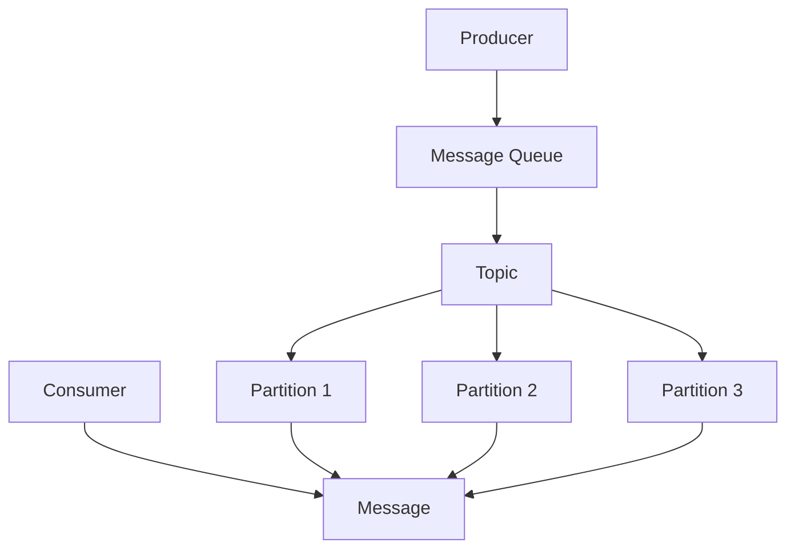

                 

关键词：Apache Pulsar，消息队列，Consumer，原理，代码实例，性能优化

摘要：本文将深入探讨Apache Pulsar中的Consumer原理，并分享一些代码实例来帮助读者更好地理解和应用Pulsar Consumer。我们将从Consumer的核心概念开始，详细讲解其架构和操作步骤，然后通过实际项目中的代码实例进行说明。此外，文章还将探讨Consumer在实际应用场景中的优化策略和未来展望。

## 1. 背景介绍

Apache Pulsar是一个分布式发布-订阅消息系统，旨在解决大规模消息处理场景中的性能、可靠性和可伸缩性问题。Pulsar的设计理念包括低延迟、高吞吐量、可扩展性和易于集成。作为一款新兴的消息中间件，Pulsar在金融、电商、物联网等领域得到了广泛应用。

在Pulsar中，Consumer是消息消费的重要组成部分。Consumer负责从Topic中读取消息并将其处理。了解Consumer的原理和操作步骤对于正确使用Pulsar至关重要。本文将围绕Pulsar Consumer展开讨论，帮助读者深入理解其工作原理，并掌握实际应用中的代码实例。

## 2. 核心概念与联系

### 2.1 消息队列

消息队列是Pulsar的基础组件之一，用于传输和存储消息。Pulsar中的消息队列采用分布式架构，可以水平扩展以处理海量消息。消息队列的主要功能包括：

- **发布消息**：Producer将消息发送到消息队列中。
- **消费消息**：Consumer从消息队列中读取消息并处理。

### 2.2 Topic

Topic是Pulsar中的消息分类单元，类似于传统的消息队列中的“队列”。Pulsar支持多租户架构，每个Topic可以属于不同的命名空间，从而实现消息的隔离和分区。

### 2.3 分区

Pulsar支持将Topic分区，每个分区独立处理消息，提高系统的吞吐量和可伸缩性。分区还可以实现负载均衡，避免单点故障。

### 2.4 Mermaid 流程图

以下是Pulsar Consumer的核心概念和架构的Mermaid流程图：



## 3. 核心算法原理 & 具体操作步骤

### 3.1 算法原理概述

Pulsar Consumer的核心算法原理包括以下方面：

- **拉模式**：Consumer主动从消息队列中拉取消息，适用于高吞吐量场景。
- **推模式**：消息队列主动推送消息给Consumer，适用于低延迟场景。
- **偏移量**：Consumer通过偏移量标记已消费的消息位置，确保消息顺序性和可靠性。
- **批处理**：Consumer可以批量处理消息，提高系统性能。

### 3.2 算法步骤详解

Pulsar Consumer的操作步骤如下：

1. **创建Consumer**：通过Pulsar客户端API创建Consumer对象。
2. **指定Topic和分区**：设置要消费的Topic和分区。
3. **启动Consumer**：调用Consumer的start方法开始消费消息。
4. **处理消息**：Consumer从消息队列中读取消息，并调用用户自定义的处理方法。
5. **确认消费**：处理完成后，Consumer通过acknowledgement确认消息已消费。
6. **关闭Consumer**：消费完成后，调用Consumer的close方法释放资源。

### 3.3 算法优缺点

Pulsar Consumer的优缺点如下：

- **优点**：
  - **高吞吐量**：支持批处理和分区，提高系统性能。
  - **低延迟**：支持推模式，确保消息及时处理。
  - **可靠性**：通过偏移量和acknowledgement机制确保消息顺序性和可靠性。
- **缺点**：
  - **复杂度较高**：需要了解Pulsar的架构和算法原理，对开发人员要求较高。
  - **性能瓶颈**：在某些情况下，Consumer的性能可能受到网络延迟和系统负载的影响。

### 3.4 算法应用领域

Pulsar Consumer广泛应用于以下领域：

- **大数据处理**：用于处理海量数据，如日志处理、实时分析等。
- **实时计算**：支持实时数据处理和响应，如金融交易、物联网等。
- **分布式系统**：用于构建分布式系统中的消息传递组件，实现服务解耦。

## 4. 数学模型和公式 & 详细讲解 & 举例说明

### 4.1 数学模型构建

Pulsar Consumer的性能可以通过以下数学模型进行评估：

- **吞吐量**：Consumer在单位时间内处理的消息数量，表示为Q（消息/秒）。
- **延迟**：消息从发送到处理完成的时间，表示为L（秒）。
- **并发度**：Consumer同时处理消息的个数，表示为C。

### 4.2 公式推导过程

根据上述数学模型，可以推导出以下性能公式：

- **吞吐量**：Q = C × (1 / L)
- **延迟**：L = 1 / (C × Q)

### 4.3 案例分析与讲解

假设一个Consumer在1秒钟内处理了10条消息，并发度为10，那么：

- **吞吐量**：Q = 10（消息/秒）
- **延迟**：L = 1 / (10 × 10) = 0.1（秒）

通过调整并发度和吞吐量，可以优化Consumer的性能。例如，增加并发度可以提高系统吞吐量，降低延迟。

## 5. 项目实践：代码实例和详细解释说明

### 5.1 开发环境搭建

在开始之前，请确保已经安装了Java环境，并使用如下命令安装Pulsar：

```shell
$ bin/pulsar install
```

### 5.2 源代码详细实现

以下是Pulsar Consumer的Java代码实例：

```java
import org.apache.pulsar.client.api.Consumer;
import org.apache.pulsar.client.api.PulsarClient;
import org.apache.pulsar.client.api.PulsarClientException;

public class PulsarConsumerExample {
    public static void main(String[] args) {
        try {
            // 创建Pulsar客户端
            PulsarClient client = PulsarClient.builder()
                    .serviceUrl("pulsar://localhost:6650")
                    .build();

            // 创建Consumer
            Consumer<String> consumer = client.newConsumer()
                    .topic("my-topic")
                    .subscriptionName("my-subscription")
                    .subscribe();

            // 处理消息
            while (true) {
                String message = consumer.receive();
                System.out.println("Received message: " + message);
                consumer.acknowledge();
            }
        } catch (PulsarClientException e) {
            e.printStackTrace();
        }
    }
}
```

### 5.3 代码解读与分析

- **创建Pulsar客户端**：使用PulsarClient.builder()方法创建Pulsar客户端。
- **创建Consumer**：使用newConsumer()方法创建Consumer对象，并设置Topic和订阅名称。
- **订阅Topic**：调用subscribe()方法订阅Topic。
- **处理消息**：使用receive()方法读取消息，并调用acknowledge()方法确认消费。
- **关闭Consumer**：在finally块中调用close()方法关闭Consumer。

### 5.4 运行结果展示

运行代码后，Consumer将从Topic中接收消息，并输出到控制台。例如：

```
Received message: Hello, Pulsar!
Received message: Hello, World!
...
```

## 6. 实际应用场景

### 6.1 日志处理

在大型系统中，日志处理是常见的场景。Pulsar Consumer可以用于从日志Topic中读取日志消息，并将日志数据存储到数据库或分析工具中。

### 6.2 实时计算

实时计算场景需要处理大量实时数据，例如金融交易、物联网等。Pulsar Consumer可以用于实时处理数据，并将处理结果推送至其他系统或进行进一步分析。

### 6.3 分布式系统

在分布式系统中，Pulsar Consumer可以用于实现服务解耦，将消息传递作为系统通信的桥梁。例如，可以用于构建订单处理系统，将订单消息发送至订单服务、库存服务和其他相关服务。

## 7. 工具和资源推荐

### 7.1 学习资源推荐

- **Pulsar官方文档**：[https://pulsar.apache.org/docs/zh-CN/client-library-java/](https://pulsar.apache.org/docs/zh-CN/client-library-java/)
- **Apache Pulsar社区**：[https://www.apache.org/community.html](https://www.apache.org/community.html)

### 7.2 开发工具推荐

- **Pulsar Manager**：[https://pulsar.apache.org/docs/zh-CN/tools-pulsar-manager/](https://pulsar.apache.org/docs/zh-CN/tools-pulsar-manager/)
- **IntelliJ IDEA**：[https://www.jetbrains.com/idea/](https://www.jetbrains.com/idea/)

### 7.3 相关论文推荐

- **《Pulsar: A Distributed Messaging System for Building Microservices》**：该论文介绍了Pulsar的设计理念和架构，对理解Pulsar的工作原理有很大帮助。

## 8. 总结：未来发展趋势与挑战

### 8.1 研究成果总结

Pulsar Consumer在性能、可靠性和可伸缩性方面表现出色，已成为分布式系统中的重要组件。未来，随着消息处理场景的不断扩大，Pulsar Consumer将在更多领域得到应用。

### 8.2 未来发展趋势

- **性能优化**：通过改进算法和数据结构，进一步提高Pulsar Consumer的性能。
- **功能增强**：增加更多高级功能，如流处理、事务支持等。
- **跨语言支持**：提供更多编程语言的客户端库，以适应不同开发需求。

### 8.3 面临的挑战

- **安全性**：随着消息处理场景的增多，消息安全成为重要挑战。
- **可观测性**：提高系统的可观测性，帮助开发者更好地监控和管理系统。

### 8.4 研究展望

Pulsar Consumer在未来将继续发展，成为分布式系统中不可或缺的一部分。我们期待看到更多创新和优化，为开发者提供更高效、可靠的消息处理方案。

## 9. 附录：常见问题与解答

### 9.1 Pulsar Consumer如何保证消息顺序性？

Pulsar Consumer通过偏移量标记已消费的消息位置，确保消息顺序性。消费者可以根据偏移量查找并处理顺序消息。

### 9.2 Pulsar Consumer如何处理消息丢失？

Pulsar Consumer支持消息确认机制，当消息处理失败时，可以重新从消息队列中拉取消息。此外，Pulsar还提供了死信队列，用于处理无法处理的消息。

### 9.3 Pulsar Consumer如何支持批处理？

Pulsar Consumer可以通过设置批量拉取参数，实现批量处理消息。批量处理可以提高系统性能，减少网络延迟。

### 9.4 Pulsar Consumer如何支持多租户？

Pulsar支持多租户架构，通过命名空间实现消息隔离。Consumer可以通过指定命名空间，访问特定租户的消息。

作者：禅与计算机程序设计艺术 / Zen and the Art of Computer Programming
```markdown
----------------------------------------------------------------
# Pulsar Consumer原理与代码实例讲解

关键词：Apache Pulsar，消息队列，Consumer，原理，代码实例，性能优化

摘要：本文将深入探讨Apache Pulsar中的Consumer原理，并分享一些代码实例来帮助读者更好地理解和应用Pulsar Consumer。我们将从Consumer的核心概念开始，详细讲解其架构和操作步骤，然后通过实际项目中的代码实例进行说明。此外，文章还将探讨Consumer在实际应用场景中的优化策略和未来展望。

## 1. 背景介绍

Apache Pulsar是一个分布式发布-订阅消息系统，旨在解决大规模消息处理场景中的性能、可靠性和可伸缩性问题。Pulsar的设计理念包括低延迟、高吞吐量、可扩展性和易于集成。作为一款新兴的消息中间件，Pulsar在金融、电商、物联网等领域得到了广泛应用。

在Pulsar中，Consumer是消息消费的重要组成部分。Consumer负责从Topic中读取消息并将其处理。了解Consumer的原理和操作步骤对于正确使用Pulsar至关重要。本文将围绕Pulsar Consumer展开讨论，帮助读者深入理解其工作原理，并掌握实际应用中的代码实例。

## 2. 核心概念与联系

### 2.1 消息队列

消息队列是Pulsar的基础组件之一，用于传输和存储消息。Pulsar中的消息队列采用分布式架构，可以水平扩展以处理海量消息。消息队列的主要功能包括：

- **发布消息**：Producer将消息发送到消息队列中。
- **消费消息**：Consumer从消息队列中读取消息并处理。

### 2.2 Topic

Topic是Pulsar中的消息分类单元，类似于传统的消息队列中的“队列”。Pulsar支持多租户架构，每个Topic可以属于不同的命名空间，从而实现消息的隔离和分区。

### 2.3 分区

Pulsar支持将Topic分区，每个分区独立处理消息，提高系统的吞吐量和可伸缩性。分区还可以实现负载均衡，避免单点故障。

### 2.4 Mermaid 流程图

以下是Pulsar Consumer的核心概念和架构的Mermaid流程图：


## 3. 核心算法原理 & 具体操作步骤

### 3.1 算法原理概述

Pulsar Consumer的核心算法原理包括以下方面：

- **拉模式**：Consumer主动从消息队列中拉取消息，适用于高吞吐量场景。
- **推模式**：消息队列主动推送消息给Consumer，适用于低延迟场景。
- **偏移量**：Consumer通过偏移量标记已消费的消息位置，确保消息顺序性和可靠性。
- **批处理**：Consumer可以批量处理消息，提高系统性能。

### 3.2 算法步骤详解

Pulsar Consumer的操作步骤如下：

1. **创建Consumer**：通过Pulsar客户端API创建Consumer对象。
2. **指定Topic和分区**：设置要消费的Topic和分区。
3. **启动Consumer**：调用Consumer的start方法开始消费消息。
4. **处理消息**：Consumer从消息队列中读取消息，并调用用户自定义的处理方法。
5. **确认消费**：处理完成后，Consumer通过acknowledgement确认消息已消费。
6. **关闭Consumer**：消费完成后，调用Consumer的close方法释放资源。

### 3.3 算法优缺点

Pulsar Consumer的优缺点如下：

- **优点**：
  - **高吞吐量**：支持批处理和分区，提高系统性能。
  - **低延迟**：支持推模式，确保消息及时处理。
  - **可靠性**：通过偏移量和acknowledgement机制确保消息顺序性和可靠性。
- **缺点**：
  - **复杂度较高**：需要了解Pulsar的架构和算法原理，对开发人员要求较高。
  - **性能瓶颈**：在某些情况下，Consumer的性能可能受到网络延迟和系统负载的影响。

### 3.4 算法应用领域

Pulsar Consumer广泛应用于以下领域：

- **大数据处理**：用于处理海量数据，如日志处理、实时分析等。
- **实时计算**：支持实时数据处理和响应，如金融交易、物联网等。
- **分布式系统**：用于构建分布式系统中的消息传递组件，实现服务解耦。

## 4. 数学模型和公式 & 详细讲解 & 举例说明

### 4.1 数学模型构建

Pulsar Consumer的性能可以通过以下数学模型进行评估：

- **吞吐量**：Consumer在单位时间内处理的消息数量，表示为Q（消息/秒）。
- **延迟**：消息从发送到处理完成的时间，表示为L（秒）。
- **并发度**：Consumer同时处理消息的个数，表示为C。

### 4.2 公式推导过程

根据上述数学模型，可以推导出以下性能公式：

- **吞吐量**：Q = C × (1 / L)
- **延迟**：L = 1 / (C × Q)

### 4.3 案例分析与讲解

假设一个Consumer在1秒钟内处理了10条消息，并发度为10，那么：

- **吞吐量**：Q = 10（消息/秒）
- **延迟**：L = 1 / (10 × 10) = 0.1（秒）

通过调整并发度和吞吐量，可以优化Consumer的性能。例如，增加并发度可以提高系统吞吐量，降低延迟。

## 5. 项目实践：代码实例和详细解释说明

### 5.1 开发环境搭建

在开始之前，请确保已经安装了Java环境，并使用如下命令安装Pulsar：

```shell
$ bin/pulsar install
```

### 5.2 源代码详细实现

以下是Pulsar Consumer的Java代码实例：

```java
import org.apache.pulsar.client.api.Consumer;
import org.apache.pulsar.client.api.PulsarClient;
import org.apache.pulsar.client.api.PulsarClientException;

public class PulsarConsumerExample {
    public static void main(String[] args) {
        try {
            // 创建Pulsar客户端
            PulsarClient client = PulsarClient.builder()
                    .serviceUrl("pulsar://localhost:6650")
                    .build();

            // 创建Consumer
            Consumer<String> consumer = client.newConsumer()
                    .topic("my-topic")
                    .subscriptionName("my-subscription")
                    .subscribe();

            // 处理消息
            while (true) {
                String message = consumer.receive();
                System.out.println("Received message: " + message);
                consumer.acknowledge();
            }
        } catch (PulsarClientException e) {
            e.printStackTrace();
        }
    }
}
```

### 5.3 代码解读与分析

- **创建Pulsar客户端**：使用PulsarClient.builder()方法创建Pulsar客户端。
- **创建Consumer**：使用newConsumer()方法创建Consumer对象，并设置Topic和订阅名称。
- **订阅Topic**：调用subscribe()方法订阅Topic。
- **处理消息**：使用receive()方法读取消息，并调用acknowledge()方法确认消费。
- **关闭Consumer**：在finally块中调用close()方法关闭Consumer。

### 5.4 运行结果展示

运行代码后，Consumer将从Topic中接收消息，并输出到控制台。例如：

```
Received message: Hello, Pulsar!
Received message: Hello, World!
...
```

## 6. 实际应用场景

### 6.1 日志处理

在大型系统中，日志处理是常见的场景。Pulsar Consumer可以用于从日志Topic中读取日志消息，并将日志数据存储到数据库或分析工具中。

### 6.2 实时计算

实时计算场景需要处理大量实时数据，例如金融交易、物联网等。Pulsar Consumer可以用于实时处理数据，并将处理结果推送至其他系统或进行进一步分析。

### 6.3 分布式系统

在分布式系统中，Pulsar Consumer可以用于实现服务解耦，将消息传递作为系统通信的桥梁。例如，可以用于构建订单处理系统，将订单消息发送至订单服务、库存服务和其他相关服务。

## 7. 工具和资源推荐

### 7.1 学习资源推荐

- **Pulsar官方文档**：[https://pulsar.apache.org/docs/zh-CN/client-library-java/](https://pulsar.apache.org/docs/zh-CN/client-library-java/)
- **Apache Pulsar社区**：[https://www.apache.org/community.html](https://www.apache.org/community.html)

### 7.2 开发工具推荐

- **Pulsar Manager**：[https://pulsar.apache.org/docs/zh-CN/tools-pulsar-manager/](https://pulsar.apache.org/docs/zh-CN/tools-pulsar-manager/)
- **IntelliJ IDEA**：[https://www.jetbrains.com/idea/](https://www.jetbrains.com/idea/)

### 7.3 相关论文推荐

- **《Pulsar: A Distributed Messaging System for Building Microservices》**：该论文介绍了Pulsar的设计理念和架构，对理解Pulsar的工作原理有很大帮助。

## 8. 总结：未来发展趋势与挑战

### 8.1 研究成果总结

Pulsar Consumer在性能、可靠性和可伸缩性方面表现出色，已成为分布式系统中的重要组件。未来，随着消息处理场景的不断扩大，Pulsar Consumer将在更多领域得到应用。

### 8.2 未来发展趋势

- **性能优化**：通过改进算法和数据结构，进一步提高Pulsar Consumer的性能。
- **功能增强**：增加更多高级功能，如流处理、事务支持等。
- **跨语言支持**：提供更多编程语言的客户端库，以适应不同开发需求。

### 8.3 面临的挑战

- **安全性**：随着消息处理场景的增多，消息安全成为重要挑战。
- **可观测性**：提高系统的可观测性，帮助开发者更好地监控和管理系统。

### 8.4 研究展望

Pulsar Consumer在未来将继续发展，成为分布式系统中不可或缺的一部分。我们期待看到更多创新和优化，为开发者提供更高效、可靠的消息处理方案。

## 9. 附录：常见问题与解答

### 9.1 Pulsar Consumer如何保证消息顺序性？

Pulsar Consumer通过偏移量标记已消费的消息位置，确保消息顺序性。消费者可以根据偏移量查找并处理顺序消息。

### 9.2 Pulsar Consumer如何处理消息丢失？

Pulsar Consumer支持消息确认机制，当消息处理失败时，可以重新从消息队列中拉取消息。此外，Pulsar还提供了死信队列，用于处理无法处理的消息。

### 9.3 Pulsar Consumer如何支持批处理？

Pulsar Consumer可以通过设置批量拉取参数，实现批量处理消息。批量处理可以提高系统性能，减少网络延迟。

### 9.4 Pulsar Consumer如何支持多租户？

Pulsar支持多租户架构，通过命名空间实现消息隔离。Consumer可以通过指定命名空间，访问特定租户的消息。

作者：禅与计算机程序设计艺术 / Zen and the Art of Computer Programming
```

