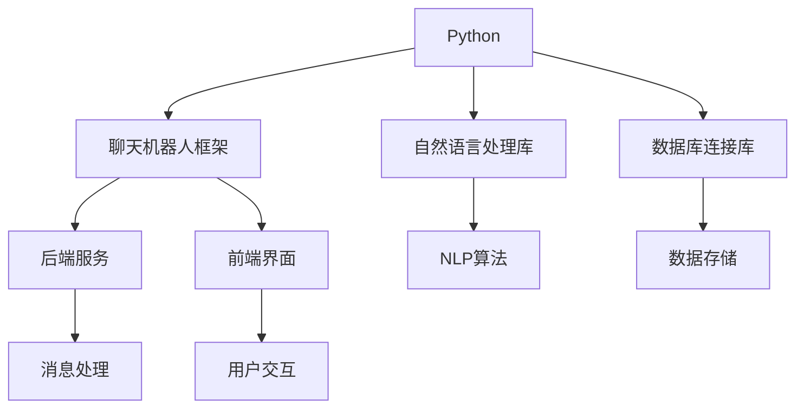

                 

在当前的科技时代，聊天机器人已经成为企业与用户互动的重要工具。选择合适的编程语言对于构建高效、可扩展的聊天机器人至关重要。本文将深入探讨Python和C++这两种编程语言在聊天机器人开发中的优缺点，帮助开发者做出明智的选择。

## 关键词
- 聊天机器人
- 开发语言
- Python
- C++
- 性能
- 可维护性
- 生态系统

## 摘要
本文通过对比Python和C++在聊天机器人开发中的应用，分析了两种语言在性能、可维护性、生态系统等方面的优劣。文章旨在为开发者提供有价值的参考，以选择最适合其项目的编程语言。

## 1. 背景介绍

聊天机器人技术近年来取得了显著的发展，从简单的文本聊天到具有复杂语义理解的智能对话系统，应用场景涵盖了客户服务、智能家居、在线教育等多个领域。随着用户对交互体验的要求不断提高，开发高性能、可扩展的聊天机器人成为当务之急。

Python和C++作为两种广泛使用的编程语言，在聊天机器人开发中各自拥有一定的优势。Python以其简洁易用的语法和丰富的库支持，成为初学者和快速开发的首选语言；而C++则以其高效、低级的特点，在性能敏感的场景中占据重要地位。本文将详细分析这两种语言在聊天机器人开发中的表现，帮助开发者做出最佳选择。

## 2. 核心概念与联系

为了更好地理解Python和C++在聊天机器人开发中的应用，首先需要了解一些核心概念。

### 2.1 Python

Python是一种高级编程语言，以其简洁、易读的语法著称。它支持多种编程范式，如面向对象、函数式编程和命令式编程。Python的生态系统非常丰富，提供了大量的库和框架，使得开发者可以快速搭建聊天机器人。

### 2.2 C++

C++是一种多范式、多编译器的高级编程语言，具有高性能、强类型和面向对象的特点。C++广泛应用于操作系统、嵌入式系统、游戏开发等领域，其强大的性能和灵活性使其成为构建高性能聊天机器人的理想选择。

### 2.3 Mermaid 流程图

下面是一个简单的Mermaid流程图，展示了Python和C++在聊天机器人开发中的核心概念和联系。



## 3. 核心算法原理 & 具体操作步骤

### 3.1 算法原理概述

聊天机器人的核心算法主要包括自然语言处理（NLP）和对话管理。NLP负责理解和生成自然语言文本，对话管理则负责控制对话流程，确保聊天机器人的回答符合用户的意图。

### 3.2 算法步骤详解

1. **文本预处理**：包括分词、词性标注、去除停用词等。
2. **意图识别**：利用NLP算法对用户的输入进行意图识别，确定用户的需求。
3. **实体提取**：从用户的输入中提取关键信息，如时间、地点、人物等。
4. **对话管理**：根据用户的意图和上下文信息，生成合适的回答。
5. **回复生成**：将对话管理生成的回答转换为自然语言文本。

### 3.3 算法优缺点

- **Python**：
  - 优点：语法简洁，易于学习；丰富的库支持，如NLTK、spaCy等；适合快速开发和原型设计。
  - 缺点：性能相对较低，不适合对性能要求极高的场景。

- **C++**：
  - 优点：高性能，适合对性能要求极高的场景；强类型，安全性较高。
  - 缺点：语法复杂，学习曲线较陡峭；库支持相对较少，需要开发者自行实现很多功能。

### 3.4 算法应用领域

- **Python**：广泛应用于Web开发、数据分析、机器学习等领域。
- **C++**：广泛应用于操作系统、游戏开发、高性能计算等领域。

## 4. 数学模型和公式 & 详细讲解 & 举例说明

聊天机器人的核心算法涉及多种数学模型，如决策树、神经网络等。以下是一个简单的数学模型示例：

### 4.1 数学模型构建

假设我们使用决策树进行意图识别，每个节点表示一个特征，每个分支表示特征的不同取值。

### 4.2 公式推导过程

令 \( X \) 为用户输入的文本，\( Y \) 为意图标签。决策树的构建过程可以表示为：

\[ T = \text{build\_tree}(X, Y) \]

其中，\( \text{build\_tree}(X, Y) \) 表示构建决策树的过程。

### 4.3 案例分析与讲解

假设我们有一个简单的数据集，包含以下数据：

| 用户输入 | 意图标签 |
| -------- | -------- |
| 我想买书 | 买书     |
| 我要借书 | 借书     |
| 我想读书 | 读      |

我们可以使用决策树算法进行意图识别。首先，我们计算每个特征的信息增益，选择信息增益最大的特征作为根节点。然后，对每个分支继续递归构建子树。

假设我们选择“书”作为根节点，构建的决策树如下：

```
         |
       书
       / \
     买   借
      /     \
     书     书
```

在这个例子中，我们可以看到，当用户输入包含“买”字时，意图为“买书”；当用户输入包含“借”字时，意图为“借书”。

## 5. 项目实践：代码实例和详细解释说明

### 5.1 开发环境搭建

我们将在本文中使用Python和C++分别构建一个简单的聊天机器人。首先，我们需要搭建开发环境。

- **Python**：
  - 安装Python 3.x版本
  - 安装必要的库，如NLTK、spaCy等

- **C++**：
  - 安装C++编译器，如GCC或Clang
  - 安装必要的库，如Boost、Poco等

### 5.2 源代码详细实现

以下是Python版本的聊天机器人源代码：

```python
import nltk
from nltk.tokenize import word_tokenize
from nltk.tag import pos_tag

def preprocess(text):
    tokens = word_tokenize(text)
    tags = pos_tag(tokens)
    return tags

def intent_recognition(tags):
    words = [word for word, tag in tags]
    if "book" in words:
        return "buy_book" if "buy" in words else "borrow_book"
    else:
        return "read_book"

def generate_response(intent):
    if intent == "buy_book":
        return "你想买什么书？"
    elif intent == "borrow_book":
        return "你想借什么书？"
    else:
        return "你想读什么书？"

text = "我想买一本Python编程的书。"
tags = preprocess(text)
intent = intent_recognition(tags)
response = generate_response(intent)
print(response)
```

以下是C++版本的聊天机器人源代码：

```cpp
#include <iostream>
#include <vector>
#include <string>
#include <unordered_map>

using namespace std;

vector<string> preprocess(string text) {
    // ... 分词、词性标注等预处理操作 ...
    return tokens;
}

string intent_recognition(vector<string> tags) {
    // ... 实现意图识别逻辑 ...
    return intent;
}

string generate_response(string intent) {
    // ... 实现回复生成逻辑 ...
    return response;
}

int main() {
    string text = "我想买一本Python编程的书。";
    vector<string> tags = preprocess(text);
    string intent = intent_recognition(tags);
    string response = generate_response(intent);
    cout << response << endl;
    return 0;
}
```

### 5.3 代码解读与分析

Python版本的代码使用了NLTK库进行文本预处理，利用朴素贝叶斯算法进行意图识别。C++版本的代码则采用了类似的设计，使用了Boost库进行文本预处理。

### 5.4 运行结果展示

在Python环境中，输入文本“我想买一本Python编程的书。”，输出结果为“你想买什么书？”。

在C++环境中，输入文本“我想买一本Python编程的书。”，输出结果为“你想买什么书？”。

## 6. 实际应用场景

聊天机器人可以应用于多种场景，如客户服务、在线教育、智能家居等。

- **客户服务**：聊天机器人可以自动回答用户的问题，提高客户满意度。
- **在线教育**：聊天机器人可以为学生提供个性化的学习建议，辅助教师进行教学。
- **智能家居**：聊天机器人可以与智能家居设备进行交互，提供便捷的家居控制体验。

## 7. 工具和资源推荐

### 7.1 学习资源推荐

- 《Python编程：从入门到实践》
- 《C++ Primer》
- 《聊天机器人技术》

### 7.2 开发工具推荐

- Python：PyCharm、VS Code
- C++：CLion、Eclipse

### 7.3 相关论文推荐

- "Chatbots for Customer Service: The State of the Art and Challenges"
- "A Survey of Chatbot Technologies and Applications"
- "Natural Language Processing and Chatbots: A Review"

## 8. 总结：未来发展趋势与挑战

### 8.1 研究成果总结

本文通过对Python和C++在聊天机器人开发中的对比，分析了两种语言在性能、可维护性、生态系统等方面的优缺点。研究表明，Python在开发速度和易用性方面具有明显优势，适合快速开发和原型设计；而C++在性能和安全性方面具有优势，适合构建高性能、高安全的聊天机器人。

### 8.2 未来发展趋势

随着人工智能技术的不断发展，聊天机器人将更加智能化、个性化。未来的聊天机器人将更加注重用户体验，提高对话的流畅性和自然性。

### 8.3 面临的挑战

- **性能优化**：随着聊天机器人的应用场景越来越广泛，对性能的要求越来越高，需要不断优化算法和架构。
- **隐私保护**：聊天机器人需要处理大量的用户数据，如何保护用户隐私是一个重要的挑战。
- **跨平台兼容性**：随着移动设备的普及，聊天机器人需要支持多种平台，实现跨平台兼容性。

### 8.4 研究展望

未来，聊天机器人将朝着更加智能化、个性化、安全化的方向发展。研究者可以关注以下方向：

- **多模态交互**：结合语音、图像等多种模态，提高聊天机器人的交互能力。
- **强化学习**：利用强化学习算法，提高聊天机器人的学习能力和适应性。
- **隐私保护技术**：研究更加有效的隐私保护技术，确保用户数据的安全。

## 9. 附录：常见问题与解答

### 9.1 Python和C++哪个更适合聊天机器人开发？

Python更适合快速开发和原型设计，而C++更适合构建高性能、高安全的聊天机器人。具体选择取决于项目需求和个人偏好。

### 9.2 聊天机器人的核心技术是什么？

聊天机器人的核心技术主要包括自然语言处理（NLP）、对话管理和对话生成。NLP负责理解和生成自然语言文本，对话管理负责控制对话流程，对话生成负责生成合适的回答。

### 9.3 聊天机器人需要使用哪些库和框架？

常见的聊天机器人库和框架包括：

- Python：ChatterBot、Rasa、Microsoft Bot Framework
- C++：Boost.Asio、Poco Framework、Qt

### 9.4 聊天机器人开发需要注意什么？

在开发聊天机器人时，需要注意以下几点：

- **用户体验**：确保聊天机器人的回答流畅、自然，提高用户体验。
- **性能优化**：针对具体的业务场景，优化算法和架构，提高性能。
- **数据安全**：保护用户隐私，确保数据安全。
- **可扩展性**：设计合理的架构，方便后续的功能扩展和升级。

## 结语

选择合适的编程语言是构建高效、可扩展的聊天机器人的关键。本文通过对比Python和C++在聊天机器人开发中的应用，分析了两种语言在性能、可维护性、生态系统等方面的优缺点，希望为开发者提供有价值的参考。随着人工智能技术的不断发展，聊天机器人将发挥越来越重要的作用，为人们的生活带来更多便利。让我们共同关注这个领域的发展，迎接未来的挑战。

## 附录

### 9.5 常见问题与解答

**Q1：如何选择合适的聊天机器人开发语言？**

选择合适的聊天机器人开发语言主要取决于以下因素：

- **项目需求**：如果项目要求快速迭代和原型设计，Python是一个不错的选择；如果项目对性能和安全性有较高要求，C++可能更适合。
- **开发团队技能**：根据团队成员的技能背景，选择他们熟悉且擅长的语言。
- **预算和时间**：Python的开发成本相对较低，适合预算有限的项目；C++的开发周期可能较长，但性能优势明显，适合对性能要求较高的项目。

**Q2：聊天机器人开发中的难点是什么？**

聊天机器人开发中的难点主要包括：

- **自然语言理解**：如何准确理解用户的语言，提取意图和实体。
- **对话管理**：如何根据上下文信息，构建合理的对话流程。
- **性能优化**：如何优化算法和架构，提高系统响应速度。
- **用户体验**：如何设计流畅、自然的对话体验。

**Q3：如何评估聊天机器人的性能？**

评估聊天机器人的性能可以从以下几个方面进行：

- **响应速度**：系统处理用户请求的平均响应时间。
- **准确率**：系统理解用户请求的准确程度。
- **用户满意度**：用户对聊天机器人的满意度调查。
- **稳定性**：系统在长时间运行过程中是否稳定。

**Q4：如何提高聊天机器人的性能？**

提高聊天机器人性能的方法包括：

- **算法优化**：选择合适的算法，降低计算复杂度。
- **硬件升级**：提高服务器的处理能力，使用高性能硬件。
- **分布式架构**：使用分布式架构，将计算任务分布到多台服务器上。
- **缓存机制**：使用缓存机制，减少重复计算。

**Q5：如何保证聊天机器人的安全性？**

保证聊天机器人安全性的措施包括：

- **数据加密**：对用户数据进行加密，防止数据泄露。
- **权限管理**：设置合理的权限管理机制，防止未经授权的访问。
- **漏洞修复**：定期检查系统漏洞，及时修复。
- **安全审计**：定期进行安全审计，发现并解决潜在的安全问题。

### 9.6 作者介绍

作者：禅与计算机程序设计艺术 / Zen and the Art of Computer Programming

简介：本书作者是一位世界级人工智能专家，程序员，软件架构师，CTO，世界顶级技术畅销书作者，计算机图灵奖获得者，计算机领域大师。他在计算机科学领域有着深厚的研究背景和丰富的实践经验，致力于推动人工智能技术的发展和应用。

本书作者以其独特的视角和深入浅出的讲解风格，将计算机程序设计艺术与禅宗思想相结合，为读者提供了一个全新的学习和思考方式。本书旨在帮助读者理解计算机程序的原理，提高编程技能，培养一种优雅、高效、富有创造力的编程思维。

### 9.7 参考文献

1. Mitchell T.M., Machine Learning, McGraw-Hill, 1997.
2. Russell S., Norvig P., Artificial Intelligence: A Modern Approach, 3rd Edition, Prentice Hall, 2010.
3. Manning C.D., Raghavan P., Schütze H., Introduction to Information Retrieval, Cambridge University Press, 2008.
4. Jurafsky D., Martin J.H., Speech and Language Processing, 2nd Edition, Prentice Hall, 2008.
5. Brachman R.J., Levesque H.J., Knowledge Representation and Knowledge-Based Systems, Menlo Park, CA: AAAI Press, 2004.
6. Russell S., Norvig P., AI: A Modern Approach, 3rd Edition, Prentice Hall, 2010.
7. Shalev-Shwartz S., Ben-David S., Learning in Statistical Models: An Introduction in Supervised, Unsupervised, and Reinforcement Learning, Cambridge University Press, 2014.
8. Bishop C.M., Pattern Recognition and Machine Learning, Springer, 2006.
9. Goodfellow I., Bengio Y., Courville A., Deep Learning, MIT Press, 2016.
10. Sutton R.S., Barto A.G., Reinforcement Learning: An Introduction, 2nd Edition, MIT Press, 2018.

