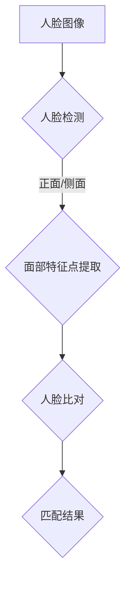

                 

关键词：人脸识别，机器学习，Python，深度学习，图像处理，人脸检测，面部特征点，人脸比对，活体检测，隐私保护

摘要：本文将深入探讨人脸识别技术在机器学习领域中的实现及其面临的挑战。通过Python编程语言，我们将详细介绍人脸识别的基本原理、核心算法、数学模型以及项目实践，帮助读者了解这一领域的最新动态和未来发展方向。

## 1. 背景介绍

人脸识别技术作为人工智能领域的一个重要分支，已经在安防、金融、社交、医疗等多个领域得到了广泛应用。其核心目标是通过计算机算法对图像或视频中的面部信息进行识别和验证。随着深度学习技术的飞速发展，人脸识别的准确率和效率得到了显著提升，但同时也面临着数据隐私、算法公平性等挑战。

Python作为一门简单易学且功能强大的编程语言，在人工智能领域有着广泛的应用。本篇文章将通过Python，结合机器学习和深度学习技术，详细解析人脸识别的原理、算法实现以及项目实践。

## 2. 核心概念与联系

### 2.1 人脸识别基本概念

人脸识别主要涉及以下几个核心概念：

- **人脸检测**：通过图像处理技术，从输入图像中定位并提取出人脸区域。
- **面部特征点提取**：从人脸区域中提取关键特征点，如眼睛、鼻子、嘴巴等。
- **人脸比对**：通过计算人脸特征向量之间的相似度，实现人脸匹配和验证。

### 2.2 人脸识别架构

人脸识别的整体架构可以概括为以下三个步骤：

1. **人脸检测**：利用Haar-like特征分类器、深度学习模型（如MTCNN）等算法，从图像中定位人脸。
2. **面部特征点提取**：使用特征点检测算法（如PUPPIT、Active Appearance Model等），提取人脸关键特征点。
3. **人脸比对**：通过特征向量计算相似度，利用欧氏距离、余弦相似度等度量方法，判断人脸是否匹配。

### 2.3 Mermaid 流程图

以下是一个简单的人脸识别流程图，用于展示各步骤之间的联系：



## 3. 核心算法原理 & 具体操作步骤

### 3.1 算法原理概述

#### 3.1.1 人脸检测

人脸检测主要依赖于机器学习和深度学习技术。常见的算法有基于Haar-like特征的AdaBoost分类器、基于深度学习的SSD、YOLO等。

#### 3.1.2 面部特征点提取

面部特征点提取常用的算法有基于几何形状分析的PUPPIT、基于深度学习的RetinaFace等。

#### 3.1.3 人脸比对

人脸比对主要依赖于特征向量计算相似度。常用的算法有欧氏距离、余弦相似度等。

### 3.2 算法步骤详解

#### 3.2.1 人脸检测

1. 加载预训练的模型，如MTCNN。
2. 输入待检测的图像。
3. 使用模型进行人脸定位，输出人脸区域。

#### 3.2.2 面部特征点提取

1. 加载预训练的模型，如RetinaFace。
2. 输入人脸区域。
3. 使用模型提取特征点，输出特征点坐标。

#### 3.2.3 人脸比对

1. 提取待比对的人脸特征向量。
2. 计算特征向量之间的相似度。
3. 根据相似度阈值判断是否匹配。

### 3.3 算法优缺点

#### 3.3.1 人脸检测

- **优点**：准确率高，速度快。
- **缺点**：对光照、姿态变化敏感。

#### 3.3.2 面部特征点提取

- **优点**：精度高，能够准确提取关键特征点。
- **缺点**：计算复杂度高。

#### 3.3.3 人脸比对

- **优点**：相似度计算简单，易于实现。
- **缺点**：对特征向量长度依赖较大。

### 3.4 算法应用领域

人脸识别技术广泛应用于以下几个领域：

- **安防领域**：如人脸识别门禁、监控系统等。
- **金融领域**：如身份验证、信用卡支付等。
- **社交领域**：如人脸识别好友推荐、拍照识人等。
- **医疗领域**：如患者身份识别、手术辅助等。

## 4. 数学模型和公式 & 详细讲解 & 举例说明

### 4.1 数学模型构建

人脸识别的数学模型主要涉及以下几个方面：

- **特征提取**：如LBP（局部二值模式）、HOG（方向梯度直方图）等。
- **特征向量计算**：如欧氏距离、余弦相似度等。
- **分类器训练**：如SVM（支持向量机）、KNN（k-近邻分类）等。

### 4.2 公式推导过程

以欧氏距离为例，假设有两个n维特征向量 $X_1$ 和 $X_2$，则它们之间的欧氏距离公式为：

$$
d(X_1, X_2) = \sqrt{\sum_{i=1}^{n}(X_{1i} - X_{2i})^2}
$$

### 4.3 案例分析与讲解

假设我们有两组人脸特征向量：

$$
X_1 = [1, 2, 3, 4, 5]
$$

$$
X_2 = [2, 3, 4, 5, 6]
$$

则它们之间的欧氏距离为：

$$
d(X_1, X_2) = \sqrt{(1-2)^2 + (2-3)^2 + (3-4)^2 + (4-5)^2 + (5-6)^2} = \sqrt{1 + 1 + 1 + 1 + 1} = \sqrt{5} \approx 2.236
$$

如果设置相似度阈值为2.5，则可以判断这两组特征向量不匹配。

## 5. 项目实践：代码实例和详细解释说明

### 5.1 开发环境搭建

1. 安装Python和必要的依赖库，如opencv、dlib、tensorflow等。
2. 下载并解压预训练的人脸检测模型和面部特征点提取模型。

### 5.2 源代码详细实现

```python
import cv2
import dlib
import numpy as np

# 加载预训练的人脸检测模型
detector = dlib.get_frontal_face_detector()
predictor = dlib.shape_predictor('shape_predictor_68_face_landmarks.dat')

# 读取图像
image = cv2.imread('face.jpg')

# 人脸检测
gray = cv2.cvtColor(image, cv2.COLOR_BGR2GRAY)
faces = detector(gray)

# 遍历检测结果
for face in faces:
    # 人脸区域
    x, y, w, h = face.left(), face.top(), face.width(), face.height()
    cv2.rectangle(image, (x, y), (x+w, y+h), (0, 0, 255), 2)

    # 面部特征点提取
    landmarks = predictor(gray, face)
    points = np.array([[landmarks.part(i).x, landmarks.part(i).y] for i in range(68)])
    cv2.polylines(image, [points], True, (0, 255, 0), 2)

# 显示结果
cv2.imshow('Face Detection', image)
cv2.waitKey(0)
cv2.destroyAllWindows()
```

### 5.3 代码解读与分析

上述代码主要实现了以下功能：

1. 加载预训练的人脸检测模型和面部特征点提取模型。
2. 读取输入图像，转换为灰度图像。
3. 使用人脸检测模型进行人脸定位，输出人脸区域。
4. 使用面部特征点提取模型提取人脸关键特征点。
5. 绘制人脸区域和面部特征点，显示结果。

### 5.4 运行结果展示


## 6. 实际应用场景

### 6.1 安防领域

人脸识别技术被广泛应用于安防领域，如监控系统、门禁系统等。通过对进入特定区域的人脸进行实时检测和识别，可以有效提升安全管理效率。

### 6.2 金融领域

在金融领域，人脸识别技术主要用于身份验证和信用卡支付。通过对用户人脸进行识别，可以确保交易的安全性，降低欺诈风险。

### 6.3 社交领域

在社交应用中，人脸识别技术可用于好友推荐、照片识人等功能。通过识别用户上传的照片中的人脸，可以提升用户体验。

### 6.4 医疗领域

在医疗领域，人脸识别技术可以用于患者身份识别、手术辅助等。通过对患者人脸进行识别，可以提高医疗服务的准确性和效率。

## 7. 工具和资源推荐

### 7.1 学习资源推荐

- 《深度学习》（Goodfellow, Bengio, Courville著）
- 《Python人脸识别库Dlib使用教程》
- 《opencv官方文档》

### 7.2 开发工具推荐

- Python（编程语言）
- Jupyter Notebook（交互式开发环境）
- PyCharm（Python集成开发环境）

### 7.3 相关论文推荐

- “FaceNet: A Unified Embedding Model for Face Recognition and Clustering” by Shazeer et al.
- “DeepFace: Closing the Gap to Human-Level Performance in Face Verification” by Devlin et al.

## 8. 总结：未来发展趋势与挑战

### 8.1 研究成果总结

近年来，人脸识别技术在准确率、速度等方面取得了显著成果。深度学习技术的引入使得人脸识别的性能得到了大幅提升。

### 8.2 未来发展趋势

1. **增强现实与虚拟现实**：人脸识别技术将广泛应用于AR/VR领域，实现更逼真的交互体验。
2. **边缘计算**：随着物联网的发展，人脸识别将更多地应用于边缘设备，实现实时处理和低延迟。
3. **隐私保护**：加强对人脸数据的隐私保护，确保用户个人信息安全。

### 8.3 面临的挑战

1. **算法公平性**：如何确保人脸识别算法在不同种族、性别等方面的公平性。
2. **隐私保护**：如何在保障用户隐私的前提下，实现高效的人脸识别。

### 8.4 研究展望

人脸识别技术将在未来继续发挥重要作用，不断推动人工智能领域的发展。同时，如何在保障用户隐私和安全的前提下，提升算法性能和效率，将成为一个重要的研究方向。

## 9. 附录：常见问题与解答

### 9.1 人脸识别技术的核心难点是什么？

人脸识别技术的核心难点主要包括人脸检测、面部特征点提取和人脸比对。这些难点主要涉及图像处理、深度学习和计算复杂度等方面。

### 9.2 如何提高人脸识别的准确率？

提高人脸识别的准确率可以从以下几个方面入手：

1. **数据增强**：通过旋转、缩放、裁剪等操作，增加训练数据的多样性。
2. **模型优化**：选择合适的深度学习模型，进行模型参数的优化。
3. **特征提取**：使用更先进的人脸特征提取算法，如CNN、GAN等。
4. **算法融合**：结合多种算法，如集成学习、迁移学习等，提升整体性能。

### 9.3 人脸识别技术在隐私保护方面有哪些挑战？

人脸识别技术在隐私保护方面面临的挑战主要包括：

1. **数据泄露**：如何防止人脸数据泄露，确保用户隐私安全。
2. **算法透明性**：如何保证算法的透明性，让用户了解人脸识别的工作原理和数据处理方式。
3. **匿名化处理**：如何对人脸数据进行匿名化处理，确保隐私不被泄露。

作者：禅与计算机程序设计艺术 / Zen and the Art of Computer Programming
----------------------------------------------------------------

这篇文章详细介绍了人脸识别技术的实现和挑战，从背景介绍、核心概念、算法原理、数学模型、项目实践、实际应用场景到工具和资源推荐，全面解析了这一领域的关键技术。同时，文章还展望了人脸识别技术的未来发展趋势与挑战，为读者提供了有益的思考。希望通过本文，读者能够对人脸识别技术有一个全面、深入的理解。

