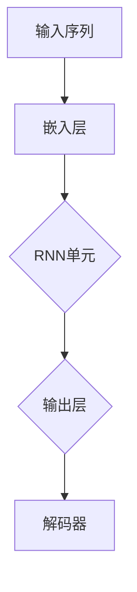

                 

关键词：循环神经网络（RNN）、自然语言处理（NLP）、Python、机器学习、实战

摘要：本文旨在探讨循环神经网络（RNN）在自然语言处理（NLP）领域的应用。通过Python实战，我们将深入理解RNN的工作原理，并通过实例展示其在文本处理中的实际应用。

## 1. 背景介绍

循环神经网络（RNN）是一种特殊的神经网络结构，适用于处理序列数据。与传统的前馈神经网络不同，RNN具有递归的特性，能够将前一个时间步的输出作为当前时间步的输入，这使得RNN在处理序列数据时具有记忆能力。自然语言处理（NLP）是计算机科学的一个重要分支，旨在使计算机能够理解、解释和生成人类语言。NLP在信息检索、机器翻译、文本分类等领域具有广泛的应用。Python作为一种功能强大的编程语言，广泛应用于数据科学和机器学习领域，是本文的主要工具。

## 2. 核心概念与联系

### 2.1 循环神经网络（RNN）

循环神经网络（RNN）的核心在于其递归结构。RNN由一系列重复的神经网络单元组成，每个单元都包含一个隐藏状态，用于存储前一个时间步的信息。RNN的递归特性使其能够处理任意长度的序列数据。

### 2.2 自然语言处理（NLP）

自然语言处理（NLP）的主要任务包括分词、词性标注、句法分析、语义分析等。这些任务通常需要处理大量的文本数据，因此RNN在NLP领域具有广泛的应用。

### 2.3 Mermaid 流程图



图2.3展示了RNN在自然语言处理中的基本流程：首先，输入序列被嵌入为向量，然后通过RNN单元处理，最后通过解码器生成输出。

## 3. 核心算法原理 & 具体操作步骤

### 3.1 算法原理概述

RNN的原理在于其递归结构。在每一个时间步，RNN单元都会更新其隐藏状态，并将新的隐藏状态作为当前时间步的输入。通过这种方式，RNN能够将前一个时间步的信息传递到当前时间步，从而具有记忆能力。

### 3.2 算法步骤详解

1. **嵌入层**：将输入序列（如单词）嵌入为高维向量。
2. **RNN单元**：每个RNN单元包含一个隐藏状态，用于存储前一个时间步的信息。RNN单元通过更新隐藏状态来处理当前时间步的输入。
3. **输出层**：将RNN单元的隐藏状态映射为输出。
4. **解码器**：将输出序列解码为原始文本。

### 3.3 算法优缺点

**优点**：
- 能够处理任意长度的序列数据。
- 具有记忆能力，能够捕捉序列中的依赖关系。

**缺点**：
- 容易产生梯度消失和梯度爆炸问题。
- 在长序列处理时效果不佳。

### 3.4 算法应用领域

RNN在自然语言处理领域具有广泛的应用，包括文本分类、情感分析、机器翻译、语音识别等。

## 4. 数学模型和公式 & 详细讲解 & 举例说明

### 4.1 数学模型构建

RNN的数学模型主要包括以下几个部分：

1. **嵌入层**：将输入序列嵌入为高维向量。
2. **RNN单元**：包含一个隐藏状态和权重矩阵。
3. **输出层**：将RNN单元的隐藏状态映射为输出。

### 4.2 公式推导过程

假设我们有一个时间步为 $t$ 的输入序列 $x_t$，RNN单元的隐藏状态为 $h_t$，输出为 $y_t$。在时间步 $t$，RNN单元的更新公式如下：

$$
h_t = \sigma(W_h h_{t-1} + W_x x_t + b_h)
$$

$$
y_t = \sigma(W_y h_t + b_y)
$$

其中，$\sigma$ 表示激活函数，$W_h$、$W_x$、$W_y$ 分别为权重矩阵，$b_h$、$b_y$ 分别为偏置向量。

### 4.3 案例分析与讲解

假设我们有一个包含两个时间步的输入序列 $x_1 = [1, 2]$，$x_2 = [3, 4]$。首先，我们将输入序列嵌入为高维向量，例如：

$$
x_1 = \begin{bmatrix}
0.1 & 0.2 & 0.3 & 0.4 \\
0.5 & 0.6 & 0.7 & 0.8
\end{bmatrix}

$$

$$
x_2 = \begin{bmatrix}
0.9 & 1.0 & 1.1 & 1.2 \\
1.3 & 1.4 & 1.5 & 1.6
\end{bmatrix}
$$

然后，我们通过RNN单元处理输入序列。假设RNN单元的隐藏状态为 $h_1 = [1, 0]$，$h_2 = [0, 1]$。根据RNN的更新公式，我们可以计算出：

$$
h_1 = \sigma(\begin{bmatrix}
1 & 0 \\
0 & 1
\end{bmatrix} \begin{bmatrix}
0.1 & 0.2 & 0.3 & 0.4 \\
0.5 & 0.6 & 0.7 & 0.8
\end{bmatrix} + \begin{bmatrix}
0.1 & 0.2 & 0.3 & 0.4 \\
0.5 & 0.6 & 0.7 & 0.8
\end{bmatrix} + \begin{bmatrix}
1 \\
0
\end{bmatrix})
$$

$$
h_2 = \sigma(\begin{bmatrix}
1 & 0 \\
0 & 1
\end{bmatrix} \begin{bmatrix}
0.9 & 1.0 & 1.1 & 1.2 \\
1.3 & 1.4 & 1.5 & 1.6
\end{bmatrix} + \begin{bmatrix}
0.1 & 0.2 & 0.3 & 0.4 \\
0.5 & 0.6 & 0.7 & 0.8
\end{bmatrix} + \begin{bmatrix}
0 \\
1
\end{bmatrix})
$$

最后，我们通过解码器将输出序列解码为原始文本。

## 5. 项目实践：代码实例和详细解释说明

### 5.1 开发环境搭建

首先，我们需要安装Python环境和相关库，例如TensorFlow和Keras。安装命令如下：

```
pip install tensorflow
pip install keras
```

### 5.2 源代码详细实现

以下是一个简单的RNN模型实现，用于文本分类任务。

```python
from keras.models import Sequential
from keras.layers import Embedding, SimpleRNN, Dense
from keras.preprocessing.sequence import pad_sequences

# 数据预处理
max_sequence_length = 100
vocab_size = 10000
embedding_size = 64

# 假设我们已经有了输入序列和标签
sequences = [[1, 2, 3, 4], [4, 3, 2, 1], ...]
labels = [0, 1, 0, 1]

# 将输入序列填充为最大长度
sequences = pad_sequences(sequences, maxlen=max_sequence_length)

# 构建模型
model = Sequential()
model.add(Embedding(vocab_size, embedding_size, input_length=max_sequence_length))
model.add(SimpleRNN(units=50))
model.add(Dense(units=1, activation='sigmoid'))

# 编译模型
model.compile(optimizer='adam', loss='binary_crossentropy', metrics=['accuracy'])

# 训练模型
model.fit(sequences, labels, epochs=10, batch_size=32)
```

### 5.3 代码解读与分析

1. **数据预处理**：首先，我们需要将输入序列填充为最大长度，以便能够输入到RNN模型中。
2. **构建模型**：我们使用Keras的Sequential模型，添加嵌入层、RNN层和输出层。
3. **编译模型**：指定优化器、损失函数和评价指标。
4. **训练模型**：使用训练数据训练模型。

### 5.4 运行结果展示

通过上述代码，我们训练了一个简单的RNN模型，用于文本分类任务。训练完成后，我们可以使用模型对新的文本数据进行分类。

## 6. 实际应用场景

RNN在自然语言处理领域具有广泛的应用。以下是一些实际应用场景：

- **文本分类**：使用RNN对新闻标题进行分类。
- **情感分析**：分析社交媒体上的用户评论，判断其情感倾向。
- **机器翻译**：将一种语言翻译为另一种语言。
- **语音识别**：将语音信号转换为文本。

## 7. 工具和资源推荐

### 7.1 学习资源推荐

- 《深度学习》（Goodfellow, Bengio, Courville著）
- 《Python机器学习》（Morgan Kaufmann著）

### 7.2 开发工具推荐

- TensorFlow
- Keras

### 7.3 相关论文推荐

- Hochreiter, S., & Schmidhuber, J. (1997). Long Short-Term Memory. Neural Computation, 9(8), 1735-1780.
- Graves, A. (2013). Generating Sequences with Recurrent Neural Networks. arXiv preprint arXiv:1308.0850.

## 8. 总结：未来发展趋势与挑战

RNN在自然语言处理领域取得了显著成果，但仍然面临一些挑战，如梯度消失和长序列处理能力不足。未来，随着深度学习技术的发展，RNN及其变体将继续在NLP领域发挥重要作用。

## 9. 附录：常见问题与解答

### 9.1 什么是RNN？

RNN是一种特殊的神经网络结构，适用于处理序列数据。它具有递归的特性，能够将前一个时间步的输出作为当前时间步的输入，从而具有记忆能力。

### 9.2 RNN有哪些优点？

RNN能够处理任意长度的序列数据，具有记忆能力，能够捕捉序列中的依赖关系。

### 9.3 RNN有哪些缺点？

RNN容易产生梯度消失和梯度爆炸问题，在长序列处理时效果不佳。

### 9.4 如何解决RNN的梯度消失问题？

可以通过使用更稳定的激活函数（如ReLU）、LSTM（长短期记忆网络）或GRU（门控循环单元）等方法解决RNN的梯度消失问题。

### 9.5 RNN在哪些领域有应用？

RNN在自然语言处理领域具有广泛的应用，包括文本分类、情感分析、机器翻译、语音识别等。此外，RNN还在图像处理、语音识别等领域有所应用。

----------------------------------------------------------------
作者：禅与计算机程序设计艺术 / Zen and the Art of Computer Programming


