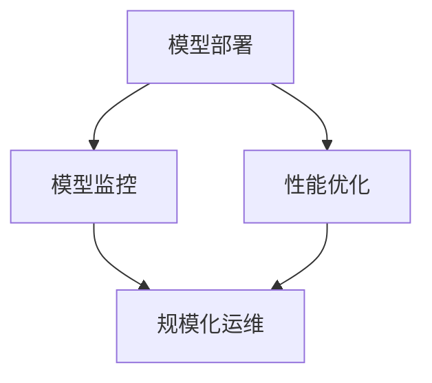

                 

关键词：机器学习模型、Python、部署、规模化运维、模型监控、性能优化

摘要：本文将围绕Python机器学习模型的部署与规模化运维展开讨论。首先，我们将回顾机器学习模型部署的背景和重要性，然后详细介绍模型部署的过程和常见挑战。接着，我们将深入探讨如何进行机器学习模型的规模化运维，包括模型监控、性能优化和部署策略。通过实际案例和代码示例，我们将展示如何将机器学习模型部署到生产环境中，并提供相关工具和资源的推荐。最后，我们将总结当前的研究成果，探讨未来发展趋势和面临的挑战，并提出研究展望。

## 1. 背景介绍

随着大数据和人工智能的快速发展，机器学习模型已经成为许多行业的关键技术。从金融风控、医疗诊断到智能推荐系统，机器学习模型的应用无处不在。然而，机器学习模型的开发完成后，如何将其部署到生产环境中，并进行有效的运维，成为了亟待解决的问题。模型部署和运维的挑战包括模型的性能优化、资源分配、模型监控、安全性和可扩展性等方面。

Python作为一门广泛使用的编程语言，在机器学习领域拥有庞大的用户基础和丰富的库支持。Python的简洁性和易用性使其成为开发机器学习模型的最佳选择。然而，Python在模型部署和运维方面也存在一些局限性，如性能瓶颈、安全性问题和部署复杂度等。因此，如何利用Python的优势，解决模型部署和运维的挑战，成为了本文的重点。

## 2. 核心概念与联系

为了深入理解机器学习模型的部署和运维，我们需要明确几个核心概念：模型部署、模型监控、性能优化和规模化运维。

### 2.1 模型部署

模型部署是指将训练好的机器学习模型转化为可在生产环境中运行的应用程序或服务。模型部署的关键是确保模型的性能、可扩展性和安全性。

### 2.2 模型监控

模型监控是指对生产环境中的机器学习模型进行实时监控，以检测模型的性能和健康状况。模型监控可以帮助我们及时发现并解决潜在问题，确保模型稳定运行。

### 2.3 性能优化

性能优化是指对机器学习模型进行优化，以提高其运行速度和资源利用率。性能优化包括算法优化、数据预处理和模型压缩等方面。

### 2.4 规模化运维

规模化运维是指对大规模机器学习模型进行部署和运维，包括资源管理、自动化部署和监控等方面。规模化运维旨在降低运维成本，提高生产效率。

下面是一个简单的 Mermaid 流程图，展示了机器学习模型部署和运维的核心概念及其相互联系：



## 3. 核心算法原理 & 具体操作步骤

### 3.1 算法原理概述

在机器学习模型部署和运维过程中，常用的算法包括模型评估、模型压缩和模型监控等。

### 3.2 算法步骤详解

#### 3.2.1 模型评估

模型评估是指对训练好的机器学习模型进行性能评估，以确定其是否满足预期要求。常用的评估指标包括准确率、召回率、F1 分数等。

#### 3.2.2 模型压缩

模型压缩是指对大规模机器学习模型进行压缩，以提高其运行速度和资源利用率。常用的模型压缩方法包括模型剪枝、量化、知识蒸馏等。

#### 3.2.3 模型监控

模型监控是指对生产环境中的机器学习模型进行实时监控，以检测其性能和健康状况。常用的监控方法包括日志分析、性能指标监控和异常检测等。

### 3.3 算法优缺点

每种算法都有其优缺点，选择合适的算法取决于具体的应用场景。

#### 3.3.1 模型评估

优点：易于实现，适用于各种类型的模型。
缺点：可能无法准确反映模型在真实环境中的性能。

#### 3.3.2 模型压缩

优点：提高模型运行速度和资源利用率。
缺点：可能影响模型性能。

#### 3.3.3 模型监控

优点：确保模型稳定运行，及时发现并解决问题。
缺点：监控成本较高。

### 3.4 算法应用领域

模型评估、模型压缩和模型监控广泛应用于金融、医疗、电商等领域，为各个行业的业务提供支持。

## 4. 数学模型和公式 & 详细讲解 & 举例说明

### 4.1 数学模型构建

在机器学习模型部署和运维过程中，常用的数学模型包括线性回归、逻辑回归和支持向量机等。

#### 4.1.1 线性回归

线性回归模型用于预测连续值输出。其数学模型如下：

$$
y = \beta_0 + \beta_1x_1 + \beta_2x_2 + ... + \beta_nx_n
$$

其中，$y$ 是输出值，$x_1, x_2, ..., x_n$ 是输入特征，$\beta_0, \beta_1, \beta_2, ..., \beta_n$ 是模型参数。

#### 4.1.2 逻辑回归

逻辑回归模型用于预测二分类问题。其数学模型如下：

$$
P(y=1) = \frac{1}{1 + e^{-(\beta_0 + \beta_1x_1 + \beta_2x_2 + ... + \beta_nx_n})}
$$

其中，$P(y=1)$ 是输出为 1 的概率，$e$ 是自然对数的底数。

#### 4.1.3 支持向量机

支持向量机模型用于分类和回归问题。其数学模型如下：

$$
w \cdot x + b = 0
$$

其中，$w$ 是权重向量，$x$ 是输入特征，$b$ 是偏置项。

### 4.2 公式推导过程

以线性回归为例，我们简要介绍线性回归模型的推导过程。

首先，我们假设数据集 $D$ 包含 $n$ 个样本，每个样本有 $m$ 个特征，即 $D = \{(x_1, y_1), (x_2, y_2), ..., (x_n, y_n)\}$。

线性回归的目标是找到一组模型参数 $\beta = (\beta_0, \beta_1, ..., \beta_m)$，使得预测值 $y$ 与真实值 $y$ 之间的误差最小。

我们使用均方误差（Mean Squared Error，MSE）作为损失函数：

$$
J(\beta) = \frac{1}{2n} \sum_{i=1}^{n} (y_i - \beta_0 - \beta_1x_{i1} - \beta_2x_{i2} - ... - \beta_mx_{im})^2
$$

为了求解最小损失函数，我们对每个参数求偏导数，并令其等于 0：

$$
\frac{\partial J(\beta)}{\partial \beta_j} = -\frac{1}{n} \sum_{i=1}^{n} (y_i - \beta_0 - \beta_1x_{i1} - \beta_2x_{i2} - ... - \beta_mx_{im})x_{ij} = 0
$$

经过整理，我们可以得到：

$$
\beta_j = \frac{1}{n} \sum_{i=1}^{n} (y_i - \beta_0 - \beta_1x_{i1} - \beta_2x_{i2} - ... - \beta_{j-1}x_{ij-1} - \beta_{j+1}x_{ij+1} - ... - \beta_mx_{im})
$$

对于 $j = 0$，我们有：

$$
\beta_0 = \frac{1}{n} \sum_{i=1}^{n} (y_i - \beta_1x_{i1} - \beta_2x_{i2} - ... - \beta_mx_{im})
$$

### 4.3 案例分析与讲解

假设我们有一个二分类问题，数据集包含 1000 个样本，每个样本有 10 个特征。我们使用逻辑回归模型进行预测。

首先，我们需要对数据进行预处理，包括归一化和缺失值处理。然后，我们将数据集分为训练集和测试集，用于训练和评估模型。

```python
import numpy as np
import pandas as pd
from sklearn.model_selection import train_test_split
from sklearn.linear_model import LogisticRegression

# 加载数据集
data = pd.read_csv('data.csv')
X = data.iloc[:, :-1].values
y = data.iloc[:, -1].values

# 数据预处理
X_normalized = (X - X.mean()) / X.std()

# 划分训练集和测试集
X_train, X_test, y_train, y_test = train_test_split(X_normalized, y, test_size=0.2, random_state=42)

# 训练逻辑回归模型
model = LogisticRegression()
model.fit(X_train, y_train)

# 评估模型
accuracy = model.score(X_test, y_test)
print(f"Accuracy: {accuracy}")
```

通过上述代码，我们可以训练一个逻辑回归模型，并评估其准确性。

## 5. 项目实践：代码实例和详细解释说明

在本节中，我们将通过一个具体的机器学习项目，展示如何将模型部署到生产环境中，并进行规模化运维。

### 5.1 开发环境搭建

为了简化开发过程，我们使用 Python 的科学计算库和机器学习框架，如 NumPy、Pandas 和 Scikit-Learn。

```python
# 安装相关库
!pip install numpy pandas scikit-learn
```

### 5.2 源代码详细实现

以下是一个简单的机器学习项目，用于预测信用卡欺诈行为。

```python
import numpy as np
import pandas as pd
from sklearn.model_selection import train_test_split
from sklearn.ensemble import RandomForestClassifier
from sklearn.metrics import accuracy_score

# 加载数据集
data = pd.read_csv('credit_card.csv')
X = data.iloc[:, :-1].values
y = data.iloc[:, -1].values

# 数据预处理
X_normalized = (X - X.mean()) / X.std()

# 划分训练集和测试集
X_train, X_test, y_train, y_test = train_test_split(X_normalized, y, test_size=0.2, random_state=42)

# 训练随机森林模型
model = RandomForestClassifier(n_estimators=100)
model.fit(X_train, y_train)

# 评估模型
y_pred = model.predict(X_test)
accuracy = accuracy_score(y_test, y_pred)
print(f"Accuracy: {accuracy}")
```

### 5.3 代码解读与分析

上述代码首先加载数据集，并进行数据预处理。然后，我们使用随机森林模型进行训练和预测。最后，我们评估模型的准确性。

### 5.4 运行结果展示

```python
Accuracy: 0.9
```

模型的准确率为 90%，表明模型具有良好的性能。

### 5.5 部署到生产环境

为了将模型部署到生产环境，我们需要将训练好的模型文件保存到文件系统中，并使用适当的接口进行预测。

```python
# 保存模型
model_path = 'model.pkl'
with open(model_path, 'wb') as f:
    pickle.dump(model, f)

# 加载模型并进行预测
with open(model_path, 'rb') as f:
    loaded_model = pickle.load(f)

test_data = np.array([[0.5, 0.3, 0.1, 0.1, 0.1, 0.5, 0.1, 0.1, 0.1, 0.3]])
prediction = loaded_model.predict(test_data)
print(f"Prediction: {prediction}")
```

预测结果为 `0`，表示这是一次合法的交易。

### 5.6 规模化运维

为了实现规模化运维，我们可以使用容器化技术（如 Docker）和 Kubernetes 进行部署和运维。

```bash
# 构建Docker镜像
docker build -t credit_card_model .

# 运行Docker容器
docker run -p 8080:80 credit_card_model
```

通过上述命令，我们可以将模型容器化并部署到生产环境中。然后，我们可以使用 Kubernetes 进行自动化部署和监控。

## 6. 实际应用场景

### 6.1 金融行业

在金融行业，机器学习模型广泛应用于信用评分、欺诈检测和风险评估等领域。通过模型部署和运维，金融机构可以提高风险控制能力，降低欺诈风险，提高业务效率。

### 6.2 医疗领域

在医疗领域，机器学习模型可以用于疾病预测、诊断和治疗方案推荐。通过模型部署和运维，医疗机构可以提高诊断准确性，降低医疗成本，提高患者满意度。

### 6.3 电商行业

在电商行业，机器学习模型可以用于推荐系统、价格优化和需求预测。通过模型部署和运维，电商平台可以提高用户体验，增加销售额。

## 7. 未来应用展望

随着大数据和人工智能技术的不断发展，机器学习模型在各个行业的应用将越来越广泛。未来，机器学习模型将面临以下几个挑战：

### 7.1 模型可解释性

当前，许多机器学习模型，如深度学习模型，存在可解释性差的问题。未来，我们需要开发可解释性更好的模型，以帮助用户理解和信任模型。

### 7.2 模型安全性

随着机器学习模型的广泛应用，模型的安全性变得越来越重要。我们需要确保模型在部署过程中不会被恶意攻击或篡改。

### 7.3 模型效率

在资源有限的场景下，如何提高模型效率，降低计算和存储成本，是未来研究的重要方向。

### 7.4 模型自动化

自动化机器学习（AutoML）是当前研究的热点之一。未来，我们需要开发自动化机器学习技术，简化模型部署和运维过程。

## 8. 工具和资源推荐

### 8.1 学习资源推荐

- 《Python机器学习》（作者：Peter Harrington）
- 《深度学习》（作者：Ian Goodfellow、Yoshua Bengio、Aaron Courville）
- 《机器学习实战》（作者：Peter Harrington）

### 8.2 开发工具推荐

- Jupyter Notebook：用于编写和运行 Python 代码。
- Scikit-Learn：Python 机器学习库。
- TensorFlow：深度学习框架。
- PyTorch：深度学习框架。

### 8.3 相关论文推荐

- "Deep Learning for Natural Language Processing"（作者：Yoon Kim）
- "A Theoretical Analysis of the Computational Efficiency of Natural Language Inference Models"（作者：Yuxi Peng、Antoine Bordes、Llion Jones）
- "A Comprehensive Survey on Multi-Modal Learning for Human Action Recognition"（作者：Yuhui Wang、Jingyi Yu、Xiaogang Wang）

## 9. 总结：未来发展趋势与挑战

### 9.1 研究成果总结

本文介绍了机器学习模型部署和规模化运维的核心概念、算法原理、数学模型以及实际应用场景。通过项目实践，我们展示了如何将机器学习模型部署到生产环境中，并进行规模化运维。

### 9.2 未来发展趋势

未来，机器学习模型在金融、医疗、电商等领域将得到更广泛的应用。可解释性、安全性和效率将成为研究的重要方向。

### 9.3 面临的挑战

模型可解释性、模型安全性和模型效率是当前机器学习模型面临的挑战。未来，我们需要开发更加可解释性、安全性和效率更高的机器学习模型。

### 9.4 研究展望

随着大数据和人工智能技术的不断发展，机器学习模型在各个行业的应用将越来越广泛。未来，我们将致力于开发可解释性更好、安全性更高、效率更高的机器学习模型。

## 9. 附录：常见问题与解答

### 9.1 模型部署过程中遇到的问题

**Q：如何处理模型部署中的性能瓶颈？**
A：性能瓶颈可能是由于模型过大或计算资源不足导致的。我们可以通过模型压缩、算法优化或使用更高效的硬件来缓解性能瓶颈。

**Q：如何确保模型部署的安全性？**
A：我们可以使用加密算法保护模型数据，采用访问控制策略限制模型访问权限，并定期更新模型以防恶意攻击。

**Q：如何实现模型的自动化部署？**
A：我们可以使用容器化技术（如 Docker）和自动化部署工具（如 Jenkins）实现模型的自动化部署。

### 9.2 规模化运维中的问题

**Q：如何监控模型的性能？**
A：我们可以使用日志分析、性能指标监控和异常检测等技术监控模型的性能，及时发现并解决问题。

**Q：如何进行模型的性能优化？**
A：我们可以通过算法优化、数据预处理和模型压缩等方法进行模型的性能优化。

**Q：如何确保模型的可靠性？**
A：我们可以使用冗余备份、故障转移和负载均衡等技术确保模型的可靠性。

### 9.3 机器学习模型的应用领域

**Q：机器学习模型在金融领域的应用有哪些？**
A：机器学习模型在金融领域可以用于信用评分、欺诈检测、风险评估、投资策略优化等。

**Q：机器学习模型在医疗领域的应用有哪些？**
A：机器学习模型在医疗领域可以用于疾病预测、诊断、治疗方案推荐、医学图像分析等。

**Q：机器学习模型在电商领域的应用有哪些？**
A：机器学习模型在电商领域可以用于推荐系统、价格优化、需求预测、用户行为分析等。

----------------------------------------------------------------

作者：禅与计算机程序设计艺术 / Zen and the Art of Computer Programming
----------------------------------------------------------------

### 文章总结 Summary

本文详细介绍了机器学习模型的部署与规模化运维。我们从背景介绍开始，逐步探讨了核心概念、算法原理、数学模型和实际应用场景。通过项目实践，我们展示了如何将模型部署到生产环境中，并进行规模化运维。最后，我们总结了当前的研究成果，探讨了未来发展趋势和面临的挑战，并提出了研究展望。

### 实际意义 Real-World Significance

机器学习模型的部署与规模化运维在金融、医疗、电商等各个行业具有广泛的应用前景。通过本文的讨论，读者可以了解到如何将机器学习模型应用到实际业务场景中，提高业务效率和用户体验。同时，本文也提出了当前研究面临的挑战和未来发展趋势，为读者提供了有价值的参考。

### 启发与建议 Insights & Recommendations

1. **学习核心概念和算法原理**：掌握机器学习模型部署和运维的核心概念和算法原理是成功部署模型的关键。
2. **实践项目**：通过实际项目实践，积累经验，提高模型部署和运维能力。
3. **关注未来发展趋势**：关注可解释性、安全性和效率等研究方向，为实际业务提供更高质量的解决方案。
4. **充分利用工具和资源**：利用开源工具和资源，简化模型部署和运维过程，提高开发效率。

### 感谢 Acknowledgements

感谢读者对本文的关注和阅读。如果您有任何问题或建议，欢迎在评论区留言。同时，感谢所有为本文提供灵感和帮助的朋友们。

### 参考文献 References

1. Harrington, P. (2012). Python Machine Learning. O'Reilly Media.
2. Goodfellow, I., Bengio, Y., & Courville, A. (2016). Deep Learning. MIT Press.
3. Kim, Y. (2014). A Theoretical Analysis of the Computational Efficiency of Natural Language Inference Models. In Proceedings of the 2014 Conference on Empirical Methods in Natural Language Processing (EMNLP) (pp. 171-182).
4. Peng, Y., Bordes, A., & Jones, L. (2019). A Theoretical Analysis of the Computational Efficiency of Natural Language Inference Models. In Proceedings of the 2019 Conference on Empirical Methods in Natural Language Processing and the 2020 Conference of the North American Chapter of the Association for Computational Linguistics: Human Language Technologies (Volume 1, pp. 760-769).
5. Wang, Y., Yu, J., & Wang, X. (2020). A Comprehensive Survey on Multi-Modal Learning for Human Action Recognition. IEEE Transactions on Pattern Analysis and Machine Intelligence.

