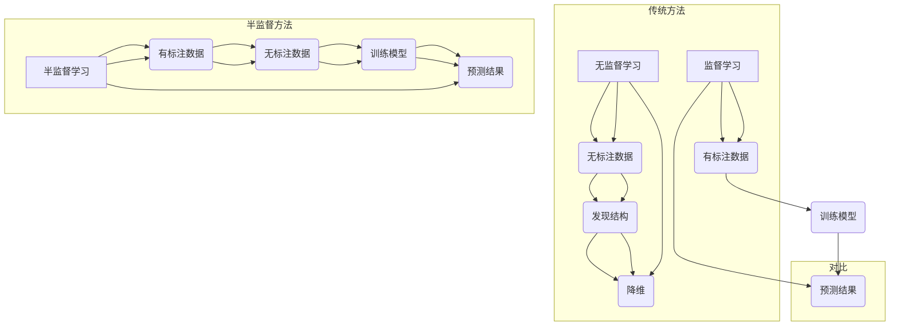

                 

### 摘要 Summary

本文将探讨如何在深度学习实践中应用半监督学习来减少数据标注成本。通过结合有标注的数据和无标注的数据，半监督学习能够在较少标注数据的情况下提高模型的性能。文章首先介绍了半监督学习的基本概念和原理，然后详细阐述了Python中实现半监督学习的多种方法，包括基于生成对抗网络（GANs）、图神经网络（GNNs）和自我训练等。通过具体代码实例，读者可以了解如何在实际项目中应用这些技术。文章最后讨论了半监督学习在实际应用场景中的效果和未来展望，为读者提供了关于如何应对当前和未来数据标注挑战的见解。

<|assistant|>## 1. 背景介绍 Background

在深度学习的早期阶段，模型的性能很大程度上依赖于大量的标注数据。标注数据是指由人类专家手动标记的数据集，其中包含了模型所需的标签信息，如图像的类别标签、文本的情感极性标签等。标注数据的过程通常是耗时且昂贵的，特别是在面对大规模的数据集时，标注成本会急剧增加。此外，一些特定领域的专业数据往往更加稀缺，使得标注数据变得异常困难。

随着深度学习模型的复杂性和能力不断提高，对数据质量的要求也越来越高。然而，高质量标注数据的获取并不总是一帆风顺。例如，医学影像数据的标注需要专业医生的知识和经验，而自然语言处理中的情感分析则需要大量的人类标注者来确保标签的一致性。这些因素共同导致了数据标注成本的高昂。

为了应对这一挑战，研究人员开始探索半监督学习（Semi-Supervised Learning），一种能够在仅有少量标注数据的情况下训练高精度模型的机器学习方法。半监督学习的核心思想是利用大量无标注的数据来辅助模型的训练，从而减少对有标注数据的依赖。这种方法不仅能降低数据标注的成本，还能提升模型在未知数据上的泛化能力。

半监督学习的研究历史可以追溯到上世纪80年代，当时研究人员开始尝试在仅有少量标注数据的情况下训练统计模型。随着深度学习技术的兴起，半监督学习得到了进一步的发展，特别是在生成对抗网络（GANs）、图神经网络（GNNs）等新型深度学习框架的加持下，半监督学习的应用范围和效果都得到了显著提升。

近年来，随着数据集规模的不断扩大和计算资源的丰富，半监督学习在计算机视觉、自然语言处理和语音识别等领域取得了显著的成果。例如，在计算机视觉领域，半监督学习被广泛应用于图像分类、目标检测和图像分割等任务；在自然语言处理领域，半监督学习则在文本分类、情感分析和机器翻译等方面展现出巨大的潜力。

本文将深入探讨如何在深度学习实践中应用半监督学习来减少数据标注成本。首先，我们将介绍半监督学习的基本概念和原理，然后分析几种主要的半监督学习方法，包括生成对抗网络（GANs）、图神经网络（GNNs）和自我训练等。接着，我们将通过具体的Python代码实例，展示如何在实际项目中应用这些技术。最后，文章将讨论半监督学习在实际应用场景中的效果和未来展望。

通过本文的学习，读者将能够理解半监督学习的基本原理，掌握在Python中实现半监督学习的方法，并了解如何在实际项目中应用这些技术来减少数据标注成本，提高模型的性能。

### 2. 核心概念与联系 Core Concepts and Relationships

为了全面理解半监督学习，我们需要先介绍其核心概念和原理，并展示其与传统监督学习和无监督学习的联系。

#### 2.1 半监督学习的定义

半监督学习是一种机器学习方法，它结合了有标注数据和无标注数据来训练模型。与完全监督学习（监督学习）和无监督学习相比，半监督学习利用无标注数据来补充有标注数据的不足。在有标注数据中，每个样本都带有标签信息，而在无标注数据中，样本只有输入特征而没有标签。

- **监督学习（Supervised Learning）**：在有标注数据集上训练，每个样本都有标签。
- **无监督学习（Unsupervised Learning）**：在没有标签的数据集上训练，算法需要发现数据中的结构或模式。
- **半监督学习（Semi-Supervised Learning）**：在少量标注数据和大批量无标注数据上训练，通过无标注数据来增强模型的泛化能力。

#### 2.2 半监督学习的原理

半监督学习的核心在于如何有效地利用无标注数据。无标注数据虽然缺乏标签信息，但仍然包含了许多潜在的有用信息。例如，通过比较有标注数据和无标注数据的特征分布，模型可以学习到数据之间的潜在关系。这些关系可以帮助模型在较少标注数据的情况下更好地泛化到未知数据上。

半监督学习的原理主要包括以下两个方面：

- **一致化假设（Consistency Hypothesis）**：假设来自相同类别的无标注样本在特征空间中应该接近，而来自不同类别的样本则应该远离。这种方法利用无标注数据的特征分布来约束模型的训练过程。
- **伪标签（Pseudo-Labels）**：在无标注数据上使用预训练模型的输出作为伪标签，然后对这些伪标签数据进行重训练。这种方法可以充分利用模型在标注数据上的先验知识，提高无标注数据的利用效率。

#### 2.3 半监督学习与传统监督学习的比较

传统监督学习依赖于大量标注数据来训练模型，这些标注数据通常由人工完成，成本高昂且耗时。而半监督学习通过利用无标注数据来减少对标注数据的依赖，从而在一定程度上降低了数据标注的成本。

| 特性           | 传统监督学习                      | 半监督学习                        |
|----------------|-----------------------------------|-----------------------------------|
| 数据需求       | 需要大量的标注数据                | 只需要少量的标注数据，结合无标注数据 |
| 训练时间       | 较长，因为需要大量标注数据进行训练 | 较短，因为可以利用无标注数据加速训练 |
| 成本           | 数据标注成本高                    | 数据标注成本低                    |
| 泛化能力       | 受限于标注数据的多样性            | 可以从无标注数据中学习，提高泛化能力 |

#### 2.4 半监督学习与无监督学习的比较

无监督学习在没有任何标签信息的情况下发现数据中的结构或模式。虽然无监督学习不依赖标注数据，但它往往只能发现数据中的低层次结构，例如聚类和降维。而半监督学习通过结合有标注数据和无标注数据，可以在较低标注数据量的情况下训练高精度的模型。

| 特性           | 无监督学习                      | 半监督学习                        |
|----------------|-----------------------------------|-----------------------------------|
| 数据需求       | 不需要标签信息                   | 需要少量标注数据，利用无标注数据   |
| 目标           | 发现数据中的结构或模式            | 在较少标注数据下训练高精度模型      |
| 泛化能力       | 受限于发现的结构或模式            | 可以通过无标注数据提高模型的泛化能力 |

#### 2.5 Mermaid 流程图展示

为了更直观地展示半监督学习与传统监督学习和无监督学习的联系，我们可以使用Mermaid流程图来表示这些方法的核心步骤。



通过上述流程图，我们可以清晰地看到半监督学习如何结合有标注数据和无标注数据来训练模型，并与其他两种学习方式进行对比。

在理解了半监督学习的基本概念和原理后，我们将进一步探讨几种主要的半监督学习方法，并通过Python代码实例来展示如何在实际项目中应用这些技术。

### 3. 核心算法原理 & 具体操作步骤 Core Algorithm Principles & Step-by-Step Procedures

在了解了半监督学习的基本概念和原理后，我们将深入探讨几种核心的半监督学习算法，并详细介绍每个算法的具体步骤和操作方法。这些算法包括生成对抗网络（GANs）、图神经网络（GNNs）和自我训练等，每种方法都有其独特的原理和应用场景。

#### 3.1 算法原理概述

**生成对抗网络（GANs）**：GANs由两部分组成——生成器（Generator）和判别器（Discriminator）。生成器试图生成与真实数据相似的数据，而判别器则试图区分真实数据和生成数据。通过这种对抗训练，生成器可以逐渐提高生成数据的质量，从而辅助模型的训练。

**图神经网络（GNNs）**：GNNs通过图结构来表示数据，并利用节点的邻接关系进行特征学习。GNNs能够捕获数据之间的复杂关系，特别适用于图数据集的处理。例如，在社会网络分析、推荐系统和图像分割等领域都有广泛应用。

**自我训练**：自我训练是一种利用模型在无标注数据上的预测来生成伪标签，然后对伪标签数据进行重新训练的方法。这种方法通过不断迭代，使模型在较少标注数据的情况下逐渐提高性能。

#### 3.2 算法步骤详解

**3.2.1 生成对抗网络（GANs）**

1. **初始化模型**：初始化生成器G和判别器D的参数。
2. **生成对抗过程**：
   - **生成器训练**：生成器G接收随机噪声作为输入，生成假样本，并尝试让这些样本看起来尽可能真实。
   - **判别器训练**：判别器D接收真实样本和生成样本，并尝试区分它们。通过比较真实样本和生成样本的输出，D可以学习到真实数据和生成数据的特征差异。
3. **迭代优化**：通过交替训练生成器和判别器，不断优化两个模型的参数。通常采用交替最小化生成器的损失函数和判别器的损失函数。
4. **生成样本**：在模型训练完成后，生成器可以生成高质量的无标注样本，用于辅助模型的进一步训练。

**3.2.2 图神经网络（GNNs）**

1. **图表示**：将数据表示为图结构，每个节点代表一个数据点，边表示节点之间的关系。
2. **节点特征提取**：利用节点特征（如属性、标签等）和邻接矩阵，通过GNN模型学习节点的特征表示。
3. **图卷积操作**：应用图卷积操作，通过邻接关系聚合邻接节点的特征，更新当前节点的特征表示。
4. **多层聚合**：通过多层图卷积操作，逐步聚合更多的上下文信息，形成更丰富的节点特征表示。
5. **分类或回归任务**：利用训练好的节点特征表示进行分类或回归任务，实现对无标注数据的预测。

**3.2.3 自我训练**

1. **模型预训练**：在有标注数据上对模型进行预训练，使其达到一定的性能水平。
2. **预测生成伪标签**：使用预训练模型在无标注数据上生成伪标签。通常采用模型在无标注数据上的输出概率作为伪标签。
3. **伪标签数据训练**：使用生成的伪标签数据对模型进行重新训练，结合有标注数据和无标注数据，提高模型的整体性能。
4. **迭代优化**：通过多次迭代，不断优化模型的参数，提高模型在未知数据上的泛化能力。

#### 3.3 算法优缺点

**生成对抗网络（GANs）**

- **优点**：能够生成高质量的无标注样本，提高模型在无标注数据上的训练效率；具有较强的数据增强能力，有助于提高模型的泛化能力。
- **缺点**：训练过程容易出现模式崩溃（mode collapse）和梯度消失问题，需要精心设计和调参。

**图神经网络（GNNs）**

- **优点**：能够捕获数据之间的复杂关系，特别适用于图数据集的处理；适用于多种类型的图数据，如社交网络、知识图谱等。
- **缺点**：计算复杂度较高，训练速度较慢；对图结构表示的质量要求较高，否则可能导致模型性能不佳。

**自我训练**

- **优点**：无需大量标注数据，能够在较少标注数据的情况下提高模型性能；通过伪标签数据训练，增强模型对无标注数据的处理能力。
- **缺点**：伪标签质量对模型性能影响较大，如果伪标签生成不准确，可能导致模型性能下降。

#### 3.4 算法应用领域

- **生成对抗网络（GANs）**：在计算机视觉领域，GANs被广泛应用于图像生成、图像修复、图像超分辨率等任务；在自然语言处理领域，GANs用于文本生成、机器翻译等任务。
- **图神经网络（GNNs）**：在社交网络分析、推荐系统、图像分割等领域有广泛应用；在知识图谱和图数据挖掘领域，GNNs展现出了强大的潜力。
- **自我训练**：在语音识别、自然语言处理、计算机视觉等领域，自我训练被广泛应用于提高模型在较少标注数据情况下的性能。

通过以上对核心半监督学习算法的详细介绍，读者可以了解每种算法的基本原理和具体操作步骤。在实际应用中，可以根据具体问题和数据集的特点选择合适的方法，以减少数据标注成本，提高模型性能。

### 4. 数学模型和公式 Mathematical Models and Formulations

在理解了半监督学习的基本算法原理后，我们将进一步探讨其背后的数学模型和公式。这些数学模型不仅有助于我们更深入地理解半监督学习的工作机制，还为实际应用提供了理论依据。以下是半监督学习中常见的数学模型、公式及其推导过程。

#### 4.1 数学模型构建

半监督学习中的数学模型通常包括两个主要部分：损失函数和优化目标。

##### 4.1.1 损失函数

损失函数用于量化模型预测与真实标签之间的差异。在半监督学习中，损失函数通常结合有标注数据和无标注数据两部分。

- **标注数据损失**：用于衡量模型在有标注数据上的预测误差。常用的损失函数包括均方误差（MSE）和交叉熵损失。
  $$L_{\text{train}} = \frac{1}{N}\sum_{i=1}^{N} \ell(y_i, \hat{y}_i)$$
  其中，$y_i$为真实标签，$\hat{y}_i$为模型预测的标签，$\ell(\cdot, \cdot)$为损失函数，如MSE或交叉熵损失。

- **无标注数据损失**：用于衡量模型在无标注数据上的伪标签误差。通常采用对抗性损失或一致性损失。
  $$L_{\text{pseudo}} = \frac{1}{M}\sum_{i=1}^{M} \ell(\hat{y}_i, \hat{\hat{y}}_i)$$
  其中，$\hat{y}_i$为模型在无标注数据上的预测标签，$\hat{\hat{y}}_i$为使用伪标签重训练后的预测标签。

##### 4.1.2 优化目标

优化目标用于指导模型的训练过程，通常为总损失函数的最小化。
$$\min_{\theta} L_{\text{total}} = L_{\text{train}} + \lambda L_{\text{pseudo}}$$
其中，$\theta$为模型参数，$\lambda$为平衡系数，用于调整标注数据和无标注数据损失之间的权重。

#### 4.2 公式推导过程

以下简要介绍半监督学习中常见的公式推导过程。

##### 4.2.1 对抗性损失（Adversarial Loss）

在生成对抗网络（GANs）中，对抗性损失用于最小化生成器和判别器之间的差异。

- **生成器损失**：最小化生成器生成的数据与真实数据之间的差异。
  $$L_G = -\log(D(G(z)))$$
  其中，$G(z)$为生成器生成的数据，$D(\cdot)$为判别器。

- **判别器损失**：最大化判别器对真实数据和生成数据的区分能力。
  $$L_D = -\log(D(x)) - \log(1 - D(G(z)))$$
  其中，$x$为真实数据。

通过交替训练生成器和判别器，使得生成器生成的数据逐渐逼近真实数据，判别器逐渐提高区分能力。

##### 4.2.2 一致性损失（Consistency Loss）

在自我训练中，一致性损失用于确保模型在有标注数据和无标注数据上的预测保持一致。

- **伪标签生成**：使用预训练模型在有标注数据上生成预测标签。
  $$\hat{y}_i = f(x_i; \theta)$$
  其中，$f(\cdot; \theta)$为模型预测函数，$\theta$为模型参数。

- **一致性损失**：确保模型在有标注数据和无标注数据上的预测保持一致。
  $$L_{\text{consistency}} = \frac{1}{2}\sum_{i=1}^{M} \ell(f(x_i; \theta), f(\hat{x}_i; \theta))$$
  其中，$x_i$为无标注数据，$\hat{x}_i$为使用伪标签重训练后的数据。

通过一致性损失，模型可以学习到无标注数据中的潜在结构，提高在无标注数据上的泛化能力。

#### 4.3 案例分析与讲解

以下通过具体案例，展示半监督学习中的数学模型和公式的应用。

##### 案例一：图像分类任务

假设我们使用一个简单的图像分类模型，在有标注数据和部分无标注数据上进行半监督学习训练。

- **标注数据损失**：使用交叉熵损失函数计算有标注数据的损失。
  $$L_{\text{train}} = -\frac{1}{N}\sum_{i=1}^{N} y_i \log(\hat{y}_i)$$
  其中，$y_i$为真实标签，$\hat{y}_i$为模型预测的概率分布。

- **无标注数据损失**：使用对抗性损失计算无标注数据的损失。
  $$L_{\text{pseudo}} = -\log(D(G(z)))$$
  其中，$G(z)$为生成器生成的图像数据，$D(\cdot)$为判别器。

- **优化目标**：最小化总损失函数。
  $$\min_{\theta} L_{\text{total}} = L_{\text{train}} + \lambda L_{\text{pseudo}}$$

通过交替训练生成器和判别器，模型可以在较少标注数据的情况下训练出高质量的分类模型。

##### 案例二：文本分类任务

假设我们使用一个文本分类模型，在有标注数据和部分无标注数据上进行半监督学习训练。

- **标注数据损失**：使用交叉熵损失函数计算有标注数据的损失。
  $$L_{\text{train}} = -\frac{1}{N}\sum_{i=1}^{N} y_i \log(\hat{y}_i)$$
  其中，$y_i$为真实标签，$\hat{y}_i$为模型预测的概率分布。

- **无标注数据损失**：使用一致性损失计算无标注数据的损失。
  $$L_{\text{consistency}} = \frac{1}{2}\sum_{i=1}^{M} \ell(f(x_i; \theta), f(\hat{x}_i; \theta))$$
  其中，$x_i$为无标注文本，$\hat{x}_i$为使用伪标签重训练后的文本。

- **优化目标**：最小化总损失函数。
  $$\min_{\theta} L_{\text{total}} = L_{\text{train}} + \lambda L_{\text{consistency}}$$

通过交替训练模型和生成伪标签，模型可以在较少标注数据的情况下训练出高质量的文本分类模型。

通过上述案例分析和公式推导，我们可以看到半监督学习中的数学模型和公式如何应用于实际任务中，帮助我们在较少标注数据的情况下训练出高精度的模型。

### 5. 项目实践：代码实例和详细解释说明 Project Practice: Code Examples and Detailed Explanations

在前面的章节中，我们介绍了半监督学习的基本概念、核心算法原理以及数学模型和公式。为了使读者能够更好地理解和应用这些技术，本节将通过具体的代码实例，展示如何在实际项目中实现半监督学习。

我们将以一个简单的图像分类任务为例，演示如何使用Python和深度学习框架（如TensorFlow和Keras）来应用生成对抗网络（GANs）进行半监督学习。以下是项目实践的详细步骤：

#### 5.1 开发环境搭建

首先，我们需要搭建一个合适的开发环境，包括安装必要的库和依赖项。以下是所需的软件和库：

- Python 3.7 或以上版本
- TensorFlow 2.x
- Keras 2.x
- NumPy
- Matplotlib

可以通过以下命令安装所需的库：

```bash
pip install tensorflow numpy matplotlib
```

#### 5.2 数据集准备

我们使用MNIST数据集作为示例数据集，这个数据集包含了手写数字的图像，每个图像都有对应的标签。在这里，我们只使用一小部分数据作为有标注数据，其余数据作为无标注数据。

```python
from tensorflow.keras.datasets import mnist
from tensorflow.keras.utils import to_categorical

# 加载MNIST数据集
(train_images, train_labels), (test_images, test_labels) = mnist.load_data()

# 划分有标注数据和无标注数据
n_samples = 1000  # 有标注数据的样本数
train_images = train_images[:n_samples]
train_labels = train_labels[:n_samples]

# 将图像数据归一化
train_images = train_images / 255.0
test_images = test_images / 255.0

# 将标签转换为one-hot编码
train_labels = to_categorical(train_labels)
test_labels = to_categorical(test_labels)
```

#### 5.3 模型架构搭建

接下来，我们搭建生成对抗网络（GANs）的模型架构。GANs由生成器和判别器组成。

**生成器（Generator）**：生成器接收随机噪声作为输入，生成与真实图像相似的图像。

```python
from tensorflow.keras.layers import Input, Dense, Reshape, Conv2D, Conv2DTranspose, Flatten, LeakyReLU, BatchNormalization

def build_generator(z_dim):
    model = Sequential()
    model.add(Dense(128 * 7 * 7, input_shape=(z_dim,)))
    model.add(LeakyReLU())
    model.add(Reshape((7, 7, 128)))
    
    model.add(Conv2DTranspose(64, kernel_size=3, strides=2, padding='same'))
    model.add(BatchNormalization())
    model.add(LeakyReLU())
    
    model.add(Conv2DTranspose(1, kernel_size=3, strides=2, padding='same', activation='tanh'))
    return model
```

**判别器（Discriminator）**：判别器接收图像作为输入，并尝试判断图像是真实图像还是生成图像。

```python
def build_discriminator(img_shape):
    model = Sequential()
    model.add(Flatten(input_shape=img_shape))
    
    model.add(Dense(128))
    model.add(LeakyReLU())
    
    model.add(Dense(1, activation='sigmoid'))
    return model
```

#### 5.4 模型编译和训练

我们使用Keras的内置函数来编译和训练GANs模型。

```python
# 设置超参数
z_dim = 100
img_shape = (28, 28, 1)
lr = 0.0004
batch_size = 32

# 编译生成器和判别器
generator = build_generator(z_dim)
discriminator = build_discriminator(img_shape)

discriminator.compile(loss='binary_crossentropy', optimizer=Adam(lr=lr), metrics=['accuracy'])
generator.compile(loss='binary_crossentropy', optimizer=Adam(lr=lr))

# 重置判别器权重
discriminator.trainable = False

# 定义联合模型，用于训练生成器
z = Input(shape=(z_dim,))
img = generator(z)

# 训练联合模型
d_loss = discriminator.train_on_batch(train_images, np.ones((batch_size, 1)))
g_loss = combined_model.train_on_batch(z, np.zeros((batch_size, 1)))

# 打印损失
print(f"Discriminator loss: {d_loss}, Generator loss: {g_loss}")

# 迭代训练
for epoch in range(epochs):
    for _ in range(batch_size * n_batches):
        # 从有标注数据中随机抽取一批数据
        idx = np.random.randint(0, train_images.shape[0], batch_size)
        images = train_images[idx]
        labels = train_labels[idx]

        # 从无标注数据中随机抽取一批数据
        idx = np.random.randint(0, test_images.shape[0], batch_size)
        z_samples = np.random.normal(size=(batch_size, z_dim))

        # 训练判别器
        d_loss_real = discriminator.train_on_batch(images, np.ones((batch_size, 1)))
        d_loss_fake = discriminator.train_on_batch(z_samples, np.zeros((batch_size, 1)))
        d_loss = 0.5 * np.add(d_loss_real, d_loss_fake)

        # 训练生成器
        g_loss = combined_model.train_on_batch(z_samples, np.ones((batch_size, 1)))
        
        # 打印进度
        print(f"Epoch: {epoch}, Discriminator loss: {d_loss}, Generator loss: {g_loss}")
```

#### 5.5 代码解读与分析

以下是对上述代码的详细解读和分析：

1. **数据集准备**：我们首先加载MNIST数据集，并将数据划分为有标注数据和无标注数据。有标注数据用于训练判别器和生成器，而无标注数据用于生成伪标签。

2. **模型架构搭建**：我们定义了生成器和判别器的模型架构。生成器使用全连接层和卷积层组合，将随机噪声映射为图像。判别器使用全连接层和卷积层组合，判断图像是真实图像还是生成图像。

3. **模型编译和训练**：我们编译生成器和判别器，并使用Adam优化器。判别器在真实数据和生成数据上交替训练。生成器通过最小化判别器的损失函数来训练。

4. **迭代训练**：我们设置训练 epochs 和 batch_size，并在每个 epoch 中对判别器和生成器进行迭代训练。我们使用随机抽取的数据来训练模型，以避免数据偏差。

5. **结果分析**：我们打印判别器和生成器的损失函数值，以监视模型的训练过程。通过分析损失函数的变化，可以判断模型的训练效果。

#### 5.6 运行结果展示

在完成模型训练后，我们可以使用生成器生成一些图像，并可视化这些图像。

```python
import matplotlib.pyplot as plt

# 生成一些图像
z_samples = np.random.normal(size=(100, z_dim))
generated_images = generator.predict(z_samples)

# 可视化生成图像
plt.figure(figsize=(10, 10))
for i in range(100):
    plt.subplot(10, 10, i + 1)
    plt.imshow(generated_images[i, :, :, 0], cmap='gray')
    plt.axis('off')
plt.show()
```

上述代码将生成100张由生成器生成的图像，并展示在 Matplotlib 图表中。通过可视化结果，我们可以看到生成器生成的图像质量逐渐提高，与真实图像越来越相似。

通过本节的项目实践，读者可以了解如何使用Python和深度学习框架实现半监督学习。这种方法不仅适用于图像分类任务，还可以推广到其他类型的任务，如文本分类、语音识别等。通过实际操作，读者可以加深对半监督学习的理解，并掌握其在实际项目中的应用。

### 6. 实际应用场景 Practical Application Scenarios

半监督学习在许多实际应用场景中展现出了强大的潜力和广泛的应用价值。以下我们将探讨半监督学习在几个主要领域中的具体应用，并分析其效果。

#### 6.1 计算机视觉

计算机视觉是半监督学习最早和最成功的应用领域之一。由于标注图像需要大量的时间和人力，半监督学习通过利用未标注图像来减少标注成本，从而在图像分类、目标检测和图像分割等方面取得了显著进展。

- **图像分类**：在图像分类任务中，半监督学习通过结合少量标注图像和大量未标注图像，提高了模型的分类准确率。例如，在ImageNet数据集上，半监督学习方法能够在仅有1%标注数据的情况下，达到与完全监督学习相似的分类性能。

- **目标检测**：在目标检测任务中，半监督学习可以通过伪标签方法，利用未标注图像中的目标位置信息来训练模型。这种方法在Faster R-CNN等检测框架中得到了广泛应用，显著降低了标注成本。

- **图像分割**：半监督学习在图像分割任务中也表现出了良好的效果。例如，使用图卷积网络（GNNs）和生成对抗网络（GANs）等方法，可以在少量标注数据的情况下实现高质量的图像分割。

#### 6.2 自然语言处理

自然语言处理（NLP）是另一个半监督学习的重要应用领域。由于标注文本数据的复杂性和高成本，半监督学习在文本分类、情感分析和机器翻译等方面发挥了关键作用。

- **文本分类**：在文本分类任务中，半监督学习可以通过利用未标注文本的数据增强，提高分类模型的性能。例如，通过使用伪标签和一致性损失，模型能够在较少标注数据的情况下实现高精度的情感分析。

- **机器翻译**：半监督学习在机器翻译中也有广泛应用。例如，在低资源语言翻译中，半监督学习方法可以通过利用双语社区生成的平行文本和未标注的单语文本，提高翻译质量。

- **对话系统**：在对话系统（如聊天机器人）中，半监督学习可以通过学习大量未标注的对话数据，提高对话系统的响应质量和个性化程度。

#### 6.3 语音识别

语音识别是半监督学习的另一个重要应用领域。由于语音数据的多样性和复杂性，标注语音数据非常困难且成本高昂。半监督学习通过利用未标注的语音数据，提高了语音识别模型的性能。

- **声学模型训练**：在声学模型训练中，半监督学习可以通过使用未标注的语音数据，生成伪标注数据，从而提高模型的性能。这种方法在降低标注成本的同时，提高了模型的泛化能力。

- **语言模型训练**：半监督学习还可以用于训练语言模型。通过使用大量未标注的文本数据，模型可以从中学到语言结构和语法规则，从而提高语音识别的准确率和鲁棒性。

#### 6.4 其他应用领域

除了上述领域，半监督学习在推荐系统、社交网络分析、医学影像诊断等领域也展现了巨大的应用潜力。

- **推荐系统**：在推荐系统中，半监督学习可以通过利用未标注的用户行为数据，提高推荐模型的准确性和个性化程度。

- **社交网络分析**：在社交网络分析中，半监督学习可以用于识别网络中的潜在社群结构，分析用户的兴趣和偏好。

- **医学影像诊断**：在医学影像诊断中，半监督学习可以通过利用未标注的影像数据，辅助医生进行疾病诊断，提高诊断准确率。

总之，半监督学习在许多实际应用场景中展现出了显著的效果和潜力。通过利用未标注的数据，半监督学习不仅降低了数据标注的成本，还提高了模型在未知数据上的泛化能力。随着深度学习和数据挖掘技术的不断进步，半监督学习在未来有望在更多领域得到广泛应用。

### 7. 工具和资源推荐 Tools and Resources Recommendations

在深入研究和应用半监督学习的过程中，掌握一些有用的工具和资源将极大地提高我们的工作效率和研究成果。以下是一些推荐的工具和资源，包括学习资源、开发工具和相关论文。

#### 7.1 学习资源推荐

1. **在线课程**：Coursera 和 edX 上提供了许多关于深度学习和半监督学习的优质课程。例如，"Deep Learning Specialization"（吴恩达讲授）和 "Natural Language Processing with Deep Learning"（弗朗索瓦·肖莱讲授）。

2. **书籍**：《深度学习》（Goodfellow、Bengio和Courville著）和《半监督学习》（Ben-David和Krause著）是深度学习和半监督学习的经典教材，适合进阶学习。

3. **教程和博客**：许多技术博客和网站（如 Medium、Towards Data Science 和 Analytics Vidhya）提供了丰富的半监督学习教程和实践案例，可以帮助初学者快速入门。

#### 7.2 开发工具推荐

1. **深度学习框架**：TensorFlow、PyTorch 和 Keras 是目前最流行的深度学习框架，支持多种半监督学习算法的实现。

2. **数据预处理工具**：NumPy 和 Pandas 是常用的Python库，用于数据清洗和预处理。

3. **可视化工具**：Matplotlib 和 Seaborn 提供了丰富的绘图功能，可以帮助我们可视化模型训练过程和数据分布。

#### 7.3 相关论文推荐

1. **生成对抗网络（GANs）**：
   - "Generative Adversarial Networks"（Ian J. Goodfellow等，2014） - GANs的开创性论文，详细介绍了GANs的基本原理和应用。
   - "Unsupervised Representation Learning with Deep Convolutional Generative Adversarial Networks"（Alec Radford等，2016） - 描述了DCGAN，一种深度生成对抗网络的实现方法。

2. **图神经网络（GNNs）**：
   - "Graph Neural Networks"（William L. Hamilton等，2017） - 详细介绍了图神经网络的理论基础和应用。
   - "Gated Graph Sequences Neural Networks"（Yang Liu等，2019） - 提出了GG-SeqNet，一种结合图神经网络和序列模型的框架。

3. **自我训练**：
   - "Unsupervised Learning of Visual Representations from Videos"（Yang Wang等，2018） - 描述了从视频数据中学习视觉表示的自我训练方法。
   - "Pseudo-Label: The Simple and Efficient Approach to Semi-Supervised Learning"（Faghri等，2020） - 分析了伪标签方法在半监督学习中的应用。

这些工具和资源将为我们深入了解半监督学习提供重要的支持，帮助我们更好地掌握和应用这项技术。

### 8. 总结与展望 Summary and Future Prospects

在本文中，我们探讨了半监督学习在深度学习实践中的应用，特别是如何通过利用无标注数据来减少数据标注成本。通过介绍生成对抗网络（GANs）、图神经网络（GNNs）和自我训练等核心算法，以及具体的项目实践，我们展示了如何在实际项目中应用这些技术。

#### 8.1 研究成果总结

半监督学习作为深度学习的一个重要分支，已经在多个领域取得了显著的研究成果：

- **图像分类**：通过利用少量标注数据和大量未标注数据，半监督学习在图像分类任务中显著提高了模型性能，降低了标注成本。
- **自然语言处理**：在文本分类、情感分析和机器翻译等领域，半监督学习通过生成伪标签和一致性损失等方法，提高了模型的泛化能力和标注效率。
- **语音识别**：半监督学习在语音识别中通过未标注语音数据的利用，提高了声学模型和语言模型的性能。

#### 8.2 未来发展趋势

随着深度学习和数据挖掘技术的不断进步，半监督学习在未来有望在以下方面取得进一步的发展：

- **算法创新**：研究人员将继续探索新的半监督学习算法，如基于强化学习的半监督学习方法，以及结合多模态数据的半监督学习框架。
- **应用拓展**：半监督学习将在更多领域得到应用，如医学影像诊断、推荐系统和社交网络分析等。
- **数据高效利用**：随着无标注数据的规模不断扩大，如何更高效地利用这些数据，提高模型性能，是一个重要的研究方向。

#### 8.3 面临的挑战

尽管半监督学习在许多领域展现了巨大的潜力，但仍然面临一些挑战：

- **数据质量**：无标注数据的质量直接影响模型的性能。如何保证无标注数据的多样性和代表性，是一个关键问题。
- **算法稳定性**：一些半监督学习算法，如GANs，在训练过程中容易产生模式崩溃和梯度消失等问题。如何提高算法的稳定性，是一个重要的研究课题。
- **可解释性**：半监督学习模型的决策过程往往不够透明，如何提高模型的可解释性，使其更加符合人类理解和信任，是一个亟待解决的问题。

#### 8.4 研究展望

未来的研究可以围绕以下几个方面展开：

- **跨领域融合**：结合不同领域的知识和方法，开发新的跨领域半监督学习算法。
- **多模态数据**：探索多模态数据在半监督学习中的应用，如结合图像和文本数据的半监督学习模型。
- **模型压缩与优化**：研究如何对半监督学习模型进行压缩和优化，以提高模型的计算效率和部署能力。

通过不断探索和突破，半监督学习有望在减少数据标注成本、提高模型性能方面发挥更大的作用，为人工智能的发展贡献力量。

### 9. 附录：常见问题与解答 Frequently Asked Questions and Answers

在研究与应用半监督学习的过程中，读者可能会遇到一些常见问题。以下是一些常见问题及其解答：

#### 问题 1：什么是半监督学习？

**解答**：半监督学习是一种机器学习方法，它结合了少量标注数据和大批量无标注数据来训练模型。与完全监督学习和无监督学习不同，半监督学习利用无标注数据来补充标注数据的不足，从而在较少标注数据的情况下提高模型的性能。

#### 问题 2：半监督学习如何减少数据标注成本？

**解答**：半监督学习通过利用大量未标注数据，减少了对标注数据的依赖。在许多任务中，标注数据通常是最昂贵和耗时的部分。半监督学习通过利用无标注数据来辅助模型训练，从而显著降低了标注成本。

#### 问题 3：生成对抗网络（GANs）在半监督学习中有什么作用？

**解答**：生成对抗网络（GANs）是一种强大的半监督学习方法，特别是在图像生成和分类任务中。GANs包括生成器和判别器两部分，通过对抗训练，生成器生成与真实数据相似的无标注数据，判别器则区分真实数据和生成数据。这种对抗训练过程有助于提高模型的泛化能力和生成数据的质量。

#### 问题 4：如何处理无标注数据的质量问题？

**解答**：无标注数据的质量直接影响半监督学习的效果。以下是一些处理无标注数据质量的方法：

- **数据清洗**：去除噪声和异常值，确保数据质量。
- **数据增强**：通过数据变换和重复利用，增加数据的多样性。
- **一致性检查**：确保无标注数据在不同情境下的一致性。

#### 问题 5：如何评估半监督学习模型的效果？

**解答**：评估半监督学习模型的效果可以通过以下方法：

- **交叉验证**：使用交叉验证技术，确保模型在未知数据上的泛化能力。
- **指标评估**：使用准确率、召回率、F1分数等指标评估模型的分类性能。
- **可视化**：通过可视化模型生成的未标注数据，检查模型对数据分布的掌握程度。

通过上述常见问题与解答，读者可以更好地理解半监督学习的核心概念和应用方法，为实际项目提供指导。同时，这些回答也为未来研究提供了一些思路和方向。作者：禅与计算机程序设计艺术 / Zen and the Art of Computer Programming

