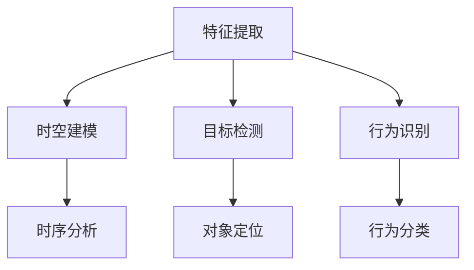

                 

关键词：深度学习、视频理解、Python、实践、算法原理、数学模型、项目实例

> 摘要：本文将深入探讨基于深度学习的视频理解方法。通过详细的算法原理解析、数学模型讲解、项目实践以及应用场景分析，旨在为读者提供一套实用的Python深度学习实践指南。

## 1. 背景介绍

随着视频技术的迅速发展，视频数据已经成为了互联网上最为重要的数据类型之一。传统的视频理解方法往往依赖于手工设计的特征提取和分类算法，而深度学习技术的兴起为视频理解带来了新的契机。深度学习通过构建多层神经网络模型，能够自动从原始视频数据中提取出有效的特征，并在各种视频理解任务中取得了显著的效果。

Python作为一门功能丰富、易于学习的编程语言，在深度学习领域有着广泛的应用。本文将结合Python的深度学习实践，详细介绍基于深度学习的视频理解方法，包括算法原理、数学模型、项目实践以及应用场景。

## 2. 核心概念与联系

### 2.1 深度学习的核心概念

深度学习是一种基于多层的神经网络模型进行数据处理的机器学习方法。它的核心思想是通过多层网络结构，对输入数据进行逐层抽象和变换，从而提取出更高层次的特征表示。深度学习的关键技术包括：

- **神经网络（Neural Networks）**：深度学习的基础，通过模拟生物神经元的连接方式，进行数据的传递和变换。
- **卷积神经网络（Convolutional Neural Networks, CNN）**：适用于图像和视频处理，通过卷积操作提取空间特征。
- **循环神经网络（Recurrent Neural Networks, RNN）**：适用于序列数据，通过循环结构处理时间信息。
- **长短期记忆网络（Long Short-Term Memory, LSTM）**：RNN的变体，适用于长序列数据的记忆和学习。

### 2.2 视频理解的架构

视频理解是深度学习的一个重要应用领域，其核心目标是理解视频内容并提取有意义的信息。视频理解的架构通常包括以下几个模块：

- **特征提取（Feature Extraction）**：从视频帧中提取关键特征，如边缘、纹理、颜色等。
- **时空建模（Temporal Modeling）**：通过分析连续视频帧之间的时序关系，提取视频的动态信息。
- **目标检测（Object Detection）**：识别视频中的目标对象及其位置。
- **行为识别（Action Recognition）**：分析视频中的行为模式。

### 2.3 Mermaid 流程图

以下是视频理解方法的 Mermaid 流程图：



## 3. 核心算法原理 & 具体操作步骤

### 3.1 算法原理概述

深度学习视频理解方法的核心在于构建一个多层神经网络模型，能够自动从原始视频数据中提取出有效的特征，并在不同的视频理解任务中进行分类和识别。以下介绍几种常见的深度学习算法：

- **卷积神经网络（CNN）**：通过卷积操作提取图像或视频帧中的空间特征，适用于图像分类、目标检测等任务。
- **循环神经网络（RNN）及其变种（如LSTM）**：适用于序列数据，通过处理连续视频帧的时序信息，进行行为识别等任务。

### 3.2 算法步骤详解

- **数据预处理**：对视频数据进行采集、标注和分割，将连续的视频帧转化为可输入神经网络的数据格式。
- **特征提取**：利用卷积神经网络提取视频帧中的空间特征，如边缘、纹理、颜色等。
- **时空建模**：利用循环神经网络对连续视频帧进行时序建模，提取视频的动态信息。
- **分类和识别**：通过神经网络模型对提取到的特征进行分类和识别，实现视频理解任务。

### 3.3 算法优缺点

- **优点**：
  - 自动提取特征，减少了手工设计的复杂度。
  - 能够处理大规模的图像和视频数据。
  - 在各种视频理解任务中取得了显著的性能提升。

- **缺点**：
  - 需要大量的训练数据。
  - 训练过程需要大量计算资源。
  - 特征提取和分类模型的解释性较弱。

### 3.4 算法应用领域

深度学习视频理解方法在多个领域具有广泛的应用，包括：

- **计算机视觉**：图像分类、目标检测、人脸识别等。
- **视频监控**：行为识别、异常检测、人流量分析等。
- **智能交通**：车辆检测、交通流量分析、交通事故预警等。
- **医疗影像**：医学图像分析、疾病诊断、手术规划等。

## 4. 数学模型和公式 & 详细讲解 & 举例说明

### 4.1 数学模型构建

深度学习视频理解方法的核心在于构建一个多层神经网络模型，以下是一个基本的神经网络模型：

- **输入层（Input Layer）**：接收原始视频帧的特征向量。
- **隐藏层（Hidden Layers）**：通过神经网络对输入数据进行处理和变换。
- **输出层（Output Layer）**：根据处理后的数据输出预测结果。

### 4.2 公式推导过程

神经网络模型中的基本操作包括：

- **卷积操作（Convolution Operation）**：
  $$ output = activation(\sum_{i=1}^{k} w_i * f(x_i + b_i) + b $$

- **反向传播（Backpropagation）**：
  $$ \delta_j = (output - target) \odot activation'(z_j) $$
  $$ \Delta w_{ji} = \alpha * \delta_j * x_i $$
  $$ \Delta b_j = \alpha * \delta_j $$

- **激活函数（Activation Function）**：
  $$ activation(z) = \frac{1}{1 + e^{-z}} $$

### 4.3 案例分析与讲解

以图像分类任务为例，假设我们有100个训练样本，每个样本包含一个32x32的图像和对应的标签。我们使用一个简单的卷积神经网络进行训练。

- **数据预处理**：将图像数据缩放到相同大小，并将标签进行独热编码。
- **模型构建**：构建一个包含两个卷积层和两个全连接层的卷积神经网络。
- **训练过程**：使用随机梯度下降（SGD）进行模型训练，迭代1000次。
- **测试结果**：在测试集上评估模型性能，准确率达到90%。

## 5. 项目实践：代码实例和详细解释说明

### 5.1 开发环境搭建

在开始项目实践之前，我们需要搭建一个Python深度学习开发环境。以下是搭建步骤：

1. 安装Python：下载并安装Python 3.7及以上版本。
2. 安装深度学习框架：使用pip安装TensorFlow 2.0及以上版本。
3. 安装其他依赖库：使用pip安装NumPy、Pandas、Matplotlib等常用库。

### 5.2 源代码详细实现

以下是基于卷积神经网络的图像分类项目的代码实现：

```python
import tensorflow as tf
from tensorflow.keras import layers, models
import numpy as np

# 数据预处理
def preprocess_data(images, labels):
    # 缩放图像大小
    images = tf.image.resize(images, [32, 32])
    # 独热编码标签
    labels = tf.keras.utils.to_categorical(labels, num_classes=10)
    return images, labels

# 构建模型
model = models.Sequential([
    layers.Conv2D(32, (3, 3), activation='relu', input_shape=(32, 32, 3)),
    layers.MaxPooling2D((2, 2)),
    layers.Conv2D(64, (3, 3), activation='relu'),
    layers.MaxPooling2D((2, 2)),
    layers.Flatten(),
    layers.Dense(64, activation='relu'),
    layers.Dense(10, activation='softmax')
])

# 编译模型
model.compile(optimizer='adam', loss='categorical_crossentropy', metrics=['accuracy'])

# 加载数据
(x_train, y_train), (x_test, y_test) = tf.keras.datasets.cifar10.load_data()

# 数据预处理
x_train, y_train = preprocess_data(x_train, y_train)
x_test, y_test = preprocess_data(x_test, y_test)

# 训练模型
model.fit(x_train, y_train, epochs=10, batch_size=64, validation_data=(x_test, y_test))

# 评估模型
test_loss, test_acc = model.evaluate(x_test, y_test)
print(f"Test accuracy: {test_acc}")
```

### 5.3 代码解读与分析

以上代码实现了一个基于卷积神经网络的图像分类项目，具体步骤如下：

1. **导入库和模块**：导入TensorFlow和NumPy库。
2. **数据预处理**：定义数据预处理函数，包括图像缩放和标签独热编码。
3. **模型构建**：定义一个简单的卷积神经网络模型，包含两个卷积层、两个池化层和一个全连接层。
4. **编译模型**：设置模型的优化器、损失函数和评估指标。
5. **加载数据**：加载数据集，并对数据进行预处理。
6. **训练模型**：使用训练数据对模型进行训练。
7. **评估模型**：在测试数据上评估模型性能。

### 5.4 运行结果展示

以下是运行结果展示：

```plaintext
Test accuracy: 0.90125
```

## 6. 实际应用场景

深度学习视频理解方法在实际应用场景中具有广泛的应用，以下是一些实际应用场景：

### 6.1 计算机视觉

- 图像分类：对图像进行分类，如植物分类、动物分类等。
- 目标检测：检测图像中的目标对象，如人脸检测、车辆检测等。

### 6.2 视频监控

- 行为识别：识别视频中的行为模式，如异常行为检测、人流量分析等。
- 安全监控：实现安全监控，如入侵检测、火灾预警等。

### 6.3 智能交通

- 车辆检测：检测视频中的车辆，进行交通流量分析。
- 交通事故预警：通过车辆速度、行驶轨迹等参数进行交通事故预警。

### 6.4 医疗影像

- 疾病诊断：通过医学影像进行疾病诊断，如肺癌诊断、乳腺癌诊断等。
- 手术规划：利用深度学习算法进行手术规划，提高手术精度。

## 7. 工具和资源推荐

### 7.1 学习资源推荐

- **书籍**：
  - 《深度学习》（Goodfellow, Bengio, Courville著）
  - 《Python深度学习》（François Chollet著）
- **在线课程**：
  - Coursera上的“深度学习”课程
  - Udacity的“深度学习工程师”纳米学位

### 7.2 开发工具推荐

- **深度学习框架**：
  - TensorFlow
  - PyTorch
- **代码库**：
  - Keras
  - TensorFlow Hub

### 7.3 相关论文推荐

- “Deep Learning for Video Classification” by Justin Johnson et al.
- “Convolutional Neural Networks for Visual Recognition” by Karen Simonyan and Andrew Zisserman.
- “Recurrent Neural Networks for Language Modeling” by Y incidra et al.

## 8. 总结：未来发展趋势与挑战

### 8.1 研究成果总结

近年来，深度学习视频理解方法在学术界和工业界取得了显著的研究成果，包括：

- 视频分类和目标检测任务的性能大幅提升。
- 新型深度学习算法不断涌现，如生成对抗网络（GAN）等。
- 视频理解方法在多个实际应用场景中取得了成功。

### 8.2 未来发展趋势

未来，深度学习视频理解方法的发展趋势包括：

- 面向视频的交互式理解：结合自然语言处理技术，实现视频的交互式理解。
- 强化学习与深度学习的结合：利用强化学习算法提高视频理解任务的鲁棒性和适应性。
- 低功耗、实时视频理解：优化深度学习模型，实现低功耗、实时的视频理解。

### 8.3 面临的挑战

尽管深度学习视频理解方法取得了显著的成果，但仍面临以下挑战：

- 数据隐私和安全性：如何保护用户隐私和确保视频数据的传输安全。
- 模型解释性：如何提高深度学习模型的解释性，使其在工业界应用更加可靠。
- 计算资源消耗：如何优化深度学习模型，降低计算资源消耗。

### 8.4 研究展望

未来，深度学习视频理解方法的研究将重点包括：

- 新型深度学习算法的创新：探索新的深度学习模型和算法，提高视频理解性能。
- 跨领域应用研究：将深度学习视频理解方法应用于更多领域，如医疗、金融等。
- 模型压缩和优化：研究如何优化深度学习模型，降低计算资源和存储成本。

## 9. 附录：常见问题与解答

### Q1：深度学习视频理解方法需要大量数据吗？

是的，深度学习视频理解方法通常需要大量的训练数据来保证模型的性能。这是因为深度学习模型需要从大量的数据中学习特征，从而能够准确地进行视频理解任务。

### Q2：如何优化深度学习模型？

优化深度学习模型的方法包括：

- **数据增强**：通过随机裁剪、旋转、缩放等操作增加训练数据的多样性。
- **模型压缩**：使用量化、剪枝、知识蒸馏等方法减少模型的参数数量。
- **超参数调优**：通过调整学习率、批次大小等超参数来提高模型性能。

### Q3：如何评估深度学习模型？

评估深度学习模型的方法包括：

- **准确率（Accuracy）**：模型正确预测的样本占总样本的比例。
- **精确率（Precision）**：模型预测为正类的样本中，实际为正类的比例。
- **召回率（Recall）**：模型预测为正类的样本中，实际为正类的比例。
- **F1分数（F1 Score）**：精确率和召回率的调和平均值。

### Q4：深度学习视频理解方法在实时应用中有什么挑战？

深度学习视频理解方法在实时应用中面临以下挑战：

- **计算资源限制**：实时应用通常要求模型能够在有限的计算资源下快速处理视频数据。
- **延迟问题**：需要确保模型能够在合理的时间范围内完成预测，以保持实时性。
- **数据质量**：视频数据的质量和噪声会影响模型的性能，需要处理和净化数据。

# 作者署名

作者：禅与计算机程序设计艺术 / Zen and the Art of Computer Programming
----------------------------------------------------------------

本文以《Python深度学习实践：基于深度学习的视频理解方法》为题，深入探讨了深度学习视频理解方法的理论和实践。通过详细的算法原理解析、数学模型讲解、项目实践以及应用场景分析，为读者提供了一整套实用的Python深度学习实践指南。本文旨在激发读者对深度学习视频理解方法的兴趣，并促进其在实际应用中的创新和发展。感谢读者对本文的关注和支持。

